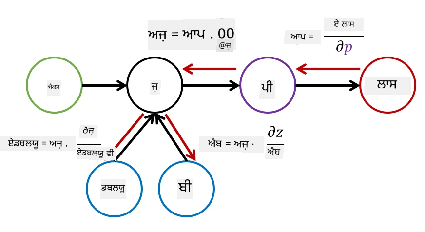

# ਨਿਊਰਲ ਨੈਟਵਰਕਸ ਦਾ ਪਰਚੇਅ. ਮਲਟੀ-ਲੇਅਰਡ ਪਰਸੈਪਟ੍ਰਾਨ

ਪਿਛਲੇ ਭਾਗ ਵਿੱਚ, ਤੁਸੀਂ ਸਭ ਤੋਂ ਸਧਾਰਨ ਨਿਊਰਲ ਨੈਟਵਰਕ ਮਾਡਲ - ਇੱਕ-ਲੇਅਰਡ ਪਰਸੈਪਟ੍ਰਾਨ, ਜੋ ਕਿ ਇੱਕ ਰੇਖੀ ਦੋ-ਕਲਾਸ ਵਰਗੀਕਰਨ ਮਾਡਲ ਹੈ, ਬਾਰੇ ਸਿੱਖਿਆ।

ਇਸ ਭਾਗ ਵਿੱਚ ਅਸੀਂ ਇਸ ਮਾਡਲ ਨੂੰ ਇੱਕ ਹੋਰ ਲਚਕਦਾਰ ਢਾਂਚੇ ਵਿੱਚ ਵਧਾਉਣ ਜਾ ਰਹੇ ਹਾਂ, ਜੋ ਸਾਨੂੰ ਇਹ ਕਰਨ ਦੀ ਆਗਿਆ ਦੇਵੇਗਾ:

* **ਮਲਟੀ-ਕਲਾਸ ਵਰਗੀਕਰਨ** ਕਰਨ ਦੇ ਯੋਗ ਹੋਣਾ, ਦੋ-ਕਲਾਸ ਦੇ ਇਲਾਵਾ
* **ਰੈਗਰੈਸ਼ਨ ਸਮੱਸਿਆਵਾਂ** ਹੱਲ ਕਰਨ ਦੇ ਯੋਗ ਹੋਣਾ, ਵਰਗੀਕਰਨ ਦੇ ਇਲਾਵਾ
* ਉਹ ਕਲਾਸਾਂ ਵੱਖ ਕਰਨਾ ਜੋ ਰੇਖੀ ਤੌਰ 'ਤੇ ਵੱਖ ਨਹੀਂ ਕੀਤੀਆਂ ਜਾ ਸਕਦੀਆਂ

ਅਸੀਂ ਆਪਣਾ ਮਾਡੂਲਰ ਢਾਂਚਾ ਪਾਇਥਨ ਵਿੱਚ ਵੀ ਵਿਕਸਿਤ ਕਰਾਂਗੇ ਜੋ ਸਾਨੂੰ ਵੱਖ-ਵੱਖ ਨਿਊਰਲ ਨੈਟਵਰਕ ਆਰਕੀਟੈਕਚਰ ਬਣਾਉਣ ਦੀ ਆਗਿਆ ਦੇਵੇਗਾ।

## [ਪ੍ਰੀ-ਲੈਕਚਰ ਕਵਿਜ਼](https://ff-quizzes.netlify.app/en/ai/quiz/7)

## ਮਸ਼ੀਨ ਲਰਨਿੰਗ ਦੀ ਫਾਰਮਲਾਈਜ਼ੇਸ਼ਨ

ਆਓ ਮਸ਼ੀਨ ਲਰਨਿੰਗ ਦੀ ਸਮੱਸਿਆ ਨੂੰ ਫਾਰਮਲਾਈਜ਼ ਕਰਕੇ ਸ਼ੁਰੂ ਕਰੀਏ। ਮੰਨ ਲਓ ਕਿ ਸਾਡੇ ਕੋਲ ਇੱਕ ਟ੍ਰੇਨਿੰਗ ਡੇਟਾਸੈਟ **X** ਹੈ ਜਿਸਦੇ ਲੇਬਲ **Y** ਹਨ, ਅਤੇ ਸਾਨੂੰ ਇੱਕ ਮਾਡਲ *f* ਬਣਾਉਣ ਦੀ ਲੋੜ ਹੈ ਜੋ ਸਭ ਤੋਂ ਸਹੀ ਅਨੁਮਾਨ ਲਗਾਏ। ਅਨੁਮਾਨਾਂ ਦੀ ਗੁਣਵੱਤਾ ਨੂੰ **ਲਾਸ ਫੰਕਸ਼ਨ** &lagran; ਦੁਆਰਾ ਮਾਪਿਆ ਜਾਂਦਾ ਹੈ। ਹੇਠਾਂ ਦਿੱਤੇ ਲਾਸ ਫੰਕਸ਼ਨ ਅਕਸਰ ਵਰਤੇ ਜਾਂਦੇ ਹਨ:

* ਰੈਗਰੈਸ਼ਨ ਸਮੱਸਿਆ ਲਈ, ਜਦੋਂ ਸਾਨੂੰ ਇੱਕ ਨੰਬਰ ਦੀ ਭਵਿੱਖਵਾਣੀ ਕਰਨ ਦੀ ਲੋੜ ਹੁੰਦੀ ਹੈ, ਅਸੀਂ **ਐਬਸੋਲਿਊਟ ਐਰਰ** &sum;i|f(x(i))-y(i)| ਜਾਂ **ਸਕਵੇਅਰਡ ਐਰਰ** &sum;i(f(x(i))-y(i))2 ਵਰਤ ਸਕਦੇ ਹਾਂ।
* ਵਰਗੀਕਰਨ ਲਈ, ਅਸੀਂ **0-1 ਲਾਸ** (ਜੋ ਅਸਲ ਵਿੱਚ ਮਾਡਲ ਦੀ **ਸਹੀਤਾ** ਦੇ ਬਰਾਬਰ ਹੈ) ਜਾਂ **ਲੌਜਿਸਟਿਕ ਲਾਸ** ਵਰਤਦੇ ਹਾਂ।

ਇੱਕ-ਲੇਅਰਡ ਪਰਸੈਪਟ੍ਰਾਨ ਲਈ, ਫੰਕਸ਼ਨ *f* ਨੂੰ ਇੱਕ ਰੇਖੀ ਫੰਕਸ਼ਨ *f(x)=wx+b* ਵਜੋਂ ਪਰਿਭਾਸ਼ਿਤ ਕੀਤਾ ਗਿਆ ਸੀ (ਇੱਥੇ *w* ਭਾਰ ਮੈਟ੍ਰਿਕਸ ਹੈ, *x* ਇਨਪੁਟ ਫੀਚਰਜ਼ ਦਾ ਵੇਕਟਰ ਹੈ, ਅਤੇ *b* ਬਾਇਸ ਵੇਕਟਰ ਹੈ)। ਵੱਖ-ਵੱਖ ਨਿਊਰਲ ਨੈਟਵਰਕ ਆਰਕੀਟੈਕਚਰਜ਼ ਲਈ, ਇਹ ਫੰਕਸ਼ਨ ਹੋਰ ਜਟਿਲ ਰੂਪ ਲੈ ਸਕਦਾ ਹੈ।

> ਵਰਗੀਕਰਨ ਦੇ ਮਾਮਲੇ ਵਿੱਚ, ਅਕਸਰ ਇਹ ਚਾਹੁੰਦੇ ਹਾਂ ਕਿ ਨੈਟਵਰਕ ਆਉਟਪੁਟ ਵਜੋਂ ਸੰਬੰਧਿਤ ਕਲਾਸਾਂ ਦੀ ਸੰਭਾਵਨਾ ਪ੍ਰਾਪਤ ਹੋਵੇ। ਅਨਿਯਮਿਤ ਨੰਬਰਾਂ ਨੂੰ ਸੰਭਾਵਨਾਵਾਂ ਵਿੱਚ ਬਦਲਣ ਲਈ (ਜਿਵੇਂ ਕਿ ਆਉਟਪੁਟ ਨੂੰ ਨਾਰਮਲਾਈਜ਼ ਕਰਨ ਲਈ), ਅਸੀਂ ਅਕਸਰ **ਸੌਫਟਮੈਕਸ** ਫੰਕਸ਼ਨ &sigma; ਵਰਤਦੇ ਹਾਂ, ਅਤੇ ਫੰਕਸ਼ਨ *f* *f(x)=&sigma;(wx+b)* ਬਣ ਜਾਂਦਾ ਹੈ।

ਉਪਰ ਦਿੱਤੀ *f* ਦੀ ਪਰਿਭਾਸ਼ਾ ਵਿੱਚ, *w* ਅਤੇ *b* ਨੂੰ **ਪੈਰਾਮੀਟਰਜ਼** &theta;=⟨*w,b*⟩ ਕਿਹਾ ਜਾਂਦਾ ਹੈ। ਦਿੱਤੇ ਗਏ ਡੇਟਾਸੈਟ ⟨**X**,**Y**⟩ ਦੇ ਅਧਾਰ 'ਤੇ, ਅਸੀਂ ਪੂਰੇ ਡੇਟਾਸੈਟ 'ਤੇ ਕੁੱਲ ਗਲਤੀ ਨੂੰ ਪੈਰਾਮੀਟਰਜ਼ &theta; ਦੇ ਇੱਕ ਫੰਕਸ਼ਨ ਵਜੋਂ ਗਣਨਾ ਕਰ ਸਕਦੇ ਹਾਂ।

> ✅ **ਨਿਊਰਲ ਨੈਟਵਰਕ ਟ੍ਰੇਨਿੰਗ ਦਾ ਉਦੇਸ਼ ਪੈਰਾਮੀਟਰਜ਼ &theta; ਨੂੰ ਬਦਲ ਕੇ ਗਲਤੀ ਨੂੰ ਘਟਾਉਣਾ ਹੈ।**

## ਗ੍ਰੇਡੀਅੰਟ ਡਿਸੈਂਟ ਅਪਟੀਮਾਈਜ਼ੇਸ਼ਨ

ਫੰਕਸ਼ਨ ਅਪਟੀਮਾਈਜ਼ੇਸ਼ਨ ਦਾ ਇੱਕ ਪ੍ਰਸਿੱਧ ਤਰੀਕਾ **ਗ੍ਰੇਡੀਅੰਟ ਡਿਸੈਂਟ** ਹੈ। ਇਸ ਵਿਚਾਰਧਾਰਾ ਇਹ ਹੈ ਕਿ ਅਸੀਂ ਲਾਸ ਫੰਕਸ਼ਨ ਦਾ ਡੈਰੀਵੇਟਿਵ (ਮਲਟੀ-ਡਾਇਮੈਂਸ਼ਨਲ ਮਾਮਲੇ ਵਿੱਚ **ਗ੍ਰੇਡੀਅੰਟ** ਕਿਹਾ ਜਾਂਦਾ ਹੈ) ਪੈਰਾਮੀਟਰਜ਼ ਦੇ ਸਬੰਧ ਵਿੱਚ ਗਣਨਾ ਕਰ ਸਕਦੇ ਹਾਂ, ਅਤੇ ਪੈਰਾਮੀਟਰਜ਼ ਨੂੰ ਇਸ ਤਰੀਕੇ ਨਾਲ ਬਦਲ ਸਕਦੇ ਹਾਂ ਕਿ ਗਲਤੀ ਘਟ ਜਾਵੇ। ਇਸ ਨੂੰ ਹੇਠਾਂ ਦਿੱਤੇ ਤਰੀਕੇ ਨਾਲ ਫਾਰਮਲਾਈਜ਼ ਕੀਤਾ ਜਾ ਸਕਦਾ ਹੈ:

* ਪੈਰਾਮੀਟਰਜ਼ ਨੂੰ ਕੁਝ ਰੈਂਡਮ ਮੁੱਲਾਂ w(0), b(0) ਨਾਲ ਸ਼ੁਰੂ ਕਰੋ।
* ਹੇਠਾਂ ਦਿੱਤਾ ਕਦਮ ਕਈ ਵਾਰ ਦੁਹਰਾਓ:
    - w(i+1) = w(i)-&eta;&part;&lagran;/&part;w
    - b(i+1) = b(i)-&eta;&part;&lagran;/&part;b

ਟ੍ਰੇਨਿੰਗ ਦੌਰਾਨ, ਅਪਟੀਮਾਈਜ਼ੇਸ਼ਨ ਕਦਮ ਪੂਰੇ ਡੇਟਾਸੈਟ ਨੂੰ ਧਿਆਨ ਵਿੱਚ ਰੱਖ ਕੇ ਗਣਨਾ ਕੀਤੇ ਜਾਣੇ ਚਾਹੀਦੇ ਹਨ (ਯਾਦ ਰੱਖੋ ਕਿ ਲਾਸ ਸਾਰੇ ਟ੍ਰੇਨਿੰਗ ਨਮੂਨਿਆਂ ਦੇ ਜਮ੍ਹਾਂ ਦੇ ਰੂਪ ਵਿੱਚ ਗਣਨਾ ਕੀਤੀ ਜਾਂਦੀ ਹੈ)। ਹਾਲਾਂਕਿ, ਅਸਲ ਜ਼ਿੰਦਗੀ ਵਿੱਚ ਅਸੀਂ ਡੇਟਾਸੈਟ ਦੇ ਛੋਟੇ ਹਿੱਸੇ ਲੈਂਦੇ ਹਾਂ, ਜਿਨ੍ਹਾਂ ਨੂੰ **ਮਿਨੀਬੈਚਜ਼** ਕਿਹਾ ਜਾਂਦਾ ਹੈ, ਅਤੇ ਡੇਟਾ ਦੇ ਇੱਕ ਸਬਸੈਟ ਦੇ ਅਧਾਰ 'ਤੇ ਗ੍ਰੇਡੀਅੰਟ ਗਣਨਾ ਕਰਦੇ ਹਾਂ। ਕਿਉਂਕਿ ਸਬਸੈਟ ਹਰ ਵਾਰ ਰੈਂਡਮ ਤੌਰ 'ਤੇ ਲਿਆ ਜਾਂਦਾ ਹੈ, ਇਸ ਤਰੀਕੇ ਨੂੰ **ਸਟੋਕੈਸਟਿਕ ਗ੍ਰੇਡੀਅੰਟ ਡਿਸੈਂਟ** (SGD) ਕਿਹਾ ਜਾਂਦਾ ਹੈ।

## ਮਲਟੀ-ਲੇਅਰਡ ਪਰਸੈਪਟ੍ਰਾਨ ਅਤੇ ਬੈਕਪ੍ਰੋਪਾਗੇਸ਼ਨ

ਜਿਵੇਂ ਕਿ ਅਸੀਂ ਉਪਰ ਦੇਖਿਆ, ਇੱਕ-ਲੇਅਰਡ ਨੈਟਵਰਕ ਰੇਖੀ ਤੌਰ 'ਤੇ ਵੱਖ ਕੀਤੀਆਂ ਕਲਾਸਾਂ ਨੂੰ ਵਰਗੀਕਰਣ ਦੇ ਯੋਗ ਹੈ। ਇੱਕ ਹੋਰ ਅਮੀਰ ਮਾਡਲ ਬਣਾਉਣ ਲਈ, ਅਸੀਂ ਨੈਟਵਰਕ ਦੇ ਕਈ ਲੇਅਰਜ਼ ਨੂੰ ਜੋੜ ਸਕਦੇ ਹਾਂ। ਗਣਿਤਕ ਤੌਰ 'ਤੇ ਇਸਦਾ ਮਤਲਬ ਇਹ ਹੋਵੇਗਾ ਕਿ ਫੰਕਸ਼ਨ *f* ਹੋਰ ਜਟਿਲ ਰੂਪ ਲਵੇਗਾ, ਅਤੇ ਕਈ ਕਦਮਾਂ ਵਿੱਚ ਗਣਨਾ ਕੀਤੀ ਜਾਵੇਗੀ:
* z1=w1x+b1
* z2=w2&alpha;(z1)+b2
* f = &sigma;(z2)

ਇੱਥੇ, &alpha; ਇੱਕ **ਨਾਨ-ਲਿਨੀਅਰ ਐਕਟੀਵੇਸ਼ਨ ਫੰਕਸ਼ਨ** ਹੈ, &sigma; ਇੱਕ ਸੌਫਟਮੈਕਸ ਫੰਕਸ਼ਨ ਹੈ, ਅਤੇ ਪੈਰਾਮੀਟਰਜ਼ &theta;=<*w1,b1,w2,b2*> ਹਨ।

ਗ੍ਰੇਡੀਅੰਟ ਡਿਸੈਂਟ ਐਲਗੋਰਿਥਮ ਉਹੀ ਰਹੇਗਾ, ਪਰ ਗ੍ਰੇਡੀਅੰਟ ਗਣਨਾ ਕਰਨਾ ਹੋਰ ਮੁਸ਼ਕਲ ਹੋਵੇਗਾ। ਚੇਨ ਡਿਫਰੈਂਸ਼ੀਏਸ਼ਨ ਰੂਲ ਦੇ ਅਧਾਰ 'ਤੇ, ਅਸੀਂ ਡੈਰੀਵੇਟਿਵਜ਼ ਨੂੰ ਹੇਠਾਂ ਦਿੱਤੇ ਤਰੀਕੇ ਨਾਲ ਗਣਨਾ ਕਰ ਸਕਦੇ ਹਾਂ:

* &part;&lagran;/&part;w2 = (&part;&lagran;/&part;&sigma;)(&part;&sigma;/&part;z2)(&part;z2/&part;w2)
* &part;&lagran;/&part;w1 = (&part;&lagran;/&part;&sigma;)(&part;&sigma;/&part;z2)(&part;z2/&part;&alpha;)(&part;&alpha;/&part;z1)(&part;z1/&part;w1)

> ✅ ਚੇਨ ਡਿਫਰੈਂਸ਼ੀਏਸ਼ਨ ਰੂਲ ਨੂੰ ਲਾਸ ਫੰਕਸ਼ਨ ਦੇ ਪੈਰਾਮੀਟਰਜ਼ ਦੇ ਸਬੰਧ ਵਿੱਚ ਡੈਰੀਵੇਟਿਵਜ਼ ਗਣਨਾ ਕਰਨ ਲਈ ਵਰਤਿਆ ਜਾਂਦਾ ਹੈ।

ਧਿਆਨ ਦਿਓ ਕਿ ਸਾਰੇ ਹੇਠਾਂ-ਵਾਲੇ ਹਿੱਸੇ ਦੇ ਬਾਈਂ ਪਾਸੇ ਦਾ ਹਿੱਸਾ ਇੱਕੋ ਜਿਹਾ ਹੈ, ਅਤੇ ਇਸ ਤਰ੍ਹਾਂ ਅਸੀਂ ਲਾਸ ਫੰਕਸ਼ਨ ਤੋਂ ਸ਼ੁਰੂ ਕਰਕੇ ਅਤੇ "ਪਿੱਛੇ" ਗਣਨਾ ਗ੍ਰਾਫ ਦੇ ਰਾਹੀਂ ਜਾ ਕੇ ਡੈਰੀਵੇਟਿਵਜ਼ ਨੂੰ ਪ੍ਰਭਾਵਸ਼ਾਲੀ ਤਰੀਕੇ ਨਾਲ ਗਣਨਾ ਕਰ ਸਕਦੇ ਹਾਂ। ਇਸ ਤਰ੍ਹਾਂ ਮਲਟੀ-ਲੇਅਰਡ ਪਰਸੈਪਟ੍ਰਾਨ ਨੂੰ ਟ੍ਰੇਨ ਕਰਨ ਦੀ ਵਿਧੀ ਨੂੰ **ਬੈਕਪ੍ਰੋਪਾਗੇਸ਼ਨ**, ਜਾਂ 'ਬੈਕਪ੍ਰੋਪ' ਕਿਹਾ ਜਾਂਦਾ ਹੈ।

> TODO: ਚਿੱਤਰ ਦਾ ਹਵਾਲਾ

> ✅ ਅਸੀਂ ਆਪਣੇ ਨੋਟਬੁੱਕ ਉਦਾਹਰਨ ਵਿੱਚ ਬੈਕਪ੍ਰੋਪ ਨੂੰ ਹੋਰ ਵਿਸਤਾਰ ਵਿੱਚ ਕਵਰ ਕਰਾਂਗੇ।  

## ਨਿਸ਼ਕਰਸ਼

ਇਸ ਪਾਠ ਵਿੱਚ, ਅਸੀਂ ਆਪਣੀ ਨਿਊਰਲ ਨੈਟਵਰਕ ਲਾਇਬ੍ਰੇਰੀ ਬਣਾਈ ਹੈ, ਅਤੇ ਅਸੀਂ ਇਸਨੂੰ ਇੱਕ ਸਧਾਰਨ ਦੋ-ਡਾਇਮੈਂਸ਼ਨਲ ਵਰਗੀਕਰਨ ਟਾਸਕ ਲਈ ਵਰਤਿਆ ਹੈ।

## 🚀 ਚੁਣੌਤੀ

ਸੰਬੰਧਿਤ ਨੋਟਬੁੱਕ ਵਿੱਚ, ਤੁਸੀਂ ਮਲਟੀ-ਲੇਅਰਡ ਪਰਸੈਪਟ੍ਰਾਨ ਬਣਾਉਣ ਅਤੇ ਟ੍ਰੇਨ ਕਰਨ ਲਈ ਆਪਣਾ ਢਾਂਚਾ ਲਾਗੂ ਕਰੋਗੇ। ਤੁਸੀਂ ਵੇਖ ਸਕੋਗੇ ਕਿ ਆਧੁਨਿਕ ਨਿਊਰਲ ਨੈਟਵਰਕ ਕਿਵੇਂ ਕੰਮ ਕਰਦੇ ਹਨ।

[OwnFramework](OwnFramework.ipynb) ਨੋਟਬੁੱਕ ਵਿੱਚ ਜਾਓ ਅਤੇ ਇਸਨੂੰ ਪੂਰਾ ਕਰੋ।

## [ਪੋਸਟ-ਲੈਕਚਰ ਕਵਿਜ਼](https://ff-quizzes.netlify.app/en/ai/quiz/8)

## ਸਮੀਖਿਆ ਅਤੇ ਸਵੈ-ਅਧਿਐਨ

ਬੈਕਪ੍ਰੋਪਾਗੇਸ਼ਨ AI ਅਤੇ ML ਵਿੱਚ ਵਰਤਿਆ ਜਾਣ ਵਾਲਾ ਇੱਕ ਆਮ ਐਲਗੋਰਿਥਮ ਹੈ, ਜਿਸਨੂੰ [ਹੋਰ ਵਿਸਤਾਰ ਵਿੱਚ](https://wikipedia.org/wiki/Backpropagation) ਅਧਿਐਨ ਕਰਨ ਦੀ ਲੋੜ ਹੈ।

## [ਅਸਾਈਨਮੈਂਟ](lab/README.md)

ਇਸ ਲੈਬ ਵਿੱਚ, ਤੁਹਾਨੂੰ ਇਸ ਪਾਠ ਵਿੱਚ ਬਣਾਏ ਗਏ ਢਾਂਚੇ ਨੂੰ ਵਰਤ ਕੇ MNIST ਹੱਥ ਨਾਲ ਲਿਖੇ ਅੰਕਾਂ ਦੀ ਵਰਗੀਕਰਨ ਹੱਲ ਕਰਨ ਲਈ ਕਿਹਾ ਗਿਆ ਹੈ।

* [ਹਦਾਇਤਾਂ](lab/README.md)
* [ਨੋਟਬੁੱਕ](lab/MyFW_MNIST.ipynb)

---

