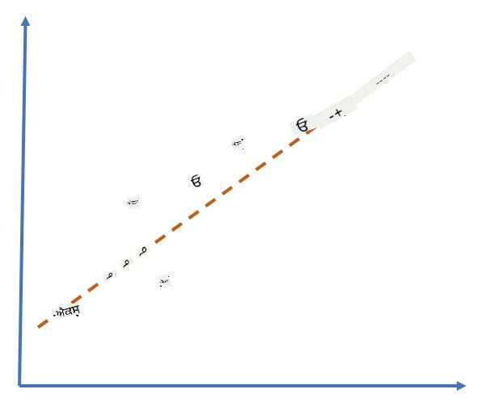
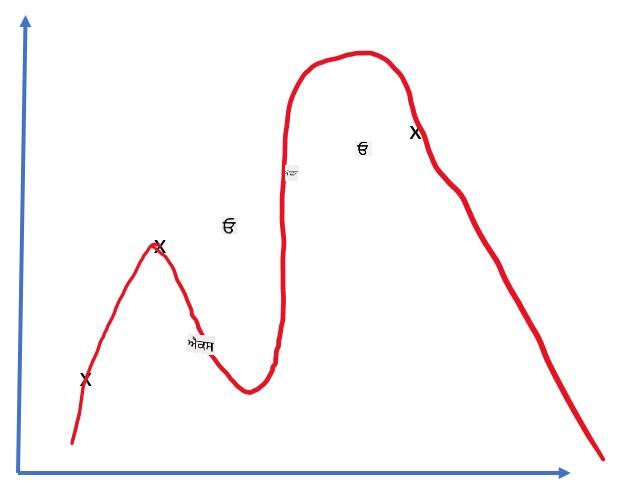

<!--
CO_OP_TRANSLATOR_METADATA:
{
  "original_hash": "2b544f20b796402507fb05a0df893323",
  "translation_date": "2025-08-26T10:33:32+00:00",
  "source_file": "lessons/3-NeuralNetworks/05-Frameworks/README.md",
  "language_code": "pa"
}
-->
# ਨਿਊਰਲ ਨੈਟਵਰਕ ਫ੍ਰੇਮਵਰਕਸ

ਜਿਵੇਂ ਅਸੀਂ ਪਹਿਲਾਂ ਹੀ ਸਿੱਖ ਚੁੱਕੇ ਹਾਂ, ਨਿਊਰਲ ਨੈਟਵਰਕਸ ਨੂੰ ਪ੍ਰਭਾਵਸ਼ਾਲੀ ਢੰਗ ਨਾਲ ਟ੍ਰੇਨ ਕਰਨ ਲਈ ਸਾਨੂੰ ਦੋ ਗੱਲਾਂ ਕਰਨ ਦੀ ਲੋੜ ਹੈ:

* ਟੈਂਸਰਸ 'ਤੇ ਕੰਮ ਕਰਨਾ, ਜਿਵੇਂ ਗੁਣਾ ਕਰਨਾ, ਜੋੜਨਾ, ਅਤੇ ਕੁਝ ਫੰਕਸ਼ਨ ਜਿਵੇਂ ਕਿ ਸਿਗਮਾਇਡ ਜਾਂ ਸੌਫਟਮੈਕਸ ਦੀ ਗਣਨਾ ਕਰਨੀ
* ਸਾਰੇ ਐਕਸਪ੍ਰੈਸ਼ਨਜ਼ ਦੇ ਗ੍ਰੇਡੀਐਂਟਸ ਦੀ ਗਣਨਾ ਕਰਨੀ, ਤਾਂ ਜੋ ਗ੍ਰੇਡੀਐਂਟ ਡਿਸੈਂਟ ਅਪਟੀਮਾਈਜ਼ੇਸ਼ਨ ਕੀਤੀ ਜਾ ਸਕੇ

## [ਪ੍ਰੀ-ਲੈਕਚਰ ਕਵਿਜ਼](https://red-field-0a6ddfd03.1.azurestaticapps.net/quiz/105)

ਜਦੋਂ ਕਿ `numpy` ਲਾਇਬ੍ਰੇਰੀ ਪਹਿਲੇ ਹਿੱਸੇ ਨੂੰ ਕਰ ਸਕਦੀ ਹੈ, ਸਾਨੂੰ ਗ੍ਰੇਡੀਐਂਟਸ ਦੀ ਗਣਨਾ ਕਰਨ ਲਈ ਕੁਝ ਮਕੈਨਿਜ਼ਮ ਦੀ ਲੋੜ ਹੈ। [ਸਾਡੇ ਫ੍ਰੇਮਵਰਕ](../../../../../lessons/3-NeuralNetworks/04-OwnFramework/OwnFramework.ipynb) ਵਿੱਚ, ਜੋ ਅਸੀਂ ਪਿਛਲੇ ਭਾਗ ਵਿੱਚ ਵਿਕਸਿਤ ਕੀਤਾ ਸੀ, ਸਾਨੂੰ ਸਾਰੇ ਡੈਰੀਵੇਟਿਵ ਫੰਕਸ਼ਨਜ਼ ਨੂੰ ਹੱਥੋਂ `backward` ਮੈਥਡ ਵਿੱਚ ਪ੍ਰੋਗਰਾਮ ਕਰਨਾ ਪੈਂਦਾ ਸੀ, ਜੋ ਬੈਕਪ੍ਰੋਪਾਗੇਸ਼ਨ ਕਰਦਾ ਹੈ। ਆਦਰਸ਼ ਤੌਰ 'ਤੇ, ਇੱਕ ਫ੍ਰੇਮਵਰਕ ਸਾਨੂੰ *ਕਿਸੇ ਵੀ ਐਕਸਪ੍ਰੈਸ਼ਨ* ਦੇ ਗ੍ਰੇਡੀਐਂਟਸ ਦੀ ਗਣਨਾ ਕਰਨ ਦਾ ਮੌਕਾ ਦੇਣਾ ਚਾਹੀਦਾ ਹੈ ਜੋ ਅਸੀਂ ਪਰਿਭਾਸ਼ਿਤ ਕਰ ਸਕਦੇ ਹਾਂ।

ਇੱਕ ਹੋਰ ਮਹੱਤਵਪੂਰਨ ਗੱਲ ਇਹ ਹੈ ਕਿ ਗਣਨਾਵਾਂ ਨੂੰ GPU ਜਾਂ ਕਿਸੇ ਹੋਰ ਵਿਸ਼ੇਸ਼ ਕੰਪਿਊਟ ਯੂਨਿਟ, ਜਿਵੇਂ ਕਿ [TPU](https://en.wikipedia.org/wiki/Tensor_Processing_Unit) 'ਤੇ ਕਰਨਾ ਯੋਗ ਹੋਵੇ। ਡੀਪ ਨਿਊਰਲ ਨੈਟਵਰਕ ਟ੍ਰੇਨਿੰਗ ਲਈ *ਬਹੁਤ ਸਾਰੀਆਂ* ਗਣਨਾਵਾਂ ਦੀ ਲੋੜ ਹੁੰਦੀ ਹੈ, ਅਤੇ GPU 'ਤੇ ਉਹਨਾਂ ਗਣਨਾਵਾਂ ਨੂੰ ਪੈਰਲਲ ਕਰਨਾ ਬਹੁਤ ਮਹੱਤਵਪੂਰਨ ਹੈ।

> ✅ 'ਪੈਰਲਲਾਈਜ਼' ਸ਼ਬਦ ਦਾ ਮਤਲਬ ਹੈ ਗਣਨਾਵਾਂ ਨੂੰ ਕਈ ਡਿਵਾਈਸਾਂ 'ਤੇ ਵੰਡਣਾ।

ਇਸ ਸਮੇਂ, ਦੋ ਸਭ ਤੋਂ ਪ੍ਰਸਿੱਧ ਨਿਊਰਲ ਫ੍ਰੇਮਵਰਕ ਹਨ: [TensorFlow](http://TensorFlow.org) ਅਤੇ [PyTorch](https://pytorch.org/)। ਦੋਵੇਂ CPU ਅਤੇ GPU 'ਤੇ ਟੈਂਸਰਸ ਨਾਲ ਕੰਮ ਕਰਨ ਲਈ ਇੱਕ ਲੋ-ਲੈਵਲ API ਪ੍ਰਦਾਨ ਕਰਦੇ ਹਨ। ਲੋ-ਲੈਵਲ API ਦੇ ਉੱਪਰ, ਇੱਕ ਹਾਈ-ਲੈਵਲ API ਵੀ ਹੈ, ਜਿਸਨੂੰ [Keras](https://keras.io/) ਅਤੇ [PyTorch Lightning](https://pytorchlightning.ai/) ਕਿਹਾ ਜਾਂਦਾ ਹੈ।

Low-Level API | [TensorFlow](http://TensorFlow.org) | [PyTorch](https://pytorch.org/)
--------------|-------------------------------------|--------------------------------
High-level API| [Keras](https://keras.io/) | [PyTorch Lightning](https://pytorchlightning.ai/)

**ਲੋ-ਲੈਵਲ API** ਦੋਵੇਂ ਫ੍ਰੇਮਵਰਕਸ ਵਿੱਚ ਤੁਹਾਨੂੰ **ਕੰਪਿਊਟੇਸ਼ਨਲ ਗ੍ਰਾਫਸ** ਬਣਾਉਣ ਦੀ ਆਗਿਆ ਦਿੰਦੇ ਹਨ। ਇਹ ਗ੍ਰਾਫ ਇਹ ਪਰਿਭਾਸ਼ਿਤ ਕਰਦਾ ਹੈ ਕਿ ਦਿੱਤੇ ਗਏ ਇਨਪੁਟ ਪੈਰਾਮੀਟਰਾਂ ਨਾਲ ਆਉਟਪੁੱਟ (ਆਮ ਤੌਰ 'ਤੇ ਲਾਸ ਫੰਕਸ਼ਨ) ਕਿਵੇਂ ਗਣਨਾ ਕਰਨੀ ਹੈ, ਅਤੇ ਜੇ GPU ਉਪਲਬਧ ਹੈ ਤਾਂ ਇਸਨੂੰ ਗਣਨਾ ਲਈ GPU 'ਤੇ ਭੇਜਿਆ ਜਾ ਸਕਦਾ ਹੈ। ਇਸ ਗ੍ਰਾਫ ਨੂੰ ਡਿਫਰੈਂਸ਼ੀਏਟ ਕਰਨ ਅਤੇ ਗ੍ਰੇਡੀਐਂਟਸ ਦੀ ਗਣਨਾ ਕਰਨ ਲਈ ਫੰਕਸ਼ਨ ਹਨ, ਜੋ ਫਿਰ ਮਾਡਲ ਪੈਰਾਮੀਟਰਾਂ ਨੂੰ ਅਪਟੀਮਾਈਜ਼ ਕਰਨ ਲਈ ਵਰਤੇ ਜਾ ਸਕਦੇ ਹਨ।

**ਹਾਈ-ਲੈਵਲ API** ਨਿਊਰਲ ਨੈਟਵਰਕਸ ਨੂੰ ਮੁੱਖ ਤੌਰ 'ਤੇ **ਲੇਅਰਜ਼ ਦੀ ਲੜੀ** ਵਜੋਂ ਦੇਖਦੇ ਹਨ, ਅਤੇ ਜ਼ਿਆਦਾਤਰ ਨਿਊਰਲ ਨੈਟਵਰਕਸ ਨੂੰ ਬਣਾਉਣਾ ਬਹੁਤ ਆਸਾਨ ਬਣਾ ਦਿੰਦੇ ਹਨ। ਮਾਡਲ ਨੂੰ ਟ੍ਰੇਨ ਕਰਨਾ ਆਮ ਤੌਰ 'ਤੇ ਡਾਟਾ ਤਿਆਰ ਕਰਨ ਅਤੇ ਫਿਰ `fit` ਫੰਕਸ਼ਨ ਨੂੰ ਕਾਲ ਕਰਨ ਦੀ ਲੋੜ ਹੁੰਦੀ ਹੈ।

ਹਾਈ-ਲੈਵਲ API ਤੁਹਾਨੂੰ ਆਮ ਨਿਊਰਲ ਨੈਟਵਰਕਸ ਨੂੰ ਬਹੁਤ ਤੇਜ਼ੀ ਨਾਲ ਬਣਾਉਣ ਦੀ ਆਗਿਆ ਦਿੰਦਾ ਹੈ ਬਿਨਾਂ ਬਹੁਤ ਸਾਰੀਆਂ ਵਿਸਥਾਰਾਂ ਦੀ ਚਿੰਤਾ ਕੀਤੇ। ਇਸੇ ਸਮੇਂ, ਲੋ-ਲੈਵਲ API ਟ੍ਰੇਨਿੰਗ ਪ੍ਰਕਿਰਿਆ 'ਤੇ ਕਾਫ਼ੀ ਜ਼ਿਆਦਾ ਕੰਟਰੋਲ ਦਿੰਦੇ ਹਨ, ਅਤੇ ਇਸ ਲਈ ਇਹ ਖੋਜ ਵਿੱਚ ਬਹੁਤ ਵਰਤੇ ਜਾਂਦੇ ਹਨ, ਜਦੋਂ ਤੁਸੀਂ ਨਵੇਂ ਨਿਊਰਲ ਨੈਟਵਰਕ ਆਰਕੀਟੈਕਚਰਜ਼ ਨਾਲ ਕੰਮ ਕਰ ਰਹੇ ਹੋ।

ਇਹ ਸਮਝਣਾ ਵੀ ਮਹੱਤਵਪੂਰਨ ਹੈ ਕਿ ਤੁਸੀਂ ਦੋਵੇਂ API ਨੂੰ ਇਕੱਠੇ ਵਰਤ ਸਕਦੇ ਹੋ, ਜਿਵੇਂ ਕਿ ਤੁਸੀਂ ਲੋ-ਲੈਵਲ API ਦੀ ਵਰਤੋਂ ਕਰਕੇ ਆਪਣੀ ਨੈਟਵਰਕ ਲੇਅਰ ਆਰਕੀਟੈਕਚਰ ਵਿਕਸਿਤ ਕਰ ਸਕਦੇ ਹੋ, ਅਤੇ ਫਿਰ ਇਸਨੂੰ ਵੱਡੇ ਨੈਟਵਰਕ ਦੇ ਅੰਦਰ ਵਰਤ ਸਕਦੇ ਹੋ ਜੋ ਹਾਈ-ਲੈਵਲ API ਨਾਲ ਬਣਾਇਆ ਅਤੇ ਟ੍ਰੇਨ ਕੀਤਾ ਗਿਆ ਹੈ। ਜਾਂ ਤੁਸੀਂ ਹਾਈ-ਲੈਵਲ API ਦੀ ਵਰਤੋਂ ਕਰਕੇ ਲੇਅਰਜ਼ ਦੀ ਲੜੀ ਵਜੋਂ ਨੈਟਵਰਕ ਪਰਿਭਾਸ਼ਿਤ ਕਰ ਸਕਦੇ ਹੋ, ਅਤੇ ਫਿਰ ਆਪਣੇ ਲੋ-ਲੈਵਲ ਟ੍ਰੇਨਿੰਗ ਲੂਪ ਦੀ ਵਰਤੋਂ ਕਰਕੇ ਅਪਟੀਮਾਈਜ਼ੇਸ਼ਨ ਕਰ ਸਕਦੇ ਹੋ। ਦੋਵੇਂ API ਇੱਕੋ ਜਿਹੇ ਮੁੱਢਲੇ ਸੰਕਲਪਾਂ ਦੀ ਵਰਤੋਂ ਕਰਦੇ ਹਨ, ਅਤੇ ਇਹ ਇਕੱਠੇ ਚੰਗੀ ਤਰ੍ਹਾਂ ਕੰਮ ਕਰਨ ਲਈ ਡਿਜ਼ਾਈਨ ਕੀਤੇ ਗਏ ਹਨ।

## ਸਿੱਖਣਾ

ਇਸ ਕੋਰਸ ਵਿੱਚ, ਅਸੀਂ ਜ਼ਿਆਦਾਤਰ ਸਮੱਗਰੀ PyTorch ਅਤੇ TensorFlow ਦੋਵਾਂ ਲਈ ਪ੍ਰਦਾਨ ਕਰਦੇ ਹਾਂ। ਤੁਸੀਂ ਆਪਣਾ ਮਨਪਸੰਦ ਫ੍ਰੇਮਵਰਕ ਚੁਣ ਸਕਦੇ ਹੋ ਅਤੇ ਸਿਰਫ਼ ਸੰਬੰਧਿਤ ਨੋਟਬੁੱਕਸ ਦੇਖ ਸਕਦੇ ਹੋ। ਜੇ ਤੁਸੀਂ ਇਹ ਨਿਰਧਾਰਤ ਨਹੀਂ ਕਰ ਸਕਦੇ ਕਿ ਕਿਹੜਾ ਫ੍ਰੇਮਵਰਕ ਚੁਣਨਾ ਹੈ, ਤਾਂ **PyTorch vs. TensorFlow** ਬਾਰੇ ਇੰਟਰਨੈਟ 'ਤੇ ਕੁਝ ਚਰਚਾਵਾਂ ਪੜ੍ਹੋ। ਤੁਸੀਂ ਦੋਵੇਂ ਫ੍ਰੇਮਵਰਕਸ ਨੂੰ ਵੇਖ ਕੇ ਵੀ ਬਿਹਤਰ ਸਮਝ ਪ੍ਰਾਪਤ ਕਰ ਸਕਦੇ ਹੋ।

ਜਿੱਥੇ ਸੰਭਵ ਹੋਵੇ, ਸਾਦਗੀ ਲਈ ਅਸੀਂ ਹਾਈ-ਲੈਵਲ API ਦੀ ਵਰਤੋਂ ਕਰਾਂਗੇ। ਹਾਲਾਂਕਿ, ਅਸੀਂ ਮੰਨਦੇ ਹਾਂ ਕਿ ਨਿਊਰਲ ਨੈਟਵਰਕਸ ਨੂੰ ਜ਼ਮੀਨ ਤੋਂ ਉੱਪਰ ਤੱਕ ਕਿਵੇਂ ਕੰਮ ਕਰਦੇ ਹਨ ਇਹ ਸਮਝਣਾ ਮਹੱਤਵਪੂਰਨ ਹੈ, ਇਸ ਲਈ ਸ਼ੁਰੂ ਵਿੱਚ ਅਸੀਂ ਲੋ-ਲੈਵਲ API ਅਤੇ ਟੈਂਸਰਸ ਨਾਲ ਕੰਮ ਕਰਨਾ ਸ਼ੁਰੂ ਕਰਦੇ ਹਾਂ। ਹਾਲਾਂਕਿ, ਜੇ ਤੁਸੀਂ ਤੇਜ਼ੀ ਨਾਲ ਅੱਗੇ ਵਧਣਾ ਚਾਹੁੰਦੇ ਹੋ ਅਤੇ ਇਹ ਵਿਸਥਾਰ ਸਿੱਖਣ ਵਿੱਚ ਬਹੁਤ ਜ਼ਿਆਦਾ ਸਮਾਂ ਨਹੀਂ ਲਗਾਉਣਾ ਚਾਹੁੰਦੇ, ਤਾਂ ਤੁਸੀਂ ਉਹਨਾਂ ਨੂੰ ਛੱਡ ਸਕਦੇ ਹੋ ਅਤੇ ਸਿੱਧੇ ਹਾਈ-ਲੈਵਲ API ਨੋਟਬੁੱਕਸ ਵਿੱਚ ਜਾ ਸਕਦੇ ਹੋ।

## ✍️ ਅਭਿਆਸ: ਫ੍ਰੇਮਵਰਕਸ

ਹੇਠਾਂ ਦਿੱਤੇ ਨੋਟਬੁੱਕਸ ਵਿੱਚ ਆਪਣੀ ਸਿੱਖਿਆ ਜਾਰੀ ਰੱਖੋ:

Low-Level API | [TensorFlow+Keras Notebook](../../../../../lessons/3-NeuralNetworks/05-Frameworks/IntroKerasTF.ipynb) | [PyTorch](../../../../../lessons/3-NeuralNetworks/05-Frameworks/IntroPyTorch.ipynb)
--------------|-------------------------------------|--------------------------------
High-level API| [Keras](../../../../../lessons/3-NeuralNetworks/05-Frameworks/IntroKeras.ipynb) | *PyTorch Lightning*

ਫ੍ਰੇਮਵਰਕਸ ਵਿੱਚ ਮਾਹਰ ਹੋਣ ਤੋਂ ਬਾਅਦ, ਆਓ ਓਵਰਫਿਟਿੰਗ ਦੇ ਧਾਰਣਾ ਨੂੰ ਦੁਹਰਾਈਏ।

# ਓਵਰਫਿਟਿੰਗ

ਓਵਰਫਿਟਿੰਗ ਮਸ਼ੀਨ ਲਰਨਿੰਗ ਵਿੱਚ ਬਹੁਤ ਹੀ ਮਹੱਤਵਪੂਰਨ ਧਾਰਣਾ ਹੈ, ਅਤੇ ਇਸਨੂੰ ਸਹੀ ਢੰਗ ਨਾਲ ਸਮਝਣਾ ਬਹੁਤ ਜ਼ਰੂਰੀ ਹੈ!

ਹੇਠਾਂ ਦਿੱਤੇ ਸਮੱਸਿਆ ਨੂੰ ਵਿਚਾਰੋ ਜਿਸ ਵਿੱਚ 5 ਬਿੰਦੂਆਂ ਨੂੰ ਅਨੁਮਾਨਿਤ ਕਰਨਾ ਹੈ (ਗ੍ਰਾਫ ਵਿੱਚ `x` ਨਾਲ ਦਰਸਾਇਆ ਗਿਆ ਹੈ):

 | 
-------------------------|--------------------------
**ਲਿਨੀਅਰ ਮਾਡਲ, 2 ਪੈਰਾਮੀਟਰ** | **ਨਾਨ-ਲਿਨੀਅਰ ਮਾਡਲ, 7 ਪੈਰਾਮੀਟਰ**
ਟ੍ਰੇਨਿੰਗ ਐਰਰ = 5.3 | ਟ੍ਰੇਨਿੰਗ ਐਰਰ = 0
ਵੈਲੀਡੇਸ਼ਨ ਐਰਰ = 5.1 | ਵੈਲੀਡੇਸ਼ਨ ਐਰਰ = 20

* ਖੱਬੇ ਪਾਸੇ, ਅਸੀਂ ਇੱਕ ਚੰਗੀ ਸਿੱਧੀ ਰੇਖਾ ਦੇ ਅਨੁਮਾਨ ਨੂੰ ਵੇਖਦੇ ਹਾਂ। ਕਿਉਂਕਿ ਪੈਰਾਮੀਟਰਾਂ ਦੀ ਗਿਣਤੀ ਯੋਗ ਹੈ, ਮਾਡਲ ਬਿੰਦੂਆਂ ਦੇ ਵੰਡਣ ਦੇ ਪੈਟਰਨ ਨੂੰ ਸਹੀ ਢੰਗ ਨਾਲ ਸਮਝਦਾ ਹੈ।
* ਸੱਜੇ ਪਾਸੇ, ਮਾਡਲ ਬਹੁਤ ਸ਼ਕਤੀਸ਼ਾਲੀ ਹੈ। ਕਿਉਂਕਿ ਸਾਡੇ ਕੋਲ ਸਿਰਫ਼ 5 ਬਿੰਦੂ ਹਨ ਅਤੇ ਮਾਡਲ ਵਿੱਚ 7 ਪੈਰਾਮੀਟਰ ਹਨ, ਇਹ ਇਸ ਤਰ੍ਹਾਂ ਢਲ ਸਕਦਾ ਹੈ ਕਿ ਸਾਰੇ ਬਿੰਦੂਆਂ ਵਿੱਚੋਂ ਲੰਘ ਸਕੇ, ਜਿਸ ਨਾਲ ਟ੍ਰੇਨਿੰਗ ਐਰਰ 0 ਹੋ ਜਾਂਦਾ ਹੈ। ਹਾਲਾਂਕਿ, ਇਸ ਨਾਲ ਮਾਡਲ ਡਾਟਾ ਦੇ ਪਿੱਛੇ ਸਹੀ ਪੈਟਰਨ ਨੂੰ ਸਮਝਣ ਤੋਂ ਰੋਕਦਾ ਹੈ, ਇਸ ਲਈ ਵੈਲੀਡੇਸ਼ਨ ਐਰਰ ਬਹੁਤ ਜ਼ਿਆਦਾ ਹੈ।

ਇਹ ਮਾਡਲ ਦੀ ਸ਼ਕਤੀਸ਼ਾਲੀਤਾ (ਪੈਰਾਮੀਟਰਾਂ ਦੀ ਗਿਣਤੀ) ਅਤੇ ਟ੍ਰੇਨਿੰਗ ਨਮੂਨਿਆਂ ਦੀ ਗਿਣਤੀ ਦੇ ਵਿਚਕਾਰ ਸਹੀ ਸੰਤੁਲਨ ਬਣਾਉਣਾ ਬਹੁਤ ਮਹੱਤਵਪੂਰਨ ਹੈ।

## ਓਵਰਫਿਟਿੰਗ ਕਿਉਂ ਹੁੰਦੀ ਹੈ

  * ਟ੍ਰੇਨਿੰਗ ਡਾਟਾ ਦੀ ਘਾਟ
  * ਬਹੁਤ ਸ਼ਕਤੀਸ਼ਾਲੀ ਮਾਡਲ
  * ਇਨਪੁਟ ਡਾਟਾ ਵਿੱਚ ਬਹੁਤ ਜ਼ਿਆਦਾ ਸ਼ੋਰ

## ਓਵਰਫਿਟਿੰਗ ਨੂੰ ਕਿਵੇਂ ਪਛਾਣਨਾ

ਜਿਵੇਂ ਤੁਸੀਂ ਉੱਪਰ ਦਿੱਤੇ ਗ੍ਰਾਫ ਤੋਂ ਵੇਖ ਸਕਦੇ ਹੋ, ਓਵਰਫਿਟਿੰਗ ਨੂੰ ਬਹੁਤ ਘੱਟ ਟ੍ਰੇਨਿੰਗ ਐਰਰ ਅਤੇ ਬਹੁਤ ਜ਼ਿਆਦਾ ਵੈਲੀਡੇਸ਼ਨ ਐਰਰ ਦੁਆਰਾ ਪਛਾਣਿਆ ਜਾ ਸਕਦਾ ਹੈ। ਆਮ ਤੌਰ 'ਤੇ ਟ੍ਰੇਨਿੰਗ ਦੌਰਾਨ ਅਸੀਂ ਵੇਖਾਂਗੇ ਕਿ ਟ੍ਰੇਨਿੰਗ ਅਤੇ ਵੈਲੀਡੇਸ਼ਨ ਦੋਵੇਂ ਐਰਰ ਘਟਣ ਲੱਗਦੇ ਹਨ, ਅਤੇ ਫਿਰ ਕਿਸੇ ਸਮੇਂ ਵੈਲੀਡੇਸ਼ਨ ਐਰਰ ਘਟਣਾ ਬੰਦ ਕਰ ਸਕਦਾ ਹੈ ਅਤੇ ਵਧਣਾ ਸ਼ੁਰੂ ਕਰ ਸਕਦਾ ਹੈ। ਇਹ ਓਵਰਫਿਟਿੰਗ ਦਾ ਸੰਕੇਤ ਹੋਵੇਗਾ, ਅਤੇ ਇਹ ਦਰਸਾਵੇਗਾ ਕਿ ਸਾਨੂੰ ਇਸ ਸਮੇਂ ਟ੍ਰੇਨਿੰਗ ਰੋਕ ਦੇਣੀ ਚਾਹੀਦੀ ਹੈ (ਜਾਂ ਘੱਟੋ-ਘੱਟ ਮਾਡਲ ਦਾ ਸਨੈਪਸ਼ਾਟ ਲੈਣਾ ਚਾਹੀਦਾ ਹੈ)।

## ਓਵਰਫਿਟਿੰਗ ਨੂੰ ਕਿਵੇਂ ਰੋਕਣਾ

ਜੇ ਤੁਸੀਂ ਵੇਖਦੇ ਹੋ ਕਿ ਓਵਰਫਿਟਿੰਗ ਹੋ ਰਹੀ ਹੈ, ਤਾਂ ਤੁਸੀਂ ਹੇਠਾਂ ਦਿੱਤੀਆਂ ਗੱਲਾਂ ਕਰ ਸਕਦੇ ਹੋ:

 * ਟ੍ਰੇਨਿੰਗ ਡਾਟਾ ਦੀ ਮਾਤਰਾ ਵਧਾਓ
 * ਮਾਡਲ ਦੀ ਜਟਿਲਤਾ ਘਟਾਓ
 * ਕੁਝ [ਰੇਗੂਲਰਾਈਜ਼ੇਸ਼ਨ ਤਕਨੀਕ](../../4-ComputerVision/08-TransferLearning/TrainingTricks.md) ਵਰਤੋ, ਜਿਵੇਂ ਕਿ [ਡ੍ਰੌਪਆਉਟ](../../4-ComputerVision/08-TransferLearning/TrainingTricks.md#Dropout), ਜਿਸਨੂੰ ਅਸੀਂ ਬਾਅਦ ਵਿੱਚ ਵਿਚਾਰਾਂਗੇ।

## ਓਵਰਫਿਟਿੰਗ ਅਤੇ ਬਾਇਸ-ਵੈਰੀਅੰਸ ਟ੍ਰੇਡਆਫ਼

ਓਵਰਫਿਟਿੰਗ ਅਸਲ ਵਿੱਚ ਅੰਕੜਾ ਵਿਗਿਆਨ ਵਿੱਚ ਇੱਕ ਹੋਰ ਜਨਰਲ ਸਮੱਸਿਆ ਦਾ ਕੇਸ ਹੈ ਜਿਸਨੂੰ [ਬਾਇਸ-ਵੈਰੀਅੰਸ ਟ੍ਰੇਡਆਫ਼](https://en.wikipedia.org/wiki/Bias%E2%80%93variance_tradeoff) ਕਿਹਾ ਜਾਂਦਾ ਹੈ। ਜੇ ਅਸੀਂ ਆਪਣੇ ਮਾਡਲ ਵਿੱਚ ਗਲਤੀ ਦੇ ਸੰਭਾਵਿਤ ਸਰੋਤਾਂ ਨੂੰ ਵਿਚਾਰ ਕਰੀਏ, ਤਾਂ ਅਸੀਂ ਦੋ ਕਿਸਮ ਦੀਆਂ ਗਲਤੀਆਂ ਵੇਖ ਸਕਦੇ ਹਾਂ:

* **ਬਾਇਸ ਗਲਤੀਆਂ** ਜੋ ਸਾਡੇ ਐਲਗੋਰਿਥਮ ਦੁਆਰਾ ਟ੍ਰੇਨਿੰਗ ਡਾਟਾ ਦੇ ਸਹੀ ਸੰਬੰਧ ਨੂੰ ਕੈਪਚਰ ਕਰਨ ਵਿੱਚ ਅਸਮਰੱਥ ਹੋਣ ਕਾਰਨ ਹੁੰਦੀਆਂ ਹਨ। ਇਹ ਇਸ ਗੱਲ ਦਾ ਨਤੀਜਾ ਹੋ ਸਕਦਾ ਹੈ ਕਿ ਸਾਡਾ ਮਾਡਲ ਕਾਫ਼ੀ ਸ਼ਕਤੀਸ਼ਾਲੀ ਨਹੀਂ ਹੈ (**ਅੰਡਰਫਿਟਿੰਗ**)।  
* **ਵੈਰੀਅੰਸ ਗਲਤੀਆਂ**, ਜੋ ਮਾਡਲ ਦੁਆਰਾ ਇਨਪੁਟ ਡਾਟਾ ਵਿੱਚ ਸ਼ੋਰ ਨੂੰ ਅਨੁਮਾਨਿਤ ਕਰਨ ਕਾਰਨ ਹੁੰਦੀਆਂ ਹਨ ਬਜਾਏ ਕਿ ਅਰਥਪੂਰਨ ਸੰਬੰਧ (**ਓਵਰਫਿਟਿੰਗ**)।

ਟ੍ਰੇਨਿੰਗ ਦੌਰਾਨ, ਬਾਇਸ ਗਲਤੀ ਘਟਦੀ ਹੈ (ਜਿਵੇਂ ਸਾਡਾ ਮਾਡਲ ਡਾਟਾ ਨੂੰ ਅਨੁਮਾਨਿਤ ਕਰਨਾ ਸਿੱਖਦਾ ਹੈ), ਅਤੇ ਵੈਰੀਅੰਸ ਗਲਤੀ ਵਧਦੀ ਹੈ। ਓਵਰਫਿਟਿੰਗ ਨੂੰ ਰੋਕਣ ਲਈ ਟ੍ਰੇਨਿੰਗ ਨੂੰ ਰੋਕਣਾ ਮਹੱਤਵਪੂਰਨ ਹੈ - ਜਾਂ ਤਾਂ ਮੈਨੁਅਲ ਤੌਰ 'ਤੇ (ਜਦੋਂ ਅਸੀਂ ਓਵਰਫਿਟਿੰਗ ਦਾ ਪਤਾ ਲਗਾਉਂਦੇ ਹਾਂ) ਜਾਂ ਆਟੋਮੈਟਿਕ ਤੌਰ 'ਤੇ (ਰੇਗੂਲਰਾਈਜ਼ੇਸ਼ਨ ਲਾਗੂ ਕਰਕੇ)।

## ਨਤੀਜਾ

ਇਸ ਪਾਠ ਵਿੱਚ, ਤੁਸੀਂ ਦੋ ਸਭ ਤੋਂ ਪ੍ਰਸਿੱਧ AI ਫ੍ਰੇਮਵਰਕਸ, TensorFlow ਅਤੇ PyTorch ਲਈ ਵੱਖ-ਵੱਖ API ਦੇ ਫਰਕਾਂ ਬਾਰੇ ਸਿੱਖਿਆ। ਇਸਦੇ ਨਾਲ ਹੀ, ਤੁਸੀਂ ਇੱਕ ਬਹੁਤ ਮਹੱਤਵਪੂਰਨ ਵਿਸ਼ਾ, ਓਵਰਫਿਟਿੰਗ ਬਾਰੇ ਵੀ ਸਿੱਖਿਆ।

## 🚀 ਚੁਣੌਤੀ

ਸੰਬੰਧਿਤ ਨੋਟਬੁੱਕਸ ਵਿੱਚ, ਤੁਸੀਂ 'ਟਾਸਕਸ' ਨੂੰ ਹੇਠਾਂ ਪਾਵੋਗੇ; ਨੋਟਬੁੱਕਸ ਵਿੱਚ ਕੰਮ ਕਰੋ ਅਤੇ ਟਾਸਕਸ ਪੂਰੇ ਕਰੋ।

## [ਪੋਸਟ-ਲੈਕਚਰ ਕਵਿਜ਼](https://red-field-0a6ddfd03.1.azurestaticapps.net/quiz/205)

## ਸਮੀਖਿਆ ਅਤੇ ਸਵੈ ਅਧਿਐਨ

ਹੇਠਾਂ ਦਿੱਤੇ ਵਿਸ਼ਿਆਂ 'ਤੇ ਕੁਝ ਖੋਜ ਕਰੋ:

- TensorFlow  
- PyTorch  
- ਓਵਰਫਿਟਿੰਗ  

ਆਪਣੇ ਆਪ ਤੋਂ ਹੇਠਾਂ ਦਿੱਤੇ ਸਵਾਲ ਪੁੱਛੋ:

- TensorFlow ਅਤੇ PyTorch ਵਿੱਚ ਕੀ ਫਰਕ ਹੈ?  
- ਓਵਰਫਿਟਿੰਗ ਅਤੇ ਅੰਡਰਫਿਟਿੰਗ ਵਿੱਚ ਕੀ ਫਰਕ ਹੈ?  

## [ਅਸਾਈਨਮੈਂਟ](lab/README.md)

ਇਸ ਲੈਬ ਵਿੱਚ, ਤੁਹਾਨੂੰ PyTorch ਜਾਂ TensorFlow ਦੀ ਵਰਤੋਂ ਕਰਕੇ ਸਿੰਗਲ- ਅਤੇ ਮਲਟੀ-ਲੇਅਰਡ ਫੁੱਲੀ-ਕ

**ਅਸਵੀਕਰਤਾ**:  
ਇਹ ਦਸਤਾਵੇਜ਼ AI ਅਨੁਵਾਦ ਸੇਵਾ [Co-op Translator](https://github.com/Azure/co-op-translator) ਦੀ ਵਰਤੋਂ ਕਰਕੇ ਅਨੁਵਾਦ ਕੀਤਾ ਗਿਆ ਹੈ। ਜਦੋਂ ਕਿ ਅਸੀਂ ਸਹੀ ਹੋਣ ਦੀ ਕੋਸ਼ਿਸ਼ ਕਰਦੇ ਹਾਂ, ਕਿਰਪਾ ਕਰਕੇ ਧਿਆਨ ਦਿਓ ਕਿ ਸਵੈਚਾਲਿਤ ਅਨੁਵਾਦਾਂ ਵਿੱਚ ਗਲਤੀਆਂ ਜਾਂ ਅਸੁੱਤੀਆਂ ਹੋ ਸਕਦੀਆਂ ਹਨ। ਮੂਲ ਦਸਤਾਵੇਜ਼ ਨੂੰ ਇਸਦੀ ਮੂਲ ਭਾਸ਼ਾ ਵਿੱਚ ਅਧਿਕਾਰਤ ਸਰੋਤ ਮੰਨਿਆ ਜਾਣਾ ਚਾਹੀਦਾ ਹੈ। ਮਹੱਤਵਪੂਰਨ ਜਾਣਕਾਰੀ ਲਈ, ਪੇਸ਼ੇਵਰ ਮਨੁੱਖੀ ਅਨੁਵਾਦ ਦੀ ਸਿਫਾਰਸ਼ ਕੀਤੀ ਜਾਂਦੀ ਹੈ। ਇਸ ਅਨੁਵਾਦ ਦੀ ਵਰਤੋਂ ਤੋਂ ਪੈਦਾ ਹੋਣ ਵਾਲੇ ਕਿਸੇ ਵੀ ਗਲਤਫਹਿਮੀ ਜਾਂ ਗਲਤ ਵਿਆਖਿਆ ਲਈ ਅਸੀਂ ਜ਼ਿੰਮੇਵਾਰ ਨਹੀਂ ਹਾਂ।