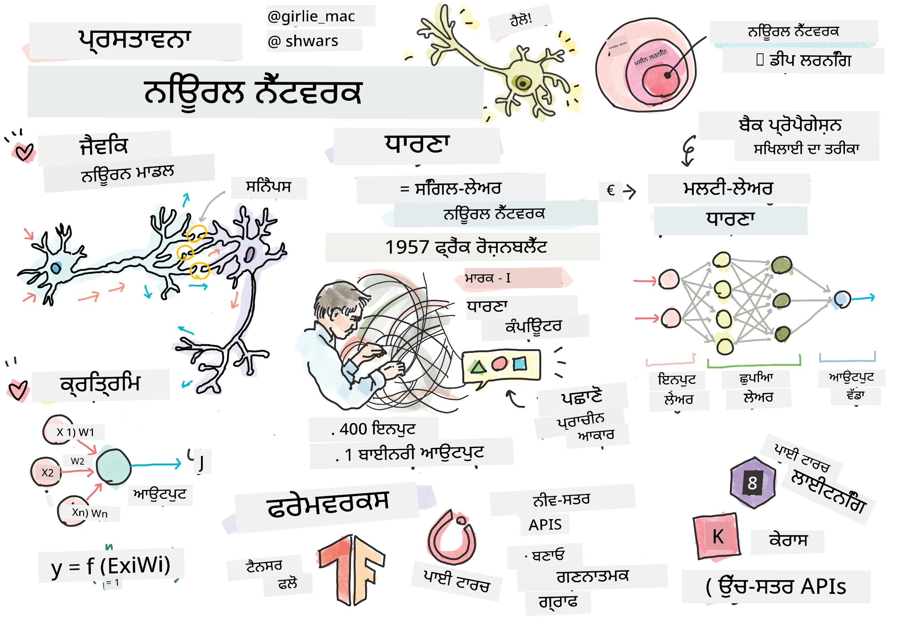
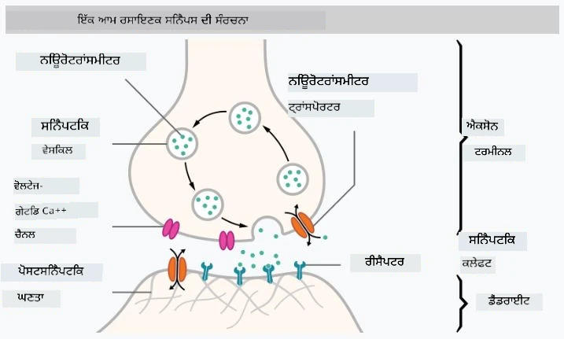

# ਨਿਊਰਲ ਨੈੱਟਵਰਕਸ ਦਾ ਪਰਿਚਯ

ਜਿਵੇਂ ਕਿ ਅਸੀਂ ਪਰਿਚਯ ਵਿੱਚ ਚਰਚਾ ਕੀਤੀ ਸੀ, ਬੁੱਧੀ ਪ੍ਰਾਪਤ ਕਰਨ ਦੇ ਤਰੀਕਿਆਂ ਵਿੱਚੋਂ ਇੱਕ ਤਰੀਕਾ **ਕੰਪਿਊਟਰ ਮਾਡਲ** ਜਾਂ ਇੱਕ **ਕ੍ਰਿਤ੍ਰਿਮ ਦਿਮਾਗ** ਨੂੰ ਸਿਖਲਾਈ ਦੇਣਾ ਹੈ। 20ਵੀਂ ਸਦੀ ਦੇ ਮੱਧ ਤੋਂ, ਖੋਜਕਰਤਾਵਾਂ ਨੇ ਵੱਖ-ਵੱਖ ਗਣਿਤ ਮਾਡਲਾਂ ਦੀ ਕੋਸ਼ਿਸ਼ ਕੀਤੀ, ਜਦੋਂ ਤੱਕ ਕਿ ਹਾਲੀਆ ਸਾਲਾਂ ਵਿੱਚ ਇਹ ਦਿਸ਼ਾ ਬਹੁਤ ਸਫਲ ਸਾਬਤ ਨਹੀਂ ਹੋਈ। ਦਿਮਾਗ ਦੇ ਅਜਿਹੇ ਗਣਿਤ ਮਾਡਲਾਂ ਨੂੰ **ਨਿਊਰਲ ਨੈੱਟਵਰਕਸ** ਕਿਹਾ ਜਾਂਦਾ ਹੈ।

> ਕਈ ਵਾਰ ਨਿਊਰਲ ਨੈੱਟਵਰਕਸ ਨੂੰ *ਕ੍ਰਿਤ੍ਰਿਮ ਨਿਊਰਲ ਨੈੱਟਵਰਕਸ* ਜਾਂ ANNs ਕਿਹਾ ਜਾਂਦਾ ਹੈ, ਤਾਂ ਜੋ ਇਹ ਸਪਸ਼ਟ ਕੀਤਾ ਜਾ ਸਕੇ ਕਿ ਅਸੀਂ ਮਾਡਲਾਂ ਦੀ ਗੱਲ ਕਰ ਰਹੇ ਹਾਂ, ਨਾ ਕਿ ਅਸਲ ਨਿਊਰੋਨ ਨੈੱਟਵਰਕਸ ਦੀ।

## ਮਸ਼ੀਨ ਲਰਨਿੰਗ

ਨਿਊਰਲ ਨੈੱਟਵਰਕਸ ਇੱਕ ਵੱਡੇ ਵਿਭਾਗ ਦਾ ਹਿੱਸਾ ਹਨ ਜਿਸਨੂੰ **ਮਸ਼ੀਨ ਲਰਨਿੰਗ** ਕਿਹਾ ਜਾਂਦਾ ਹੈ, ਜਿਸਦਾ ਮਕਸਦ ਡਾਟਾ ਦੀ ਵਰਤੋਂ ਕਰਕੇ ਕੰਪਿਊਟਰ ਮਾਡਲਾਂ ਨੂੰ ਸਿਖਲਾਈ ਦੇਣਾ ਹੈ ਜੋ ਸਮੱਸਿਆਵਾਂ ਨੂੰ ਹੱਲ ਕਰ ਸਕਣ। ਮਸ਼ੀਨ ਲਰਨਿੰਗ ਕ੍ਰਿਤ੍ਰਿਮ ਬੁੱਧੀ ਦਾ ਇੱਕ ਵੱਡਾ ਹਿੱਸਾ ਹੈ, ਪਰ ਇਸ ਪਾਠਕ੍ਰਮ ਵਿੱਚ ਅਸੀਂ ਰਵਾਇਤੀ ਮਸ਼ੀਨ ਲਰਨਿੰਗ ਨੂੰ ਕਵਰ ਨਹੀਂ ਕਰਦੇ।

> ਕਲਾਸਿਕ ਮਸ਼ੀਨ ਲਰਨਿੰਗ ਬਾਰੇ ਹੋਰ ਜਾਣਨ ਲਈ ਸਾਡਾ ਵੱਖਰਾ **[ਮਸ਼ੀਨ ਲਰਨਿੰਗ ਬਿਗਿਨਰਜ਼ ਲਈ](http://github.com/microsoft/ml-for-beginners)** ਪਾਠਕ੍ਰਮ ਵੇਖੋ।

ਮਸ਼ੀਨ ਲਰਨਿੰਗ ਵਿੱਚ, ਅਸੀਂ ਮੰਨਦੇ ਹਾਂ ਕਿ ਸਾਡੇ ਕੋਲ ਕੁਝ ਉਦਾਹਰਣਾਂ ਦਾ ਡਾਟਾਸੈੱਟ **X** ਹੈ, ਅਤੇ ਇਸਦੇ ਨਾਲ ਸੰਬੰਧਿਤ ਆਉਟਪੁੱਟ ਮੁੱਲ **Y** ਹਨ। ਉਦਾਹਰਣ ਅਕਸਰ N-ਡਾਈਮੇਂਸ਼ਨਲ ਵੇਕਟਰ ਹੁੰਦੇ ਹਨ ਜੋ **ਫੀਚਰਜ਼** 'ਤੇ ਆਧਾਰਿਤ ਹੁੰਦੇ ਹਨ, ਅਤੇ ਆਉਟਪੁੱਟ ਨੂੰ **ਲੇਬਲਜ਼** ਕਿਹਾ ਜਾਂਦਾ ਹੈ।

ਅਸੀਂ ਦੋ ਸਭ ਤੋਂ ਆਮ ਮਸ਼ੀਨ ਲਰਨਿੰਗ ਸਮੱਸਿਆਵਾਂ ਨੂੰ ਵੇਖਾਂਗੇ:

* **ਕਲਾਸੀਫਿਕੇਸ਼ਨ**, ਜਿਸ ਵਿੱਚ ਸਾਨੂੰ ਇੱਕ ਇਨਪੁੱਟ ਆਬਜੈਕਟ ਨੂੰ ਦੋ ਜਾਂ ਵੱਧ ਕਲਾਸਾਂ ਵਿੱਚ ਵੰਡਣਾ ਹੁੰਦਾ ਹੈ।
* **ਰਿਗ੍ਰੈਸ਼ਨ**, ਜਿਸ ਵਿੱਚ ਸਾਨੂੰ ਹਰ ਇਨਪੁੱਟ ਨਮੂਨੇ ਲਈ ਇੱਕ ਸੰਖਿਆਤਮਕ ਮੁੱਲ ਦੀ ਭਵਿੱਖਵਾਣੀ ਕਰਨੀ ਹੁੰਦੀ ਹੈ।

> ਜਦੋਂ ਇਨਪੁੱਟ ਅਤੇ ਆਉਟਪੁੱਟ ਨੂੰ ਟੈਂਸਰਜ਼ ਵਜੋਂ ਦਰਸਾਇਆ ਜਾਂਦਾ ਹੈ, ਤਾਂ ਇਨਪੁੱਟ ਡਾਟਾਸੈੱਟ M&times;N ਆਕਾਰ ਦੇ ਮੈਟ੍ਰਿਕਸ ਦੇ ਰੂਪ ਵਿੱਚ ਹੁੰਦਾ ਹੈ, ਜਿੱਥੇ M ਨਮੂਨਿਆਂ ਦੀ ਗਿਣਤੀ ਹੈ ਅਤੇ N ਫੀਚਰਜ਼ ਦੀ ਗਿਣਤੀ ਹੈ। ਆਉਟਪੁੱਟ ਲੇਬਲ Y M ਆਕਾਰ ਦੇ ਵੇਕਟਰ ਹੁੰਦੇ ਹਨ।

ਇਸ ਪਾਠਕ੍ਰਮ ਵਿੱਚ, ਅਸੀਂ ਸਿਰਫ ਨਿਊਰਲ ਨੈੱਟਵਰਕ ਮਾਡਲਾਂ 'ਤੇ ਧਿਆਨ ਦੇਵਾਂਗੇ।

## ਨਿਊਰੋਨ ਦਾ ਮਾਡਲ

ਜੀਵ ਵਿਗਿਆਨ ਤੋਂ, ਅਸੀਂ ਜਾਣਦੇ ਹਾਂ ਕਿ ਸਾਡਾ ਦਿਮਾਗ ਨਿਊਰਲ ਸੈਲ (ਨਿਊਰੋਨ) ਤੋਂ ਬਣਿਆ ਹੁੰਦਾ ਹੈ, ਜਿਨ੍ਹਾਂ ਵਿੱਚ ਹਰ ਇੱਕ ਦੇ ਕਈ "ਇਨਪੁੱਟ" (ਡੈਂਡਰਾਈਟਸ) ਅਤੇ ਇੱਕ "ਆਉਟਪੁੱਟ" (ਐਕਸੋਨ) ਹੁੰਦੇ ਹਨ। ਡੈਂਡਰਾਈਟਸ ਅਤੇ ਐਕਸੋਨ ਦੋਵੇਂ ਬਿਜਲਈ ਸੰਕੇਤਾਂ ਨੂੰ ਚਲਾਉਣ ਦੇ ਯੋਗ ਹੁੰਦੇ ਹਨ, ਅਤੇ ਉਨ੍ਹਾਂ ਦੇ ਵਿਚਕਾਰ ਦੇ ਸੰਪਰਕ — ਜਿਨ੍ਹਾਂ ਨੂੰ ਸਿਨੈਪਸ ਕਿਹਾ ਜਾਂਦਾ ਹੈ — ਵੱਖ-ਵੱਖ ਪੱਧਰ ਦੀ ਚਾਲਕਤਾ ਦਿਖਾ ਸਕਦੇ ਹਨ, ਜੋ ਨਿਊਰੋਟ੍ਰਾਂਸਮੀਟਰਾਂ ਦੁਆਰਾ ਨਿਯੰਤਰਿਤ ਹੁੰਦੀ ਹੈ।

 | 
----|----
ਅਸਲੀ ਨਿਊਰੋਨ *([ਵਿਕੀਪੀਡੀਆ ਤੋਂ ਚਿੱਤਰ](https://en.wikipedia.org/wiki/Synapse#/media/File:SynapseSchematic_lines.svg))* | ਕ੍ਰਿਤ੍ਰਿਮ ਨਿਊਰੋਨ *(ਲੇਖਕ ਦੁਆਰਾ ਚਿੱਤਰ)*

ਇਸ ਤਰ੍ਹਾਂ, ਨਿਊਰੋਨ ਦਾ ਸਭ ਤੋਂ ਸਧਾਰਨ ਗਣਿਤ ਮਾਡਲ ਕਈ ਇਨਪੁੱਟ X1, ..., XN ਅਤੇ ਇੱਕ ਆਉਟਪੁੱਟ Y, ਅਤੇ ਕਈ ਵਜ਼ਨ W1, ..., WN ਸ਼ਾਮਲ ਕਰਦਾ ਹੈ। ਆਉਟਪੁੱਟ ਇਸ ਤਰ੍ਹਾਂ ਗਣਨਾ ਕੀਤੀ ਜਾਂਦੀ ਹੈ:

ਜਿੱਥੇ f ਕੁਝ ਗੈਰ-ਰੇਖਿਕ **ਐਕਟੀਵੇਸ਼ਨ ਫੰਕਸ਼ਨ** ਹੈ।

> ਨਿਊਰੋਨ ਦੇ ਸ਼ੁਰੂਆਤੀ ਮਾਡਲਾਂ ਨੂੰ 1943 ਵਿੱਚ ਵਾਰਨ ਮੈਕਕੁਲੌਕ ਅਤੇ ਵਾਲਟਰ ਪਿਟਸ ਦੁਆਰਾ ਲਿਖੇ ਕਲਾਸਿਕ ਪੇਪਰ [A logical calculus of the ideas immanent in nervous activity](https://www.cs.cmu.edu/~./epxing/Class/10715/reading/McCulloch.and.Pitts.pdf) ਵਿੱਚ ਵਰਣਿਤ ਕੀਤਾ ਗਿਆ ਸੀ। ਡੋਨਾਲਡ ਹੈਬ ਨੇ ਆਪਣੀ ਕਿਤਾਬ "[The Organization of Behavior: A Neuropsychological Theory](https://books.google.com/books?id=VNetYrB8EBoC)" ਵਿੱਚ ਇਹ ਦਰਸਾਇਆ ਕਿ ਇਹ ਨੈੱਟਵਰਕਸ ਕਿਵੇਂ ਸਿਖਲਾਈ ਜਾ ਸਕਦੇ ਹਨ।

## ਇਸ ਭਾਗ ਵਿੱਚ

ਇਸ ਭਾਗ ਵਿੱਚ ਅਸੀਂ ਸਿੱਖਾਂਗੇ:
* [ਪਰਸੈਪਟ੍ਰਾਨ](03-Perceptron/README.md), ਦੋ-ਕਲਾਸ ਕਲਾਸੀਫਿਕੇਸ਼ਨ ਲਈ ਸਭ ਤੋਂ ਪਹਿਲੇ ਨਿਊਰਲ ਨੈੱਟਵਰਕ ਮਾਡਲਾਂ ਵਿੱਚੋਂ ਇੱਕ
* [ਮਲਟੀ-ਲੇਅਰਡ ਨੈੱਟਵਰਕਸ](04-OwnFramework/README.md) ਅਤੇ ਇਸ ਨਾਲ ਜੁੜਿਆ ਨੋਟਬੁੱਕ [ਅਪਣਾ ਫਰੇਮਵਰਕ ਬਣਾਉਣਾ](04-OwnFramework/OwnFramework.ipynb)
* [ਨਿਊਰਲ ਨੈੱਟਵਰਕ ਫਰੇਮਵਰਕਸ](05-Frameworks/README.md), ਜਿਨ੍ਹਾਂ ਵਿੱਚ ਇਹ ਨੋਟਬੁੱਕਸ ਸ਼ਾਮਲ ਹਨ: [ਪਾਈਟਾਰਚ](05-Frameworks/IntroPyTorch.ipynb) ਅਤੇ [ਕੇਰਾਸ/ਟੈਂਸਰਫਲੋ](05-Frameworks/IntroKerasTF.ipynb)
* [ਓਵਰਫਿਟਿੰਗ](../../../../lessons/3-NeuralNetworks/05-Frameworks)

---

**ਅਸਵੀਕਰਤੀ**:  
ਇਹ ਦਸਤਾਵੇਜ਼ AI ਅਨੁਵਾਦ ਸੇਵਾ [Co-op Translator](https://github.com/Azure/co-op-translator) ਦੀ ਵਰਤੋਂ ਕਰਕੇ ਅਨੁਵਾਦ ਕੀਤਾ ਗਿਆ ਹੈ। ਜਦੋਂ ਕਿ ਅਸੀਂ ਸਹੀਤਾ ਲਈ ਯਤਨਸ਼ੀਲ ਹਾਂ, ਕਿਰਪਾ ਕਰਕੇ ਧਿਆਨ ਦਿਓ ਕਿ ਸਵੈਚਾਲਿਤ ਅਨੁਵਾਦਾਂ ਵਿੱਚ ਗਲਤੀਆਂ ਜਾਂ ਅਸੁਚੀਤਤਾਵਾਂ ਹੋ ਸਕਦੀਆਂ ਹਨ। ਇਸ ਦੀ ਮੂਲ ਭਾਸ਼ਾ ਵਿੱਚ ਮੌਜੂਦ ਦਸਤਾਵੇਜ਼ ਨੂੰ ਅਧਿਕਾਰਤ ਸਰੋਤ ਮੰਨਿਆ ਜਾਣਾ ਚਾਹੀਦਾ ਹੈ। ਮਹੱਤਵਪੂਰਨ ਜਾਣਕਾਰੀ ਲਈ, ਪੇਸ਼ੇਵਰ ਮਨੁੱਖੀ ਅਨੁਵਾਦ ਦੀ ਸਿਫਾਰਸ਼ ਕੀਤੀ ਜਾਂਦੀ ਹੈ। ਅਸੀਂ ਇਸ ਅਨੁਵਾਦ ਦੀ ਵਰਤੋਂ ਤੋਂ ਪੈਦਾ ਹੋਣ ਵਾਲੇ ਕਿਸੇ ਵੀ ਗਲਤਫਹਿਮੀ ਜਾਂ ਗਲਤ ਵਿਆਖਿਆ ਲਈ ਜ਼ਿੰਮੇਵਾਰ ਨਹੀਂ ਹਾਂ।