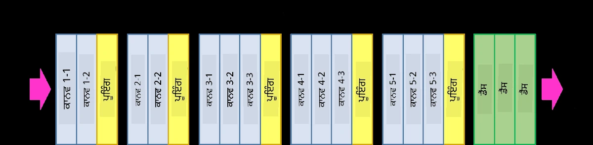
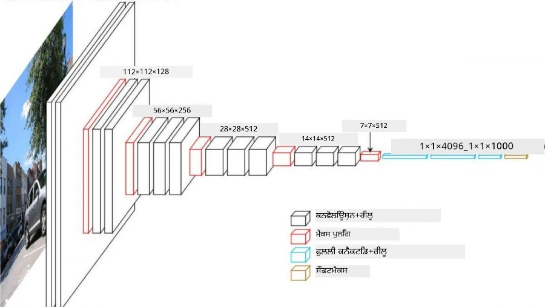
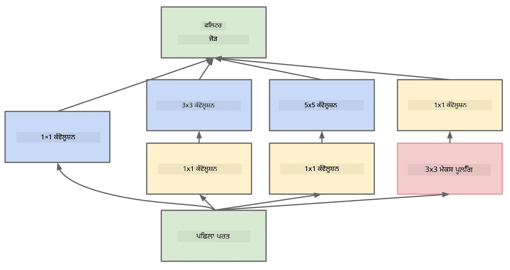

# ਪ੍ਰਸਿੱਧ CNN ਆਰਕੀਟੈਕਚਰਾਂ

### VGG-16

VGG-16 ਇੱਕ ਨੈਟਵਰਕ ਹੈ ਜਿਸ ਨੇ 2014 ਵਿੱਚ ImageNet top-5 ਵਰਗੀਕਰਨ ਵਿੱਚ 92.7% ਸਹੀਤਾ ਹਾਸਲ ਕੀਤੀ। ਇਸ ਵਿੱਚ ਹੇਠਾਂ ਦਿੱਤੇ ਲੇਅਰ ਸਟ੍ਰਕਚਰ ਹਨ:

ਜਿਵੇਂ ਤੁਸੀਂ ਦੇਖ ਸਕਦੇ ਹੋ, VGG ਇੱਕ ਪਰੰਪਰਾਗਤ ਪਿਰਾਮਿਡ ਆਰਕੀਟੈਕਚਰ ਦੀ ਪਾਲਣਾ ਕਰਦਾ ਹੈ, ਜੋ ਕਿ ਕਨਵੋਲੂਸ਼ਨ-ਪੂਲਿੰਗ ਲੇਅਰਾਂ ਦੀ ਲੜੀ ਹੈ।

> ਚਿੱਤਰ [Researchgate](https://www.researchgate.net/figure/Vgg16-model-structure-To-get-the-VGG-NIN-model-we-replace-the-2-nd-4-th-6-th-7-th_fig2_335194493) ਤੋਂ

### ResNet

ResNet ਮਾਈਕਰੋਸਾਫਟ ਰਿਸਰਚ ਦੁਆਰਾ 2015 ਵਿੱਚ ਪ੍ਰਸਤਾਵਿਤ ਮਾਡਲਾਂ ਦਾ ਇੱਕ ਪਰਿਵਾਰ ਹੈ। ResNet ਦਾ ਮੁੱਖ ਵਿਚਾਰ **ਰੈਜ਼ੀਡੂਅਲ ਬਲਾਕ** ਵਰਤਣਾ ਹੈ:

> ਚਿੱਤਰ [ਇਸ ਪੇਪਰ](https://arxiv.org/pdf/1512.03385.pdf) ਤੋਂ

ਇਸ ਵਿੱਚ ਪਛਾਣ ਪਾਸ-ਥਰੂ ਵਰਤਣ ਦਾ ਕਾਰਨ ਇਹ ਹੈ ਕਿ ਸਾਡਾ ਲੇਅਰ ਪਿਛਲੇ ਲੇਅਰ ਦੇ ਨਤੀਜੇ ਅਤੇ ਰੈਜ਼ੀਡੂਅਲ ਬਲਾਕ ਦੇ ਆਉਟਪੁੱਟ ਦੇ ਵਿਚਕਾਰ **ਫਰਕ** ਦੀ ਭਵਿੱਖਵਾਣੀ ਕਰੇ - ਇਸੇ ਲਈ ਇਸ ਨੂੰ *ਰੈਜ਼ੀਡੂਅਲ* ਨਾਮ ਦਿੱਤਾ ਗਿਆ। ਇਹ ਬਲਾਕ ਸਿਖਾਉਣ ਲਈ ਕਾਫ਼ੀ ਆਸਾਨ ਹਨ, ਅਤੇ ਕੋਈ ਵੀ ਇਨ੍ਹਾਂ ਬਲਾਕਾਂ ਦੇ ਸੈਂਕੜੇ ਲੇਅਰਾਂ ਨਾਲ ਨੈਟਵਰਕ ਬਣਾਉਣ ਦੇ ਯੋਗ ਹੈ (ਸਭ ਤੋਂ ਆਮ ਰੂਪਾਂ ResNet-52, ResNet-101 ਅਤੇ ResNet-152 ਹਨ)।

ਤੁਸੀਂ ਇਸ ਨੈਟਵਰਕ ਨੂੰ ਡਾਟਾਸੈਟ ਦੇ ਮੁਤਾਬਕ ਆਪਣੀ ਜਟਿਲਤਾ ਨੂੰ ਢਾਲਣ ਦੇ ਯੋਗ ਹੋਣ ਦੇ ਤੌਰ 'ਤੇ ਵੀ ਸੋਚ ਸਕਦੇ ਹੋ। ਸ਼ੁਰੂ ਵਿੱਚ, ਜਦੋਂ ਤੁਸੀਂ ਨੈਟਵਰਕ ਨੂੰ ਸਿਖਾਉਣਾ ਸ਼ੁਰੂ ਕਰਦੇ ਹੋ, ਤਾਂ ਵਜ਼ਨ ਦੀਆਂ ਕੀਮਤਾਂ ਛੋਟੀ ਹੁੰਦੀਆਂ ਹਨ, ਅਤੇ ਜ਼ਿਆਦਾਤਰ ਸਿਗਨਲ ਪਾਸ-ਥਰੂ ਪਛਾਣ ਲੇਅਰਾਂ ਵਿੱਚੋਂ ਜਾਂਦਾ ਹੈ। ਜਿਵੇਂ ਸਿਖਲਾਈ ਅੱਗੇ ਵਧਦੀ ਹੈ ਅਤੇ ਵਜ਼ਨ ਵੱਡੇ ਹੋ ਜਾਂਦੇ ਹਨ, ਨੈਟਵਰਕ ਪੈਰਾਮੀਟਰਾਂ ਦੀ ਮਹੱਤਤਾ ਵਧਦੀ ਹੈ, ਅਤੇ ਨੈਟਵਰਕ ਸਿਖਲਾਈ ਚਿੱਤਰਾਂ ਨੂੰ ਸਹੀ ਤਰੀਕੇ ਨਾਲ ਵਰਗੀਕਰਣ ਲਈ ਜ਼ਰੂਰੀ ਪ੍ਰਗਟਾਵਾ ਸ਼ਕਤੀ ਨੂੰ ਢਾਲਦਾ ਹੈ।

### Google Inception

Google Inception ਆਰਕੀਟੈਕਚਰ ਇਸ ਵਿਚਾਰ ਨੂੰ ਇੱਕ ਕਦਮ ਅੱਗੇ ਲੈ ਜਾਂਦਾ ਹੈ, ਅਤੇ ਹਰ ਨੈਟਵਰਕ ਲੇਅਰ ਨੂੰ ਕਈ ਵੱਖ-ਵੱਖ ਪਾਥਾਂ ਦੇ ਸੰਯੋਜਨ ਵਜੋਂ ਬਣਾਉਂਦਾ ਹੈ:

> ਚਿੱਤਰ [Researchgate](https://www.researchgate.net/figure/Inception-module-with-dimension-reductions-left-and-schema-for-Inception-ResNet-v1_fig2_355547454) ਤੋਂ

ਇਥੇ, ਸਾਨੂੰ 1x1 ਕਨਵੋਲੂਸ਼ਨ ਦੀ ਭੂਮਿਕਾ 'ਤੇ ਜ਼ੋਰ ਦੇਣਾ ਚਾਹੀਦਾ ਹੈ, ਕਿਉਂਕਿ ਸ਼ੁਰੂ ਵਿੱਚ ਇਹ ਸਮਝ ਨਹੀਂ ਆਉਂਦਾ। ਅਸੀਂ 1x1 ਫਿਲਟਰ ਨਾਲ ਚਿੱਤਰ ਨੂੰ ਕਿਉਂ ਚਲਾਉਣਾ ਚਾਹੁੰਦੇ ਹਾਂ? ਹਾਲਾਂਕਿ, ਤੁਹਾਨੂੰ ਯਾਦ ਰੱਖਣਾ ਚਾਹੀਦਾ ਹੈ ਕਿ ਕਨਵੋਲੂਸ਼ਨ ਫਿਲਟਰ ਕਈ ਡੈਪਥ ਚੈਨਲਾਂ ਨਾਲ ਵੀ ਕੰਮ ਕਰਦੇ ਹਨ (ਮੂਲ ਰੂਪ ਵਿੱਚ - RGB ਰੰਗ, ਅਗਲੇ ਲੇਅਰਾਂ ਵਿੱਚ - ਵੱਖ-ਵੱਖ ਫਿਲਟਰਾਂ ਲਈ ਚੈਨਲ), ਅਤੇ 1x1 ਕਨਵੋਲੂਸ਼ਨ ਨੂੰ ਵੱਖ-ਵੱਖ ਸਿਖਲਾਈ ਯੋਗ ਵਜ਼ਨਾਂ ਦੀ ਵਰਤੋਂ ਕਰਕੇ ਉਹਨਾਂ ਇਨਪੁਟ ਚੈਨਲਾਂ ਨੂੰ ਮਿਲਾਉਣ ਲਈ ਵਰਤਿਆ ਜਾਂਦਾ ਹੈ। ਇਸਨੂੰ ਡੈਪਥ ਚੈਨਲ 'ਤੇ ਡਾਊਨਸੈਂਪਲਿੰਗ (ਪੂਲਿੰਗ) ਵਜੋਂ ਵੀ ਦੇਖਿਆ ਜਾ ਸਕਦਾ ਹੈ।

ਇਸ ਵਿਸ਼ੇ 'ਤੇ [ਇੱਕ ਵਧੀਆ ਬਲੌਗ ਪੋਸਟ](https://medium.com/analytics-vidhya/talented-mr-1x1-comprehensive-look-at-1x1-convolution-in-deep-learning-f6b355825578) ਅਤੇ [ਮੂਲ ਪੇਪਰ](https://arxiv.org/pdf/1312.4400.pdf) ਹੈ।

### MobileNet

MobileNet ਮਾਡਲਾਂ ਦਾ ਇੱਕ ਪਰਿਵਾਰ ਹੈ ਜਿਸਦਾ ਆਕਾਰ ਘਟਾਇਆ ਗਿਆ ਹੈ, ਜੋ ਮੋਬਾਈਲ ਡਿਵਾਈਸਾਂ ਲਈ ਉਚਿਤ ਹੈ। ਜੇਕਰ ਤੁਹਾਡੇ ਕੋਲ ਸੰਸਾਧਨਾਂ ਦੀ ਘਾਟ ਹੈ ਅਤੇ ਤੁਸੀਂ ਕੁਝ ਸਹੀਤਾ ਦੀ ਕੁਰਬਾਨੀ ਦੇ ਸਕਦੇ ਹੋ, ਤਾਂ ਇਹਨਾਂ ਨੂੰ ਵਰਤੋ। ਇਸ ਦੇ ਪਿੱਛੇ ਮੁੱਖ ਵਿਚਾਰ **ਡੈਪਥਵਾਈਜ਼ ਸੈਪਰੇਬਲ ਕਨਵੋਲੂਸ਼ਨ** ਹੈ, ਜੋ ਕਨਵੋਲੂਸ਼ਨ ਫਿਲਟਰਾਂ ਨੂੰ ਸਪੇਸ਼ਲ ਕਨਵੋਲੂਸ਼ਨ ਅਤੇ ਡੈਪਥ ਚੈਨਲਾਂ 'ਤੇ 1x1 ਕਨਵੋਲੂਸ਼ਨ ਦੇ ਸੰਯੋਜਨ ਦੁਆਰਾ ਦਰਸਾਉਣ ਦੀ ਆਗਿਆ ਦਿੰਦਾ ਹੈ। ਇਹ ਪੈਰਾਮੀਟਰਾਂ ਦੀ ਗਿਣਤੀ ਨੂੰ ਕਾਫ਼ੀ ਘਟਾ ਦਿੰਦਾ ਹੈ, ਨੈਟਵਰਕ ਨੂੰ ਆਕਾਰ ਵਿੱਚ ਛੋਟਾ ਬਣਾਉਂਦਾ ਹੈ, ਅਤੇ ਘੱਟ ਡਾਟਾ ਨਾਲ ਸਿਖਲਾਈ ਦੇਣ ਲਈ ਵੀ ਆਸਾਨ ਬਣਾਉਂਦਾ ਹੈ।

ਇਸ ਵਿਸ਼ੇ 'ਤੇ [MobileNet 'ਤੇ ਇੱਕ ਵਧੀਆ ਬਲੌਗ ਪੋਸਟ](https://medium.com/analytics-vidhya/image-classification-with-mobilenet-cc6fbb2cd470) ਹੈ।

## ਨਿਸਕਰਸ਼

ਇਸ ਯੂਨਿਟ ਵਿੱਚ, ਤੁਸੀਂ ਕੰਪਿਊਟਰ ਵਿਜ਼ਨ ਨਿਊਰਲ ਨੈਟਵਰਕਾਂ ਦੇ ਮੁੱਖ ਵਿਚਾਰ - ਕਨਵੋਲੂਸ਼ਨਲ ਨੈਟਵਰਕਾਂ ਬਾਰੇ ਸਿੱਖਿਆ। ਅਸਲ-ਜੀਵਨ ਆਰਕੀਟੈਕਚਰ ਜੋ ਚਿੱਤਰ ਵਰਗੀਕਰਨ, ਵਸਤੂ ਪਛਾਣ, ਅਤੇ ਇੱਥੋਂ ਤੱਕ ਕਿ ਚਿੱਤਰ ਜਨਰੇਸ਼ਨ ਨੈਟਵਰਕਾਂ ਨੂੰ ਸ਼ਕਤੀ ਦੇਣ ਲਈ ਵਰਤੇ ਜਾਂਦੇ ਹਨ, ਸਾਰੇ CNNs 'ਤੇ ਅਧਾਰਿਤ ਹਨ, ਸਿਰਫ਼ ਹੋਰ ਲੇਅਰਾਂ ਅਤੇ ਕੁਝ ਵਾਧੂ ਸਿਖਲਾਈ ਚਾਲਾਂ ਦੇ ਨਾਲ।

## 🚀 ਚੁਣੌਤੀ

ਸੰਲਗਨ ਨੋਟਬੁੱਕਾਂ ਵਿੱਚ, ਵਧੇਰੇ ਸਹੀਤਾ ਪ੍ਰਾਪਤ ਕਰਨ ਦੇ ਬਾਰੇ ਹੇਠਾਂ ਨੋਟ ਹਨ। ਕੁਝ ਪ੍ਰਯੋਗ ਕਰੋ ਅਤੇ ਵੇਖੋ ਕਿ ਕੀ ਤੁਸੀਂ ਵਧੇਰੇ ਸਹੀਤਾ ਪ੍ਰਾਪਤ ਕਰ ਸਕਦੇ ਹੋ।

## [ਪੋਸਟ-ਲੈਕਚਰ ਕਵਿਜ਼](https://ff-quizzes.netlify.app/en/ai/quiz/14)

## ਸਮੀਖਿਆ ਅਤੇ ਸਵੈ ਅਧਿਐਨ

ਜਦੋਂ ਕਿ CNNs ਨੂੰ ਅਕਸਰ ਕੰਪਿਊਟਰ ਵਿਜ਼ਨ ਕੰਮਾਂ ਲਈ ਵਰਤਿਆ ਜਾਂਦਾ ਹੈ, ਇਹ ਆਮ ਤੌਰ 'ਤੇ ਫਿਕਸ-ਸਾਈਜ਼ ਪੈਟਰਨਾਂ ਨੂੰ ਕੱਢਣ ਲਈ ਚੰਗੇ ਹਨ। ਉਦਾਹਰਨ ਲਈ, ਜੇਕਰ ਅਸੀਂ ਧੁਨੀਆਂ ਨਾਲ ਨਿਪਟ ਰਹੇ ਹਾਂ, ਤਾਂ ਅਸੀਂ ਆਡੀਓ ਸਿਗਨਲ ਵਿੱਚ ਕੁਝ ਖਾਸ ਪੈਟਰਨਾਂ ਦੀ ਭਾਲ ਕਰਨ ਲਈ CNNs ਵਰਤਣਾ ਚਾਹੁੰਦੇ ਹਾਂ - ਜਿਸ ਵਿੱਚ ਫਿਲਟਰ 1-ਡਾਇਮੈਂਸ਼ਨਲ ਹੋਣਗੇ (ਅਤੇ ਇਸ CNN ਨੂੰ 1D-CNN ਕਿਹਾ ਜਾਵੇਗਾ)। ਇਸ ਤੋਂ ਇਲਾਵਾ, ਕਈ ਵਾਰ 3D-CNN ਨੂੰ ਬਹੁ-ਡਾਇਮੈਂਸ਼ਨਲ ਸਪੇਸ ਵਿੱਚ ਵਿਸ਼ੇਸ਼ਤਾਵਾਂ ਨੂੰ ਕੱਢਣ ਲਈ ਵਰਤਿਆ ਜਾਂਦਾ ਹੈ, ਜਿਵੇਂ ਕਿ ਵੀਡੀਓ 'ਤੇ ਹੋ ਰਹੇ ਕੁਝ ਖਾਸ ਘਟਨਾਵਾਂ - CNN ਸਮੇਂ ਦੇ ਨਾਲ ਵਿਸ਼ੇਸ਼ਤਾਵਾਂ ਦੇ ਬਦਲਣ ਦੇ ਕੁਝ ਪੈਟਰਨਾਂ ਨੂੰ ਕੈਪਚਰ ਕਰ ਸਕਦਾ ਹੈ। CNNs ਨਾਲ ਕੀਤੇ ਜਾ ਸਕਦੇ ਹੋਰ ਕੰਮਾਂ ਬਾਰੇ ਕੁਝ ਸਮੀਖਿਆ ਅਤੇ ਸਵੈ ਅਧਿਐਨ ਕਰੋ।

## [ਅਸਾਈਨਮੈਂਟ](lab/README.md)

ਇਸ ਲੈਬ ਵਿੱਚ, ਤੁਹਾਨੂੰ ਵੱਖ-ਵੱਖ ਬਿੱਲੀਆਂ ਅਤੇ ਕੁੱਤਿਆਂ ਦੀਆਂ ਜਾਤਾਂ ਨੂੰ ਵਰਗੀਕਰਣ ਦਾ ਕੰਮ ਦਿੱਤਾ ਗਿਆ ਹੈ। ਇਹ ਚਿੱਤਰ MNIST ਡਾਟਾਸੈਟ ਨਾਲੋਂ ਜ਼ਿਆਦਾ ਜਟਿਲ ਹਨ ਅਤੇ ਉੱਚ ਮਾਪਾਂ ਦੇ ਹਨ, ਅਤੇ 10 ਤੋਂ ਵੱਧ ਕਲਾਸਾਂ ਹਨ।

---

