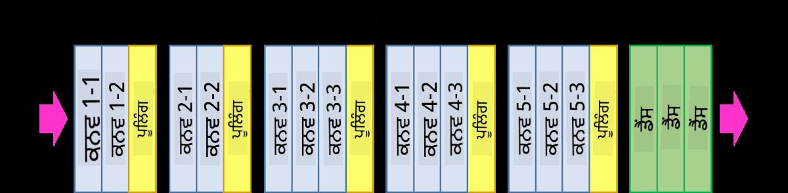

<!--
CO_OP_TRANSLATOR_METADATA:
{
  "original_hash": "a560d5b845962cf33dc102266e409568",
  "translation_date": "2025-09-23T07:27:56+00:00",
  "source_file": "lessons/4-ComputerVision/07-ConvNets/README.md",
  "language_code": "pa"
}
-->
# ਕਨਵੋਲੂਸ਼ਨਲ ਨਿਊਰਲ ਨੈਟਵਰਕਸ

ਅਸੀਂ ਪਹਿਲਾਂ ਦੇਖਿਆ ਹੈ ਕਿ ਨਿਊਰਲ ਨੈਟਵਰਕਸ ਚਿੱਤਰਾਂ ਨਾਲ ਨਿਪਟਣ ਵਿੱਚ ਕਾਫ਼ੀ ਚੰਗੇ ਹਨ, ਅਤੇ ਇੱਕ-ਲੇਅਰ ਪਰਸੈਪਟ੍ਰਾਨ ਵੀ MNIST ਡੇਟਾਸੈੱਟ ਤੋਂ ਹੱਥ ਨਾਲ ਲਿਖੇ ਅੰਕਾਂ ਨੂੰ ਵਾਜਬ ਸਹੀਤਾ ਨਾਲ ਪਛਾਣ ਸਕਦਾ ਹੈ। ਹਾਲਾਂਕਿ, MNIST ਡੇਟਾਸੈੱਟ ਬਹੁਤ ਵਿਸ਼ੇਸ਼ ਹੈ, ਅਤੇ ਸਾਰੇ ਅੰਕ ਚਿੱਤਰ ਦੇ ਅੰਦਰ ਕੇਂਦਰਿਤ ਹਨ, ਜਿਸ ਨਾਲ ਕੰਮ ਸੌਖਾ ਹੋ ਜਾਂਦਾ ਹੈ।

## [ਪ੍ਰੀ-ਲੈਕਚਰ ਕਵਿਜ਼](https://ff-quizzes.netlify.app/en/ai/quiz/13)

ਅਸਲ ਜ਼ਿੰਦਗੀ ਵਿੱਚ, ਅਸੀਂ ਚਾਹੁੰਦੇ ਹਾਂ ਕਿ ਚਿੱਤਰ ਵਿੱਚ ਕਿਸੇ ਵੀ ਸਥਾਨ 'ਤੇ ਵਸਤੂਆਂ ਨੂੰ ਪਛਾਣ ਸਕੀਏ। ਕੰਪਿਊਟਰ ਵਿਜ਼ਨ ਆਮ ਵਰਗੀਕਰਨ ਤੋਂ ਵੱਖ ਹੈ, ਕਿਉਂਕਿ ਜਦੋਂ ਅਸੀਂ ਚਿੱਤਰ ਵਿੱਚ ਕਿਸੇ ਖਾਸ ਵਸਤੂ ਨੂੰ ਲੱਭਣ ਦੀ ਕੋਸ਼ਿਸ਼ ਕਰ ਰਹੇ ਹੁੰਦੇ ਹਾਂ, ਤਾਂ ਅਸੀਂ ਚਿੱਤਰ ਨੂੰ ਸਕੈਨ ਕਰਦੇ ਹਾਂ ਅਤੇ ਕੁਝ ਖਾਸ **ਪੈਟਰਨਜ਼** ਅਤੇ ਉਨ੍ਹਾਂ ਦੇ ਸੰਯੋਜਨਾਂ ਦੀ ਭਾਲ ਕਰਦੇ ਹਾਂ। ਉਦਾਹਰਣ ਲਈ, ਜਦੋਂ ਅਸੀਂ ਬਿੱਲੀ ਦੀ ਭਾਲ ਕਰਦੇ ਹਾਂ, ਤਾਂ ਪਹਿਲਾਂ ਅਸੀਂ ਹੋਰਿਜ਼ਾਂਟਲ ਲਾਈਨਾਂ ਦੀ ਭਾਲ ਕਰ ਸਕਦੇ ਹਾਂ, ਜੋ ਮੁੱਛਾਂ ਬਣਾਉਂਦੀਆਂ ਹਨ, ਅਤੇ ਫਿਰ ਮੁੱਛਾਂ ਦੇ ਕੁਝ ਖਾਸ ਸੰਯੋਜਨ ਸਾਨੂੰ ਦੱਸ ਸਕਦੇ ਹਨ ਕਿ ਇਹ ਅਸਲ ਵਿੱਚ ਬਿੱਲੀ ਦੀ ਤਸਵੀਰ ਹੈ। ਕੁਝ ਪੈਟਰਨਜ਼ ਦੀ ਸੰਬੰਧਿਤ ਸਥਿਤੀ ਅਤੇ ਮੌਜੂਦਗੀ ਮਹੱਤਵਪੂਰਨ ਹੈ, ਨਾ ਕਿ ਉਨ੍ਹਾਂ ਦੀ ਚਿੱਤਰ ਵਿੱਚ ਸਹੀ ਸਥਿਤੀ।

ਪੈਟਰਨਜ਼ ਨੂੰ ਕੱਢਣ ਲਈ, ਅਸੀਂ **ਕਨਵੋਲੂਸ਼ਨਲ ਫਿਲਟਰਜ਼** ਦੀ ਧਾਰਨਾ ਦੀ ਵਰਤੋਂ ਕਰਾਂਗੇ। ਜਿਵੇਂ ਕਿ ਤੁਸੀਂ ਜਾਣਦੇ ਹੋ, ਇੱਕ ਚਿੱਤਰ ਨੂੰ 2D-ਮੈਟ੍ਰਿਕਸ ਜਾਂ ਰੰਗ ਦੀ ਗਹਿਰਾਈ ਵਾਲੇ 3D-ਟੈਂਸਰ ਦੁਆਰਾ ਦਰਸਾਇਆ ਜਾਂਦਾ ਹੈ। ਫਿਲਟਰ ਲਾਗੂ ਕਰਨ ਦਾ ਮਤਲਬ ਹੈ ਕਿ ਅਸੀਂ ਇੱਕ ਛੋਟੀ **ਫਿਲਟਰ ਕਰਨਲ** ਮੈਟ੍ਰਿਕਸ ਲੈਂਦੇ ਹਾਂ, ਅਤੇ ਮੂਲ ਚਿੱਤਰ ਵਿੱਚ ਹਰ ਪਿਕਸਲ ਲਈ ਅਸੀਂ ਪੜੋਸੀ ਬਿੰਦੂਆਂ ਨਾਲ ਵਜ਼ਨੀ ਔਸਤ ਦੀ ਗਣਨਾ ਕਰਦੇ ਹਾਂ। ਅਸੀਂ ਇਸਨੂੰ ਇਸ ਤਰ੍ਹਾਂ ਦੇਖ ਸਕਦੇ ਹਾਂ ਕਿ ਇੱਕ ਛੋਟੀ ਵਿੰਡੋ ਸਾਰੇ ਚਿੱਤਰ 'ਤੇ ਸਲਾਈਡ ਕਰ ਰਹੀ ਹੈ, ਅਤੇ ਫਿਲਟਰ ਕਰਨਲ ਮੈਟ੍ਰਿਕਸ ਵਿੱਚ ਵਜ਼ਨਾਂ ਦੇ ਅਨੁਸਾਰ ਸਾਰੇ ਪਿਕਸਲਾਂ ਨੂੰ ਔਸਤ ਕਰ ਰਹੀ ਹੈ।

 | 
----|----

> ਚਿੱਤਰ: ਦਿਮਿਤਰੀ ਸੋਸ਼ਨਿਕੋਵ

ਉਦਾਹਰਣ ਲਈ, ਜੇ ਅਸੀਂ MNIST ਅੰਕਾਂ 'ਤੇ 3x3 ਵਰਟਿਕਲ ਐਜ ਅਤੇ ਹੋਰਿਜ਼ਾਂਟਲ ਐਜ ਫਿਲਟਰ ਲਾਗੂ ਕਰਦੇ ਹਾਂ, ਤਾਂ ਅਸੀਂ ਹਾਈਲਾਈਟਸ (ਜਿਵੇਂ ਕਿ ਉੱਚ ਮੁੱਲ) ਪ੍ਰਾਪਤ ਕਰ ਸਕਦੇ ਹਾਂ ਜਿੱਥੇ ਮੂਲ ਚਿੱਤਰ ਵਿੱਚ ਵਰਟਿਕਲ ਅਤੇ ਹੋਰਿਜ਼ਾਂਟਲ ਐਜ ਹਨ। ਇਸ ਤਰ੍ਹਾਂ ਇਹ ਦੋ ਫਿਲਟਰ "ਐਜ" ਲੱਭਣ ਲਈ ਵਰਤੇ ਜਾ ਸਕਦੇ ਹਨ। ਇਸੇ ਤਰ੍ਹਾਂ, ਅਸੀਂ ਹੋਰ ਨੀਚਲੇ-ਸਤਰ ਦੇ ਪੈਟਰਨਜ਼ ਲੱਭਣ ਲਈ ਵੱਖ-ਵੱਖ ਫਿਲਟਰ ਡਿਜ਼ਾਈਨ ਕਰ ਸਕਦੇ ਹਾਂ:

> ਚਿੱਤਰ: [ਲਿਊਂਗ-ਮਾਲਿਕ ਫਿਲਟਰ ਬੈਂਕ](https://www.robots.ox.ac.uk/~vgg/research/texclass/filters.html)

ਹਾਲਾਂਕਿ, ਜਦੋਂ ਕਿ ਅਸੀਂ ਕੁਝ ਪੈਟਰਨਜ਼ ਕੱਢਣ ਲਈ ਫਿਲਟਰਜ਼ ਨੂੰ ਹੱਥੋਂ ਡਿਜ਼ਾਈਨ ਕਰ ਸਕਦੇ ਹਾਂ, ਅਸੀਂ ਨੈਟਵਰਕ ਨੂੰ ਇਸ ਤਰ੍ਹਾਂ ਡਿਜ਼ਾਈਨ ਕਰ ਸਕਦੇ ਹਾਂ ਕਿ ਇਹ ਪੈਟਰਨਜ਼ ਨੂੰ ਆਪਣੇ ਆਪ ਸਿੱਖੇ। ਇਹ CNN ਦੇ ਪਿੱਛੇ ਮੁੱਖ ਵਿਚਾਰਾਂ ਵਿੱਚੋਂ ਇੱਕ ਹੈ।

## CNN ਦੇ ਮੁੱਖ ਵਿਚਾਰ

CNNs ਦੇ ਕੰਮ ਕਰਨ ਦਾ ਤਰੀਕਾ ਹੇਠਾਂ ਦਿੱਤੇ ਮਹੱਤਵਪੂਰਨ ਵਿਚਾਰਾਂ 'ਤੇ ਆਧਾਰਿਤ ਹੈ:

* ਕਨਵੋਲੂਸ਼ਨਲ ਫਿਲਟਰ ਪੈਟਰਨਜ਼ ਕੱਢ ਸਕਦੇ ਹਨ
* ਅਸੀਂ ਨੈਟਵਰਕ ਨੂੰ ਇਸ ਤਰ੍ਹਾਂ ਡਿਜ਼ਾਈਨ ਕਰ ਸਕਦੇ ਹਾਂ ਕਿ ਫਿਲਟਰਜ਼ ਆਪਣੇ ਆਪ ਸਿੱਖੇ ਜਾਣ
* ਅਸੀਂ ਇਹੀ ਤਰੀਕਾ ਉੱਚ-ਸਤਰ ਦੇ ਫੀਚਰਜ਼ ਵਿੱਚ ਪੈਟਰਨਜ਼ ਲੱਭਣ ਲਈ ਵਰਤ ਸਕਦੇ ਹਾਂ, ਨਾ ਕਿ ਸਿਰਫ਼ ਮੂਲ ਚਿੱਤਰ ਵਿੱਚ। ਇਸ ਤਰ੍ਹਾਂ CNN ਫੀਚਰ ਕੱਢਣ ਦਾ ਕੰਮ ਫੀਚਰਜ਼ ਦੀ ਹਾਇਰਾਰਕੀ 'ਤੇ ਹੁੰਦਾ ਹੈ, ਜੋ ਨੀਚਲੇ-ਸਤਰ ਦੇ ਪਿਕਸਲ ਸੰਯੋਜਨਾਂ ਤੋਂ ਸ਼ੁਰੂ ਹੁੰਦਾ ਹੈ, ਅਤੇ ਚਿੱਤਰ ਦੇ ਹਿੱਸਿਆਂ ਦੇ ਉੱਚ-ਸਤਰ ਦੇ ਸੰਯੋਜਨ ਤੱਕ ਪਹੁੰਚਦਾ ਹੈ।

> ਚਿੱਤਰ: [ਹਿਸਲੋਪ-ਲਿੰਚ ਦੇ ਪੇਪਰ](https://www.semanticscholar.org/paper/Computer-vision-based-pedestrian-trajectory-Hislop-Lynch/26e6f74853fc9bbb7487b06dc2cf095d36c9021d) ਤੋਂ, [ਉਨ੍ਹਾਂ ਦੇ ਰਿਸਰਚ](https://dl.acm.org/doi/abs/10.1145/1553374.1553453) ਦੇ ਆਧਾਰ 'ਤੇ

## ✍️ ਅਭਿਆਸ: ਕਨਵੋਲੂਸ਼ਨਲ ਨਿਊਰਲ ਨੈਟਵਰਕਸ

ਆਓ ਅੱਗੇ ਵਧੀਏ ਅਤੇ ਕਨਵੋਲੂਸ਼ਨਲ ਨਿਊਰਲ ਨੈਟਵਰਕਸ ਕਿਵੇਂ ਕੰਮ ਕਰਦੇ ਹਨ ਅਤੇ ਅਸੀਂ ਕਿਵੇਂ ਟ੍ਰੇਨਬਲ ਫਿਲਟਰ ਪ੍ਰਾਪਤ ਕਰ ਸਕਦੇ ਹਾਂ, ਇਸ ਨੂੰ ਸਮਝਣ ਲਈ ਹੇਠਾਂ ਦਿੱਤੇ ਨੋਟਬੁੱਕਸ 'ਤੇ ਕੰਮ ਕਰਦੇ ਹਾਂ:

* [ਕਨਵੋਲੂਸ਼ਨਲ ਨਿਊਰਲ ਨੈਟਵਰਕਸ - PyTorch](ConvNetsPyTorch.ipynb)
* [ਕਨਵੋਲੂਸ਼ਨਲ ਨਿਊਰਲ ਨੈਟਵਰਕਸ - TensorFlow](ConvNetsTF.ipynb)

## ਪਿਰਾਮਿਡ ਆਰਕੀਟੈਕਚਰ

ਚਿੱਤਰ ਪ੍ਰੋਸੈਸਿੰਗ ਲਈ ਵਰਤੇ ਜਾਣ ਵਾਲੇ ਜ਼ਿਆਦਾਤਰ CNNs ਨੂੰ ਪਿਰਾਮਿਡ ਆਰਕੀਟੈਕਚਰ ਕਿਹਾ ਜਾਂਦਾ ਹੈ। ਮੂਲ ਚਿੱਤਰਾਂ 'ਤੇ ਲਾਗੂ ਕੀਤੀ ਗਈ ਪਹਿਲੀ ਕਨਵੋਲੂਸ਼ਨਲ ਲੇਅਰ ਵਿੱਚ ਆਮ ਤੌਰ 'ਤੇ ਫਿਲਟਰਜ਼ ਦੀ ਸੰਖਿਆ ਘੱਟ ਹੁੰਦੀ ਹੈ (8-16), ਜੋ ਵੱਖ-ਵੱਖ ਪਿਕਸਲ ਸੰਯੋਜਨਾਂ ਨੂੰ ਦਰਸਾਉਂਦੇ ਹਨ, ਜਿਵੇਂ ਕਿ ਹੋਰਿਜ਼ਾਂਟਲ/ਵਰਟਿਕਲ ਲਾਈਨਾਂ ਜਾਂ ਸਟ੍ਰੋਕਸ। ਅਗਲੇ ਪੱਧਰ 'ਤੇ, ਅਸੀਂ ਨੈਟਵਰਕ ਦੇ ਸਪੈਸ਼ਲ ਡਾਇਮੈਂਸ਼ਨ ਨੂੰ ਘਟਾਉਂਦੇ ਹਾਂ, ਅਤੇ ਫਿਲਟਰਜ਼ ਦੀ ਸੰਖਿਆ ਵਧਾਉਂਦੇ ਹਾਂ, ਜੋ ਸਧਾਰਨ ਫੀਚਰਜ਼ ਦੇ ਵਧੇਰੇ ਸੰਭਾਵਿਤ ਸੰਯੋਜਨਾਂ ਨੂੰ ਦਰਸਾਉਂਦੇ ਹਨ। ਹਰ ਲੇਅਰ ਦੇ ਨਾਲ, ਜਦੋਂ ਅਸੀਂ ਅੰਤਮ ਵਰਗੀਕਰਨ ਵੱਲ ਵਧਦੇ ਹਾਂ, ਚਿੱਤਰ ਦੇ ਸਪੈਸ਼ਲ ਡਾਇਮੈਂਸ਼ਨ ਘਟਦੇ ਹਨ, ਅਤੇ ਫਿਲਟਰਜ਼ ਦੀ ਗਿਣਤੀ ਵਧਦੀ ਹੈ।

ਉਦਾਹਰਣ ਵਜੋਂ, ਆਓ VGG-16 ਦੀ ਆਰਕੀਟੈਕਚਰ ਨੂੰ ਦੇਖੀਏ, ਇੱਕ ਨੈਟਵਰਕ ਜਿਸ ਨੇ 2014 ਵਿੱਚ ImageNet ਦੇ ਟਾਪ-5 ਵਰਗੀਕਰਨ ਵਿੱਚ 92.7% ਸਹੀਤਾ ਪ੍ਰਾਪਤ ਕੀਤੀ:

> ਚਿੱਤਰ: [ਰਿਸਰਚਗੇਟ](https://www.researchgate.net/figure/Vgg16-model-structure-To-get-the-VGG-NIN-model-we-replace-the-2-nd-4-th-6-th-7-th_fig2_335194493) ਤੋਂ

## ਸਭ ਤੋਂ ਪ੍ਰਸਿੱਧ CNN ਆਰਕੀਟੈਕਚਰਜ਼

[ਸਭ ਤੋਂ ਪ੍ਰਸਿੱਧ CNN ਆਰਕੀਟੈਕਚਰਜ਼ ਬਾਰੇ ਆਪਣਾ ਅਧਿਐਨ ਜਾਰੀ ਰੱਖੋ](CNN_Architectures.md)

---

