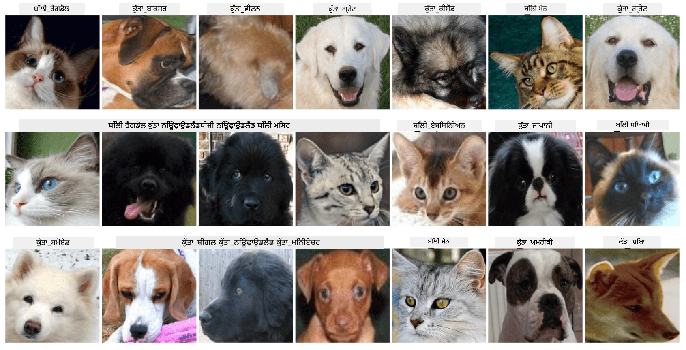

# ਪਾਲਤੂ ਜਾਨਵਰਾਂ ਦੇ ਚਿਹਰਿਆਂ ਦੀ ਵਰਗੀਕਰਨ

[AI for Beginners Curriculum](https://github.com/microsoft/ai-for-beginners) ਤੋਂ ਲੈਬ ਅਸਾਈਨਮੈਂਟ।

## ਕੰਮ

ਕਲਪਨਾ ਕਰੋ ਕਿ ਤੁਹਾਨੂੰ ਪਾਲਤੂ ਜਾਨਵਰਾਂ ਦੇ ਨਰਸਰੀ ਲਈ ਇੱਕ ਐਪਲੀਕੇਸ਼ਨ ਵਿਕਸਿਤ ਕਰਨੀ ਹੈ ਜੋ ਸਾਰੇ ਪਾਲਤੂ ਜਾਨਵਰਾਂ ਨੂੰ ਕੈਟਾਲੌਗ ਕਰ ਸਕੇ। ਇਸ ਤਰ੍ਹਾਂ ਦੀ ਐਪਲੀਕੇਸ਼ਨ ਦੀ ਇੱਕ ਸ਼ਾਨਦਾਰ ਵਿਸ਼ੇਸ਼ਤਾ ਇਹ ਹੋਵੇਗੀ ਕਿ ਫੋਟੋ ਤੋਂ ਬਰੀਡ ਨੂੰ ਆਪਣੇ ਆਪ ਪਛਾਣਨਾ। ਇਹ ਕੰਮ ਨਿਊਰਲ ਨੈਟਵਰਕ ਦੀ ਮਦਦ ਨਾਲ ਸਫਲਤਾਪੂਰਵਕ ਕੀਤਾ ਜਾ ਸਕਦਾ ਹੈ।

ਤੁਹਾਨੂੰ **Pet Faces** ਡੇਟਾਸੈਟ ਦੀ ਵਰਤੋਂ ਕਰਕੇ ਬਿੱਲੀਆਂ ਅਤੇ ਕੁੱਤਿਆਂ ਦੀਆਂ ਵੱਖ-ਵੱਖ ਬਰੀਡਾਂ ਨੂੰ ਵਰਗੀਕ੍ਰਿਤ ਕਰਨ ਲਈ ਇੱਕ ਕਨਵੋਲੂਸ਼ਨਲ ਨਿਊਰਲ ਨੈਟਵਰਕ ਨੂੰ ਟ੍ਰੇਨ ਕਰਨਾ ਹੈ।

## ਡੇਟਾਸੈਟ

ਅਸੀਂ [Oxford-IIIT Pet Dataset](https://www.robots.ox.ac.uk/~vgg/data/pets/) ਦੀ ਵਰਤੋਂ ਕਰਾਂਗੇ, ਜਿਸ ਵਿੱਚ ਕੁੱਤਿਆਂ ਅਤੇ ਬਿੱਲੀਆਂ ਦੀਆਂ 37 ਵੱਖ-ਵੱਖ ਬਰੀਡਾਂ ਦੀਆਂ ਤਸਵੀਰਾਂ ਸ਼ਾਮਲ ਹਨ।



ਡੇਟਾਸੈਟ ਡਾਊਨਲੋਡ ਕਰਨ ਲਈ, ਇਸ ਕੋਡ ਸਨਿੱਪਟ ਦੀ ਵਰਤੋਂ ਕਰੋ:

```python
!wget https://thor.robots.ox.ac.uk/~vgg/data/pets/images.tar.gz
!tar xfz images.tar.gz
!rm images.tar.gz
```

**ਨੋਟ:** Oxford-IIIT Pet Dataset ਦੀਆਂ ਤਸਵੀਰਾਂ ਫਾਈਲਨਾਮ ਦੁਆਰਾ ਆਯੋਜਿਤ ਕੀਤੀਆਂ ਗਈਆਂ ਹਨ (ਜਿਵੇਂ `Abyssinian_1.jpg`, `Bengal_2.jpg`)। ਨੋਟਬੁੱਕ ਵਿੱਚ ਇਹ ਤਸਵੀਰਾਂ ਨੂੰ ਬਰੀਡ-ਸਪੇਸਿਫਿਕ ਸਬਡਾਇਰੈਕਟਰੀਜ਼ ਵਿੱਚ ਆਯੋਜਿਤ ਕਰਨ ਲਈ ਕੋਡ ਸ਼ਾਮਲ ਹੈ, ਜਿਸ ਨਾਲ ਵਰਗੀਕਰਨ ਆਸਾਨ ਬਣਦਾ ਹੈ।

## ਸ਼ੁਰੂਆਤੀ ਨੋਟਬੁੱਕ

ਲੈਬ ਸ਼ੁਰੂ ਕਰਨ ਲਈ [PetFaces.ipynb](PetFaces.ipynb) ਖੋਲ੍ਹੋ।

## ਸਿੱਖਣ ਵਾਲੀ ਗੱਲ

ਤੁਸੀਂ ਸ਼ੁਰੂ ਤੋਂ ਇੱਕ ਮੁਸ਼ਕਲ ਸਮੱਸਿਆ ਨੂੰ ਹੱਲ ਕੀਤਾ ਹੈ ਜੋ ਚਿੱਤਰ ਵਰਗੀਕਰਨ ਨਾਲ ਸੰਬੰਧਿਤ ਹੈ! ਕਾਫ਼ੀ ਸਾਰੀਆਂ ਕਲਾਸਾਂ ਸਨ, ਅਤੇ ਤੁਸੀਂ ਫਿਰ ਵੀ ਵਾਜਬ ਸਹੀਤਾ ਪ੍ਰਾਪਤ ਕਰਨ ਵਿੱਚ ਸਫਲ ਰਹੇ! ਇਹ ਵੀ ਮਹੱਤਵਪੂਰਨ ਹੈ ਕਿ top-k ਸਹੀਤਾ ਨੂੰ ਮਾਪਿਆ ਜਾਵੇ, ਕਿਉਂਕਿ ਕੁਝ ਕਲਾਸਾਂ ਨੂੰ ਗਲਤ ਸਮਝਣਾ ਆਸਾਨ ਹੈ ਜੋ ਮਨੁੱਖਾਂ ਲਈ ਵੀ ਸਪਸ਼ਟ ਤੌਰ 'ਤੇ ਵੱਖਰੀਆਂ ਨਹੀਂ ਹਨ।

---

**ਅਸਵੀਕਰਤਾ**:  
ਇਹ ਦਸਤਾਵੇਜ਼ AI ਅਨੁਵਾਦ ਸੇਵਾ [Co-op Translator](https://github.com/Azure/co-op-translator) ਦੀ ਵਰਤੋਂ ਕਰਕੇ ਅਨੁਵਾਦ ਕੀਤਾ ਗਿਆ ਹੈ। ਜਦੋਂ ਕਿ ਅਸੀਂ ਸਹੀਤਾ ਲਈ ਯਤਨਸ਼ੀਲ ਹਾਂ, ਕਿਰਪਾ ਕਰਕੇ ਧਿਆਨ ਦਿਓ ਕਿ ਸਵੈਚਾਲਿਤ ਅਨੁਵਾਦਾਂ ਵਿੱਚ ਗਲਤੀਆਂ ਜਾਂ ਅਸੁੱਤੀਆਂ ਹੋ ਸਕਦੀਆਂ ਹਨ। ਇਸ ਦੀ ਮੂਲ ਭਾਸ਼ਾ ਵਿੱਚ ਮੌਜੂਦ ਅਸਲ ਦਸਤਾਵੇਜ਼ ਨੂੰ ਅਧਿਕਾਰਤ ਸਰੋਤ ਮੰਨਿਆ ਜਾਣਾ ਚਾਹੀਦਾ ਹੈ। ਮਹੱਤਵਪੂਰਨ ਜਾਣਕਾਰੀ ਲਈ, ਪੇਸ਼ੇਵਰ ਮਨੁੱਖੀ ਅਨੁਵਾਦ ਦੀ ਸਿਫਾਰਸ਼ ਕੀਤੀ ਜਾਂਦੀ ਹੈ। ਇਸ ਅਨੁਵਾਦ ਦੀ ਵਰਤੋਂ ਤੋਂ ਪੈਦਾ ਹੋਣ ਵਾਲੇ ਕਿਸੇ ਵੀ ਗਲਤ ਫਹਿਮੀ ਜਾਂ ਗਲਤ ਵਿਆਖਿਆ ਲਈ ਅਸੀਂ ਜ਼ਿੰਮੇਵਾਰ ਨਹੀਂ ਹਾਂ।