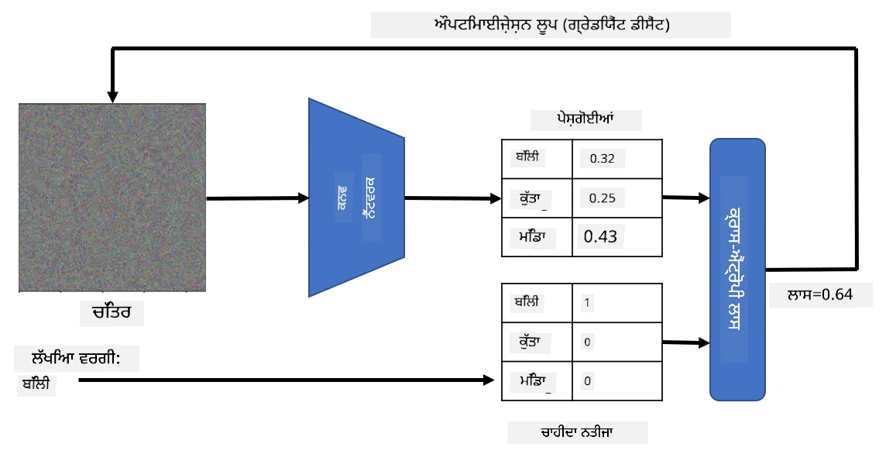

# ਪ੍ਰੀ-ਟ੍ਰੇਨਡ ਨੈਟਵਰਕ ਅਤੇ ਟ੍ਰਾਂਸਫਰ ਲਰਨਿੰਗ

CNNs ਨੂੰ ਟ੍ਰੇਨ ਕਰਨ ਵਿੱਚ ਕਾਫ਼ੀ ਸਮਾਂ ਲੱਗਦਾ ਹੈ, ਅਤੇ ਇਸ ਕੰਮ ਲਈ ਕਾਫ਼ੀ ਡਾਟਾ ਦੀ ਲੋੜ ਹੁੰਦੀ ਹੈ। ਹਾਲਾਂਕਿ, ਜ਼ਿਆਦਾਤਰ ਸਮਾਂ ਨੈਟਵਰਕ ਲਈ ਸਭ ਤੋਂ ਵਧੀਆ ਲੋ-ਲੈਵਲ ਫਿਲਟਰ ਸਿੱਖਣ ਵਿੱਚ ਲੱਗਦਾ ਹੈ, ਜੋ ਚਿੱਤਰਾਂ ਤੋਂ ਪੈਟਰਨ ਕੱਢਣ ਲਈ ਵਰਤੇ ਜਾ ਸਕਦੇ ਹਨ। ਇੱਕ ਕੁਦਰਤੀ ਸਵਾਲ ਉੱਠਦਾ ਹੈ - ਕੀ ਅਸੀਂ ਇੱਕ ਡਾਟਾਸੈਟ 'ਤੇ ਟ੍ਰੇਨ ਕੀਤੇ ਗਏ ਨਿਊਰਲ ਨੈਟਵਰਕ ਨੂੰ ਵਰਤ ਸਕਦੇ ਹਾਂ ਅਤੇ ਇਸ ਨੂੰ ਵੱਖ-ਵੱਖ ਚਿੱਤਰਾਂ ਨੂੰ ਕਲਾਸੀਫਾਈ ਕਰਨ ਲਈ ਅਨੁਕੂਲ ਕਰ ਸਕਦੇ ਹਾਂ ਬਿਨਾਂ ਪੂਰੇ ਟ੍ਰੇਨਿੰਗ ਪ੍ਰਕਿਰਿਆ ਦੀ ਲੋੜ ਪਈ?

## [ਪ੍ਰੀ-ਲੈਕਚਰ ਕਵਿਜ਼](https://ff-quizzes.netlify.app/en/ai/quiz/15)

ਇਸ ਪਹੁੰਚ ਨੂੰ **ਟ੍ਰਾਂਸਫਰ ਲਰਨਿੰਗ** ਕਿਹਾ ਜਾਂਦਾ ਹੈ, ਕਿਉਂਕਿ ਅਸੀਂ ਇੱਕ ਨਿਊਰਲ ਨੈਟਵਰਕ ਮਾਡਲ ਤੋਂ ਦੂਜੇ ਵਿੱਚ ਕੁਝ ਗਿਆਨ ਟ੍ਰਾਂਸਫਰ ਕਰਦੇ ਹਾਂ। ਟ੍ਰਾਂਸਫਰ ਲਰਨਿੰਗ ਵਿੱਚ, ਅਸੀਂ ਆਮ ਤੌਰ 'ਤੇ ਇੱਕ ਪ੍ਰੀ-ਟ੍ਰੇਨਡ ਮਾਡਲ ਨਾਲ ਸ਼ੁਰੂ ਕਰਦੇ ਹਾਂ, ਜੋ ਕਿ ਕੁਝ ਵੱਡੇ ਚਿੱਤਰ ਡਾਟਾਸੈਟ, ਜਿਵੇਂ ਕਿ **ImageNet**, 'ਤੇ ਟ੍ਰੇਨ ਕੀਤਾ ਗਿਆ ਹੁੰਦਾ ਹੈ। ਇਹ ਮਾਡਲ ਪਹਿਲਾਂ ਹੀ ਵੱਖ-ਵੱਖ ਫੀਚਰਾਂ ਨੂੰ ਕਾਢਣ ਵਿੱਚ ਚੰਗਾ ਕੰਮ ਕਰ ਸਕਦੇ ਹਨ, ਅਤੇ ਬਹੁਤ ਸਾਰੇ ਕੇਸਾਂ ਵਿੱਚ, ਉਹਨਾਂ ਕਾਢੇ ਗਏ ਫੀਚਰਾਂ ਦੇ ਉੱਪਰ ਸਿਰਫ਼ ਇੱਕ ਕਲਾਸੀਫਾਇਰ ਬਣਾਉਣਾ ਚੰਗੇ ਨਤੀਜੇ ਦੇ ਸਕਦਾ ਹੈ।

> ✅ ਟ੍ਰਾਂਸਫਰ ਲਰਨਿੰਗ ਇੱਕ ਸ਼ਬਦ ਹੈ ਜੋ ਤੁਹਾਨੂੰ ਹੋਰ ਅਕਾਦਮਿਕ ਖੇਤਰਾਂ ਵਿੱਚ ਮਿਲਦਾ ਹੈ, ਜਿਵੇਂ ਕਿ ਸਿੱਖਿਆ। ਇਹ ਇੱਕ ਖੇਤਰ ਤੋਂ ਦੂਜੇ ਵਿੱਚ ਗਿਆਨ ਲਾਗੂ ਕਰਨ ਦੀ ਪ੍ਰਕਿਰਿਆ ਨੂੰ ਦਰਸਾਉਂਦਾ ਹੈ।

## ਪ੍ਰੀ-ਟ੍ਰੇਨਡ ਮਾਡਲ ਫੀਚਰ ਐਕਸਟ੍ਰੈਕਟਰ ਵਜੋਂ

ਪਿਛਲੇ ਸੈਕਸ਼ਨ ਵਿੱਚ ਜਿਨ੍ਹਾਂ ਕਨਵੋਲੂਸ਼ਨਲ ਨੈਟਵਰਕਸ ਬਾਰੇ ਗੱਲ ਕੀਤੀ ਗਈ ਸੀ, ਉਹਨਾਂ ਵਿੱਚ ਕਈ ਲੇਅਰ ਸ਼ਾਮਲ ਹੁੰਦੀਆਂ ਹਨ, ਜਿਨ੍ਹਾਂ ਵਿੱਚੋਂ ਹਰ ਇੱਕ ਚਿੱਤਰ ਤੋਂ ਕੁਝ ਫੀਚਰ ਕਾਢਣ ਲਈ ਬਣਾਈ ਗਈ ਹੈ। ਇਹ ਲੇਅਰ ਲੋ-ਲੈਵਲ ਪਿਕਸਲ ਕੌਂਬੀਨੇਸ਼ਨ (ਜਿਵੇਂ ਕਿ ਹੌਰਿਜ਼ਾਂਟਲ/ਵਰਟੀਕਲ ਲਾਈਨ ਜਾਂ ਸਟ੍ਰੋਕ) ਤੋਂ ਸ਼ੁਰੂ ਹੁੰਦੀ ਹੈ, ਅਤੇ ਉੱਚ-ਲੈਵਲ ਫੀਚਰਾਂ ਦੇ ਕੌਂਬੀਨੇਸ਼ਨ ਤੱਕ ਪਹੁੰਚਦੀ ਹੈ, ਜੋ ਕਿ ਜਿਵੇਂ ਕਿ ਅੱਗ ਦੀਆਂ ਅੱਖਾਂ ਵਰਗੇ ਚੀਜ਼ਾਂ ਨੂੰ ਦਰਸਾਉਂਦੀ ਹੈ। ਜੇਕਰ ਅਸੀਂ ਜਨਰਲ ਅਤੇ ਵੱਖ-ਵੱਖ ਚਿੱਤਰਾਂ ਦੇ ਕਾਫ਼ੀ ਵੱਡੇ ਡਾਟਾਸੈਟ 'ਤੇ CNN ਨੂੰ ਟ੍ਰੇਨ ਕਰਦੇ ਹਾਂ, ਤਾਂ ਨੈਟਵਰਕ ਉਹਨਾਂ ਆਮ ਫੀਚਰਾਂ ਨੂੰ ਕਾਢਣ ਸਿੱਖ ਸਕਦਾ ਹੈ।

Keras ਅਤੇ PyTorch ਵਿੱਚ ਕੁਝ ਆਮ ਆਰਕੀਟੈਕਚਰਾਂ ਲਈ ਪ੍ਰੀ-ਟ੍ਰੇਨਡ ਨਿਊਰਲ ਨੈਟਵਰਕ ਵਜ਼ਨ ਨੂੰ ਆਸਾਨੀ ਨਾਲ ਲੋਡ ਕਰਨ ਲਈ ਫੰਕਸ਼ਨ ਸ਼ਾਮਲ ਹਨ, ਜਿਨ੍ਹਾਂ ਵਿੱਚੋਂ ਜ਼ਿਆਦਾਤਰ ImageNet ਚਿੱਤਰਾਂ 'ਤੇ ਟ੍ਰੇਨ ਕੀਤੇ ਗਏ ਹਨ। ਸਭ ਤੋਂ ਵੱਧ ਵਰਤੇ ਜਾਣ ਵਾਲੇ ਮਾਡਲ ਪਿਛਲੇ ਪਾਠ ਦੇ [CNN Architectures](../07-ConvNets/CNN_Architectures.md) ਪੰਨੇ 'ਤੇ ਵੇਖਾਏ ਗਏ ਹਨ। ਖਾਸ ਤੌਰ 'ਤੇ, ਤੁਸੀਂ ਹੇਠਾਂ ਦਿੱਤੇ ਮਾਡਲਾਂ ਵਿੱਚੋਂ ਇੱਕ ਨੂੰ ਵਰਤਣ ਬਾਰੇ ਸੋਚ ਸਕਦੇ ਹੋ:

* **VGG-16/VGG-19** ਜੋ ਸਧਾਰਨ ਮਾਡਲ ਹਨ ਪਰ ਫਿਰ ਵੀ ਚੰਗੀ ਐਕੁਰੇਸੀ ਦਿੰਦੇ ਹਨ। ਅਕਸਰ VGG ਨੂੰ ਪਹਿਲੀ ਕੋਸ਼ਿਸ਼ ਵਜੋਂ ਵਰਤਣਾ ਇੱਕ ਚੰਗਾ ਚੋਣ ਹੁੰਦੀ ਹੈ ਇਹ ਵੇਖਣ ਲਈ ਕਿ ਟ੍ਰਾਂਸਫਰ ਲਰਨਿੰਗ ਕਿਵੇਂ ਕੰਮ ਕਰ ਰਹੀ ਹੈ।
* **ResNet** ਮਾਈਕਰੋਸਾਫਟ ਰਿਸਰਚ ਦੁਆਰਾ 2015 ਵਿੱਚ ਪ੍ਰਸਤਾਵਿਤ ਮਾਡਲਾਂ ਦਾ ਇੱਕ ਪਰਿਵਾਰ ਹੈ। ਇਹਨਾਂ ਵਿੱਚ ਵੱਧ ਲੇਅਰ ਹਨ, ਅਤੇ ਇਸ ਲਈ ਵੱਧ ਰਿਸੋਰਸ ਲੈਂਦੇ ਹਨ।
* **MobileNet** ਛੋਟੇ ਆਕਾਰ ਵਾਲੇ ਮਾਡਲਾਂ ਦਾ ਪਰਿਵਾਰ ਹੈ, ਜੋ ਮੋਬਾਈਲ ਡਿਵਾਈਸਾਂ ਲਈ ਉਚਿਤ ਹਨ। ਜੇਕਰ ਤੁਹਾਡੇ ਕੋਲ ਘੱਟ ਰਿਸੋਰਸ ਹਨ ਅਤੇ ਤੁਸੀਂ ਕੁਝ ਐਕੁਰੇਸੀ ਕੁਰਬਾਨ ਕਰ ਸਕਦੇ ਹੋ, ਤਾਂ ਇਹਨਾਂ ਨੂੰ ਵਰਤੋ।

ਇੱਥੇ VGG-16 ਨੈਟਵਰਕ ਦੁਆਰਾ ਇੱਕ ਬਿੱਲੀ ਦੀ ਤਸਵੀਰ ਤੋਂ ਕਾਢੇ ਗਏ ਫੀਚਰਾਂ ਦੇ ਨਮੂਨੇ ਹਨ:

## ਬਿੱਲੀਆਂ ਵਸੋਂ ਕੁੱਤੇ ਡਾਟਾਸੈਟ

ਇਸ ਉਦਾਹਰਨ ਵਿੱਚ, ਅਸੀਂ [Cats and Dogs](https://www.microsoft.com/download/details.aspx?id=54765&WT.mc_id=academic-77998-cacaste) ਡਾਟਾਸੈਟ ਵਰਤਾਂਗੇ, ਜੋ ਕਿ ਇੱਕ ਹਕੀਕਤੀ-ਜੀਵਨ ਚਿੱਤਰ ਕਲਾਸੀਫਿਕੇਸ਼ਨ ਸਥਿਤੀ ਦੇ ਬਹੁਤ ਨੇੜੇ ਹੈ।

## ✍️ ਅਭਿਆਸ: ਟ੍ਰਾਂਸਫਰ ਲਰਨਿੰਗ

ਆਓ ਟ੍ਰਾਂਸਫਰ ਲਰਨਿੰਗ ਨੂੰ ਸੰਬੰਧਿਤ ਨੋਟਬੁੱਕਸ ਵਿੱਚ ਕਾਰਵਾਈ ਵਿੱਚ ਦੇਖੀਏ:

* [Transfer Learning - PyTorch](TransferLearningPyTorch.ipynb)
* [Transfer Learning - TensorFlow](TransferLearningTF.ipynb)

## ਵਿਜ਼ੁਅਲਾਈਜ਼ਿੰਗ ਐਡਵਰਸਰੀਅਲ ਬਿੱਲੀ

ਪ੍ਰੀ-ਟ੍ਰੇਨਡ ਨਿਊਰਲ ਨੈਟਵਰਕ ਦੇ "ਦਿਮਾਗ" ਵਿੱਚ ਵੱਖ-ਵੱਖ ਪੈਟਰਨ ਹੁੰਦੇ ਹਨ, ਜਿਨ੍ਹਾਂ ਵਿੱਚ **ਆਦਰਸ਼ ਬਿੱਲੀ** (ਜਿਵੇਂ ਕਿ ਆਦਰਸ਼ ਕੁੱਤਾ, ਆਦਰਸ਼ ਜ਼ੈਬਰਾ, ਆਦਿ) ਦੇ ਧਾਰਨਾ ਸ਼ਾਮਲ ਹੁੰਦੀ ਹੈ। ਇਹ ਦਿਲਚਸਪ ਹੋਵੇਗਾ ਕਿ ਕਿਸੇ ਤਰੀਕੇ ਨਾਲ **ਇਸ ਚਿੱਤਰ ਨੂੰ ਵਿਜ਼ੁਅਲਾਈਜ਼** ਕੀਤਾ ਜਾਵੇ। ਹਾਲਾਂਕਿ, ਇਹ ਸੌਖਾ ਨਹੀਂ ਹੈ, ਕਿਉਂਕਿ ਪੈਟਰਨ ਨੈਟਵਰਕ ਵਜ਼ਨਾਂ ਵਿੱਚ ਫੈਲੇ ਹੋਏ ਹਨ, ਅਤੇ ਇੱਕ ਹਾਇਰਾਰਕੀਕਲ ਸਟ੍ਰਕਚਰ ਵਿੱਚ ਸੰਗਠਿਤ ਹਨ।

ਇੱਕ ਪਹੁੰਚ ਜੋ ਅਸੀਂ ਅਪਣਾਉ ਸਕਦੇ ਹਾਂ ਉਹ ਹੈ ਇੱਕ ਰੈਂਡਮ ਚਿੱਤਰ ਨਾਲ ਸ਼ੁਰੂ ਕਰਨਾ, ਅਤੇ ਫਿਰ **ਗ੍ਰੇਡੀਅੰਟ ਡਿਸੈਂਟ ਓਪਟੀਮਾਈਜ਼ੇਸ਼ਨ** ਤਕਨੀਕ ਦੀ ਵਰਤੋਂ ਕਰਕੇ ਉਸ ਚਿੱਤਰ ਨੂੰ ਇਸ ਤਰੀਕੇ ਨਾਲ ਢਾਲਣਾ, ਕਿ ਨੈਟਵਰਕ ਇਹ ਸੋਚਣ ਲੱਗੇ ਕਿ ਇਹ ਬਿੱਲੀ ਹੈ।

ਹਾਲਾਂਕਿ, ਜੇ ਅਸੀਂ ਇਹ ਕਰਦੇ ਹਾਂ, ਤਾਂ ਸਾਨੂੰ ਕੁਝ ਬਹੁਤ ਹੀ ਰੈਂਡਮ ਸ਼ੋਰ ਵਰਗਾ ਮਿਲੇਗਾ। ਇਹ ਇਸ ਲਈ ਹੈ ਕਿ *ਨੈਟਵਰਕ ਨੂੰ ਇਹ ਸੋਚਣ ਲਈ ਬਹੁਤ ਸਾਰੇ ਤਰੀਕੇ ਹਨ ਕਿ ਇਨਪੁਟ ਚਿੱਤਰ ਬਿੱਲੀ ਹੈ*, ਜਿਨ੍ਹਾਂ ਵਿੱਚ ਕੁਝ ਵਿਜ਼ੁਅਲ ਤੌਰ 'ਤੇ ਸਮਝਦਾਰ ਨਹੀਂ ਹਨ। ਜਦੋਂ ਕਿ ਉਹ ਚਿੱਤਰ ਬਿੱਲੀ ਲਈ ਆਮ ਪੈਟਰਨਾਂ ਨੂੰ ਸ਼ਾਮਲ ਕਰਦੇ ਹਨ, ਉਨ੍ਹਾਂ ਨੂੰ ਵਿਜ਼ੁਅਲ ਤੌਰ 'ਤੇ ਵੱਖਰੇ ਹੋਣ ਲਈ ਕੁਝ ਵੀ ਬਾਧਾ ਨਹੀਂ ਹੈ।

ਨਤੀਜੇ ਨੂੰ ਸੁਧਾਰਨ ਲਈ, ਅਸੀਂ ਲਾਸ ਫੰਕਸ਼ਨ ਵਿੱਚ ਇੱਕ ਹੋਰ ਟਰਮ ਸ਼ਾਮਲ ਕਰ ਸਕਦੇ ਹਾਂ, ਜਿਸ ਨੂੰ **ਵੈਰੀਏਸ਼ਨ ਲਾਸ** ਕਿਹਾ ਜਾਂਦਾ ਹੈ। ਇਹ ਇੱਕ ਮੈਟ੍ਰਿਕ ਹੈ ਜੋ ਦਿਖਾਉਂਦੀ ਹੈ ਕਿ ਚਿੱਤਰ ਦੇ ਪੜੋਸੀ ਪਿਕਸਲ ਕਿੰਨੇ ਸਮਾਨ ਹਨ। ਵੈਰੀਏਸ਼ਨ ਲਾਸ ਨੂੰ ਘਟਾਉਣ ਨਾਲ ਚਿੱਤਰ ਸਮੂਥ ਬਣਦਾ ਹੈ, ਅਤੇ ਸ਼ੋਰ ਨੂੰ ਦੂਰ ਕਰਦਾ ਹੈ - ਇਸ ਤਰ੍ਹਾਂ ਵਧੇਰੇ ਵਿਜ਼ੁਅਲ ਤੌਰ 'ਤੇ ਆਕਰਸ਼ਕ ਪੈਟਰਨਾਂ ਨੂੰ ਪ੍ਰਗਟ ਕਰਦਾ ਹੈ। ਇੱਥੇ ਉਹ "ਆਦਰਸ਼" ਚਿੱਤਰਾਂ ਦੇ ਉਦਾਹਰਨ ਹਨ, ਜੋ ਬਿੱਲੀ ਅਤੇ ਜ਼ੈਬਰਾ ਵਜੋਂ ਉੱਚ ਸੰਭਾਵਨਾ ਨਾਲ ਕਲਾਸੀਫਾਈ ਕੀਤੇ ਗਏ ਹਨ:

 | 
-----|-----
 *ਆਦਰਸ਼ ਬਿੱਲੀ* | *ਆਦਰਸ਼ ਜ਼ੈਬਰਾ*

ਇਹੀ ਪਹੁੰਚ **ਐਡਵਰਸਰੀਅਲ ਅਟੈਕਸ** ਕਰਨ ਲਈ ਵਰਤੀ ਜਾ ਸਕਦੀ ਹੈ। ਮੰਨ ਲਓ ਕਿ ਅਸੀਂ ਨਿਊਰਲ ਨੈਟਵਰਕ ਨੂੰ ਬੇਵਕੂਫ ਬਣਾਉਣਾ ਚਾਹੁੰਦੇ ਹਾਂ ਅਤੇ ਕੁੱਤੇ ਨੂੰ ਬਿੱਲੀ ਵਜੋਂ ਦਿਖਾਉਣਾ ਚਾਹੁੰਦੇ ਹਾਂ। ਜੇਕਰ ਅਸੀਂ ਕੁੱਤੇ ਦੀ ਤਸਵੀਰ ਲੈਂਦੇ ਹਾਂ, ਜਿਸਨੂੰ ਨੈਟਵਰਕ ਦੁਆਰਾ ਕੁੱਤੇ ਵਜੋਂ ਪਛਾਣਿਆ ਜਾਂਦਾ ਹੈ, ਤਾਂ ਅਸੀਂ ਇਸਨੂੰ ਥੋੜ੍ਹਾ ਜਿਹਾ ਢਾਲ ਸਕਦੇ ਹਾਂ **ਗ੍ਰੇਡੀਅੰਟ ਡਿਸੈਂਟ ਓਪਟੀਮਾਈਜ਼ੇਸ਼ਨ** ਦੀ ਵਰਤੋਂ ਕਰਕੇ, ਜਦੋਂ ਤੱਕ ਨੈਟਵਰਕ ਇਸਨੂੰ ਬਿੱਲੀ ਵਜੋਂ ਕਲਾਸੀਫਾਈ ਕਰਨਾ ਸ਼ੁਰੂ ਨਹੀਂ ਕਰਦਾ:

 | 
-----|-----
*ਕੁੱਤੇ ਦੀ ਮੂਲ ਤਸਵੀਰ* | *ਕੁੱਤੇ ਦੀ ਤਸਵੀਰ ਜੋ ਬਿੱਲੀ ਵਜੋਂ ਕਲਾਸੀਫਾਈ ਕੀਤੀ ਗਈ ਹੈ*

ਉਪਰੋਕਤ ਨਤੀਜਿਆਂ ਨੂੰ ਦੁਹਰਾਉਣ ਲਈ ਕੋਡ ਹੇਠਾਂ ਦਿੱਤੇ ਨੋਟਬੁੱਕ ਵਿੱਚ ਵੇਖੋ:

* [Ideal and Adversarial Cat - TensorFlow](AdversarialCat_TF.ipynb)

## ਨਤੀਜਾ

ਟ੍ਰਾਂਸਫਰ ਲਰਨਿੰਗ ਦੀ ਵਰਤੋਂ ਕਰਕੇ, ਤੁਸੀਂ ਇੱਕ ਕਸਟਮ ਆਬਜੈਕਟ ਕਲਾਸੀਫਿਕੇਸ਼ਨ ਟਾਸਕ ਲਈ ਤੇਜ਼ੀ ਨਾਲ ਕਲਾਸੀਫਾਇਰ ਤਿਆਰ ਕਰ ਸਕਦੇ ਹੋ ਅਤੇ ਉੱਚ ਐਕੁਰੇਸੀ ਪ੍ਰਾਪਤ ਕਰ ਸਕਦੇ ਹੋ। ਤੁਸੀਂ ਵੇਖ ਸਕਦੇ ਹੋ ਕਿ ਹੁਣ ਅਸੀਂ ਜੋ ਵਧੇਰੇ ਜਟਿਲ ਕੰਮ ਹੱਲ ਕਰ ਰਹੇ ਹਾਂ ਉਹ ਉੱਚ ਗਣਨਾਤਮਕ ਸ਼ਕਤੀ ਦੀ ਲੋੜ ਕਰਦੇ ਹਨ, ਅਤੇ CPU 'ਤੇ ਆਸਾਨੀ ਨਾਲ ਹੱਲ ਨਹੀਂ ਕੀਤੇ ਜਾ ਸਕਦੇ। ਅਗਲੇ ਯੂਨਿਟ ਵਿੱਚ, ਅਸੀਂ ਘੱਟ ਗਣਨਾਤਮਕ ਰਿਸੋਰਸਾਂ ਦੀ ਵਰਤੋਂ ਕਰਕੇ ਉਹੀ ਮਾਡਲ ਟ੍ਰੇਨ ਕਰਨ ਲਈ ਇੱਕ ਹੋਰ ਹਲਕੀ ਵਰਤੋਂ ਦੀ ਕੋਸ਼ਿਸ਼ ਕਰਾਂਗੇ, ਜਿਸਦਾ ਨਤੀਜਾ ਸਿਰਫ਼ ਥੋੜ੍ਹੀ ਘੱਟ ਐਕੁਰੇਸੀ ਵਿੱਚ ਹੁੰਦਾ ਹੈ।

## 🚀 ਚੁਣੌਤੀ

ਸੰਬੰਧਿਤ ਨੋਟਬੁੱਕਸ ਵਿੱਚ, ਹੇਠਾਂ ਨੋਟਸ ਹਨ ਕਿ ਟ੍ਰਾਂਸਫਰ ਗਿਆਨ ਕਿਵੇਂ ਸਭ ਤੋਂ ਵਧੀਆ ਕੰਮ ਕਰਦਾ ਹੈ ਜੇਕਰ ਟ੍ਰੇਨਿੰਗ ਡਾਟਾ ਕੁਝ ਹੱਦ ਤੱਕ ਸਮਾਨ ਹੋਵੇ (ਸ਼ਾਇਦ ਜਾਨਵਰਾਂ ਦੀ ਇੱਕ ਨਵੀਂ ਕਿਸਮ)। ਬਿਲਕੁਲ ਨਵੇਂ ਕਿਸਮ ਦੇ ਚਿੱਤਰਾਂ ਨਾਲ ਕੁਝ ਪ੍ਰਯੋਗ ਕਰੋ ਇਹ ਵੇਖਣ ਲਈ ਕਿ ਤੁਹਾਡੇ ਟ੍ਰਾਂਸਫਰ ਗਿਆਨ ਮਾਡਲ ਕਿੰਨਾ ਚੰਗਾ ਜਾਂ ਮਾੜਾ ਕੰਮ ਕਰਦੇ ਹਨ।

## [ਪੋਸਟ-ਲੈਕਚਰ ਕਵਿਜ਼](https://ff-quizzes.netlify.app/en/ai/quiz/16)

## ਸਮੀਖਿਆ ਅਤੇ ਸਵੈ ਅਧਿਐਨ

[TrainingTricks.md](TrainingTricks.md) ਨੂੰ ਪੜ੍ਹੋ ਤਾਂ ਜੋ ਆਪਣੇ ਮਾਡਲਾਂ ਨੂੰ ਟ੍ਰੇਨ ਕਰਨ ਦੇ ਹੋਰ ਤਰੀਕਿਆਂ ਬਾਰੇ ਆਪਣਾ ਗਿਆਨ ਵਧਾ ਸਕੋ।

## [ਅਸਾਈਨਮੈਂਟ](lab/README.md)

ਇਸ ਲੈਬ ਵਿੱਚ, ਅਸੀਂ ਹਕੀਕਤੀ-ਜੀਵਨ [Oxford-IIIT](https://www.robots.ox.ac.uk/~vgg/data/pets/) ਪੈਟਸ ਡਾਟਾਸੈਟ ਦੀ ਵਰਤੋਂ ਕਰਾਂਗੇ ਜਿਸ ਵਿੱਚ ਬਿੱਲੀਆਂ ਅਤੇ ਕੁੱਤਿਆਂ ਦੀਆਂ 35 ਬ੍ਰੀਡਾਂ ਹਨ, ਅਤੇ ਅਸੀਂ ਇੱਕ ਟ੍ਰਾਂਸਫਰ ਲਰਨਿੰਗ ਕਲਾਸੀਫਾਇਰ ਬਣਾਉਂਦੇ ਹਾਂ।

---

