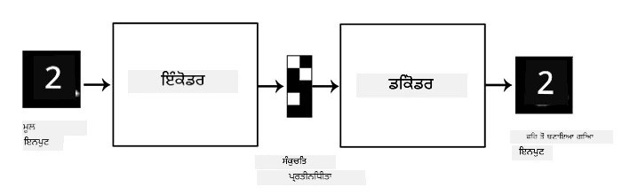
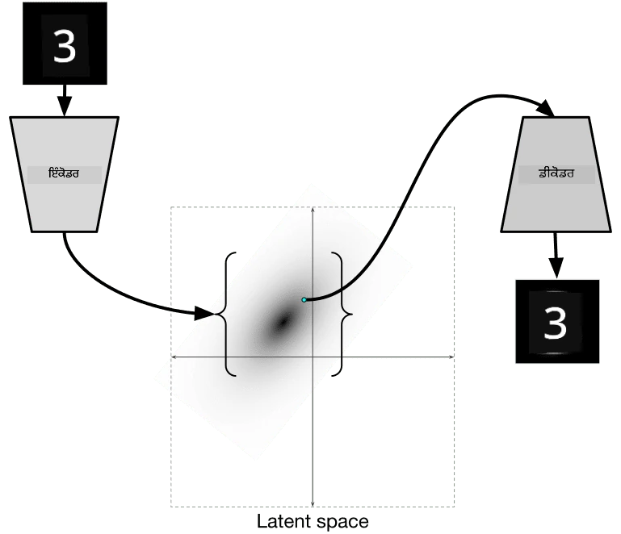

# ਆਟੋਇਨਕੋਡਰ

ਜਦੋਂ CNNs ਨੂੰ ਟ੍ਰੇਨ ਕੀਤਾ ਜਾਂਦਾ ਹੈ, ਇੱਕ ਮੁੱਦਾ ਇਹ ਹੈ ਕਿ ਸਾਨੂੰ ਬਹੁਤ ਸਾਰਾ ਲੇਬਲ ਕੀਤਾ ਡਾਟਾ ਚਾਹੀਦਾ ਹੈ। ਚਿੱਤਰ ਵਰਗੀਕਰਨ ਦੇ ਮਾਮਲੇ ਵਿੱਚ, ਸਾਨੂੰ ਚਿੱਤਰਾਂ ਨੂੰ ਵੱਖ-ਵੱਖ ਵਰਗਾਂ ਵਿੱਚ ਵੰਡਣਾ ਪੈਂਦਾ ਹੈ, ਜੋ ਕਿ ਇੱਕ ਮੈਨੂਅਲ ਪ੍ਰਯਾਸ ਹੈ।

## [ਪ੍ਰੀ-ਲੈਕਚਰ ਕਵਿਜ਼](https://ff-quizzes.netlify.app/en/ai/quiz/17)

ਹਾਲਾਂਕਿ, ਅਸੀਂ ਕੱਚੇ (ਬਿਨਾਂ ਲੇਬਲ ਵਾਲੇ) ਡਾਟਾ ਨੂੰ CNN ਫੀਚਰ ਐਕਸਟ੍ਰੈਕਟਰਾਂ ਨੂੰ ਟ੍ਰੇਨ ਕਰਨ ਲਈ ਵਰਤਣਾ ਚਾਹੁੰਦੇ ਹਾਂ, ਜਿਸਨੂੰ **ਸਵੈ-ਸੁਪਰਵਾਈਜ਼ਡ ਲਰਨਿੰਗ** ਕਿਹਾ ਜਾਂਦਾ ਹੈ। ਲੇਬਲਾਂ ਦੀ ਬਜਾਏ, ਅਸੀਂ ਟ੍ਰੇਨਿੰਗ ਚਿੱਤਰਾਂ ਨੂੰ ਨੈਟਵਰਕ ਇਨਪੁਟ ਅਤੇ ਆਉਟਪੁਟ ਦੋਵਾਂ ਵਜੋਂ ਵਰਤਾਂਗੇ। **ਆਟੋਇਨਕੋਡਰ** ਦਾ ਮੁੱਖ ਵਿਚਾਰ ਇਹ ਹੈ ਕਿ ਸਾਡੇ ਕੋਲ ਇੱਕ **ਇਨਕੋਡਰ ਨੈਟਵਰਕ** ਹੋਵੇਗਾ ਜੋ ਇਨਪੁਟ ਚਿੱਤਰ ਨੂੰ ਕੁਝ **latent space** ਵਿੱਚ ਬਦਲਦਾ ਹੈ (ਆਮ ਤੌਰ 'ਤੇ ਇਹ ਕੁਝ ਛੋਟੇ ਆਕਾਰ ਦੇ ਵੇਕਟਰ ਹੁੰਦੇ ਹਨ), ਫਿਰ **ਡਿਕੋਡਰ ਨੈਟਵਰਕ**, ਜਿਸਦਾ ਉਦੇਸ਼ ਮੂਲ ਚਿੱਤਰ ਨੂੰ ਮੁੜ ਬਣਾਉਣਾ ਹੋਵੇਗਾ।

> ✅ ਇੱਕ [ਆਟੋਇਨਕੋਡਰ](https://wikipedia.org/wiki/Autoencoder) "ਕ੍ਰਿਤ੍ਰਿਮ ਨਿਊਰਲ ਨੈਟਵਰਕ ਦੀ ਇੱਕ ਕਿਸਮ ਹੈ ਜੋ ਬਿਨਾਂ ਲੇਬਲ ਵਾਲੇ ਡਾਟਾ ਦੇ ਕੁਸ਼ਲ ਕੋਡਿੰਗ ਸਿੱਖਣ ਲਈ ਵਰਤੀ ਜਾਂਦੀ ਹੈ।"

ਜਦੋਂ ਅਸੀਂ ਆਟੋਇਨਕੋਡਰ ਨੂੰ ਮੂਲ ਚਿੱਤਰ ਤੋਂ ਜਿੰਨਾ ਜ਼ਿਆਦਾ ਜਾਣਕਾਰੀ ਕੈਪਚਰ ਕਰ ਸਕਦੇ ਹਾਂ ਉਸ ਲਈ ਟ੍ਰੇਨ ਕਰਦੇ ਹਾਂ, ਤਾਂ ਕਿ ਸਹੀ ਰੀਕੰਸਟ੍ਰਕਸ਼ਨ ਹੋ ਸਕੇ, ਨੈਟਵਰਕ ਇਨਪੁਟ ਚਿੱਤਰਾਂ ਦੀ **embedding** ਨੂੰ ਕੈਪਚਰ ਕਰਨ ਲਈ ਸਭ ਤੋਂ ਵਧੀਆ ਕੋਸ਼ਿਸ਼ ਕਰਦਾ ਹੈ।

> ਚਿੱਤਰ [Keras ਬਲੌਗ](https://blog.keras.io/building-autoencoders-in-keras.html) ਤੋਂ

## ਆਟੋਇਨਕੋਡਰ ਵਰਤਣ ਦੇ ਸਥਿਤੀਆਂ

ਹਾਲਾਂਕਿ ਮੂਲ ਚਿੱਤਰਾਂ ਨੂੰ ਮੁੜ ਬਣਾਉਣਾ ਆਪਣੇ ਆਪ ਵਿੱਚ ਬਹੁਤ ਲਾਭਕਾਰੀ ਨਹੀਂ ਲੱਗਦਾ, ਕੁਝ ਸਥਿਤੀਆਂ ਹਨ ਜਿੱਥੇ ਆਟੋਇਨਕੋਡਰ ਖਾਸ ਤੌਰ 'ਤੇ ਲਾਭਕਾਰੀ ਹੁੰਦੇ ਹਨ:

* **ਚਿੱਤਰਾਂ ਦੇ ਆਕਾਰ ਨੂੰ ਘਟਾਉਣਾ** ਜਾਂ **ਚਿੱਤਰ embeddings ਟ੍ਰੇਨ ਕਰਨਾ**। ਆਮ ਤੌਰ 'ਤੇ ਆਟੋਇਨਕੋਡਰ PCA ਨਾਲੋਂ ਵਧੀਆ ਨਤੀਜੇ ਦਿੰਦੇ ਹਨ, ਕਿਉਂਕਿ ਇਹ ਚਿੱਤਰਾਂ ਦੀ ਸਥਾਨਕ ਪ੍ਰਕਿਰਤੀ ਅਤੇ ਹਾਇਰਾਰਕੀਕਲ ਫੀਚਰਾਂ ਨੂੰ ਧਿਆਨ ਵਿੱਚ ਰੱਖਦੇ ਹਨ।
* **ਡਿਨੋਇਜ਼ਿੰਗ**, ਜ਼ਿਆਦਾ ਸ਼ੋਰ ਨੂੰ ਚਿੱਤਰ ਤੋਂ ਹਟਾਉਣਾ। ਕਿਉਂਕਿ ਸ਼ੋਰ ਬਹੁਤ ਸਾਰੀ ਬੇਕਾਰ ਜਾਣਕਾਰੀ ਲੈ ਕੇ ਆਉਂਦਾ ਹੈ, ਆਟੋਇਨਕੋਡਰ ਇਸਨੂੰ ਛੋਟੇ latent space ਵਿੱਚ ਫਿੱਟ ਨਹੀਂ ਕਰ ਸਕਦਾ, ਅਤੇ ਇਸ ਤਰ੍ਹਾਂ ਇਹ ਚਿੱਤਰ ਦਾ ਸਿਰਫ਼ ਮਹੱਤਵਪੂਰਨ ਹਿੱਸਾ ਕੈਪਚਰ ਕਰਦਾ ਹੈ। ਜਦੋਂ ਡਿਨੋਇਜ਼ਰ ਟ੍ਰੇਨ ਕਰਦੇ ਹਾਂ, ਅਸੀਂ ਮੂਲ ਚਿੱਤਰਾਂ ਨਾਲ ਸ਼ੁਰੂ ਕਰਦੇ ਹਾਂ, ਅਤੇ ਆਟੋਇਨਕੋਡਰ ਲਈ ਇਨਪੁਟ ਵਜੋਂ ਕ੍ਰਿਤ੍ਰਿਮ ਤੌਰ 'ਤੇ ਸ਼ੋਰ ਜੋੜੇ ਚਿੱਤਰਾਂ ਨੂੰ ਵਰਤਦੇ ਹਾਂ।
* **ਸੁਪਰ-ਰਿਜ਼ੋਲੂਸ਼ਨ**, ਚਿੱਤਰ ਰਿਜ਼ੋਲੂਸ਼ਨ ਵਧਾਉਣਾ। ਅਸੀਂ ਉੱਚ-ਰਿਜ਼ੋਲੂਸ਼ਨ ਚਿੱਤਰਾਂ ਨਾਲ ਸ਼ੁਰੂ ਕਰਦੇ ਹਾਂ, ਅਤੇ ਆਟੋਇਨਕੋਡਰ ਇਨਪੁਟ ਵਜੋਂ ਘੱਟ ਰਿਜ਼ੋਲੂਸ਼ਨ ਵਾਲੇ ਚਿੱਤਰਾਂ ਨੂੰ ਵਰਤਦੇ ਹਾਂ।
* **ਜਨਰੇਟਿਵ ਮਾਡਲ**। ਜਦੋਂ ਅਸੀਂ ਆਟੋਇਨਕੋਡਰ ਨੂੰ ਟ੍ਰੇਨ ਕਰਦੇ ਹਾਂ, ਡਿਕੋਡਰ ਹਿੱਸਾ ਨਵੇਂ ਵਸਤੂਆਂ ਬਣਾਉਣ ਲਈ ਵਰਤਿਆ ਜਾ ਸਕਦਾ ਹੈ, ਸ਼ੁਰੂਆਤ ਕਰਦੇ ਹੋਏ random latent vectors ਤੋਂ।

## Variational Autoencoders (VAE)

ਪ੍ਰੰਪਰਾਗਤ ਆਟੋਇਨਕੋਡਰ ਇਨਪੁਟ ਡਾਟਾ ਦੇ ਆਕਾਰ ਨੂੰ ਕਿਸੇ ਤਰ੍ਹਾਂ ਘਟਾਉਂਦੇ ਹਨ, ਇਨਪੁਟ ਚਿੱਤਰਾਂ ਦੇ ਮਹੱਤਵਪੂਰਨ ਫੀਚਰਾਂ ਨੂੰ ਪਤਾ ਲਗਾਉਂਦੇ ਹਨ। ਹਾਲਾਂਕਿ, latent vectors ਅਕਸਰ ਬਹੁਤ ਵਧੀਆ ਸਮਝ ਨਹੀਂ ਦਿੰਦੇ। ਦੂਜੇ ਸ਼ਬਦਾਂ ਵਿੱਚ, MNIST ਡਾਟਾਸੈਟ ਨੂੰ ਉਦਾਹਰਨ ਵਜੋਂ ਲੈਂਦੇ ਹੋਏ, ਇਹ ਪਤਾ ਲਗਾਉਣਾ ਕਿ ਕਿਹੜੇ ਅੰਕ ਵੱਖ-ਵੱਖ latent vectors ਨਾਲ ਸਬੰਧਿਤ ਹਨ, ਇੱਕ ਆਸਾਨ ਕੰਮ ਨਹੀਂ ਹੈ, ਕਿਉਂਕਿ ਨੇੜੇ latent vectors ਜ਼ਰੂਰੀ ਨਹੀਂ ਕਿ ਉਹੀ ਅੰਕ ਦਰਸਾਉਣ।

ਦੂਜੇ ਪਾਸੇ, *ਜਨਰੇਟਿਵ* ਮਾਡਲਾਂ ਨੂੰ ਟ੍ਰੇਨ ਕਰਨ ਲਈ latent space ਦੀ ਕੁਝ ਸਮਝ ਹੋਣੀ ਚਾਹੀਦੀ ਹੈ। ਇਹ ਵਿਚਾਰ ਸਾਨੂੰ **variational auto-encoder** (VAE) ਵੱਲ ਲੈ ਜਾਂਦਾ ਹੈ।

VAE ਉਹ ਆਟੋਇਨਕੋਡਰ ਹੈ ਜੋ latent ਪੈਰਾਮੀਟਰਾਂ ਦੀ *statistical distribution* ਦੀ ਭਵਿੱਖਬਾਣੀ ਸਿੱਖਦਾ ਹੈ, ਜਿਸਨੂੰ **latent distribution** ਕਿਹਾ ਜਾਂਦਾ ਹੈ। ਉਦਾਹਰਨ ਵਜੋਂ, ਅਸੀਂ latent vectors ਨੂੰ ਕੁਝ mean zmean ਅਤੇ standard deviation zsigma (mean ਅਤੇ standard deviation ਦੋਵੇਂ ਕੁਝ dimensionality d ਦੇ ਵੇਕਟਰ ਹਨ) ਨਾਲ ਆਮ ਤੌਰ 'ਤੇ ਵੰਡਿਆ ਹੋਇਆ ਚਾਹੁੰਦੇ ਹਾਂ। VAE ਵਿੱਚ ਇਨਕੋਡਰ ਉਹ ਪੈਰਾਮੀਟਰਾਂ ਦੀ ਭਵਿੱਖਬਾਣੀ ਸਿੱਖਦਾ ਹੈ, ਅਤੇ ਫਿਰ ਡਿਕੋਡਰ ਇਸ distribution ਤੋਂ ਇੱਕ random vector ਲੈਂਦਾ ਹੈ ਤਾਂ ਕਿ ਵਸਤੂ ਨੂੰ ਮੁੜ ਬਣਾਇਆ ਜਾ ਸਕੇ।

ਸੰਖੇਪ ਵਿੱਚ:

* ਇਨਪੁਟ ਵੇਕਟਰ ਤੋਂ, ਅਸੀਂ `z_mean` ਅਤੇ `z_log_sigma` ਦੀ ਭਵਿੱਖਬਾਣੀ ਕਰਦੇ ਹਾਂ (standard deviation ਦੀ ਭਵਿੱਖਬਾਣੀ ਕਰਨ ਦੀ ਬਜਾਏ, ਅਸੀਂ ਇਸਦੇ ਲੌਗਾਰਿਥਮ ਦੀ ਭਵਿੱਖਬਾਣੀ ਕਰਦੇ ਹਾਂ)
* ਅਸੀਂ distribution N(zmean,exp(zlog\_sigma)) ਤੋਂ ਇੱਕ `sample` ਵੇਕਟਰ ਲੈਂਦੇ ਹਾਂ
* ਡਿਕੋਡਰ `sample` ਨੂੰ ਇਨਪੁਟ ਵੇਕਟਰ ਵਜੋਂ ਵਰਤ ਕੇ ਮੂਲ ਚਿੱਤਰ ਨੂੰ ਡਿਕੋਡ ਕਰਨ ਦੀ ਕੋਸ਼ਿਸ਼ ਕਰਦਾ ਹੈ

> ਚਿੱਤਰ [ਇਸ ਬਲੌਗ ਪੋਸਟ](https://ijdykeman.github.io/ml/2016/12/21/cvae.html) ਤੋਂ, ਲਿਖਿਆ ਗਿਆ Isaak Dykeman ਦੁਆਰਾ

Variational auto-encoders ਇੱਕ ਜਟਿਲ ਲੌਸ ਫੰਕਸ਼ਨ ਵਰਤਦੇ ਹਨ ਜੋ ਦੋ ਹਿੱਸਿਆਂ 'ਤੇ ਆਧਾਰਿਤ ਹੁੰਦਾ ਹੈ:

* **ਰੀਕੰਸਟ੍ਰਕਸ਼ਨ ਲੌਸ** ਉਹ ਲੌਸ ਫੰਕਸ਼ਨ ਹੈ ਜੋ ਦਿਖਾਉਂਦਾ ਹੈ ਕਿ ਮੁੜ ਬਣਾਇਆ ਚਿੱਤਰ ਟਾਰਗੇਟ ਦੇ ਕਿੰਨਾ ਨੇੜੇ ਹੈ (ਇਹ Mean Squared Error ਜਾਂ MSE ਹੋ ਸਕਦਾ ਹੈ)। ਇਹ ਆਮ ਆਟੋਇਨਕੋਡਰਾਂ ਵਿੱਚ ਵਰਤੇ ਜਾਣ ਵਾਲੇ ਲੌਸ ਫੰਕਸ਼ਨ ਦੇ ਸਮਾਨ ਹੈ।
* **KL ਲੌਸ**, ਜੋ ਯਕੀਨੀ ਬਣਾਉਂਦਾ ਹੈ ਕਿ latent variable distributions ਆਮ distribution ਦੇ ਨੇੜੇ ਰਹੇ। ਇਹ [Kullback-Leibler divergence](https://www.countbayesie.com/blog/2017/5/9/kullback-leibler-divergence-explained) ਦੇ ਧਾਰਨਾ 'ਤੇ ਆਧਾਰਿਤ ਹੈ - ਦੋ ਸਾਂਖਿਆਕੀ distributions ਕਿੰਨੇ ਸਮਾਨ ਹਨ ਇਸਨੂੰ ਅੰਕਣ ਕਰਨ ਲਈ ਇੱਕ ਮਾਪ।

VAEs ਦਾ ਇੱਕ ਮਹੱਤਵਪੂਰਨ ਫਾਇਦਾ ਇਹ ਹੈ ਕਿ ਇਹ ਸਾਨੂੰ ਨਵੇਂ ਚਿੱਤਰਾਂ ਨੂੰ ਸ نسبਤ ਆਸਾਨੀ ਨਾਲ ਬਣਾਉਣ ਦੀ ਆਗਿਆ ਦਿੰਦੇ ਹਨ, ਕਿਉਂਕਿ ਸਾਨੂੰ ਪਤਾ ਹੁੰਦਾ ਹੈ ਕਿ latent vectors ਨੂੰ ਕਿਹੜੇ distribution ਤੋਂ ਲੈਣਾ ਹੈ। ਉਦਾਹਰਨ ਵਜੋਂ, ਜੇ ਅਸੀਂ MNIST 'ਤੇ 2D latent vector ਨਾਲ VAE ਨੂੰ ਟ੍ਰੇਨ ਕਰਦੇ ਹਾਂ, ਤਾਂ ਅਸੀਂ latent vector ਦੇ ਹਿੱਸਿਆਂ ਨੂੰ ਵੱਖ-ਵੱਖ ਕਰਕੇ ਵੱਖ-ਵੱਖ ਅੰਕ ਪ੍ਰਾਪਤ ਕਰ ਸਕਦੇ ਹਾਂ:

> ਚਿੱਤਰ [Dmitry Soshnikov](http://soshnikov.com) ਦੁਆਰਾ

ਧਿਆਨ ਦਿਓ ਕਿ ਚਿੱਤਰ ਕਿਵੇਂ ਇੱਕ ਦੂਜੇ ਵਿੱਚ ਮਿਲਦੇ ਹਨ, ਜਦੋਂ ਅਸੀਂ latent parameter space ਦੇ ਵੱਖ-ਵੱਖ ਹਿੱਸਿਆਂ ਤੋਂ latent vectors ਲੈਣੇ ਸ਼ੁਰੂ ਕਰਦੇ ਹਾਂ। ਅਸੀਂ ਇਸ space ਨੂੰ 2D ਵਿੱਚ ਵੀ ਵਿਜ਼ੁਅਲਾਈਜ਼ ਕਰ ਸਕਦੇ ਹਾਂ:

 

> ਚਿੱਤਰ [Dmitry Soshnikov](http://soshnikov.com) ਦੁਆਰਾ

## ✍️ ਅਭਿਆਸ: ਆਟੋਇਨਕੋਡਰ

ਇਹਨਾਂ ਸੰਬੰਧਿਤ ਨੋਟਬੁੱਕਾਂ ਵਿੱਚ ਆਟੋਇਨਕੋਡਰ ਬਾਰੇ ਹੋਰ ਸਿੱਖੋ:

* [Autoencoders in TensorFlow](AutoencodersTF.ipynb)
* [Autoencoders in PyTorch](AutoEncodersPyTorch.ipynb)

## ਆਟੋਇਨਕੋਡਰ ਦੀਆਂ ਵਿਸ਼ੇਸ਼ਤਾਵਾਂ

* **ਡਾਟਾ ਸਪੈਸਿਫਿਕ** - ਇਹ ਸਿਰਫ਼ ਉਸ ਤਰ੍ਹਾਂ ਦੇ ਚਿੱਤਰਾਂ ਨਾਲ ਚੰਗਾ ਕੰਮ ਕਰਦੇ ਹਨ ਜਿਨ੍ਹਾਂ 'ਤੇ ਇਹ ਟ੍ਰੇਨ ਕੀਤੇ ਗਏ ਹਨ। ਉਦਾਹਰਨ ਵਜੋਂ, ਜੇ ਅਸੀਂ ਫੁੱਲਾਂ 'ਤੇ ਇੱਕ ਸੁਪਰ-ਰਿਜ਼ੋਲੂਸ਼ਨ ਨੈਟਵਰਕ ਟ੍ਰੇਨ ਕਰਦੇ ਹਾਂ, ਤਾਂ ਇਹ ਪੋਰਟਰੇਟਸ 'ਤੇ ਚੰਗਾ ਕੰਮ ਨਹੀਂ ਕਰੇਗਾ। ਇਹ ਇਸ ਲਈ ਹੈ ਕਿਉਂਕਿ ਨੈਟਵਰਕ ਉੱਚ ਰਿਜ਼ੋਲੂਸ਼ਨ ਚਿੱਤਰ ਪੈਦਾ ਕਰ ਸਕਦਾ ਹੈ, ਟ੍ਰੇਨਿੰਗ ਡਾਟਾਸੈਟ ਤੋਂ ਸਿੱਖੇ ਗਏ ਫੀਚਰਾਂ ਤੋਂ ਸੁਖਮ ਵੇਰਵੇ ਲੈ ਕੇ।
* **ਲੌਸੀ** - ਮੁੜ ਬਣਾਇਆ ਚਿੱਤਰ ਮੂਲ ਚਿੱਤਰ ਦੇ ਸਮਾਨ ਨਹੀਂ ਹੁੰਦਾ। ਲੌਸ ਦੀ ਪ੍ਰਕਿਰਤੀ ਟ੍ਰੇਨਿੰਗ ਦੌਰਾਨ ਵਰਤੇ ਗਏ *ਲੌਸ ਫੰਕਸ਼ਨ* ਦੁਆਰਾ ਪਰਿਭਾਸ਼ਿਤ ਕੀਤੀ ਜਾਂਦੀ ਹੈ।
* **ਬਿਨਾਂ ਲੇਬਲ ਵਾਲੇ ਡਾਟਾ** 'ਤੇ ਕੰਮ ਕਰਦਾ ਹੈ।

## [ਪੋਸਟ-ਲੈਕਚਰ ਕਵਿਜ਼](https://ff-quizzes.netlify.app/en/ai/quiz/18)

## ਨਿਸ਼ਕਰਸ਼

ਇਸ ਪਾਠ ਵਿੱਚ, ਤੁਸੀਂ AI ਵਿਗਿਆਨੀ ਲਈ ਉਪਲਬਧ ਵੱਖ-ਵੱਖ ਕਿਸਮ ਦੇ ਆਟੋਇਨਕੋਡਰਾਂ ਬਾਰੇ ਸਿੱਖਿਆ। ਤੁਸੀਂ ਇਹ ਸਿੱਖਿਆ ਕਿ ਇਹਨਾਂ ਨੂੰ ਕਿਵੇਂ ਬਣਾਉਣਾ ਹੈ, ਅਤੇ ਚਿੱਤਰਾਂ ਨੂੰ ਮੁੜ ਬਣਾਉਣ ਲਈ ਇਹਨਾਂ ਨੂੰ ਕਿਵੇਂ ਵਰਤਣਾ ਹੈ। ਤੁਸੀਂ VAE ਬਾਰੇ ਵੀ ਸਿੱਖਿਆ ਅਤੇ ਨਵੇਂ ਚਿੱਤਰ ਬਣਾਉਣ ਲਈ ਇਸਨੂੰ ਕਿਵੇਂ ਵਰਤਣਾ ਹੈ।

## 🚀 ਚੁਣੌਤੀ

ਇਸ ਪਾਠ ਵਿੱਚ, ਤੁਸੀਂ ਚਿੱਤਰਾਂ ਲਈ ਆਟੋਇਨਕੋਡਰ ਵਰਤਣ ਬਾਰੇ ਸਿੱਖਿਆ। ਪਰ ਇਹ ਸੰਗੀਤ ਲਈ ਵੀ ਵਰਤੇ ਜਾ ਸਕਦੇ ਹਨ! Magenta ਪ੍ਰੋਜੈਕਟ ਦੇ [MusicVAE](https://magenta.tensorflow.org/music-vae) ਪ੍ਰੋਜੈਕਟ ਨੂੰ ਵੇਖੋ, ਜੋ ਸੰਗੀਤ ਨੂੰ ਮੁੜ ਬਣਾਉਣ ਲਈ ਸਿੱਖਣ ਲਈ ਆਟੋਇਨਕੋਡਰ ਵਰਤਦਾ ਹੈ। ਇਸ ਲਾਇਬ੍ਰੇਰੀ ਨਾਲ ਕੁਝ [ਤਜਰਬੇ](https://colab.research.google.com/github/magenta/magenta-demos/blob/master/colab-notebooks/Multitrack_MusicVAE.ipynb) ਕਰੋ ਅਤੇ ਵੇਖੋ ਕਿ ਤੁਸੀਂ ਕੀ ਬਣਾਉ ਸਕਦੇ ਹੋ।

## [ਪੋਸਟ-ਲੈਕਚਰ ਕਵਿਜ਼](https://ff-quizzes.netlify.app/en/ai/quiz/16)

## ਸਮੀਖਿਆ ਅਤੇ ਸਵੈ-ਅਧਿਐਨ

ਹਵਾਲੇ ਲਈ, ਇਹਨਾਂ ਸਰੋਤਾਂ ਵਿੱਚ ਆਟੋਇਨਕੋਡਰ ਬਾਰੇ ਹੋਰ ਪੜ੍ਹੋ:

* [Building Autoencoders in Keras](https://blog.keras.io/building-autoencoders-in-keras.html)
* [Blog post on NeuroHive](https://neurohive.io/ru/osnovy-data-science/variacionnyj-avtojenkoder-vae/)
* [Variational Autoencoders Explained](https://kvfrans.com/variational-autoencoders-explained/)
* [Conditional Variational Autoencoders](https://ijdykeman.github.io/ml/2016/12/21/cvae.html)

## ਅਸਾਈਨਮੈਂਟ

[AutoencodersTF.ipynb](AutoencodersTF.ipynb) ਵਿੱਚ ਇਸ ਨੋਟਬੁੱਕ ਦੇ ਅੰਤ ਵਿੱਚ ਇੱਕ 'ਟਾਸਕ' ਹੈ - ਇਸਨੂੰ ਆਪਣੀ ਅਸਾਈਨਮੈਂਟ ਵਜੋਂ ਵਰਤੋ।

---

