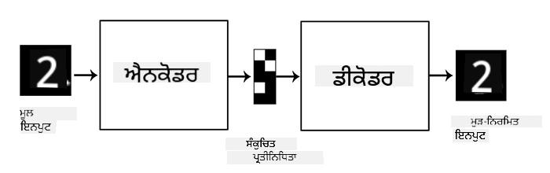

<!--
CO_OP_TRANSLATOR_METADATA:
{
  "original_hash": "0b306c04f5337b6e7430e5c0b16bb5c0",
  "translation_date": "2025-08-26T09:07:30+00:00",
  "source_file": "lessons/4-ComputerVision/09-Autoencoders/README.md",
  "language_code": "pa"
}
-->
# ਆਟੋਇਨਕੋਡਰਜ਼

ਜਦੋਂ CNNs ਨੂੰ ਟ੍ਰੇਨ ਕਰਦੇ ਹਾਂ, ਇੱਕ ਮੁੱਖ ਸਮੱਸਿਆ ਇਹ ਹੈ ਕਿ ਸਾਨੂੰ ਬਹੁਤ ਸਾਰੇ ਲੇਬਲ ਕੀਤੇ ਡਾਟਾ ਦੀ ਲੋੜ ਹੁੰਦੀ ਹੈ। ਚਿੱਤਰ ਵਰਗੀਕਰਨ ਦੇ ਮਾਮਲੇ ਵਿੱਚ, ਸਾਨੂੰ ਚਿੱਤਰਾਂ ਨੂੰ ਵੱਖ-ਵੱਖ ਵਰਗਾਂ ਵਿੱਚ ਵੰਡਣਾ ਪੈਂਦਾ ਹੈ, ਜੋ ਕਿ ਇੱਕ ਮੈਨੂਅਲ ਪ੍ਰਕਿਰਿਆ ਹੈ।

## [ਪ੍ਰੀ-ਲੈਕਚਰ ਕਵਿਜ਼](https://red-field-0a6ddfd03.1.azurestaticapps.net/quiz/109)

ਹਾਲਾਂਕਿ, ਅਸੀਂ ਕਈ ਵਾਰ ਕੱਚੇ (ਬਿਨਾਂ ਲੇਬਲ ਵਾਲੇ) ਡਾਟਾ ਨੂੰ CNN ਫੀਚਰ ਐਕਸਟ੍ਰੈਕਟਰਜ਼ ਨੂੰ ਟ੍ਰੇਨ ਕਰਨ ਲਈ ਵਰਤਣਾ ਚਾਹੁੰਦੇ ਹਾਂ, ਜਿਸਨੂੰ **ਸਵੈ-ਸੁਪਰਵਾਈਜ਼ਡ ਲਰਨਿੰਗ** ਕਿਹਾ ਜਾਂਦਾ ਹੈ। ਲੇਬਲਾਂ ਦੀ ਥਾਂ, ਅਸੀਂ ਟ੍ਰੇਨਿੰਗ ਚਿੱਤਰਾਂ ਨੂੰ ਨੈਟਵਰਕ ਦੇ ਇਨਪੁਟ ਅਤੇ ਆਉਟਪੁਟ ਦੋਵਾਂ ਵਜੋਂ ਵਰਤਾਂਗੇ। **ਆਟੋਇਨਕੋਡਰ** ਦਾ ਮੁੱਖ ਵਿਚਾਰ ਇਹ ਹੈ ਕਿ ਸਾਡੇ ਕੋਲ ਇੱਕ **ਇਨਕੋਡਰ ਨੈਟਵਰਕ** ਹੋਵੇਗਾ ਜੋ ਇਨਪੁਟ ਚਿੱਤਰ ਨੂੰ ਕੁਝ **ਲੇਟੈਂਟ ਸਪੇਸ** ਵਿੱਚ ਬਦਲਦਾ ਹੈ (ਆਮ ਤੌਰ 'ਤੇ ਇਹ ਕੁਝ ਛੋਟੇ ਆਕਾਰ ਦੇ ਵੇਕਟਰ ਹੁੰਦੇ ਹਨ), ਫਿਰ **ਡੀਕੋਡਰ ਨੈਟਵਰਕ**, ਜਿਸਦਾ ਮਕਸਦ ਮੂਲ ਚਿੱਤਰ ਨੂੰ ਦੁਬਾਰਾ ਬਣਾਉਣਾ ਹੁੰਦਾ ਹੈ।

> ✅ ਇੱਕ [ਆਟੋਇਨਕੋਡਰ](https://wikipedia.org/wiki/Autoencoder) "ਕਿਸੇ ਵੀ ਲੇਬਲ ਰਹਿਤ ਡਾਟਾ ਦੇ ਕੁਸ਼ਲ ਕੋਡਿੰਗ ਸਿੱਖਣ ਲਈ ਵਰਤਿਆ ਜਾਣ ਵਾਲਾ ਕ੍ਰਿਤ੍ਰਿਮ ਨਰਵਸ ਨੈਟਵਰਕ ਹੈ।"

ਜਦੋਂ ਅਸੀਂ ਆਟੋਇਨਕੋਡਰ ਨੂੰ ਮੂਲ ਚਿੱਤਰ ਤੋਂ ਜਿੰਨੀ ਜ਼ਿਆਦਾ ਜਾਣਕਾਰੀ ਕੈਪਚਰ ਕਰ ਸਕੀਏ, ਉਸਨੂੰ ਸਹੀ ਤਰੀਕੇ ਨਾਲ ਦੁਬਾਰਾ ਬਣਾਉਣ ਲਈ ਟ੍ਰੇਨ ਕਰਦੇ ਹਾਂ, ਤਾਂ ਨੈਟਵਰਕ ਇਨਪੁਟ ਚਿੱਤਰਾਂ ਦੇ ਸਭ ਤੋਂ ਵਧੀਆ **ਐਮਬੈਡਿੰਗ** ਲੱਭਣ ਦੀ ਕੋਸ਼ਿਸ਼ ਕਰਦਾ ਹੈ।

> ਚਿੱਤਰ [Keras ਬਲੌਗ](https://blog.keras.io/building-autoencoders-in-keras.html) ਤੋਂ

## ਆਟੋਇਨਕੋਡਰਜ਼ ਦੇ ਵਰਤੋਂ ਦੇ ਸਨਰੀਓਜ਼

ਹਾਲਾਂਕਿ ਮੂਲ ਚਿੱਤਰਾਂ ਨੂੰ ਦੁਬਾਰਾ ਬਣਾਉਣਾ ਆਪਣੇ ਆਪ ਵਿੱਚ ਬਹੁਤ ਲਾਭਦਾਇਕ ਨਹੀਂ ਲੱਗਦਾ, ਕੁਝ ਸਨਰੀਓਜ਼ ਹਨ ਜਿੱਥੇ ਆਟੋਇਨਕੋਡਰਜ਼ ਖਾਸ ਤੌਰ 'ਤੇ ਲਾਭਦਾਇਕ ਹੁੰਦੇ ਹਨ:

* **ਚਿੱਤਰਾਂ ਦੇ ਡਾਇਮੈਂਸ਼ਨ ਨੂੰ ਘਟਾਉਣਾ** ਜਾਂ **ਚਿੱਤਰ ਐਮਬੈਡਿੰਗ ਟ੍ਰੇਨ ਕਰਨਾ**। ਆਮ ਤੌਰ 'ਤੇ ਆਟੋਇਨਕੋਡਰਜ਼ PCA ਨਾਲੋਂ ਵਧੀਆ ਨਤੀਜੇ ਦਿੰਦੇ ਹਨ, ਕਿਉਂਕਿ ਇਹ ਚਿੱਤਰਾਂ ਦੀ ਸਪੈਸ਼ਲ ਪ੍ਰਕਿਰਤੀ ਅਤੇ ਹਾਇਰਾਰਕੀਕਲ ਫੀਚਰਾਂ ਨੂੰ ਧਿਆਨ ਵਿੱਚ ਰੱਖਦੇ ਹਨ।
* **ਡਿਨੋਇਜ਼ਿੰਗ**, ਅਰਥਾਤ ਚਿੱਤਰ ਤੋਂ ਸ਼ੋਰ ਨੂੰ ਹਟਾਉਣਾ। ਕਿਉਂਕਿ ਸ਼ੋਰ ਵਿੱਚ ਬਹੁਤ ਸਾਰੀ ਬੇਕਾਰ ਜਾਣਕਾਰੀ ਹੁੰਦੀ ਹੈ, ਆਟੋਇਨਕੋਡਰ ਇਸਨੂੰ ਛੋਟੀ ਲੇਟੈਂਟ ਸਪੇਸ ਵਿੱਚ ਫਿੱਟ ਨਹੀਂ ਕਰ ਸਕਦਾ, ਇਸ ਲਈ ਇਹ ਸਿਰਫ਼ ਚਿੱਤਰ ਦੇ ਮਹੱਤਵਪੂਰਨ ਹਿੱਸੇ ਨੂੰ ਕੈਪਚਰ ਕਰਦਾ ਹੈ। ਜਦੋਂ ਡਿਨੋਇਜ਼ਰਜ਼ ਨੂੰ ਟ੍ਰੇਨ ਕਰਦੇ ਹਾਂ, ਅਸੀਂ ਮੂਲ ਚਿੱਤਰਾਂ ਨਾਲ ਸ਼ੁਰੂ ਕਰਦੇ ਹਾਂ ਅਤੇ ਆਟੋਇਨਕੋਡਰ ਲਈ ਇਨਪੁਟ ਵਜੋਂ ਕ੍ਰਿਤ੍ਰਿਮ ਤੌਰ 'ਤੇ ਸ਼ੋਰ ਸ਼ਾਮਲ ਕੀਤੇ ਚਿੱਤਰਾਂ ਨੂੰ ਵਰਤਦੇ ਹਾਂ।
* **ਸੁਪਰ-ਰੈਜ਼ੋਲੂਸ਼ਨ**, ਚਿੱਤਰ ਰੈਜ਼ੋਲੂਸ਼ਨ ਵਧਾਉਣਾ। ਅਸੀਂ ਉੱਚ ਰੈਜ਼ੋਲੂਸ਼ਨ ਵਾਲੇ ਚਿੱਤਰਾਂ ਨਾਲ ਸ਼ੁਰੂ ਕਰਦੇ ਹਾਂ ਅਤੇ ਘੱਟ ਰੈਜ਼ੋਲੂਸ਼ਨ ਵਾਲੇ ਚਿੱਤਰ ਨੂੰ ਆਟੋਇਨਕੋਡਰ ਦੇ ਇਨਪੁਟ ਵਜੋਂ ਵਰਤਦੇ ਹਾਂ।
* **ਜਨਰੇਟਿਵ ਮਾਡਲਜ਼**। ਜਦੋਂ ਅਸੀਂ ਆਟੋਇਨਕੋਡਰ ਨੂੰ ਟ੍ਰੇਨ ਕਰ ਲੈਂਦੇ ਹਾਂ, ਤਾਂ ਡੀਕੋਡਰ ਹਿੱਸੇ ਨੂੰ ਰੈਂਡਮ ਲੇਟੈਂਟ ਵੇਕਟਰਜ਼ ਤੋਂ ਨਵੇਂ ਆਬਜੈਕਟ ਬਣਾਉਣ ਲਈ ਵਰਤਿਆ ਜਾ ਸਕਦਾ ਹੈ।

## ਵੈਰੀਏਸ਼ਨਲ ਆਟੋਇਨਕੋਡਰਜ਼ (VAE)

ਪਾਰੰਪਰਿਕ ਆਟੋਇਨਕੋਡਰਜ਼ ਕਿਸੇ ਤਰੀਕੇ ਨਾਲ ਇਨਪੁਟ ਡਾਟਾ ਦੇ ਡਾਇਮੈਂਸ਼ਨ ਨੂੰ ਘਟਾਉਂਦੇ ਹਨ, ਇਨਪੁਟ ਚਿੱਤਰਾਂ ਦੇ ਮਹੱਤਵਪੂਰਨ ਫੀਚਰਾਂ ਨੂੰ ਲੱਭਦੇ ਹਨ। ਹਾਲਾਂਕਿ, ਲੇਟੈਂਟ ਵੇਕਟਰਜ਼ ਅਕਸਰ ਬਹੁਤ ਵੱਧ ਮਾਇਨੇ ਨਹੀਂ ਰੱਖਦੇ। ਦੂਜੇ ਸ਼ਬਦਾਂ ਵਿੱਚ, MNIST ਡਾਟਾਸੈੱਟ ਨੂੰ ਉਦਾਹਰਣ ਵਜੋਂ ਲੈਂਦੇ ਹੋਏ, ਇਹ ਪਤਾ ਲਗਾਉਣਾ ਕਿ ਵੱਖ-ਵੱਖ ਲੇਟੈਂਟ ਵੇਕਟਰਜ਼ ਕਿਹੜੇ ਅੰਕਾਂ ਨੂੰ ਦਰਸਾਉਂਦੇ ਹਨ, ਇੱਕ ਆਸਾਨ ਕੰਮ ਨਹੀਂ ਹੈ, ਕਿਉਂਕਿ ਨੇੜਲੇ ਲੇਟੈਂਟ ਵੇਕਟਰਜ਼ ਲਾਜ਼ਮੀ ਨਹੀਂ ਕਿ ਉਹੀ ਅੰਕ ਦਰਸਾਉਣ।

ਦੂਜੇ ਪਾਸੇ, ਜਨਰੇਟਿਵ ਮਾਡਲਜ਼ ਨੂੰ ਟ੍ਰੇਨ ਕਰਨ ਲਈ ਲੇਟੈਂਟ ਸਪੇਸ ਦੀ ਕੁਝ ਸਮਝ ਹੋਣਾ ਬਿਹਤਰ ਹੈ। ਇਹ ਵਿਚਾਰ ਸਾਨੂੰ **ਵੈਰੀਏਸ਼ਨਲ ਆਟੋਇਨਕੋਡਰ** (VAE) ਵੱਲ ਲੈ ਜਾਂਦਾ ਹੈ।

VAE ਇੱਕ ਆਟੋਇਨਕੋਡਰ ਹੈ ਜੋ ਲੇਟੈਂਟ ਪੈਰਾਮੀਟਰਾਂ ਦੇ *ਸੰਭਾਵਨਾਤਮਕ ਵੰਡ* ਦੀ ਭਵਿੱਖਵਾਣੀ ਕਰਨਾ ਸਿੱਖਦਾ ਹੈ, ਜਿਸਨੂੰ **ਲੇਟੈਂਟ ਡਿਸਟ੍ਰੀਬਿਊਸ਼ਨ** ਕਿਹਾ ਜਾਂਦਾ ਹੈ। ਉਦਾਹਰਣ ਲਈ, ਅਸੀਂ ਚਾਹੁੰਦੇ ਹਾਂ ਕਿ ਲੇਟੈਂਟ ਵੇਕਟਰਜ਼ ਕੁਝ ਮਤਲਬ zmean ਅਤੇ ਮਿਆਰੀ ਵਿਸਪੋਟ zsigma ਨਾਲ ਆਮ ਤੌਰ 'ਤੇ ਵੰਡੇ ਜਾਣ (ਦੋਵੇਂ ਮਤਲਬ ਅਤੇ ਮਿਆਰੀ ਵਿਸਪੋਟ ਕੁਝ ਡਾਇਮੈਂਸ਼ਨਲਟੀ d ਦੇ ਵੇਕਟਰ ਹਨ)। VAE ਵਿੱਚ ਇਨਕੋਡਰ ਇਹ ਪੈਰਾਮੀਟਰਾਂ ਦੀ ਭਵਿੱਖਵਾਣੀ ਕਰਦਾ ਹੈ, ਅਤੇ ਫਿਰ ਡੀਕੋਡਰ ਇਸ ਵੰਡ ਤੋਂ ਇੱਕ ਰੈਂਡਮ ਵੇਕਟਰ ਲੈਂਦਾ ਹੈ ਤਾਂ ਜੋ ਆਬਜੈਕਟ ਨੂੰ ਦੁਬਾਰਾ ਬਣਾਇਆ ਜਾ ਸਕੇ।

ਸੰਖੇਪ ਵਿੱਚ:

* ਇਨਪੁਟ ਵੇਕਟਰ ਤੋਂ, ਅਸੀਂ `z_mean` ਅਤੇ `z_log_sigma` ਦੀ ਭਵਿੱਖਵਾਣੀ ਕਰਦੇ ਹਾਂ (ਮਿਆਰੀ ਵਿਸਪੋਟ ਦੀ ਭਵਿੱਖਵਾਣੀ ਕਰਨ ਦੀ ਥਾਂ, ਅਸੀਂ ਇਸਦੇ ਲੌਗਾਰਿਦਮ ਦੀ ਭਵਿੱਖਵਾਣੀ ਕਰਦੇ ਹਾਂ)
* ਅਸੀਂ ਵੰਡ N(zmean,exp(zlog_sigma)) ਤੋਂ ਇੱਕ ਵੇਕਟਰ `sample` ਲੈਂਦੇ ਹਾਂ
* ਡੀਕੋਡਰ `sample` ਨੂੰ ਇਨਪੁਟ ਵੇਕਟਰ ਵਜੋਂ ਵਰਤ ਕੇ ਮੂਲ ਚਿੱਤਰ ਨੂੰ ਡੀਕੋਡ ਕਰਨ ਦੀ ਕੋਸ਼ਿਸ਼ ਕਰਦਾ ਹੈ

 

> ਚਿੱਤਰ [ਇਸ ਬਲੌਗ ਪੋਸਟ](https://ijdykeman.github.io/ml/2016/12/21/cvae.html) ਤੋਂ, ਲੇਖਕ: Isaak Dykeman

ਵੈਰੀਏਸ਼ਨਲ ਆਟੋਇਨਕੋਡਰਜ਼ ਇੱਕ ਜਟਿਲ ਲਾਸ ਫੰਕਸ਼ਨ ਵਰਤਦੇ ਹਨ ਜੋ ਦੋ ਹਿੱਸਿਆਂ 'ਤੇ ਆਧਾਰਿਤ ਹੁੰਦਾ ਹੈ:

* **ਰੀਕੰਸਟਰਕਸ਼ਨ ਲਾਸ** - ਇਹ ਲਾਸ ਫੰਕਸ਼ਨ ਦਿਖਾਉਂਦਾ ਹੈ ਕਿ ਦੁਬਾਰਾ ਬਣਾਇਆ ਚਿੱਤਰ ਟਾਰਗੇਟ ਦੇ ਕਿੰਨਾ ਨੇੜੇ ਹੈ (ਇਹ Mean Squared Error ਜਾਂ MSE ਹੋ ਸਕਦਾ ਹੈ)। ਇਹ ਆਮ ਆਟੋਇਨਕੋਡਰਜ਼ ਵਿੱਚ ਵਰਤੇ ਜਾਣ ਵਾਲੇ ਲਾਸ ਫੰਕਸ਼ਨ ਵਰਗਾ ਹੀ ਹੁੰਦਾ ਹੈ।
* **KL ਲਾਸ**, ਜੋ ਇਹ ਯਕੀਨੀ ਬਣਾਉਂਦਾ ਹੈ ਕਿ ਲੇਟੈਂਟ ਵੇਰੀਏਬਲ ਡਿਸਟ੍ਰੀਬਿਊਸ਼ਨ ਆਮ ਡਿਸਟ੍ਰੀਬਿਊਸ਼ਨ ਦੇ ਨੇੜੇ ਰਹੇ। ਇਹ [Kullback-Leibler divergence](https://www.countbayesie.com/blog/2017/5/9/kullback-leibler-divergence-explained) ਦੇ ਧਾਰਨਾ 'ਤੇ ਆਧਾਰਿਤ ਹੈ - ਦੋ ਸੰਭਾਵਨਾਤਮਕ ਵੰਡਾਂ ਦੇ ਸਮਾਨਤਾ ਨੂੰ ਅੰਕਣ ਕਰਨ ਲਈ ਇੱਕ ਮਾਪ।

VAE ਦਾ ਇੱਕ ਮਹੱਤਵਪੂਰਨ ਫਾਇਦਾ ਇਹ ਹੈ ਕਿ ਇਹ ਸਾਨੂੰ ਨਵੇਂ ਚਿੱਤਰ ਬਹੁਤ ਆਸਾਨੀ ਨਾਲ ਬਣਾਉਣ ਦੀ ਆਗਿਆ ਦਿੰਦਾ ਹੈ, ਕਿਉਂਕਿ ਸਾਨੂੰ ਪਤਾ ਹੁੰਦਾ ਹੈ ਕਿ ਲੇਟੈਂਟ ਵੇਕਟਰਜ਼ ਨੂੰ ਕਿਹੜੀ ਵੰਡ ਤੋਂ ਲੈਣਾ ਹੈ। ਉਦਾਹਰਣ ਲਈ, ਜੇ ਅਸੀਂ MNIST 'ਤੇ 2D ਲੇਟੈਂਟ ਵੇਕਟਰ ਨਾਲ VAE ਨੂੰ ਟ੍ਰੇਨ ਕਰਦੇ ਹਾਂ, ਤਾਂ ਅਸੀਂ ਲੇਟੈਂਟ ਵੇਕਟਰ ਦੇ ਹਿੱਸਿਆਂ ਨੂੰ ਵੱਖ-ਵੱਖ ਕਰਕੇ ਵੱਖ-ਵੱਖ ਅੰਕ ਪ੍ਰਾਪਤ ਕਰ ਸਕਦੇ ਹਾਂ:

> ਚਿੱਤਰ [ਦਿਮਿਤਰੀ ਸੋਸ਼ਨਿਕੋਵ](http://soshnikov.com) ਦੁਆਰਾ

ਨੋਟ ਕਰੋ ਕਿ ਚਿੱਤਰ ਕਿਵੇਂ ਇੱਕ-ਦੂਜੇ ਵਿੱਚ ਮਿਲਦੇ ਹਨ, ਜਦੋਂ ਅਸੀਂ ਲੇਟੈਂਟ ਪੈਰਾਮੀਟਰ ਸਪੇਸ ਦੇ ਵੱਖ-ਵੱਖ ਹਿੱਸਿਆਂ ਤੋਂ ਲੇਟੈਂਟ ਵੇਕਟਰ ਲੈਂਦੇ ਹਾਂ। ਅਸੀਂ ਇਸ ਸਪੇਸ ਨੂੰ 2D ਵਿੱਚ ਵੀ ਵਿਜੁਅਲਾਈਜ਼ ਕਰ ਸਕਦੇ ਹਾਂ:

 

> ਚਿੱਤਰ [ਦਿਮਿਤਰੀ ਸੋਸ਼ਨਿਕੋਵ](http://soshnikov.com) ਦੁਆਰਾ

## ✍️ ਅਭਿਆਸ: ਆਟੋਇਨਕੋਡਰਜ਼

ਇਹਨਾਂ ਸੰਬੰਧਤ ਨੋਟਬੁੱਕਾਂ ਵਿੱਚ ਆਟੋਇਨਕੋਡਰਜ਼ ਬਾਰੇ ਹੋਰ ਸਿੱਖੋ:

* [ਟੈਂਸਰਫਲੋ ਵਿੱਚ ਆਟੋਇਨਕੋਡਰਜ਼](../../../../../lessons/4-ComputerVision/09-Autoencoders/AutoencodersTF.ipynb)
* [ਪਾਈਟਾਰਚ ਵਿੱਚ ਆਟੋਇਨਕੋਡਰਜ਼](../../../../../lessons/4-ComputerVision/09-Autoencoders/AutoEncodersPyTorch.ipynb)

## ਆਟੋਇਨਕੋਡਰਜ਼ ਦੇ ਗੁਣ

* **ਡਾਟਾ-ਵਿਸ਼ੇਸ਼** - ਇਹ ਸਿਰਫ਼ ਉਸ ਤਰ੍ਹਾਂ ਦੇ ਚਿੱਤਰਾਂ ਨਾਲ ਚੰਗਾ ਕੰਮ ਕਰਦੇ ਹਨ ਜਿਨ੍ਹਾਂ 'ਤੇ ਇਹ ਟ੍ਰੇਨ ਕੀਤੇ ਗਏ ਹਨ। ਉਦਾਹਰਣ ਲਈ, ਜੇ ਅਸੀਂ ਫੁੱਲਾਂ 'ਤੇ ਸੁਪਰ-ਰੈਜ਼ੋਲੂਸ਼ਨ ਨੈਟਵਰਕ ਨੂੰ ਟ੍ਰੇਨ ਕਰਦੇ ਹਾਂ, ਤਾਂ ਇਹ ਪੋਰਟਰੇਟਸ 'ਤੇ ਚੰਗਾ ਕੰਮ ਨਹੀਂ ਕਰੇਗਾ। ਇਹ ਇਸ ਲਈ ਹੈ ਕਿਉਂਕਿ ਨੈਟਵਰਕ ਉੱਚ ਰੈਜ਼ੋਲੂਸ਼ਨ ਵਾਲੇ ਚਿੱਤਰ ਨੂੰ ਟ੍ਰੇਨਿੰਗ ਡਾਟਾਸੈੱਟ ਤੋਂ ਸਿੱਖੇ ਗਏ ਫੀਚਰਾਂ ਤੋਂ ਬਰੀਕ ਵੇਰਵੇ ਲੈ ਕੇ ਬਣਾਉਂਦਾ ਹੈ।
* **ਲੌਸੀ** - ਦੁਬਾਰਾ ਬਣਾਇਆ ਚਿੱਤਰ ਮੂਲ ਚਿੱਤਰ ਦੇ ਬਰਾਬਰ ਨਹੀਂ ਹੁੰਦਾ। ਲਾਸ ਦੀ ਪ੍ਰਕਿਰਤੀ ਟ੍ਰੇਨਿੰਗ ਦੌਰਾਨ ਵਰਤੇ ਗਏ *ਲਾਸ ਫੰਕਸ਼ਨ* ਦੁਆਰਾ ਨਿਰਧਾਰਤ ਹੁੰਦੀ ਹੈ।
* **ਬਿਨਾਂ ਲੇਬਲ ਵਾਲੇ ਡਾਟਾ** 'ਤੇ ਕੰਮ ਕਰਦਾ ਹੈ।

## [ਪੋਸਟ-ਲੈਕਚਰ ਕਵਿਜ਼](https://red-field-0a6ddfd03.1.azurestaticapps.net/quiz/209)

## ਨਿਸ਼ਕਰਸ਼

ਇਸ ਪਾਠ ਵਿੱਚ, ਤੁਸੀਂ ਵੱਖ-ਵੱਖ ਕਿਸਮ ਦੇ ਆਟੋਇਨਕੋਡਰਜ਼ ਬਾਰੇ ਸਿੱਖਿਆ ਜੋ ਇੱਕ AI ਵਿਗਿਆਨੀ ਲਈ ਉਪਲਬਧ ਹਨ। ਤੁਸੀਂ ਇਹ ਵੀ ਸਿੱਖਿਆ ਕਿ ਇਹਨਾਂ ਨੂੰ ਕਿਵੇਂ ਬਣਾਉਣਾ ਹੈ ਅਤੇ ਚਿੱਤਰਾਂ ਨੂੰ ਦੁਬਾਰਾ ਬਣਾਉਣ ਲਈ ਇਹਨਾਂ ਨੂੰ ਕਿਵੇਂ ਵਰਤਣਾ ਹੈ। ਤੁਸੀਂ VAE ਬਾਰੇ ਵੀ ਸਿੱਖਿਆ ਅਤੇ ਇਸਨੂੰ ਨਵੇਂ ਚਿੱਤਰ ਬਣਾਉਣ ਲਈ ਕਿਵੇਂ ਵਰਤਣਾ ਹੈ।

## 🚀 ਚੁਣੌਤੀ

ਇਸ ਪਾਠ ਵਿੱਚ, ਤੁਸੀਂ ਚਿੱਤਰਾਂ ਲਈ ਆਟੋਇਨਕੋਡਰਜ਼ ਦੀ ਵਰਤੋਂ ਬਾਰੇ ਸਿੱਖਿਆ। ਪਰ ਇਹ ਸੰਗੀਤ ਲਈ ਵੀ ਵਰਤੇ ਜਾ ਸਕਦੇ ਹਨ! ਮਜੈਂਟਾ ਪ੍ਰੋਜੈਕਟ ਦੇ [MusicVAE](https://magenta.tensorflow.org/music-vae) ਪ੍ਰੋਜੈਕਟ ਨੂੰ ਦੇਖੋ, ਜੋ ਸੰਗੀਤ ਨੂੰ ਦੁਬਾਰਾ ਬਣਾਉਣ ਲਈ ਆਟੋਇਨਕੋਡਰਜ਼ ਦੀ ਵਰਤੋਂ ਕਰਦਾ ਹੈ। ਇਸ ਲਾਇਬ੍ਰੇਰੀ ਨਾਲ ਕੁਝ [ਤਜਰਬੇ](https://colab.research.google.com/github/magenta/magenta-demos/blob/master/colab-notebooks/Multitrack_MusicVAE.ipynb) ਕਰੋ ਅਤੇ ਦੇਖੋ ਕਿ ਤੁਸੀਂ ਕੀ ਬਣਾਉ ਸਕਦੇ ਹੋ।

## [ਪੋਸਟ-ਲੈਕਚਰ ਕਵਿਜ਼](https://red-field-0a6ddfd03.1.azurestaticapps.net/quiz/208)

## ਸਮੀਖਿਆ ਅਤੇ ਸਵੈ ਅਧਿਐਨ

ਹਵਾਲੇ ਲਈ, ਇਹਨਾਂ ਸਰੋਤਾਂ ਵਿੱਚ ਆਟੋਇਨਕੋਡਰਜ਼ ਬਾਰੇ ਹੋਰ ਪੜ੍ਹੋ:

* [Keras ਵਿੱਚ ਆਟੋਇਨਕੋਡਰਜ਼ ਬਣਾਉਣਾ](https://blog.keras.io/building-autoencoders-in-keras.html)
* [ਨਿਊਰੋਹਾਈਵ 'ਤੇ ਬਲੌਗ ਪੋਸਟ](https://neurohive.io/ru/osnovy-data-science/variacionnyj-avtojenkoder-vae/)
* [ਵੈਰੀਏਸ਼ਨਲ ਆਟੋਇਨਕੋਡਰਜ਼ ਦੀ ਵਿਆਖਿਆ](https://kvfrans.com/variational-autoencoders-explained/)
* [ਕੰਡੀਸ਼ਨਲ ਵੈਰੀਏਸ਼ਨਲ ਆਟੋਇਨਕੋਡਰਜ਼](https://ijdykeman.github.io/ml/2016/12/21/cvae.html)

## ਅਸਾਈਨਮੈਂਟ

[ਟੈਂਸਰਫਲੋ ਦੀ ਵਰਤੋਂ ਕਰਦੇ ਹੋਏ ਇਸ ਨੋਟਬੁੱਕ](../../../../../lessons/4-ComputerVision/09-Autoencoders/AutoencodersTF.ipynb) ਦੇ ਅੰਤ ਵਿੱਚ ਤੁਹਾਨੂੰ ਇੱਕ 'ਟਾਸਕ' ਮਿਲੇਗਾ - ਇਸਨੂੰ ਆਪਣੀ ਅਸਾਈਨਮੈਂਟ ਵਜੋਂ ਵਰਤੋ।

**ਅਸਵੀਕਰਤੀ**:  
ਇਹ ਦਸਤਾਵੇਜ਼ AI ਅਨੁਵਾਦ ਸੇਵਾ [Co-op Translator](https://github.com/Azure/co-op-translator) ਦੀ ਵਰਤੋਂ ਕਰਕੇ ਅਨੁਵਾਦ ਕੀਤਾ ਗਿਆ ਹੈ। ਜਦੋਂ ਕਿ ਅਸੀਂ ਸਹੀ ਹੋਣ ਦਾ ਯਤਨ ਕਰਦੇ ਹਾਂ, ਕਿਰਪਾ ਕਰਕੇ ਧਿਆਨ ਦਿਓ ਕਿ ਸਵੈਚਾਲਿਤ ਅਨੁਵਾਦਾਂ ਵਿੱਚ ਗਲਤੀਆਂ ਜਾਂ ਅਸੁਣਤੀਆਂ ਹੋ ਸਕਦੀਆਂ ਹਨ। ਇਸ ਦੀ ਮੂਲ ਭਾਸ਼ਾ ਵਿੱਚ ਮੌਜੂਦ ਮੂਲ ਦਸਤਾਵੇਜ਼ ਨੂੰ ਅਧਿਕਾਰਤ ਸਰੋਤ ਮੰਨਿਆ ਜਾਣਾ ਚਾਹੀਦਾ ਹੈ। ਮਹੱਤਵਪੂਰਨ ਜਾਣਕਾਰੀ ਲਈ, ਪੇਸ਼ੇਵਰ ਮਨੁੱਖੀ ਅਨੁਵਾਦ ਦੀ ਸਿਫਾਰਸ਼ ਕੀਤੀ ਜਾਂਦੀ ਹੈ। ਇਸ ਅਨੁਵਾਦ ਦੇ ਪ੍ਰਯੋਗ ਤੋਂ ਪੈਦਾ ਹੋਣ ਵਾਲੀਆਂ ਕਿਸੇ ਵੀ ਗਲਤਫਹਮੀਆਂ ਜਾਂ ਗਲਤ ਵਿਆਖਿਆਵਾਂ ਲਈ ਅਸੀਂ ਜ਼ਿੰਮੇਵਾਰ ਨਹੀਂ ਹਾਂ।