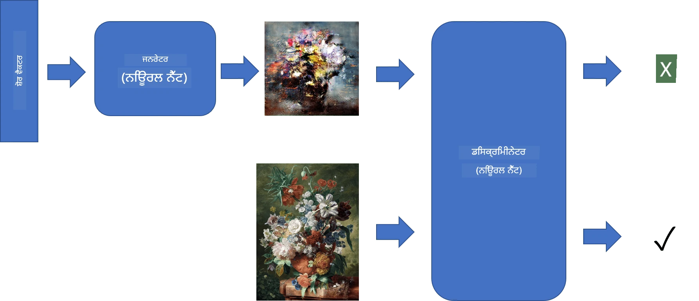
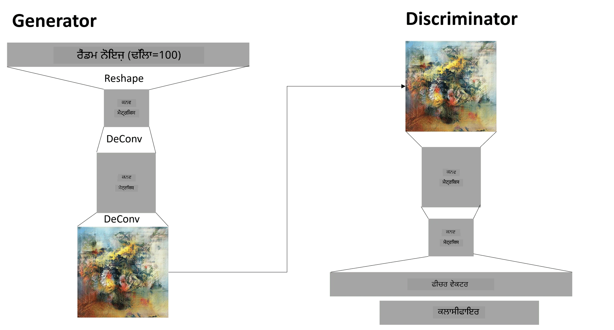

# ਜਨਰੇਟਿਵ ਐਡਵਰਸਰੀਅਲ ਨੈੱਟਵਰਕਸ

ਪਿਛਲੇ ਭਾਗ ਵਿੱਚ, ਅਸੀਂ **ਜਨਰੇਟਿਵ ਮਾਡਲਜ਼** ਬਾਰੇ ਸਿੱਖਿਆ: ਮਾਡਲ ਜੋ ਟ੍ਰੇਨਿੰਗ ਡੇਟਾਸੈੱਟ ਵਿੱਚ ਮੌਜੂਦ ਤਸਵੀਰਾਂ ਵਰਗੀਆਂ ਨਵੀਆਂ ਤਸਵੀਰਾਂ ਬਣਾਉਣ ਦੇ ਯੋਗ ਹੁੰਦੇ ਹਨ। VAE ਜਨਰੇਟਿਵ ਮਾਡਲ ਦਾ ਇੱਕ ਵਧੀਆ ਉਦਾਹਰਨ ਸੀ।

## [ਪ੍ਰੀ-ਲੈਕਚਰ ਕਵਿਜ਼](https://ff-quizzes.netlify.app/en/ai/quiz/19)

ਹਾਲਾਂਕਿ, ਜੇ ਅਸੀਂ ਕੁਝ ਵਾਕਈ ਮਹੱਤਵਪੂਰਨ ਬਣਾਉਣ ਦੀ ਕੋਸ਼ਿਸ਼ ਕਰੀਏ, ਜਿਵੇਂ ਕਿ ਇੱਕ ਉੱਚ ਰੈਜ਼ੋਲੂਸ਼ਨ ਵਾਲੀ ਪੇਂਟਿੰਗ, VAE ਨਾਲ, ਤਾਂ ਅਸੀਂ ਵੇਖਾਂਗੇ ਕਿ ਟ੍ਰੇਨਿੰਗ ਚੰਗੀ ਤਰ੍ਹਾਂ ਕਨਵਰਜ ਨਹੀਂ ਕਰਦੀ। ਇਸ ਵਰਤੋਂ ਦੇ ਕੇਸ ਲਈ, ਸਾਨੂੰ ਜਨਰੇਟਿਵ ਮਾਡਲਾਂ ਲਈ ਖਾਸ ਤੌਰ 'ਤੇ ਟਾਰਗੇਟ ਕੀਤੀ ਗਈ ਇੱਕ ਹੋਰ ਆਰਕੀਟੈਕਚਰ ਬਾਰੇ ਸਿੱਖਣਾ ਚਾਹੀਦਾ ਹੈ - **ਜਨਰੇਟਿਵ ਐਡਵਰਸਰੀਅਲ ਨੈੱਟਵਰਕਸ**, ਜਾਂ GANs।

GAN ਦਾ ਮੁੱਖ ਵਿਚਾਰ ਦੋ ਨਿਊਰਲ ਨੈੱਟਵਰਕਸ ਨੂੰ ਇੱਕ ਦੂਜੇ ਦੇ ਖਿਲਾਫ ਟ੍ਰੇਨ ਕਰਨ ਦਾ ਹੈ:

> ਚਿੱਤਰ [ਦਿਮਿਤਰੀ ਸੋਸ਼ਨਿਕੋਵ](http://soshnikov.com) ਦੁਆਰਾ

> ✅ ਕੁਝ ਸ਼ਬਦਾਵਲੀ:
> * **ਜਨਰੇਟਰ** ਇੱਕ ਨੈੱਟਵਰਕ ਹੈ ਜੋ ਕੁਝ ਰੈਂਡਮ ਵੇਕਟਰ ਲੈਂਦਾ ਹੈ ਅਤੇ ਨਤੀਜੇ ਵਜੋਂ ਤਸਵੀਰ ਪੈਦਾ ਕਰਦਾ ਹੈ।
> * **ਡਿਸਕ੍ਰਿਮਿਨੇਟਰ** ਇੱਕ ਨੈੱਟਵਰਕ ਹੈ ਜੋ ਇੱਕ ਤਸਵੀਰ ਲੈਂਦਾ ਹੈ, ਅਤੇ ਇਹ ਦੱਸਣਾ ਚਾਹੀਦਾ ਹੈ ਕਿ ਇਹ ਇੱਕ ਅਸਲੀ ਤਸਵੀਰ ਹੈ (ਟ੍ਰੇਨਿੰਗ ਡੇਟਾਸੈੱਟ ਤੋਂ), ਜਾਂ ਇਹ ਜਨਰੇਟਰ ਦੁਆਰਾ ਬਣਾਈ ਗਈ ਹੈ। ਇਹ ਅਸਲ ਵਿੱਚ ਇੱਕ ਤਸਵੀਰ ਕਲਾਸੀਫਾਇਰ ਹੈ।

### ਡਿਸਕ੍ਰਿਮਿਨੇਟਰ

ਡਿਸਕ੍ਰਿਮਿਨੇਟਰ ਦੀ ਆਰਕੀਟੈਕਚਰ ਇੱਕ ਆਮ ਤਸਵੀਰ ਕਲਾਸੀਫਿਕੇਸ਼ਨ ਨੈੱਟਵਰਕ ਤੋਂ ਵੱਖਰੀ ਨਹੀਂ ਹੈ। ਸਭ ਤੋਂ ਸਧਾਰਨ ਕੇਸ ਵਿੱਚ ਇਹ ਇੱਕ ਫੁੱਲੀ-ਕਨੈਕਟਡ ਕਲਾਸੀਫਾਇਰ ਹੋ ਸਕਦਾ ਹੈ, ਪਰ ਜ਼ਿਆਦਾਤਰ ਇਹ ਇੱਕ [ਕਨਵੋਲੂਸ਼ਨਲ ਨੈੱਟਵਰਕ](../07-ConvNets/README.md) ਹੋਵੇਗਾ।

> ✅ ਕਨਵੋਲੂਸ਼ਨਲ ਨੈੱਟਵਰਕਸ 'ਤੇ ਆਧਾਰਿਤ GAN ਨੂੰ [DCGAN](https://arxiv.org/pdf/1511.06434.pdf) ਕਿਹਾ ਜਾਂਦਾ ਹੈ।

ਇੱਕ CNN ਡਿਸਕ੍ਰਿਮਿਨੇਟਰ ਵਿੱਚ ਹੇਠ ਲਿਖੀਆਂ ਲੇਅਰਾਂ ਹੁੰਦੀਆਂ ਹਨ: ਕਈ ਕਨਵੋਲੂਸ਼ਨ+ਪੂਲਿੰਗ (ਸਪੇਸ਼ਲ ਆਕਾਰ ਘਟਾਉਣ ਨਾਲ) ਅਤੇ ਇੱਕ ਜਾਂ ਵੱਧ ਫੁੱਲੀ-ਕਨੈਕਟਡ ਲੇਅਰਾਂ "ਫੀਚਰ ਵੇਕਟਰ" ਪ੍ਰਾਪਤ ਕਰਨ ਲਈ, ਅਤੇ ਆਖਰੀ ਬਾਈਨਰੀ ਕਲਾਸੀਫਾਇਰ।

> ✅ 'ਪੂਲਿੰਗ' ਇਸ ਸੰਦਰਭ ਵਿੱਚ ਇੱਕ ਤਕਨੀਕ ਹੈ ਜੋ ਤਸਵੀਰ ਦਾ ਆਕਾਰ ਘਟਾਉਂਦੀ ਹੈ। "ਪੂਲਿੰਗ ਲੇਅਰ ਡੇਟਾ ਦੇ ਆਕਾਰ ਨੂੰ ਘਟਾਉਂਦੀਆਂ ਹਨ, ਇੱਕ ਲੇਅਰ ਵਿੱਚ ਨਿਊਰੋਨ ਕਲੱਸਟਰਾਂ ਦੇ ਆਉਟਪੁੱਟ ਨੂੰ ਅਗਲੇ ਲੇਅਰ ਵਿੱਚ ਇੱਕ ਨਿਊਰੋਨ ਵਿੱਚ ਜੋੜ ਕੇ।" - [ਸਰੋਤ](https://wikipedia.org/wiki/Convolutional_neural_network#Pooling_layers)

### ਜਨਰੇਟਰ

ਜਨਰੇਟਰ ਥੋੜ੍ਹਾ ਜਿਆਦਾ ਜਟਿਲ ਹੁੰਦਾ ਹੈ। ਤੁਸੀਂ ਇਸਨੂੰ ਇੱਕ ਉਲਟੇ ਡਿਸਕ੍ਰਿਮਿਨੇਟਰ ਵਜੋਂ ਸਮਝ ਸਕਦੇ ਹੋ। ਇੱਕ ਲੈਟੈਂਟ ਵੇਕਟਰ (ਫੀਚਰ ਵੇਕਟਰ ਦੀ ਥਾਂ) ਤੋਂ ਸ਼ੁਰੂ ਕਰਦੇ ਹੋਏ, ਇਸ ਵਿੱਚ ਇਸਨੂੰ ਲੋੜੀਂਦੇ ਆਕਾਰ/ਆਕਾਰ ਵਿੱਚ ਬਦਲਣ ਲਈ ਇੱਕ ਫੁੱਲੀ-ਕਨੈਕਟਡ ਲੇਅਰ ਹੁੰਦੀ ਹੈ, ਜਿਸ ਤੋਂ ਬਾਅਦ ਡੀਕਨਵੋਲੂਸ਼ਨ+ਅੱਪਸਕੇਲਿੰਗ ਹੁੰਦੀ ਹੈ। ਇਹ [ਆਟੋਇੰਕੋਡਰ](../09-Autoencoders/README.md) ਦੇ *ਡਿਕੋਡਰ* ਭਾਗ ਵਰਗਾ ਹੈ।

> ✅ ਕਿਉਂਕਿ ਕਨਵੋਲੂਸ਼ਨ ਲੇਅਰ ਨੂੰ ਇੱਕ ਰੇਖਿਕ ਫਿਲਟਰ ਵਜੋਂ ਤਸਵੀਰ ਵਿੱਚ ਲਾਗੂ ਕੀਤਾ ਜਾਂਦਾ ਹੈ, ਡੀਕਨਵੋਲੂਸ਼ਨ ਅਸਲ ਵਿੱਚ ਕਨਵੋਲੂਸ਼ਨ ਵਰਗਾ ਹੀ ਹੁੰਦਾ ਹੈ, ਅਤੇ ਇਸਨੂੰ ਉਹੀ ਲੇਅਰ ਲਾਜਿਕ ਵਰਤ ਕੇ ਲਾਗੂ ਕੀਤਾ ਜਾ ਸਕਦਾ ਹੈ।

> ਚਿੱਤਰ [ਦਿਮਿਤਰੀ ਸੋਸ਼ਨਿਕੋਵ](http://soshnikov.com) ਦੁਆਰਾ

### GAN ਦੀ ਟ੍ਰੇਨਿੰਗ

GAN ਨੂੰ **ਐਡਵਰਸਰੀਅਲ** ਕਿਹਾ ਜਾਂਦਾ ਹੈ ਕਿਉਂਕਿ ਜਨਰੇਟਰ ਅਤੇ ਡਿਸਕ੍ਰਿਮਿਨੇਟਰ ਵਿਚਕਾਰ ਲਗਾਤਾਰ ਮੁਕਾਬਲਾ ਹੁੰਦਾ ਹੈ। ਇਸ ਮੁਕਾਬਲੇ ਦੌਰਾਨ, ਦੋਵੇਂ ਜਨਰੇਟਰ ਅਤੇ ਡਿਸਕ੍ਰਿਮਿਨੇਟਰ ਸੁਧਰਦੇ ਹਨ, ਇਸ ਤਰ੍ਹਾਂ ਨੈੱਟਵਰਕ ਵਧੀਆ ਤਸਵੀਰਾਂ ਪੈਦਾ ਕਰਨਾ ਸਿੱਖਦਾ ਹੈ।

ਟ੍ਰੇਨਿੰਗ ਦੋ ਪੜਾਅਵਾਂ ਵਿੱਚ ਹੁੰਦੀ ਹੈ:

* **ਡਿਸਕ੍ਰਿਮਿਨੇਟਰ ਦੀ ਟ੍ਰੇਨਿੰਗ**। ਇਹ ਕੰਮ ਕਾਫ਼ੀ ਸਿੱਧਾ ਹੈ: ਅਸੀਂ ਜਨਰੇਟਰ ਦੁਆਰਾ ਤਸਵੀਰਾਂ ਦਾ ਇੱਕ ਬੈਚ ਪੈਦਾ ਕਰਦੇ ਹਾਂ, ਉਨ੍ਹਾਂ ਨੂੰ 0 ਲੇਬਲ ਕਰਦੇ ਹਾਂ, ਜੋ ਕਿ ਨਕਲੀ ਤਸਵੀਰ ਲਈ ਖੜ੍ਹਾ ਹੈ, ਅਤੇ ਇਨਪੁਟ ਡੇਟਾਸੈੱਟ ਤੋਂ ਤਸਵੀਰਾਂ ਦਾ ਇੱਕ ਬੈਚ ਲੈਂਦੇ ਹਾਂ (ਲੇਬਲ 1, ਅਸਲੀ ਤਸਵੀਰ ਨਾਲ)। ਅਸੀਂ ਕੁਝ *ਡਿਸਕ੍ਰਿਮਿਨੇਟਰ ਲਾਸ* ਪ੍ਰਾਪਤ ਕਰਦੇ ਹਾਂ, ਅਤੇ ਬੈਕਪ੍ਰੋਪ ਕਰਦੇ ਹਾਂ।
* **ਜਨਰੇਟਰ ਦੀ ਟ੍ਰੇਨਿੰਗ**। ਇਹ ਥੋੜ੍ਹਾ ਜਿਆਦਾ ਜਟਿਲ ਹੈ, ਕਿਉਂਕਿ ਸਾਨੂੰ ਜਨਰੇਟਰ ਲਈ ਸਿੱਧੇ ਤੌਰ 'ਤੇ ਉਮੀਦਵਾਰ ਆਉਟਪੁੱਟ ਨਹੀਂ ਪਤਾ। ਅਸੀਂ ਪੂਰੇ GAN ਨੈੱਟਵਰਕ ਨੂੰ ਜਨਰੇਟਰ ਅਤੇ ਡਿਸਕ੍ਰਿਮਿਨੇਟਰ ਦੇ ਨਾਲ ਲੈਂਦੇ ਹਾਂ, ਇਸਨੂੰ ਕੁਝ ਰੈਂਡਮ ਵੇਕਟਰਾਂ ਨਾਲ ਫੀਡ ਕਰਦੇ ਹਾਂ, ਅਤੇ ਨਤੀਜੇ ਨੂੰ 1 ਹੋਣ ਦੀ ਉਮੀਦ ਕਰਦੇ ਹਾਂ (ਅਸਲੀ ਤਸਵੀਰਾਂ ਦੇ ਅਨੁਸਾਰ)। ਫਿਰ ਅਸੀਂ ਡਿਸਕ੍ਰਿਮਿਨੇਟਰ ਦੇ ਪੈਰਾਮੀਟਰਾਂ ਨੂੰ ਫ੍ਰੀਜ਼ ਕਰਦੇ ਹਾਂ (ਅਸੀਂ ਇਸ ਪੜਾਅ 'ਤੇ ਇਸਨੂੰ ਟ੍ਰੇਨ ਨਹੀਂ ਕਰਨਾ ਚਾਹੁੰਦੇ), ਅਤੇ ਬੈਕਪ੍ਰੋਪ ਕਰਦੇ ਹਾਂ।

ਇਸ ਪ੍ਰਕਿਰਿਆ ਦੌਰਾਨ, ਜਨਰੇਟਰ ਅਤੇ ਡਿਸਕ੍ਰਿਮਿਨੇਟਰ ਦੋਵਾਂ ਦੇ ਲਾਸ ਮਹੱਤਵਪੂਰਨ ਤੌਰ 'ਤੇ ਘਟਦੇ ਨਹੀਂ ਹਨ। ਆਦਰਸ਼ ਸਥਿਤੀ ਵਿੱਚ, ਉਹ ਓਸਿਲੇਟ ਕਰਨੇ ਚਾਹੀਦੇ ਹਨ, ਜੋ ਦੋਵੇਂ ਨੈੱਟਵਰਕਸ ਦੇ ਪ੍ਰਦਰਸ਼ਨ ਵਿੱਚ ਸੁਧਾਰ ਨੂੰ ਦਰਸਾਉਂਦੇ ਹਨ।

## ✍️ ਅਭਿਆਸ: GANs

* [ਟੈਂਸਰਫਲੋ/ਕੇਰਾਸ ਵਿੱਚ GAN ਨੋਟਬੁੱਕ](GANTF.ipynb)
* [ਪਾਈਟਾਰਚ ਵਿੱਚ GAN ਨੋਟਬੁੱਕ](GANPyTorch.ipynb)

### GAN ਟ੍ਰੇਨਿੰਗ ਨਾਲ ਸਮੱਸਿਆਵਾਂ

GANs ਨੂੰ ਖਾਸ ਤੌਰ 'ਤੇ ਟ੍ਰੇਨ ਕਰਨਾ ਮੁਸ਼ਕਲ ਮੰਨਿਆ ਜਾਂਦਾ ਹੈ। ਇੱਥੇ ਕੁਝ ਸਮੱਸਿਆਵਾਂ ਹਨ:

* **ਮੋਡ ਕਾਲਾਪਸ**। ਇਸ ਸ਼ਬਦ ਦਾ ਮਤਲਬ ਹੈ ਕਿ ਜਨਰੇਟਰ ਇੱਕ ਸਫਲ ਤਸਵੀਰ ਪੈਦਾ ਕਰਨਾ ਸਿੱਖਦਾ ਹੈ ਜੋ ਡਿਸਕ੍ਰਿਮਿਨੇਟਰ ਨੂੰ ਠੱਗ ਲੈਂਦੀ ਹੈ, ਪਰ ਵੱਖ-ਵੱਖ ਤਸਵੀਰਾਂ ਦੀ ਕਿਸਮ ਨਹੀਂ।
* **ਹਾਈਪਰਪੈਰਾਮੀਟਰਾਂ ਲਈ ਸੰਵੇਦਨਸ਼ੀਲਤਾ**। ਅਕਸਰ ਤੁਸੀਂ ਵੇਖੋਗੇ ਕਿ ਇੱਕ GAN ਬਿਲਕੁਲ ਵੀ ਕਨਵਰਜ ਨਹੀਂ ਕਰਦਾ, ਅਤੇ ਫਿਰ ਅਚਾਨਕ ਲਰਨਿੰਗ ਰੇਟ ਵਿੱਚ ਘਟਾਅ ਦੇ ਨਾਲ ਕਨਵਰਜ ਕਰਦਾ ਹੈ।
* ਜਨਰੇਟਰ ਅਤੇ ਡਿਸਕ੍ਰਿਮਿਨੇਟਰ ਦੇ ਵਿਚਕਾਰ **ਸੰਤੁਲਨ** ਬਣਾਈ ਰੱਖਣਾ। ਕਈ ਕੇਸਾਂ ਵਿੱਚ ਡਿਸਕ੍ਰਿਮਿਨੇਟਰ ਲਾਸ ਕਾਫ਼ੀ ਜਲਦੀ ਜ਼ੀਰੋ 'ਤੇ ਡ੍ਰੌਪ ਕਰ ਸਕਦਾ ਹੈ, ਜਿਸ ਨਾਲ ਜਨਰੇਟਰ ਅੱਗੇ ਟ੍ਰੇਨ ਨਹੀਂ ਹੋ ਸਕਦਾ। ਇਸਨੂੰ ਦੂਰ ਕਰਨ ਲਈ, ਅਸੀਂ ਜਨਰੇਟਰ ਅਤੇ ਡਿਸਕ੍ਰਿਮਿਨੇਟਰ ਲਈ ਵੱਖ-ਵੱਖ ਲਰਨਿੰਗ ਰੇਟ ਸੈਟ ਕਰਨ ਦੀ ਕੋਸ਼ਿਸ਼ ਕਰ ਸਕਦੇ ਹਾਂ, ਜਾਂ ਜੇ ਲਾਸ ਪਹਿਲਾਂ ਹੀ ਬਹੁਤ ਘੱਟ ਹੈ ਤਾਂ ਡਿਸਕ੍ਰਿਮਿਨੇਟਰ ਟ੍ਰੇਨਿੰਗ ਨੂੰ ਛੱਡ ਸਕਦੇ ਹਾਂ।
* **ਉੱਚ ਰੈਜ਼ੋਲੂਸ਼ਨ ਲਈ ਟ੍ਰੇਨਿੰਗ**। ਇਹ ਸਮੱਸਿਆ ਆਟੋਇੰਕੋਡਰਾਂ ਨਾਲ ਇੱਕੋ ਸਮੱਸਿਆ ਨੂੰ ਦਰਸਾਉਂਦੀ ਹੈ, ਕਿਉਂਕਿ ਕਨਵੋਲੂਸ਼ਨਲ ਨੈੱਟਵਰਕ ਦੇ ਬਹੁਤ ਸਾਰੇ ਲੇਅਰਾਂ ਨੂੰ ਦੁਬਾਰਾ ਬਣਾਉਣਾ ਆਰਟੀਫੈਕਟਸ ਨੂੰ ਜਨਮ ਦਿੰਦਾ ਹੈ। ਇਸ ਸਮੱਸਿਆ ਨੂੰ ਆਮ ਤੌਰ 'ਤੇ **ਪ੍ਰੋਗਰੈਸਿਵ ਗ੍ਰੋਇੰਗ** ਨਾਲ ਹੱਲ ਕੀਤਾ ਜਾਂਦਾ ਹੈ, ਜਦੋਂ ਪਹਿਲਾਂ ਕੁਝ ਲੇਅਰਾਂ ਨੂੰ ਘੱਟ-ਰੈਜ਼ ਤਸਵੀਰਾਂ 'ਤੇ ਟ੍ਰੇਨ ਕੀਤਾ ਜਾਂਦਾ ਹੈ, ਅਤੇ ਫਿਰ ਲੇਅਰਾਂ ਨੂੰ "ਅਨਬਲੌਕ" ਜਾਂ ਸ਼ਾਮਲ ਕੀਤਾ ਜਾਂਦਾ ਹੈ। ਇੱਕ ਹੋਰ ਹੱਲ ਇਹ ਹੋਵੇਗਾ ਕਿ ਲੇਅਰਾਂ ਦੇ ਵਿਚਕਾਰ ਵਾਧੂ ਕਨੈਕਸ਼ਨਾਂ ਨੂੰ ਸ਼ਾਮਲ ਕੀਤਾ ਜਾਵੇ ਅਤੇ ਇੱਕੋ ਸਮੇਂ ਕਈ ਰੈਜ਼ੋਲੂਸ਼ਨਾਂ ਨੂੰ ਟ੍ਰੇਨ ਕੀਤਾ ਜਾਵੇ - ਇਸ ਲਈ ਇਸ [ਮਲਟੀ-ਸਕੇਲ ਗ੍ਰੇਡੀਐਂਟ GANs ਪੇਪਰ](https://arxiv.org/abs/1903.06048) ਨੂੰ ਵੇਖੋ।

## ਸਟਾਈਲ ਟ੍ਰਾਂਸਫਰ

GANs ਕਲਾਤਮਕ ਤਸਵੀਰਾਂ ਪੈਦਾ ਕਰਨ ਦਾ ਇੱਕ ਵਧੀਆ ਤਰੀਕਾ ਹੈ। ਇੱਕ ਹੋਰ ਦਿਲਚਸਪ ਤਕਨੀਕ **ਸਟਾਈਲ ਟ੍ਰਾਂਸਫਰ** ਹੈ, ਜੋ ਇੱਕ **ਕੰਟੈਂਟ ਤਸਵੀਰ** ਲੈਂਦੀ ਹੈ, ਅਤੇ ਇਸਨੂੰ ਇੱਕ ਵੱਖਰੇ ਸਟਾਈਲ ਵਿੱਚ ਦੁਬਾਰਾ ਬਣਾਉਂਦੀ ਹੈ, **ਸਟਾਈਲ ਤਸਵੀਰ** ਤੋਂ ਫਿਲਟਰ ਲਾਗੂ ਕਰਦੀ ਹੈ।

ਇਹ ਤਰੀਕਾ ਇਸ ਤਰ੍ਹਾਂ ਕੰਮ ਕਰਦਾ ਹੈ:
* ਅਸੀਂ ਇੱਕ ਰੈਂਡਮ ਨੋਇਜ਼ ਤਸਵੀਰ (ਜਾਂ ਇੱਕ ਕੰਟੈਂਟ ਤਸਵੀਰ) ਨਾਲ ਸ਼ੁਰੂ ਕਰਦੇ ਹਾਂ, ਪਰ ਸਮਝਣ ਲਈ ਰੈਂਡਮ ਨੋਇਜ਼ ਨਾਲ ਸ਼ੁਰੂ ਕਰਨਾ ਆਸਾਨ ਹੈ।
* ਸਾਡਾ ਲਕਸ਼ ਇਹ ਹੋਵੇਗਾ ਕਿ ਅਜਿਹੀ ਤਸਵੀਰ ਬਣਾਈ ਜਾਵੇ, ਜੋ ਕੰਟੈਂਟ ਤਸਵੀਰ ਅਤੇ ਸਟਾਈਲ ਤਸਵੀਰ ਦੋਵਾਂ ਦੇ ਨੇੜੇ ਹੋਵੇ। ਇਹ ਦੋ ਲਾਸ ਫੰਕਸ਼ਨਾਂ ਦੁਆਰਾ ਨਿਰਧਾਰਤ ਕੀਤਾ ਜਾਵੇਗਾ:
   - **ਕੰਟੈਂਟ ਲਾਸ** ਨੂੰ CNN ਦੁਆਰਾ ਕੁਝ ਲੇਅਰਾਂ 'ਤੇ ਮੌਜੂਦਾ ਤਸਵੀਰ ਅਤੇ ਕੰਟੈਂਟ ਤਸਵੀਰ ਤੋਂ ਨਿਕਾਲੇ ਗਏ ਫੀਚਰਾਂ ਦੇ ਆਧਾਰ 'ਤੇ ਗਣਨਾ ਕੀਤੀ ਜਾਂਦੀ ਹੈ।
   - **ਸਟਾਈਲ ਲਾਸ** ਨੂੰ ਮੌਜੂਦਾ ਤਸਵੀਰ ਅਤੇ ਸਟਾਈਲ ਤਸਵੀਰ ਦੇ ਵਿਚਕਾਰ ਗ੍ਰਾਮ ਮੈਟ੍ਰਿਕਸਾਂ ਦੀ ਵਰਤੋਂ ਕਰਕੇ ਚਤੁਰਾਈ ਨਾਲ ਗਣਨਾ ਕੀਤੀ ਜਾਂਦੀ ਹੈ (ਹੋਰ ਵੇਰਵੇ ਲਈ [ਉਦਾਹਰਨ ਨੋਟਬੁੱਕ](StyleTransfer.ipynb) ਵੇਖੋ)।
* ਤਸਵੀਰ ਨੂੰ ਹੌਲੀ ਅਤੇ ਸ਼ੋਰ ਨੂੰ ਹਟਾਉਣ ਲਈ, ਅਸੀਂ **ਵੈਰੀਏਸ਼ਨ ਲਾਸ** ਨੂੰ ਵੀ ਸ਼ਾਮਲ ਕਰਦੇ ਹਾਂ, ਜੋ ਪੜੋਸ ਦੇ ਪਿਕਸਲਾਂ ਦੇ ਦਰਮਿਆਨ ਔਸਤ ਦੂਰੀ ਦੀ ਗਣਨਾ ਕਰਦਾ ਹੈ।
* ਮੁੱਖ ਅਪਟੀਮਾਈਜ਼ੇਸ਼ਨ ਲੂਪ ਮੌਜੂਦਾ ਤਸਵੀਰ ਨੂੰ ਗ੍ਰੇਡੀਐਂਟ ਡਿਸੈਂਟ (ਜਾਂ ਕੁਝ ਹੋਰ ਅਪਟੀਮਾਈਜ਼ੇਸ਼ਨ ਐਲਗੋਰਿਦਮ) ਦੀ ਵਰਤੋਂ ਕਰਕੇ ਸਮੁੱਚੇ ਲਾਸ ਨੂੰ ਘਟਾਉਣ ਲਈ ਢਾਲਦਾ ਹੈ, ਜੋ ਸਾਰੀਆਂ ਤਿੰਨ ਲਾਸਾਂ ਦਾ ਵਜ਼ਨੀ ਜੋੜ ਹੁੰਦਾ ਹੈ।

## ✍️ ਉਦਾਹਰਨ: [ਸਟਾਈਲ ਟ੍ਰਾਂਸਫਰ](StyleTransfer.ipynb)

## [ਪੋਸਟ-ਲੈਕਚਰ ਕਵਿਜ਼](https://ff-quizzes.netlify.app/en/ai/quiz/20)

## ਨਿਸ਼ਕਰਸ਼

ਇਸ ਪਾਠ ਵਿੱਚ, ਤੁਸੀਂ GANs ਅਤੇ ਉਨ੍ਹਾਂ ਨੂੰ ਟ੍ਰੇਨ ਕਰਨ ਦੇ ਤਰੀਕੇ ਬਾਰੇ ਸਿੱਖਿਆ। ਤੁਸੀਂ ਇਹ ਵੀ ਸਿੱਖਿਆ ਕਿ ਇਸ ਕਿਸਮ ਦੇ ਨਿਊਰਲ ਨੈੱਟਵਰਕ ਨੂੰ ਕਿਹੜੀਆਂ ਖਾਸ ਚੁਣੌਤੀਆਂ ਦਾ ਸਾਹਮਣਾ ਕਰਨਾ ਪੈਂਦਾ ਹੈ, ਅਤੇ ਉਨ੍ਹਾਂ ਨੂੰ ਪਾਰ ਕਰਨ ਲਈ ਕੁਝ ਰਣਨੀਤੀਆਂ।

## 🚀 ਚੈਲੈਂਜ

ਆਪਣੀਆਂ ਤਸਵੀਰਾਂ ਦੀ ਵਰਤੋਂ ਕਰਦੇ ਹੋਏ [ਸਟਾਈਲ ਟ੍ਰਾਂਸਫਰ ਨੋਟਬੁੱਕ](StyleTransfer.ipynb) ਨੂੰ ਚਲਾਓ।

## ਸਮੀਖਿਆ ਅਤੇ ਸਵੈ ਅਧਿਐਨ

ਹਵਾਲੇ ਲਈ, ਇਨ੍ਹਾਂ ਸਰੋਤਾਂ ਵਿੱਚ GANs ਬਾਰੇ ਹੋਰ ਪੜ੍ਹੋ:

* ਮਾਰਕੋ ਪਾਸਿਨੀ, [10 ਸਬਕ ਜੋ ਮੈਂ ਇੱਕ ਸਾਲ ਲਈ GANs ਟ੍ਰੇਨ ਕਰਦੇ ਹੋਏ ਸਿੱਖੇ](https://towardsdatascience.com/10-lessons-i-learned-training-generative-adversarial-networks-gans-for-a-year-c9071159628)
* [ਸਟਾਈਲGAN](https://en.wikipedia.org/wiki/StyleGAN), ਇੱਕ *ਡਿ ਫੈਕਟੋ* GAN ਆਰਕੀਟੈਕਚਰ ਜਿਸਨੂੰ ਵਿਚਾਰਿਆ ਜਾ ਸਕਦਾ ਹੈ।
* [ਐਜ਼ਰ ML 'ਤੇ GANs ਦੀ ਵਰਤੋਂ ਕਰਕੇ ਜਨਰੇਟਿਵ ਕਲਾ ਬਣਾਉਣਾ](https://soshnikov.com/scienceart/creating-generative-art-using-gan-on-azureml/)

## ਅਸਾਈਨਮੈਂਟ

ਇਸ ਪਾਠ ਨਾਲ ਜੁੜੀਆਂ ਦੋ ਨੋਟਬੁੱਕਾਂ ਵਿੱਚੋਂ ਇੱਕ ਨੂੰ ਦੁਬਾਰਾ ਵੇਖੋ ਅਤੇ ਆਪਣੇ ਡੇਟਾ 'ਤੇ GAN ਨੂੰ ਦੁਬਾਰਾ ਟ੍ਰੇਨ ਕਰੋ। ਤੁਸੀਂ ਕੀ ਬਣਾਉ ਸਕਦੇ ਹੋ?

---

