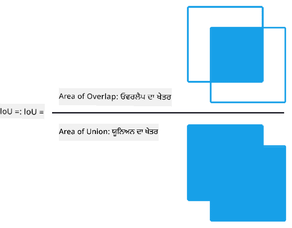
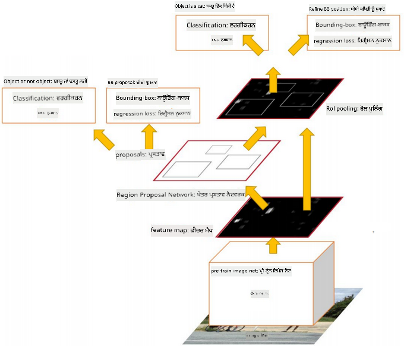

<!--
CO_OP_TRANSLATOR_METADATA:
{
  "original_hash": "d85c8b08f6d1b48fd7f35b99f93c1138",
  "translation_date": "2025-08-26T09:22:50+00:00",
  "source_file": "lessons/4-ComputerVision/11-ObjectDetection/README.md",
  "language_code": "pa"
}
-->
# ਆਬਜੈਕਟ ਡਿਟੈਕਸ਼ਨ

ਜੋ ਇਮੇਜ ਕਲਾਸੀਫਿਕੇਸ਼ਨ ਮਾਡਲਾਂ ਨਾਲ ਅਸੀਂ ਹੁਣ ਤੱਕ ਕੰਮ ਕੀਤਾ ਹੈ, ਉਹ ਇੱਕ ਤਸਵੀਰ ਲੈਂਦੇ ਹਨ ਅਤੇ ਇੱਕ ਸ਼੍ਰੇਣੀਬੱਧ ਨਤੀਜਾ ਪੈਦਾ ਕਰਦੇ ਹਨ, ਜਿਵੇਂ ਕਿ MNIST ਸਮੱਸਿਆ ਵਿੱਚ 'ਨੰਬਰ' ਕਲਾਸ। ਹਾਲਾਂਕਿ, ਕਈ ਕੇਸਾਂ ਵਿੱਚ ਅਸੀਂ ਸਿਰਫ ਇਹ ਨਹੀਂ ਜਾਣਨਾ ਚਾਹੁੰਦੇ ਕਿ ਇੱਕ ਤਸਵੀਰ ਵਿੱਚ ਆਬਜੈਕਟ ਹਨ, ਸਗੋਂ ਅਸੀਂ ਇਹ ਵੀ ਪਤਾ ਲਗਾਉਣਾ ਚਾਹੁੰਦੇ ਹਾਂ ਕਿ ਉਹ ਕਿੱਥੇ ਸਥਿਤ ਹਨ। ਇਹੀ **ਆਬਜੈਕਟ ਡਿਟੈਕਸ਼ਨ** ਦਾ ਮੁੱਖ ਉਦੇਸ਼ ਹੈ।

## [ਪ੍ਰੀ-ਲੈਕਚਰ ਕਵਿਜ਼](https://ff-quizzes.netlify.app/en/ai/quiz/21)

> ਤਸਵੀਰ [YOLO v2 ਵੈੱਬਸਾਈਟ](https://pjreddie.com/darknet/yolov2/) ਤੋਂ

## ਆਬਜੈਕਟ ਡਿਟੈਕਸ਼ਨ ਲਈ ਇੱਕ ਸਧਾਰਨ ਪਹੁੰਚ

ਮੰਨੋ ਕਿ ਅਸੀਂ ਇੱਕ ਤਸਵੀਰ ਵਿੱਚ ਬਿੱਲੀ ਨੂੰ ਲੱਭਣਾ ਚਾਹੁੰਦੇ ਹਾਂ, ਤਾਂ ਆਬਜੈਕਟ ਡਿਟੈਕਸ਼ਨ ਲਈ ਇੱਕ ਬਹੁਤ ਹੀ ਸਧਾਰਨ ਪਹੁੰਚ ਇਹ ਹੋਵੇਗੀ:

1. ਤਸਵੀਰ ਨੂੰ ਕਈ ਟਾਈਲਾਂ ਵਿੱਚ ਵੰਡੋ।
2. ਹਰ ਟਾਈਲ 'ਤੇ ਇਮੇਜ ਕਲਾਸੀਫਿਕੇਸ਼ਨ ਚਲਾਓ।
3. ਉਹ ਟਾਈਲਾਂ ਜਿਨ੍ਹਾਂ ਵਿੱਚ ਕਾਫ਼ੀ ਉੱਚੀ ਐਕਟੀਵੇਸ਼ਨ ਆਉਂਦੀ ਹੈ, ਉਹਨਾਂ ਨੂੰ ਉਸ ਆਬਜੈਕਟ ਨੂੰ ਸ਼ਾਮਲ ਕਰਨ ਵਾਲੀਆਂ ਮੰਨਿਆ ਜਾ ਸਕਦਾ ਹੈ।

> *ਤਸਵੀਰ [ਐਕਸਰਸਾਈਜ਼ ਨੋਟਬੁੱਕ](../../../../../lessons/4-ComputerVision/11-ObjectDetection/ObjectDetection-TF.ipynb) ਤੋਂ*

ਹਾਲਾਂਕਿ, ਇਹ ਪਹੁੰਚ ਆਦਰਸ਼ ਨਹੀਂ ਹੈ, ਕਿਉਂਕਿ ਇਹ ਐਲਗੋਰਿਦਮ ਨੂੰ ਆਬਜੈਕਟ ਦੇ ਬਾਉਂਡਿੰਗ ਬਾਕਸ ਨੂੰ ਬਹੁਤ ਹੀ ਅਸਪਸ਼ਟ ਢੰਗ ਨਾਲ ਸਥਿਤ ਕਰਨ ਦੀ ਆਗਿਆ ਦਿੰਦੀ ਹੈ। ਜ਼ਿਆਦਾ ਸਹੀ ਸਥਿਤੀ ਲਈ, ਸਾਨੂੰ ਬਾਉਂਡਿੰਗ ਬਾਕਸ ਦੇ ਕੋਆਰਡੀਨੇਟਸ ਦੀ ਪੇਸ਼ਗੋਈ ਕਰਨ ਲਈ ਕਿਸੇ ਤਰ੍ਹਾਂ ਦੀ **ਰਿਗ੍ਰੈਸ਼ਨ** ਚਲਾਉਣ ਦੀ ਲੋੜ ਹੈ - ਅਤੇ ਇਸ ਲਈ ਸਾਨੂੰ ਖਾਸ ਡੇਟਾਸੈਟ ਦੀ ਲੋੜ ਹੈ।

## ਆਬਜੈਕਟ ਡਿਟੈਕਸ਼ਨ ਲਈ ਰਿਗ੍ਰੈਸ਼ਨ

[ਇਹ ਬਲੌਗ ਪੋਸਟ](https://towardsdatascience.com/object-detection-with-neural-networks-a4e2c46b4491) ਸ਼ੇਪਸ ਦੀ ਪਛਾਣ ਕਰਨ ਲਈ ਇੱਕ ਬਹੁਤ ਹੀ ਆਸਾਨ ਸ਼ੁਰੂਆਤ ਦਿੰਦੀ ਹੈ।

## ਆਬਜੈਕਟ ਡਿਟੈਕਸ਼ਨ ਲਈ ਡੇਟਾਸੈਟ

ਤੁਸੀਂ ਇਸ ਕੰਮ ਲਈ ਹੇਠ ਲਿਖੇ ਡੇਟਾਸੈਟਾਂ ਨੂੰ ਦੇਖ ਸਕਦੇ ਹੋ:

* [PASCAL VOC](http://host.robots.ox.ac.uk/pascal/VOC/) - 20 ਕਲਾਸਾਂ
* [COCO](http://cocodataset.org/#home) - ਸਧਾਰਨ ਸੰਦਰਭ ਵਿੱਚ ਆਬਜੈਕਟ। 80 ਕਲਾਸਾਂ, ਬਾਉਂਡਿੰਗ ਬਾਕਸ ਅਤੇ ਸੈਗਮੈਂਟੇਸ਼ਨ ਮਾਸਕ

## ਆਬਜੈਕਟ ਡਿਟੈਕਸ਼ਨ ਮੈਟ੍ਰਿਕਸ

### ਇੰਟਰਸੈਕਸ਼ਨ ਓਵਰ ਯੂਨੀਅਨ

ਜਦੋਂ ਕਿ ਇਮੇਜ ਕਲਾਸੀਫਿਕੇਸ਼ਨ ਲਈ ਇਹ ਮਾਪਣਾ ਆਸਾਨ ਹੈ ਕਿ ਐਲਗੋਰਿਦਮ ਕਿੰਨਾ ਚੰਗਾ ਕੰਮ ਕਰ ਰਿਹਾ ਹੈ, ਆਬਜੈਕਟ ਡਿਟੈਕਸ਼ਨ ਲਈ ਸਾਨੂੰ ਕਲਾਸ ਦੀ ਸਹੀਤਾ ਅਤੇ ਬਾਉਂਡਿੰਗ ਬਾਕਸ ਸਥਿਤੀ ਦੀ ਸਹੀਤਾ ਦੋਵਾਂ ਨੂੰ ਮਾਪਣਾ ਪੈਂਦਾ ਹੈ। ਇਸ ਲਈ, ਅਸੀਂ **ਇੰਟਰਸੈਕਸ਼ਨ ਓਵਰ ਯੂਨੀਅਨ** (IoU) ਵਰਤਦੇ ਹਾਂ, ਜੋ ਮਾਪਦਾ ਹੈ ਕਿ ਦੋ ਬਾਕਸ (ਜਾਂ ਦੋ ਖੇਤਰ) ਕਿੰਨੇ ਓਵਰਲੈਪ ਕਰਦੇ ਹਨ।

> *ਤਸਵੀਰ 2 [ਇਸ ਸ਼ਾਨਦਾਰ ਬਲੌਗ ਪੋਸਟ](https://pyimagesearch.com/2016/11/07/intersection-over-union-iou-for-object-detection/) ਤੋਂ*

ਇਸ ਦਾ ਸਿਧਾਂਤ ਸਧਾਰਨ ਹੈ - ਅਸੀਂ ਦੋ ਆਕ੍ਰਿਤੀਆਂ ਦੇ ਇੰਟਰਸੈਕਸ਼ਨ ਦੇ ਖੇਤਰ ਨੂੰ ਉਹਨਾਂ ਦੇ ਯੂਨੀਅਨ ਦੇ ਖੇਤਰ ਨਾਲ ਵੰਡ ਦਿੰਦੇ ਹਾਂ। ਦੋ ਇਕਸਾਰ ਖੇਤਰਾਂ ਲਈ, IoU 1 ਹੋਵੇਗਾ, ਜਦੋਂ ਕਿ ਪੂਰੀ ਤਰ੍ਹਾਂ ਅਲੱਗ ਖੇਤਰਾਂ ਲਈ ਇਹ 0 ਹੋਵੇਗਾ। ਨਹੀਂ ਤਾਂ ਇਹ 0 ਤੋਂ 1 ਤੱਕ ਵੱਖ-ਵੱਖ ਹੋਵੇਗਾ। ਅਸੀਂ ਆਮ ਤੌਰ 'ਤੇ ਸਿਰਫ ਉਹਨਾਂ ਬਾਉਂਡਿੰਗ ਬਾਕਸਾਂ ਨੂੰ ਧਿਆਨ ਵਿੱਚ ਰੱਖਦੇ ਹਾਂ ਜਿਨ੍ਹਾਂ ਲਈ IoU ਇੱਕ ਨਿਰਧਾਰਤ ਮੁੱਲ ਤੋਂ ਵੱਧ ਹੈ।

### ਐਵਰੇਜ ਪ੍ਰਿਸੀਸ਼ਨ

ਮੰਨੋ ਕਿ ਅਸੀਂ ਕਿਸੇ ਦਿੱਤੀ ਗਈ ਕਲਾਸ $C$ ਦੀ ਪਛਾਣ ਦੀ ਕੁਸ਼ਲਤਾ ਨੂੰ ਮਾਪਣਾ ਚਾਹੁੰਦੇ ਹਾਂ। ਇਸ ਲਈ ਅਸੀਂ **ਐਵਰੇਜ ਪ੍ਰਿਸੀਸ਼ਨ** ਮੈਟ੍ਰਿਕਸ ਵਰਤਦੇ ਹਾਂ, ਜੋ ਹੇਠ ਲਿਖੇ ਤਰੀਕੇ ਨਾਲ ਗਣਨਾ ਕੀਤੀ ਜਾਂਦੀ ਹੈ:

1. ਪ੍ਰਿਸੀਸ਼ਨ-ਰੀਕਾਲ ਕਰਵ ਦਿਖਾਉਂਦਾ ਹੈ ਕਿ ਡਿਟੈਕਸ਼ਨ ਥ੍ਰੈਸ਼ਹੋਲਡ ਮੁੱਲ (0 ਤੋਂ 1 ਤੱਕ) ਦੇ ਆਧਾਰ 'ਤੇ ਸਹੀਤਾ ਕਿਵੇਂ ਬਦਲਦੀ ਹੈ।
2. ਥ੍ਰੈਸ਼ਹੋਲਡ ਦੇ ਆਧਾਰ 'ਤੇ, ਸਾਨੂੰ ਤਸਵੀਰ ਵਿੱਚ ਵੱਧ ਜਾਂ ਘੱਟ ਆਬਜੈਕਟ ਮਿਲਦੇ ਹਨ, ਅਤੇ ਪ੍ਰਿਸੀਸ਼ਨ ਅਤੇ ਰੀਕਾਲ ਦੇ ਵੱਖ-ਵੱਖ ਮੁੱਲ ਮਿਲਦੇ ਹਨ।
3. ਕਰਵ ਇਸ ਤਰ੍ਹਾਂ ਲੱਗੇਗਾ:

> *ਤਸਵੀਰ [NeuroWorkshop](http://github.com/shwars/NeuroWorkshop) ਤੋਂ*

ਦਿੱਤੀ ਗਈ ਕਲਾਸ $C$ ਲਈ ਐਵਰੇਜ ਪ੍ਰਿਸੀਸ਼ਨ ਇਸ ਕਰਵ ਦੇ ਹੇਠਾਂ ਦੇ ਖੇਤਰ ਦੇ ਬਰਾਬਰ ਹੁੰਦੀ ਹੈ। ਹੋਰ ਵਿਸਥਾਰ ਨਾਲ, ਰੀਕਾਲ ਧੁਰੇ ਨੂੰ ਆਮ ਤੌਰ 'ਤੇ 10 ਹਿੱਸਿਆਂ ਵਿੱਚ ਵੰਡਿਆ ਜਾਂਦਾ ਹੈ, ਅਤੇ ਪ੍ਰਿਸੀਸ਼ਨ ਨੂੰ ਉਹਨਾਂ ਸਾਰੇ ਬਿੰਦੂਆਂ 'ਤੇ ਔਸਤ ਕੀਤਾ ਜਾਂਦਾ ਹੈ:

$$
AP = {1\over11}\sum_{i=0}^{10}\mbox{Precision}(\mbox{Recall}={i\over10})
$$

### AP ਅਤੇ IoU

ਅਸੀਂ ਸਿਰਫ ਉਹਨਾਂ ਡਿਟੈਕਸ਼ਨਾਂ ਨੂੰ ਧਿਆਨ ਵਿੱਚ ਰੱਖਾਂਗੇ, ਜਿਨ੍ਹਾਂ ਲਈ IoU ਇੱਕ ਨਿਰਧਾਰਤ ਮੁੱਲ ਤੋਂ ਵੱਧ ਹੈ। ਉਦਾਹਰਣ ਲਈ, PASCAL VOC ਡੇਟਾਸੈਟ ਵਿੱਚ ਆਮ ਤੌਰ 'ਤੇ $\mbox{IoU Threshold} = 0.5$ ਮੰਨਿਆ ਜਾਂਦਾ ਹੈ, ਜਦੋਂ ਕਿ COCO ਵਿੱਚ ਵੱਖ-ਵੱਖ $\mbox{IoU Threshold}$ ਮੁੱਲਾਂ ਲਈ AP ਮਾਪਿਆ ਜਾਂਦਾ ਹੈ।

> *ਤਸਵੀਰ [NeuroWorkshop](http://github.com/shwars/NeuroWorkshop) ਤੋਂ*

### ਮੀਨ ਐਵਰੇਜ ਪ੍ਰਿਸੀਸ਼ਨ - mAP

ਆਬਜੈਕਟ ਡਿਟੈਕਸ਼ਨ ਲਈ ਮੁੱਖ ਮੈਟ੍ਰਿਕਸ ਨੂੰ **ਮੀਨ ਐਵਰੇਜ ਪ੍ਰਿਸੀਸ਼ਨ** ਜਾਂ **mAP** ਕਿਹਾ ਜਾਂਦਾ ਹੈ। ਇਹ ਐਵਰੇਜ ਪ੍ਰਿਸੀਸ਼ਨ ਦਾ ਮੁੱਲ ਹੁੰਦਾ ਹੈ, ਜੋ ਸਾਰੀਆਂ ਆਬਜੈਕਟ ਕਲਾਸਾਂ 'ਤੇ ਔਸਤ ਕੀਤਾ ਜਾਂਦਾ ਹੈ, ਅਤੇ ਕਈ ਵਾਰ $\mbox{IoU Threshold}$ 'ਤੇ ਵੀ। mAP ਦੀ ਗਣਨਾ ਕਰਨ ਦੀ ਪ੍ਰਕਿਰਿਆ ਨੂੰ ਹੋਰ ਵਿਸਥਾਰ ਨਾਲ [ਇਸ ਬਲੌਗ ਪੋਸਟ](https://medium.com/@timothycarlen/understanding-the-map-evaluation-metric-for-object-detection-a07fe6962cf3) ਵਿੱਚ ਵਰਣਿਤ ਕੀਤਾ ਗਿਆ ਹੈ, ਅਤੇ [ਇੱਥੇ ਕੋਡ ਨਮੂਨਿਆਂ ਨਾਲ](https://gist.github.com/tarlen5/008809c3decf19313de216b9208f3734) ਵੀ।

## ਵੱਖ-ਵੱਖ ਆਬਜੈਕਟ ਡਿਟੈਕਸ਼ਨ ਪਹੁੰਚਾਂ

ਆਬਜੈਕਟ ਡਿਟੈਕਸ਼ਨ ਐਲਗੋਰਿਦਮਾਂ ਦੇ ਦੋ ਮੁੱਖ ਸ਼੍ਰੇਣੀਆਂ ਹਨ:

* **ਰੀਜਨ ਪ੍ਰਪੋਜ਼ਲ ਨੈੱਟਵਰਕਸ** (R-CNN, ਫਾਸਟ R-CNN, ਫਾਸਟਰ R-CNN)। ਮੁੱਖ ਵਿਚਾਰ ਇਹ ਹੈ ਕਿ **ਰੀਜਨਜ਼ ਆਫ ਇੰਟਰੈਸਟ** (ROI) ਬਣਾਏ ਜਾਣ ਅਤੇ ਉਹਨਾਂ 'ਤੇ CNN ਚਲਾਇਆ ਜਾਵੇ, ਵੱਧ ਤੋਂ ਵੱਧ ਐਕਟੀਵੇਸ਼ਨ ਲੱਭਣ ਲਈ। ਇਹ ਪਹੁੰਚ ਕੁਝ ਹੱਦ ਤੱਕ ਸਧਾਰਨ ਪਹੁੰਚ ਵਰਗੀ ਹੈ, ਪਰ ROI ਨੂੰ ਹੋਰ ਚਤੁਰਾਈ ਨਾਲ ਬਣਾਇਆ ਜਾਂਦਾ ਹੈ। ਇਸ ਤਰ੍ਹਾਂ ਦੇ ਤਰੀਕਿਆਂ ਦਾ ਇੱਕ ਮੁੱਖ ਨੁਕਸਾਨ ਇਹ ਹੈ ਕਿ ਇਹ ਹੌਲੇ ਹਨ, ਕਿਉਂਕਿ ਸਾਨੂੰ ਤਸਵੀਰ 'ਤੇ CNN ਕਲਾਸੀਫਾਇਰ ਦੇ ਕਈ ਪਾਸੇ ਚਲਾਉਣੇ ਪੈਂਦੇ ਹਨ।
* **ਇੱਕ-ਪਾਸੇ** (YOLO, SSD, ਰੇਟੀਨਾ ਨੈੱਟ) ਤਰੀਕੇ। ਇਹਨਾਂ ਆਰਕੀਟੈਕਚਰਾਂ ਵਿੱਚ ਅਸੀਂ ਨੈੱਟਵਰਕ ਨੂੰ ਇੱਕ ਪਾਸੇ ਵਿੱਚ ਕਲਾਸਾਂ ਅਤੇ ROI ਦੋਵਾਂ ਦੀ ਪੇਸ਼ਗੋਈ ਕਰਨ ਲਈ ਡਿਜ਼ਾਈਨ ਕਰਦੇ ਹਾਂ।

### R-CNN: ਰੀਜਨ-ਬੇਸਡ CNN

[R-CNN](http://islab.ulsan.ac.kr/files/announcement/513/rcnn_pami.pdf) [ਸਿਲੈਕਟਿਵ ਸਰਚ](http://www.huppelen.nl/publications/selectiveSearchDraft.pdf) ਦੀ ਵਰਤੋਂ ਕਰਦਾ ਹੈ ROI ਖੇਤਰਾਂ ਦੀ ਹਾਇਰਾਰਕੀ ਬਣਾਉਣ ਲਈ, ਜਿਨ੍ਹਾਂ ਨੂੰ ਫਿਰ CNN ਫੀਚਰ ਐਕਸਟ੍ਰੈਕਟਰ ਅਤੇ SVM ਕਲਾਸੀਫਾਇਰਾਂ ਰਾਹੀਂ ਪਾਸ ਕੀਤਾ ਜਾਂਦਾ ਹੈ, ਆਬਜੈਕਟ ਕਲਾਸ ਨਿਰਧਾਰਤ ਕਰਨ ਲਈ, ਅਤੇ ਲੀਨੀਅਰ ਰਿਗ੍ਰੈਸ਼ਨ ਬਾਉਂਡਿੰਗ ਬਾਕਸ ਕੋਆਰਡੀਨੇਟਸ ਨਿਰਧਾਰਤ ਕਰਨ ਲਈ। [ਆਧਿਕਾਰਿਕ ਪੇਪਰ](https://arxiv.org/pdf/1506.01497v1.pdf)

> *ਤਸਵੀਰ ਵੈਨ ਡੇ ਸੈਂਡ ਆਦਿ ICCV’11 ਤੋਂ*

> *ਤਸਵੀਰਾਂ [ਇਸ ਬਲੌਗ](https://towardsdatascience.com/r-cnn-fast-r-cnn-faster-r-cnn-yolo-object-detection-algorithms-36d53571365e) ਤੋਂ*

### ਫਾਸਟ R-CNN

ਇਹ ਪਹੁੰਚ R-CNN ਵਰਗੀ ਹੀ ਹੈ, ਪਰ ਖੇਤਰਾਂ ਨੂੰ ਕਨਵੋਲੂਸ਼ਨ ਲੇਅਰਾਂ ਦੇ ਲਾਗੂ ਹੋਣ ਤੋਂ ਬਾਅਦ ਪਰਿਭਾਸ਼ਿਤ ਕੀਤਾ ਜਾਂਦਾ ਹੈ।

> ਤਸਵੀਰ [ਆਧਿਕਾਰਿਕ ਪੇਪਰ](https://www.cv-foundation.org/openaccess/content_iccv_2015/papers/Girshick_Fast_R-CNN_ICCV_2015_paper.pdf), [arXiv](https://arxiv.org/pdf/1504.08083.pdf), 2015 ਤੋਂ

### ਫਾਸਟਰ R-CNN

ਇਸ ਪਹੁੰਚ ਦਾ ਮੁੱਖ ਵਿਚਾਰ ਇਹ ਹੈ ਕਿ ROI ਦੀ ਪੇਸ਼ਗੋਈ ਕਰਨ ਲਈ ਨਿਊਰਲ ਨੈੱਟਵਰਕ ਦੀ ਵਰਤੋਂ ਕੀਤੀ ਜਾਵੇ - ਜਿਸਨੂੰ *ਰੀਜਨ ਪ੍ਰਪੋਜ਼ਲ ਨੈੱਟਵਰਕ* ਕਿਹਾ ਜਾਂਦਾ ਹੈ। [ਪੇਪਰ](https://arxiv.org/pdf/1506.01497.pdf), 2016

> ਤਸਵੀਰ [ਆਧਿਕਾਰਿਕ ਪੇਪਰ](https://arxiv.org/pdf/1506.01497.pdf) ਤੋਂ

### R-FCN: ਰੀਜਨ-ਬੇਸਡ ਫੁੱਲੀ ਕਨਵੋਲੂਸ਼ਨਲ ਨੈੱਟਵਰਕ

ਇਹ ਐਲਗੋਰਿਦਮ ਫਾਸਟਰ R-CNN ਨਾਲੋਂ ਵੀ ਤੇਜ਼ ਹੈ। ਮੁੱਖ ਵਿਚਾਰ ਇਹ ਹੈ:

1. ਅਸੀਂ ResNet-101 ਦੀ ਵਰਤੋਂ ਕਰਕੇ ਫੀਚਰ ਐਕਸਟ੍ਰੈਕਟ ਕਰਦੇ ਹਾਂ।
2. ਫੀਚਰਾਂ ਨੂੰ **ਪੋਜ਼ੀਸ਼ਨ-ਸੈਂਸਿਟਿਵ ਸਕੋਰ ਮੈਪ** ਦੁਆਰਾ ਪ੍ਰੋਸੈਸ ਕੀਤਾ ਜਾਂਦਾ ਹੈ। $C$ ਕਲਾਸਾਂ ਵਿੱਚੋਂ ਹਰ ਆਬਜੈਕਟ ਨੂੰ $k\times k$ ਖੇਤਰਾਂ ਵਿੱਚ ਵੰਡਿਆ ਜਾਂਦਾ ਹੈ, ਅਤੇ ਅਸੀਂ ਆਬਜੈਕਟ ਦੇ ਹਿੱਸਿਆਂ ਦੀ ਪੇਸ਼ਗੋਈ ਕਰਨ ਲਈ ਟ੍ਰੇਨ ਕਰਦੇ ਹਾਂ।
3. $k\times k$ ਖੇਤਰਾਂ ਵਿੱਚੋਂ ਹਰ ਹਿੱਸੇ ਲਈ ਸਾਰੇ ਨੈੱਟਵਰਕ ਆਬਜੈਕਟ ਕਲਾਸਾਂ ਲਈ ਵੋਟ ਕਰਦੇ ਹਨ, ਅਤੇ ਵੱਧ ਤੋਂ ਵੱਧ ਵੋਟ ਵਾਲੀ ਆਬਜੈਕਟ ਕਲਾਸ ਚੁਣੀ ਜਾਂਦੀ ਹੈ।

> ਤਸਵੀਰ [ਆਧਿਕਾਰਿਕ ਪੇਪਰ](https://arxiv.org/abs/1605.06409) ਤੋਂ

### YOLO - ਯੂ ਓਨਲੀ ਲੁੱਕ ਵੰਸ

YOLO ਇੱਕ ਰੀਅਲਟਾਈਮ ਇੱਕ-ਪਾਸੇ ਐਲਗੋਰਿਦਮ ਹੈ। ਮੁੱਖ ਵਿਚਾਰ ਇਹ ਹੈ:

 * ਤਸਵੀਰ ਨੂੰ $S\times S$ ਖੇਤਰਾਂ ਵਿੱਚ ਵੰਡਿਆ ਜਾਂਦਾ ਹੈ।
 * ਹਰ ਖੇਤਰ ਲਈ, **CNN** $n$ ਸੰਭਾਵਿਤ ਆਬਜੈਕਟਾਂ, *ਬਾਉਂਡਿੰਗ ਬਾਕਸ* ਕੋਆਰਡੀਨੇਟਸ ਅਤੇ *ਕੌਂਫਿਡੈਂਸ*=*ਪ੍ਰਾਬਬਿਲਿਟੀ* * IoU ਦੀ ਪੇਸ਼ਗੋਈ ਕਰਦਾ ਹੈ।

 

> ਤਸਵੀਰ [ਆਧਿਕਾਰਿਕ ਪੇਪਰ](https://arxiv.org/abs/1506.02640) ਤੋਂ

### ਹੋਰ ਐਲਗੋਰਿਦਮ

* ਰੇਟੀਨਾ ਨੈੱਟ: [ਆਧਿਕਾਰਿਕ ਪੇਪਰ](https://arxiv.org/abs/1708.02002)
   - [Torchvision ਵਿੱਚ PyTorch ਇੰਪਲੀਮੈਂਟੇਸ਼ਨ](https://pytorch.org/vision/stable/_modules/torchvision/models/detection/retinanet.html)
   - [Keras ਇੰਪਲੀਮੈਂਟੇਸ਼ਨ](https://github.com/fizyr/keras-retinanet)
   - [Keras ਸੈਂਪਲਜ਼ ਵਿੱਚ ਰੇਟੀਨਾ ਨੈੱਟ ਨਾਲ ਆਬਜੈਕਟ ਡਿਟੈਕਸ਼ਨ](https://keras.io/examples/vision/retinanet/)
* SSD (ਸਿੰਗਲ ਸ਼ਾਟ ਡਿਟੈਕਟਰ): [ਆਧਿਕਾਰਿਕ ਪੇਪਰ](https://arxiv.org/abs/1512.02325)

## ✍️ ਅਭਿਆਸ: ਆਬਜੈਕਟ ਡਿਟੈਕਸ਼ਨ

ਹੇਠਾਂ ਦਿੱਤੇ ਨੋਟਬੁੱਕ ਵਿੱਚ ਆਪਣੀ ਸਿੱਖਿਆ ਜਾਰੀ ਰੱਖੋ:

[ObjectDetection.ipynb](../../../../../lessons/4-ComputerVision/11-ObjectDetection/ObjectDetection.ipynb)

## ਨਿਸ਼ਕਰਸ਼

ਇਸ ਪਾਠ ਵਿੱਚ ਤੁਸੀਂ ਸਾਰੇ ਵੱਖ-ਵੱਖ ਤਰੀਕਿਆਂ ਦਾ ਇੱਕ ਸੰਖੇਪ ਜਾਇਜ਼ਾ ਲਿਆ ਕਿ ਆਬਜੈਕਟ ਡਿਟੈਕਸ਼ਨ ਕਿਵੇਂ ਕੀਤਾ ਜਾ ਸਕਦਾ ਹੈ!

## 🚀 ਚੁਣੌਤੀ

ਇਹ ਲੇਖਾਂ ਅਤੇ ਨੋਟਬੁੱਕਾਂ ਬਾਰੇ ਪੜ੍ਹੋ ਜੋ YOLO ਬਾਰੇ ਹਨ ਅਤੇ ਉਹਨਾਂ ਨੂੰ ਖੁਦ ਅਜ਼ਮਾਓ:

* [ਚੰਗੀ ਬਲੌਗ ਪੋਸਟ](https://www.analyticsvidhya.com/blog/2018/12/practical-guide-object-detection-yolo-framewor-python/) ਜੋ YOLO ਨੂੰ ਵਰਣਨ ਕਰਦੀ ਹੈ।
 * [ਆਧਿਕਾਰਿਕ ਸਾਈਟ](https://pjreddie.com/darknet/yolo/)
 * YOLO: [Keras ਇੰਪਲੀਮੈਂਟੇਸ਼ਨ](https://github.com/experiencor/keras-yolo2), [ਸਟੈਪ-ਬਾਈ-ਸਟੈਪ ਨੋਟਬੁੱਕ](https://

**ਅਸਵੀਕਰਤੀ**:  
ਇਹ ਦਸਤਾਵੇਜ਼ AI ਅਨੁਵਾਦ ਸੇਵਾ [Co-op Translator](https://github.com/Azure/co-op-translator) ਦੀ ਵਰਤੋਂ ਕਰਕੇ ਅਨੁਵਾਦ ਕੀਤਾ ਗਿਆ ਹੈ। ਜਦੋਂ ਕਿ ਅਸੀਂ ਸਹੀ ਹੋਣ ਦਾ ਯਤਨ ਕਰਦੇ ਹਾਂ, ਕਿਰਪਾ ਕਰਕੇ ਧਿਆਨ ਦਿਓ ਕਿ ਸਵੈਚਾਲਿਤ ਅਨੁਵਾਦਾਂ ਵਿੱਚ ਗਲਤੀਆਂ ਜਾਂ ਅਸੁਣਤੀਆਂ ਹੋ ਸਕਦੀਆਂ ਹਨ। ਇਸ ਦੀ ਮੂਲ ਭਾਸ਼ਾ ਵਿੱਚ ਮੌਜੂਦ ਮੂਲ ਦਸਤਾਵੇਜ਼ ਨੂੰ ਪ੍ਰਮਾਣਿਕ ਸਰੋਤ ਮੰਨਿਆ ਜਾਣਾ ਚਾਹੀਦਾ ਹੈ। ਮਹੱਤਵਪੂਰਨ ਜਾਣਕਾਰੀ ਲਈ, ਪੇਸ਼ੇਵਰ ਮਨੁੱਖੀ ਅਨੁਵਾਦ ਦੀ ਸਿਫਾਰਸ਼ ਕੀਤੀ ਜਾਂਦੀ ਹੈ। ਇਸ ਅਨੁਵਾਦ ਦੇ ਪ੍ਰਯੋਗ ਤੋਂ ਪੈਦਾ ਹੋਣ ਵਾਲੇ ਕਿਸੇ ਵੀ ਗਲਤਫਹਮੀਆਂ ਜਾਂ ਗਲਤ ਵਿਆਖਿਆਵਾਂ ਲਈ ਅਸੀਂ ਜ਼ਿੰਮੇਵਾਰ ਨਹੀਂ ਹਾਂ।