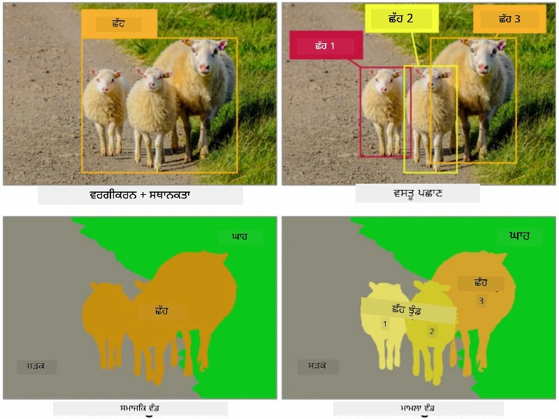
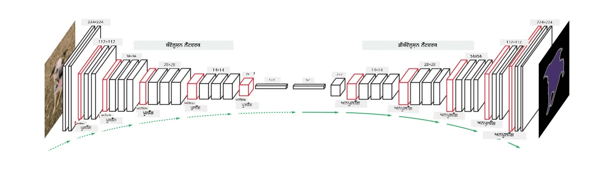
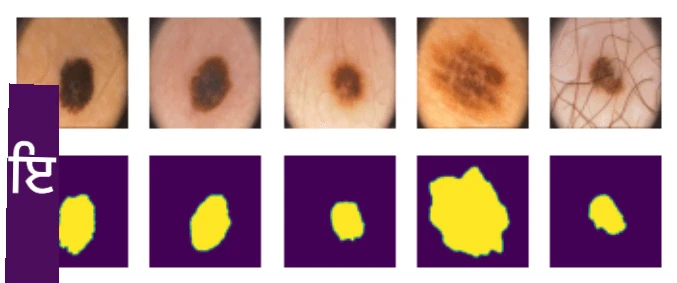

# ਸੈਗਮੈਂਟੇਸ਼ਨ

ਅਸੀਂ ਪਹਿਲਾਂ Object Detection ਬਾਰੇ ਸਿੱਖਿਆ ਸੀ, ਜੋ ਸਾਨੂੰ ਚਿੱਤਰ ਵਿੱਚ ਵਸਤੂਆਂ ਨੂੰ ਲੱਭਣ ਦੀ ਇਜਾਜ਼ਤ ਦਿੰਦਾ ਹੈ ਜਦੋਂ ਅਸੀਂ ਉਨ੍ਹਾਂ ਦੇ *bounding boxes* ਦੀ ਭਵਿੱਖਵਾਣੀ ਕਰਦੇ ਹਾਂ। ਹਾਲਾਂਕਿ, ਕੁਝ ਕੰਮਾਂ ਲਈ ਸਾਨੂੰ ਸਿਰਫ bounding boxes ਦੀ ਲੋੜ ਨਹੀਂ ਹੁੰਦੀ, ਸਗੋਂ ਵਸਤੂਆਂ ਦੀ ਹੋਰ ਸਹੀ ਸਥਿਤੀ ਦੀ ਲੋੜ ਹੁੰਦੀ ਹੈ। ਇਸ ਕੰਮ ਨੂੰ **ਸੈਗਮੈਂਟੇਸ਼ਨ** ਕਿਹਾ ਜਾਂਦਾ ਹੈ।

## [ਪ੍ਰੀ-ਲੈਕਚਰ ਕਵਿਜ਼](https://ff-quizzes.netlify.app/en/ai/quiz/23)

ਸੈਗਮੈਂਟੇਸ਼ਨ ਨੂੰ **ਪਿਕਸਲ ਕਲਾਸੀਫਿਕੇਸ਼ਨ** ਵਜੋਂ ਦੇਖਿਆ ਜਾ ਸਕਦਾ ਹੈ, ਜਿੱਥੇ **ਹਰ** ਪਿਕਸਲ ਲਈ ਸਾਨੂੰ ਇਸ ਦੀ ਕਲਾਸ ਦੀ ਭਵਿੱਖਵਾਣੀ ਕਰਨੀ ਪੈਂਦੀ ਹੈ (*background* ਵੀ ਇੱਕ ਕਲਾਸ ਹੁੰਦੀ ਹੈ)। ਸੈਗਮੈਂਟੇਸ਼ਨ ਦੇ ਦੋ ਮੁੱਖ ਐਲਗੋਰਿਥਮ ਹਨ:

* **ਸੈਮੈਂਟਿਕ ਸੈਗਮੈਂਟੇਸ਼ਨ** ਸਿਰਫ ਪਿਕਸਲ ਦੀ ਕਲਾਸ ਦੱਸਦੀ ਹੈ, ਅਤੇ ਇੱਕੋ ਕਲਾਸ ਦੇ ਵੱਖ-ਵੱਖ ਵਸਤੂਆਂ ਵਿੱਚ ਕੋਈ ਫਰਕ ਨਹੀਂ ਕਰਦੀ।
* **ਇੰਸਟੈਂਸ ਸੈਗਮੈਂਟੇਸ਼ਨ** ਕਲਾਸਾਂ ਨੂੰ ਵੱਖ-ਵੱਖ instances ਵਿੱਚ ਵੰਡਦੀ ਹੈ।

ਇੰਸਟੈਂਸ ਸੈਗਮੈਂਟੇਸ਼ਨ ਵਿੱਚ, ਇਹ ਭੇੜਾਂ ਵੱਖ-ਵੱਖ ਵਸਤੂਆਂ ਹਨ, ਪਰ ਸੈਮੈਂਟਿਕ ਸੈਗਮੈਂਟੇਸ਼ਨ ਵਿੱਚ ਸਾਰੀਆਂ ਭੇੜਾਂ ਨੂੰ ਇੱਕ ਕਲਾਸ ਵਜੋਂ ਦਰਸਾਇਆ ਜਾਂਦਾ ਹੈ।

> ਚਿੱਤਰ [ਇਸ ਬਲੌਗ ਪੋਸਟ](https://nirmalamurali.medium.com/image-classification-vs-semantic-segmentation-vs-instance-segmentation-625c33a08d50) ਤੋਂ

ਸੈਗਮੈਂਟੇਸ਼ਨ ਲਈ ਵੱਖ-ਵੱਖ ਨਿਊਰਲ ਆਰਕੀਟੈਕਚਰ ਹਨ, ਪਰ ਇਹ ਸਾਰੀਆਂ ਇੱਕੋ ਢਾਂਚੇ ਵਾਲੀਆਂ ਹਨ। ਇੱਕ ਤਰੀਕੇ ਨਾਲ, ਇਹ ਉਸ autoencoder ਦੇ ਸਮਾਨ ਹੈ ਜਿਸ ਬਾਰੇ ਤੁਸੀਂ ਪਹਿਲਾਂ ਸਿੱਖਿਆ ਸੀ, ਪਰ ਅਸਲ ਚਿੱਤਰ ਨੂੰ ਡੀਕੰਸਟ੍ਰਕਟ ਕਰਨ ਦੀ ਬਜਾਏ, ਸਾਡਾ ਉਦੇਸ਼ **mask** ਨੂੰ ਡੀਕੰਸਟ੍ਰਕਟ ਕਰਨਾ ਹੈ। ਇਸ ਤਰ੍ਹਾਂ, ਸੈਗਮੈਂਟੇਸ਼ਨ ਨੈਟਵਰਕ ਵਿੱਚ ਹੇਠਾਂ ਦਿੱਤੇ ਹਿੱਸੇ ਹੁੰਦੇ ਹਨ:

* **Encoder** ਇਨਪੁਟ ਚਿੱਤਰ ਤੋਂ ਫੀਚਰ ਕੱਢਦਾ ਹੈ।
* **Decoder** ਉਹਨਾਂ ਫੀਚਰਾਂ ਨੂੰ **mask image** ਵਿੱਚ ਬਦਲਦਾ ਹੈ, ਜਿਸਦਾ ਆਕਾਰ ਅਤੇ ਚੈਨਲਾਂ ਦੀ ਗਿਣਤੀ ਕਲਾਸਾਂ ਦੀ ਗਿਣਤੀ ਦੇ ਅਨੁਸਾਰ ਹੁੰਦੀ ਹੈ।

> ਚਿੱਤਰ [ਇਸ ਪ੍ਰਕਾਸ਼ਨ](https://arxiv.org/pdf/2001.05566.pdf) ਤੋਂ

ਸੈਗਮੈਂਟੇਸ਼ਨ ਲਈ ਵਰਤੀ ਜਾਣ ਵਾਲੀ loss function ਦਾ ਵਿਸ਼ੇਸ਼ ਜ਼ਿਕਰ ਕਰਨਾ ਚਾਹੀਦਾ ਹੈ। ਜਦੋਂ ਕਲਾਸਿਕਲ autoencoders ਵਰਤਦੇ ਹਾਂ, ਸਾਨੂੰ ਦੋ ਚਿੱਤਰਾਂ ਦੇ ਵਿਚਕਾਰ ਸਮਾਨਤਾ ਨੂੰ ਮਾਪਣ ਦੀ ਲੋੜ ਹੁੰਦੀ ਹੈ, ਅਤੇ ਅਸੀਂ mean square error (MSE) ਨੂੰ ਇਸ ਲਈ ਵਰਤ ਸਕਦੇ ਹਾਂ। ਸੈਗਮੈਂਟੇਸ਼ਨ ਵਿੱਚ, ਟਾਰਗੇਟ mask ਚਿੱਤਰ ਵਿੱਚ ਹਰ ਪਿਕਸਲ ਕਲਾਸ ਨੰਬਰ ਨੂੰ ਦਰਸਾਉਂਦਾ ਹੈ (one-hot-encoded ਤੀਜੇ dimension ਦੇ ਨਾਲ), ਇਸ ਲਈ ਸਾਨੂੰ ਕਲਾਸੀਫਿਕੇਸ਼ਨ ਲਈ ਖਾਸ loss functions ਦੀ ਲੋੜ ਹੁੰਦੀ ਹੈ - cross-entropy loss, ਜੋ ਸਾਰੇ ਪਿਕਸਲਾਂ 'ਤੇ averaged ਹੁੰਦੀ ਹੈ। ਜੇ mask binary ਹੈ - **binary cross-entropy loss** (BCE) ਵਰਤੀ ਜਾਂਦੀ ਹੈ।

> ✅ One-hot encoding ਇੱਕ ਤਰੀਕਾ ਹੈ ਜਿਸ ਨਾਲ ਕਲਾਸ ਲੇਬਲ ਨੂੰ ਕਲਾਸਾਂ ਦੀ ਗਿਣਤੀ ਦੇ ਬਰਾਬਰ ਲੰਬਾਈ ਵਾਲੇ ਵੇਕਟਰ ਵਿੱਚ encode ਕੀਤਾ ਜਾਂਦਾ ਹੈ। [ਇਸ ਲੇਖ](https://datagy.io/sklearn-one-hot-encode/) ਵਿੱਚ ਇਸ ਤਕਨੀਕ ਬਾਰੇ ਵੇਖੋ।

## ਮੈਡੀਕਲ ਇਮੇਜਿੰਗ ਲਈ ਸੈਗਮੈਂਟੇਸ਼ਨ

ਇਸ ਪਾਠ ਵਿੱਚ, ਅਸੀਂ ਸੈਗਮੈਂਟੇਸ਼ਨ ਨੂੰ ਕਾਰਵਾਈ ਵਿੱਚ ਦੇਖਾਂਗੇ ਜਦੋਂ ਅਸੀਂ ਨੈਟਵਰਕ ਨੂੰ ਮੈਡੀਕਲ ਚਿੱਤਰਾਂ 'ਤੇ ਮਨੁੱਖੀ nevi (ਜਿਨ੍ਹਾਂ ਨੂੰ moles ਵੀ ਕਿਹਾ ਜਾਂਦਾ ਹੈ) ਨੂੰ ਪਛਾਣਨ ਲਈ ਟ੍ਰੇਨ ਕਰਾਂਗੇ। ਅਸੀਂ <a href="https://www.fc.up.pt/addi/ph2%20database.html">PH2 ਡੇਟਾਬੇਸ</a> ਦੇ dermoscopy images ਨੂੰ ਚਿੱਤਰ ਸਰੋਤ ਵਜੋਂ ਵਰਤਾਂਗੇ। ਇਸ ਡੇਟਾਸੈਟ ਵਿੱਚ ਤਿੰਨ ਕਲਾਸਾਂ ਦੇ 200 ਚਿੱਤਰ ਹਨ: typical nevus, atypical nevus, ਅਤੇ melanoma। ਸਾਰੇ ਚਿੱਤਰਾਂ ਵਿੱਚ ਇੱਕ **mask** ਵੀ ਸ਼ਾਮਲ ਹੈ ਜੋ nevus ਨੂੰ outline ਕਰਦਾ ਹੈ।

> ✅ ਇਹ ਤਕਨੀਕ ਇਸ ਕਿਸਮ ਦੀ ਮੈਡੀਕਲ ਇਮੇਜਿੰਗ ਲਈ ਖਾਸ ਤੌਰ 'ਤੇ ਉਚਿਤ ਹੈ, ਪਰ ਤੁਸੀਂ ਹੋਰ ਕਿਹੜੇ ਹਕੀਕਤੀ-ਜਗਤ ਦੇ ਐਪਲੀਕੇਸ਼ਨ ਦੀ ਕਲਪਨਾ ਕਰ ਸਕਦੇ ਹੋ?

> ਚਿੱਤਰ PH2 ਡੇਟਾਬੇਸ ਤੋਂ

ਅਸੀਂ ਇੱਕ ਮਾਡਲ ਨੂੰ ਟ੍ਰੇਨ ਕਰਾਂਗੇ ਜੋ ਕਿਸੇ ਵੀ nevus ਨੂੰ ਇਸਦੇ background ਤੋਂ ਸੈਗਮੈਂਟ ਕਰ ਸਕੇ।

## ✍️ ਅਭਿਆਸ: ਸੈਮੈਂਟਿਕ ਸੈਗਮੈਂਟੇਸ਼ਨ

ਹੇਠਾਂ ਦਿੱਤੇ ਨੋਟਬੁੱਕ ਖੋਲ੍ਹੋ ਤਾਂ ਜੋ ਵੱਖ-ਵੱਖ ਸੈਮੈਂਟਿਕ ਸੈਗਮੈਂਟੇਸ਼ਨ ਆਰਕੀਟੈਕਚਰਾਂ ਬਾਰੇ ਹੋਰ ਜਾਣ ਸਕੋ, ਉਨ੍ਹਾਂ ਨਾਲ ਕੰਮ ਕਰਨ ਦੀ ਪ੍ਰੈਕਟਿਸ ਕਰੋ, ਅਤੇ ਉਨ੍ਹਾਂ ਨੂੰ ਕਾਰਵਾਈ ਵਿੱਚ ਦੇਖੋ।

* [ਸੈਮੈਂਟਿਕ ਸੈਗਮੈਂਟੇਸ਼ਨ Pytorch](SemanticSegmentationPytorch.ipynb)
* [ਸੈਮੈਂਟਿਕ ਸੈਗਮੈਂਟੇਸ਼ਨ TensorFlow](SemanticSegmentationTF.ipynb)

## [ਪੋਸਟ-ਲੈਕਚਰ ਕਵਿਜ਼](https://ff-quizzes.netlify.app/en/ai/quiz/24)

## ਨਿਸਕਰਸ਼

ਸੈਗਮੈਂਟੇਸ਼ਨ ਚਿੱਤਰ ਕਲਾਸੀਫਿਕੇਸ਼ਨ ਲਈ ਇੱਕ ਬਹੁਤ ਹੀ ਸ਼ਕਤੀਸ਼ਾਲੀ ਤਕਨੀਕ ਹੈ, ਜੋ bounding boxes ਤੋਂ ਅੱਗੇ ਪਿਕਸਲ-ਲੈਵਲ ਕਲਾਸੀਫਿਕੇਸ਼ਨ ਤੱਕ ਜਾਂਦੀ ਹੈ। ਇਹ ਮੈਡੀਕਲ ਇਮੇਜਿੰਗ ਸਮੇਤ ਹੋਰ ਐਪਲੀਕੇਸ਼ਨ ਵਿੱਚ ਵਰਤੀ ਜਾਂਦੀ ਹੈ।

## 🚀 ਚੁਣੌਤੀ

ਸ਼ਰੀਰ ਦੀ ਸੈਗਮੈਂਟੇਸ਼ਨ ਚਿੱਤਰਾਂ ਵਿੱਚ ਲੋਕਾਂ ਨਾਲ ਕੀਤੇ ਜਾਣ ਵਾਲੇ ਆਮ ਕੰਮਾਂ ਵਿੱਚੋਂ ਇੱਕ ਹੈ। ਹੋਰ ਮਹੱਤਵਪੂਰਨ ਕੰਮਾਂ ਵਿੱਚ **skeleton detection** ਅਤੇ **pose detection** ਸ਼ਾਮਲ ਹਨ। [OpenPose](https://github.com/CMU-Perceptual-Computing-Lab/openpose) ਲਾਇਬ੍ਰੇਰੀ ਨੂੰ ਅਜ਼ਮਾਓ ਤਾਂ ਜੋ ਦੇਖ ਸਕੋ ਕਿ pose detection ਕਿਵੇਂ ਵਰਤੀ ਜਾ ਸਕਦੀ ਹੈ।

## ਸਮੀਖਿਆ ਅਤੇ ਸਵੈ-ਅਧਿਐਨ

ਇਹ [ਵਿਕੀਪੀਡੀਆ ਲੇਖ](https://wikipedia.org/wiki/Image_segmentation) ਇਸ ਤਕਨੀਕ ਦੇ ਵੱਖ-ਵੱਖ ਐਪਲੀਕੇਸ਼ਨ ਦਾ ਚੰਗਾ ਜਾਇਜ਼ਾ ਦਿੰਦਾ ਹੈ। ਇਸ ਖੇਤਰ ਵਿੱਚ Instance segmentation ਅਤੇ Panoptic segmentation ਦੇ ਉਪ-ਡੋਮੇਨ ਬਾਰੇ ਆਪਣੇ ਆਪ ਹੋਰ ਸਿੱਖੋ।

## [ਅਸਾਈਨਮੈਂਟ](lab/README.md)

ਇਸ ਲੈਬ ਵਿੱਚ, [Segmentation Full Body MADS Dataset](https://www.kaggle.com/datasets/tapakah68/segmentation-full-body-mads-dataset) ਨੂੰ Kaggle ਤੋਂ ਵਰਤ ਕੇ **ਮਨੁੱਖੀ ਸ਼ਰੀਰ ਦੀ ਸੈਗਮੈਂਟੇਸ਼ਨ** ਦੀ ਕੋਸ਼ਿਸ਼ ਕਰੋ।

---

