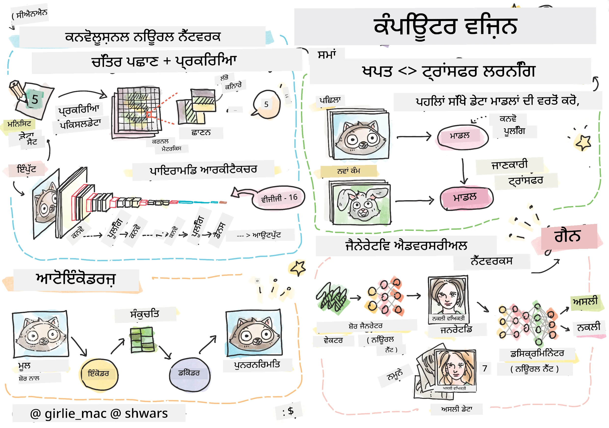

# ਕੰਪਿਊਟਰ ਵਿਜ਼ਨ

ਇਸ ਭਾਗ ਵਿੱਚ ਅਸੀਂ ਸਿੱਖਾਂਗੇ:

* [ਕੰਪਿਊਟਰ ਵਿਜ਼ਨ ਅਤੇ OpenCV ਦਾ ਪਰਿਚਯ](06-IntroCV/README.md)
* [ਕਨਵੋਲੂਸ਼ਨਲ ਨਿਊਰਲ ਨੈੱਟਵਰਕਸ](07-ConvNets/README.md)
* [ਪ੍ਰੀ-ਟ੍ਰੇਨਡ ਨੈੱਟਵਰਕਸ ਅਤੇ ਟ੍ਰਾਂਸਫਰ ਲਰਨਿੰਗ](08-TransferLearning/README.md) 
* [ਆਟੋਇਨਕੋਡਰਜ਼](09-Autoencoders/README.md)
* [ਜਨਰੇਟਿਵ ਐਡਵਰਸਰੀਅਲ ਨੈੱਟਵਰਕਸ](10-GANs/README.md)
* [ਆਬਜੈਕਟ ਡਿਟੈਕਸ਼ਨ](11-ObjectDetection/README.md)
* [ਸੈਮੈਂਟਿਕ ਸੈਗਮੈਂਟੇਸ਼ਨ](12-Segmentation/README.md)

**ਅਸਵੀਕਰਤੀ**:  
ਇਹ ਦਸਤਾਵੇਜ਼ AI ਅਨੁਵਾਦ ਸੇਵਾ [Co-op Translator](https://github.com/Azure/co-op-translator) ਦੀ ਵਰਤੋਂ ਕਰਕੇ ਅਨੁਵਾਦ ਕੀਤਾ ਗਿਆ ਹੈ। ਜਦੋਂ ਕਿ ਅਸੀਂ ਸਹੀ ਹੋਣ ਦਾ ਯਤਨ ਕਰਦੇ ਹਾਂ, ਕਿਰਪਾ ਕਰਕੇ ਧਿਆਨ ਦਿਓ ਕਿ ਸਵੈਚਾਲਿਤ ਅਨੁਵਾਦਾਂ ਵਿੱਚ ਗਲਤੀਆਂ ਜਾਂ ਅਸੁਣਭਵਤਾਵਾਂ ਹੋ ਸਕਦੀਆਂ ਹਨ। ਇਸ ਦੀ ਮੂਲ ਭਾਸ਼ਾ ਵਿੱਚ ਮੌਜੂਦ ਮੂਲ ਦਸਤਾਵੇਜ਼ ਨੂੰ ਪ੍ਰਮਾਣਿਕ ਸਰੋਤ ਮੰਨਿਆ ਜਾਣਾ ਚਾਹੀਦਾ ਹੈ। ਮਹੱਤਵਪੂਰਨ ਜਾਣਕਾਰੀ ਲਈ, ਪੇਸ਼ੇਵਰ ਮਨੁੱਖੀ ਅਨੁਵਾਦ ਦੀ ਸਿਫਾਰਸ਼ ਕੀਤੀ ਜਾਂਦੀ ਹੈ। ਇਸ ਅਨੁਵਾਦ ਦੇ ਪ੍ਰਯੋਗ ਤੋਂ ਪੈਦਾ ਹੋਣ ਵਾਲੇ ਕਿਸੇ ਵੀ ਗਲਤਫਹਿਮੀ ਜਾਂ ਗਲਤ ਵਿਆਖਿਆ ਲਈ ਅਸੀਂ ਜ਼ਿੰਮੇਵਾਰ ਨਹੀਂ ਹਾਂ।