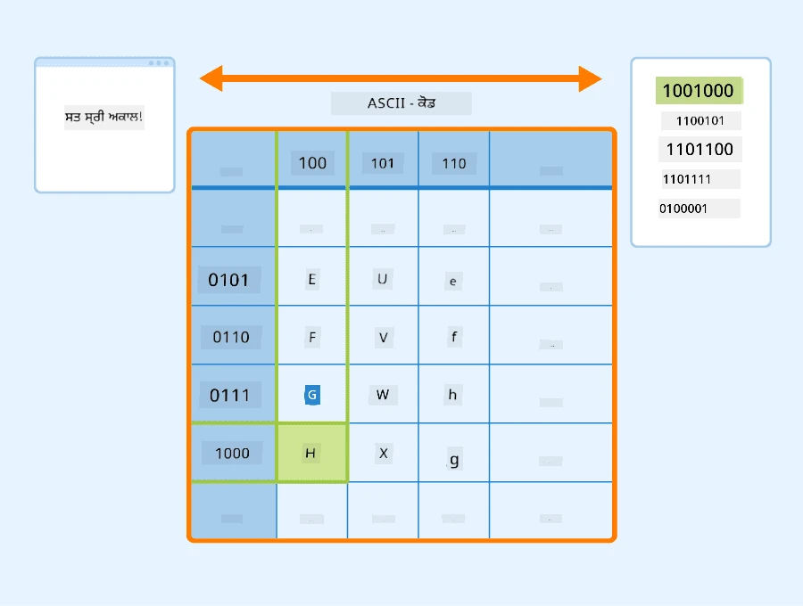
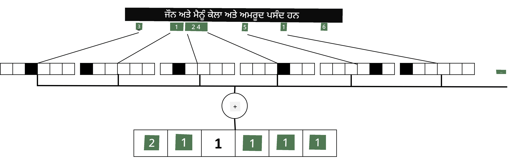

# ਟੈਕਸਟ ਨੂੰ ਟੈਂਸਰ ਵਜੋਂ ਦਰਸਾਉਣਾ

## [ਪ੍ਰੀ-ਲੈਕਚਰ ਕਵਿਜ਼](https://ff-quizzes.netlify.app/en/ai/quiz/25)

## ਟੈਕਸਟ ਕਲਾਸੀਫਿਕੇਸ਼ਨ

ਇਸ ਸੈਕਸ਼ਨ ਦੇ ਪਹਿਲੇ ਹਿੱਸੇ ਵਿੱਚ, ਅਸੀਂ **ਟੈਕਸਟ ਕਲਾਸੀਫਿਕੇਸ਼ਨ** ਟਾਸਕ 'ਤੇ ਧਿਆਨ ਦੇਵਾਂਗੇ। ਅਸੀਂ [AG News](https://www.kaggle.com/amananandrai/ag-news-classification-dataset) ਡੇਟਾਸੈੱਟ ਦੀ ਵਰਤੋਂ ਕਰਾਂਗੇ, ਜਿਸ ਵਿੱਚ ਹੇਠਾਂ ਦਿੱਤੇ ਜਿਵੇਂ ਖ਼ਬਰਾਂ ਦੇ ਲੇਖ ਸ਼ਾਮਲ ਹਨ:

* ਸ਼੍ਰੇਣੀ: ਸਾਇ/ਟੈਕ
* ਸਿਰਲੇਖ: Ky. Company Wins Grant to Study Peptides (AP)
* ਬਾਡੀ: AP - ਇੱਕ ਕੰਪਨੀ ਜੋ ਲੂਈਸਵਿਲ ਯੂਨੀਵਰਸਿਟੀ ਦੇ ਰਸਾਇਣ ਵਿਗਿਆਨ ਦੇ ਖੋਜਕਰਤਾ ਦੁਆਰਾ ਸਥਾਪਿਤ ਕੀਤੀ ਗਈ ਸੀ, ਨੇ ਪੈਪਟਾਈਡਸ ਦੇ ਵਿਕਾਸ ਲਈ ਗ੍ਰਾਂਟ ਜਿੱਤੀ...

ਸਾਡਾ ਉਦੇਸ਼ ਟੈਕਸਟ ਦੇ ਆਧਾਰ 'ਤੇ ਖ਼ਬਰਾਂ ਨੂੰ ਇੱਕ ਸ਼੍ਰੇਣੀ ਵਿੱਚ ਕਲਾਸੀਫਾਈ ਕਰਨਾ ਹੋਵੇਗਾ।

## ਟੈਕਸਟ ਨੂੰ ਦਰਸਾਉਣਾ

ਜੇਕਰ ਅਸੀਂ ਨੈਚਰਲ ਲੈਂਗਵੇਜ ਪ੍ਰੋਸੈਸਿੰਗ (NLP) ਟਾਸਕ ਨੂੰ ਨਿਊਰਲ ਨੈਟਵਰਕ ਨਾਲ ਹੱਲ ਕਰਨਾ ਚਾਹੁੰਦੇ ਹਾਂ, ਤਾਂ ਸਾਨੂੰ ਟੈਕਸਟ ਨੂੰ ਟੈਂਸਰ ਵਜੋਂ ਦਰਸਾਉਣ ਦਾ ਕੋਈ ਤਰੀਕਾ ਚਾਹੀਦਾ ਹੈ। ਕੰਪਿਊਟਰ ਪਹਿਲਾਂ ਹੀ ASCII ਜਾਂ UTF-8 ਵਰਗੇ ਐਨਕੋਡਿੰਗ ਦੀ ਵਰਤੋਂ ਕਰਕੇ ਟੈਕਸਟ ਅੱਖਰਾਂ ਨੂੰ ਨੰਬਰਾਂ ਵਜੋਂ ਦਰਸਾਉਂਦੇ ਹਨ ਜੋ ਤੁਹਾਡੇ ਸਕ੍ਰੀਨ 'ਤੇ ਫੌਂਟਸ ਨਾਲ ਮੈਪ ਹੁੰਦੇ ਹਨ।

> [ਚਿੱਤਰ ਸਰੋਤ](https://www.seobility.net/en/wiki/ASCII)

ਇਨਸਾਨ ਵਜੋਂ, ਅਸੀਂ ਸਮਝਦੇ ਹਾਂ ਕਿ ਹਰ ਅੱਖਰ **ਕੀ ਦਰਸਾਉਂਦਾ ਹੈ**, ਅਤੇ ਕਿਵੇਂ ਸਾਰੇ ਅੱਖਰ ਇੱਕ ਵਾਕ ਦੇ ਸ਼ਬਦ ਬਣਾਉਣ ਲਈ ਇਕੱਠੇ ਹੁੰਦੇ ਹਨ। ਹਾਲਾਂਕਿ, ਕੰਪਿਊਟਰ ਆਪਣੇ ਆਪ ਇਸ ਤਰ੍ਹਾਂ ਦੀ ਸਮਝ ਨਹੀਂ ਰੱਖਦੇ, ਅਤੇ ਨਿਊਰਲ ਨੈਟਵਰਕ ਨੂੰ ਟ੍ਰੇਨਿੰਗ ਦੌਰਾਨ ਅਰਥ ਸਿੱਖਣਾ ਪੈਂਦਾ ਹੈ।

ਇਸ ਲਈ, ਅਸੀਂ ਟੈਕਸਟ ਨੂੰ ਦਰਸਾਉਣ ਲਈ ਵੱਖ-ਵੱਖ ਤਰੀਕੇ ਵਰਤ ਸਕਦੇ ਹਾਂ:

* **ਕਿਰਦਾਰ-ਪੱਧਰ ਦੀ ਪ੍ਰਤੀਨਿਧਤਾ**, ਜਦੋਂ ਅਸੀਂ ਟੈਕਸਟ ਨੂੰ ਹਰ ਅੱਖਰ ਨੂੰ ਇੱਕ ਨੰਬਰ ਵਜੋਂ ਮੰਨ ਕੇ ਦਰਸਾਉਂਦੇ ਹਾਂ। ਜੇਕਰ ਸਾਡੇ ਟੈਕਸਟ ਕੋਰਪਸ ਵਿੱਚ *C* ਵੱਖ-ਵੱਖ ਅੱਖਰ ਹਨ, ਤਾਂ ਸ਼ਬਦ *Hello* ਨੂੰ 5x*C* ਟੈਂਸਰ ਵਜੋਂ ਦਰਸਾਇਆ ਜਾਵੇਗਾ। ਹਰ ਅੱਖਰ ਇੱਕ-ਹਾਟ ਐਨਕੋਡਿੰਗ ਵਿੱਚ ਇੱਕ ਟੈਂਸਰ ਕਾਲਮ ਨਾਲ ਸਬੰਧਿਤ ਹੋਵੇਗਾ।
* **ਸ਼ਬਦ-ਪੱਧਰ ਦੀ ਪ੍ਰਤੀਨਿਧਤਾ**, ਜਿਸ ਵਿੱਚ ਅਸੀਂ ਆਪਣੇ ਟੈਕਸਟ ਦੇ ਸਾਰੇ ਸ਼ਬਦਾਂ ਦਾ **ਸ਼ਬਦਕੋਸ਼** ਬਣਾਉਂਦੇ ਹਾਂ, ਅਤੇ ਫਿਰ ਸ਼ਬਦਾਂ ਨੂੰ ਇੱਕ-ਹਾਟ ਐਨਕੋਡਿੰਗ ਦੀ ਵਰਤੋਂ ਕਰਕੇ ਦਰਸਾਉਂਦੇ ਹਾਂ। ਇਹ ਤਰੀਕਾ ਕੁਝ ਹੱਦ ਤੱਕ ਬਿਹਤਰ ਹੈ, ਕਿਉਂਕਿ ਹਰ ਅੱਖਰ ਆਪਣੇ ਆਪ ਵਿੱਚ ਬਹੁਤ ਜ਼ਿਆਦਾ ਅਰਥ ਨਹੀਂ ਰੱਖਦਾ, ਅਤੇ ਇਸ ਲਈ ਉੱਚ-ਪੱਧਰ ਦੇ ਸੈਮੈਂਟਿਕ ਧਾਰਨਾਵਾਂ - ਸ਼ਬਦਾਂ - ਦੀ ਵਰਤੋਂ ਕਰਕੇ ਅਸੀਂ ਨਿਊਰਲ ਨੈਟਵਰਕ ਲਈ ਟਾਸਕ ਨੂੰ ਸਧਾਰਨ ਬਣਾਉਂਦੇ ਹਾਂ। ਹਾਲਾਂਕਿ, ਵੱਡੇ ਸ਼ਬਦਕੋਸ਼ ਦੇ ਆਕਾਰ ਦੇ ਕਾਰਨ, ਸਾਨੂੰ ਉੱਚ-ਮਾਪਦੰਡ ਵਾਲੇ sparse ਟੈਂਸਰ ਨਾਲ ਨਿਪਟਣਾ ਪੈਂਦਾ ਹੈ।

ਪ੍ਰਤੀਨਿਧਤਾ ਦੇ ਕਿਸੇ ਵੀ ਤਰੀਕੇ ਦੇ ਨਾਲ, ਸਾਨੂੰ ਪਹਿਲਾਂ ਟੈਕਸਟ ਨੂੰ **ਟੋਕਨ** ਦੇ ਕ੍ਰਮ ਵਿੱਚ ਬਦਲਣਾ ਪੈਂਦਾ ਹੈ, ਇੱਕ ਟੋਕਨ ਇੱਕ ਅੱਖਰ, ਇੱਕ ਸ਼ਬਦ, ਜਾਂ ਕਈ ਵਾਰ ਇੱਕ ਸ਼ਬਦ ਦਾ ਹਿੱਸਾ ਹੋ ਸਕਦਾ ਹੈ। ਫਿਰ, ਅਸੀਂ ਟੋਕਨ ਨੂੰ ਇੱਕ ਨੰਬਰ ਵਿੱਚ ਬਦਲਦੇ ਹਾਂ, ਆਮ ਤੌਰ 'ਤੇ **ਸ਼ਬਦਕੋਸ਼** ਦੀ ਵਰਤੋਂ ਕਰਕੇ, ਅਤੇ ਇਹ ਨੰਬਰ ਇੱਕ-ਹਾਟ ਐਨਕੋਡਿੰਗ ਦੀ ਵਰਤੋਂ ਕਰਕੇ ਨਿਊਰਲ ਨੈਟਵਰਕ ਵਿੱਚ ਫੀਡ ਕੀਤਾ ਜਾ ਸਕਦਾ ਹੈ।

## N-Grams

ਕੁਦਰਤੀ ਭਾਸ਼ਾ ਵਿੱਚ, ਸ਼ਬਦਾਂ ਦਾ ਸਹੀ ਅਰਥ ਸਿਰਫ ਸੰਦਰਭ ਵਿੱਚ ਹੀ ਨਿਰਧਾਰਤ ਕੀਤਾ ਜਾ ਸਕਦਾ ਹੈ। ਉਦਾਹਰਣ ਲਈ, *neural network* ਅਤੇ *fishing network* ਦੇ ਅਰਥ ਪੂਰੀ ਤਰ੍ਹਾਂ ਵੱਖਰੇ ਹਨ। ਇਸ ਨੂੰ ਧਿਆਨ ਵਿੱਚ ਰੱਖਣ ਦੇ ਤਰੀਕਿਆਂ ਵਿੱਚੋਂ ਇੱਕ ਇਹ ਹੈ ਕਿ ਅਸੀਂ ਆਪਣੇ ਮਾਡਲ ਨੂੰ ਸ਼ਬਦਾਂ ਦੇ ਜੋੜਿਆਂ 'ਤੇ ਬਣਾਉਂਦੇ ਹਾਂ, ਅਤੇ ਸ਼ਬਦ ਜੋੜਿਆਂ ਨੂੰ ਵੱਖਰੇ ਸ਼ਬਦਕੋਸ਼ ਟੋਕਨ ਵਜੋਂ ਮੰਨਦੇ ਹਾਂ। ਇਸ ਤਰੀਕੇ ਨਾਲ, ਵਾਕ *I like to go fishing* ਹੇਠਾਂ ਦਿੱਤੇ ਟੋਕਨ ਦੇ ਕ੍ਰਮ ਨਾਲ ਦਰਸਾਇਆ ਜਾਵੇਗਾ: *I like*, *like to*, *to go*, *go fishing*। ਇਸ ਤਰੀਕੇ ਨਾਲ ਸਮੱਸਿਆ ਇਹ ਹੈ ਕਿ ਸ਼ਬਦਕੋਸ਼ ਦਾ ਆਕਾਰ ਕਾਫ਼ੀ ਵਧ ਜਾਂਦਾ ਹੈ, ਅਤੇ *go fishing* ਅਤੇ *go shopping* ਵਰਗੇ ਜੋੜੇ ਵੱਖਰੇ ਟੋਕਨ ਦੁਆਰਾ ਦਰਸਾਏ ਜਾਂਦੇ ਹਨ, ਜੋ ਕਿ semantic ਸਾਂਝੇਦਾਰੀ ਨਹੀਂ ਰੱਖਦੇ ਹਾਲਾਂਕਿ ਇੱਕੋ ਵਰਬ ਵਰਤਿਆ ਗਿਆ ਹੈ।

ਕਈ ਮਾਮਲਿਆਂ ਵਿੱਚ, ਅਸੀਂ tri-grams -- ਤਿੰਨ ਸ਼ਬਦਾਂ ਦੇ ਜੋੜੇ -- ਦੀ ਵਰਤੋਂ ਕਰਨ ਬਾਰੇ ਸੋਚ ਸਕਦੇ ਹਾਂ। ਇਸ ਤਰੀਕੇ ਨੂੰ ਅਕਸਰ **n-grams** ਕਿਹਾ ਜਾਂਦਾ ਹੈ। ਇਹ ਵੀ ਸਹੀ ਹੈ ਕਿ n-grams ਨੂੰ ਕਿਰਦਾਰ-ਪੱਧਰ ਦੀ ਪ੍ਰਤੀਨਿਧਤਾ ਨਾਲ ਵਰਤਿਆ ਜਾਵੇ, ਜਿਸ ਵਿੱਚ n-grams ਲਗਭਗ ਵੱਖ-ਵੱਖ syllabi ਨਾਲ ਸਬੰਧਿਤ ਹੋਵੇਗਾ।

## Bag-of-Words ਅਤੇ TF/IDF

ਜਦੋਂ ਅਸੀਂ ਟੈਕਸਟ ਕਲਾਸੀਫਿਕੇਸ਼ਨ ਵਰਗੇ ਟਾਸਕ ਹੱਲ ਕਰਦੇ ਹਾਂ, ਤਾਂ ਸਾਨੂੰ ਟੈਕਸਟ ਨੂੰ ਇੱਕ ਫਿਕਸਡ-ਸਾਈਜ਼ ਵੇਕਟਰ ਦੁਆਰਾ ਦਰਸਾਉਣ ਦੇ ਯੋਗ ਹੋਣਾ ਚਾਹੀਦਾ ਹੈ, ਜਿਸ ਨੂੰ ਅੰਤਮ ਡੈਂਸ ਕਲਾਸੀਫਾਇਰ ਵਿੱਚ ਇਨਪੁਟ ਵਜੋਂ ਵਰਤਿਆ ਜਾਵੇਗਾ। ਇਸ ਨੂੰ ਕਰਨ ਦੇ ਸਭ ਤੋਂ ਸਧਾਰਨ ਤਰੀਕਿਆਂ ਵਿੱਚੋਂ ਇੱਕ ਇਹ ਹੈ ਕਿ ਸਾਰੇ ਵਿਅਕਤੀਗਤ ਸ਼ਬਦ ਪ੍ਰਤੀਨਿਧਤਾਵਾਂ ਨੂੰ ਜੋੜ ਕੇ ਦਰਸਾਇਆ ਜਾਵੇ। ਜੇਕਰ ਅਸੀਂ ਹਰ ਸ਼ਬਦ ਦੀ ਇੱਕ-ਹਾਟ ਐਨਕੋਡਿੰਗ ਨੂੰ ਜੋੜਦੇ ਹਾਂ, ਤਾਂ ਅਸੀਂ ਫ੍ਰੀਕਵੈਂਸੀਜ਼ ਦੇ ਇੱਕ ਵੇਕਟਰ ਦੇ ਨਾਲ ਖਤਮ ਕਰਾਂਗੇ, ਜੋ ਦਿਖਾਉਂਦਾ ਹੈ ਕਿ ਟੈਕਸਟ ਵਿੱਚ ਹਰ ਸ਼ਬਦ ਕਿੰਨੀ ਵਾਰ ਆਉਂਦਾ ਹੈ। ਟੈਕਸਟ ਦੀ ਇਸ ਤਰ੍ਹਾਂ ਦੀ ਪ੍ਰਤੀਨਿਧਤਾ ਨੂੰ **bag of words** (BoW) ਕਿਹਾ ਜਾਂਦਾ ਹੈ।

> ਚਿੱਤਰ ਲੇਖਕ ਦੁਆਰਾ

BoW ਅਸਲ ਵਿੱਚ ਦਰਸਾਉਂਦਾ ਹੈ ਕਿ ਕਿਹੜੇ ਸ਼ਬਦ ਟੈਕਸਟ ਵਿੱਚ ਆਉਂਦੇ ਹਨ ਅਤੇ ਕਿਹੜੀਆਂ ਮਾਤਰਾਵਾਂ ਵਿੱਚ, ਜੋ ਕਿ ਵਾਕਈ ਇਸ ਗੱਲ ਦਾ ਚੰਗਾ ਸੰਕੇਤ ਹੋ ਸਕਦਾ ਹੈ ਕਿ ਟੈਕਸਟ ਕਿਸ ਬਾਰੇ ਹੈ। ਉਦਾਹਰਣ ਲਈ, ਰਾਜਨੀਤੀ 'ਤੇ ਖ਼ਬਰਾਂ ਦੇ ਲੇਖ ਵਿੱਚ ਸੰਭਵ ਹੈ ਕਿ *president* ਅਤੇ *country* ਵਰਗੇ ਸ਼ਬਦ ਸ਼ਾਮਲ ਹੋਣਗੇ, ਜਦੋਂ ਕਿ ਵਿਗਿਆਨਕ ਪ੍ਰਕਾਸ਼ਨ ਵਿੱਚ *collider*, *discovered* ਆਦਿ ਵਰਗੇ ਸ਼ਬਦ ਹੋ ਸਕਦੇ ਹਨ। ਇਸ ਤਰੀਕੇ ਨਾਲ, ਸ਼ਬਦ ਫ੍ਰੀਕਵੈਂਸੀਜ਼ ਕਈ ਮਾਮਲਿਆਂ ਵਿੱਚ ਟੈਕਸਟ ਸਮੱਗਰੀ ਦਾ ਚੰਗਾ ਸੰਕੇਤ ਹੋ ਸਕਦੇ ਹਨ।

BoW ਨਾਲ ਸਮੱਸਿਆ ਇਹ ਹੈ ਕਿ ਕੁਝ ਆਮ ਸ਼ਬਦ, ਜਿਵੇਂ *and*, *is* ਆਦਿ ਜ਼ਿਆਦਾਤਰ ਟੈਕਸਟ ਵਿੱਚ ਆਉਂਦੇ ਹਨ, ਅਤੇ ਉਹ ਸਭ ਤੋਂ ਉੱਚੀਆਂ ਫ੍ਰੀਕਵੈਂਸੀਜ਼ ਰੱਖਦੇ ਹਨ, ਜੋ ਸੱਚਮੁੱਚ ਮਹੱਤਵਪੂਰਨ ਸ਼ਬਦਾਂ ਨੂੰ ਛੁਪਾ ਦਿੰਦੇ ਹਨ। ਅਸੀਂ ਉਹਨਾਂ ਸ਼ਬਦਾਂ ਦੀ ਮਹੱਤਤਾ ਨੂੰ ਘਟਾ ਸਕਦੇ ਹਾਂ ਜੇਕਰ ਅਸੀਂ ਪੂਰੇ ਦਸਤਾਵੇਜ਼ ਸੰਗ੍ਰਹਿ ਵਿੱਚ ਸ਼ਬਦਾਂ ਦੇ ਆਵਿਰਤੀ ਦਰ ਨੂੰ ਧਿਆਨ ਵਿੱਚ ਰੱਖੀਏ। ਇਹ TF/IDF ਤਰੀਕੇ ਦੇ ਪਿੱਛੇ ਮੁੱਖ ਵਿਚਾਰ ਹੈ, ਜਿਸ ਨੂੰ ਇਸ ਪਾਠ ਨਾਲ ਜੁੜੇ ਨੋਟਬੁੱਕ ਵਿੱਚ ਵਧੇਰੇ ਵਿਸਤਾਰ ਨਾਲ ਕਵਰ ਕੀਤਾ ਗਿਆ ਹੈ।

ਹਾਲਾਂਕਿ, ਇਹਨਾਂ ਤਰੀਕਿਆਂ ਵਿੱਚੋਂ ਕੋਈ ਵੀ ਟੈਕਸਟ ਦੇ **ਸੈਮੈਂਟਿਕਸ** ਨੂੰ ਪੂਰੀ ਤਰ੍ਹਾਂ ਧਿਆਨ ਵਿੱਚ ਨਹੀਂ ਰੱਖ ਸਕਦਾ। ਸਾਨੂੰ ਇਸ ਲਈ ਹੋਰ ਸ਼ਕਤੀਸ਼ਾਲੀ ਨਿਊਰਲ ਨੈਟਵਰਕ ਮਾਡਲਾਂ ਦੀ ਲੋੜ ਹੈ, ਜਿਸ ਬਾਰੇ ਅਸੀਂ ਇਸ ਸੈਕਸ਼ਨ ਵਿੱਚ ਬਾਅਦ ਵਿੱਚ ਚਰਚਾ ਕਰਾਂਗੇ।

## ✍️ ਅਭਿਆਸ: ਟੈਕਸਟ ਪ੍ਰਤੀਨਿਧਤਾ

ਹੇਠਾਂ ਦਿੱਤੇ ਨੋਟਬੁੱਕ ਵਿੱਚ ਆਪਣੀ ਸਿੱਖਿਆ ਜਾਰੀ ਰੱਖੋ:

* [PyTorch ਨਾਲ ਟੈਕਸਟ ਪ੍ਰਤੀਨਿਧਤਾ](TextRepresentationPyTorch.ipynb)
* [TensorFlow ਨਾਲ ਟੈਕਸਟ ਪ੍ਰਤੀਨਿਧਤਾ](TextRepresentationTF.ipynb)

## ਨਿਸ਼ਕਰਸ਼

ਅਜੇ ਤੱਕ, ਅਸੀਂ ਉਹ ਤਕਨੀਕਾਂ ਪੜ੍ਹੀਆਂ ਹਨ ਜੋ ਵੱਖ-ਵੱਖ ਸ਼ਬਦਾਂ ਨੂੰ ਫ੍ਰੀਕਵੈਂਸੀ ਵਜ਼ਨ ਦੇ ਸਕਦੀਆਂ ਹਨ। ਹਾਲਾਂਕਿ, ਇਹ ਅਰਥ ਜਾਂ ਕ੍ਰਮ ਨੂੰ ਦਰਸਾਉਣ ਵਿੱਚ ਅਸਮਰਥ ਹਨ। ਪ੍ਰਸਿੱਧ ਭਾਸ਼ਾਵਿਦ ਜੇ. ਆਰ. ਫਰਥ ਨੇ 1935 ਵਿੱਚ ਕਿਹਾ ਸੀ, "ਸ਼ਬਦ ਦਾ ਪੂਰਾ ਅਰਥ ਹਮੇਸ਼ਾ ਸੰਦਰਭਕ ਹੁੰਦਾ ਹੈ, ਅਤੇ ਸੰਦਰਭ ਤੋਂ ਬਿਨਾਂ ਅਰਥ ਦਾ ਕੋਈ ਅਧਿਐਨ ਗੰਭੀਰਤਾ ਨਾਲ ਨਹੀਂ ਲਿਆ ਜਾ ਸਕਦਾ।" ਅਸੀਂ ਇਸ ਕੋਰਸ ਵਿੱਚ ਬਾਅਦ ਵਿੱਚ ਸਿੱਖਾਂਗੇ ਕਿ ਭਾਸ਼ਾ ਮਾਡਲਿੰਗ ਦੀ ਵਰਤੋਂ ਕਰਕੇ ਟੈਕਸਟ ਤੋਂ ਸੰਦਰਭਕ ਜਾਣਕਾਰੀ ਕਿਵੇਂ ਕੈਪਚਰ ਕਰਨੀ ਹੈ।

## 🚀 ਚੁਣੌਤੀ

Bag-of-words ਅਤੇ ਵੱਖ-ਵੱਖ ਡੇਟਾ ਮਾਡਲਾਂ ਦੀ ਵਰਤੋਂ ਕਰਕੇ ਕੁਝ ਹੋਰ ਅਭਿਆਸ ਕਰਨ ਦੀ ਕੋਸ਼ਿਸ਼ ਕਰੋ। ਤੁਸੀਂ ਇਸ [Kaggle ਮੁਕਾਬਲੇ](https://www.kaggle.com/competitions/word2vec-nlp-tutorial/overview/part-1-for-beginners-bag-of-words) ਤੋਂ ਪ੍ਰੇਰਿਤ ਹੋ ਸਕਦੇ ਹੋ।

## [ਪੋਸਟ-ਲੈਕਚਰ ਕਵਿਜ਼](https://ff-quizzes.netlify.app/en/ai/quiz/26)

## ਸਮੀਖਿਆ ਅਤੇ ਸਵੈ-ਅਧਿਐਨ

[Microsoft Learn](https://docs.microsoft.com/learn/modules/intro-natural-language-processing-pytorch/?WT.mc_id=academic-77998-cacaste) 'ਤੇ ਟੈਕਸਟ ਐਮਬੈਡਿੰਗ ਅਤੇ bag-of-words ਤਕਨੀਕਾਂ ਨਾਲ ਆਪਣੀਆਂ ਹੁਨਰਾਂ ਦਾ ਅਭਿਆਸ ਕਰੋ।

## [ਅਸਾਈਨਮੈਂਟ: ਨੋਟਬੁੱਕ](assignment.md)

---

