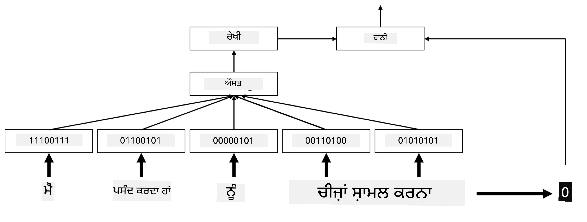
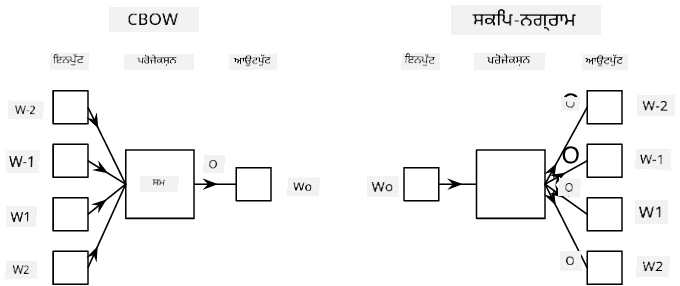

# ਐਮਬੈਡਿੰਗਸ

## [ਪ੍ਰੀ-ਲੈਕਚਰ ਕਵਿਜ਼](https://ff-quizzes.netlify.app/en/ai/quiz/27)

ਜਦੋਂ BoW ਜਾਂ TF/IDF ਅਧਾਰਿਤ ਕਲਾਸੀਫਾਇਰਾਂ ਨੂੰ ਟ੍ਰੇਨ ਕੀਤਾ ਜਾਂਦਾ ਹੈ, ਅਸੀਂ `vocab_size` ਦੀ ਲੰਬਾਈ ਵਾਲੇ ਉੱਚ-ਡਾਈਮੇਨਸ਼ਨਲ ਬੈਗ-ਆਫ-ਵਰਡਸ ਵੇਕਟਰਾਂ 'ਤੇ ਕੰਮ ਕਰਦੇ ਹਾਂ, ਅਤੇ ਅਸੀਂ ਨੀਵੀਂ-ਡਾਈਮੇਨਸ਼ਨਲ ਪੋਜ਼ੀਸ਼ਨਲ ਪ੍ਰਤੀਨਿਧੀ ਵੇਕਟਰਾਂ ਨੂੰ sparse one-hot ਪ੍ਰਤੀਨਿਧੀ ਵਿੱਚ ਸਪਸ਼ਟ ਤੌਰ 'ਤੇ ਬਦਲ ਰਹੇ ਹੁੰਦੇ ਹਾਂ। ਹਾਲਾਂਕਿ, ਇਹ one-hot ਪ੍ਰਤੀਨਿਧੀ ਮੈਮਰੀ-ਅਸਰਦਾਰ ਨਹੀਂ ਹੈ। ਇਸ ਤੋਂ ਇਲਾਵਾ, ਹਰ ਸ਼ਬਦ ਨੂੰ ਇੱਕ-ਦੂਜੇ ਤੋਂ ਅਜ਼ਾਦ ਤੌਰ 'ਤੇ ਟ੍ਰੀਟ ਕੀਤਾ ਜਾਂਦਾ ਹੈ, ਜ਼ਿਆਦਾਤਰ ਇੱਕ-ਹਾਟ ਕੋਡ ਕੀਤੇ ਵੇਕਟਰ ਸ਼ਬਦਾਂ ਦੇ semantic ਸਮਾਨਤਾ ਨੂੰ ਪ੍ਰਗਟ ਨਹੀਂ ਕਰਦੇ।

**ਐਮਬੈਡਿੰਗ** ਦਾ ਵਿਚਾਰ ਇਹ ਹੈ ਕਿ ਸ਼ਬਦਾਂ ਨੂੰ ਘੱਟ-ਡਾਈਮੇਨਸ਼ਨਲ ਡੈਂਸ ਵੇਕਟਰਾਂ ਦੁਆਰਾ ਪ੍ਰਤੀਨਿਧੀ ਕੀਤਾ ਜਾਵੇ, ਜੋ ਕਿਸੇ ਤਰ੍ਹਾਂ ਸ਼ਬਦ ਦੇ semantic ਅਰਥ ਨੂੰ ਦਰਸਾਉਂਦੇ ਹਨ। ਅਸੀਂ ਬਾਅਦ ਵਿੱਚ ਚਰਚਾ ਕਰਾਂਗੇ ਕਿ ਅਰਥਪੂਰਨ ਸ਼ਬਦ ਐਮਬੈਡਿੰਗਸ ਕਿਵੇਂ ਬਣਾਈਆਂ ਜਾਣ, ਪਰ ਇਸ ਸਮੇਂ ਲਈ, ਚਲੋ ਐਮਬੈਡਿੰਗਸ ਨੂੰ ਸ਼ਬਦ ਵੇਕਟਰ ਦੀ ਡਾਈਮੇਨਸ਼ਨਲਿਟੀ ਨੂੰ ਘਟਾਉਣ ਦੇ ਤਰੀਕੇ ਵਜੋਂ ਸੋਚੀਏ।

ਇਸ ਤਰ੍ਹਾਂ, ਐਮਬੈਡਿੰਗ ਲੇਅਰ ਇੱਕ ਸ਼ਬਦ ਨੂੰ ਇਨਪੁਟ ਵਜੋਂ ਲਵੇਗੀ ਅਤੇ ਨਿਰਧਾਰਤ `embedding_size` ਦਾ ਆਉਟਪੁੱਟ ਵੇਕਟਰ ਪੈਦਾ ਕਰੇਗੀ। ਇੱਕ ਅਰਥ ਵਿੱਚ, ਇਹ `Linear` ਲੇਅਰ ਦੇ ਬਹੁਤ ਹੀ ਸਮਾਨ ਹੈ, ਪਰ ਇੱਕ-ਹਾਟ ਕੋਡ ਕੀਤੇ ਵੇਕਟਰ ਨੂੰ ਲੈਣ ਦੀ ਬਜਾਏ, ਇਹ ਇੱਕ ਸ਼ਬਦ ਨੰਬਰ ਨੂੰ ਇਨਪੁਟ ਵਜੋਂ ਲੈਣ ਦੇ ਯੋਗ ਹੋਵੇਗੀ, ਜਿਸ ਨਾਲ ਸਾਨੂੰ ਵੱਡੇ ਇੱਕ-ਹਾਟ-ਕੋਡ ਕੀਤੇ ਵੇਕਟਰ ਬਣਾਉਣ ਤੋਂ ਬਚਣ ਦੀ ਆਗਿਆ ਮਿਲੇਗੀ।

ਐਮਬੈਡਿੰਗ ਲੇਅਰ ਨੂੰ ਸਾਡੇ ਕਲਾਸੀਫਾਇਰ ਨੈਟਵਰਕ ਵਿੱਚ ਪਹਿਲੇ ਲੇਅਰ ਵਜੋਂ ਵਰਤ ਕੇ, ਅਸੀਂ ਬੈਗ-ਆਫ-ਵਰਡਸ ਤੋਂ **embedding bag** ਮਾਡਲ ਵਿੱਚ ਸਵਿੱਚ ਕਰ ਸਕਦੇ ਹਾਂ, ਜਿੱਥੇ ਅਸੀਂ ਪਹਿਲਾਂ ਆਪਣੇ ਟੈਕਸਟ ਵਿੱਚ ਹਰ ਸ਼ਬਦ ਨੂੰ ਸੰਬੰਧਿਤ ਐਮਬੈਡਿੰਗ ਵਿੱਚ ਬਦਲਦੇ ਹਾਂ, ਅਤੇ ਫਿਰ ਸਾਰੇ ਐਮਬੈਡਿੰਗਸ 'ਤੇ ਕੁਝ ਸਮੁੱਚੇ ਫੰਕਸ਼ਨ ਦੀ ਗਣਨਾ ਕਰਦੇ ਹਾਂ, ਜਿਵੇਂ ਕਿ `sum`, `average` ਜਾਂ `max`।  

> ਲੇਖਕ ਦੁਆਰਾ ਚਿੱਤਰ

## ✍️ ਅਭਿਆਸ: ਐਮਬੈਡਿੰਗਸ

ਹੇਠਾਂ ਦਿੱਤੇ ਨੋਟਬੁੱਕਸ ਵਿੱਚ ਆਪਣੀ ਸਿੱਖਿਆ ਜਾਰੀ ਰੱਖੋ:
* [PyTorch ਨਾਲ ਐਮਬੈਡਿੰਗਸ](EmbeddingsPyTorch.ipynb)
* [TensorFlow ਨਾਲ ਐਮਬੈਡਿੰਗਸ](EmbeddingsTF.ipynb)

## Semantic Embeddings: Word2Vec

ਹਾਲਾਂਕਿ ਐਮਬੈਡਿੰਗ ਲੇਅਰ ਨੇ ਸ਼ਬਦਾਂ ਨੂੰ ਵੇਕਟਰ ਪ੍ਰਤੀਨਿਧੀ ਵਿੱਚ ਮੈਪ ਕਰਨਾ ਸਿੱਖਿਆ, ਪਰ ਇਹ ਪ੍ਰਤੀਨਿਧੀ ਲਾਜ਼ਮੀ ਤੌਰ 'ਤੇ semantic ਅਰਥ ਨਹੀਂ ਰੱਖਦੀ। ਇਹ ਚੰਗਾ ਹੋਵੇਗਾ ਕਿ ਇੱਕ ਵੇਕਟਰ ਪ੍ਰਤੀਨਿਧੀ ਸਿੱਖੀ ਜਾਵੇ ਜਿਸ ਵਿੱਚ ਸਮਾਨ ਸ਼ਬਦ ਜਾਂ synonyms ਉਹਨਾਂ ਵੇਕਟਰਾਂ ਦੇ ਨੇੜੇ ਹੋਣ ਜੋ ਕਿਸੇ ਵੇਕਟਰ ਦੂਰੀ (ਜਿਵੇਂ ਕਿ Euclidean ਦੂਰੀ) ਦੇ ਅਰਥ ਵਿੱਚ ਨੇੜੇ ਹਨ।

ਇਸ ਨੂੰ ਕਰਨ ਲਈ, ਸਾਨੂੰ ਆਪਣੇ ਐਮਬੈਡਿੰਗ ਮਾਡਲ ਨੂੰ ਇੱਕ ਵੱਡੇ ਟੈਕਸਟ ਕਲੈਕਸ਼ਨ 'ਤੇ ਇੱਕ ਵਿਸ਼ੇਸ਼ ਤਰੀਕੇ ਨਾਲ ਪ੍ਰੀ-ਟ੍ਰੇਨ ਕਰਨ ਦੀ ਲੋੜ ਹੈ। semantic ਐਮਬੈਡਿੰਗਸ ਨੂੰ ਟ੍ਰੇਨ ਕਰਨ ਦਾ ਇੱਕ ਤਰੀਕਾ [Word2Vec](https://en.wikipedia.org/wiki/Word2vec) ਕਿਹਾ ਜਾਂਦਾ ਹੈ। ਇਹ ਦੋ ਮੁੱਖ ਆਰਕੀਟੈਕਚਰਾਂ 'ਤੇ ਅਧਾਰਿਤ ਹੈ ਜੋ ਸ਼ਬਦਾਂ ਦੀ ਵਿਤਰਿਤ ਪ੍ਰਤੀਨਿਧੀ ਪੈਦਾ ਕਰਨ ਲਈ ਵਰਤੇ ਜਾਂਦੇ ਹਨ:

 - **ਕੰਟਿਨਿਊਅਸ ਬੈਗ-ਆਫ-ਵਰਡਸ** (CBoW) — ਇਸ ਆਰਕੀਟੈਕਚਰ ਵਿੱਚ, ਅਸੀਂ ਮਾਡਲ ਨੂੰ ਆਸ-ਪਾਸ ਦੇ ਸੰਦਰਭ ਤੋਂ ਇੱਕ ਸ਼ਬਦ ਦੀ ਭਵਿੱਖਵਾਣੀ ਕਰਨ ਲਈ ਟ੍ਰੇਨ ਕਰਦੇ ਹਾਂ। ਦਿੱਤੇ ਗਏ ngram $(W_{-2},W_{-1},W_0,W_1,W_2)$, ਮਾਡਲ ਦਾ ਉਦੇਸ਼ $(W_{-2},W_{-1},W_1,W_2)$ ਤੋਂ $W_0$ ਦੀ ਭਵਿੱਖਵਾਣੀ ਕਰਨਾ ਹੈ।
 - **ਕੰਟਿਨਿਊਅਸ ਸਕਿਪ-ਗ੍ਰਾਮ** CBoW ਦੇ ਉਲਟ ਹੈ। ਮਾਡਲ ਸੰਦਰਭ ਸ਼ਬਦਾਂ ਦੀ ਆਸ-ਪਾਸ ਦੀ ਵਿੰਡੋ ਨੂੰ ਵਰਤਦਾ ਹੈ ਤਾਂ ਜੋ ਮੌਜੂਦਾ ਸ਼ਬਦ ਦੀ ਭਵਿੱਖਵਾਣੀ ਕੀਤੀ ਜਾ ਸਕੇ।

CBoW ਤੇਜ਼ ਹੈ, ਜਦਕਿ ਸਕਿਪ-ਗ੍ਰਾਮ ਹੌਲੀ ਹੈ, ਪਰ ਅਲਭ ਸ਼ਬਦਾਂ ਦੀ ਪ੍ਰਤੀਨਿਧੀ ਕਰਨ ਵਿੱਚ ਵਧੀਆ ਕੰਮ ਕਰਦਾ ਹੈ।

> [ਇਸ ਪੇਪਰ](https://arxiv.org/pdf/1301.3781.pdf) ਤੋਂ ਚਿੱਤਰ

Word2Vec ਪ੍ਰੀ-ਟ੍ਰੇਨ ਕੀਤੇ ਐਮਬੈਡਿੰਗਸ (ਜਿਵੇਂ ਕਿ ਹੋਰ ਸਮਾਨ ਮਾਡਲ, ਜਿਵੇਂ GloVe) ਨੂੰ ਨਿਊਰਲ ਨੈਟਵਰਕਸ ਵਿੱਚ ਐਮਬੈਡਿੰਗ ਲੇਅਰ ਦੀ ਜਗ੍ਹਾ ਵੀ ਵਰਤਿਆ ਜਾ ਸਕਦਾ ਹੈ। ਹਾਲਾਂਕਿ, ਸਾਨੂੰ ਸ਼ਬਦਾਵਲੀ ਨਾਲ ਨਿਪਟਣਾ ਪਵੇਗਾ, ਕਿਉਂਕਿ Word2Vec/GloVe ਨੂੰ ਪ੍ਰੀ-ਟ੍ਰੇਨ ਕਰਨ ਲਈ ਵਰਤੀ ਗਈ ਸ਼ਬਦਾਵਲੀ ਸਾਡੇ ਟੈਕਸਟ ਕੌਰਪਸ ਵਿੱਚ ਸ਼ਬਦਾਵਲੀ ਤੋਂ ਵੱਖਰੀ ਹੋਣ ਦੀ ਸੰਭਾਵਨਾ ਹੈ। ਉਪਰੋਕਤ ਨੋਟਬੁੱਕਸ ਵਿੱਚ ਦੇਖੋ ਕਿ ਇਸ ਸਮੱਸਿਆ ਨੂੰ ਕਿਵੇਂ ਹੱਲ ਕੀਤਾ ਜਾ ਸਕਦਾ ਹੈ।

## Contextual Embeddings

ਪ੍ਰੰਪਰਾਗਤ ਪ੍ਰੀ-ਟ੍ਰੇਨ ਕੀਤੇ ਐਮਬੈਡਿੰਗ ਪ੍ਰਤੀਨਿਧੀਆਂ ਜਿਵੇਂ Word2Vec ਦੀ ਇੱਕ ਮੁੱਖ ਸੀਮਾ ਸ਼ਬਦ ਅਰਥ ਵਿਸ਼ੇਸ਼ਤਾ ਦੀ ਸਮੱਸਿਆ ਹੈ। ਜਦਕਿ ਪ੍ਰੀ-ਟ੍ਰੇਨ ਕੀਤੇ ਐਮਬੈਡਿੰਗਸ ਸੰਦਰਭ ਵਿੱਚ ਸ਼ਬਦਾਂ ਦੇ ਕੁਝ ਅਰਥ ਨੂੰ ਕੈਪਚਰ ਕਰ ਸਕਦੇ ਹਨ, ਇੱਕ ਸ਼ਬਦ ਦਾ ਹਰ ਸੰਭਾਵਿਤ ਅਰਥ ਇੱਕੋ ਐਮਬੈਡਿੰਗ ਵਿੱਚ ਕੋਡ ਕੀਤਾ ਜਾਂਦਾ ਹੈ। ਇਹ ਡਾਊਨਸਟ੍ਰੀਮ ਮਾਡਲਾਂ ਵਿੱਚ ਸਮੱਸਿਆ ਪੈਦਾ ਕਰ ਸਕਦਾ ਹੈ, ਕਿਉਂਕਿ ਬਹੁਤ ਸਾਰੇ ਸ਼ਬਦ ਜਿਵੇਂ 'play' ਸ਼ਬਦ ਦੇ ਵੱਖ-ਵੱਖ ਸੰਦਰਭਾਂ ਵਿੱਚ ਵੱਖ-ਵੱਖ ਅਰਥ ਹੁੰਦੇ ਹਨ।

ਉਦਾਹਰਨ ਲਈ, 'play' ਸ਼ਬਦ ਹੇਠਾਂ ਦਿੱਤੇ ਦੋ ਵੱਖ-ਵੱਖ ਵਾਕਾਂ ਵਿੱਚ ਬਹੁਤ ਵੱਖ-ਵੱਖ ਅਰਥ ਰੱਖਦਾ ਹੈ:

- ਮੈਂ ਥੀਏਟਰ ਵਿੱਚ ਇੱਕ **play** ਦੇਖਣ ਗਿਆ।
- ਜੌਨ ਆਪਣੇ ਦੋਸਤਾਂ ਨਾਲ **play** ਕਰਨਾ ਚਾਹੁੰਦਾ ਹੈ।

ਉਪਰੋਕਤ ਪ੍ਰੀ-ਟ੍ਰੇਨ ਕੀਤੇ ਐਮਬੈਡਿੰਗਸ 'play' ਸ਼ਬਦ ਦੇ ਦੋਵੇਂ ਅਰਥਾਂ ਨੂੰ ਇੱਕੋ ਐਮਬੈਡਿੰਗ ਵਿੱਚ ਪ੍ਰਤੀਨਿਧੀ ਕਰਦੇ ਹਨ। ਇਸ ਸੀਮਾ ਨੂੰ ਦੂਰ ਕਰਨ ਲਈ, ਸਾਨੂੰ **ਭਾਸ਼ਾ ਮਾਡਲ** ਦੇ ਅਧਾਰ 'ਤੇ ਐਮਬੈਡਿੰਗਸ ਬਣਾਉਣ ਦੀ ਲੋੜ ਹੈ, ਜੋ ਇੱਕ ਵੱਡੇ ਟੈਕਸਟ ਕੌਰਪਸ 'ਤੇ ਟ੍ਰੇਨ ਕੀਤਾ ਜਾਂਦਾ ਹੈ, ਅਤੇ *ਜਾਣਦਾ ਹੈ* ਕਿ ਸ਼ਬਦ ਵੱਖ-ਵੱਖ ਸੰਦਰਭਾਂ ਵਿੱਚ ਕਿਵੇਂ ਇਕੱਠੇ ਕੀਤੇ ਜਾ ਸਕਦੇ ਹਨ। Contextual embeddings ਦੀ ਚਰਚਾ ਇਸ ਟਿਊਟੋਰਿਅਲ ਦੇ ਦਾਇਰੇ ਤੋਂ ਬਾਹਰ ਹੈ, ਪਰ ਅਸੀਂ ਇਸ 'ਤੇ ਵਾਪਸ ਆਵਾਂਗੇ ਜਦੋਂ ਅਸੀਂ ਕੋਰਸ ਵਿੱਚ ਬਾਅਦ ਵਿੱਚ ਭਾਸ਼ਾ ਮਾਡਲਾਂ ਬਾਰੇ ਗੱਲ ਕਰਾਂਗੇ।

## ਨਤੀਜਾ

ਇਸ ਪਾਠ ਵਿੱਚ, ਤੁਸੀਂ TensorFlow ਅਤੇ Pytorch ਵਿੱਚ semantic ਅਰਥਾਂ ਨੂੰ ਬਿਹਤਰ ਤੌਰ 'ਤੇ ਦਰਸਾਉਣ ਲਈ ਐਮਬੈਡਿੰਗ ਲੇਅਰ ਬਣਾਉਣ ਅਤੇ ਵਰਤਣ ਦਾ ਪਤਾ ਲਗਾਇਆ।

## 🚀 ਚੁਣੌਤੀ

Word2Vec ਨੂੰ ਕੁਝ ਦਿਲਚਸਪ ਐਪਲੀਕੇਸ਼ਨਾਂ ਲਈ ਵਰਤਿਆ ਗਿਆ ਹੈ, ਜਿਵੇਂ ਕਿ ਗੀਤਾਂ ਦੇ ਬੋਲ ਅਤੇ ਕਵਿਤਾ ਬਣਾਉਣਾ। [ਇਸ ਲੇਖ](https://www.politetype.com/blog/word2vec-color-poems) ਨੂੰ ਵੇਖੋ ਜੋ ਦਿਖਾਉਂਦਾ ਹੈ ਕਿ ਲੇਖਕ ਨੇ Word2Vec ਨੂੰ ਵਰਤ ਕੇ ਕਵਿਤਾ ਕਿਵੇਂ ਬਣਾਈ। [Dan Shiffmann ਦੁਆਰਾ ਇਹ ਵੀਡੀਓ](https://www.youtube.com/watch?v=LSS_bos_TPI&ab_channel=TheCodingTrain) ਵੀ ਦੇਖੋ ਤਾਂ ਜੋ ਇਸ ਤਕਨੀਕ ਦੀ ਵੱਖ-ਵੱਖ ਵਿਆਖਿਆ ਦੀ ਖੋਜ ਕੀਤੀ ਜਾ ਸਕੇ। ਫਿਰ ਇਸ ਤਕਨੀਕ ਨੂੰ ਆਪਣੇ ਟੈਕਸਟ ਕੌਰਪਸ 'ਤੇ ਲਾਗੂ ਕਰਨ ਦੀ ਕੋਸ਼ਿਸ਼ ਕਰੋ, ਸ਼ਾਇਦ Kaggle ਤੋਂ ਪ੍ਰਾਪਤ ਕੀਤਾ ਗਿਆ।

## [ਪੋਸਟ-ਲੈਕਚਰ ਕਵਿਜ਼](https://ff-quizzes.netlify.app/en/ai/quiz/28)

## ਸਮੀਖਿਆ ਅਤੇ ਸਵੈ ਅਧਿਐਨ

Word2Vec 'ਤੇ ਇਸ ਪੇਪਰ ਨੂੰ ਪੜ੍ਹੋ: [Efficient Estimation of Word Representations in Vector Space](https://arxiv.org/pdf/1301.3781.pdf)

## [ਅਸਾਈਨਮੈਂਟ: ਨੋਟਬੁੱਕਸ](assignment.md)

---

