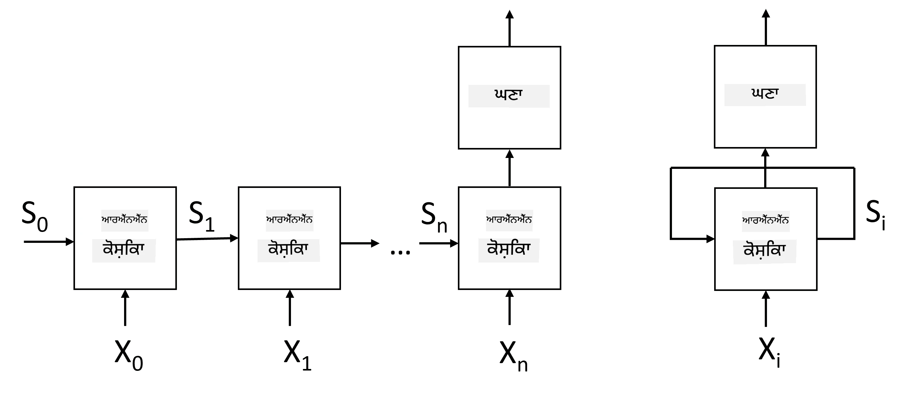
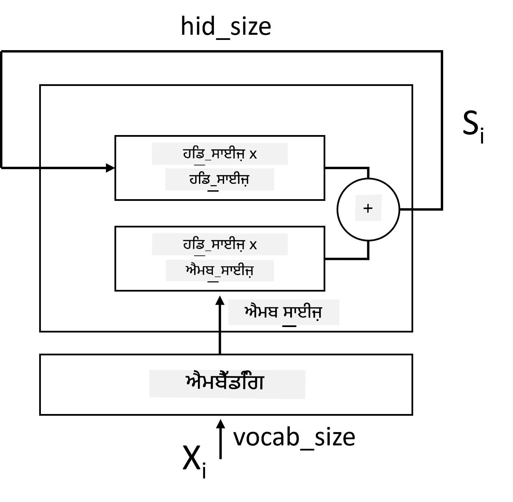
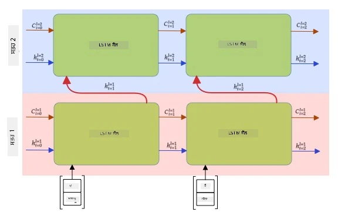

# ਰਿਕਰੰਟ ਨਿਊਰਲ ਨੈਟਵਰਕਸ

## [ਪ੍ਰੀ-ਲੈਕਚਰ ਕਵਿਜ਼](https://ff-quizzes.netlify.app/en/ai/quiz/31)

ਪਿਛਲੇ ਹਿੱਸਿਆਂ ਵਿੱਚ, ਅਸੀਂ ਟੈਕਸਟ ਦੇ ਸਮਰੱਥ ਸੈਮਾਂਟਿਕ ਪ੍ਰਤੀਨਿਧੀਆਂ ਅਤੇ ਐਮਬੈਡਿੰਗ ਦੇ ਉੱਪਰ ਇੱਕ ਸਧਾਰਨ ਲੀਨੀਅਰ ਕਲਾਸੀਫਾਇਰ ਦੀ ਵਰਤੋਂ ਕਰ ਰਹੇ ਸਾਂ। ਇਹ ਆਰਕੀਟੈਕਚਰ ਵਾਕਾਂਸ਼ ਵਿੱਚ ਸ਼ਬਦਾਂ ਦੇ ਸਮੁੱਚਿਤ ਅਰਥ ਨੂੰ ਕੈਪਚਰ ਕਰਦਾ ਹੈ, ਪਰ ਇਹ ਸ਼ਬਦਾਂ ਦੇ **ਕ੍ਰਮ** ਨੂੰ ਧਿਆਨ ਵਿੱਚ ਨਹੀਂ ਰੱਖਦਾ, ਕਿਉਂਕਿ ਐਮਬੈਡਿੰਗ ਦੇ ਉੱਪਰ ਕੀਤੀ ਗਈ ਐਗਰੀਗੇਸ਼ਨ ਕਾਰਵਾਈ ਨੇ ਮੂਲ ਟੈਕਸਟ ਤੋਂ ਇਹ ਜਾਣਕਾਰੀ ਹਟਾ ਦਿੱਤੀ। ਕਿਉਂਕਿ ਇਹ ਮਾਡਲ ਸ਼ਬਦਾਂ ਦੇ ਕ੍ਰਮ ਨੂੰ ਮਾਡਲ ਕਰਨ ਵਿੱਚ ਅਸਮਰੱਥ ਹਨ, ਇਹ ਪੇਚੀਦਾ ਜਾਂ ਅਸਪਸ਼ਟ ਕੰਮਾਂ ਨੂੰ ਹੱਲ ਨਹੀਂ ਕਰ ਸਕਦੇ ਜਿਵੇਂ ਕਿ ਟੈਕਸਟ ਜਨਰੇਸ਼ਨ ਜਾਂ ਪ੍ਰਸ਼ਨ ਉੱਤਰ।

ਟੈਕਸਟ ਕ੍ਰਮ ਦੇ ਅਰਥ ਨੂੰ ਕੈਪਚਰ ਕਰਨ ਲਈ, ਸਾਨੂੰ ਇੱਕ ਹੋਰ ਨਿਊਰਲ ਨੈਟਵਰਕ ਆਰਕੀਟੈਕਚਰ ਦੀ ਵਰਤੋਂ ਕਰਨ ਦੀ ਲੋੜ ਹੈ, ਜਿਸਨੂੰ **ਰਿਕਰੰਟ ਨਿਊਰਲ ਨੈਟਵਰਕ** ਜਾਂ RNN ਕਿਹਾ ਜਾਂਦਾ ਹੈ। RNN ਵਿੱਚ, ਅਸੀਂ ਆਪਣੇ ਵਾਕਾਂਸ਼ ਨੂੰ ਨੈਟਵਰਕ ਵਿੱਚ ਇੱਕ ਸਮੇਂ ਵਿੱਚ ਇੱਕ ਚਿੰਨ੍ਹ ਦੇ ਰਾਹੀਂ ਪਾਸ ਕਰਦੇ ਹਾਂ, ਅਤੇ ਨੈਟਵਰਕ ਕੁਝ **ਸਟੇਟ** ਪੈਦਾ ਕਰਦਾ ਹੈ, ਜਿਸਨੂੰ ਅਗਲੇ ਚਿੰਨ੍ਹ ਦੇ ਨਾਲ ਮੁੜ ਨੈਟਵਰਕ ਵਿੱਚ ਪਾਸ ਕੀਤਾ ਜਾਂਦਾ ਹੈ।

> ਲੇਖਕ ਦੁਆਰਾ ਚਿੱਤਰ

ਦਿੱਤੇ ਗਏ ਟੋਕਨ X0,...,Xn ਦੇ ਇਨਪੁਟ ਕ੍ਰਮ ਦੇ ਅਧਾਰ 'ਤੇ, RNN ਨਿਊਰਲ ਨੈਟਵਰਕ ਬਲਾਕਾਂ ਦੀ ਇੱਕ ਲੜੀ ਬਣਾਉਂਦਾ ਹੈ ਅਤੇ ਇਸ ਲੜੀ ਨੂੰ ਬੈਕਪ੍ਰੋਪਾਗੇਸ਼ਨ ਦੀ ਵਰਤੋਂ ਕਰਕੇ ਐਂਡ-ਟੂ-ਐਂਡ ਟ੍ਰੇਨ ਕਰਦਾ ਹੈ। ਹਰ ਨੈਟਵਰਕ ਬਲਾਕ (Xi,Si) ਦੀ ਜੋੜੀ ਨੂੰ ਇਨਪੁਟ ਵਜੋਂ ਲੈਂਦਾ ਹੈ ਅਤੇ ਨਤੀਜੇ ਵਜੋਂ Si+1 ਪੈਦਾ ਕਰਦਾ ਹੈ। ਅੰਤਮ ਸਟੇਟ Sn ਜਾਂ (ਆਉਟਪੁਟ Yn) ਨੂੰ ਨਤੀਜਾ ਪੈਦਾ ਕਰਨ ਲਈ ਲੀਨੀਅਰ ਕਲਾਸੀਫਾਇਰ ਵਿੱਚ ਪਾਸ ਕੀਤਾ ਜਾਂਦਾ ਹੈ। ਸਾਰੇ ਨੈਟਵਰਕ ਬਲਾਕ ਇੱਕੋ ਜਿਹੇ ਵਜ਼ਨ ਸਾਂਝੇ ਕਰਦੇ ਹਨ ਅਤੇ ਇੱਕ ਬੈਕਪ੍ਰੋਪਾਗੇਸ਼ਨ ਪਾਸ ਦੀ ਵਰਤੋਂ ਕਰਕੇ ਐਂਡ-ਟੂ-ਐਂਡ ਟ੍ਰੇਨ ਕੀਤੇ ਜਾਂਦੇ ਹਨ।

ਕਿਉਂਕਿ ਸਟੇਟ ਵੈਕਟਰ S0,...,Sn ਨੈਟਵਰਕ ਵਿੱਚ ਪਾਸ ਕੀਤੇ ਜਾਂਦੇ ਹਨ, ਇਹ ਸ਼ਬਦਾਂ ਦੇ ਲੜੀਵਾਰ ਨਾਤਿਆਂ ਨੂੰ ਸਿੱਖਣ ਦੇ ਯੋਗ ਹੁੰਦਾ ਹੈ। ਉਦਾਹਰਣ ਲਈ, ਜਦੋਂ ਸ਼ਬਦ *not* ਕ੍ਰਮ ਵਿੱਚ ਕਿਤੇ ਵੀ ਆਉਂਦਾ ਹੈ, ਇਹ ਸਟੇਟ ਵੈਕਟਰ ਦੇ ਕੁਝ ਤੱਤਾਂ ਨੂੰ ਨਕਾਰਤਮਕ ਕਰਨ ਲਈ ਸਿੱਖ ਸਕਦਾ ਹੈ, ਜਿਸਦਾ ਨਤੀਜਾ ਨਕਾਰਾਤਮਕਤਾ ਹੁੰਦਾ ਹੈ।

> ✅ ਕਿਉਂਕਿ ਉੱਪਰ ਦਿੱਤੇ RNN ਬਲਾਕਾਂ ਦੇ ਵਜ਼ਨ ਸਾਂਝੇ ਹਨ, ਇੱਕੋ ਹੀ ਚਿੱਤਰ ਨੂੰ ਇੱਕ ਬਲਾਕ (ਸੱਜੇ ਪਾਸੇ) ਵਜੋਂ ਦਰਸਾਇਆ ਜਾ ਸਕਦਾ ਹੈ ਜਿਸ ਵਿੱਚ ਇੱਕ ਰਿਕਰੰਟ ਫੀਡਬੈਕ ਲੂਪ ਹੁੰਦਾ ਹੈ, ਜੋ ਨੈਟਵਰਕ ਦੇ ਆਉਟਪੁਟ ਸਟੇਟ ਨੂੰ ਮੁੜ ਇਨਪੁਟ ਵਿੱਚ ਪਾਸ ਕਰਦਾ ਹੈ।

## RNN ਸੈਲ ਦੀ ਬਣਤਰ

ਆਓ ਵੇਖੀਏ ਕਿ ਇੱਕ ਸਧਾਰਨ RNN ਸੈਲ ਕਿਵੇਂ ਸੰਗਠਿਤ ਹੈ। ਇਹ ਪਿਛਲੇ ਸਟੇਟ Si-1 ਅਤੇ ਮੌਜੂਦਾ ਚਿੰਨ੍ਹ Xi ਨੂੰ ਇਨਪੁਟ ਵਜੋਂ ਸਵੀਕਾਰ ਕਰਦਾ ਹੈ ਅਤੇ ਆਉਟਪੁਟ ਸਟੇਟ Si ਪੈਦਾ ਕਰਦਾ ਹੈ (ਅਤੇ, ਕਈ ਵਾਰ, ਅਸੀਂ ਕੁਝ ਹੋਰ ਆਉਟਪੁਟ Yi ਵਿੱਚ ਵੀ ਦਿਲਚਸਪੀ ਰੱਖਦੇ ਹਾਂ, ਜਿਵੇਂ ਕਿ ਜਨਰੇਟਿਵ ਨੈਟਵਰਕਸ ਦੇ ਮਾਮਲੇ ਵਿੱਚ)।

ਇੱਕ ਸਧਾਰਨ RNN ਸੈਲ ਵਿੱਚ ਦੋ ਵਜ਼ਨ ਮੈਟ੍ਰਿਕਸ ਹੁੰਦੀਆਂ ਹਨ: ਇੱਕ ਇਨਪੁਟ ਚਿੰਨ੍ਹ ਨੂੰ ਰੂਪਾਂਤਰਿਤ ਕਰਦਾ ਹੈ (ਇਸਨੂੰ W ਕਹੀਏ), ਅਤੇ ਦੂਜਾ ਇਨਪੁਟ ਸਟੇਟ ਨੂੰ ਰੂਪਾਂਤਰਿਤ ਕਰਦਾ ਹੈ (H)। ਇਸ ਮਾਮਲੇ ਵਿੱਚ ਨੈਟਵਰਕ ਦਾ ਆਉਟਪੁਟ &sigma;(W&times;Xi+H&times;Si-1+b) ਵਜੋਂ ਗਣਨਾ ਕੀਤਾ ਜਾਂਦਾ ਹੈ, ਜਿੱਥੇ &sigma; ਐਕਟੀਵੇਸ਼ਨ ਫੰਕਸ਼ਨ ਹੈ ਅਤੇ b ਵਾਧੂ ਬਾਇਸ ਹੈ।

> ਲੇਖਕ ਦੁਆਰਾ ਚਿੱਤਰ

ਕਈ ਮਾਮਲਿਆਂ ਵਿੱਚ, ਇਨਪੁਟ ਟੋਕਨ RNN ਵਿੱਚ ਦਾਖਲ ਹੋਣ ਤੋਂ ਪਹਿਲਾਂ ਐਮਬੈਡਿੰਗ ਲੇਅਰ ਵਿੱਚ ਪਾਸ ਕੀਤੇ ਜਾਂਦੇ ਹਨ ਤਾਂ ਜੋ ਡਾਇਮੈਂਸ਼ਨਲਿਟੀ ਘਟਾਈ ਜਾ ਸਕੇ। ਇਸ ਮਾਮਲੇ ਵਿੱਚ, ਜੇ ਇਨਪੁਟ ਵੈਕਟਰ ਦਾ ਡਾਇਮੈਂਸ਼ਨ *emb_size* ਹੈ, ਅਤੇ ਸਟੇਟ ਵੈਕਟਰ *hid_size* ਹੈ - ਤਾਂ W ਦਾ ਆਕਾਰ *emb_size*&times;*hid_size* ਹੈ, ਅਤੇ H ਦਾ ਆਕਾਰ *hid_size*&times;*hid_size* ਹੈ।

## ਲਾਂਗ ਸ਼ਾਰਟ ਟਰਮ ਮੈਮੋਰੀ (LSTM)

ਕਲਾਸਿਕ RNNs ਦੀ ਇੱਕ ਮੁੱਖ ਸਮੱਸਿਆ **ਵੈਨਿਸ਼ਿੰਗ ਗ੍ਰੇਡੀਐਂਟਸ** ਦੀ ਸਮੱਸਿਆ ਹੈ। ਕਿਉਂਕਿ RNNs ਨੂੰ ਇੱਕ ਬੈਕਪ੍ਰੋਪਾਗੇਸ਼ਨ ਪਾਸ ਵਿੱਚ ਐਂਡ-ਟੂ-ਐਂਡ ਟ੍ਰੇਨ ਕੀਤਾ ਜਾਂਦਾ ਹੈ, ਇਹ ਨੈਟਵਰਕ ਦੇ ਪਹਿਲੇ ਲੇਅਰਾਂ ਵਿੱਚ ਗਲਤੀ ਨੂੰ ਪ੍ਰਚਾਰਿਤ ਕਰਨ ਵਿੱਚ ਮੁਸ਼ਕਲ ਹੁੰਦੀ ਹੈ, ਅਤੇ ਇਸ ਲਈ ਨੈਟਵਰਕ ਦੂਰਲੇ ਟੋਕਨ ਦੇ ਰਿਸ਼ਤਿਆਂ ਨੂੰ ਸਿੱਖ ਨਹੀਂ ਸਕਦਾ। ਇਸ ਸਮੱਸਿਆ ਤੋਂ ਬਚਣ ਦੇ ਤਰੀਕਿਆਂ ਵਿੱਚੋਂ ਇੱਕ **ਗੇਟਸ** ਦੀ ਵਰਤੋਂ ਕਰਕੇ **ਸਪਸ਼ਟ ਸਟੇਟ ਮੈਨੇਜਮੈਂਟ** ਪੇਸ਼ ਕਰਨਾ ਹੈ। ਇਸ ਕਿਸਮ ਦੀਆਂ ਦੋ ਪ੍ਰਸਿੱਧ ਆਰਕੀਟੈਕਚਰ ਹਨ: **ਲਾਂਗ ਸ਼ਾਰਟ ਟਰਮ ਮੈਮੋਰੀ** (LSTM) ਅਤੇ **ਗੇਟਡ ਰੀਲੇਅ ਯੂਨਿਟ** (GRU)।

> ਚਿੱਤਰ ਸਰੋਤ TBD

LSTM ਨੈਟਵਰਕ RNN ਦੇ ਸਮਾਨ ਸੰਗਠਿਤ ਹੈ, ਪਰ ਦੋ ਸਟੇਟ ਹਨ ਜੋ ਲੇਅਰ ਤੋਂ ਲੇਅਰ ਵਿੱਚ ਪਾਸ ਕੀਤੇ ਜਾਂਦੇ ਹਨ: ਅਸਲ ਸਟੇਟ C, ਅਤੇ ਲੁਕਿਆ ਹੋਇਆ ਵੈਕਟਰ H। ਹਰ ਯੂਨਿਟ ਵਿੱਚ, ਲੁਕਿਆ ਹੋਇਆ ਵੈਕਟਰ Hi ਇਨਪੁਟ Xi ਨਾਲ ਜੋੜਿਆ ਜਾਂਦਾ ਹੈ, ਅਤੇ ਇਹ **ਗੇਟਸ** ਦੇ ਜ਼ਰੀਏ ਸਟੇਟ C ਵਿੱਚ ਕੀ ਹੁੰਦਾ ਹੈ ਇਸਨੂੰ ਨਿਯੰਤਰਿਤ ਕਰਦੇ ਹਨ। ਹਰ ਗੇਟ ਇੱਕ ਨਿਊਰਲ ਨੈਟਵਰਕ ਹੁੰਦਾ ਹੈ ਜਿਸ ਵਿੱਚ ਸਿਗਮਾਇਡ ਐਕਟੀਵੇਸ਼ਨ ਹੁੰਦੀ ਹੈ (ਆਉਟਪੁਟ [0,1] ਦੀ ਰੇਂਜ ਵਿੱਚ), ਜਿਸਨੂੰ ਸਟੇਟ ਵੈਕਟਰ ਨਾਲ ਗੁਣਾ ਕਰਨ 'ਤੇ ਬਿਟਵਾਈਜ਼ ਮਾਸਕ ਵਜੋਂ ਸੋਚਿਆ ਜਾ ਸਕਦਾ ਹੈ। ਹੇਠਾਂ ਦਿੱਤੇ ਗੇਟ ਹਨ (ਚਿੱਤਰ ਵਿੱਚ ਖੱਬੇ ਤੋਂ ਸੱਜੇ ਤੱਕ):

* **ਫੋਰਗੇਟ ਗੇਟ** ਲੁਕਿਆ ਹੋਏ ਵੈਕਟਰ ਨੂੰ ਲੈਂਦਾ ਹੈ ਅਤੇ ਨਿਰਧਾਰਤ ਕਰਦਾ ਹੈ ਕਿ ਸਟੇਟ ਵੈਕਟਰ C ਦੇ ਕਿਹੜੇ ਤੱਤਾਂ ਨੂੰ ਭੁੱਲਣਾ ਹੈ ਅਤੇ ਕਿਹੜੇ ਪਾਸ ਕਰਨੇ ਹਨ।
* **ਇਨਪੁਟ ਗੇਟ** ਇਨਪੁਟ ਅਤੇ ਲੁਕਿਆ ਹੋਏ ਵੈਕਟਰਾਂ ਤੋਂ ਕੁਝ ਜਾਣਕਾਰੀ ਲੈਂਦਾ ਹੈ ਅਤੇ ਇਸਨੂੰ ਸਟੇਟ ਵਿੱਚ ਸ਼ਾਮਲ ਕਰਦਾ ਹੈ।
* **ਆਉਟਪੁਟ ਗੇਟ** ਸਟੇਟ ਨੂੰ *tanh* ਐਕਟੀਵੇਸ਼ਨ ਵਾਲੇ ਲੀਨੀਅਰ ਲੇਅਰ ਦੇ ਜ਼ਰੀਏ ਰੂਪਾਂਤਰਿਤ ਕਰਦਾ ਹੈ, ਫਿਰ ਇਸਦੇ ਕੁਝ ਤੱਤਾਂ ਨੂੰ ਲੁਕਿਆ ਹੋਏ ਵੈਕਟਰ Hi ਦੀ ਵਰਤੋਂ ਕਰਕੇ ਚੁਣਦਾ ਹੈ ਤਾਂ ਜੋ ਨਵਾਂ ਸਟੇਟ Ci+1 ਪੈਦਾ ਕੀਤਾ ਜਾ ਸਕੇ।

ਸਟੇਟ C ਦੇ ਤੱਤਾਂ ਨੂੰ ਕੁਝ ਝੰਡਿਆਂ ਵਜੋਂ ਸੋਚਿਆ ਜਾ ਸਕਦਾ ਹੈ ਜੋ ਚਾਲੂ ਅਤੇ ਬੰਦ ਕੀਤੇ ਜਾ ਸਕਦੇ ਹਨ। ਉਦਾਹਰਣ ਲਈ, ਜਦੋਂ ਅਸੀਂ ਲੜੀ ਵਿੱਚ ਨਾਮ *Alice* ਨੂੰ ਮਿਲਦੇ ਹਾਂ, ਅਸੀਂ ਮੰਨ ਸਕਦੇ ਹਾਂ ਕਿ ਇਹ ਇੱਕ ਮਹਿਲਾ ਪਾਤਰ ਨੂੰ ਦਰਸਾਉਂਦਾ ਹੈ, ਅਤੇ ਸਟੇਟ ਵਿੱਚ ਝੰਡਾ ਚੁੱਕਦੇ ਹਾਂ ਕਿ ਸਜਾ ਵਿੱਚ ਇੱਕ ਮਹਿਲਾ ਸੰਗਿਆ ਹੈ। ਜਦੋਂ ਅੱਗੇ ਅਸੀਂ *and Tom* ਵਰਗੇ ਵਾਕਾਂਸ਼ਾਂ ਨੂੰ ਮਿਲਦੇ ਹਾਂ, ਅਸੀਂ ਝੰਡਾ ਚੁੱਕਦੇ ਹਾਂ ਕਿ ਸਜਾ ਵਿੱਚ ਬਹੁਵਚਨ ਸੰਗਿਆ ਹੈ। ਇਸ ਤਰ੍ਹਾਂ ਸਟੇਟ ਨੂੰ ਮੈਨੇਜ ਕਰਕੇ ਅਸੀਂ ਵਾਕਾਂਸ਼ ਦੇ ਵਿਆਕਰਣਕ ਗੁਣਾਂ ਦਾ ਟ੍ਰੈਕ ਰੱਖ ਸਕਦੇ ਹਾਂ।

> ✅ LSTM ਦੇ ਅੰਦਰੂਨੀ ਹਿੱਸਿਆਂ ਨੂੰ ਸਮਝਣ ਲਈ ਇੱਕ ਸ਼ਾਨਦਾਰ ਸਰੋਤ ਹੈ ਇਹ ਸ਼ਾਨਦਾਰ ਲੇਖ [Understanding LSTM Networks](https://colah.github.io/posts/2015-08-Understanding-LSTMs/) ਕ੍ਰਿਸਟੋਫਰ ਓਲਾਹ ਦੁਆਰਾ।

## ਬਾਈਡਾਇਰੈਕਸ਼ਨਲ ਅਤੇ ਮਲਟੀਲੇਅਰ RNNs

ਅਸੀਂ ਰਿਕਰੰਟ ਨੈਟਵਰਕਸ ਦੀ ਚਰਚਾ ਕੀਤੀ ਹੈ ਜੋ ਇੱਕ ਦਿਸ਼ਾ ਵਿੱਚ ਕੰਮ ਕਰਦੇ ਹਨ, ਲੜੀ ਦੀ ਸ਼ੁਰੂਆਤ ਤੋਂ ਅੰਤ ਤੱਕ। ਇਹ ਕੁਦਰਤੀ ਲੱਗਦਾ ਹੈ, ਕਿਉਂਕਿ ਇਹ ਉਸ ਤਰੀਕੇ ਨੂੰ ਦਰਸਾਉਂਦਾ ਹੈ ਜਿਸ ਤਰ੍ਹਾਂ ਅਸੀਂ ਪੜ੍ਹਦੇ ਹਾਂ ਅਤੇ ਬੋਲਦੇ ਹਾਂ। ਹਾਲਾਂਕਿ, ਕਈ ਪ੍ਰੈਕਟਿਕਲ ਮਾਮਲਿਆਂ ਵਿੱਚ ਸਾਨੂੰ ਇਨਪੁਟ ਲੜੀ ਤੱਕ ਰੈਂਡਮ ਪਹੁੰਚ ਹੁੰਦੀ ਹੈ, ਇਸ ਲਈ ਦੋਨੋ ਦਿਸ਼ਾਵਾਂ ਵਿੱਚ ਰਿਕਰੰਟ ਗਣਨਾ ਚਲਾਉਣਾ ਸਮਝਦਾਰ ਹੋ ਸਕਦਾ ਹੈ। ਇਸ ਤਰ੍ਹਾਂ ਦੇ ਨੈਟਵਰਕਸ ਨੂੰ **ਬਾਈਡਾਇਰੈਕਸ਼ਨਲ** RNNs ਕਿਹਾ ਜਾਂਦਾ ਹੈ। ਬਾਈਡਾਇਰੈਕਸ਼ਨਲ ਨੈਟਵਰਕ ਨਾਲ ਨਿਪਟਣ ਸਮੇਂ, ਸਾਨੂੰ ਦੋ ਲੁਕਿਆ ਹੋਏ ਸਟੇਟ ਵੈਕਟਰਾਂ ਦੀ ਲੋੜ ਹੋਵੇਗੀ, ਇੱਕ ਹਰ ਦਿਸ਼ਾ ਲਈ।

ਇੱਕ ਰਿਕਰੰਟ ਨੈਟਵਰਕ, ਚਾਹੇ ਇੱਕ-ਦਿਸ਼ਾ ਵਾਲਾ ਹੋਵੇ ਜਾਂ ਬਾਈਡਾਇਰੈਕਸ਼ਨਲ, ਲੜੀ ਵਿੱਚ ਕੁਝ ਪੈਟਰਨਾਂ ਨੂੰ ਕੈਪਚਰ ਕਰਦਾ ਹੈ ਅਤੇ ਇਸਨੂੰ ਸਟੇਟ ਵੈਕਟਰ ਵਿੱਚ ਸਟੋਰ ਕਰਦਾ ਹੈ ਜਾਂ ਆਉਟਪੁਟ ਵਿੱਚ ਪਾਸ ਕਰਦਾ ਹੈ। ਜਿਵੇਂ ਕਿ ਕਨਵੋਲੂਸ਼ਨਲ ਨੈਟਵਰਕਸ ਦੇ ਨਾਲ, ਅਸੀਂ ਪਹਿਲੇ ਲੇਅਰ ਦੁਆਰਾ ਕੈਪਚਰ ਕੀਤੇ ਗਏ ਨੀਵਾਂ-ਸਤਹ ਪੈਟਰਨਾਂ ਤੋਂ ਉੱਚ-ਸਤਹ ਪੈਟਰਨਾਂ ਨੂੰ ਕੈਪਚਰ ਕਰਨ ਲਈ ਪਹਿਲੇ ਲੇਅਰ ਦੇ ਉੱਪਰ ਇੱਕ ਹੋਰ ਰਿਕਰੰਟ ਲੇਅਰ ਬਣਾਉਣ ਲਈ ਬਣਾਉਣ ਕਰ ਸਕਦੇ ਹਾਂ। ਇਸ ਨਾਲ ਸਾਨੂੰ **ਮਲਟੀ-ਲੇਅਰ RNN** ਦੀ ਧਾਰਨਾ ਮਿਲਦੀ ਹੈ ਜੋ ਦੋ ਜਾਂ ਵੱਧ ਰਿਕਰੰਟ ਨੈਟਵਰਕਸ ਤੋਂ ਬਣਦੀ ਹੈ, ਜਿੱਥੇ ਪਿਛਲੇ ਲੇਅਰ ਦਾ ਆਉਟਪੁਟ ਅਗਲੇ ਲੇਅਰ ਵਿੱਚ ਇਨਪੁਟ ਵਜੋਂ ਪਾਸ ਕੀਤਾ ਜਾਂਦਾ ਹੈ।

*ਚਿੱਤਰ [ਇਸ ਸ਼ਾਨਦਾਰ ਪੋਸਟ](https://towardsdatascience.com/from-a-lstm-cell-to-a-multilayer-lstm-network-with-pytorch-2899eb5696f3) ਫਰਨਾਂਡੋ ਲੋਪੇਜ਼ ਦੁਆਰਾ*

## ✍️ ਅਭਿਆਸ: ਐਮਬੈਡਿੰਗਸ

ਹੇਠਾਂ ਦਿੱਤੇ ਨੋਟਬੁੱਕਸ ਵਿੱਚ ਆਪਣਾ ਸਿੱਖਣਾ ਜਾਰੀ ਰੱਖੋ:

* [PyTorch ਨਾਲ RNNs](RNNPyTorch.ipynb)
* [TensorFlow ਨਾਲ RNNs](RNNTF.ipynb)

## ਨਿਸਕਰਸ਼

ਇਸ ਯੂਨਿਟ ਵਿੱਚ, ਅਸੀਂ ਵੇਖਿਆ ਕਿ RNNs ਨੂੰ ਲੜੀਵਾਰ ਵਰਗੀਕਰਨ ਲਈ ਵਰਤਿਆ ਜਾ ਸਕਦਾ ਹੈ, ਪਰ ਅਸਲ ਵਿੱਚ, ਇਹ ਕਈ ਹੋਰ ਕੰਮਾਂ ਨੂੰ ਸੰਭਾਲ ਸਕਦੇ ਹਨ, ਜਿਵੇਂ ਕਿ ਟੈਕਸਟ ਜਨਰੇਸ਼ਨ, ਮਸ਼ੀਨ ਅਨੁਵਾਦ, ਅਤੇ ਹੋਰ। ਅਸੀਂ ਅਗਲੇ ਯੂਨਿਟ ਵਿੱਚ ਉਹ ਕੰਮਾਂ ਦੀ ਚਰਚਾ ਕਰਾਂਗੇ।

## 🚀 ਚੁਣੌਤੀ

LSTMs ਬਾਰੇ ਕੁਝ ਸਾਹਿਤ ਪੜ੍ਹੋ ਅਤੇ ਉਨ੍ਹਾਂ ਦੇ ਐਪਲੀਕੇਸ਼ਨਾਂ ਬਾਰੇ ਵਿਚਾਰ ਕਰੋ:

- [Grid Long Short-Term Memory](https://arxiv.org/pdf/1507.01526v1.pdf)
- [Show, Attend and Tell: Neural Image Caption
Generation with Visual Attention](https://arxiv.org/pdf/1502.03044v2.pdf)

## [ਪੋਸਟ-ਲੈਕਚਰ ਕਵਿਜ਼](https://ff-quizzes.netlify.app/en/ai/quiz/32)

## ਸਮੀਖਿਆ ਅਤੇ ਸਵੈ-ਅਧਿਐਨ

- [Understanding LSTM Networks](https://colah.github.io/posts/2015-08-Understanding-LSTMs/) ਕ੍ਰਿਸਟੋਫਰ ਓਲਾਹ ਦੁਆਰਾ।

## [ਅਸਾਈਨਮੈਂਟ: ਨੋਟਬੁੱਕਸ](assignment.md)

---

