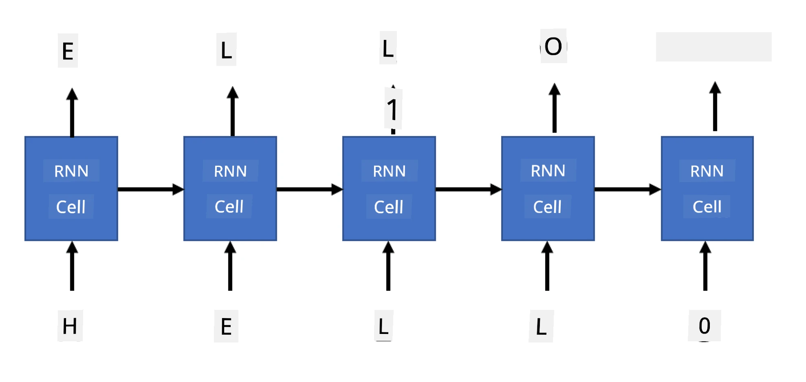

# ਜਨਰੇਟਿਵ ਨੈਟਵਰਕਸ

## [ਪ੍ਰੀ-ਲੈਕਚਰ ਕਵਿਜ਼](https://ff-quizzes.netlify.app/en/ai/quiz/33)

ਰੀਕਰਨਟ ਨਿਊਰਲ ਨੈਟਵਰਕਸ (RNNs) ਅਤੇ ਉਨ੍ਹਾਂ ਦੇ ਗੇਟਡ ਸੈਲ ਵਰਜਨ ਜਿਵੇਂ ਕਿ ਲਾਂਗ ਸ਼ਾਰਟ ਟਰਮ ਮੈਮੋਰੀ ਸੈਲ (LSTMs) ਅਤੇ ਗੇਟਡ ਰੀਕਰਨਟ ਯੂਨਿਟਸ (GRUs) ਨੇ ਭਾਸ਼ਾ ਮਾਡਲਿੰਗ ਲਈ ਇੱਕ ਮਕੈਨਿਜ਼ਮ ਪ੍ਰਦਾਨ ਕੀਤਾ ਹੈ, ਜਿਸ ਵਿੱਚ ਉਹ ਸ਼ਬਦਾਂ ਦੀ ਕ੍ਰਮਬੱਧਤਾ ਸਿੱਖ ਸਕਦੇ ਹਨ ਅਤੇ ਕ੍ਰਮ ਵਿੱਚ ਅਗਲੇ ਸ਼ਬਦ ਲਈ ਅਨੁਮਾਨ ਪ੍ਰਦਾਨ ਕਰ ਸਕਦੇ ਹਨ। ਇਸ ਨਾਲ ਸਾਨੂੰ RNNs ਨੂੰ **ਜਨਰੇਟਿਵ ਟਾਸਕਸ** ਲਈ ਵਰਤਣ ਦੀ ਆਗਿਆ ਮਿਲਦੀ ਹੈ, ਜਿਵੇਂ ਕਿ ਆਮ ਟੈਕਸਟ ਜਨਰੇਸ਼ਨ, ਮਸ਼ੀਨ ਅਨੁਵਾਦ, ਅਤੇ ਇਮੇਜ ਕੈਪਸ਼ਨਿੰਗ ਵੀ।

> ✅ ਸੋਚੋ ਕਿ ਜਦੋਂ ਤੁਸੀਂ ਟਾਈਪ ਕਰਦੇ ਹੋ ਤਾਂ ਟੈਕਸਟ ਪੂਰਨਤਾ ਵਰਗੇ ਜਨਰੇਟਿਵ ਟਾਸਕਸ ਤੋਂ ਕਿੰਨੀ ਵਾਰ ਲਾਭ ਪ੍ਰਾਪਤ ਕੀਤਾ ਹੈ। ਆਪਣੇ ਮਨਪਸੰਦ ਐਪਲੀਕੇਸ਼ਨਜ਼ ਬਾਰੇ ਖੋਜ ਕਰੋ ਕਿ ਕੀ ਉਹਨਾਂ ਨੇ RNNs ਦੀ ਵਰਤੋਂ ਕੀਤੀ ਸੀ।

ਪਿਛਲੇ ਯੂਨਿਟ ਵਿੱਚ ਚਰਚਾ ਕੀਤੀ RNN ਆਰਕੀਟੈਕਚਰ ਵਿੱਚ, ਹਰ RNN ਯੂਨਿਟ ਨੇ ਆਉਂਦੇ ਹੋਏ ਹਿਡਨ ਸਟੇਟ ਨੂੰ ਆਉਟਪੁਟ ਵਜੋਂ ਪੈਦਾ ਕੀਤਾ। ਹਾਲਾਂਕਿ, ਅਸੀਂ ਹਰ ਰੀਕਰਨਟ ਯੂਨਿਟ ਵਿੱਚ ਇੱਕ ਹੋਰ ਆਉਟਪੁਟ ਸ਼ਾਮਲ ਕਰ ਸਕਦੇ ਹਾਂ, ਜੋ ਸਾਨੂੰ ਇੱਕ **ਕ੍ਰਮ** (ਜੋ ਅਸਲ ਕ੍ਰਮ ਦੇ ਸਮਾਨ ਲੰਬਾਈ ਦਾ ਹੈ) ਆਉਟਪੁਟ ਕਰਨ ਦੀ ਆਗਿਆ ਦਿੰਦਾ ਹੈ। ਇਸ ਤੋਂ ਇਲਾਵਾ, ਅਸੀਂ RNN ਯੂਨਿਟਸ ਦੀ ਵਰਤੋਂ ਕਰ ਸਕਦੇ ਹਾਂ ਜੋ ਹਰ ਕਦਮ 'ਤੇ ਇਨਪੁਟ ਨੂੰ ਸਵੀਕਾਰ ਨਹੀਂ ਕਰਦੇ, ਅਤੇ ਸਿਰਫ ਕੁਝ ਸ਼ੁਰੂਆਤੀ ਸਟੇਟ ਵੇਕਟਰ ਲੈਂਦੇ ਹਨ, ਅਤੇ ਫਿਰ ਆਉਟਪੁਟਸ ਦਾ ਕ੍ਰਮ ਪੈਦਾ ਕਰਦੇ ਹਨ।

ਇਸ ਨਾਲ ਵੱਖ-ਵੱਖ ਨਿਊਰਲ ਆਰਕੀਟੈਕਚਰਸ ਦੀ ਆਗਿਆ ਮਿਲਦੀ ਹੈ ਜੋ ਹੇਠਾਂ ਦਿੱਤੇ ਚਿੱਤਰ ਵਿੱਚ ਦਿਖਾਏ ਗਏ ਹਨ:


> ਚਿੱਤਰ ਬਲੌਗ ਪੋਸਟ [Unreasonable Effectiveness of Recurrent Neural Networks](http://karpathy.github.io/2015/05/21/rnn-effectiveness/) ਤੋਂ [Andrej Karpaty](http://karpathy.github.io/) ਦੁਆਰਾ

* **One-to-one** ਇੱਕ ਪਰੰਪਰਾਗਤ ਨਿਊਰਲ ਨੈਟਵਰਕ ਹੈ ਜਿਸ ਵਿੱਚ ਇੱਕ ਇਨਪੁਟ ਅਤੇ ਇੱਕ ਆਉਟਪੁਟ ਹੁੰਦਾ ਹੈ।
* **One-to-many** ਇੱਕ ਜਨਰੇਟਿਵ ਆਰਕੀਟੈਕਚਰ ਹੈ ਜੋ ਇੱਕ ਇਨਪੁਟ ਵੈਲਯੂ ਨੂੰ ਸਵੀਕਾਰ ਕਰਦਾ ਹੈ, ਅਤੇ ਆਉਟਪੁਟ ਵੈਲਯੂਜ਼ ਦਾ ਕ੍ਰਮ ਪੈਦਾ ਕਰਦਾ ਹੈ। ਉਦਾਹਰਨ ਵਜੋਂ, ਜੇ ਅਸੀਂ ਇੱਕ **ਇਮੇਜ ਕੈਪਸ਼ਨਿੰਗ** ਨੈਟਵਰਕ ਨੂੰ ਟ੍ਰੇਨ ਕਰਨਾ ਚਾਹੁੰਦੇ ਹਾਂ ਜੋ ਤਸਵੀਰ ਦਾ ਟੈਕਸਟਵਾਰ ਵਰਣਨ ਪੈਦਾ ਕਰੇ, ਅਸੀਂ ਇੱਕ ਤਸਵੀਰ ਨੂੰ ਇਨਪੁਟ ਵਜੋਂ ਲੈ ਸਕਦੇ ਹਾਂ, ਇਸਨੂੰ ਇਸਦੇ ਹਿਡਨ ਸਟੇਟ ਪ੍ਰਾਪਤ ਕਰਨ ਲਈ CNN ਵਿੱਚੋਂ ਪਾਸ ਕਰ ਸਕਦੇ ਹਾਂ, ਅਤੇ ਫਿਰ ਇੱਕ ਰੀਕਰਨਟ ਚੇਨ ਕੈਪਸ਼ਨ ਨੂੰ ਸ਼ਬਦ-ਦਰ-ਸ਼ਬਦ ਪੈਦਾ ਕਰ ਸਕਦਾ ਹੈ।
* **Many-to-one** ਉਹ RNN ਆਰਕੀਟੈਕਚਰਸ ਨੂੰ ਦਰਸਾਉਂਦਾ ਹੈ ਜੋ ਅਸੀਂ ਪਿਛਲੇ ਯੂਨਿਟ ਵਿੱਚ ਚਰਚਾ ਕੀਤੀ ਸੀ, ਜਿਵੇਂ ਕਿ ਟੈਕਸਟ ਕਲਾਸੀਫਿਕੇਸ਼ਨ।
* **Many-to-many**, ਜਾਂ **sequence-to-sequence** ਉਹ ਟਾਸਕਸ ਨੂੰ ਦਰਸਾਉਂਦਾ ਹੈ ਜਿਵੇਂ ਕਿ **ਮਸ਼ੀਨ ਅਨੁਵਾਦ**, ਜਿੱਥੇ ਅਸੀਂ ਪਹਿਲਾਂ RNN ਨੂੰ ਇਨਪੁਟ ਕ੍ਰਮ ਤੋਂ ਸਾਰੀ ਜਾਣਕਾਰੀ ਹਿਡਨ ਸਟੇਟ ਵਿੱਚ ਇਕੱਠਾ ਕਰਨ ਦਿੰਦੇ ਹਾਂ, ਅਤੇ ਇੱਕ ਹੋਰ RNN ਚੇਨ ਇਸ ਸਟੇਟ ਨੂੰ ਆਉਟਪੁਟ ਕ੍ਰਮ ਵਿੱਚ ਅਨਰੋਲ ਕਰਦਾ ਹੈ।

ਇਸ ਯੂਨਿਟ ਵਿੱਚ, ਅਸੀਂ ਸਧਾਰਨ ਜਨਰੇਟਿਵ ਮਾਡਲਸ 'ਤੇ ਧਿਆਨ ਦੇਵਾਂਗੇ ਜੋ ਸਾਨੂੰ ਟੈਕਸਟ ਪੈਦਾ ਕਰਨ ਵਿੱਚ ਮਦਦ ਕਰਦੇ ਹਨ। ਸਧਾਰਨਤਾ ਲਈ, ਅਸੀਂ ਕਿਰਦਾਰ-ਸਤਰ ਟੋਕਨਾਈਜ਼ੇਸ਼ਨ ਦੀ ਵਰਤੋਂ ਕਰਾਂਗੇ।

ਅਸੀਂ ਇਸ RNN ਨੂੰ ਕਦਮ-ਦਰ-ਕਦਮ ਟੈਕਸਟ ਪੈਦਾ ਕਰਨ ਲਈ ਟ੍ਰੇਨ ਕਰਾਂਗੇ। ਹਰ ਕਦਮ 'ਤੇ, ਅਸੀਂ `nchars` ਦੀ ਲੰਬਾਈ ਦੇ ਕਿਰਦਾਰਾਂ ਦੇ ਕ੍ਰਮ ਨੂੰ ਲਵਾਂਗੇ, ਅਤੇ ਨੈਟਵਰਕ ਤੋਂ ਹਰ ਇਨਪੁਟ ਕਿਰਦਾਰ ਲਈ ਅਗਲਾ ਆਉਟਪੁਟ ਕਿਰਦਾਰ ਪੈਦਾ ਕਰਨ ਲਈ ਕਹਾਂਗੇ:



ਜਦੋਂ ਟੈਕਸਟ ਪੈਦਾ ਕਰਨਾ (ਇਨਫਰੈਂਸ ਦੌਰਾਨ), ਅਸੀਂ ਕੁਝ **ਪ੍ਰਾਂਪਟ** ਨਾਲ ਸ਼ੁਰੂ ਕਰਦੇ ਹਾਂ, ਜਿਸਨੂੰ RNN ਸੈਲਸ ਵਿੱਚੋਂ ਪਾਸ ਕੀਤਾ ਜਾਂਦਾ ਹੈ ਤਾਂ ਜੋ ਇਸਦਾ ਮੱਧਵਰਤੀ ਸਟੇਟ ਪੈਦਾ ਕੀਤਾ ਜਾ ਸਕੇ, ਅਤੇ ਫਿਰ ਇਸ ਸਟੇਟ ਤੋਂ ਜਨਰੇਸ਼ਨ ਸ਼ੁਰੂ ਹੁੰਦੀ ਹੈ। ਅਸੀਂ ਇੱਕ ਸਮੇਂ ਵਿੱਚ ਇੱਕ ਕਿਰਦਾਰ ਪੈਦਾ ਕਰਦੇ ਹਾਂ, ਅਤੇ ਸਟੇਟ ਅਤੇ ਪੈਦਾ ਕੀਤੇ ਕਿਰਦਾਰ ਨੂੰ ਅਗਲੇ RNN ਸੈਲ ਵਿੱਚ ਪਾਸ ਕਰਦੇ ਹਾਂ ਤਾਂ ਜੋ ਅਗਲਾ ਪੈਦਾ ਕੀਤਾ ਜਾ ਸਕੇ, ਜਦੋਂ ਤੱਕ ਅਸੀਂ ਕਾਫ਼ੀ ਕਿਰਦਾਰ ਪੈਦਾ ਨਹੀਂ ਕਰ ਲੈਂਦੇ।


> ਚਿੱਤਰ ਲੇਖਕ ਦੁਆਰਾ

## ✍️ ਅਭਿਆਸ: ਜਨਰੇਟਿਵ ਨੈਟਵਰਕਸ

ਹੇਠਾਂ ਦਿੱਤੇ ਨੋਟਬੁੱਕਸ ਵਿੱਚ ਆਪਣੀ ਸਿੱਖਿਆ ਜਾਰੀ ਰੱਖੋ:

* [Generative Networks with PyTorch](GenerativePyTorch.ipynb)
* [Generative Networks with TensorFlow](GenerativeTF.ipynb)

## ਸਾਫਟ ਟੈਕਸਟ ਜਨਰੇਸ਼ਨ ਅਤੇ ਟੈਂਪਰੇਚਰ

ਹਰ RNN ਸੈਲ ਦਾ ਆਉਟਪੁਟ ਕਿਰਦਾਰਾਂ ਦਾ ਸੰਭਾਵਨਾ ਵੰਡ ਹੈ। ਜੇ ਅਸੀਂ ਹਮੇਸ਼ਾ ਜਨਰੇਟ ਕੀਤੇ ਟੈਕਸਟ ਵਿੱਚ ਅਗਲੇ ਕਿਰਦਾਰ ਵਜੋਂ ਸਭ ਤੋਂ ਉੱਚੀ ਸੰਭਾਵਨਾ ਵਾਲੇ ਕਿਰਦਾਰ ਨੂੰ ਲੈਂਦੇ ਹਾਂ, ਤਾਂ ਟੈਕਸਟ ਅਕਸਰ "ਚੱਕਰਵਾਦੀ" ਹੋ ਸਕਦਾ ਹੈ, ਜਿਵੇਂ ਕਿ ਇਸ ਉਦਾਹਰਨ ਵਿੱਚ:

```
today of the second the company and a second the company ...
```
  
ਹਾਲਾਂਕਿ, ਜੇ ਅਸੀਂ ਅਗਲੇ ਕਿਰਦਾਰ ਲਈ ਸੰਭਾਵਨਾ ਵੰਡ ਨੂੰ ਵੇਖਦੇ ਹਾਂ, ਤਾਂ ਇਹ ਹੋ ਸਕਦਾ ਹੈ ਕਿ ਕੁਝ ਸਭ ਤੋਂ ਉੱਚੀਆਂ ਸੰਭਾਵਨਾਵਾਂ ਦੇ ਵਿਚਕਾਰ ਅੰਤਰ ਵੱਡਾ ਨਾ ਹੋਵੇ, ਉਦਾਹਰਨ ਵਜੋਂ ਇੱਕ ਕਿਰਦਾਰ ਦੀ ਸੰਭਾਵਨਾ 0.2 ਹੋ ਸਕਦੀ ਹੈ, ਦੂਜੇ ਦੀ - 0.19, ਆਦਿ। ਉਦਾਹਰਨ ਵਜੋਂ, ਜਦੋਂ '*play*' ਕ੍ਰਮ ਵਿੱਚ ਅਗਲੇ ਕਿਰਦਾਰ ਦੀ ਭਾਲ ਕਰਦੇ ਹੋ, ਅਗਲਾ ਕਿਰਦਾਰ ਸਮਾਨ ਤੌਰ 'ਤੇ ਖਾਲੀ ਜਗ੍ਹਾ ਹੋ ਸਕਦਾ ਹੈ, ਜਾਂ **e** (ਜਿਵੇਂ ਕਿ ਸ਼ਬਦ *player* ਵਿੱਚ)।

ਇਸ ਨਾਲ ਇਹ ਨਤੀਜਾ ਨਿਕਲਦਾ ਹੈ ਕਿ ਹਮੇਸ਼ਾ ਸਭ ਤੋਂ ਉੱਚੀ ਸੰਭਾਵਨਾ ਵਾਲੇ ਕਿਰਦਾਰ ਨੂੰ ਚੁਣਨਾ "ਨਿਆਂਪੂਰਨ" ਨਹੀਂ ਹੈ, ਕਿਉਂਕਿ ਦੂਜੀ ਸਭ ਤੋਂ ਉੱਚੀ ਸੰਭਾਵਨਾ ਵਾਲੇ ਕਿਰਦਾਰ ਨੂੰ ਚੁਣਨਾ ਫਿਰ ਵੀ ਅਰਥਪੂਰਨ ਟੈਕਸਟ ਵੱਲ ਲੈ ਜਾ ਸਕਦਾ ਹੈ। ਇਹ ਜ਼ਿਆਦਾ ਸਮਝਦਾਰ ਹੈ ਕਿ ਨੈਟਵਰਕ ਆਉਟਪੁਟ ਦੁਆਰਾ ਦਿੱਤੀ ਗਈ ਸੰਭਾਵਨਾ ਵੰਡ ਤੋਂ **ਸੈਂਪਲ** ਕਿਰਦਾਰਾਂ ਨੂੰ ਚੁਣਿਆ ਜਾਵੇ। ਅਸੀਂ ਇੱਕ ਪੈਰਾਮੀਟਰ, **ਟੈਂਪਰੇਚਰ**, ਦੀ ਵਰਤੋਂ ਕਰ ਸਕਦੇ ਹਾਂ ਜੋ ਸੰਭਾਵਨਾ ਵੰਡ ਨੂੰ ਸਮਤਲ ਕਰੇਗਾ, ਜੇ ਅਸੀਂ ਹੋਰ ਬੇਤਰਤੀਬੀ ਸ਼ਾਮਲ ਕਰਨੀ ਚਾਹੁੰਦੇ ਹਾਂ, ਜਾਂ ਇਸਨੂੰ ਹੋਰ ਢਲਵਾਂ ਬਣਾਉਣਾ ਚਾਹੁੰਦੇ ਹਾਂ, ਜੇ ਅਸੀਂ ਸਭ ਤੋਂ ਉੱਚੀ-ਸੰਭਾਵਨਾ ਵਾਲੇ ਕਿਰਦਾਰਾਂ ਨਾਲ ਜੁੜੇ ਰਹਿਣਾ ਚਾਹੁੰਦੇ ਹਾਂ।

ਹੇਠਾਂ ਦਿੱਤੇ ਨੋਟਬੁੱਕਸ ਵਿੱਚ ਵੇਖੋ ਕਿ ਇਹ ਸਾਫਟ ਟੈਕਸਟ ਜਨਰੇਸ਼ਨ ਕਿਵੇਂ ਲਾਗੂ ਕੀਤਾ ਗਿਆ ਹੈ।

## ਨਤੀਜਾ

ਜਦੋਂ ਕਿ ਟੈਕਸਟ ਜਨਰੇਸ਼ਨ ਆਪਣੇ ਆਪ ਵਿੱਚ ਲਾਭਦਾਇਕ ਹੋ ਸਕਦਾ ਹੈ, ਮੁੱਖ ਫਾਇਦੇ RNNs ਦੀ ਵਰਤੋਂ ਕਰਕੇ ਕੁਝ ਸ਼ੁਰੂਆਤੀ ਫੀਚਰ ਵੇਕਟਰ ਤੋਂ ਟੈਕਸਟ ਪੈਦਾ ਕਰਨ ਦੀ ਯੋਗਤਾ ਤੋਂ ਆਉਂਦੇ ਹਨ। ਉਦਾਹਰਨ ਵਜੋਂ, ਟੈਕਸਟ ਜਨਰੇਸ਼ਨ ਮਸ਼ੀਨ ਅਨੁਵਾਦ (sequence-to-sequence, ਇਸ ਮਾਮਲੇ ਵਿੱਚ *encoder* ਤੋਂ ਸਟੇਟ ਵੇਕਟਰ ਨੂੰ ਵਰਤ ਕੇ ਅਨੁਵਾਦਿਤ ਸੁਨੇਹਾ ਪੈਦਾ ਜਾਂ *decode* ਕੀਤਾ ਜਾਂਦਾ ਹੈ), ਜਾਂ ਤਸਵੀਰ ਦਾ ਟੈਕਸਟਵਾਰ ਵਰਣਨ ਪੈਦਾ ਕਰਨ ਲਈ ਵਰਤਿਆ ਜਾਂਦਾ ਹੈ (ਜਿਸ ਮਾਮਲੇ ਵਿੱਚ ਫੀਚਰ ਵੇਕਟਰ CNN extractor ਤੋਂ ਆਉਂਦਾ ਹੈ)।

## 🚀 ਚੁਣੌਤੀ

Microsoft Learn 'ਤੇ ਇਸ ਵਿਸ਼ੇ 'ਤੇ ਕੁਝ ਪਾਠ ਲਵੋ

* [PyTorch](https://docs.microsoft.com/learn/modules/intro-natural-language-processing-pytorch/6-generative-networks/?WT.mc_id=academic-77998-cacaste)/[TensorFlow](https://docs.microsoft.com/learn/modules/intro-natural-language-processing-tensorflow/5-generative-networks/?WT.mc_id=academic-77998-cacaste) ਨਾਲ ਟੈਕਸਟ ਜਨਰੇਸ਼ਨ

## [ਪੋਸਟ-ਲੈਕਚਰ ਕਵਿਜ਼](https://ff-quizzes.netlify.app/en/ai/quiz/34)

## ਸਮੀਖਿਆ ਅਤੇ ਸਵੈ-ਅਧਿਐਨ

ਇਹ ਲੇਖ ਤੁਹਾਡੀ ਜਾਣਕਾਰੀ ਨੂੰ ਵਧਾਉਣ ਲਈ ਹਨ

* ਮਾਰਕੋਵ ਚੇਨ, LSTM ਅਤੇ GPT-2 ਨਾਲ ਟੈਕਸਟ ਜਨਰੇਸ਼ਨ ਦੇ ਵੱਖ-ਵੱਖ ਪਹੁੰਚਾਂ: [ਬਲੌਗ ਪੋਸਟ](https://towardsdatascience.com/text-generation-gpt-2-lstm-markov-chain-9ea371820e1e)
* [Keras ਦਸਤਾਵੇਜ਼](https://keras.io/examples/generative/lstm_character_level_text_generation/) ਵਿੱਚ ਟੈਕਸਟ ਜਨਰੇਸ਼ਨ ਦਾ ਉਦਾਹਰਨ

## [ਅਸਾਈਨਮੈਂਟ](lab/README.md)

ਅਸੀਂ ਦੇਖਿਆ ਕਿ ਕਿਵੇਂ ਕਿਰਦਾਰ-ਦਰ-ਕਿਰਦਾਰ ਟੈਕਸਟ ਪੈਦਾ ਕੀਤਾ ਜਾ ਸਕਦਾ ਹੈ। ਲੈਬ ਵਿੱਚ, ਤੁਸੀਂ ਸ਼ਬਦ-ਸਤਰ ਟੈਕਸਟ ਜਨਰੇਸ਼ਨ ਦੀ ਖੋਜ ਕਰੋਗੇ।

---

