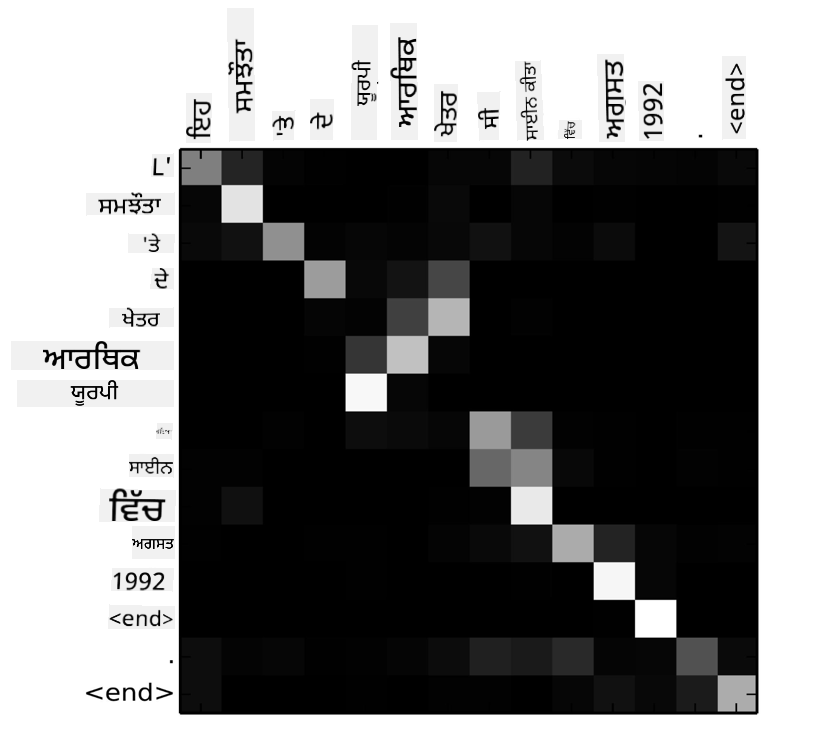
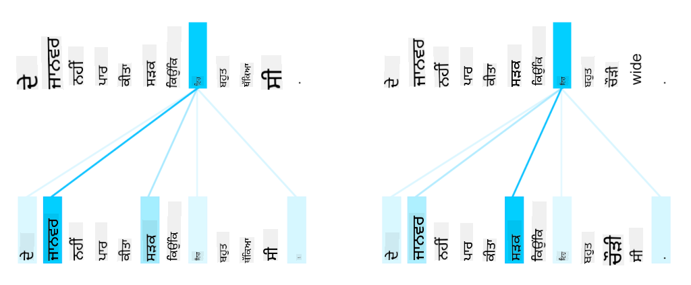
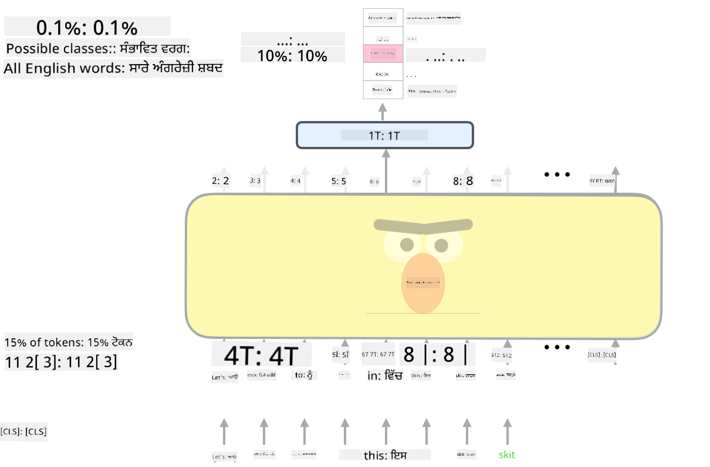

<!--
CO_OP_TRANSLATOR_METADATA:
{
  "original_hash": "7e617f0b8de85a43957a853aba09bfeb",
  "translation_date": "2025-08-26T08:37:56+00:00",
  "source_file": "lessons/5-NLP/18-Transformers/README.md",
  "language_code": "pa"
}
-->
# ਧਿਆਨ ਮਕੈਨਿਜ਼ਮ ਅਤੇ ਟ੍ਰਾਂਸਫਾਰਮਰ

## [ਪ੍ਰੀ-ਲੈਕਚਰ ਕਵਿਜ਼](https://ff-quizzes.netlify.app/en/ai/quiz/35)

NLP ਖੇਤਰ ਵਿੱਚ ਸਭ ਤੋਂ ਮਹੱਤਵਪੂਰਨ ਸਮੱਸਿਆਵਾਂ ਵਿੱਚੋਂ ਇੱਕ ਹੈ **ਮਸ਼ੀਨ ਅਨੁਵਾਦ**, ਜੋ ਕਿ Google Translate ਵਰਗੇ ਟੂਲਾਂ ਦੇ ਆਧਾਰ ਤਹਿਤ ਇੱਕ ਮਹੱਤਵਪੂਰਨ ਕੰਮ ਹੈ। ਇਸ ਭਾਗ ਵਿੱਚ, ਅਸੀਂ ਮਸ਼ੀਨ ਅਨੁਵਾਦ 'ਤੇ ਧਿਆਨ ਕੇਂਦਰਿਤ ਕਰਾਂਗੇ, ਜਾਂ, ਵੱਧ ਜਨਰਲ ਤੌਰ 'ਤੇ, ਕਿਸੇ ਵੀ *ਸਿਕਵੈਂਸ-ਟੂ-ਸਿਕਵੈਂਸ* ਕੰਮ 'ਤੇ (ਜਿਸਨੂੰ **ਵਾਕ ਅਨੁਵਾਦ** ਵੀ ਕਿਹਾ ਜਾਂਦਾ ਹੈ)।

RNNs ਨਾਲ, ਸਿਕਵੈਂਸ-ਟੂ-ਸਿਕਵੈਂਸ ਦੋ ਰਿਕਰੰਟ ਨੈੱਟਵਰਕਾਂ ਦੁਆਰਾ ਲਾਗੂ ਕੀਤਾ ਜਾਂਦਾ ਹੈ, ਜਿੱਥੇ ਇੱਕ ਨੈੱਟਵਰਕ, **ਐਨਕੋਡਰ**, ਇੱਕ ਇਨਪੁਟ ਸਿਕਵੈਂਸ ਨੂੰ ਇੱਕ ਹਿਡਨ ਸਟੇਟ ਵਿੱਚ ਸੰਗ੍ਰਹਿ ਕਰਦਾ ਹੈ, ਜਦੋਂ ਕਿ ਦੂਜਾ ਨੈੱਟਵਰਕ, **ਡੀਕੋਡਰ**, ਇਸ ਹਿਡਨ ਸਟੇਟ ਨੂੰ ਇੱਕ ਅਨੁਵਾਦਿਤ ਨਤੀਜੇ ਵਿੱਚ ਬਾਹਰ ਕੱਢਦਾ ਹੈ। ਇਸ ਪਹੁੰਚ ਨਾਲ ਕੁਝ ਸਮੱਸਿਆਵਾਂ ਹਨ:

* ਐਨਕੋਡਰ ਨੈੱਟਵਰਕ ਦੀ ਆਖਰੀ ਸਟੇਟ ਨੂੰ ਵਾਕ ਦੇ ਸ਼ੁਰੂ ਨੂੰ ਯਾਦ ਰੱਖਣ ਵਿੱਚ ਮੁਸ਼ਕਲ ਹੁੰਦੀ ਹੈ, ਜਿਸ ਕਾਰਨ ਲੰਬੇ ਵਾਕਾਂ ਲਈ ਮਾਡਲ ਦੀ ਗੁਣਵੱਤਾ ਘਟ ਜਾਂਦੀ ਹੈ।
* ਸਿਕਵੈਂਸ ਦੇ ਸਾਰੇ ਸ਼ਬਦਾਂ ਦਾ ਨਤੀਜੇ 'ਤੇ ਇੱਕੋ ਜਿਹਾ ਪ੍ਰਭਾਵ ਹੁੰਦਾ ਹੈ। ਹਕੀਕਤ ਵਿੱਚ, ਹਾਲਾਂਕਿ, ਇਨਪੁਟ ਸਿਕਵੈਂਸ ਵਿੱਚ ਕੁਝ ਖਾਸ ਸ਼ਬਦਾਂ ਦਾ ਅਗਲੇ ਨਤੀਜਿਆਂ 'ਤੇ ਵੱਧ ਪ੍ਰਭਾਵ ਹੁੰਦਾ ਹੈ।

**ਧਿਆਨ ਮਕੈਨਿਜ਼ਮ** RNN ਦੇ ਹਰ ਆਉਟਪੁੱਟ ਅਨੁਮਾਨ 'ਤੇ ਹਰ ਇਨਪੁਟ ਵੇਕਟਰ ਦੇ ਸੰਦਰਭਕ ਪ੍ਰਭਾਵ ਨੂੰ ਵਜਨ ਦੇਣ ਦਾ ਇੱਕ ਢੰਗ ਪ੍ਰਦਾਨ ਕਰਦੇ ਹਨ। ਇਹ ਇਸ ਤਰੀਕੇ ਨਾਲ ਲਾਗੂ ਕੀਤਾ ਜਾਂਦਾ ਹੈ ਕਿ ਇਨਪੁਟ RNN ਅਤੇ ਆਉਟਪੁੱਟ RNN ਦੇ ਵਿਚਕਾਰ ਸ਼ਾਰਟਕੱਟ ਬਣਾਏ ਜਾਂਦੇ ਹਨ। ਇਸ ਤਰੀਕੇ ਨਾਲ, ਜਦੋਂ ਆਉਟਪੁੱਟ ਪ੍ਰਤੀਕ yt ਤਿਆਰ ਕੀਤਾ ਜਾਂਦਾ ਹੈ, ਅਸੀਂ ਸਾਰੇ ਇਨਪੁਟ ਹਿਡਨ ਸਟੇਟ hi ਨੂੰ ਵੱਖ-ਵੱਖ ਵਜਨ ਗੁਣਾਂਕ αt,i ਦੇ ਨਾਲ ਧਿਆਨ ਵਿੱਚ ਰੱਖਾਂਗੇ।

> ਐਨਕੋਡਰ-ਡੀਕੋਡਰ ਮਾਡਲ ਐਡਿਟਿਵ ਧਿਆਨ ਮਕੈਨਿਜ਼ਮ ਦੇ ਨਾਲ [Bahdanau et al., 2015](https://arxiv.org/pdf/1409.0473.pdf) ਵਿੱਚ, [ਇਸ ਬਲੌਗ ਪੋਸਟ](https://lilianweng.github.io/lil-log/2018/06/24/attention-attention.html) ਤੋਂ ਲਿਆ ਗਿਆ।

ਧਿਆਨ ਮੈਟ੍ਰਿਕਸ {αi,j} ਇਹ ਦਰਸਾਉਂਦਾ ਹੈ ਕਿ ਕਿਸ ਹੱਦ ਤੱਕ ਕੁਝ ਇਨਪੁਟ ਸ਼ਬਦ ਇੱਕ ਦਿੱਤੇ ਗਏ ਆਉਟਪੁੱਟ ਸਿਕਵੈਂਸ ਵਿੱਚ ਸ਼ਬਦ ਦੀ ਪੈਦਾਵਾਰ ਵਿੱਚ ਭੂਮਿਕਾ ਨਿਭਾਉਂਦੇ ਹਨ। ਹੇਠਾਂ ਇੱਕ ਉਦਾਹਰਣ ਵਜੋਂ ਇਸ ਮੈਟ੍ਰਿਕਸ ਨੂੰ ਦਿਖਾਇਆ ਗਿਆ ਹੈ:

> ਚਿੱਤਰ [Bahdanau et al., 2015](https://arxiv.org/pdf/1409.0473.pdf) ਤੋਂ (ਫਿਗ.3)

ਧਿਆਨ ਮਕੈਨਿਜ਼ਮ NLP ਵਿੱਚ ਮੌਜੂਦਾ ਜਾਂ ਲਗਭਗ ਮੌਜੂਦਾ ਸਥਿਤੀ ਦੇ ਕਲਾ ਦੇ ਜ਼ਿੰਮੇਵਾਰ ਹਨ। ਹਾਲਾਂਕਿ ਧਿਆਨ ਸ਼ਾਮਲ ਕਰਨ ਨਾਲ ਮਾਡਲ ਪੈਰਾਮੀਟਰਾਂ ਦੀ ਗਿਣਤੀ ਵਿੱਚ ਕਾਫ਼ੀ ਵਾਧਾ ਹੁੰਦਾ ਹੈ, ਜਿਸ ਕਾਰਨ RNNs ਨਾਲ ਸਕੇਲਿੰਗ ਸਮੱਸਿਆਵਾਂ ਆਈਆਂ। RNNs ਨੂੰ ਸਕੇਲ ਕਰਨ ਦੀ ਇੱਕ ਮੁੱਖ ਰੋਕਾਵਟ ਇਹ ਹੈ ਕਿ ਮਾਡਲਾਂ ਦੀ ਰਿਕਰੰਟ ਪ੍ਰਕਿਰਤੀ ਟ੍ਰੇਨਿੰਗ ਨੂੰ ਬੈਚ ਅਤੇ ਪੈਰਲਲਾਈਜ਼ ਕਰਨਾ ਮੁਸ਼ਕਲ ਬਣਾ ਦਿੰਦੀ ਹੈ। RNN ਵਿੱਚ ਸਿਕਵੈਂਸ ਦੇ ਹਰ ਤੱਤ ਨੂੰ ਲਗਾਤਾਰ ਕ੍ਰਮ ਵਿੱਚ ਪ੍ਰਕਿਰਿਆ ਕਰਨ ਦੀ ਲੋੜ ਹੁੰਦੀ ਹੈ, ਜਿਸਦਾ ਅਰਥ ਹੈ ਕਿ ਇਸਨੂੰ ਆਸਾਨੀ ਨਾਲ ਪੈਰਲਲ ਨਹੀਂ ਕੀਤਾ ਜਾ ਸਕਦਾ।

> ਚਿੱਤਰ [ਗੂਗਲ ਦੇ ਬਲੌਗ](https://research.googleblog.com/2016/09/a-neural-network-for-machine.html) ਤੋਂ

ਧਿਆਨ ਮਕੈਨਿਜ਼ਮ ਦੀ ਗ੍ਰਹਿਣਸ਼ੀਲਤਾ ਅਤੇ ਇਸ ਰੋਕਾਵਟ ਦੇ ਮਿਲਾਪ ਨੇ ਅੱਜ ਦੇ ਸਥਿਤੀ ਦੇ ਕਲਾ ਟ੍ਰਾਂਸਫਾਰਮਰ ਮਾਡਲਾਂ ਦੀ ਰਚਨਾ ਲਈ ਰਾਹ ਪ੍ਰਦਾਨ ਕੀਤਾ, ਜਿਵੇਂ ਕਿ BERT ਤੋਂ Open-GPT3 ਤੱਕ।

## ਟ੍ਰਾਂਸਫਾਰਮਰ ਮਾਡਲ

ਟ੍ਰਾਂਸਫਾਰਮਰਾਂ ਦੇ ਪਿੱਛੇ ਇੱਕ ਮੁੱਖ ਵਿਚਾਰ RNNs ਦੀ ਲਗਾਤਾਰ ਪ੍ਰਕਿਰਤੀ ਤੋਂ ਬਚਣਾ ਅਤੇ ਇੱਕ ਮਾਡਲ ਬਣਾਉਣਾ ਹੈ ਜੋ ਟ੍ਰੇਨਿੰਗ ਦੌਰਾਨ ਪੈਰਲਲਾਈਜ਼ ਕੀਤਾ ਜਾ ਸਕੇ। ਇਹ ਦੋ ਵਿਚਾਰਾਂ ਨੂੰ ਲਾਗੂ ਕਰਕੇ ਹਾਸਲ ਕੀਤਾ ਜਾਂਦਾ ਹੈ:

* ਸਥਿਤੀ ਕੋਡਿੰਗ
* RNNs (ਜਾਂ CNNs) ਦੀ ਥਾਂ ਪੈਟਰਨ ਕੈਪਚਰ ਕਰਨ ਲਈ ਸਵੈ-ਧਿਆਨ ਮਕੈਨਿਜ਼ਮ ਦੀ ਵਰਤੋਂ (ਇਸੇ ਕਰਕੇ ਟ੍ਰਾਂਸਫਾਰਮਰਾਂ ਨੂੰ ਪੇਸ਼ ਕਰਨ ਵਾਲੇ ਪੇਪਰ ਦਾ ਨਾਮ ਹੈ *[Attention is all you need](https://arxiv.org/abs/1706.03762)*)

### ਸਥਿਤੀ ਕੋਡਿੰਗ/ਐਮਬੈਡਿੰਗ

ਸਥਿਤੀ ਕੋਡਿੰਗ ਦਾ ਵਿਚਾਰ ਇਹ ਹੈ:
1. RNNs ਦੀ ਵਰਤੋਂ ਕਰਦੇ ਸਮੇਂ, ਟੋਕਨ ਦੀ ਰਿਸ਼ਤੇਦਾਰ ਸਥਿਤੀ ਕਦਮਾਂ ਦੀ ਗਿਣਤੀ ਦੁਆਰਾ ਦਰਸਾਈ ਜਾਂਦੀ ਹੈ, ਅਤੇ ਇਸ ਲਈ ਇਸਨੂੰ ਸਪਸ਼ਟ ਤੌਰ 'ਤੇ ਦਰਸਾਉਣ ਦੀ ਲੋੜ ਨਹੀਂ ਹੁੰਦੀ।
2. ਹਾਲਾਂਕਿ, ਜਦੋਂ ਅਸੀਂ ਧਿਆਨ 'ਤੇ ਸਵਿੱਚ ਕਰਦੇ ਹਾਂ, ਸਾਨੂੰ ਸਿਕਵੈਂਸ ਦੇ ਅੰਦਰ ਟੋਕਨ ਦੀਆਂ ਰਿਸ਼ਤੇਦਾਰ ਸਥਿਤੀਆਂ ਬਾਰੇ ਪਤਾ ਹੋਣਾ ਚਾਹੀਦਾ ਹੈ।
3. ਸਥਿਤੀ ਕੋਡਿੰਗ ਪ੍ਰਾਪਤ ਕਰਨ ਲਈ, ਅਸੀਂ ਆਪਣੇ ਟੋਕਨ ਸਿਕਵੈਂਸ ਨੂੰ ਸਿਕਵੈਂਸ ਵਿੱਚ ਟੋਕਨ ਸਥਿਤੀਆਂ ਦੇ ਸਿਕਵੈਂਸ ਨਾਲ ਵਧਾਉਂਦੇ ਹਾਂ (ਜਿਵੇਂ ਕਿ 0,1, ... ਦੀ ਗਿਣਤੀ ਦਾ ਸਿਕਵੈਂਸ)।
4. ਫਿਰ ਅਸੀਂ ਟੋਕਨ ਸਥਿਤੀ ਨੂੰ ਟੋਕਨ ਐਮਬੈਡਿੰਗ ਵੇਕਟਰ ਨਾਲ ਮਿਲਾਉਂਦੇ ਹਾਂ। ਸਥਿਤੀ (ਪੂਰਨ ਅੰਕ) ਨੂੰ ਇੱਕ ਵੇਕਟਰ ਵਿੱਚ ਬਦਲਣ ਲਈ, ਅਸੀਂ ਵੱਖ-ਵੱਖ ਪਹੁੰਚਾਂ ਦੀ ਵਰਤੋਂ ਕਰ ਸਕਦੇ ਹਾਂ:

* ਟ੍ਰੇਨ ਕਰਨ ਯੋਗ ਐਮਬੈਡਿੰਗ, ਟੋਕਨ ਐਮਬੈਡਿੰਗ ਦੇ ਸਮਾਨ। ਇਹ ਪਹੁੰਚ ਅਸੀਂ ਇੱਥੇ ਵਿਚਾਰ ਕਰਦੇ ਹਾਂ। ਅਸੀਂ ਟੋਕਨ ਅਤੇ ਉਨ੍ਹਾਂ ਦੀਆਂ ਸਥਿਤੀਆਂ ਦੋਵਾਂ 'ਤੇ ਐਮਬੈਡਿੰਗ ਲੇਅਰਾਂ ਲਾਗੂ ਕਰਦੇ ਹਾਂ, ਜਿਸ ਨਾਲ ਇੱਕੋ ਹੀ ਪਰਿਮਾਣ ਦੇ ਐਮਬੈਡਿੰਗ ਵੇਕਟਰ ਪ੍ਰਾਪਤ ਹੁੰਦੇ ਹਨ, ਜਿਨ੍ਹਾਂ ਨੂੰ ਅਸੀਂ ਫਿਰ ਇਕੱਠੇ ਜੋੜ ਦਿੰਦੇ ਹਾਂ।
* ਮੂਲ ਪੇਪਰ ਵਿੱਚ ਪ੍ਰਸਤਾਵਿਤ ਸਥਿਰ ਸਥਿਤੀ ਕੋਡਿੰਗ ਫੰਕਸ਼ਨ।

> ਲੇਖਕ ਦੁਆਰਾ ਚਿੱਤਰ

ਸਥਿਤੀ ਐਮਬੈਡਿੰਗ ਦੇ ਨਾਲ ਪ੍ਰਾਪਤ ਨਤੀਜਾ ਮੂਲ ਟੋਕਨ ਅਤੇ ਇਸਦੀ ਸਿਕਵੈਂਸ ਦੇ ਅੰਦਰ ਸਥਿਤੀ ਦੋਵਾਂ ਨੂੰ ਐਮਬੈਡ ਕਰਦਾ ਹੈ।

### ਮਲਟੀ-ਹੈੱਡ ਸਵੈ-ਧਿਆਨ

ਅਗਲਾ, ਸਾਨੂੰ ਆਪਣੇ ਸਿਕਵੈਂਸ ਦੇ ਅੰਦਰ ਕੁਝ ਪੈਟਰਨ ਕੈਪਚਰ ਕਰਨ ਦੀ ਲੋੜ ਹੈ। ਇਸ ਲਈ, ਟ੍ਰਾਂਸਫਾਰਮਰ **ਸਵੈ-ਧਿਆਨ** ਮਕੈਨਿਜ਼ਮ ਦੀ ਵਰਤੋਂ ਕਰਦੇ ਹਨ, ਜੋ ਕਿ ਮੂਲ ਤੌਰ 'ਤੇ ਧਿਆਨ ਹੈ ਜੋ ਇਨਪੁਟ ਅਤੇ ਆਉਟਪੁੱਟ ਦੇ ਤੌਰ 'ਤੇ ਇੱਕੋ ਸਿਕਵੈਂਸ 'ਤੇ ਲਾਗੂ ਹੁੰਦਾ ਹੈ। ਸਵੈ-ਧਿਆਨ ਲਾਗੂ ਕਰਨ ਨਾਲ ਸਾਨੂੰ ਵਾਕ ਦੇ ਅੰਦਰ **ਸੰਦਰਭ** ਨੂੰ ਧਿਆਨ ਵਿੱਚ ਰੱਖਣ ਦੀ ਆਗਿਆ ਮਿਲਦੀ ਹੈ, ਅਤੇ ਦੇਖਣ ਦੀ ਆਗਿਆ ਮਿਲਦੀ ਹੈ ਕਿ ਕਿਹੜੇ ਸ਼ਬਦ ਆਪਸ ਵਿੱਚ ਜੁੜੇ ਹੋਏ ਹਨ। ਉਦਾਹਰਣ ਲਈ, ਇਹ ਸਾਨੂੰ ਇਹ ਦੇਖਣ ਦੀ ਆਗਿਆ ਦਿੰਦਾ ਹੈ ਕਿ ਕਿਹੜੇ ਸ਼ਬਦਾਂ ਨੂੰ ਕੋਰਫਰੈਂਸ ਦੁਆਰਾ ਦਰਸਾਇਆ ਗਿਆ ਹੈ, ਜਿਵੇਂ ਕਿ *ਇਹ*, ਅਤੇ ਸੰਦਰਭ ਨੂੰ ਵੀ ਧਿਆਨ ਵਿੱਚ ਰੱਖਦਾ ਹੈ:

> ਚਿੱਤਰ [ਗੂਗਲ ਬਲੌਗ](https://research.googleblog.com/2017/08/transformer-novel-neural-network.html) ਤੋਂ

ਟ੍ਰਾਂਸਫਾਰਮਰਾਂ ਵਿੱਚ, ਅਸੀਂ **ਮਲਟੀ-ਹੈੱਡ ਧਿਆਨ** ਦੀ ਵਰਤੋਂ ਕਰਦੇ ਹਾਂ ਤਾਂ ਜੋ ਨੈੱਟਵਰਕ ਨੂੰ ਕਈ ਵੱਖ-ਵੱਖ ਕਿਸਮ ਦੇ ਨਾਤਿਆਂ ਨੂੰ ਕੈਪਚਰ ਕਰਨ ਦੀ ਤਾਕਤ ਮਿਲੇ, ਜਿਵੇਂ ਕਿ ਲੰਬੇ ਸਮੇਂ ਦੇ ਬਦਲਾਵਾਂ ਵਿਰੁੱਧ ਛੋਟੇ ਸਮੇਂ ਦੇ ਬਦਲਾਵਾਂ, ਕੋ-ਰੈਫਰੈਂਸ ਵਿਰੁੱਧ ਕੁਝ ਹੋਰ, ਆਦਿ।

[ਟੈਂਸਰਫਲੋ ਨੋਟਬੁੱਕ](../../../../../lessons/5-NLP/18-Transformers/TransformersTF.ipynb) ਵਿੱਚ ਟ੍ਰਾਂਸਫਾਰਮਰ ਲੇਅਰਾਂ ਦੇ ਲਾਗੂ ਕਰਨ ਬਾਰੇ ਹੋਰ ਵੇਰਵੇ ਹਨ।

### ਐਨਕੋਡਰ-ਡੀਕੋਡਰ ਧਿਆਨ

ਟ੍ਰਾਂਸਫਾਰਮਰਾਂ ਵਿੱਚ, ਧਿਆਨ ਦੋ ਥਾਵਾਂ 'ਤੇ ਵਰਤਿਆ ਜਾਂਦਾ ਹੈ:

* ਇਨਪੁਟ ਪਾਠ ਦੇ ਅੰਦਰ ਪੈਟਰਨ ਕੈਪਚਰ ਕਰਨ ਲਈ ਸਵੈ-ਧਿਆਨ ਦੀ ਵਰਤੋਂ
* ਸਿਕਵੈਂਸ ਅਨੁਵਾਦ ਕਰਨ ਲਈ - ਇਹ ਐਨਕੋਡਰ ਅਤੇ ਡੀਕੋਡਰ ਦੇ ਵਿਚਕਾਰ ਧਿਆਨ ਲੇਅਰ ਹੈ।

ਐਨਕੋਡਰ-ਡੀਕੋਡਰ ਧਿਆਨ RNNs ਵਿੱਚ ਵਰਤੇ ਗਏ ਧਿਆਨ ਮਕੈਨਿਜ਼ਮ ਦੇ ਬਹੁਤ ਹੀ ਸਮਾਨ ਹੈ, ਜਿਵੇਂ ਕਿ ਇਸ ਭਾਗ ਦੇ ਸ਼ੁਰੂ ਵਿੱਚ ਵਰਣਨ ਕੀਤਾ ਗਿਆ ਹੈ। ਇਹ ਐਨੀਮੇਟਡ ਡਾਇਗ੍ਰਾਮ ਟ੍ਰਾਂਸਫਾਰਮਰ ਮਾਡਲਾਂ ਵਿੱਚ ਐਨਕੋਡਰ-ਡੀਕੋਡਰ ਧਿਆਨ ਦੀ ਭੂਮਿਕਾ ਨੂੰ ਸਮਝਾਉਂਦਾ ਹੈ।

ਕਿਉਂਕਿ ਹਰ ਇਨਪੁਟ ਸਥਿਤੀ ਨੂੰ ਹਰ ਆਉਟਪੁੱਟ ਸਥਿਤੀ ਨਾਲ ਸੁਤੰਤਰ ਤੌਰ 'ਤੇ ਨਕਸ਼ਾ ਕੀਤਾ ਜਾਂਦਾ ਹੈ, ਟ੍ਰਾਂਸਫਾਰਮਰ RNNs ਨਾਲੋਂ ਵਧੀਆ ਪੈਰਲਲਾਈਜ਼ ਕਰ ਸਕਦੇ ਹਨ, ਜੋ ਕਿ ਕਾਫ਼ੀ ਵੱਡੇ ਅਤੇ ਵਧੇਰੇ ਪ੍ਰਗਟਵਾਦੀ ਭਾਸ਼ਾ ਮਾਡਲਾਂ ਨੂੰ ਯੋਗ ਬਣਾਉਂਦੇ ਹਨ। ਹਰ ਧਿਆਨ ਹੈੱਡ ਨੂੰ ਸ਼ਬਦਾਂ ਦੇ ਵਿਚਕਾਰ ਵੱਖ-ਵੱਖ ਰਿਸ਼ਤਿਆਂ ਨੂੰ ਸਿੱਖਣ ਲਈ ਵਰਤਿਆ ਜਾ ਸਕਦਾ ਹੈ, ਜੋ ਕਿ ਡਾਊਨਸਟ੍ਰੀਮ ਨੈਚਰਲ ਲੈਂਗਵੇਜ ਪ੍ਰੋਸੈਸਿੰਗ ਕੰਮਾਂ ਨੂੰ ਸੁਧਾਰਦਾ ਹੈ।

## BERT

**BERT** (ਬਿਡਾਇਰੈਕਸ਼ਨਲ ਐਨਕੋਡਰ ਰਿਪ੍ਰਜ਼ੈਂਟੇਸ਼ਨਜ਼ ਫ੍ਰੌਮ ਟ੍ਰਾਂਸਫਾਰਮਰਜ਼) ਇੱਕ ਬਹੁਤ ਵੱਡਾ ਮਲਟੀ ਲੇਅਰ ਟ੍ਰਾਂਸਫਾਰਮਰ ਨੈੱਟਵਰਕ ਹੈ ਜਿਸ ਵਿੱਚ *BERT-ਬੇਸ* ਲਈ 12 ਲੇਅਰ ਹਨ, ਅਤੇ *BERT-ਲਾਰਜ* ਲਈ 24। ਮਾਡਲ ਨੂੰ ਪਹਿਲਾਂ ਇੱਕ ਵੱਡੇ ਪਾਠ ਡਾਟਾ ਕਾਰਪਸ (ਵਿਕੀਪੀਡੀਆ + ਕਿਤਾਬਾਂ) 'ਤੇ ਅਨਸੁਪਰਵਾਈਜ਼ਡ ਟ੍ਰੇਨਿੰਗ (ਵਾਕ ਵਿੱਚ ਮਾਸਕ ਕੀਤੇ ਸ਼ਬਦਾਂ ਦੀ ਭਵਿੱਖਬਾਣੀ ਕਰਦੇ ਹੋਏ) ਦੀ ਵਰਤੋਂ ਕਰਕੇ ਪ੍ਰੀ-ਟ੍ਰੇਨ ਕੀਤਾ ਜਾਂਦਾ ਹੈ। ਪ੍ਰੀ-ਟ੍ਰੇਨਿੰਗ ਦੌਰਾਨ ਮਾਡਲ ਭਾਸ਼ਾ ਦੀ ਸਮਝ ਦੇ ਮਹੱਤਵਪੂਰਨ ਪੱਧਰਾਂ ਨੂੰ ਅਧਿਗ੍ਰਹਣ ਕਰਦਾ ਹੈ, ਜਿਸਨੂੰ ਫਿਰ ਹੋਰ ਡਾਟਾਸੈਟਾਂ ਨਾਲ ਫਾਈਨ ਟਿਊਨਿੰਗ ਦੀ ਵਰਤੋਂ ਕਰਕੇ ਲਾਭਕਾਰੀ ਬਣਾਇਆ ਜਾ ਸਕਦਾ ਹੈ। ਇਸ ਪ੍ਰਕਿਰਿਆ ਨੂੰ **ਟ੍ਰਾਂਸਫਰ ਲਰਨਿੰਗ** ਕਿਹਾ ਜਾਂਦਾ ਹੈ।

> ਚਿੱਤਰ [ਸਰੋਤ](http://jalammar.github.io/illustrated-bert/)

## ✍️ ਅਭਿਆਸ: ਟ੍ਰਾਂਸਫਾਰਮਰ

ਹੇਠਾਂ ਦਿੱਤੇ ਨੋਟਬੁੱਕਾਂ ਵਿੱਚ ਆਪਣੀ ਸਿੱਖਿਆ ਜਾਰੀ ਰੱਖੋ:

* [ਪਾਈਟੌਰਚ ਵਿੱਚ ਟ੍ਰਾਂਸਫਾਰਮਰ](../../../../../lessons/5-NLP/18-Transformers/TransformersPyTorch.ipynb)
* [ਟੈਂਸਰਫਲੋ ਵਿੱਚ ਟ੍ਰਾਂਸਫਾਰਮਰ](../../../../../lessons/5-NLP/18-Transformers/TransformersTF.ipynb)

## ਨਿਸ਼ਕਰਸ਼

ਇਸ ਪਾਠ ਵਿੱਚ ਤੁਸੀਂ ਟ੍ਰਾਂਸਫਾਰਮਰ ਅਤੇ ਧਿਆਨ ਮਕੈਨਿਜ਼ਮ ਬਾਰੇ ਸਿੱਖਿਆ, ਜੋ ਕਿ NLP ਟੂਲਬਾਕਸ ਵਿੱਚ ਮਹੱਤਵਪੂਰਨ ਸੰਦ ਹਨ। ਟ੍ਰਾਂਸਫਾਰਮਰ ਆਰਕੀਟੈਕਚਰਾਂ ਦੇ ਕਈ ਰੂਪ ਹਨ ਜਿਵੇਂ ਕਿ BERT, DistilBERT, BigBird, OpenGPT3 ਅਤੇ ਹੋਰ ਜੋ ਕਿ ਫਾਈਨ ਟਿਊਨ ਕੀਤੇ ਜਾ ਸਕਦੇ ਹਨ। [HuggingFace ਪੈਕੇਜ](https://github.com/huggingface/) ਪਾਈਟੌਰਚ ਅਤੇ ਟੈਂਸਰਫਲੋ ਦੋਵਾਂ ਨਾਲ ਕਈ ਆਰਕੀਟੈਕਚਰਾਂ ਨੂੰ ਟ੍ਰੇਨ ਕਰਨ ਲਈ ਰਿਪੋਜ਼ਟਰੀ ਪ੍ਰਦਾਨ ਕਰਦਾ ਹੈ।

## 🚀 ਚੁਣੌਤੀ

## [ਪੋਸਟ-ਲੈਕਚਰ ਕਵਿਜ਼](https://ff-quizzes.netlify.app/en/ai/quiz/36)

## ਸਮੀਖਿਆ ਅਤੇ ਸਵੈ ਅਧਿਐਨ

* [ਬਲੌਗ ਪੋਸਟ](https://mchromiak.github.io/articles/2017/Sep/12/Transformer-Attention-is-all-you-need/), ਜੋ ਕਿ ਟ੍ਰਾਂਸਫਾਰਮਰਾਂ 'ਤੇ ਕਲਾਸਿਕ [Attention is all you need](https://arxiv.org/abs/1706.03762) ਪੇਪਰ ਨੂੰ ਸਮਝਾਉਂਦੀ ਹੈ।
* [ਬਲੌਗ ਪੋਸਟਾਂ ਦੀ ਲੜੀ](https://towardsdatascience.com/transformers-explained-visually-part-1-overview-of-functionality-95a6dd460452) ਟ੍ਰਾਂਸਫਾਰਮਰਾਂ 'ਤੇ, ਜੋ ਆਰਕੀਟੈਕਚਰ ਨੂੰ ਵਿਸਥਾਰ ਵਿੱਚ ਸਮਝਾਉਂਦੀ ਹੈ।

## [ਅਸਾਈਨਮੈਂਟ](assignment.md)

**ਅਸਵੀਕਰਤੀ**:  
ਇਹ ਦਸਤਾਵੇਜ਼ AI ਅਨੁਵਾਦ ਸੇਵਾ [Co-op Translator](https://github.com/Azure/co-op-translator) ਦੀ ਵਰਤੋਂ ਕਰਕੇ ਅਨੁਵਾਦ ਕੀਤਾ ਗਿਆ ਹੈ। ਜਦੋਂ ਕਿ ਅਸੀਂ ਸਹੀ ਹੋਣ ਦੀ ਕੋਸ਼ਿਸ਼ ਕਰਦੇ ਹਾਂ, ਕਿਰਪਾ ਕਰਕੇ ਧਿਆਨ ਦਿਓ ਕਿ ਸਵੈਚਾਲਿਤ ਅਨੁਵਾਦਾਂ ਵਿੱਚ ਗਲਤੀਆਂ ਜਾਂ ਅਸੁਚੱਜੇਪਣ ਹੋ ਸਕਦੇ ਹਨ। ਇਸ ਦੀ ਮੂਲ ਭਾਸ਼ਾ ਵਿੱਚ ਮੌਜੂਦ ਮੂਲ ਦਸਤਾਵੇਜ਼ ਨੂੰ ਅਧਿਕਾਰਕ ਸਰੋਤ ਮੰਨਿਆ ਜਾਣਾ ਚਾਹੀਦਾ ਹੈ। ਮਹੱਤਵਪੂਰਨ ਜਾਣਕਾਰੀ ਲਈ, ਪੇਸ਼ੇਵਰ ਮਨੁੱਖੀ ਅਨੁਵਾਦ ਦੀ ਸਿਫਾਰਸ਼ ਕੀਤੀ ਜਾਂਦੀ ਹੈ। ਇਸ ਅਨੁਵਾਦ ਦੇ ਉਪਯੋਗ ਤੋਂ ਪੈਦਾ ਹੋਣ ਵਾਲੇ ਕਿਸੇ ਵੀ ਗਲਤਫਹਿਮੀ ਜਾਂ ਗਲਤ ਵਿਆਖਿਆ ਲਈ ਅਸੀਂ ਜ਼ਿੰਮੇਵਾਰ ਨਹੀਂ ਹਾਂ।