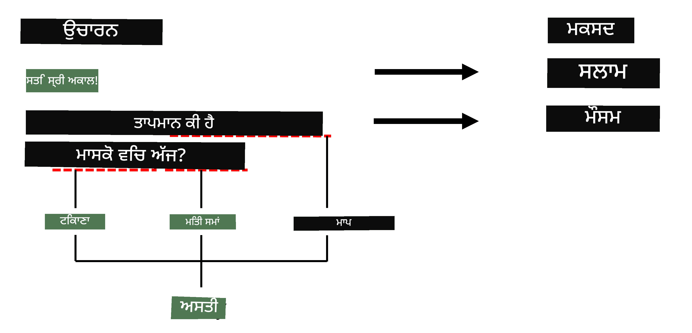

# ਨਾਂਦਤ ਇਕਾਈ ਪਛਾਣ (Named Entity Recognition)

ਅੱਜ ਤੱਕ, ਅਸੀਂ ਜ਼ਿਆਦਾਤਰ ਇੱਕ NLP ਕੰਮ 'ਤੇ ਧਿਆਨ ਦਿੱਤਾ ਹੈ - ਵਰਗੀਕਰਨ। ਹਾਲਾਂਕਿ, ਨਰਲ ਨੈੱਟਵਰਕ ਦੀ ਮਦਦ ਨਾਲ ਹੋਰ NLP ਕੰਮ ਵੀ ਕੀਤੇ ਜਾ ਸਕਦੇ ਹਨ। ਉਹਨਾਂ ਵਿੱਚੋਂ ਇੱਕ ਕੰਮ ਹੈ **[ਨਾਂਦਤ ਇਕਾਈ ਪਛਾਣ](https://wikipedia.org/wiki/Named-entity_recognition)** (NER), ਜੋ ਪਾਠ ਵਿੱਚ ਖਾਸ ਇਕਾਈਆਂ ਦੀ ਪਛਾਣ ਕਰਨ ਨਾਲ ਸਬੰਧਿਤ ਹੈ, ਜਿਵੇਂ ਕਿ ਸਥਾਨ, ਵਿਅਕਤੀ ਦੇ ਨਾਮ, ਮਿਤੀ-ਸਮਾਂ ਅੰਤਰਾਲ, ਰਸਾਇਣਕ ਫਾਰਮੂਲੇ ਆਦਿ।

## [ਪੜ੍ਹਾਈ ਤੋਂ ਪਹਿਲਾਂ ਕਵਿਜ਼](https://ff-quizzes.netlify.app/en/ai/quiz/37)

## NER ਦੀ ਵਰਤੋਂ ਦਾ ਉਦਾਹਰਨ

ਕਲਪਨਾ ਕਰੋ ਕਿ ਤੁਸੀਂ ਇੱਕ ਕੁਦਰਤੀ ਭਾਸ਼ਾ ਚੈਟ ਬੌਟ ਵਿਕਸਿਤ ਕਰਨਾ ਚਾਹੁੰਦੇ ਹੋ, ਜਿਵੇਂ ਕਿ ਐਮਾਜ਼ਾਨ ਐਲੇਕਸਾ ਜਾਂ ਗੂਗਲ ਅਸਿਸਟੈਂਟ। ਸਮਾਰਟ ਚੈਟ ਬੌਟ ਇਸ ਤਰ੍ਹਾਂ ਕੰਮ ਕਰਦੇ ਹਨ ਕਿ ਉਹ ਵਰਤੋਂਕਾਰ ਦੀ ਗੱਲ ਨੂੰ ਸਮਝਣ ਦੀ ਕੋਸ਼ਿਸ਼ ਕਰਦੇ ਹਨ, ਜਿਸ ਲਈ ਉਹ ਇਨਪੁਟ ਵਾਕ 'ਤੇ ਟੈਕਸਟ ਵਰਗੀਕਰਨ ਕਰਦੇ ਹਨ। ਇਸ ਵਰਗੀਕਰਨ ਦਾ ਨਤੀਜਾ **ਇਰਾਦਾ (intent)** ਹੁੰਦਾ ਹੈ, ਜੋ ਇਹ ਨਿਰਧਾਰਤ ਕਰਦਾ ਹੈ ਕਿ ਚੈਟ ਬੌਟ ਨੂੰ ਕੀ ਕਰਨਾ ਚਾਹੀਦਾ ਹੈ।

> ਲੇਖਕ ਦੁਆਰਾ ਤਸਵੀਰ

ਹਾਲਾਂਕਿ, ਵਰਤੋਂਕਾਰ ਵਾਕ ਦੇ ਹਿੱਸੇ ਵਜੋਂ ਕੁਝ ਪੈਰਾਮੀਟਰ ਵੀ ਦੇ ਸਕਦਾ ਹੈ। ਉਦਾਹਰਨ ਵਜੋਂ, ਜਦੋਂ ਕੋਈ ਮੌਸਮ ਬਾਰੇ ਪੁੱਛਦਾ ਹੈ, ਉਹ ਸਥਾਨ ਜਾਂ ਮਿਤੀ ਦੱਸ ਸਕਦਾ ਹੈ। ਬੌਟ ਨੂੰ ਉਹਨਾਂ ਇਕਾਈਆਂ ਨੂੰ ਸਮਝਣ ਅਤੇ ਕਾਰਵਾਈ ਕਰਨ ਤੋਂ ਪਹਿਲਾਂ ਪੈਰਾਮੀਟਰ ਸਲਾਟ ਭਰਨ ਦੇ ਯੋਗ ਹੋਣਾ ਚਾਹੀਦਾ ਹੈ। ਇਹੀ ਜਗ੍ਹਾ ਹੈ ਜਿੱਥੇ NER ਦੀ ਲੋੜ ਪੈਂਦੀ ਹੈ।

> ✅ ਇੱਕ ਹੋਰ ਉਦਾਹਰਨ ਹੋ ਸਕਦੀ ਹੈ [ਵਿਗਿਆਨਕ ਚਿਕਿਤਸਾ ਪੇਪਰਾਂ ਦਾ ਵਿਸ਼ਲੇਸ਼ਣ](https://soshnikov.com/science/analyzing-medical-papers-with-azure-and-text-analytics-for-health/)। ਇੱਥੇ ਸਾਨੂੰ ਖਾਸ ਤੌਰ 'ਤੇ ਚਿਕਿਤਸਾ ਸ਼ਬਦਾਵਲੀ, ਜਿਵੇਂ ਬਿਮਾਰੀਆਂ ਅਤੇ ਦਵਾਈਆਂ ਦੇ ਨਾਮ, ਦੀ ਪਛਾਣ ਕਰਨ ਦੀ ਲੋੜ ਹੁੰਦੀ ਹੈ। ਜਦੋਂ ਕਿ ਕੁਝ ਬਿਮਾਰੀਆਂ ਨੂੰ ਸਬਸਟਰਿੰਗ ਖੋਜ ਨਾਲ ਕੱਢਿਆ ਜਾ ਸਕਦਾ ਹੈ, ਜਟਿਲ ਇਕਾਈਆਂ ਜਿਵੇਂ ਕਿ ਰਸਾਇਣਕ ਯੋਗਿਕ ਅਤੇ ਦਵਾਈਆਂ ਦੇ ਨਾਮ ਲਈ ਇੱਕ ਵਧੇਰੇ ਜਟਿਲ ਪਹੁੰਚ ਦੀ ਲੋੜ ਹੁੰਦੀ ਹੈ।

## NER ਨੂੰ ਟੋਕਨ ਵਰਗੀਕਰਨ ਵਜੋਂ ਸਮਝਣਾ

NER ਮਾਡਲ ਅਸਲ ਵਿੱਚ **ਟੋਕਨ ਵਰਗੀਕਰਨ ਮਾਡਲ** ਹੁੰਦੇ ਹਨ, ਕਿਉਂਕਿ ਸਾਨੂੰ ਹਰ ਇਨਪੁਟ ਟੋਕਨ ਲਈ ਇਹ ਫੈਸਲਾ ਕਰਨਾ ਹੁੰਦਾ ਹੈ ਕਿ ਕੀ ਇਹ ਕਿਸੇ ਇਕਾਈ ਨਾਲ ਸਬੰਧਿਤ ਹੈ ਜਾਂ ਨਹੀਂ, ਅਤੇ ਜੇ ਹੈ - ਤਾਂ ਕਿਹੜੀ ਇਕਾਈ ਵਰਗ ਨਾਲ।

ਇਹ ਪੇਪਰ ਸਿਰਲੇਖ ਦੇਖੋ:

**Tricuspid valve regurgitation** ਅਤੇ **lithium carbonate** **toxicity** ਇੱਕ ਨਵਜਾਤ ਸ਼ਿਸ਼ੂ ਵਿੱਚ।

ਇਥੇ ਇਕਾਈਆਂ ਹਨ:

* Tricuspid valve regurgitation ਇੱਕ ਬਿਮਾਰੀ ਹੈ (`DIS`)
* Lithium carbonate ਇੱਕ ਰਸਾਇਣਕ ਪਦਾਰਥ ਹੈ (`CHEM`)
* Toxicity ਵੀ ਇੱਕ ਬਿਮਾਰੀ ਹੈ (`DIS`)

ਧਿਆਨ ਦਿਓ ਕਿ ਇੱਕ ਇਕਾਈ ਕਈ ਟੋਕਨਾਂ 'ਤੇ ਫੈਲ ਸਕਦੀ ਹੈ। ਅਤੇ, ਜਿਵੇਂ ਇਸ ਮਾਮਲੇ ਵਿੱਚ, ਸਾਨੂੰ ਦੋ ਲਗਾਤਾਰ ਇਕਾਈਆਂ ਵਿੱਚ ਫਰਕ ਕਰਨਾ ਪੈਂਦਾ ਹੈ। ਇਸ ਲਈ, ਹਰ ਇਕਾਈ ਲਈ ਦੋ ਵਰਗਾਂ ਦੀ ਵਰਤੋਂ ਕਰਨਾ ਆਮ ਹੈ - ਇੱਕ ਜੋ ਇਕਾਈ ਦੇ ਪਹਿਲੇ ਟੋਕਨ ਨੂੰ ਦਰਸਾਉਂਦਾ ਹੈ (ਅਕਸਰ `B-` ਪ੍ਰੀਫਿਕਸ ਵਰਤਿਆ ਜਾਂਦਾ ਹੈ, **ਸ਼ੁਰੂਆਤ** ਲਈ), ਅਤੇ ਦੂਜਾ - ਇਕਾਈ ਦੇ ਅੰਦਰਲੇ ਟੋਕਨ ਲਈ (`I-`, **ਅੰਦਰਲਾ ਟੋਕਨ** ਲਈ)। ਅਸੀਂ `O` ਵਰਗ ਦੀ ਵਰਤੋਂ ਕਰਦੇ ਹਾਂ ਸਾਰੇ **ਹੋਰ** ਟੋਕਨਾਂ ਨੂੰ ਦਰਸਾਉਣ ਲਈ। ਇਸ ਤਰ੍ਹਾਂ ਦੇ ਟੋਕਨ ਟੈਗਿੰਗ ਨੂੰ [BIO ਟੈਗਿੰਗ](https://en.wikipedia.org/wiki/Inside%E2%80%93outside%E2%80%93beginning_(tagging)) (ਜਾਂ IOB) ਕਿਹਾ ਜਾਂਦਾ ਹੈ। ਜਦੋਂ ਟੈਗ ਕੀਤਾ ਜਾਂਦਾ ਹੈ, ਸਾਡਾ ਸਿਰਲੇਖ ਇਸ ਤਰ੍ਹਾਂ ਲੱਗੇਗਾ:

Token | Tag
------|-----
Tricuspid | B-DIS
valve | I-DIS
regurgitation | I-DIS
and | O
lithium | B-CHEM
carbonate | I-CHEM
toxicity | B-DIS
in | O
a | O
newborn | O
infant | O
. | O

ਕਿਉਂਕਿ ਸਾਨੂੰ ਟੋਕਨਾਂ ਅਤੇ ਵਰਗਾਂ ਦੇ ਵਿਚਕਾਰ ਇੱਕ-ਤੋਂ-ਇੱਕ ਸੰਬੰਧ ਬਣਾਉਣਾ ਹੁੰਦਾ ਹੈ, ਅਸੀਂ ਇਸ ਤਸਵੀਰ ਤੋਂ ਇੱਕ ਸਹੀ **ਬਹੁਤ-ਤੋਂ-ਬਹੁਤ** ਨਰਲ ਨੈੱਟਵਰਕ ਮਾਡਲ ਨੂੰ ਟ੍ਰੇਨ ਕਰ ਸਕਦੇ ਹਾਂ:

> *ਤਸਵੀਰ [ਇਸ ਬਲੌਗ ਪੋਸਟ](http://karpathy.github.io/2015/05/21/rnn-effectiveness/) ਤੋਂ [Andrej Karpathy](http://karpathy.github.io/) ਦੁਆਰਾ। NER ਟੋਕਨ ਵਰਗੀਕਰਨ ਮਾਡਲ ਇਸ ਤਸਵੀਰ ਦੇ ਸੱਜੇ ਪਾਸੇ ਵਾਲੇ ਨੈੱਟਵਰਕ ਆਰਕੀਟੈਕਚਰ ਨਾਲ ਮਿਲਦੇ ਹਨ।*

## NER ਮਾਡਲਾਂ ਦੀ ਟ੍ਰੇਨਿੰਗ

ਕਿਉਂਕਿ NER ਮਾਡਲ ਅਸਲ ਵਿੱਚ ਇੱਕ ਟੋਕਨ ਵਰਗੀਕਰਨ ਮਾਡਲ ਹੈ, ਅਸੀਂ ਇਸ ਕੰਮ ਲਈ ਉਹ RNN ਵਰਤ ਸਕਦੇ ਹਾਂ ਜਿਨ੍ਹਾਂ ਨਾਲ ਅਸੀਂ ਪਹਿਲਾਂ ਹੀ ਜਾਣੂ ਹਾਂ। ਇਸ ਮਾਮਲੇ ਵਿੱਚ, ਰਿਕਰੰਟ ਨੈੱਟਵਰਕ ਦਾ ਹਰ ਬਲੌਕ ਟੋਕਨ ID ਵਾਪਸ ਕਰੇਗਾ। ਹੇਠਾਂ ਦਿੱਤੇ ਨੋਟਬੁੱਕ ਵਿੱਚ ਦਿਖਾਇਆ ਗਿਆ ਹੈ ਕਿ ਟੋਕਨ ਵਰਗੀਕਰਨ ਲਈ LSTM ਨੂੰ ਕਿਵੇਂ ਟ੍ਰੇਨ ਕਰਨਾ ਹੈ।

## ✍️ ਉਦਾਹਰਨ ਨੋਟਬੁੱਕ: NER

ਹੇਠਾਂ ਦਿੱਤੇ ਨੋਟਬੁੱਕ ਵਿੱਚ ਆਪਣੀ ਸਿੱਖਿਆ ਜਾਰੀ ਰੱਖੋ:

* [NER ਨਾਲ TensorFlow](NER-TF.ipynb)

## ਨਿਸ਼ਕਰਸ਼

ਇੱਕ NER ਮਾਡਲ ਇੱਕ **ਟੋਕਨ ਵਰਗੀਕਰਨ ਮਾਡਲ** ਹੈ, ਜਿਸਦਾ ਅਰਥ ਹੈ ਕਿ ਇਸਨੂੰ ਟੋਕਨ ਵਰਗੀਕਰਨ ਕਰਨ ਲਈ ਵਰਤਿਆ ਜਾ ਸਕਦਾ ਹੈ। ਇਹ NLP ਵਿੱਚ ਇੱਕ ਬਹੁਤ ਆਮ ਕੰਮ ਹੈ, ਜੋ ਪਾਠ ਵਿੱਚ ਖਾਸ ਇਕਾਈਆਂ ਦੀ ਪਛਾਣ ਕਰਨ ਵਿੱਚ ਮਦਦ ਕਰਦਾ ਹੈ, ਜਿਵੇਂ ਸਥਾਨ, ਨਾਮ, ਮਿਤੀਆਂ ਆਦਿ।

## 🚀 ਚੁਣੌਤੀ

ਹੇਠਾਂ ਦਿੱਤੇ ਅਸਾਈਨਮੈਂਟ ਨੂੰ ਪੂਰਾ ਕਰੋ ਜਿਸ ਵਿੱਚ ਤੁਹਾਨੂੰ ਚਿਕਿਤਸਾ ਸ਼ਬਦਾਵਲੀ ਲਈ ਇੱਕ ਨਾਂਦਤ ਇਕਾਈ ਪਛਾਣ ਮਾਡਲ ਟ੍ਰੇਨ ਕਰਨਾ ਹੈ, ਅਤੇ ਫਿਰ ਇਸਨੂੰ ਇੱਕ ਵੱਖਰੇ ਡਾਟਾਸੈਟ 'ਤੇ ਅਜ਼ਮਾਓ।

## [ਪੜ੍ਹਾਈ ਤੋਂ ਬਾਅਦ ਕਵਿਜ਼](https://ff-quizzes.netlify.app/en/ai/quiz/38)

## ਸਮੀਖਿਆ ਅਤੇ ਸਵੈ ਅਧਿਐਨ

[The Unreasonable Effectiveness of Recurrent Neural Networks](http://karpathy.github.io/2015/05/21/rnn-effectiveness/) ਬਲੌਗ ਨੂੰ ਪੜ੍ਹੋ ਅਤੇ ਉਸ ਲੇਖ ਵਿੱਚ ਦਿੱਤੇ ਹੋਰ ਪੜ੍ਹਾਈ ਦੇ ਸੈਕਸ਼ਨ ਦੇ ਨਾਲ ਅੱਗੇ ਵਧੋ ਤਾਂ ਜੋ ਆਪਣਾ ਗਿਆਨ ਗਹਿਰਾ ਕਰ ਸਕੋ।

## [ਅਸਾਈਨਮੈਂਟ](lab/README.md)

ਇਸ ਪਾਠ ਦੇ ਅਸਾਈਨਮੈਂਟ ਵਿੱਚ, ਤੁਹਾਨੂੰ ਇੱਕ ਚਿਕਿਤਸਾ ਇਕਾਈ ਪਛਾਣ ਮਾਡਲ ਟ੍ਰੇਨ ਕਰਨਾ ਹੋਵੇਗਾ। ਤੁਸੀਂ ਇਸ ਪਾਠ ਵਿੱਚ ਵਰਣਨ ਕੀਤੇ ਗਏ ਤਰੀਕੇ ਨਾਲ LSTM ਮਾਡਲ ਟ੍ਰੇਨ ਕਰਕੇ ਸ਼ੁਰੂ ਕਰ ਸਕਦੇ ਹੋ, ਅਤੇ ਫਿਰ BERT ਟ੍ਰਾਂਸਫਾਰਮਰ ਮਾਡਲ ਦੀ ਵਰਤੋਂ ਕਰ ਸਕਦੇ ਹੋ। ਸਾਰੇ ਵੇਰਵੇ ਪ੍ਰਾਪਤ ਕਰਨ ਲਈ [ਹਦਾਇਤਾਂ](lab/README.md) ਪੜ੍ਹੋ।

---

