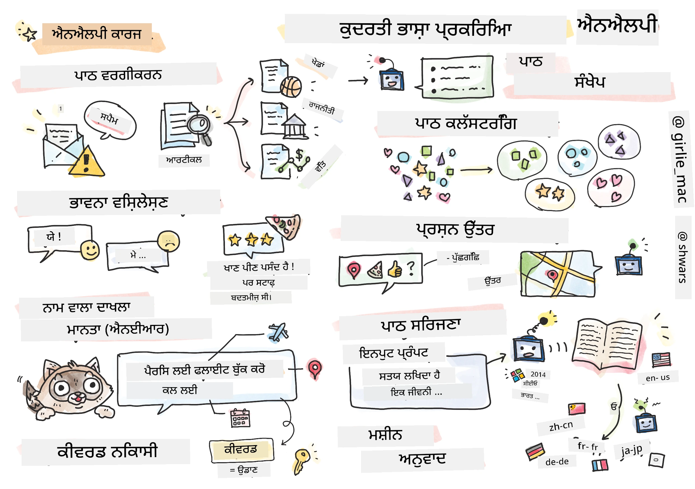

# ਨੈਚਰਲ ਲੈਂਗਵੇਜ ਪ੍ਰੋਸੈਸਿੰਗ



ਇਸ ਸੈਕਸ਼ਨ ਵਿੱਚ, ਅਸੀਂ **ਨੈਚਰਲ ਲੈਂਗਵੇਜ ਪ੍ਰੋਸੈਸਿੰਗ (NLP)** ਨਾਲ ਸੰਬੰਧਿਤ ਟਾਸਕਾਂ ਨੂੰ ਹੱਲ ਕਰਨ ਲਈ ਨਿਊਰਲ ਨੈਟਵਰਕਸ ਦੀ ਵਰਤੋਂ 'ਤੇ ਧਿਆਨ ਦੇਵਾਂਗੇ। ਬਹੁਤ ਸਾਰੇ NLP ਸਮੱਸਿਆਵਾਂ ਹਨ ਜਿਨ੍ਹਾਂ ਨੂੰ ਅਸੀਂ ਚਾਹੁੰਦੇ ਹਾਂ ਕਿ ਕੰਪਿਊਟਰ ਹੱਲ ਕਰ ਸਕਣ:

* **ਟੈਕਸਟ ਕਲਾਸੀਫਿਕੇਸ਼ਨ** ਇੱਕ ਆਮ ਕਲਾਸੀਫਿਕੇਸ਼ਨ ਸਮੱਸਿਆ ਹੈ ਜੋ ਟੈਕਸਟ ਸੀਕਵੈਂਸ ਨਾਲ ਸੰਬੰਧਿਤ ਹੈ। ਉਦਾਹਰਣਾਂ ਵਿੱਚ ਈਮੇਲ ਸੁਨੇਹਿਆਂ ਨੂੰ ਸਪੈਮ ਅਤੇ ਨੋ-ਸਪੈਮ ਵਜੋਂ ਕਲਾਸੀਫਾਈ ਕਰਨਾ, ਜਾਂ ਲੇਖਾਂ ਨੂੰ ਖੇਡ, ਕਾਰੋਬਾਰ, ਰਾਜਨੀਤੀ ਆਦਿ ਵਜੋਂ ਸ਼੍ਰੇਣੀਬੱਧ ਕਰਨਾ ਸ਼ਾਮਲ ਹੈ। ਇਸ ਤੋਂ ਇਲਾਵਾ, ਜਦੋਂ ਅਸੀਂ ਚੈਟ ਬੋਟਸ ਵਿਕਸਿਤ ਕਰਦੇ ਹਾਂ, ਤਾਂ ਅਕਸਰ ਸਾਨੂੰ ਸਮਝਣ ਦੀ ਲੋੜ ਹੁੰਦੀ ਹੈ ਕਿ ਉਪਭੋਗਤਾ ਕੀ ਕਹਿਣਾ ਚਾਹੁੰਦਾ ਹੈ—ਇਸ ਮਾਮਲੇ ਵਿੱਚ ਅਸੀਂ **ਇੰਟੈਂਟ ਕਲਾਸੀਫਿਕੇਸ਼ਨ** ਨਾਲ ਨਜਿੱਠ ਰਹੇ ਹਾਂ। ਅਕਸਰ, ਇੰਟੈਂਟ ਕਲਾਸੀਫਿਕੇਸ਼ਨ ਵਿੱਚ ਸਾਨੂੰ ਕਈ ਸ਼੍ਰੇਣੀਆਂ ਨਾਲ ਨਜਿੱਠਣਾ ਪੈਂਦਾ ਹੈ।
* **ਸੈਂਟੀਮੈਂਟ ਵਿਸ਼ਲੇਸ਼ਣ** ਇੱਕ ਆਮ ਰਿਗ੍ਰੈਸ਼ਨ ਸਮੱਸਿਆ ਹੈ, ਜਿੱਥੇ ਸਾਨੂੰ ਇੱਕ ਗਿਣਤੀ (ਸੈਂਟੀਮੈਂਟ) ਨੂੰ ਜੁੜਨਾ ਪੈਂਦਾ ਹੈ ਜੋ ਵਾਕ ਦੇ ਅਰਥ ਦੇ ਕਿੰਨੇ ਸਕਾਰਾਤਮਕ/ਨਕਾਰਾਤਮਕ ਹੋਣ ਨੂੰ ਦਰਸਾਉਂਦਾ ਹੈ। ਸੈਂਟੀਮੈਂਟ ਵਿਸ਼ਲੇਸ਼ਣ ਦਾ ਇੱਕ ਹੋਰ ਉੱਚਤਮ ਸੰਸਕਰਣ **ਐਸਪੈਕਟ-ਅਧਾਰਿਤ ਸੈਂਟੀਮੈਂਟ ਵਿਸ਼ਲੇਸ਼ਣ** (ABSA) ਹੈ, ਜਿੱਥੇ ਸਾਨੂੰ ਸੈਂਟੀਮੈਂਟ ਨੂੰ ਪੂਰੇ ਵਾਕ ਨਾਲ ਨਹੀਂ, ਸਗੋਂ ਇਸਦੇ ਵੱਖ-ਵੱਖ ਹਿੱਸਿਆਂ (ਐਸਪੈਕਟਸ) ਨਾਲ ਜੋੜਨਾ ਹੁੰਦਾ ਹੈ, ਜਿਵੇਂ ਕਿ *ਇਸ ਰੈਸਟੋਰੈਂਟ ਵਿੱਚ, ਮੈਨੂੰ ਖਾਣਾ ਪਸੰਦ ਆਇਆ, ਪਰ ਮਾਹੌਲ ਬਹੁਤ ਖਰਾਬ ਸੀ*।
* **ਨਾਮਤ ਐਨਟੀਟੀ ਪਛਾਣ** (NER) ਟੈਕਸਟ ਵਿੱਚ ਕੁਝ ਐਨਟੀਟੀਆਂ ਨੂੰ ਕੱਢਣ ਦੀ ਸਮੱਸਿਆ ਨੂੰ ਦਰਸਾਉਂਦਾ ਹੈ। ਉਦਾਹਰਣ ਲਈ, ਸਾਨੂੰ ਇਹ ਸਮਝਣ ਦੀ ਲੋੜ ਹੋ ਸਕਦੀ ਹੈ ਕਿ *ਮੈਨੂੰ ਕੱਲ੍ਹ ਪੈਰਿਸ ਜਾਣਾ ਹੈ* ਵਾਕ ਵਿੱਚ *ਕੱਲ੍ਹ* DATE ਨੂੰ ਦਰਸਾਉਂਦਾ ਹੈ, ਅਤੇ *ਪੈਰਿਸ* LOCATION ਹੈ।  
* **ਕੀਵਰਡ ਕੱਢਣਾ** NER ਦੇ ਸਮਾਨ ਹੈ, ਪਰ ਸਾਨੂੰ ਵਾਕ ਦੇ ਅਰਥ ਲਈ ਮਹੱਤਵਪੂਰਨ ਸ਼ਬਦਾਂ ਨੂੰ ਆਪਣੇ ਆਪ ਕੱਢਣਾ ਹੁੰਦਾ ਹੈ, ਬਿਨਾਂ ਕਿਸੇ ਖਾਸ ਐਨਟੀਟੀ ਕਿਸਮਾਂ ਲਈ ਪ੍ਰੀ-ਟ੍ਰੇਨਿੰਗ ਕੀਤੇ।
* **ਟੈਕਸਟ ਕਲੱਸਟਰਿੰਗ** ਤਦ ਉਪਯੋਗੀ ਹੋ ਸਕਦੀ ਹੈ ਜਦੋਂ ਅਸੀਂ ਸਮਾਨ ਵਾਕਾਂ ਨੂੰ ਇਕੱਠਾ ਕਰਨਾ ਚਾਹੁੰਦੇ ਹਾਂ, ਉਦਾਹਰਣ ਲਈ, ਤਕਨੀਕੀ ਸਹਾਇਤਾ ਗੱਲਬਾਤਾਂ ਵਿੱਚ ਸਮਾਨ ਬੇਨਤੀਆਂ।
* **ਸਵਾਲ ਜਵਾਬ** ਇੱਕ ਮਾਡਲ ਦੀ ਸਮਰੱਥਾ ਨੂੰ ਦਰਸਾਉਂਦਾ ਹੈ ਕਿ ਉਹ ਖਾਸ ਸਵਾਲ ਦਾ ਜਵਾਬ ਦੇ ਸਕੇ। ਮਾਡਲ ਨੂੰ ਇੱਕ ਟੈਕਸਟ ਪੈਸੇਜ ਅਤੇ ਸਵਾਲ ਇਨਪੁਟ ਵਜੋਂ ਮਿਲਦੇ ਹਨ, ਅਤੇ ਇਸਨੂੰ ਟੈਕਸਟ ਵਿੱਚ ਉਹ ਜਗ੍ਹਾ ਪ੍ਰਦਾਨ ਕਰਨੀ ਹੁੰਦੀ ਹੈ ਜਿੱਥੇ ਸਵਾਲ ਦਾ ਜਵਾਬ ਮੌਜੂਦ ਹੈ (ਜਾਂ, ਕਈ ਵਾਰ, ਜਵਾਬ ਟੈਕਸਟ ਜਨਰੇਟ ਕਰਨਾ ਹੁੰਦਾ ਹੈ)।
* **ਟੈਕਸਟ ਜਨਰੇਸ਼ਨ** ਮਾਡਲ ਦੀ ਸਮਰੱਥਾ ਹੈ ਕਿ ਉਹ ਨਵਾਂ ਟੈਕਸਟ ਜਨਰੇਟ ਕਰ ਸਕੇ। ਇਸਨੂੰ ਇੱਕ ਕਲਾਸੀਫਿਕੇਸ਼ਨ ਟਾਸਕ ਵਜੋਂ ਮੰਨਿਆ ਜਾ ਸਕਦਾ ਹੈ ਜੋ ਕੁਝ *ਟੈਕਸਟ ਪ੍ਰੋਮਪਟ* ਦੇ ਆਧਾਰ 'ਤੇ ਅਗਲਾ ਅੱਖਰ/ਸ਼ਬਦ ਅਨੁਮਾਨ ਲਗਾਉਂਦਾ ਹੈ। ਉੱਚਤਮ ਟੈਕਸਟ ਜਨਰੇਸ਼ਨ ਮਾਡਲ, ਜਿਵੇਂ GPT-3, **ਪ੍ਰੋਮਪਟ ਪ੍ਰੋਗਰਾਮਿੰਗ** ਜਾਂ **ਪ੍ਰੋਮਪਟ ਇੰਜੀਨੀਅਰਿੰਗ** ਵਰਗੇ ਤਕਨੀਕਾਂ ਦੀ ਵਰਤੋਂ ਕਰਕੇ ਹੋਰ NLP ਟਾਸਕ ਹੱਲ ਕਰ ਸਕਦੇ ਹਨ।
* **ਟੈਕਸਟ ਸੰਖੇਪਣ** ਇੱਕ ਤਕਨੀਕ ਹੈ ਜਦੋਂ ਅਸੀਂ ਚਾਹੁੰਦੇ ਹਾਂ ਕਿ ਕੰਪਿਊਟਰ ਲੰਬੇ ਟੈਕਸਟ ਨੂੰ "ਪੜ੍ਹੇ" ਅਤੇ ਇਸਨੂੰ ਕੁਝ ਵਾਕਾਂ ਵਿੱਚ ਸੰਖੇਪ ਕਰੇ।
* **ਮਸ਼ੀਨ ਅਨੁਵਾਦ** ਨੂੰ ਇੱਕ ਭਾਸ਼ਾ ਵਿੱਚ ਟੈਕਸਟ ਸਮਝਣ ਅਤੇ ਦੂਜੀ ਭਾਸ਼ਾ ਵਿੱਚ ਟੈਕਸਟ ਜਨਰੇਸ਼ਨ ਦੇ ਸੰਯੋਗ ਵਜੋਂ ਦੇਖਿਆ ਜਾ ਸਕਦਾ ਹੈ।

ਸ਼ੁਰੂ ਵਿੱਚ, ਜ਼ਿਆਦਾਤਰ NLP ਟਾਸਕਾਂ ਨੂੰ ਰਵਾਇਤੀ ਤਰੀਕਿਆਂ ਜਿਵੇਂ ਕਿ ਗ੍ਰਾਮਰਾਂ ਦੀ ਵਰਤੋਂ ਕਰਕੇ ਹੱਲ ਕੀਤਾ ਜਾਂਦਾ ਸੀ। ਉਦਾਹਰਣ ਲਈ, ਮਸ਼ੀਨ ਅਨੁਵਾਦ ਵਿੱਚ ਪਾਰਸਰਾਂ ਦੀ ਵਰਤੋਂ ਕੀਤੀ ਜਾਂਦੀ ਸੀ ਜਿਨ੍ਹਾਂ ਸ਼ੁਰੂਆਤੀ ਵਾਕ ਨੂੰ ਇੱਕ ਸਿੰਟੈਕਸ ਟ੍ਰੀ ਵਿੱਚ ਬਦਲਿਆ, ਫਿਰ ਵਾਕ ਦੇ ਅਰਥ ਨੂੰ ਦਰਸਾਉਣ ਲਈ ਉੱਚ ਪੱਧਰ ਦੇ ਸੈਮੈਂਟਿਕ ਸਟ੍ਰਕਚਰ ਕੱਢੇ ਗਏ, ਅਤੇ ਇਸ ਅਰਥ ਅਤੇ ਟਾਰਗਟ ਭਾਸ਼ਾ ਦੇ ਗ੍ਰਾਮਰ ਦੇ ਆਧਾਰ 'ਤੇ ਨਤੀਜਾ ਜਨਰੇਟ ਕੀਤਾ ਗਿਆ। ਅੱਜਕਲ, ਬਹੁਤ ਸਾਰੇ NLP ਟਾਸਕ ਨਿਊਰਲ ਨੈਟਵਰਕਸ ਦੀ ਵਰਤੋਂ ਕਰਕੇ ਜ਼ਿਆਦਾ ਪ੍ਰਭਾਵਸ਼ਾਲੀ ਢੰਗ ਨਾਲ ਹੱਲ ਕੀਤੇ ਜਾਂਦੇ ਹਨ।

> ਬਹੁਤ ਸਾਰੇ ਕਲਾਸੀਕਲ NLP ਤਰੀਕੇ [ਨੈਚਰਲ ਲੈਂਗਵੇਜ ਪ੍ਰੋਸੈਸਿੰਗ ਟੂਲਕਿਟ (NLTK)](https://www.nltk.org) ਪਾਇਥਨ ਲਾਇਬ੍ਰੇਰੀ ਵਿੱਚ ਲਾਗੂ ਕੀਤੇ ਗਏ ਹਨ। ਇੱਕ ਸ਼ਾਨਦਾਰ [NLTK ਬੁੱਕ](https://www.nltk.org/book/) ਆਨਲਾਈਨ ਉਪਲਬਧ ਹੈ ਜੋ ਦਿਖਾਉਂਦੀ ਹੈ ਕਿ ਕਿਵੇਂ ਵੱਖ-ਵੱਖ NLP ਟਾਸਕ NLTK ਦੀ ਵਰਤੋਂ ਕਰਕੇ ਹੱਲ ਕੀਤੇ ਜਾ ਸਕਦੇ ਹਨ।

ਸਾਡੇ ਕੋਰਸ ਵਿੱਚ, ਅਸੀਂ ਮੁੱਖ ਤੌਰ 'ਤੇ NLP ਲਈ ਨਿਊਰਲ ਨੈਟਵਰਕਸ ਦੀ ਵਰਤੋਂ 'ਤੇ ਧਿਆਨ ਦੇਵਾਂਗੇ, ਅਤੇ ਜਿੱਥੇ ਲੋੜ ਹੋਵੇਗੀ, ਅਸੀਂ NLTK ਦੀ ਵਰਤੋਂ ਕਰਾਂਗੇ।

ਅਸੀਂ ਪਹਿਲਾਂ ਹੀ ਸਿੱਖ ਚੁੱਕੇ ਹਾਂ ਕਿ ਟੇਬੂਲਰ ਡੇਟਾ ਅਤੇ ਚਿੱਤਰਾਂ ਨਾਲ ਨਿਊਰਲ ਨੈਟਵਰਕਸ ਦੀ ਵਰਤੋਂ ਕਿਵੇਂ ਕੀਤੀ ਜਾ ਸਕਦੀ ਹੈ। ਉਹ ਡੇਟਾ ਕਿਸਮਾਂ ਅਤੇ ਟੈਕਸਟ ਦੇ ਵਿਚਕਾਰ ਮੁੱਖ ਅੰਤਰ ਇਹ ਹੈ ਕਿ ਟੈਕਸਟ ਇੱਕ ਵੈਰੀਏਬਲ ਲੰਬਾਈ ਦਾ ਸੀਕਵੈਂਸ ਹੈ, ਜਦਕਿ ਚਿੱਤਰਾਂ ਦੇ ਮਾਮਲੇ ਵਿੱਚ ਇਨਪੁਟ ਸਾਈਜ਼ ਪਹਿਲਾਂ ਤੋਂ ਜਾਣਿਆ ਹੁੰਦਾ ਹੈ। ਜਦਕਿ ਕਨਵੋਲੂਸ਼ਨਲ ਨੈਟਵਰਕਸ ਇਨਪੁਟ ਡੇਟਾ ਤੋਂ ਪੈਟਰਨ ਕੱਢ ਸਕਦੇ ਹਨ, ਟੈਕਸਟ ਵਿੱਚ ਪੈਟਰਨ ਹੋਰ ਜਟਿਲ ਹੁੰਦੇ ਹਨ। ਉਦਾਹਰਣ ਲਈ, ਅਸੀਂ ਦੇਖ ਸਕਦੇ ਹਾਂ ਕਿ ਨਕਾਰਾਤਮਕਤਾ ਵਿਸ਼ੇ ਤੋਂ ਕਈ ਸ਼ਬਦਾਂ ਦੁਆਰਾ ਵੱਖ ਹੋ ਸਕਦੀ ਹੈ (ਜਿਵੇਂ *ਮੈਨੂੰ ਸੰਤਰੇ ਪਸੰਦ ਨਹੀਂ*, ਬਨਾਮ *ਮੈਨੂੰ ਉਹ ਵੱਡੇ ਰੰਗੀਨ ਸੁਆਦਿਸ਼ਟ ਸੰਤਰੇ ਪਸੰਦ ਨਹੀਂ*), ਅਤੇ ਇਸਨੂੰ ਫਿਰ ਵੀ ਇੱਕ ਪੈਟਰਨ ਵਜੋਂ ਵਿਆਖਿਆ ਕੀਤਾ ਜਾਣਾ ਚਾਹੀਦਾ ਹੈ। ਇਸ ਲਈ, ਭਾਸ਼ਾ ਨੂੰ ਸੰਭਾਲਣ ਲਈ ਸਾਨੂੰ ਨਿਊਰਲ ਨੈਟਵਰਕਸ ਦੇ ਨਵੇਂ ਕਿਸਮਾਂ, ਜਿਵੇਂ ਕਿ *ਰੀਕਰਨਟ ਨੈਟਵਰਕਸ* ਅਤੇ *ਟ੍ਰਾਂਸਫਾਰਮਰਸ* ਦੀ ਪੇਸ਼ਕਸ਼ ਕਰਨ ਦੀ ਲੋੜ ਹੈ।

## ਲਾਇਬ੍ਰੇਰੀਆਂ ਇੰਸਟਾਲ ਕਰੋ

ਜੇਕਰ ਤੁਸੀਂ ਇਸ ਕੋਰਸ ਨੂੰ ਚਲਾਉਣ ਲਈ ਸਥਾਨਕ ਪਾਇਥਨ ਇੰਸਟਾਲੇਸ਼ਨ ਦੀ ਵਰਤੋਂ ਕਰ ਰਹੇ ਹੋ, ਤਾਂ ਤੁਹਾਨੂੰ NLP ਲਈ ਸਾਰੀਆਂ ਲੋੜੀਂਦੀਆਂ ਲਾਇਬ੍ਰੇਰੀਆਂ ਹੇਠਾਂ ਦਿੱਤੇ ਕਮਾਂਡਾਂ ਦੀ ਵਰਤੋਂ ਕਰਕੇ ਇੰਸਟਾਲ ਕਰਨ ਦੀ ਲੋੜ ਹੋ ਸਕਦੀ ਹੈ:

**ਪਾਈਟਾਰਚ ਲਈ**
```bash
pip install -r requirements-torch.txt
```
**ਟੈਂਸਰਫਲੋ ਲਈ**
```bash
pip install -r requirements-tf.txt
```

> ਤੁਸੀਂ [Microsoft Learn](https://docs.microsoft.com/learn/modules/intro-natural-language-processing-tensorflow/?WT.mc_id=academic-77998-cacaste) 'ਤੇ ਟੈਂਸਰਫਲੋ ਨਾਲ NLP ਦੀ ਕੋਸ਼ਿਸ਼ ਕਰ ਸਕਦੇ ਹੋ।

## GPU ਚੇਤਾਵਨੀ

ਇਸ ਸੈਕਸ਼ਨ ਵਿੱਚ, ਕੁਝ ਉਦਾਹਰਣਾਂ ਵਿੱਚ ਅਸੀਂ ਕਾਫ਼ੀ ਵੱਡੇ ਮਾਡਲਾਂ ਨੂੰ ਟ੍ਰੇਨ ਕਰਾਂਗੇ।
* **GPU-ਸਮਰੱਥ ਕੰਪਿਊਟਰ ਦੀ ਵਰਤੋਂ ਕਰੋ**: ਵੱਡੇ ਮਾਡਲਾਂ ਨਾਲ ਕੰਮ ਕਰਦੇ ਸਮੇਂ ਉਡੀਕ ਦੇ ਸਮੇਂ ਨੂੰ ਘਟਾਉਣ ਲਈ ਆਪਣੇ ਨੋਟਬੁੱਕਸ ਨੂੰ GPU-ਸਮਰੱਥ ਕੰਪਿਊਟਰ 'ਤੇ ਚਲਾਉਣਾ ਸਲਾਹਯੋਗ ਹੈ।
* **GPU ਮੈਮਰੀ ਸੀਮਾਵਾਂ**: GPU 'ਤੇ ਚਲਾਉਣ ਨਾਲ ਉਹ ਸਥਿਤੀਆਂ ਬਣ ਸਕਦੀਆਂ ਹਨ ਜਿੱਥੇ ਤੁਸੀਂ GPU ਮੈਮਰੀ ਖਤਮ ਕਰ ਲੈਂਦੇ ਹੋ, ਖਾਸ ਕਰਕੇ ਵੱਡੇ ਮਾਡਲਾਂ ਨੂੰ ਟ੍ਰੇਨ ਕਰਦੇ ਸਮੇਂ।
* **GPU ਮੈਮਰੀ ਖਪਤ**: ਟ੍ਰੇਨਿੰਗ ਦੌਰਾਨ GPU ਮੈਮਰੀ ਦੀ ਖਪਤ ਕਈ ਕਾਰਕਾਂ 'ਤੇ ਨਿਰਭਰ ਕਰਦੀ ਹੈ, ਜਿਵੇਂ ਕਿ ਮਿਨੀਬੈਚ ਸਾਈਜ਼।
* **ਮਿਨੀਬੈਚ ਸਾਈਜ਼ ਘਟਾਓ**: ਜੇਕਰ ਤੁਹਾਨੂੰ GPU ਮੈਮਰੀ ਸਮੱਸਿਆਵਾਂ ਦਾ ਸਾਹਮਣਾ ਕਰਨਾ ਪੈਂਦਾ ਹੈ, ਤਾਂ ਆਪਣੇ ਕੋਡ ਵਿੱਚ ਮਿਨੀਬੈਚ ਸਾਈਜ਼ ਨੂੰ ਘਟਾਉਣ ਨੂੰ ਇੱਕ ਸੰਭਾਵਿਤ ਹੱਲ ਵਜੋਂ ਵਿਚਾਰ ਕਰੋ।
* **ਟੈਂਸਰਫਲੋ GPU ਮੈਮਰੀ ਰਿਲੀਜ਼**: ਟੈਂਸਰਫਲੋ ਦੇ ਪੁਰਾਣੇ ਸੰਸਕਰਣ ਇੱਕ ਹੀ ਪਾਇਥਨ ਕਰਨਲ ਵਿੱਚ ਕਈ ਮਾਡਲਾਂ ਨੂੰ ਟ੍ਰੇਨ ਕਰਦੇ ਸਮੇਂ GPU ਮੈਮਰੀ ਨੂੰ ਸਹੀ ਤਰੀਕੇ ਨਾਲ ਰਿਲੀਜ਼ ਨਹੀਂ ਕਰ ਸਕਦੇ। GPU ਮੈਮਰੀ ਦੀ ਵਰਤੋਂ ਨੂੰ ਪ੍ਰਭਾਵਸ਼ਾਲੀ ਢੰਗ ਨਾਲ ਪ੍ਰਬੰਧਿਤ ਕਰਨ ਲਈ, ਤੁਸੀਂ ਟੈਂਸਰਫਲੋ ਨੂੰ GPU ਮੈਮਰੀ ਨੂੰ ਸਿਰਫ ਜਦੋਂ ਲੋੜ ਹੋਵੇ ਤਦ ਹੀ ਅਲੋਕੇਟ ਕਰਨ ਲਈ ਸੰਰਚਿਤ ਕਰ ਸਕਦੇ ਹੋ।
* **ਕੋਡ ਸ਼ਾਮਲ ਕਰੋ**: ਟੈਂਸਰਫਲੋ ਨੂੰ GPU ਮੈਮਰੀ ਅਲੋਕੇਸ਼ਨ ਨੂੰ ਸਿਰਫ ਜਦੋਂ ਲੋੜ ਹੋਵੇ ਤਦ ਵਧਾਉਣ ਲਈ, ਹੇਠਾਂ ਦਿੱਤਾ ਕੋਡ ਆਪਣੇ ਨੋਟਬੁੱਕਸ ਵਿੱਚ ਸ਼ਾਮਲ ਕਰੋ:

```python
physical_devices = tf.config.list_physical_devices('GPU') 
if len(physical_devices)>0:
    tf.config.experimental.set_memory_growth(physical_devices[0], True) 
```

ਜੇਕਰ ਤੁਸੀਂ ਕਲਾਸੀਕਲ ML ਦ੍ਰਿਸ਼ਟੀਕੋਣ ਤੋਂ NLP ਬਾਰੇ ਸਿੱਖਣ ਵਿੱਚ ਰੁਚੀ ਰੱਖਦੇ ਹੋ, ਤਾਂ [ਇਹ ਪਾਠਾਂ ਦੀ ਸੂਟ](https://github.com/microsoft/ML-For-Beginners/tree/main/6-NLP) 'ਤੇ ਜਾਓ।

## ਇਸ ਸੈਕਸ਼ਨ ਵਿੱਚ
ਇਸ ਸੈਕਸ਼ਨ ਵਿੱਚ ਅਸੀਂ ਸਿੱਖਾਂਗੇ:

* [ਟੈਕਸਟ ਨੂੰ ਟੈਂਸਰ ਵਜੋਂ ਦਰਸਾਉਣਾ](13-TextRep/README.md)
* [ਵਰਡ ਐਮਬੈਡਿੰਗ](14-Emdeddings/README.md)
* [ਭਾਸ਼ਾ ਮਾਡਲਿੰਗ](15-LanguageModeling/README.md)
* [ਰੀਕਰਨਟ ਨਿਊਰਲ ਨੈਟਵਰਕਸ](16-RNN/README.md)
* [ਜਨਰੇਟਿਵ ਨੈਟਵਰਕਸ](17-GenerativeNetworks/README.md)
* [ਟ੍ਰਾਂਸਫਾਰਮਰਸ](18-Transformers/README.md)

**ਅਸਵੀਕਰਤਾ**:  
ਇਹ ਦਸਤਾਵੇਜ਼ AI ਅਨੁਵਾਦ ਸੇਵਾ [Co-op Translator](https://github.com/Azure/co-op-translator) ਦੀ ਵਰਤੋਂ ਕਰਕੇ ਅਨੁਵਾਦ ਕੀਤਾ ਗਿਆ ਹੈ। ਹਾਲਾਂਕਿ ਅਸੀਂ ਸਹੀ ਹੋਣ ਦੀ ਕੋਸ਼ਿਸ਼ ਕਰਦੇ ਹਾਂ, ਕਿਰਪਾ ਕਰਕੇ ਧਿਆਨ ਦਿਓ ਕਿ ਸਵੈਚਾਲਿਤ ਅਨੁਵਾਦਾਂ ਵਿੱਚ ਗਲਤੀਆਂ ਜਾਂ ਅਸੁਚੱਜੇਪਣ ਹੋ ਸਕਦੇ ਹਨ। ਮੂਲ ਦਸਤਾਵੇਜ਼ ਨੂੰ ਇਸਦੀ ਮੂਲ ਭਾਸ਼ਾ ਵਿੱਚ ਅਧਿਕਾਰਤ ਸਰੋਤ ਮੰਨਿਆ ਜਾਣਾ ਚਾਹੀਦਾ ਹੈ। ਮਹੱਤਵਪੂਰਨ ਜਾਣਕਾਰੀ ਲਈ, ਪੇਸ਼ੇਵਰ ਮਨੁੱਖੀ ਅਨੁਵਾਦ ਦੀ ਸਿਫਾਰਸ਼ ਕੀਤੀ ਜਾਂਦੀ ਹੈ। ਇਸ ਅਨੁਵਾਦ ਦੀ ਵਰਤੋਂ ਤੋਂ ਪੈਦਾ ਹੋਣ ਵਾਲੇ ਕਿਸੇ ਵੀ ਗਲਤਫਹਿਮੀ ਜਾਂ ਗਲਤ ਵਿਆਖਿਆ ਲਈ ਅਸੀਂ ਜ਼ਿੰਮੇਵਾਰ ਨਹੀਂ ਹਾਂ।