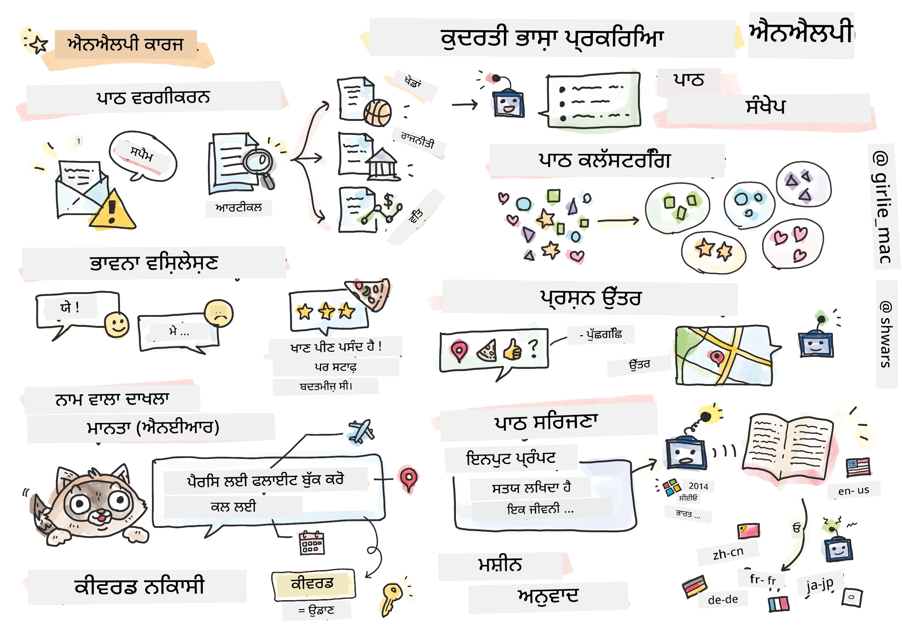

# ਪ੍ਰਾਕ੍ਰਿਤਿਕ ਭਾਸ਼ਾ ਪ੍ਰਕਿਰਿਆ



ਇਸ ਭਾਗ ਵਿੱਚ, ਅਸੀਂ **ਪ੍ਰਾਕ੍ਰਿਤਿਕ ਭਾਸ਼ਾ ਪ੍ਰਕਿਰਿਆ (NLP)** ਨਾਲ ਸੰਬੰਧਤ ਕਾਰਜਾਂ ਨੂੰ ਸੰਭਾਲਣ ਲਈ ਨਿਊਰਲ ਨੈੱਟਵਰਕਾਂ ਦੀ ਵਰਤੋਂ 'ਤੇ ਧਿਆਨ ਕੇਂਦਰਿਤ ਕਰਾਂਗੇ। ਐਸੇ ਬਹੁਤ ਸਾਰੇ NLP ਸਮੱਸਿਆਵਾਂ ਹਨ ਜੋ ਅਸੀਂ ਕਮਪਿਊਟਰਾਂ ਨੂੰ ਹੱਲ ਕਰਨ ਯੋਗ ਬਣਾਉਣਾ ਚਾਹੁੰਦੇ ਹਾਂ:

* **ਟੈਕਸਟ ਵਰਗੀਕਰਨ** ਟੈਕਸਟ ਕ੍ਰਮਾਂਕਾਂ ਨਾਲ ਸੰਬੰਧਿਤ ਇੱਕ ਆਮ ਵਰਗੀਕਰਨ ਸਮੱਸਿਆ ਹੈ। ਉਦਾਹਰਨਾਂ ਵਿੱਚ ਈਮੇਲ ਸੁਨੇਹਿਆਂ ਨੂੰ ਸਪੈਮ ਵਾਂਗ ਵੱਖ ਕਰਨਾ ਜਾਂ ਲੇਖਾਂ ਨੂੰ ਖੇਡ, ਕਾਰੋਬਾਰ, ਰਾਜਨੀਤੀ ਆਦਿ ਕਿਸਮਾਂ 'ਚ ਵਰਗੀਕਰਨ ਕਰਨਾ ਸ਼ਾਮਲ ਹੈ। ਪਰਲੇ, ਜਦੋਂ ਚੈਟ ਬੋਟ ਵਿਕਸਤ ਕਰਦੇ ਹਾਂ, ਅਸੀਂ ਅਕਸਰ ਸਮਝਣਾ ਚਾਹੁੰਦੇ ਹਾਂ ਕਿ ਉਪਭੋਗਤਾ ਕੀ ਕਹਿਣਾ ਚਾਹੁੰਦਾ ਸੀ — ਇਸ ਸੰਦਰਭ ਵਿੱਚ ਅਸੀਂ **ਮਕਸਦ ਵਰਗੀਕਰਨ** ਨਾਲ ਨਜਿੱਠ ਰਹੇ ਹਾਂ। ਅਕਸਰ, ਮਕਸਦ ਵਰਗੀਕਰਨ ਵਿੱਚ ਸਾਨੂੰ ਕਈ ਸ਼੍ਰੇਣੀਆਂ ਨਾਲ ਨਜਿੱਠਣਾ ਪੈਂਦਾ ਹੈ।
* **ਭਾਵਨਾ ਵਿਸ਼ਲੇਸ਼ਣ** ਇੱਕ ਆਮ ਰੈਗ੍ਰੈਸ਼ਨ ਸਮੱਸਿਆ ਹੈ, ਜਿੱਥੇ ਸਾਨੂੰ ਇੱਕ ਨੰਬਰ (ਭਾਵਨਾ) ਨਿਰਧਾਰਿਤ ਕਰਨੀ ਹੁੰਦੀ ਹੈ ਜੋ ਕਿ ਇੱਕ ਵਾਕ ਦੇ ਅਰਥ ਦੀ ਕਿੰਨੀ ਸਕਾਰਾਤਮਕ/ਨਕਾਰਾਤਮਕ ਹੈ, ਨੂੰ ਦਰਸਾਉਂਦਾ ਹੈ। ਭਾਵਨਾ ਵਿਸ਼ਲੇਸ਼ਣ ਦਾ ਇੱਕ ਉੱਚ-ਪੱਧਰੀ ਸੰਸਕਰਨ ਹੈ **ਪੱਖ-ਆਧਾਰਿਤ ਭਾਵਨਾ ਵਿਸ਼ਲੇਸ਼ਣ** (ABSA), ਜਿੱਥੇ ਅਸੀਂ ਭਾਵਨਾ ਨੂੰ ਪੂਰੇ ਵਾਕ ਨੂੰ ਨਹੀਂ, ਬਲਕਿ ਉਸ ਦੇ ਵੱਖ-ਵੱਖ ਹਿੱਸਿਆਂ (ਪੱਖਾਂ) ਨੂੰ ਅੰਕਿਤ ਕਰਦੇ ਹਾਂ, ਉਦਾਹਰਨ ਲਈ *ਇਸ ਰੈਸਟੋਰੈਂਟ ਵਿੱਚ, ਮੈਨੂੰ ਖਾਣ-ਪੀਣ ਪਸੰਦ ਆਇਆ, ਪਰ ਵਾਤਾਵਰਣ ਬਦਤਰ ਸੀ*।
* **ਨਾਮਿਤ ਇਕਾਈ ਪਛਾਣ** (NER) ਐਸਾ ਸਮੱਸਿਆ ਹੈ ਜਿਸ ਵਿਚੋਂ ਟੈਕਸਟ ਵਿੱਚੋਂ ਕੁਝ ਵਿਸ਼ੇਸ਼ ਇਕਾਈਆਂ ਨੂੰ ਨਿਕਾਲਿਆ ਜਾਂਦਾ ਹੈ। ਉਦਾਹਰਨ ਵਜੋਂ, ਸਾਨੂੰ ਸਮਝਣਾ ਪੈਂਦਾ ਹੈ ਕਿ ਫਰਜ਼ ਕਰੋ ਸਤਰ *ਮੈਨੂੰ ਕੱਲ੍ਹ ਪੈਰਿਸ ਜਾਣਾ ਹੈ* ਵਿੱਚ ਸ਼ਬਦ *ਕੱਲ੍ਹ* ਦਿਨਾਂਕ (DATE) ਨੂੰ ਦਰਸਾਉਂਦਾ ਹੈ, ਅਤੇ *ਪੈਰਿਸ* ਸਥਿਤੀ (LOCATION) ਹੈ।  
* **ਕੁੰਜੀ ਸ਼ਬਦ ਸੰਗ੍ਰਹਿ** NER ਦੇ ਲਈ ਸਮਾਨ ਹੈ, ਪਰ ਸਾਨੂੰ ਐਸੇ ਸ਼ਬਦ ਆਪਣੇ-ਆਪ ਵਿੱਚ ਨਿਕਾਲਣੇ ਹਨ ਜੋ ਵਾਕ ਦੇ ਅਰਥ ਲਈ ਮਹੱਤਵਪੂਰਨ ਹਨ, ਕਿਸੇ ਵਿਸ਼ੇਸ਼ ਇਕਾਈ ਪ੍ਰਕਾਰ ਲਈ ਪਹਿਲਾਂ ਪ੍ਰਸ਼ਿਖਣ ਦੇ ਬਗੈਰ।
* **ਟੈਕਸਟ ਕੁਲਸੰਗ੍ਰਹਿ** ਉਸ ਸਮੇਂ ਸਹਾਇਕ ਹੁੰਦਾ ਹੈ ਜਦੋਂ ਅਸੀਂ ਮਿਲਦੇ-ਜੁਲਦੇ ਵਾਕਾਂ ਨੂੰ ਇਕੱਠੇ ਕਰਨਾ ਚਾਹੁੰਦੇ ਹਾਂ, ਉਦਾਹਰਨ ਵਜੋਂ, ਤਕਨੀਕੀ ਸਹਾਇਤਾ ਗੱਲਬਾਤਾਂ ਵਿੱਚ ਇੱਕੋ ਜਿਹੀ ਬੇਨਤੀਆਂ।
* **ਸਵਾਲ ਦਾ ਜਵਾਬ ਦੇਣਾ** ਇੱਕ ਮਾਡਲ ਦੀ ਸਮਰੱਥਾ ਨੂੰ ਦਰਸਾਉਂਦਾ ਹੈ ਕਿ ਉਹ ਕਿਸੇ ਵਿਸ਼ੇਸ਼ ਸਵਾਲ ਦਾ ਉੱਤਰ ਦੇ ਸਕੇ। ਮਾਡਲ ਨੂੰ ਇੱਕ ਟੈਕਸਟ ਪਾਸੇਜ ਅਤੇ ਇੱਕ ਸਵਾਲ ਦਿੰਦੇ ਹਨ, ਅਤੇ ਉਸ ਨੂੰ ਉਸ ਟੈਕਸਟ ਵਿੱਚ ਇਕ ਥਾਂ ਦੇਣੀ ਹੁੰਦੀ ਹੈ ਜਿੱਥੇ ਸਵਾਲ ਦਾ ਜਵਾਬ ਸ਼ਾਮਿਲ ਹੈ (ਜਾਂ, ਕਈ ਵਾਰੀ, ਜਵਾਬ ਟੈਕਸਟ ਤਿਆਰ ਕਰਨਾ)।
* **ਟੈਕਸਟ ਪੈਦਾ ਕਰਨਾ** ਮਾਡਲ ਦੀ ਇੱਕ ਸਮਰੱਥਾ ਹੈ ਜਿਸ ਵਿੱਚ ਉਹ ਨਵਾਂ ਟੈਕਸਟ ਪੈਦਾ ਕਰ ਸਕਦਾ ਹੈ। ਇਸਨੂੰ ਇੱਕ ਵਰਗੀਕਰਨ ਕਾਮ ਸਮਝਿਆ ਜਾ ਸਕਦਾ ਹੈ ਜੋ ਕੁਝ *ਟੈਕਸਟ ਪ੍ਰਾਂਪਟ* ਦੇ ਆਧਾਰ 'ਤੇ ਅਗਲਾ ਅੱਖਰ/ਸ਼ਬਦ ਭਵਿੱਖਬਾਣੀ ਕਰਦਾ ਹੈ। ਇੱਜ਼ਤਦਾਰ ਟੈਕਸਟ ਜਨਰੇਸ਼ਨ ਮਾਡਲ, ਜਿਵੇਂ GPT-3, ਹੋਰ NLP ਕਾਰਜਾਂ ਨੂੰ ਹੱਲ ਕਰਨ ਦੇ ਸਮਰੱਥ ਹਨ ਜਿਵੇਂ ਕਿ ਵਰਗੀਕਰਨ, ਜੋ [prompt programming](https://towardsdatascience.com/software-3-0-how-prompting-will-change-the-rules-of-the-game-a982fbfe1e0) ਜਾਂ [prompt engineering](https://medium.com/swlh/openai-gpt-3-and-prompt-engineering-dcdc2c5fcd29)' ਦੇ ਤਰੀਕੇ ਨਾਲ ਕਰਨ ਵਾਲੇ।
* **ਟੈਕਸਟ ਸਾਰ** ਇੱਕ ਤਕਨੀਕ ਹੈ ਜਦੋਂ ਅਸੀਂ ਇੱਕ ਲੰਬੇ ਟੈਕਸਟ ਨੂੰ ਕਮਪਿਊਟਰ ਨੂੰ "ਪੜ੍ਹਨ" ਦੇ ਕੇ ਕੁਝ ਵਾਕਾਂ ਵਿਚ ਸੰਖੇਪ ਕਰਾਉਣੀ ਹੁੰਦੀ ਹੈ।
* **ਮਸ਼ੀਨ ਅਨੁਵਾਦ** ਨੂੰ ਇੱਕ ਭਾਸ਼ਾ ਵਿੱਚ ਟੈਕਸਟ ਸਮਝਣ ਅਤੇ ਦੂਜੀ ਭਾਸ਼ਾ ਵਿੱਚ ਟੈਕਸਟ ਪੈਦਾ ਕਰਨ ਦੇ ਮਿਲਾਪ ਵਜੋਂ ਦੇਖਿਆ ਜਾ ਸਕਦਾ ਹੈ।

ਸ਼ੁਰੂ ਵਿੱਚ, ਜ਼ਿਆਦਾਤਰ NLP ਕਾਰਜ ਪਰੰਪਰਾਗਤ ਤਰੀਕਿਆਂ ਜਿਵੇਂ ਕਿ ਵਿਆਕਰਨ ਦੀ ਵਰਤੋਂ ਨਾਲ ਹੱਲ ਕੀਤੇ ਜਾਂਦੇ ਸਨ। ਉਦਾਹਰਨ ਵਜੋਂ, ਮਸ਼ੀਨ ਅਨੁਵਾਦ ਵਿੱਚ, ਵਾਕ ਨੂੰ ਸਿੰਟੈਕਸ ਟ੍ਰੀ ਵਿੱਚ ਬਦਲਣ ਲਈ ਪਾਰਸਰ ਦੀ ਵਰਤੋਂ ਹੁੰਦੀ ਸੀ, ਫਿਰ ਵਾਕ ਦੇ ਅਰਥ ਨੂੰ ਦਰਸਾਉਣ ਲਈ ਉੱਚ ਪੱਧਰੀ ਸੈਮੈਂਟਿਕ ਸੰਰਚਨਾਵਾਂ ਕੱਢੀਆਂ ਜਾਂਦੀਆਂ ਸਨ, ਅਤੇ ਇਸ ਅਰਥ ਅਤੇ ਲਕੜੀ ਭਾਸ਼ਾ ਦੇ ਵਿਆਕਰਨ ਦੇ ਆਧਾਰ 'ਤੇ ਨਤੀਜਾ ਤਿਆਰ ਹੁੰਦਾ ਸੀ। ਅੱਜਕੱਲ੍ਹ, ਬਹੁਤ ਸਾਰੇ NLP ਕਾਰਜ ਜ਼ਿਆਦਾਤਰ ਨਿਊਰਲ ਨੈੱਟਵਰਕਾਂ ਦੀ ਵਰਤੋਂ ਨਾਲ ਜ਼ਿਆਦਾ ਪ੍ਰਭਾਵਸ਼ਾਲੀ ਤਰੀਕੇ ਨਾਲ ਹੱਲ ਕੀਤੇ ਜਾਂਦੇ ਹਨ।

> ਬਹੁਤ ਸਾਰੇ ਕਲਾਸਿਕ NLP ਤਰੀਕੇ [Natural Language Processing Toolkit (NLTK)](https://www.nltk.org) ਪਾਇਥਨ ਲਾਇਬ੍ਰੇਰੀ ਵਿੱਚ ਲਾਗੂ ਕੀਤੇ ਗਏ ਹਨ। ਇੱਕ ਸ਼ਾਨਦਾਰ [NLTK ਕਿਤਾਬ](https://www.nltk.org/book/) ਆਨਲਾਈਨ ਉਪਲਬਧ ਹੈ ਜੋ ਦਿਖਾਉਂਦੀ ਹੈ ਕਿ ਵੱਖ-ਵੱਖ NLP ਕਾਰਜ NLTK ਦੀ ਵਰਤੋਂ ਨਾਲ ਕਿਵੇਂ ਹੱਲ ਕੀਤੇ ਜਾ ਸਕਦੇ ਹਨ।

ਸਾਡੇ ਕੋਰਸ ਵਿੱਚ, ਅਸੀਂ ਜ਼ਿਆਦਾਤਰ NLP ਲਈ ਨਿਊਰਲ ਨੈੱਟਵਰਕਾਂ ਦੀ ਵਰਤੋਂ 'ਤੇ ਧਿਆਨ ਦੇਵਾਂਗੇ, ਅਤੇ ਜਿੱਥੇ ਲੋੜ ਹੋਵੇ ਉੱਥੇ NLTK ਦੀ ਵਰਤੋਂ ਕਰਾਂਗੇ।

ਅਸੀਂ ਪਹਿਲਾਂ ਹੀ ਸਿਖ ਚੁੱਕੇ ਹਾਂ ਕਿ ਕਿਵੇਂ ਨਿਊਰਲ ਨੈੱਟਵਰਕ ਟੇਬੂਲਰ ਡਾਟਾ ਅਤੇ ਚਿੱਤਰ ਸਬੰਧੀ ਜਾਣਕਾਰੀ ਨਾਲ ਨਜਿੱਠਦੇ ਹਨ। ਇਹਨਾਂ ਡਾਟਾ ਪ੍ਰਕਾਰਾਂ ਅਤੇ ਟੈਕਸਟ ਵਿੱਚ ਮੁੱਖ ਫਰਕ ਇਹ ਹੈ ਕਿ ਟੈਕਸਟ ਇੱਕ ਵਾਰੀਅਬਲ ਲੰਬਾਈ ਦਾ ਕ੍ਰਮ ਹੁੰਦਾ ਹੈ, ਜਦਕਿ ਚਿੱਤਰਾਂ ਦੇ ਕੇਸ ਵਿੱਚ ਆਗਮਨ ਆਕਾਰ ਪਹਿਲਾਂ ਤੋਂ ਜਾਣਿਆ ਹੁੰਦਾ ਹੈ। ਜਿੱਥੇ ਕਨਵੋਲੂਸ਼ਨ ਨੈੱਟਵਰਕਾਂ ਪ੍ਰਵੇਸ਼ ਡਾਟਾ ਵਿੱਚੋਂ ਪੈਟਰਨ ਕੱਢ ਸਕਦੇ ਹਨ, ਟੈਕਸਟ ਵਿੱਚ ਪੈਟਰਨ ਜ਼ਿਆਦਾ ਜਟਿਲ ਹੁੰਦੇ ਹਨ। ਉਦਾਹਰਨ ਵਜੋਂ, ਅਸੀਂ ਪਾ ਸਕਦੇ ਹਾਂ ਕਿ ਨੈਗੇਸ਼ਨ ਵਿਸ਼ਾ ਤੋਂ ਵੱਖਰੀ ਹੋ ਸਕਦੀ ਹੈ ਕਈ ਸ਼ਬਦਾਂ ਲਈ (ਜਿਵੇਂ *ਮੈਨੂੰ ਸੰਤਰ ਨਹੀਂ ਪਸੰਦ*, ਵਿਰੁੱਧ *ਮੈਨੂੰ ਉਹ ਵੱਡੇ ਰੰਗੀਨ ਸੁਆਦ ਬੰਦ ਸੰਤਰ ਨਹੀਂ ਪਸੰਦ*), ਅਤੇ ਇਹ ਫਿਰ ਵੀ ਇੱਕ ਪੈਟਰਨ ਵਜੋਂ ਸਮਝਾਇਆ ਜਾਣਾ ਚਾਹੀਦਾ ਹੈ। ਇਸ ਲਈ, ਭਾਸ਼ਾ ਸੰਭਾਲਣ ਲਈ ਸਾਨੂੰ ਨਵੇਂ ਨਿਊਰਲ ਨੈੱਟਵਰਕ ਕਿਸਮਾਂ ਦੀ ਲੋੜ ਹੈ, ਜਿਵੇਂ *ਰਿਕਰਨਟ ਨੈੱਟਵਰਕ* ਅਤੇ *ਟ੍ਰਾਂਸਫਾਰਮਰ*।

## ਲਾਇਬ੍ਰੇਰੀਜ਼ ਇੰਸਟਾਲ ਕਰੋ

ਜੇ ਤੁਸੀਂ ਇਸ ਕੋਰਸ ਨੂੰ ਚਲਾਉਣ ਲਈ ਲੋਕਲ ਪਾਇਥਨ ਇੰਸਟਾਲੇਸ਼ਨ ਦੀ ਵਰਤੋਂ ਕਰ ਰਹੇ ਹੋ, ਤਾਂ ਤੁਹਾਨੂੰ NLP ਲਈ ਸਾਰੀਆਂ ਜ਼ਰੂਰੀ ਲਾਇਬ੍ਰੇਰੀਜ਼ ਹੇਠ ਲਿਖੀਆਂ ਕਮਾਂਡਾਂ ਨਾਲ ਇੰਸਟਾਲ ਕਰਨੀ ਪੈ ਸਕਦੀਆਂ ਹਨ:

**ਪਾਇਟਾਰਚ ਲਈ**
```bash
pip install -r requirements-pytorch.txt
```
**ਟੈਂਸਰਫਲੋ ਲਈ**
```bash
pip install -r requirements-tf.txt
```

> ਤੁਸੀਂ [Microsoft Learn](https://docs.microsoft.com/learn/modules/intro-natural-language-processing-tensorflow/?WT.mc_id=academic-77998-cacaste) 'ਤੇ ਟੈਂਸਰਫਲੋ ਨਾਲ NLP ਨੂੰ ਆਜ਼ਮਾ ਸਕਦੇ ਹੋ

## GPU ਚੇਤਾਵਨੀ

ਇਸ ਭਾਗ ਵਿੱਚ, ਕੁਝ ਉਦਾਹਰਨਾਂ ਵਿੱਚ ਅਸੀਂ ਕਾਫ਼ੀ ਵੱਡੇ ਮਾਡਲਾਂ ਨੂੰ ਟ੍ਰੇਨ ਕਰਾਂਗੇ।
* **GPU-ਯੋਗ ਕੰਪਿਊਟਰ ਦੀ ਵਰਤੋਂ ਕਰੋ**: ਆਪਣੇ ਨੋਟਬੁੱਕ ਨੂੰ GPU-ਯੋਗ ਕੰਪਿਊਟਰ 'ਤੇ ਚਲਾਉਣਾ ਸਲਾਹਯੋਗ ਹੈ ਤਾਂ ਜੋ ਵੱਡੇ ਮਾਡਲਾਂ ਨਾਲ ਕੰਮ ਕਰਨ ਸਮੇਂ ਇੰਤਜ਼ਾਰ ਘਟ ਸਕੇ।
* **GPU ਮੈਮੋਰੀ ਸੀਮਾਵਾਂ**: GPU 'ਤੇ ਦੌੜਾਉਣ ਨਾਲ ਤੁਸੀਂ ਐਸੀਆਂ ਸਥਿਤੀਆਂ ਦਾ ਸਾਹਮਣਾ ਕਰ ਸਕਦੇ ਹੋ ਜਿਥੇ GPU ਮੈਮੋਰੀ ਖਤਮ ਹੋ ਜਾਵੇ, ਖ਼ਾਸ ਕਰਕੇ ਵੱਡੇ ਮਾਡਲਾਂ ਨੂੰ ਟ੍ਰੇਨ ਕਰਨ ਵੇਲੇ।
* **GPU ਮੈਮੋਰੀ ਦੀ ਖਪਤ**: ਟ੍ਰੇਨਿੰਗ ਦੇ ਦੌਰਾਨ ਖਪਤ ਕੀਤੀ ਜਾਂਦੀ GPU ਮੈਮੋਰੀ ਦੀ ਮਾਤਰਾ ਵੱਖ-ਵੱਖ ਤੱਤਾਂ ਤੇ ਨਿਰਭਰ ਕਰਦੀ ਹੈ, ਜਿਵੇਂ ਕਿ ਮਿਨੀਬੈਚ ਆਕਾਰ।
* **ਮਿਨੀਬੈਚ ਆਕਾਰ ਘਟਾਓ**: ਜੇ ਤੁਸੀਂ GPU ਮੈਮੋਰੀ ਸੰਬੰਧੀ ਸਮੱਸਿਆਵਾਂ ਦਾ ਸਾਹਮਣਾ ਕਰਦੇ ਹੋ, ਤਾਂ ਆਪਣੇ ਕੋਡ ਵਿੱਚ ਮਿਨੀਬੈਚ ਆਕਾਰ ਘਟਾਉਣ ਦੀ ਸੋਚੋ।
* **ਟੈਂਸਰਫਲੋ GPU ਮੈਮੋਰੀ ਰਿਹਾਈ**: ਟੈਂਸਰਫਲੋ ਦੇ ਕੁਝ ਪੁਰਾਣੇ ਸੰਸਕਰਣ ਇਕ Python ਕਰਨਲ ਵਿੱਚ ਕਈ ਮਾਡਲ ਟ੍ਰੇਨ ਕਰਨ ਤੇ GPU ਮੈਮੋਰੀ ਸਹੀ ਤਰੀਕੇ ਨਾਲ ਮੁਕਤ ਨਹੀਂ ਕਰਦੇ। GPU ਮੈਮੋਰੀ ਦੀ ਵਰਤੋਂ ਨੂੰ ਪ੍ਰਭਾਵਸ਼ਾਲੀ ਤਰੀਕੇ ਨਾਲ ਸੰਭਾਲਣ ਲਈ, ਤੁਸੀਂ ਟੈਂਸਰਫਲੋ ਨੂੰ ਸਿਰਫ ਜਰੂਰਤ ਪੈਣ 'ਤੇ GPU ਮੈਮੋਰੀ ਵੰਡਣ ਲਈ ਕਾਂਫਿਗਰ ਕਰ ਸਕਦੇ ਹੋ।
* **ਕੋਡ ਸ਼ਾਮਲ ਕਰੋ**: ਟੈਂਸਰਫਲੋ ਨੂੰ ਕੇਵਲ ਜਰੂਰਤ ਪੈਣ 'ਤੇ GPU ਮੈਮੋਰੀ ਵਧਾਉਣ ਲਈ ਸੈਟ ਕਰਨ ਲਈ, ਆਪਣੇ ਨੋਟਬੁੱਕਾਂ ਵਿੱਚ ਹੇਠ ਲਿਖਿਆ ਕੋਡ ਸ਼ਾਮਲ ਕਰੋ:

```python
physical_devices = tf.config.list_physical_devices('GPU') 
if len(physical_devices)>0:
    tf.config.experimental.set_memory_growth(physical_devices[0], True) 
```

ਜੇ ਤੁਸੀਂ ਕਲਾਸਿਕ ਮਸ਼ੀਨ ਲਰਨਿੰਗ ਨਜ਼ਰੀਏ ਤੋਂ NLP ਬਾਰੇ ਸਿੱਖਣਾ ਚਾਹੁੰਦੇ ਹੋ, ਤਾਂ [ਇਸ ਪਾਠਮਾਲਾ](https://github.com/microsoft/ML-For-Beginners/tree/main/6-NLP) 'ਤੇ ਜਾਓ

## ਇਸ ਭਾਗ ਵਿੱਚ
ਇਸ ਭਾਗ ਵਿੱਚ ਅਸੀਂ ਸਿਖਾਂਗੇ:

* [ਟੈਕਸਟ ਨੂੰ ਟੈਂਸਰ ਵਜੋਂ ਪ੍ਰਤੀਨਿਧਿਤ ਕਰਨਾ](13-TextRep/README.md)
* [ਸ਼ਬਦ ਐਂਬੈੱਡਿੰਗਜ਼](14-Embeddings/README.md)
* [ਭਾਸ਼ਾ ਮਾਡਲਿੰਗ](15-LanguageModeling/README.md)
* [ਰਿਕਰਨਟ ਨਿਊਰਲ ਨੈੱਟਵਰਕ](16-RNN/README.md)
* [ਜਨਰੇਟਿਵ ਨੈੱਟਵਰਕ](17-GenerativeNetworks/README.md)
* [ਟ੍ਰਾਂਸਫਾਰਮਰ](18-Transformers/README.md)

---

<!-- CO-OP TRANSLATOR DISCLAIMER START -->
**ਅਸਵੀਕਾਰੋਪਣ**:
ਇਸ ਦਸਤਾਵੇਜ਼ ਦਾ ਅਨੁਵਾਦ ਏਆਈ ਅਨੁਵਾਦ ਸੇਵਾ [Co-op Translator](https://github.com/Azure/co-op-translator) ਦੀ ਵਰਤੋਂ ਕਰਕੇ ਕੀਤਾ ਗਿਆ ਹੈ। ਜਦੋਂ ਕਿ ਅਸੀਂ ਸਹੀਤਾਵਾਂ ਲਈ ਯਤਨਸ਼ੀਲ ਹਾਂ, ਕਿਰਪਾ ਕਰਕੇ ਧਿਆਨ ਰੱਖੋ ਕਿ ਸਵੈਚਾਲਿਤ ਅਨੁਵਾਦਾਂ ਵਿੱਚ ਗਲਤੀਆਂ ਜਾਂ ਅਸਮੱਤਿਆਵਾਂ ਹੋ ਸਕਦੀਆਂ ਹਨ। ਮੂਲ ਦਸਤਾਵੇਜ਼ ਆਪਣੀ ਮੂਲ ਭਾਸ਼ਾ ਵਿੱਚ ਅਧਿਕਾਰਕ ਸਰੋਤ ਮੰਨਿਆ ਜਾਣਾ ਚਾਹੀਦਾ ਹੈ। ਜਰੂਰੀ ਜਾਣਕਾਰੀ ਲਈ, ਪੇਸ਼ੇਵਰ ਮਨੁੱਖੀ ਅਨੁਵਾਦ ਦੀ ਸਿਫ਼ਾਰਸ਼ ਕੀਤੀ ਜਾਂਦੀ ਹੈ। ਅਸੀਂ ਇਸ ਅਨੁਵਾਦ ਦੇ ਉਪਯੋਗ ਤੋਂ ਪੈਦਾ ਹੋਣ ਵਾਲੀਆਂ ਕਿਸੇ ਵੀ ਗਲਤਫਹਿਮੀਆਂ ਜਾਂ ਗਲਤ ਵਿਆਖਿਆਵਾਂ ਲਈ ਜਵਾਬਦੇਹ ਨਹੀਂ ਹਾਂ।
<!-- CO-OP TRANSLATOR DISCLAIMER END -->