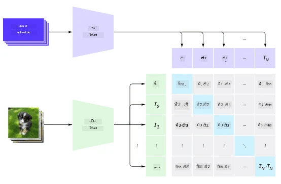
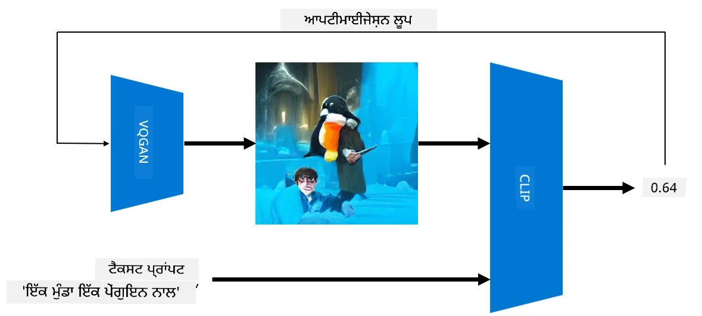

# ਮਲਟੀ-ਮੋਡਲ ਨੈਟਵਰਕ

NLP ਟਾਸਕਾਂ ਨੂੰ ਹੱਲ ਕਰਨ ਲਈ ਟ੍ਰਾਂਸਫਾਰਮਰ ਮਾਡਲਾਂ ਦੀ ਸਫਲਤਾ ਤੋਂ ਬਾਅਦ, ਉਹੀ ਜਾਂ ਇਸਦੇ ਸਮਾਨ ਆਰਕੀਟੈਕਚਰ ਕੰਪਿਊਟਰ ਵਿਜ਼ਨ ਟਾਸਕਾਂ 'ਤੇ ਲਾਗੂ ਕੀਤੇ ਗਏ। ਵਿਜ਼ਨ ਅਤੇ ਕੁਦਰਤੀ ਭਾਸ਼ਾ ਦੀਆਂ ਸਮਰਥਾਵਾਂ ਨੂੰ *ਮਿਲਾਉਣ* ਵਾਲੇ ਮਾਡਲ ਬਣਾਉਣ ਵਿੱਚ ਦਿਲਚਸਪੀ ਵਧ ਰਹੀ ਹੈ। ਇਸ ਤਰ੍ਹਾਂ ਦੇ ਇੱਕ ਯਤਨ ਨੂੰ OpenAI ਦੁਆਰਾ ਕੀਤਾ ਗਿਆ ਸੀ, ਜਿਸਨੂੰ CLIP ਅਤੇ DALL.E ਕਿਹਾ ਜਾਂਦਾ ਹੈ।

## ਕਾਂਟਰਾਸਟਿਵ ਇਮੇਜ ਪ੍ਰੀ-ਟ੍ਰੇਨਿੰਗ (CLIP)

CLIP ਦਾ ਮੁੱਖ ਵਿਚਾਰ ਇਹ ਹੈ ਕਿ ਟੈਕਸਟ ਪ੍ਰੌਮਪਟਸ ਨੂੰ ਇੱਕ ਚਿੱਤਰ ਨਾਲ ਤੁਲਨਾ ਕਰਨ ਅਤੇ ਇਹ ਨਿਰਧਾਰਤ ਕਰਨ ਦੀ ਸਮਰਥਾ ਹੋਵੇ ਕਿ ਚਿੱਤਰ ਪ੍ਰੌਮਪਟ ਨਾਲ ਕਿੰਨਾ ਚੰਗਾ ਮੇਲ ਖਾਂਦਾ ਹੈ।

> *ਤਸਵੀਰ [ਇਸ ਬਲੌਗ ਪੋਸਟ](https://openai.com/blog/clip/) ਤੋਂ*

ਮਾਡਲ ਨੂੰ ਇੰਟਰਨੈਟ ਤੋਂ ਪ੍ਰਾਪਤ ਚਿੱਤਰਾਂ ਅਤੇ ਉਨ੍ਹਾਂ ਦੇ ਕੈਪਸ਼ਨ 'ਤੇ ਟ੍ਰੇਨ ਕੀਤਾ ਜਾਂਦਾ ਹੈ। ਹਰ ਬੈਚ ਲਈ, ਅਸੀਂ (ਚਿੱਤਰ, ਟੈਕਸਟ) ਦੇ N ਜੋੜੇ ਲੈਂਦੇ ਹਾਂ ਅਤੇ ਉਨ੍ਹਾਂ ਨੂੰ ਕੁਝ ਵੈਕਟਰ ਪ੍ਰਤੀਨਿਧੀਆਂ ਵਿੱਚ ਬਦਲਦੇ ਹਾਂ। 

ਉਹ ਪ੍ਰਤੀਨਿਧੀਆਂ ਨੂੰ ਫਿਰ ਇਕੱਠੇ ਮਿਲਾਇਆ ਜਾਂਦਾ ਹੈ। ਲੌਸ ਫੰਕਸ਼ਨ ਨੂੰ ਇੱਕ ਜੋੜੇ (ਜਿਵੇਂ I ਅਤੇ T) ਦੇ ਵੈਕਟਰਾਂ ਦੇ ਵਿਚਕਾਰ ਕੋਸਾਈਨ ਸਮਾਨਤਾ ਨੂੰ ਵਧਾਉਣ ਅਤੇ ਸਾਰੇ ਹੋਰ ਜੋੜਿਆਂ ਦੇ ਵਿਚਕਾਰ ਕੋਸਾਈਨ ਸਮਾਨਤਾ ਨੂੰ ਘਟਾਉਣ ਲਈ ਪਰਿਭਾਸ਼ਿਤ ਕੀਤਾ ਗਿਆ ਹੈ। ਇਸੇ ਕਾਰਨ ਇਸ ਪਹੁੰਚ ਨੂੰ **ਕਾਂਟਰਾਸਟਿਵ** ਕਿਹਾ ਜਾਂਦਾ ਹੈ।

CLIP ਮਾਡਲ/ਲਾਇਬ੍ਰੇਰੀ [OpenAI GitHub](https://github.com/openai/CLIP) ਤੋਂ ਉਪਲਬਧ ਹੈ। ਇਹ ਪਹੁੰਚ [ਇਸ ਬਲੌਗ ਪੋਸਟ](https://openai.com/blog/clip/) ਵਿੱਚ ਵਰਣਨ ਕੀਤੀ ਗਈ ਹੈ ਅਤੇ [ਇਸ ਪੇਪਰ](https://arxiv.org/pdf/2103.00020.pdf) ਵਿੱਚ ਵਿਸਤਾਰ ਨਾਲ ਦਿੱਤੀ ਗਈ ਹੈ।

ਇਸ ਮਾਡਲ ਨੂੰ ਪ੍ਰੀ-ਟ੍ਰੇਨ ਕਰਨ ਤੋਂ ਬਾਅਦ, ਅਸੀਂ ਇਸਨੂੰ ਚਿੱਤਰਾਂ ਦੇ ਬੈਚ ਅਤੇ ਟੈਕਸਟ ਪ੍ਰੌਮਪਟਸ ਦੇ ਬੈਚ ਦੇ ਸਕਦੇ ਹਾਂ, ਅਤੇ ਇਹ ਸਾਨੂੰ ਸੰਭਾਵਨਾਵਾਂ ਦੇ ਟੈਂਸਰ ਦੇ ਰੂਪ ਵਿੱਚ ਨਤੀਜਾ ਦੇਵੇਗਾ। CLIP ਨੂੰ ਕਈ ਟਾਸਕਾਂ ਲਈ ਵਰਤਿਆ ਜਾ ਸਕਦਾ ਹੈ:

**ਚਿੱਤਰ ਵਰਗੀਕਰਨ**

ਮੰਨ ਲਓ ਕਿ ਸਾਨੂੰ ਚਿੱਤਰਾਂ ਨੂੰ ਬਿੱਲੀਆਂ, ਕੁੱਤੇ ਅਤੇ ਮਨੁੱਖਾਂ ਵਿੱਚ ਵਰਗੀਕਰਣ ਦੀ ਲੋੜ ਹੈ। ਇਸ ਮਾਮਲੇ ਵਿੱਚ, ਅਸੀਂ ਮਾਡਲ ਨੂੰ ਇੱਕ ਚਿੱਤਰ ਅਤੇ ਟੈਕਸਟ ਪ੍ਰੌਮਪਟਸ ਦੀ ਲੜੀ ਦੇ ਸਕਦੇ ਹਾਂ: "*ਬਿੱਲੀ ਦੀ ਤਸਵੀਰ*", "*ਕੁੱਤੇ ਦੀ ਤਸਵੀਰ*", "*ਮਨੁੱਖ ਦੀ ਤਸਵੀਰ*"। 3 ਸੰਭਾਵਨਾਵਾਂ ਦੇ ਨਤੀਜੇ ਵਾਲੇ ਵੈਕਟਰ ਵਿੱਚ ਸਿਰਫ ਸਭ ਤੋਂ ਉੱਚੇ ਮੁੱਲ ਵਾਲੇ ਇੰਡੈਕਸ ਨੂੰ ਚੁਣਨ ਦੀ ਲੋੜ ਹੈ।

> *ਤਸਵੀਰ [ਇਸ ਬਲੌਗ ਪੋਸਟ](https://openai.com/blog/clip/) ਤੋਂ*

**ਟੈਕਸਟ-ਅਧਾਰਿਤ ਚਿੱਤਰ ਖੋਜ**

ਅਸੀਂ ਇਸਦਾ ਉਲਟ ਵੀ ਕਰ ਸਕਦੇ ਹਾਂ। ਜੇਕਰ ਸਾਡੇ ਕੋਲ ਚਿੱਤਰਾਂ ਦਾ ਸੰਗ੍ਰਹਿ ਹੈ, ਅਸੀਂ ਇਸ ਸੰਗ੍ਰਹਿ ਨੂੰ ਮਾਡਲ ਨੂੰ ਦੇ ਸਕਦੇ ਹਾਂ ਅਤੇ ਇੱਕ ਟੈਕਸਟ ਪ੍ਰੌਮਪਟ - ਇਹ ਸਾਨੂੰ ਉਹ ਚਿੱਤਰ ਦੇਵੇਗਾ ਜੋ ਦਿੱਤੇ ਪ੍ਰੌਮਪਟ ਦੇ ਸਭ ਤੋਂ ਵੱਧ ਸਮਾਨ ਹੋਵੇ।

## ✍️ ਉਦਾਹਰਨ: [ਚਿੱਤਰ ਵਰਗੀਕਰਨ ਅਤੇ ਚਿੱਤਰ ਖੋਜ ਲਈ CLIP ਦੀ ਵਰਤੋਂ](../../../../../lessons/X-Extras/X1-MultiModal/Clip.ipynb)

CLIP ਨੂੰ ਕਾਰਵਾਈ ਵਿੱਚ ਦੇਖਣ ਲਈ [Clip.ipynb](../../../../../lessons/X-Extras/X1-MultiModal/Clip.ipynb) ਨੋਟਬੁੱਕ ਖੋਲ੍ਹੋ।

## VQGAN+CLIP ਨਾਲ ਚਿੱਤਰ ਜਨਰੇਸ਼ਨ

CLIP ਨੂੰ **ਟੈਕਸਟ ਪ੍ਰੌਮਪਟ** ਤੋਂ ਚਿੱਤਰ ਜਨਰੇਸ਼ਨ ਲਈ ਵੀ ਵਰਤਿਆ ਜਾ ਸਕਦਾ ਹੈ। ਇਸ ਨੂੰ ਕਰਨ ਲਈ, ਸਾਨੂੰ ਇੱਕ **ਜਨਰੇਟਰ ਮਾਡਲ** ਦੀ ਲੋੜ ਹੈ ਜੋ ਕੁਝ ਵੈਕਟਰ ਇਨਪੁਟ ਦੇ ਆਧਾਰ 'ਤੇ ਚਿੱਤਰ ਬਣਾਉਣ ਦੇ ਯੋਗ ਹੋਵੇ। ਇਸ ਤਰ੍ਹਾਂ ਦੇ ਇੱਕ ਮਾਡਲ ਨੂੰ [VQGAN](https://compvis.github.io/taming-transformers/) (Vector-Quantized GAN) ਕਿਹਾ ਜਾਂਦਾ ਹੈ।

VQGAN ਦੇ ਮੁੱਖ ਵਿਚਾਰ ਜੋ ਇਸਨੂੰ ਆਮ [GAN](../../4-ComputerVision/10-GANs/README.md) ਤੋਂ ਵੱਖ ਕਰਦੇ ਹਨ, ਇਹ ਹਨ:
* ਆਟੋਰੈਗਰੈਸਿਵ ਟ੍ਰਾਂਸਫਾਰਮਰ ਆਰਕੀਟੈਕਚਰ ਦੀ ਵਰਤੋਂ ਕਰਕੇ ਇੱਕ ਸੰਦਰਭ-ਭਰਪੂਰ ਵਿਜ਼ੁਅਲ ਹਿੱਸਿਆਂ ਦੀ ਲੜੀ ਬਣਾਉਣ ਲਈ ਜੋ ਚਿੱਤਰ ਨੂੰ ਬਣਾਉਂਦੇ ਹਨ। ਉਹ ਵਿਜ਼ੁਅਲ ਹਿੱਸੇ [CNN](../../4-ComputerVision/07-ConvNets/README.md) ਦੁਆਰਾ ਸਿੱਖੇ ਜਾਂਦੇ ਹਨ।
* ਸਬ-ਚਿੱਤਰ ਡਿਸਕ੍ਰਿਮਿਨੇਟਰ ਦੀ ਵਰਤੋਂ ਜੋ ਪਤਾ ਲਗਾਉਂਦਾ ਹੈ ਕਿ ਚਿੱਤਰ ਦੇ ਹਿੱਸੇ "ਅਸਲੀ" ਹਨ ਜਾਂ "ਨਕਲੀ" (ਪ੍ਰੰਪਰਾਗਤ GAN ਵਿੱਚ "ਸਭ-ਜਾਂ-ਕੁਝ-ਨਹੀਂ" ਪਹੁੰਚ ਦੇ ਉਲਟ)।

VQGAN ਬਾਰੇ ਹੋਰ ਜਾਣਕਾਰੀ [Taming Transformers](https://compvis.github.io/taming-transformers/) ਵੈਬਸਾਈਟ 'ਤੇ ਪ੍ਰਾਪਤ ਕਰੋ।

VQGAN ਅਤੇ ਪ੍ਰੰਪਰਾਗਤ GAN ਦੇ ਵਿਚਕਾਰ ਇੱਕ ਮਹੱਤਵਪੂਰਨ ਅੰਤਰ ਇਹ ਹੈ ਕਿ ਪੁਰਾਣਾ ਕਿਸੇ ਵੀ ਇਨਪੁਟ ਵੈਕਟਰ ਤੋਂ ਇੱਕ ਢੰਗ ਦਾ ਚਿੱਤਰ ਪੈਦਾ ਕਰ ਸਕਦਾ ਹੈ, ਜਦਕਿ VQGAN ਸੰਭਾਵਨਾ ਹੈ ਕਿ ਇੱਕ ਚਿੱਤਰ ਪੈਦਾ ਕਰੇ ਜੋ ਸੰਗਤਿ ਵਾਲਾ ਨਾ ਹੋਵੇ। ਇਸ ਲਈ, ਸਾਨੂੰ ਚਿੱਤਰ ਬਣਾਉਣ ਦੀ ਪ੍ਰਕਿਰਿਆ ਨੂੰ ਹੋਰ ਮਾਰਗਦਰਸ਼ਨ ਕਰਨ ਦੀ ਲੋੜ ਹੈ, ਅਤੇ ਇਹ CLIP ਦੀ ਵਰਤੋਂ ਕਰਕੇ ਕੀਤਾ ਜਾ ਸਕਦਾ ਹੈ।

ਟੈਕਸਟ ਪ੍ਰੌਮਪਟ ਦੇ ਅਨੁਕੂਲ ਚਿੱਤਰ ਬਣਾਉਣ ਲਈ, ਅਸੀਂ ਕੁਝ ਰੈਂਡਮ ਐਨਕੋਡਿੰਗ ਵੈਕਟਰ ਨਾਲ ਸ਼ੁਰੂ ਕਰਦੇ ਹਾਂ ਜੋ VQGAN ਦੁਆਰਾ ਚਿੱਤਰ ਪੈਦਾ ਕਰਨ ਲਈ ਪਾਸ ਕੀਤਾ ਜਾਂਦਾ ਹੈ। ਫਿਰ CLIP ਨੂੰ ਇੱਕ ਲੌਸ ਫੰਕਸ਼ਨ ਪੈਦਾ ਕਰਨ ਲਈ ਵਰਤਿਆ ਜਾਂਦਾ ਹੈ ਜੋ ਦਿਖਾਉਂਦਾ ਹੈ ਕਿ ਚਿੱਤਰ ਟੈਕਸਟ ਪ੍ਰੌਮਪਟ ਨਾਲ ਕਿੰਨਾ ਚੰਗਾ ਮੇਲ ਖਾਂਦਾ ਹੈ। ਫਿਰ ਉਦੇਸ਼ ਇਸ ਲੌਸ ਨੂੰ ਘਟਾਉਣਾ ਹੈ, ਬੈਕ ਪ੍ਰੋਪਾਗੇਸ਼ਨ ਦੀ ਵਰਤੋਂ ਕਰਕੇ ਇਨਪੁਟ ਵੈਕਟਰ ਪੈਰਾਮੀਟਰਾਂ ਨੂੰ ਢਾਲਣਾ।

VQGAN+CLIP ਨੂੰ ਲਾਗੂ ਕਰਨ ਵਾਲੀ ਇੱਕ ਸ਼ਾਨਦਾਰ ਲਾਇਬ੍ਰੇਰੀ [Pixray](http://github.com/pixray/pixray) ਹੈ।

 |   | 
----|----|----
ਪ੍ਰੌਮਪਟ ਤੋਂ ਬਣਾਈ ਗਈ ਤਸਵੀਰ *ਸਾਹਿਤ ਦੇ ਇੱਕ ਨੌਜਵਾਨ ਪੁਰਸ਼ ਅਧਿਆਪਕ ਦਾ ਇੱਕ ਜਲਰੰਗ ਪੋਰਟਰੇਟ ਜਿਸਦੇ ਕੋਲ ਇੱਕ ਕਿਤਾਬ ਹੈ* | ਪ੍ਰੌਮਪਟ ਤੋਂ ਬਣਾਈ ਗਈ ਤਸਵੀਰ *ਕੰਪਿਊਟਰ ਵਿਗਿਆਨ ਦੀ ਇੱਕ ਨੌਜਵਾਨ ਮਹਿਲਾ ਅਧਿਆਪਕ ਦਾ ਇੱਕ ਤੇਲ ਪੋਰਟਰੇਟ ਜਿਸਦੇ ਕੋਲ ਇੱਕ ਕੰਪਿਊਟਰ ਹੈ* | ਪ੍ਰੌਮਪਟ ਤੋਂ ਬਣਾਈ ਗਈ ਤਸਵੀਰ *ਗਣਿਤ ਦੇ ਇੱਕ ਬੁਜ਼ੁਰਗ ਪੁਰਸ਼ ਅਧਿਆਪਕ ਦਾ ਇੱਕ ਤੇਲ ਪੋਰਟਰੇਟ ਜੋ ਬਲੈਕਬੋਰਡ ਦੇ ਸਾਹਮਣੇ ਹੈ*

> **Artificial Teachers** ਕਲੈਕਸ਼ਨ ਤੋਂ ਤਸਵੀਰਾਂ [ਦਿਮਿਤਰੀ ਸੋਸ਼ਨਿਕੋਵ](http://soshnikov.com) ਦੁਆਰਾ

## DALL-E
### [DALL-E 1](https://openai.com/research/dall-e)
DALL-E GPT-3 ਦਾ ਇੱਕ ਵਰਜਨ ਹੈ ਜੋ ਪ੍ਰੌਮਪਟਸ ਤੋਂ ਚਿੱਤਰ ਪੈਦਾ ਕਰਨ ਲਈ ਟ੍ਰੇਨ ਕੀਤਾ ਗਿਆ ਹੈ। ਇਹ 12-ਬਿਲੀਅਨ ਪੈਰਾਮੀਟਰਾਂ ਨਾਲ ਟ੍ਰੇਨ ਕੀਤਾ ਗਿਆ ਹੈ।

CLIP ਦੇ ਉਲਟ, DALL-E ਟੈਕਸਟ ਅਤੇ ਚਿੱਤਰ ਨੂੰ ਇੱਕ ਸਿੰਗਲ ਟੋਕਨ ਸਟ੍ਰੀਮ ਦੇ ਰੂਪ ਵਿੱਚ ਪ੍ਰਾਪਤ ਕਰਦਾ ਹੈ। ਇਸ ਲਈ, ਕਈ ਪ੍ਰੌਮਪਟਸ ਤੋਂ, ਤੁਸੀਂ ਟੈਕਸਟ ਦੇ ਆਧਾਰ 'ਤੇ ਚਿੱਤਰ ਪੈਦਾ ਕਰ ਸਕਦੇ ਹੋ।

### [DALL-E 2](https://openai.com/dall-e-2)
DALL.E 1 ਅਤੇ 2 ਦੇ ਵਿਚਕਾਰ ਮੁੱਖ ਅੰਤਰ ਇਹ ਹੈ ਕਿ ਇਹ ਹੋਰ ਹਕੀਕਤਵਾਦੀ ਚਿੱਤਰ ਅਤੇ ਕਲਾ ਪੈਦਾ ਕਰਦਾ ਹੈ।

DALL-E ਨਾਲ ਚਿੱਤਰ ਜਨਰੇਸ਼ਨ ਦੇ ਉਦਾਹਰਨ:
 |   | 
----|----|----
ਪ੍ਰੌਮਪਟ ਤੋਂ ਬਣਾਈ ਗਈ ਤਸਵੀਰ *ਸਾਹਿਤ ਦੇ ਇੱਕ ਨੌਜਵਾਨ ਪੁਰਸ਼ ਅਧਿਆਪਕ ਦਾ ਇੱਕ ਜਲਰੰਗ ਪੋਰਟਰੇਟ ਜਿਸਦੇ ਕੋਲ ਇੱਕ ਕਿਤਾਬ ਹੈ* | ਪ੍ਰੌਮਪਟ ਤੋਂ ਬਣਾਈ ਗਈ ਤਸਵੀਰ *ਕੰਪਿਊਟਰ ਵਿਗਿਆਨ ਦੀ ਇੱਕ ਨੌਜਵਾਨ ਮਹਿਲਾ ਅਧਿਆਪਕ ਦਾ ਇੱਕ ਤੇਲ ਪੋਰਟਰੇਟ ਜਿਸਦੇ ਕੋਲ ਇੱਕ ਕੰਪਿਊਟਰ ਹੈ* | ਪ੍ਰੌਮਪਟ ਤੋਂ ਬਣਾਈ ਗਈ ਤਸਵੀਰ *ਗਣਿਤ ਦੇ ਇੱਕ ਬੁਜ਼ੁਰਗ ਪੁਰਸ਼ ਅਧਿਆਪਕ ਦਾ ਇੱਕ ਤੇਲ ਪੋਰਟਰੇਟ ਜੋ ਬਲੈਕਬੋਰਡ ਦੇ ਸਾਹਮਣੇ ਹੈ*

## ਸੰਦਰਭ

* VQGAN ਪੇਪਰ: [Taming Transformers for High-Resolution Image Synthesis](https://compvis.github.io/taming-transformers/paper/paper.pdf)
* CLIP ਪੇਪਰ: [Learning Transferable Visual Models From Natural Language Supervision](https://arxiv.org/pdf/2103.00020.pdf)

**ਅਸਵੀਕਰਤਾ**:  
ਇਹ ਦਸਤਾਵੇਜ਼ AI ਅਨੁਵਾਦ ਸੇਵਾ [Co-op Translator](https://github.com/Azure/co-op-translator) ਦੀ ਵਰਤੋਂ ਕਰਕੇ ਅਨੁਵਾਦ ਕੀਤਾ ਗਿਆ ਹੈ। ਜਦੋਂ ਕਿ ਅਸੀਂ ਸਹੀ ਹੋਣ ਦਾ ਯਤਨ ਕਰਦੇ ਹਾਂ, ਕਿਰਪਾ ਕਰਕੇ ਧਿਆਨ ਦਿਓ ਕਿ ਸਵੈਚਾਲਿਤ ਅਨੁਵਾਦਾਂ ਵਿੱਚ ਗਲਤੀਆਂ ਜਾਂ ਅਸੁੱਤੀਆਂ ਹੋ ਸਕਦੀਆਂ ਹਨ। ਇਸ ਦੀ ਮੂਲ ਭਾਸ਼ਾ ਵਿੱਚ ਮੌਜੂਦ ਮੂਲ ਦਸਤਾਵੇਜ਼ ਨੂੰ ਪ੍ਰਮਾਣਿਕ ਸਰੋਤ ਮੰਨਿਆ ਜਾਣਾ ਚਾਹੀਦਾ ਹੈ। ਮਹੱਤਵਪੂਰਨ ਜਾਣਕਾਰੀ ਲਈ, ਪੇਸ਼ੇਵਰ ਮਨੁੱਖੀ ਅਨੁਵਾਦ ਦੀ ਸਿਫਾਰਸ਼ ਕੀਤੀ ਜਾਂਦੀ ਹੈ। ਇਸ ਅਨੁਵਾਦ ਦੇ ਪ੍ਰਯੋਗ ਤੋਂ ਪੈਦਾ ਹੋਣ ਵਾਲੇ ਕਿਸੇ ਵੀ ਗਲਤਫਹਿਮੀ ਜਾਂ ਗਲਤ ਵਿਆਖਿਆ ਲਈ ਅਸੀਂ ਜ਼ਿੰਮੇਵਾਰ ਨਹੀਂ ਹਾਂ।