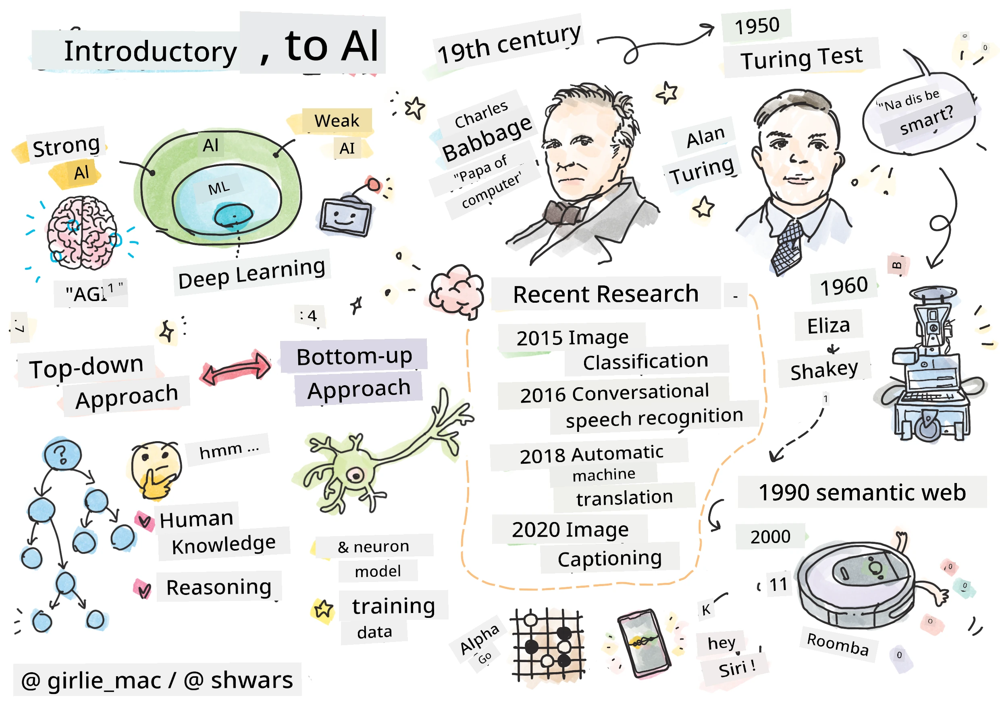
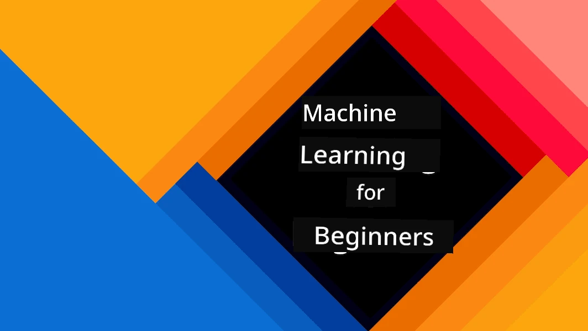
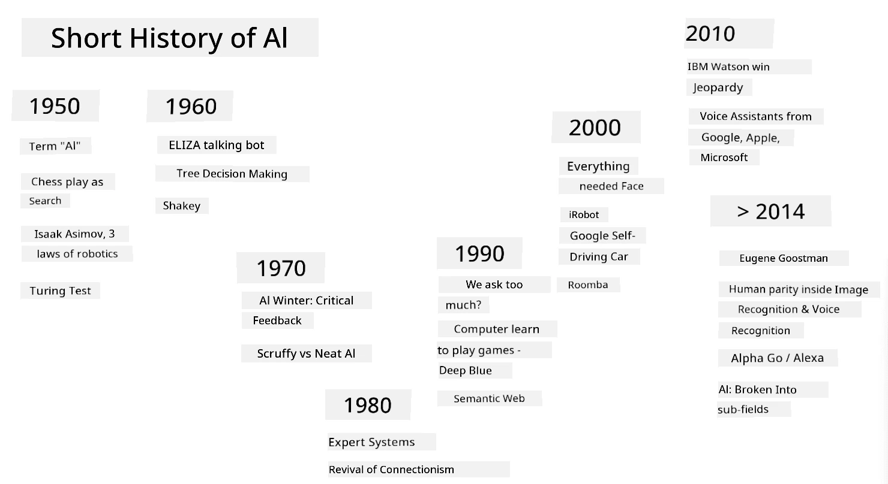
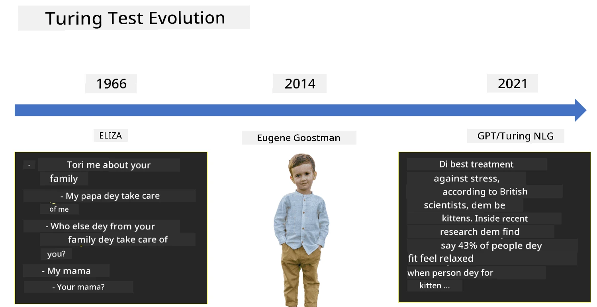

# Introduction to AI

> Sketchnote by [Tomomi Imura](https://twitter.com/girlie_mac)

## [Pre-lecture quiz](https://ff-quizzes.netlify.app/en/ai/quiz/1)

**Artificial Intelligence** na one kain scientific area wey dey study how we fit make computer dey do things wey human sabi do well well.

Before before, na [Charles Babbage](https://en.wikipedia.org/wiki/Charles_Babbage) invent computer to dey work with numbers follow one clear process - wey dem dey call algorithm. Modern computer don advance pass the one wey dem propose for 19th century, but e still dey follow the same idea of controlled calculations. So e possible to program computer to do something if we sabi the exact steps wey we need to follow to reach the goal.

> Photo by [Vickie Soshnikova](http://twitter.com/vickievalerie)

> ✅ To fit know the age of person from e photo na task wey no fit dey programmed directly, because we no sabi how we dey come up with the number for our head when we dey do am.

---

Some tasks dey wey we no sabi how to solve am directly. For example, to know the age of person from e photo. We dey learn how to do am because we don see plenty examples of people wey get different age, but we no fit explain how we dey do am or program computer to do am. Na this kain task dey interest **Artificial Intelligence** (AI for short).

✅ Think about some tasks wey you fit give computer to do wey AI go help. Check finance, medicine, and arts - how AI dey help these areas today?

## Weak AI vs. Strong AI

Weak AI | Strong AI
---------------------------------------|-------------------------------------
Weak AI na AI systems wey dem design and train to do one specific task or small group of tasks.|Strong AI, or Artificial General Intelligence (AGI), na AI systems wey get human-level intelligence and understanding.
These AI systems no get general intelligence; dem dey good for one specific task but dem no get true understanding or consciousness.|These AI systems fit do any intellectual task wey human fit do, adapt to different areas, and get something like consciousness or self-awareness.
Examples of weak AI na virtual assistants like Siri or Alexa, recommendation algorithms wey streaming services dey use, and chatbots wey dem design for specific customer service tasks.|To achieve Strong AI na long-term goal for AI research, e go need AI systems wey fit reason, learn, understand, and adapt for plenty tasks and situations.
Weak AI na highly specialized and e no get human-like thinking ability or general problem-solving skills outside e small area.|Strong AI na still theory for now, no AI system don reach this level of general intelligence.

For more information check **[Artificial General Intelligence](https://en.wikipedia.org/wiki/Artificial_general_intelligence)** (AGI).
## The Definition of Intelligence and the Turing Test

One problem wey dey when we dey talk about **[Intelligence](https://en.wikipedia.org/wiki/Intelligence)** na say we no get clear definition of the word. Some people fit talk say intelligence dey connected to **abstract thinking**, or **self-awareness**, but we no fit define am well.

> [Photo](https://unsplash.com/photos/75715CVEJhI) by [Amber Kipp](https://unsplash.com/@sadmax) from Unsplash

To see how the word *intelligence* dey confuse, try answer this question: "Cat dey intelligent?". Different people go give different answers because we no get one test wey everybody agree say fit prove am true or false. And if you think say you get test - try give your cat IQ test...

✅ Think small about how you dey define intelligence. Crow wey fit solve maze to get food dey intelligent? Pikin dey intelligent?

---

When we dey talk about AGI, we need way to know if we don create true intelligent system. [Alan Turing](https://en.wikipedia.org/wiki/Alan_Turing) propose one way wey dem dey call **[Turing Test](https://en.wikipedia.org/wiki/Turing_test)**, wey also dey act like definition of intelligence. The test dey compare the system to something wey we sabi say dey intelligent - human being. Because computer fit bypass automatic comparison, we dey use human interrogator. If human no fit tell the difference between real person and computer system for text-based talk - we go call the system intelligent.

> One chat-bot wey dem call [Eugene Goostman](https://en.wikipedia.org/wiki/Eugene_Goostman), wey dem develop for St.Petersburg, almost pass the Turing test for 2014 by using one smart personality trick. E talk say e be 13-year-old Ukrainian boy, wey explain why e no sabi some things and why e dey make small mistake for text. The bot make 30% of the judges believe say e be human after 5 minutes talk, one metric wey Turing believe machine go fit pass by 2000. But make we understand say this no mean say we don create intelligent system or say computer don fool human interrogator - na the bot creators fool the humans, no be the system!

✅ Chat bot don ever fool you make you think say na human you dey talk to? How e take convince you?

## Different Approaches to AI

If we want computer to behave like human, we need somehow model how human dey think inside computer. So we need try understand wetin dey make human dey intelligent.

> To fit program intelligence inside machine, we need understand how we dey make decisions. If you think about yourself small, you go realize say some processes dey happen for your mind wey you no dey think about – like how we fit know cat from dog without thinking - while some other processes dey involve reasoning.

Two ways dey to solve this problem:

Top-down Approach (Symbolic Reasoning) | Bottom-up Approach (Neural Networks)
---------------------------------------|-------------------------------------
Top-down approach dey model how person dey reason to solve problem. E involve taking **knowledge** from human being, and putting am inside computer in way wey computer fit read. We go also need way to model **reasoning** inside computer. | Bottom-up approach dey model how human brain dey work, wey get plenty small units wey dem dey call **neurons**. Each neuron dey act like weighted average of e inputs, and we fit train network of neurons to solve problems by giving **training data**.

Other approaches to intelligence dey:

* **Emergent**, **Synergetic** or **multi-agent approach** dey base on the fact say complex intelligent behavior fit come from interaction of plenty simple agents. According to [evolutionary cybernetics](https://en.wikipedia.org/wiki/Global_brain#Evolutionary_cybernetics), intelligence fit *emerge* from simple, reactive behavior during *metasystem transition*.

* **Evolutionary approach**, or **genetic algorithm** na optimization process wey dey follow principles of evolution.

We go look these approaches later for the course, but for now we go focus on two main directions: top-down and bottom-up.

### The Top-Down Approach

For **top-down approach**, we dey try model how we dey reason. Because we fit follow our thoughts when we dey reason, we fit try formalize this process and program am inside computer. Dem dey call this **symbolic reasoning**.

People dey get some rules for their head wey dey guide how dem dey make decisions. For example, when doctor dey diagnose patient, e fit realize say person get fever, so e fit mean say inflammation dey happen for body. By using plenty rules for one specific problem, doctor fit come up with final diagnosis.

This approach dey depend well well on **knowledge representation** and **reasoning**. To take knowledge from human expert fit be the hardest part, because doctor many times no go know why e dey come up with one particular diagnosis. Sometimes solution go just pop for e head without thinking. Some tasks, like to know age of person from photo, no fit dey reduced to manipulating knowledge.

### Bottom-Up Approach

Another way na to model the simplest part of our brain – neuron. We fit build **artificial neural network** inside computer, then try teach am to solve problems by giving am examples. This process dey similar to how pikin dey learn about e environment by observing.

✅ Do small research on how babies dey learn. Wetin be the basic things wey dey inside pikin brain?

> | Wetin about ML?         |      |
> |--------------|-----------|
> | Part of Artificial Intelligence wey dey base on computer learning to solve problem from data na **Machine Learning**. We no go talk about classical machine learning for this course - we dey refer you to separate [Machine Learning for Beginners](http://aka.ms/ml-beginners) curriculum. |       |

## A Brief History of AI

Artificial Intelligence start as field for middle of twentieth century. At first, symbolic reasoning na the main approach, and e lead to some important success, like expert systems – computer programs wey fit act like expert for small problem areas. But e later clear say this approach no dey scale well. To take knowledge from expert, put am inside computer, and keep the knowledgebase correct dey very hard, and e too expensive for many cases. This lead to [AI Winter](https://en.wikipedia.org/wiki/AI_winter) for 1970s.

> Image by [Dmitry Soshnikov](http://soshnikov.com)

As time dey go, computing resources don cheap, and more data don dey available, so neural network approaches don dey perform well for areas like computer vision or speech understanding. For the last ten years, the word Artificial Intelligence don dey mostly mean Neural Networks, because most AI success wey we dey hear about na based on them.

We fit see how the approaches don change, for example, for creating chess playing computer program:

* Early chess programs dey use search – program dey try estimate possible moves of opponent for next few moves, then choose best move based on best position wey fit happen after few moves. This lead to [alpha-beta pruning](https://en.wikipedia.org/wiki/Alpha%E2%80%93beta_pruning) search algorithm.
* Search strategies dey work well for end of game, where search space small because few moves dey possible. But for beginning of game, search space big, and algorithm fit improve by learning from matches between human players. Later experiments use [case-based reasoning](https://en.wikipedia.org/wiki/Case-based_reasoning), where program dey look for cases for knowledge base wey resemble the current position for game.
* Modern programs wey dey beat human players dey use neural networks and [reinforcement learning](https://en.wikipedia.org/wiki/Reinforcement_learning), where programs dey learn to play by playing plenty games against themselves and learning from their mistakes – like how human dey learn chess. But computer fit play plenty games for short time, so e dey learn faster.

✅ Do small research on other games wey AI don play.

Same way, we fit see how approach for creating “talking programs” (wey fit pass Turing test) don change:

* Early programs like [Eliza](https://en.wikipedia.org/wiki/ELIZA), dey use simple grammar rules and dey turn input sentence to question.
* Modern assistants like Cortana, Siri or Google Assistant na hybrid systems wey dey use Neural networks to change speech to text and understand wetin we want, then use reasoning or direct algorithms to do wetin we need.
* For future, we fit expect complete neural-based model wey go handle talk by itself. The recent GPT and [Turing-NLG](https://www.microsoft.com/research/blog/turing-nlg-a-17-billion-parameter-language-model-by-microsoft) family of neural networks dey show big success for this.

> Foto by Dmitry Soshnikov, [foto](https://unsplash.com/photos/r8LmVbUKgns) by [Marina Abrosimova](https://unsplash.com/@abrosimova_marina_foto), Unsplash

## Recent AI Research

Di big growth wey don happun for neural network research start around 2010, wen big public datasets begin dey available. One big collection of images wey dem call [ImageNet](https://en.wikipedia.org/wiki/ImageNet), wey get like 14 million annotated images, na im bring di [ImageNet Large Scale Visual Recognition Challenge](https://image-net.org/challenges/LSVRC/) come life.

> Foto by [Dmitry Soshnikov](http://soshnikov.com)

For 2012, na di first time wey dem use [Convolutional Neural Networks](../4-ComputerVision/07-ConvNets/README.md) for image classification, and e make di classification errors reduce well well (from almost 30% to 16.4%). For 2015, ResNet architecture from Microsoft Research [reach human-level accuracy](https://doi.org/10.1109/ICCV.2015.123).

Since dat time, Neural Networks don show say dem sabi well well for many tasks:

---

Year | Human Parity wey dem achieve
-----|--------
2015 | [Image Classification](https://doi.org/10.1109/ICCV.2015.123)
2016 | [Conversational Speech Recognition](https://arxiv.org/abs/1610.05256)
2018 | [Automatic Machine Translation](https://arxiv.org/abs/1803.05567) (Chinese-to-English)
2020 | [Image Captioning](https://arxiv.org/abs/2009.13682)

For di past few years, we don see big success with big language models like BERT and GPT-3. Dis one happun because plenty general text data dey wey we fit use train models to sabi di structure and meaning of texts, pre-train dem on general text collections, and later make dem specialize for more specific tasks. We go learn more about [Natural Language Processing](../5-NLP/README.md) later for dis course.

## 🚀 Challenge

Go waka for internet to find out where you think say AI dey work pass. E fit dey for Mapping app, or speech-to-text service or even video game? Research how dem take build di system.

## [Post-lecture quiz](https://ff-quizzes.netlify.app/en/ai/quiz/2)

## Review & Self Study

Go review di history of AI and ML by reading [dis lesson](https://github.com/microsoft/ML-For-Beginners/tree/main/1-Introduction/2-history-of-ML). Pick one thing from di sketchnote wey dey di top of dat lesson or dis one, and research am well to understand di cultural context wey dey behind how e take evolve.

**Assignment**: [Game Jam](assignment.md)

---

<!-- CO-OP TRANSLATOR DISCLAIMER START -->
**Disclaimer**:  
Dis dokyument don use AI transleto service [Co-op Translator](https://github.com/Azure/co-op-translator) do di translation. Even though we dey try make am correct, abeg sabi say machine translation fit get mistake or no dey accurate well. Di original dokyument for im native language na di main source wey you go trust. For important mata, e good make professional human transleto check am. We no go fit take blame for any misunderstanding or wrong interpretation wey fit happen because you use dis translation.
<!-- CO-OP TRANSLATOR DISCLAIMER END -->