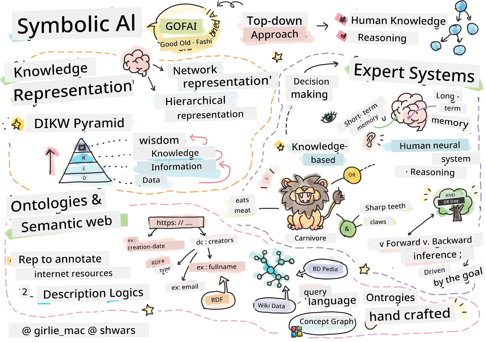
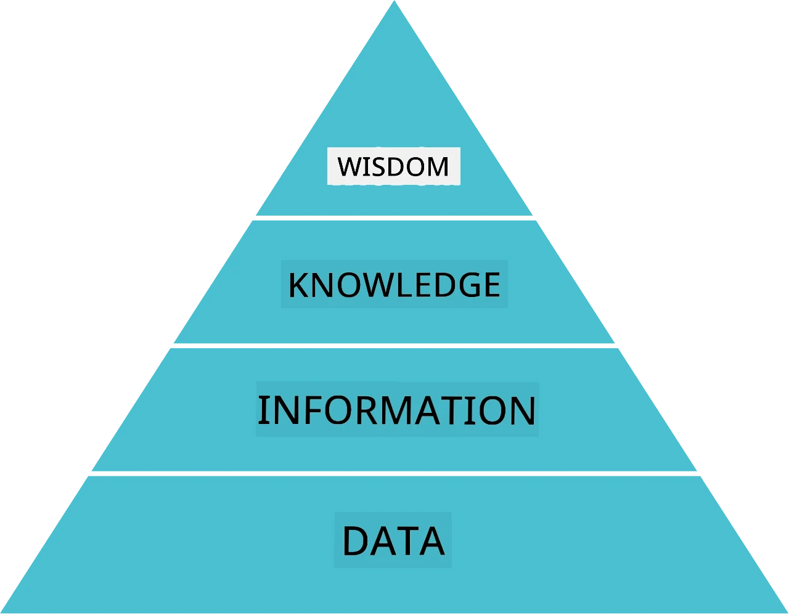
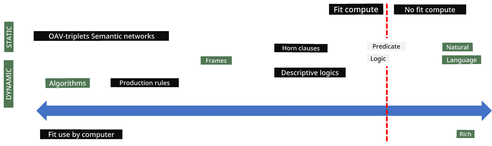
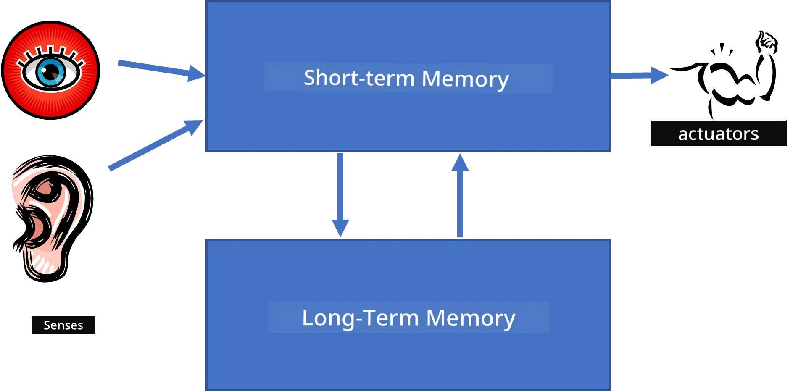
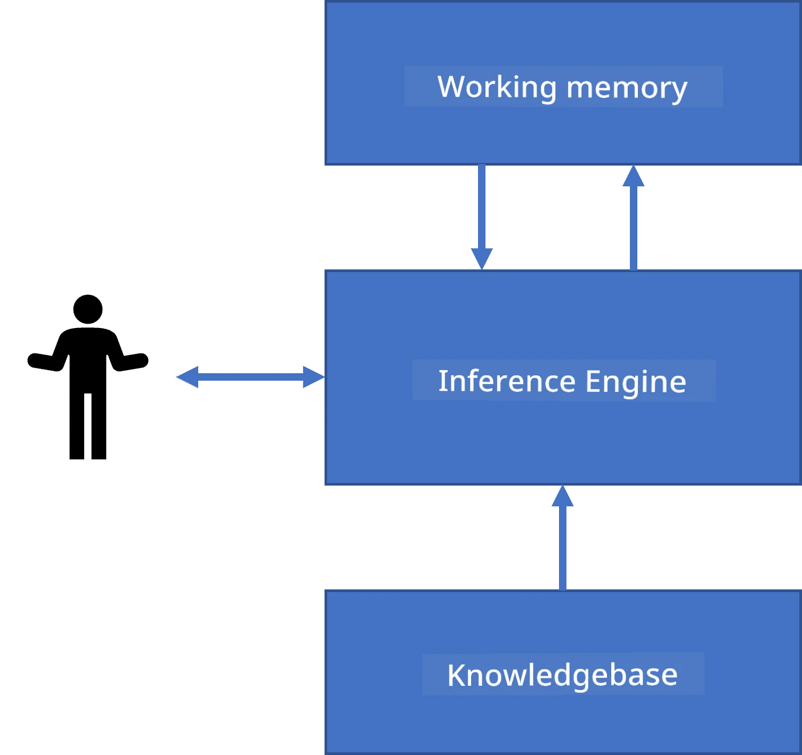
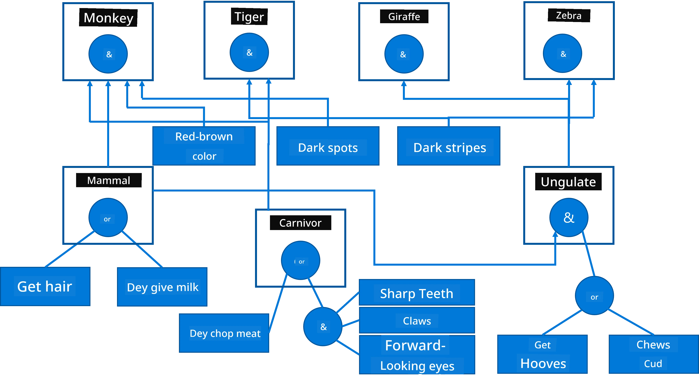
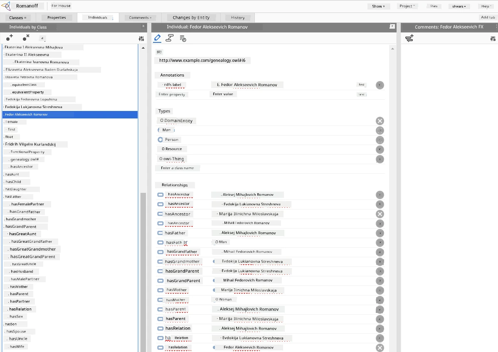

# Knowledge Representation and Expert Systems



> Sketchnote by [Tomomi Imura](https://twitter.com/girlie_mac)

Di waka wey dem de find for artificial intelligence na based on search for knowledge, to make sense of di world like how humans de do am. But how you fit take do am?

## [Pre-lecture quiz](https://ff-quizzes.netlify.app/en/ai/quiz/3)

For di early days of AI, di top-down way of making intelligent systems (wey we talk for di previous lesson) de popular. Di idea na to comot knowledge from people enter some machine-readable form, then use am to automatically solve problems. Dis approach get two big ideas:

* Knowledge Representation
* Reasoning

## Knowledge Representation

One of di important tins for Symbolic AI na **knowledge**. E important to know di difference between knowledge and *information* or *data*. For example, you fit talk sey books get knowledge, because person fit study books and become expert. But wetin books get na *data*, and by reading books and add dis data to our world model, we dey convert dat data to knowledge.

> ✅ **Knowledge** na wetin dey inside our head wey represent how we understand di world. E dey come through active **learning** process, wey join pieces of information wey we receive into our active model of di world.

Most times, we no define knowledge sharp-sharp, but we dey relate am to other related concepts using [DIKW Pyramid](https://en.wikipedia.org/wiki/DIKW_pyramid). E get dis tins:

* **Data** na tins wey dem represent for physical media, like written text or spoken words. Data dey exist independent from people and fit pass from one person to another.
* **Information** na how we take interpret data for our head. For example, when we hear di word *computer*, we get some understanding of wetin e be.
* **Knowledge** na information wey don join our world model. For example, once we learn wetin computer be, we dey get some idea about how e dey work, how much e dey cost, and wetin e fit dey used for. Dis network of related concepts na our knowledge.
* **Wisdom** na another level of our understanding of di world, and e mean *meta-knowledge*, eg. some understanding of how and when knowledge suppose dey used.



*Image [from Wikipedia](https://commons.wikimedia.org/w/index.php?curid=37705247), By Longlivetheux - Own work, CC BY-SA 4.0*

So, di problem of **knowledge representation** na to find how to effectively represent knowledge inside computer as data, to make am automatically usable. E fit be like spectrum:



> Image by [Dmitry Soshnikov](http://soshnikov.com)

* For di left, na simple types of knowledge representations wey computer fit use well. Di simplest one na algorithmic, wey mean knowledge dey inside computer program. But dis no be di best way to represent knowledge because e no flexible. Knowledge inside our head no too get algorithm.
* For di right, na representations like natural text. E powerful pass, but you no fit use am for automatic reasoning.

> ✅ Think small about how you de represent knowledge inside your head and how you take turn am to notes. You get one particular format wey dey help you remember well?

## Classifying Computer Knowledge Representations

We fit classify different computer knowledge representation methods into dis categories:

* **Network representations** dey based on di fact sey we get network of related concepts inside our head. We fit try reproduce di same networks as graph inside computer - na so called **semantic network**.

1. **Object-Attribute-Value triplets** or **attribute-value pairs**. Because graph fit represent inside computer as list of nodes and edges, we fit represent semantic network by list of triplets, wey get objects, attributes, and values. For example, we go build dis triplets on programming languages:

Object | Attribute | Value
-------|-----------|------
Python | is | Untyped-Language
Python | invented-by | Guido van Rossum
Python | block-syntax | indentation
Untyped-Language | doesn't have | type definitions

> ✅ Think how triplets fit take represent other kinds of knowledge.

2. **Hierarchical representations** emphasize sey we dey create hierarchy of objects inside our head. For example, we know sey canary na bird, and all birds get wings. We also get idea about wetin color canary usually be, and wetin their flight speed be.

   - **Frame representation** na to represent each object or class of object as **frame** wey get **slots**. Slots fit get default values, value restrictions, or stored procedures wey you fit call to get di slot value. All frames make hierarchy like object hierarchy for object-oriented programming languages.
   - **Scenarios** na special frames wey represent complex situations wey fit happen over time.

**Python**

Slot | Value | Default value | Interval |
-----|-------|---------------|----------|
Name | Python | | |
Is-A | Untyped-Language | | |
Variable Case | | CamelCase | |
Program Length | | | 5-5000 lines |
Block Syntax | Indent | | |

3. **Procedural representations** dey based on representing knowledge as list of actions wey you fit do when condition happen.
   - Production rules na if-then statements wey dey allow us draw conclusion. For example, doctor fit get rule sey **IF** patient get high fever **OR** high level of C-reactive protein for blood test **THEN** e get inflammation. Once one of condition show, we fit conclude inflammation dey, then use am for further reasoning.
   - Algorithms fit be another kind procedural representation, although dem no dey use am direct for knowledge-based systems.

4. **Logic** Aristotle originally propose am as way to represent universal human knowledge.
   - Predicate Logic as mathematical theory too rich to be computable, so dem dey use subset of am, like Horn clauses wey dem dey use for Prolog.
   - Descriptive Logic na family of logical systems used to represent and reason about hierarchies of objects inside distributed knowledge representations like *semantic web*.

## Expert Systems

One of early successes of symbolic AI na the so-called **expert systems** - computer systems wey dem design to act like expert inside limited problem domain. Dem dey based on **knowledge base** wey dem comot from one or more human experts, and e get **inference engine** wey dey reason on top am.

 | 
---------------------------------------------|------------------------------------------------
Simplified structure of a human neural system | Architecture of a knowledge-based system

Expert systems be like human reasoning system, wey get **short-term memory** and **long-term memory**. Same way, for knowledge-based systems we get these components:

* **Problem memory**: get knowledge about di problem wey dem dey try solve now, like temperature or blood pressure of patient, whether e get inflammation or no, etc. Dis knowledge also dey called **static knowledge**, because e show wetin we currently know about di problem - di so-called *problem state*.
* **Knowledge base**: represent long-term knowledge about problem domain. E dey come from human experts manual, and no dey change from consultation to consultation. Because e allow us shift from one problem state to another, e also dey called **dynamic knowledge**.
* **Inference engine**: na e dey control di whole process of searching problem state space, dey ask questions to user when necessary. E also dey responsible to find right rules to apply to each state.

Example, make we check dis expert system for identifying animal based on physical characteristics:



> Image by [Dmitry Soshnikov](http://soshnikov.com)

Dis diagram na **AND-OR tree**, and e be graphical representation of production rules set. To draw tree na better way when you dey comot knowledge from expert. But to represent knowledge inside computer, better to use rules:

```
IF the animal eats meat
OR (animal has sharp teeth
    AND animal has claws
    AND animal has forward-looking eyes
) 
THEN the animal is a carnivore
```

You fit see sey each condition for left side of rule and action na object-attribute-value (OAV) triplets. **Working memory** get OAV triplets wey represent problem wey dem dey solve. **Rules engine** dey find rules wey condition don satisfy and e dey apply dem, dey add new triplet to working memory.

> ✅ Make your own AND-OR tree on any topic wey you like!

### Forward vs. Backward Inference

The process wey we talk about na **forward inference**. E start with initial data about problem wey dey working memory, then e dey do dis reasoning loop:

1. If target attribute dey working memory - stop and give result
2. Find all rules wey condition don satisfy - get **conflict set** of rules.
3. Do **conflict resolution** - pick one rule wey go run now. Different conflict resolution strategies fit dey:
   - Pick first applicable rule inside knowledge base
   - Pick rule randomly
   - Pick *more specific* rule, i.e. one wey meet most conditions for left side (LHS)
4. Apply selected rule and add new knowledge to problem state
5. Repeat from step 1.

But sometimes, we fit wan start with empty knowledge about problem, then ask questions to help reach conclusion. For example, for medical diagnosis, we no dey do all medical tests before we start diagnosis. We like do test when decision must make.

Dis process fit model as **backward inference**. E dey driven by **goal** - di attribute value wey we want find:

1. Pick all rules wey fit give us goal value (i.e. goal dey RHS ("right-hand-side")) - conflict set
1. If no rule for dis attribute, or one rule talk sey make we ask user for value - ask am, else:
1. Use conflict resolution to pick one rule wey we go take as *hypothesis* - we go try prove am
1. Recursively repeat process for all attributes for LHS of rule, try prove dem as goals
1. If any time dis process fail - try another rule for step 3.

> ✅ For which situations forward inference better? How about backward inference?

### Implementing Expert Systems

Expert systems fit implement with different tools:

* Programming dem direct with high-level programming language. But dis no be best idea because main advantage of knowledge-based system na separation of knowledge from inference, and person wey sabi problem domain fit write rules without understanding inference details
* Use **expert systems shell**, i.e. system specially designed to be filled with knowledge with some knowledge representation language.

## ✍️ Exercise: Animal Inference

See [Animals.ipynb](https://github.com/microsoft/AI-For-Beginners/blob/main/lessons/2-Symbolic/Animals.ipynb) for example wey show how to implement forward and backward inference expert system.

> **Note**: Dis example simple small, and e only show how expert system be like. When you start create system like dis, you go only notice some *intelligent* behavior once rules con reach around 200+. At some point, rules go too complex to remember all, and you fit start wonder why system dey make certain decisions. But important quality of knowledge-based systems na sey you fit *explain* clear how any decision dem make.

## Ontologies and the Semantic Web

By end of 20th century, dem start initiative to use knowledge representation to tag Internet resources, so e go possible to find resources wey match very specific queries. Dis movement na **Semantic Web**, and e get several concepts:

- Special knowledge representation based on **[description logics](https://en.wikipedia.org/wiki/Description_logic)** (DL). E resemble frame knowledge representation, because e build hierarchy of objects with properties, but e get formal logical meaning and inference. DL na whole family wey balance expressiveness and algorithmic complexity of inference.
- Distributed knowledge representation, wey make all concepts get global URI identifier, wey fit make knowledge hierarchies wey stretch all internet possible.
- A family of XML-based languages for knowledge description: RDF (Resource Description Framework), RDFS (RDF Schema), OWL (Ontology Web Language).

A core concept for Semantic Web na di concept of **Ontology**. E mean say na clear explanation of one problem area wit some formal knowledge representation. Di simplest ontology fit be just hierarchy of objects for di problem area, but more complex ontologies go include rules wey fit use do inference.

For di semantic web, all di representations dey base on triplets. Every object plus relation get unique URI wey identify am. For example, if we wan talk say dis AI Curriculum na Dmitry Soshnikov develop am for Jan 1st, 2022 - na dis triplets we fit use:


```
http://github.com/microsoft/ai-for-beginners http://www.example.com/terms/creation-date “Jan 1, 2022”
http://github.com/microsoft/ai-for-beginners http://purl.org/dc/elements/1.1/creator http://soshnikov.com
```

> ✅ Here `http://www.example.com/terms/creation-date` and `http://purl.org/dc/elements/1.1/creator` na some well-known and universally accepted URIs wey dem dey use to express the concepts of *creator* and *creation date*.

For one more complex case, if we wan define list of creators, we fit use some data structures wey RDF define.


> Diagrams wey dey above na by [Dmitry Soshnikov](http://soshnikov.com)

Di progress to build Semantic Web slow small because search engines and natural language processing techniques don succeed well, wey dem dey use to take structured data come from text. But for some areas, dem still dey put plenty effort to maintain ontologies and knowledge bases. Some projects wey worth to mention be:

* [WikiData](https://wikidata.org/) na collection of machine readable knowledge bases wey dem link to Wikipedia. Most of the data na dem take comot from Wikipedia *InfoBoxes*, pieces of structured content wey dey inside Wikipedia pages. You fit [query](https://query.wikidata.org/) wikidata with SPARQL, one special query language for Semantic Web. Here be one sample query wey show di most popular eye colours for humans:

```sparql
#defaultView:BubbleChart
SELECT ?eyeColorLabel (COUNT(?human) AS ?count)
WHERE
{
  ?human wdt:P31 wd:Q5.       # human instance-of homo sapiens
  ?human wdt:P1340 ?eyeColor. # human eye-color ?eyeColor
  SERVICE wikibase:label { bd:serviceParam wikibase:language "en". }
}
GROUP BY ?eyeColorLabel
```

* [DBpedia](https://www.dbpedia.org/) na another project wey resemble WikiData.

> ✅ If you want try build your own ontologies, or open existing ones, get one beta visual ontology editor wey dem call [Protégé](https://protege.stanford.edu/). Download am, or use am online.



*Web Protégé editor open with the Romanov Family ontology. Screenshot by Dmitry Soshnikov*

## ✍️ Exercise: A Family Ontology

See [FamilyOntology.ipynb](https://github.com/Ezana135/AI-For-Beginners/blob/main/lessons/2-Symbolic/FamilyOntology.ipynb) for example of how Semantic Web techniques fit dey use reason about family relationships. We go take family tree wey show for common GEDCOM format and one ontology of family relationships to build graph of all family relationships for given set of people.

## Microsoft Concept Graph

For most cases, ontologies na dem dey carefully create by hand. But e possible to **mine** ontologies from unstructured data, example, from natural language texts.

One attempt like dis na from Microsoft Research, wey produce [Microsoft Concept Graph](https://blogs.microsoft.com/ai/microsoft-researchers-release-graph-that-helps-machines-conceptualize/?WT.mc_id=academic-77998-cacaste).

Na large collection of entities grouped together using `is-a` inheritance relationship. E dey fit answer questions like "Wetyn be Microsoft?" - di answer fit be something like "na company with probability 0.87, and na brand with probability 0.75".

Di Graph dey available either as REST API, or as large text file wey you fit download wey list all entity pairs.

## ✍️ Exercise: A Concept Graph

Try the [MSConceptGraph.ipynb](https://github.com/microsoft/AI-For-Beginners/blob/main/lessons/2-Symbolic/MSConceptGraph.ipynb) notebook to see how we fit use Microsoft Concept Graph to group news articles inside several categories.

## Conclusion

Nowadays, AI many people dey consider say e be synonym for *Machine Learning* or *Neural Networks*. But human being still dey do explicit reasoning, way neural networks never really handle yet. For real world projects, explicit reasoning still dey used to do tasks wey need explanation, or to fit change how system dey work for one controlled way.

## 🚀 Challenge

For the Family Ontology notebook wey relate to this lesson, you get chance to try other family relations. Try find new connections between people inside family tree.

## [Post-lecture quiz](https://ff-quizzes.netlify.app/en/ai/quiz/4)

## Review & Self Study

Try find some research for internet about areas where humans try quantify and codify knowledge. Check Bloom's Taxonomy, and waka go back for history to learn how humans try make sense of dia world. Explore work of Linnaeus to create taxonomy of organisms, and observe how Dmitri Mendeleev take create way for chemical elements to be described and grouped. Wetin be other interesting examples you fit find?

**Assignment**: [Build an Ontology](assignment.md)

---

<!-- CO-OP TRANSLATOR DISCLAIMER START -->
**Warning**:
Dis document na im wey AI translation service [Co-op Translator](https://github.com/Azure/co-op-translator) translate. Even though we try make am correct well well, abeg sabi say automatic translation fit get some errors or mistakes. The original document wey dem write for im own language na im get final correct info. If na serious matter, better make human professional translate am. We no go take blame if pesin no understand well or if dem use dis translation do mistake.
<!-- CO-OP TRANSLATOR DISCLAIMER END -->