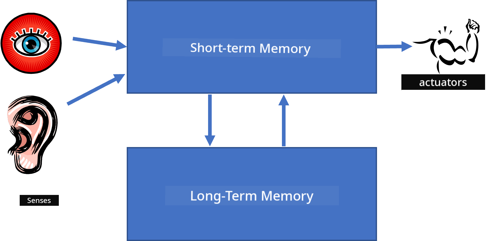
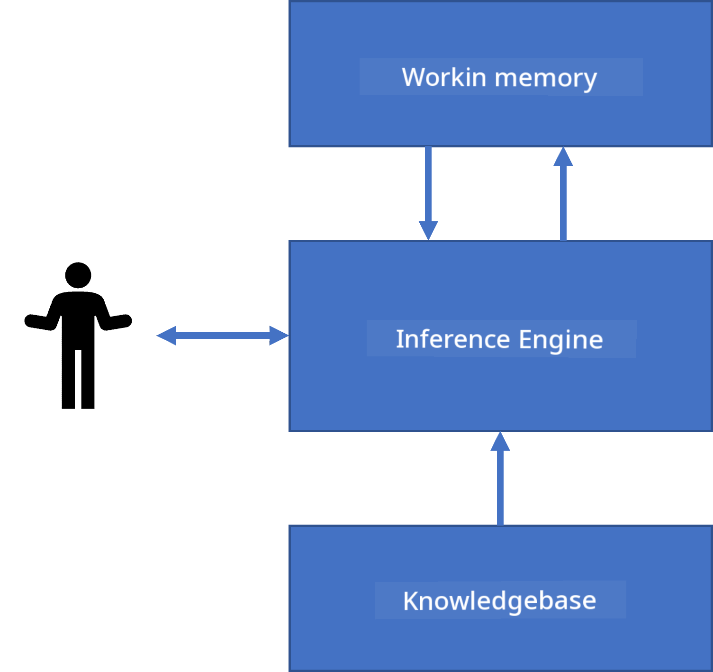
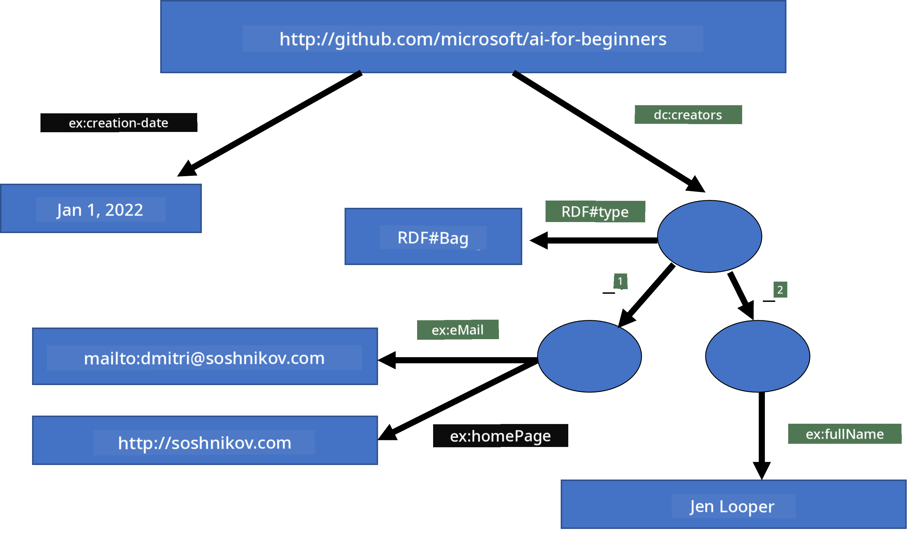

<!--
CO_OP_TRANSLATOR_METADATA:
{
  "original_hash": "7d097f7fda9166ead615e4c34552381b",
  "translation_date": "2025-11-18T18:33:25+00:00",
  "source_file": "lessons/2-Symbolic/README.md",
  "language_code": "pcm"
}
-->
# Knowledge Representation and Expert Systems


> Sketchnote by [Tomomi Imura](https://twitter.com/girlie_mac)

Di waka for artificial intelligence na di search for knowledge, to sabi di world like how humans dey do am. But how pesin go fit do dis one?

## [Pre-lecture quiz](https://ff-quizzes.netlify.app/en/ai/quiz/3)

For di early days of AI, di top-down way to create intelligent systems (we talk am for di last lesson) dey popular. Di idea na to collect di knowledge wey dey people head put am for machine-readable form, den use am solve problems automatically. Dis way dey base on two big ideas:

* Knowledge Representation
* Reasoning

## Knowledge Representation

One important thing for Symbolic AI na **knowledge**. E dey important to sabi di difference between knowledge and *information* or *data*. For example, pesin fit talk say books get knowledge, because pesin fit study di books become expert. But wetin dey inside books na actually *data*, and as we dey read di books and put di data for our world model, na so we dey turn di data to knowledge.

> ✅ **Knowledge** na wetin dey our head wey show how we sabi di world. We dey get am through active **learning** process, wey dey join di information wey we collect into di model of di world wey dey our head.

Most times, we no dey define knowledge strictly, but we dey align am with other related ideas using [DIKW Pyramid](https://en.wikipedia.org/wiki/DIKW_pyramid). Di pyramid get di following ideas:

* **Data** na wetin dey physical media, like written text or spoken words. Data dey exist on its own, e no need human beings and e fit pass from one pesin to another.
* **Information** na how we dey understand di data for our head. For example, if we hear di word *computer*, we go get some idea of wetin e mean.
* **Knowledge** na di information wey don enter our world model. For example, once we sabi wetin computer be, we go start get idea of how e dey work, how much e go cost, and wetin we fit use am do. Dis network of connected ideas na di knowledge wey we get.
* **Wisdom** na di next level of how we sabi di world, e dey represent *meta-knowledge*, like how and when we suppose use di knowledge.


*Image [from Wikipedia](https://commons.wikimedia.org/w/index.php?curid=37705247), By Longlivetheux - Own work, CC BY-SA 4.0*

So, di problem of **knowledge representation** na to find better way to represent knowledge inside computer as data, so e go fit dey useful automatically. We fit see am as spectrum:


> Image by [Dmitry Soshnikov](http://soshnikov.com)

* For di left side, we get very simple types of knowledge representations wey computers fit use well. Di simplest one na algorithmic, where knowledge dey represented by computer program. But dis one no be di best way to represent knowledge, because e no dey flexible. Knowledge for our head no dey always follow algorithm.
* For di right side, we get representations like natural text. E strong well, but e no fit dey used for automatic reasoning.

> ✅ Think small about how you dey represent knowledge for your head and turn am to notes. You get any format wey dey work well for you to help you remember?

## Classifying Computer Knowledge Representations

We fit divide di different computer knowledge representation methods into di following categories:

* **Network representations** dey base on di fact say we get network of connected ideas for our head. We fit try reproduce di same network as graph inside computer - di one wey dem dey call **semantic network**.

1. **Object-Attribute-Value triplets** or **attribute-value pairs**. Since graph fit dey represented inside computer as list of nodes and edges, we fit represent semantic network as list of triplets, wey get objects, attributes, and values. For example, we fit build di following triplets about programming languages:

Object | Attribute | Value
-------|-----------|------
Python | is | Untyped-Language
Python | invented-by | Guido van Rossum
Python | block-syntax | indentation
Untyped-Language | doesn't have | type definitions

> ✅ Think how triplets fit dey used to represent other types of knowledge.

2. **Hierarchical representations** dey show say we dey often create hierarchy of objects for our head. For example, we sabi say canary na bird, and all birds get wings. We also get idea of di colour wey canary dey usually be, and di speed wey dem dey fly.

   - **Frame representation** dey base on di idea say we fit represent each object or class of objects as **frame** wey get **slots**. Slots fit get default values, value restrictions, or stored procedures wey fit dey called to get di value of di slot. All di frames dey form hierarchy like object hierarchy for object-oriented programming languages.
   - **Scenarios** na special type of frames wey dey represent complex situations wey fit happen over time.

**Python**

Slot | Value | Default value | Interval |
-----|-------|---------------|----------|
Name | Python | | |
Is-A | Untyped-Language | | |
Variable Case | | CamelCase | |
Program Length | | | 5-5000 lines |
Block Syntax | Indent | | |

3. **Procedural representations** dey base on di idea say we fit represent knowledge as list of actions wey fit dey executed when certain condition happen.
   - Production rules na if-then statements wey dey allow us draw conclusions. For example, doctor fit get rule wey talk say **IF** patient get high fever **OR** high level of C-reactive protein for blood test **THEN** e get inflammation. Once we see one of di conditions, we fit conclude say e get inflammation, and use am for further reasoning.
   - Algorithms fit dey considered as another type of procedural representation, but dem no dey almost ever used directly for knowledge-based systems.

4. **Logic** na wetin Aristotle propose as way to represent universal human knowledge.
   - Predicate Logic as mathematical theory too rich to dey computable, so dem dey usually use subset of am, like Horn clauses wey dem dey use for Prolog.
   - Descriptive Logic na family of logical systems wey dem dey use to represent and reason about hierarchies of objects distributed knowledge representations like *semantic web*.

## Expert Systems

One of di early success of symbolic AI na di **expert systems** - computer systems wey dem design to act like expert for some small problem area. Dem dey base on **knowledge base** wey dem collect from one or more human experts, and dem get **inference engine** wey dey perform reasoning on top.

 | 
---------------------------------------------|------------------------------------------------
Simplified structure of a human neural system | Architecture of a knowledge-based system

Expert systems dey build like human reasoning system, wey get **short-term memory** and **long-term memory**. For knowledge-based systems, we dey divide di components like dis:

* **Problem memory**: e dey hold di knowledge about di problem wey we dey solve now, like di temperature or blood pressure of patient, whether e get inflammation or not, etc. Dis knowledge na **static knowledge**, because e dey show snapshot of wetin we sabi about di problem - di *problem state*.
* **Knowledge base**: e dey represent long-term knowledge about di problem area. Dem dey collect am manually from human experts, and e no dey change from one consultation to another. Because e dey help us move from one problem state to another, dem dey call am **dynamic knowledge**.
* **Inference engine**: e dey control di whole process of searching di problem state space, dey ask user questions when e need. E dey also find di correct rules to apply for each state.

Example, make we look di expert system wey dey determine animal based on di physical characteristics:


> Image by [Dmitry Soshnikov](http://soshnikov.com)

Dis diagram na **AND-OR tree**, e dey show di graphical representation of set of production rules. To draw tree dey useful for di beginning when we dey collect knowledge from di expert. To represent di knowledge inside computer, e better to use rules:

```
IF the animal eats meat
OR (animal has sharp teeth
    AND animal has claws
    AND animal has forward-looking eyes
) 
THEN the animal is a carnivore
```

You fit notice say each condition for di left-hand-side of di rule and di action na basically object-attribute-value (OAV) triplets. **Working memory** dey hold di set of OAV triplets wey match di problem we dey solve now. **Rules engine** dey look for rules wey condition dey satisfied and apply dem, dey add another triplet to di working memory.

> ✅ Try write your own AND-OR tree for any topic wey you like!

### Forward vs. Backward Inference

Di process wey we describe above na **forward inference**. E dey start with some initial data about di problem wey dey di working memory, den e dey follow dis reasoning loop:

1. If di target attribute dey di working memory - stop and give di result
2. Look for all di rules wey condition dey satisfied - get **conflict set** of rules.
3. Do **conflict resolution** - choose one rule wey go dey executed for dis step. Different conflict resolution strategies dey:
   - Choose di first rule wey fit work for di knowledge base
   - Choose random rule
   - Choose di *more specific* rule, wey dey meet di most conditions for di "left-hand-side" (LHS)
4. Apply di rule wey you choose and add new knowledge to di problem state
5. Repeat from step 1.

But sometimes we fit want start with empty knowledge about di problem, and dey ask questions wey go help us reach di conclusion. For example, for medical diagnosis, we no dey do all di medical tests before we start diagnose di patient. We go prefer do di tests when decision need to dey made.

Dis process fit dey modeled using **backward inference**. E dey driven by di **goal** - di attribute value wey we dey find:

1. Choose all di rules wey fit give us di value of di goal (i.e. di goal dey di RHS ("right-hand-side")) - conflict set
1. If no rules dey for dis attribute, or rule dey wey talk say we suppose ask di user - ask di user, if not:
1. Use conflict resolution strategy to choose one rule wey we go use as *hypothesis* - we go try prove am
1. Repeat di process for all di attributes for di LHS of di rule, dey try prove dem as goals
1. If di process fail at any point - use another rule for step 3.

> ✅ For which situations forward inference dey better? How about backward inference?

### Implementing Expert Systems

We fit implement expert systems using different tools:

* Program dem directly for some high level programming language. Dis no be di best idea, because di main advantage of knowledge-based system na say knowledge dey separate from inference, and di expert for di problem area suppose fit write rules without sabi di details of di inference process.
* Use **expert systems shell**, i.e. system wey dem design specially to dey filled with knowledge using some knowledge representation language.

## ✍️ Exercise: Animal Inference

Check [Animals.ipynb](https://github.com/microsoft/AI-For-Beginners/blob/main/lessons/2-Symbolic/Animals.ipynb) for example of how to implement forward and backward inference expert system.

> **Note**: Dis example dey simple, e just dey show how expert system dey look like. Once you start dey create dis kind system, you go only notice some *intelligent* behaviour from am once you get plenty rules, like 200+. At one point, di rules go too complex to keep all for mind, and na dat time you fit dey wonder why di system dey make some decisions. But di important thing about knowledge-based systems na say you fit always *explain* how di system make any decision.

## Ontologies and the Semantic Web

For di end of 20th century, dem start one initiative to use knowledge representation to mark Internet resources, so e go dey possible to find resources wey match very specific queries. Dis movement dem dey call **Semantic Web**, and e dey base on some ideas:

- Special knowledge representation wey dey based on **[description logics](https://en.wikipedia.org/wiki/Description_logic)** (DL). E dey similar to frame knowledge representation, because e dey build hierarchy of objects with properties, but e get formal logical semantics and inference. Plenty DLs dey wey dey balance expressiveness and algorithmic complexity of inference.
- Distributed knowledge representation, where all di ideas dey represented by global URI identifier, wey make am possible to create knowledge hierarchies wey dey spread across di internet.
- One group of XML-based languages wey dem dey use for knowledge description: RDF (Resource Description Framework), RDFS (RDF Schema), OWL (Ontology Web Language).

One main idea for Semantic Web na di idea of **Ontology**. E mean say you go fit describe one problem area well-well using formal knowledge representation. Di simplest ontology fit just be hierarchy of objects for one problem area, but di more complex ones go get rules wey dem fit use for inference.

For Semantic Web, all di representation na based on triplets. Each object and each relation get im own unique URI. For example, if we wan talk say na Dmitry Soshnikov develop dis AI Curriculum on Jan 1st, 2022 - na di triplets we fit use be dis:


```
http://github.com/microsoft/ai-for-beginners http://www.example.com/terms/creation-date “Jan 13, 2007”
http://github.com/microsoft/ai-for-beginners http://purl.org/dc/elements/1.1/creator http://soshnikov.com
```

> ✅ Here `http://www.example.com/terms/creation-date` and `http://purl.org/dc/elements/1.1/creator` na some well-known and universally accepted URIs to talk about di concepts of *creator* and *creation date*.

If di case complex pass dis one, and we wan define list of creators, we fit use some data structures wey RDF define.



> Diagrams wey dey above na by [Dmitry Soshnikov](http://soshnikov.com)

Di progress to build Semantic Web slow small because search engines and natural language processing techniques don dey successful, and dem dey help extract structured data from text. But for some areas, people still dey try maintain ontologies and knowledge bases. Some projects wey worth to mention:

* [WikiData](https://wikidata.org/) na collection of machine-readable knowledge bases wey dey linked with Wikipedia. Most of di data dem dey mine am from Wikipedia *InfoBoxes*, wey be structured content inside Wikipedia pages. You fit [query](https://query.wikidata.org/) wikidata with SPARQL, one special query language for Semantic Web. See one sample query wey dey show di most popular eye colors among humans:

```sparql
#defaultView:BubbleChart
SELECT ?eyeColorLabel (COUNT(?human) AS ?count)
WHERE
{
  ?human wdt:P31 wd:Q5.       # human instance-of homo sapiens
  ?human wdt:P1340 ?eyeColor. # human eye-color ?eyeColor
  SERVICE wikibase:label { bd:serviceParam wikibase:language "en". }
}
GROUP BY ?eyeColorLabel
```

* [DBpedia](https://www.dbpedia.org/) na another project wey be like WikiData.

> ✅ If you wan try build your own ontologies, or open di ones wey don already dey, one better visual ontology editor dey wey dem dey call [Protégé](https://protege.stanford.edu/). You fit download am, or use am online.


*Web Protégé editor dey open with di Romanov Family ontology. Screenshot by Dmitry Soshnikov*

## ✍️ Exercise: A Family Ontology

Check [FamilyOntology.ipynb](https://github.com/Ezana135/AI-For-Beginners/blob/main/lessons/2-Symbolic/FamilyOntology.ipynb) to see example of how Semantic Web techniques fit help reason about family relationships. We go use family tree wey dey common GEDCOM format and one ontology of family relationships to build graph of all di family relationships for di people wey dem give.

## Microsoft Concept Graph

Most times, people dey carefully create ontologies by hand. But e still dey possible to **mine** ontologies from unstructured data, like natural language texts.

Microsoft Research try do one like dat, and e result to [Microsoft Concept Graph](https://blogs.microsoft.com/ai/microsoft-researchers-release-graph-that-helps-machines-conceptualize/?WT.mc_id=academic-77998-cacaste).

E be big collection of entities wey dem group together using `is-a` inheritance relationship. E fit answer questions like "Wetin be Microsoft?" - di answer fit be something like "a company with probability 0.87, and a brand with probability 0.75".

Di Graph dey available as REST API, or as big downloadable text file wey list all di entity pairs.

## ✍️ Exercise: A Concept Graph

Try di [MSConceptGraph.ipynb](https://github.com/microsoft/AI-For-Beginners/blob/main/lessons/2-Symbolic/MSConceptGraph.ipynb) notebook to see how we fit use Microsoft Concept Graph to group news articles into different categories.

## Conclusion

Nowadays, people dey see AI as di same thing with *Machine Learning* or *Neural Networks*. But human beings dey show explicit reasoning, and neural networks never sabi handle dat one. For real-world projects, explicit reasoning still dey useful to do tasks wey need explanation, or wey need make we fit control di system behavior.

## 🚀 Challenge

For di Family Ontology notebook wey follow dis lesson, you fit try experiment with other family relations. Try discover new connections between people for di family tree.

## [Post-lecture quiz](https://ff-quizzes.netlify.app/en/ai/quiz/4)

## Review & Self Study

Do small research online to find areas where humans don try quantify and codify knowledge. Check Bloom's Taxonomy, and go back to history to learn how humans don dey try understand di world. Look di work of Linnaeus to create taxonomy of organisms, and see how Dmitri Mendeleev create way to describe and group chemical elements. Wetin other interesting examples you fit find?

**Assignment**: [Build an Ontology](assignment.md)

---

<!-- CO-OP TRANSLATOR DISCLAIMER START -->
**Disclaimer**:  
Dis dokyument don use AI transleshion service [Co-op Translator](https://github.com/Azure/co-op-translator) do di transleshion. Even though we dey try make am accurate, abeg make you sabi say automatik transleshion fit get mistake or no dey correct well. Di original dokyument for im native language na di main source wey you go fit trust. For important informashon, e good make you use professional human transleshion. We no go fit take blame for any misunderstanding or wrong meaning wey fit happen because you use dis transleshion.
<!-- CO-OP TRANSLATOR DISCLAIMER END -->