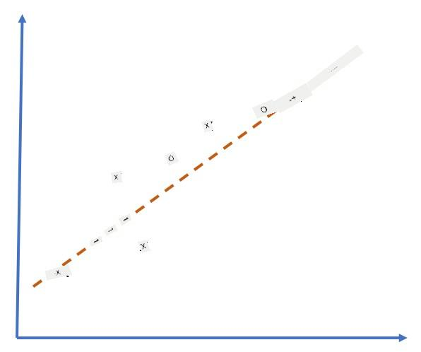
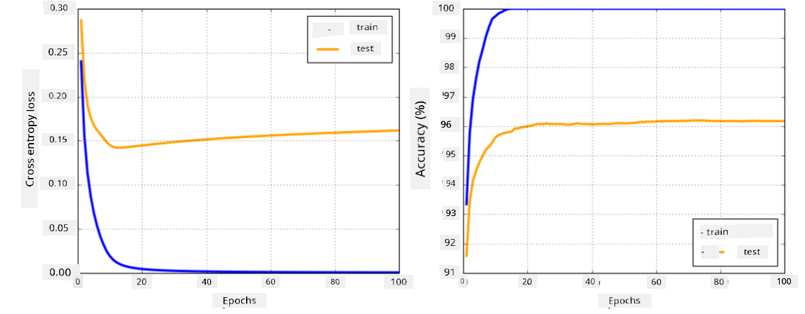

<!--
CO_OP_TRANSLATOR_METADATA:
{
  "original_hash": "ddd216f558a255260a9374008002c971",
  "translation_date": "2025-11-18T18:29:12+00:00",
  "source_file": "lessons/3-NeuralNetworks/05-Frameworks/README.md",
  "language_code": "pcm"
}
-->
# Neural Network Frameworks

As we don learn already, to fit train neural networks well well, we need do two things:

* Make sure say we fit work with tensors, like to multiply, add, and calculate some functions like sigmoid or softmax
* Fit calculate gradients for all expressions, so we fit use am do gradient descent optimization

## [Pre-lecture quiz](https://ff-quizzes.netlify.app/en/ai/quiz/9)

Even though `numpy` library fit do the first part, we need one way to calculate gradients. For [our framework](../04-OwnFramework/OwnFramework.ipynb) wey we don develop for the last section, we bin dey manually program all derivative functions inside the `backward` method, wey dey do backpropagation. Ideally, framework suppose give us chance to calculate gradients for *any expression* wey we fit define.

Another important thing na say we suppose fit run computations for GPU, or any other special compute units, like [TPU](https://en.wikipedia.org/wiki/Tensor_Processing_Unit). Training deep neural networks dey need *plenty* computations, and to fit share those computations for GPUs dey very important.

> ✅ The word 'parallelize' mean to share the computations across plenty devices.

Right now, the two most popular neural frameworks na: [TensorFlow](http://TensorFlow.org) and [PyTorch](https://pytorch.org/). Both dey provide low-level API to work with tensors for both CPU and GPU. On top the low-level API, dem still get higher-level API, wey dem call [Keras](https://keras.io/) and [PyTorch Lightning](https://pytorchlightning.ai/) respectively.

Low-Level API | [TensorFlow](http://TensorFlow.org) | [PyTorch](https://pytorch.org/)
--------------|-------------------------------------|--------------------------------
High-level API| [Keras](https://keras.io/) | [PyTorch Lightning](https://pytorchlightning.ai/)

**Low-level APIs** for both frameworks dey allow you build wetin dem dey call **computational graphs**. This graph dey show how to calculate the output (usually the loss function) with the input parameters wey you give, and e fit run for GPU if e dey available. Dem get functions to differentiate this computational graph and calculate gradients, wey fit then dey used to optimize model parameters.

**High-level APIs** dey treat neural networks like **sequence of layers**, and e dey make am easy to build most neural networks. To train the model, you go need prepare the data and then call `fit` function to do the work.

The high-level API dey allow you build normal neural networks fast fast without worrying about plenty details. But the low-level API dey give you more control over the training process, so dem dey use am plenty for research, especially when you dey work on new neural network architectures.

E dey important to understand say you fit use both APIs together. For example, you fit create your own network layer architecture with low-level API, then use am inside bigger network wey you build and train with high-level API. Or you fit define network with high-level API as sequence of layers, then use your own low-level training loop to do optimization. Both APIs dey use the same basic concepts, and dem dey designed to work well together.

## Learning

For this course, we dey provide most of the content for both PyTorch and TensorFlow. You fit choose the framework wey you like and focus on the notebooks wey match am. If you no sure which framework to choose, check discussions online about **PyTorch vs. TensorFlow**. You fit also look both frameworks to understand dem better.

Where e dey possible, we go use High-Level APIs for simplicity. But we believe say e dey important to understand how neural networks dey work from scratch, so for the beginning we go start with low-level API and tensors. But if you wan start fast and no wan spend plenty time learning these details, you fit skip am and go straight to high-level API notebooks.

## ✍️ Exercises: Frameworks

Continue your learning for the notebooks below:

Low-Level API | [TensorFlow+Keras Notebook](IntroKerasTF.ipynb) | [PyTorch](IntroPyTorch.ipynb)
--------------|-------------------------------------|--------------------------------
High-level API| [Keras](IntroKeras.ipynb) | *PyTorch Lightning*

After you don master the frameworks, make we go back to the topic of overfitting.

# Overfitting

Overfitting na very important concept for machine learning, and e dey very important to understand am well!

Look this problem of trying to fit 5 dots (we dey represent with `x` for the graphs below):

 | 
-------------------------|--------------------------
**Linear model, 2 parameters** | **Non-linear model, 7 parameters**
Training error = 5.3 | Training error = 0
Validation error = 5.1 | Validation error = 20

* For the left side, we see better straight line approximation. Because the number of parameters dey okay, the model understand the point distribution well.
* For the right side, the model too strong. Because we only get 5 points and the model get 7 parameters, e fit adjust to pass through all the points, making training error 0. But this no allow the model understand the correct pattern for the data, so validation error dey very high.

E dey very important to balance the model strength (number of parameters) and the number of training samples.

## Why overfitting dey happen

  * Training data no plenty
  * Model too strong
  * Input data get too much noise

## How to detect overfitting

As you see for the graph above, overfitting fit show when training error dey very low, but validation error dey high. Normally, during training, both training and validation errors go dey reduce, but at one point validation error fit stop to reduce and start to increase. This na sign of overfitting, and e mean say we suppose stop training for that point (or at least save the model snapshot).

## How to prevent overfitting

If you notice say overfitting dey happen, you fit do one of these:

 * Add more training data
 * Reduce the model complexity
 * Use some [regularization technique](../../4-ComputerVision/08-TransferLearning/TrainingTricks.md), like [Dropout](../../4-ComputerVision/08-TransferLearning/TrainingTricks.md#Dropout), wey we go talk about later.

## Overfitting and Bias-Variance Tradeoff

Overfitting na one example of one bigger problem for statistics wey dem dey call [Bias-Variance Tradeoff](https://en.wikipedia.org/wiki/Bias%E2%80%93variance_tradeoff). If we look the possible sources of error for our model, we go see two types of errors:

* **Bias errors** dey happen when our algorithm no fit capture the relationship for training data well. E fit happen if our model no strong enough (**underfitting**).
* **Variance errors**, dey happen when the model dey fit noise for the input data instead of meaningful relationship (**overfitting**).

During training, bias error dey reduce (as our model dey learn to fit the data), but variance error dey increase. E dey important to stop training - either manually (when we notice overfitting) or automatically (by using regularization) - to avoid overfitting.

## Conclusion

For this lesson, you don learn the difference between the different APIs for the two most popular AI frameworks, TensorFlow and PyTorch. You also don learn about one very important topic, overfitting.

## 🚀 Challenge

For the notebooks wey follow this lesson, you go see 'tasks' for the bottom; work through the notebooks and complete the tasks.

## [Post-lecture quiz](https://ff-quizzes.netlify.app/en/ai/quiz/10)

## Review & Self Study

Do small research on these topics:

- TensorFlow
- PyTorch
- Overfitting

Ask yourself these questions:

- Wetin be the difference between TensorFlow and PyTorch?
- Wetin be the difference between overfitting and underfitting?

## [Assignment](lab/README.md)

For this lab, you go solve two classification problems using single- and multi-layered fully-connected networks with PyTorch or TensorFlow.

* [Instructions](lab/README.md)
* [Notebook](lab/LabFrameworks.ipynb)

---

<!-- CO-OP TRANSLATOR DISCLAIMER START -->
**Disclaimer**:  
Dis dokyument don use AI translation service [Co-op Translator](https://github.com/Azure/co-op-translator) do di translation. Even as we dey try make am accurate, abeg make you sabi say machine translation fit get mistake or no dey correct well. Di original dokyument for di language wey dem write am first na di main source wey you go trust. For important mata, e good make professional human translator check am. We no go fit take blame for any misunderstanding or wrong interpretation wey fit happen because you use dis translation.
<!-- CO-OP TRANSLATOR DISCLAIMER END -->