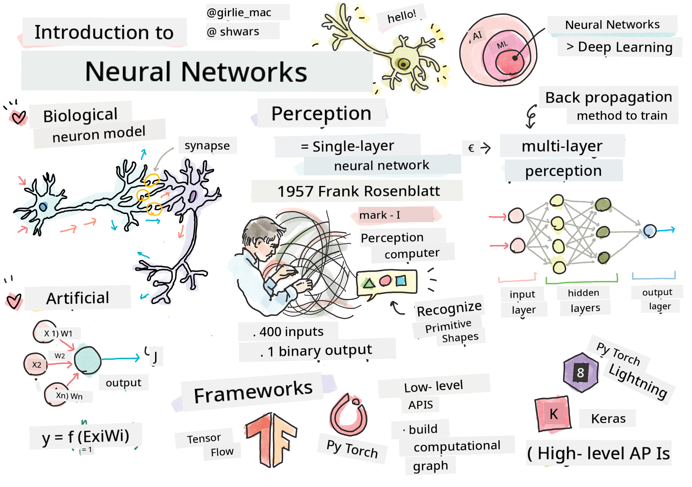

<!--
CO_OP_TRANSLATOR_METADATA:
{
  "original_hash": "f862a99d88088163df12270e2f2ad6c3",
  "translation_date": "2025-11-18T18:26:13+00:00",
  "source_file": "lessons/3-NeuralNetworks/README.md",
  "language_code": "pcm"
}
-->
# Introduction to Neural Networks

As we don talk for di introduction, one way wey we fit take achieve intelligence na to train one **computer model** or one **artificial brain**. Since di middle of 20th century, researchers don dey try different mathematical models, until recent years wey dis direction don show say e dey very successful. Dis kind mathematical models of di brain dem dey call am **neural networks**.

> Sometimes dem dey call neural networks *Artificial Neural Networks*, ANNs, to show say na models we dey talk about, no be real networks of neurons.

## Machine Learning

Neural Networks na part of one bigger area wey dem dey call **Machine Learning**, wey di goal na to use data train computer models wey fit solve problems. Machine Learning na big part of Artificial Intelligence, but for dis curriculum we no go cover di classical ML.

> Check our separate **[Machine Learning for Beginners](http://github.com/microsoft/ml-for-beginners)** curriculum to sabi more about classic Machine Learning.

For Machine Learning, we dey assume say we get one dataset of examples **X**, and di output values wey follow am **Y**. Examples dey often be N-dimensional vectors wey get **features**, and di outputs dem dey call am **labels**.

We go look di two most common machine learning problems:

* **Classification**, wey mean say we go classify one input object into two or more classes.
* **Regression**, wey mean say we go predict one number for each of di input samples.

> If we dey represent inputs and outputs as tensors, di input dataset na matrix wey get size M&times;N, where M na di number of samples and N na di number of features. Output labels Y na di vector wey get size M.

For dis curriculum, we go only focus on neural network models.

## A Model of a Neuron

For biology, we sabi say our brain dey made up of neural cells (neurons), and each of dem get plenty "inputs" (dendrites) and one "output" (axon). Both dendrites and axons fit carry electrical signals, and di connections between dem — wey dem dey call synapses — fit get different levels of conductivity, wey neurotransmitters dey control.

 | 
----|----
Real Neuron *([Image](https://en.wikipedia.org/wiki/Synapse#/media/File:SynapseSchematic_lines.svg) from Wikipedia)* | Artificial Neuron *(Image by Author)*

So, di simplest mathematical model of a neuron get plenty inputs X1, ..., XN and one output Y, plus weights W1, ..., WN. Di output na:

where f na one non-linear **activation function**.

> Di early models of neuron dem describe am for di classical paper [A logical calculus of the ideas immanent in nervous activity](https://www.cs.cmu.edu/~./epxing/Class/10715/reading/McCulloch.and.Pitts.pdf) by Warren McCullock and Walter Pitts for 1943. Donald Hebb for im book "[The Organization of Behavior: A Neuropsychological Theory](https://books.google.com/books?id=VNetYrB8EBoC)" propose how dem fit train dis networks.

## For dis Section

For dis section we go learn about:
* [Perceptron](03-Perceptron/README.md), one of di first neural network models for two-class classification
* [Multi-layered networks](04-OwnFramework/README.md) with one notebook [how to build our own framework](04-OwnFramework/OwnFramework.ipynb)
* [Neural Network Frameworks](05-Frameworks/README.md), with dis notebooks: [PyTorch](05-Frameworks/IntroPyTorch.ipynb) and [Keras/Tensorflow](05-Frameworks/IntroKerasTF.ipynb)
* [Overfitting](../../../../lessons/3-NeuralNetworks/05-Frameworks)

---

<!-- CO-OP TRANSLATOR DISCLAIMER START -->
**Disclaimer**:  
Dis dokyument don use AI translation service [Co-op Translator](https://github.com/Azure/co-op-translator) take translate am. Even though we dey try make sure say e correct, abeg sabi say automatic translation fit get mistake or no dey accurate well. Di original dokyument for im native language na di main correct source. For important information, e go beta make professional human translator check am. We no go fit take blame for any misunderstanding or wrong interpretation wey fit happen because of dis translation.
<!-- CO-OP TRANSLATOR DISCLAIMER END -->