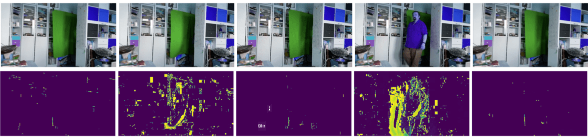

<!--
CO_OP_TRANSLATOR_METADATA:
{
  "original_hash": "feeca98225cb420afc89415f24f63d92",
  "translation_date": "2025-11-18T18:14:02+00:00",
  "source_file": "lessons/4-ComputerVision/06-IntroCV/README.md",
  "language_code": "pcm"
}
-->
# Introduction to Computer Vision

[Computer Vision](https://wikipedia.org/wiki/Computer_vision) na area wey dey try make computer sabi wetin dey happen for digital pictures. Dis definition dey wide well-well, because *understanding* fit mean plenty things, like to find object for picture (**object detection**), sabi wetin dey happen (**event detection**), describe picture with text, or even build scene for 3D. E still get special work wey concern human pictures: age and emotion estimation, face detection and identification, and 3D pose estimation, among others.

## [Pre-lecture quiz](https://ff-quizzes.netlify.app/en/ai/quiz/11)

One of di simplest work for computer vision na **image classification**.

People dey see computer vision as one part of AI. Nowadays, most of di work for computer vision dey use neural networks. We go learn more about di special type of neural networks wey dem dey use for computer vision, [convolutional neural networks](../07-ConvNets/README.md), for dis section.

But before you go pass image enter neural network, e go make sense to use some algorithmic techniques to make di image better.

Plenty Python libraries dey wey fit help for image processing:

* **[imageio](https://imageio.readthedocs.io/en/stable/)** fit help you read/write different image formats. E still support ffmpeg, wey be tool wey fit change video frames to images.
* **[Pillow](https://pillow.readthedocs.io/en/stable/index.html)** (dem dey call am PIL too) get more power, and e fit do some image manipulation like morphing, palette adjustments, and more.
* **[OpenCV](https://opencv.org/)** na strong image processing library wey dem write with C++, and e don turn di *de facto* standard for image processing. E get Python interface wey dey easy to use.
* **[dlib](http://dlib.net/)** na C++ library wey get plenty machine learning algorithms, including some Computer Vision algorithms. E get Python interface too, and e fit help for hard work like face and facial landmark detection.

## OpenCV

[OpenCV](https://opencv.org/) na di *de facto* standard for image processing. E get plenty useful algorithms wey dem write with C++. You fit use OpenCV with Python too.

If you wan learn OpenCV well, check [dis Learn OpenCV course](https://learnopencv.com/getting-started-with-opencv/). For our curriculum, we no dey focus to learn OpenCV fully, but to show you some examples of how e fit work and wetin e fit do.

### Loading Images

Images for Python dey easy to represent as NumPy arrays. For example, grayscale images wey get size of 320x200 pixels go dey as 200x320 array, and color images wey get di same size go get shape of 200x320x3 (for 3 color channels). To load image, you fit use dis code:

```python
import cv2
import matplotlib.pyplot as plt

im = cv2.imread('image.jpeg')
plt.imshow(im)
```

Normally, OpenCV dey use BGR (Blue-Green-Red) encoding for color images, but di rest Python tools dey use RGB (Red-Green-Blue). To make di image look correct, you go need change am to RGB color space, either by swapping dimensions for di NumPy array, or by using OpenCV function:

```python
im = cv2.cvtColor(im,cv2.COLOR_BGR2RGB)
```

Di same `cvtColor` function fit help you do other color space transformations like changing image to grayscale or to HSV (Hue-Saturation-Value) color space.

You fit still use OpenCV to load video frame-by-frame - example dey for di exercise [OpenCV Notebook](OpenCV.ipynb).

### Image Processing

Before you go give image to neural network, e good to do some pre-processing steps. OpenCV fit do plenty things, like:

* **Resizing** di image with `im = cv2.resize(im, (320,200),interpolation=cv2.INTER_LANCZOS)`
* **Blurring** di image with `im = cv2.medianBlur(im,3)` or `im = cv2.GaussianBlur(im, (3,3), 0)`
* To change di **brightness and contrast** of di image, you fit use NumPy array manipulations, as dem explain [for dis Stackoverflow note](https://stackoverflow.com/questions/39308030/how-do-i-increase-the-contrast-of-an-image-in-python-opencv).
* Use [thresholding](https://docs.opencv.org/4.x/d7/d4d/tutorial_py_thresholding.html) by calling `cv2.threshold`/`cv2.adaptiveThreshold` functions, wey dey better pass to adjust brightness or contrast.
* Do different [transformations](https://docs.opencv.org/4.5.5/da/d6e/tutorial_py_geometric_transformations.html) for di image:
    - **[Affine transformations](https://docs.opencv.org/4.5.5/d4/d61/tutorial_warp_affine.html)** fit help you if you wan combine rotation, resizing and skewing for di image and you sabi di source and destination location of three points for di image. Affine transformations dey keep parallel lines parallel.
    - **[Perspective transformations](https://medium.com/analytics-vidhya/opencv-perspective-transformation-9edffefb2143)** fit help you if you sabi di source and destination positions of 4 points for di image. For example, if you snap picture of rectangular document with smartphone camera from angle, and you wan make di document look rectangular for di image.
* Sabi movement inside di image by using **[optical flow](https://docs.opencv.org/4.5.5/d4/dee/tutorial_optical_flow.html)**.

## Examples of using Computer Vision

For our [OpenCV Notebook](OpenCV.ipynb), we show some examples of how computer vision fit help do specific work:

* **Pre-processing photograph of Braille book**. We dey focus on how we fit use thresholding, feature detection, perspective transformation and NumPy manipulations to separate Braille symbols for classification by neural network.

 |  | 
----|-----|-----

> Image from [OpenCV.ipynb](OpenCV.ipynb)

* **Detecting motion for video using frame difference**. If camera no dey move, di frames from di camera feed suppose dey similar. Since frames dey as arrays, if you subtract di arrays for two frames wey follow each other, you go get di pixel difference, wey suppose dey small for static frames, and go big if motion dey for di image.



> Image from [OpenCV.ipynb](OpenCV.ipynb)

* **Detecting motion using Optical Flow**. [Optical flow](https://docs.opencv.org/3.4/d4/dee/tutorial_optical_flow.html) dey help us sabi how individual pixels for video frames dey move. E get two types of optical flow:

   - **Dense Optical Flow** dey calculate vector field wey show where each pixel dey move go.
   - **Sparse Optical Flow** dey use some special features for di image (like edges), and e dey build their movement from frame to frame.


> Image from [OpenCV.ipynb](OpenCV.ipynb)

## ✍️ Example Notebooks: OpenCV [try OpenCV in Action](OpenCV.ipynb)

Make we try experiment with OpenCV by checking [OpenCV Notebook](OpenCV.ipynb)

## Conclusion

Sometimes, work wey dey hard like movement detection or fingertip detection fit dey solved only with computer vision. So e good to sabi di basic techniques for computer vision, and wetin libraries like OpenCV fit do.

## 🚀 Challenge

Watch [dis video](https://docs.microsoft.com/shows/ai-show/ai-show--2021-opencv-ai-competition--grand-prize-winners--cortic-tigers--episode-32?WT.mc_id=academic-77998-cacaste) from di AI show to learn about di Cortic Tigers project and how dem build block-based solution to make computer vision work easy via robot. Do research on other projects like dis wey dey help new learners enter di field.

## [Post-lecture quiz](https://ff-quizzes.netlify.app/en/ai/quiz/12)

## Review & Self Study

Read more about optical flow [for dis better tutorial](https://learnopencv.com/optical-flow-in-opencv/).

## [Assignment](lab/README.md)

For dis lab, you go take video wey get simple gestures, and your work na to find up/down/left/right movements using optical flow.


---

<!-- CO-OP TRANSLATOR DISCLAIMER START -->
**Disclaimer**:  
Dis document don use AI translation service [Co-op Translator](https://github.com/Azure/co-op-translator) take translate am. Even though we dey try make e accurate, abeg sabi say automated translations fit get mistake or no correct well. Di original document for di native language na di main correct source. For important information, e better make una use professional human translation. We no go fit take blame for any misunderstanding or wrong interpretation wey fit happen because of dis translation.
<!-- CO-OP TRANSLATOR DISCLAIMER END -->