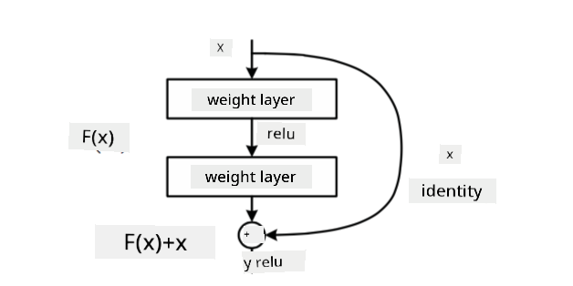

<!--
CO_OP_TRANSLATOR_METADATA:
{
  "original_hash": "53faab85adfcebd8c10bcd71dc2fa557",
  "translation_date": "2025-11-18T18:21:54+00:00",
  "source_file": "lessons/4-ComputerVision/07-ConvNets/CNN_Architectures.md",
  "language_code": "pcm"
}
-->
# Well-Known CNN Architectures

### VGG-16

VGG-16 na network wey get 92.7% accuracy for ImageNet top-5 classification for 2014. E get dis kain layer structure:

As you fit see, VGG dey follow traditional pyramid architecture, wey be sequence of convolution-pooling layers.

> Image from [Researchgate](https://www.researchgate.net/figure/Vgg16-model-structure-To-get-the-VGG-NIN-model-we-replace-the-2-nd-4-th-6-th-7-th_fig2_335194493)

### ResNet

ResNet na family of models wey Microsoft Research propose for 2015. Di main idea for ResNet na to use **residual blocks**:

> Image from [this paper](https://arxiv.org/pdf/1512.03385.pdf)

Di reason why dem dey use identity pass-through na make di layer fit predict **di difference** between di result of di previous layer and di output of di residual block - na why dem call am *residual*. Dis blocks dey easy to train, and person fit build networks wey get hundreds of dis blocks (di common ones na ResNet-52, ResNet-101 and ResNet-152).

You fit also think say dis network fit adjust di complexity to di dataset. For di beginning, when you dey start to train di network, di weights values dey small, and most of di signal dey pass through identity layers. As training dey go on and weights dey grow big, di importance of di network parameters go increase, and di network go adjust to get di power wey e need to classify training images well.

### Google Inception

Google Inception architecture carry dis idea go one step further, and build each network layer as combination of different paths:

> Image from [Researchgate](https://www.researchgate.net/figure/Inception-module-with-dimension-reductions-left-and-schema-for-Inception-ResNet-v1_fig2_355547454)

For here, we need to talk about di role of 1x1 convolutions, because at first e go look like e no make sense. Why we go need to run through di image with 1x1 filter? But you need remember say convolution filters dey work with plenty depth channels (originally - RGB colors, for later layers - channels for different filters), and 1x1 convolution dey mix di input channels together using different trainable weights. E fit also act as downsampling (pooling) for channel dimension.

Here be [one better blog post](https://medium.com/analytics-vidhya/talented-mr-1x1-comprehensive-look-at-1x1-convolution-in-deep-learning-f6b355825578) about di matter, and [di original paper](https://arxiv.org/pdf/1312.4400.pdf).

### MobileNet

MobileNet na family of models wey dem reduce di size, wey fit work for mobile devices. Use dem if you no get plenty resources, and you fit sacrifice small accuracy. Di main idea behind dem na **depthwise separable convolution**, wey dey represent convolution filters by composition of spatial convolutions and 1x1 convolution for depth channels. Dis one dey reduce di number of parameters well, make di network small, and e dey easy to train with less data.

Here be [one better blog post on MobileNet](https://medium.com/analytics-vidhya/image-classification-with-mobilenet-cc6fbb2cd470).

## Conclusion

For dis unit, you don learn di main concept behind computer vision neural networks - convolutional networks. Real-life architectures wey dey power image classification, object detection, and even image generation networks all dey based on CNNs, just with more layers and some extra training tricks.

## 🚀 Challenge

For di notebooks wey follow, you go see notes for di bottom about how to get better accuracy. Try do some experiments to see if you fit get higher accuracy.

## [Post-lecture quiz](https://ff-quizzes.netlify.app/en/ai/quiz/14)

## Review & Self Study

Even though CNNs dey mostly used for Computer Vision tasks, dem dey good for extracting fixed-sized patterns. For example, if we dey deal with sounds, we fit use CNNs to find some specific patterns for audio signal - for dis case, di filters go be 1-dimensional (and dis CNN go be called 1D-CNN). Sometimes, dem dey use 3D-CNN to extract features for multi-dimensional space, like certain events wey dey happen for video - CNN fit capture certain patterns of feature wey dey change over time. Try review and study about other tasks wey CNNs fit do.

## [Assignment](lab/README.md)

For dis lab, your work na to classify different cat and dog breeds. Di images dey more complex pass di MNIST dataset and e get higher dimensions, and e get more than 10 classes.

---

<!-- CO-OP TRANSLATOR DISCLAIMER START -->
**Disclaimer**:  
Dis docu don dey translate wit AI translation service [Co-op Translator](https://github.com/Azure/co-op-translator). Even though we dey try make am accurate, abeg sabi say automatic translation fit get mistake or no correct well. Di original docu for im native language na di main correct source. For important information, e good make una use professional human translation. We no go fit take blame for any misunderstanding or wrong interpretation wey fit happen because of dis translation.
<!-- CO-OP TRANSLATOR DISCLAIMER END -->