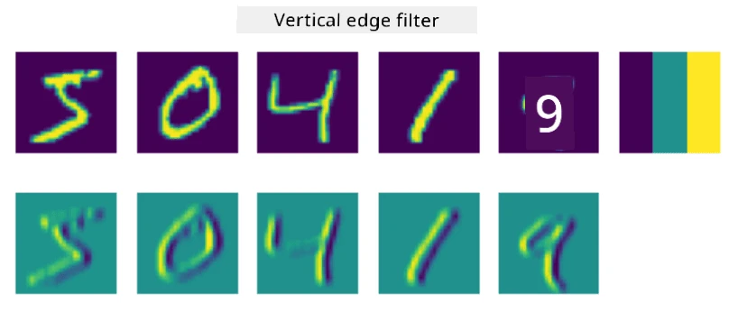
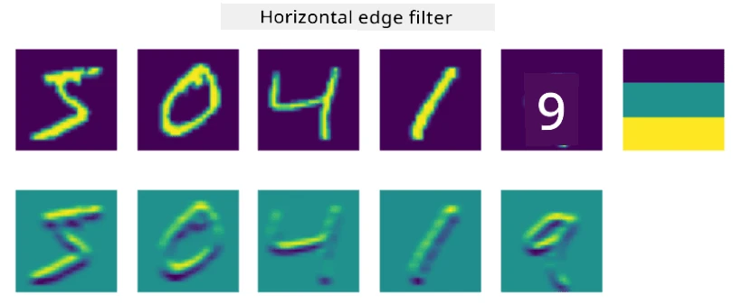
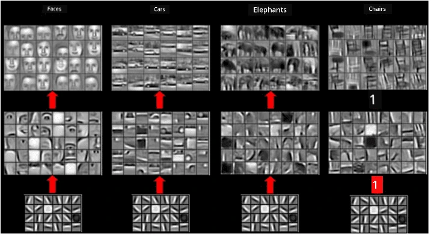

# Convolutional Neural Networks

We don see before say neural networks dey good wella for handling images, even one-layer perceptron fit sabi recognize handwritten digits from MNIST dataset with beta accuracy. But MNIST dataset dey special, all di digits dey center for di image, wey make di work easy.

## [Pre-lecture quiz](https://ff-quizzes.netlify.app/en/ai/quiz/13)

For real life, we go wan sabi recognize objects for picture no matter where dem dey for di image. Computer vision no be di same as normal classification, because when we dey try find one object for picture, we dey scan di image dey look for some specific **patterns** and how dem take join. Example, if we dey find cat, we fit first look for horizontal lines wey fit be whiskers, and di way whiskers take join fit tell us say na cat dey di picture. Di position and presence of di patterns dey important, no be di exact position for di image.

To fit extract patterns, we go use di idea of **convolutional filters**. As you sabi, image na 2D-matrix, or 3D-tensor wey get color depth. To apply filter mean say we go carry small **filter kernel** matrix, and for each pixel for di original image, we go calculate di weighted average with di points wey dey near am. We fit see am like small window wey dey slide for di whole image, dey average all di pixels based on di weights for di filter kernel matrix.

 | 
----|----

> Image by Dmitry Soshnikov

Example, if we apply 3x3 vertical edge and horizontal edge filters to MNIST digits, we fit highlight (like high values) where vertical and horizontal edges dey for di original image. So, di two filters fit dey use to "find" edges. Di same way, we fit design different filters to find other low-level patterns:

> Image of [Leung-Malik Filter Bank](https://www.robots.ox.ac.uk/~vgg/research/texclass/filters.html)

But, even though we fit design filters to extract some patterns manually, we fit also design di network make e learn di patterns by itself. Na one of di main ideas wey dey behind CNN.

## Main ideas behind CNN

Di way CNNs dey work na based on di following important ideas:

* Convolutional filters fit extract patterns
* We fit design di network make e train di filters by itself
* We fit use di same method to find patterns for high-level features, no be only for di original image. So CNN feature extraction dey work for hierarchy of features, from low-level pixel combinations, reach higher level combination of picture parts.

> Image from [a paper by Hislop-Lynch](https://www.semanticscholar.org/paper/Computer-vision-based-pedestrian-trajectory-Hislop-Lynch/26e6f74853fc9bbb7487b06dc2cf095d36c9021d), based on [their research](https://dl.acm.org/doi/abs/10.1145/1553374.1553453)

## ✍️ Exercises: Convolutional Neural Networks

Make we continue to explore how convolutional neural networks dey work, and how we fit achieve trainable filters, by working through di notebooks wey dey here:

* [Convolutional Neural Networks - PyTorch](ConvNetsPyTorch.ipynb)
* [Convolutional Neural Networks - TensorFlow](ConvNetsTF.ipynb)

## Pyramid Architecture

Most CNNs wey dem dey use for image processing dey follow wetin dem dey call pyramid architecture. Di first convolutional layer wey dem dey apply to di original images dey usually get small number of filters (8-16), wey dey represent different pixel combinations, like horizontal/vertical lines or strokes. For di next level, we go reduce di spatial dimension of di network, and increase di number of filters, wey dey represent more possible combinations of simple features. As we dey move from one layer to di next, reach di final classifier, di spatial dimensions of di image go dey reduce, and di number of filters go dey increase.

Example, make we look di architecture of VGG-16, one network wey achieve 92.7% accuracy for ImageNet's top-5 classification for 2014:

> Image from [Researchgate](https://www.researchgate.net/figure/Vgg16-model-structure-To-get-the-VGG-NIN-model-we-replace-the-2-nd-4-th-6-th-7-th_fig2_335194493)

## Best-Known CNN Architectures

[Continue your study about the best-known CNN architectures](CNN_Architectures.md)

---

<!-- CO-OP TRANSLATOR DISCLAIMER START -->
**Disclaimer**:  
Dis dokyument don use AI transleshion service [Co-op Translator](https://github.com/Azure/co-op-translator) do di transleshion. Even as we dey try make am accurate, abeg make you sabi say automatik transleshion fit get mistake or no dey correct well. Di original dokyument wey dey for im native language na di one wey you go take as di correct source. For important mata, e good make you use professional human transleshion. We no go fit take blame for any misunderstanding or wrong interpretation wey fit happen because you use dis transleshion.
<!-- CO-OP TRANSLATOR DISCLAIMER END -->