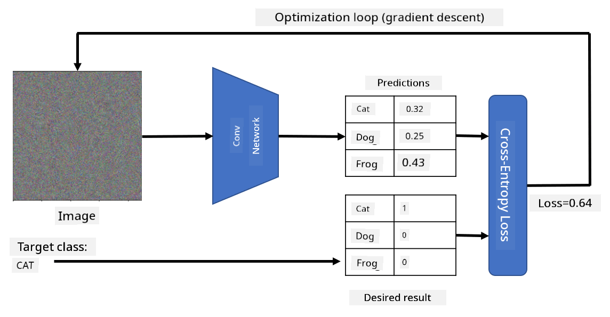

<!--
CO_OP_TRANSLATOR_METADATA:
{
  "original_hash": "178c0b5ee5395733eb18aec51e71a0a9",
  "translation_date": "2025-11-18T18:16:25+00:00",
  "source_file": "lessons/4-ComputerVision/08-TransferLearning/README.md",
  "language_code": "pcm"
}
-->
# Pre-trained Networks and Transfer Learning

To train CNNs dey fit take plenty time, and e go need plenty data to do am. But most of di time, na to learn di best low-level filters wey network fit use to sabi patterns from images. Di question wey go come be - we fit use neural network wey dem don train for one dataset and adjust am to classify different images without to train am from scratch?

## [Pre-lecture quiz](https://ff-quizzes.netlify.app/en/ai/quiz/15)

Dis method na wetin dem dey call **transfer learning**, because we dey carry some knowledge from one neural network model go another one. For transfer learning, we dey usually start with pre-trained model, wey dem don train for one big image dataset like **ImageNet**. Dis kain models fit already sabi extract different features from general images, and many times, just to build classifier on top di features wey dem extract fit give better result.

> ✅ Transfer Learning na term wey you fit see for other academic fields like Education. E mean to carry knowledge from one area and use am for another area.

## Pre-Trained Models as Feature Extractors

Di convolutional networks wey we don talk about for di last section get plenty layers, and each layer suppose extract some features from di image, starting from low-level pixel combinations (like horizontal/vertical line or stroke), go reach higher level combinations of features, wey fit mean things like eye of flame. If we train CNN for big enough dataset of general and different images, di network go sabi extract di common features.

Both Keras and PyTorch get functions wey make am easy to load pre-trained neural network weights for some common architectures, most of dem na ImageNet images dem take train am. Di ones wey people dey use pass dey di [CNN Architectures](../07-ConvNets/CNN_Architectures.md) page from di last lesson. Some of di ones wey you fit consider na:

* **VGG-16/VGG-19** wey be simple models but still dey give better accuracy. To use VGG as first try na better idea to see how transfer learning dey work.
* **ResNet** na family of models wey Microsoft Research propose for 2015. Dem get more layers, so dem go need more resources.
* **MobileNet** na family of models wey small in size, wey fit mobile devices. Use dem if you no get plenty resources and you fit manage small accuracy loss.

See example of features wey VGG-16 network extract from cat picture:

## Cats vs. Dogs Dataset

For dis example, we go use dataset of [Cats and Dogs](https://www.microsoft.com/download/details.aspx?id=54765&WT.mc_id=academic-77998-cacaste), wey dey very close to real-life image classification.

## ✍️ Exercise: Transfer Learning

Make we see how transfer learning dey work for di notebooks wey follow:

* [Transfer Learning - PyTorch](TransferLearningPyTorch.ipynb)
* [Transfer Learning - TensorFlow](TransferLearningTF.ipynb)

## Visualizing Adversarial Cat

Pre-trained neural network get different patterns for inside e *brain*, including wetin dem dey call **ideal cat** (and also ideal dog, ideal zebra, etc.). E go dey interesting to somehow **see dis image**. But e no easy, because di patterns dey spread for di network weights, and dem dey organized like hierarchy.

One way we fit try na to start with random image, then use **gradient descent optimization** technique to adjust di image so di network go dey think say na cat.

But if we do am like dis, wetin we go get go dey like random noise. Dis na because *plenty ways dey to make network think say di input image na cat*, including some wey no go make sense for eye. Even though di images get plenty patterns wey dey typical for cat, nothing dey hold dem to look clear.

To make di result better, we fit add another term for di loss function, wey dem dey call **variation loss**. Na metric wey dey show how similar di neighboring pixels of di image be. If we minimize variation loss, e go make di image smooth, and remove noise - so we go fit see di patterns well. See example of dis kain "ideal" images wey dem classify as cat and zebra with high probability:

 | 
-----|-----
 *Ideal Cat* | *Ideal Zebra*

We fit use similar method to do wetin dem dey call **adversarial attacks** for neural network. Imagine say we wan confuse di neural network make e think say dog be cat. If we carry dog image wey di network recognize as dog, we fit adjust am small small with gradient descent optimization, until di network go dey classify am as cat:

 | 
-----|-----
*Original picture of a dog* | *Picture of a dog classified as a cat*

See di code to reproduce di results wey dey above for dis notebook:

* [Ideal and Adversarial Cat - TensorFlow](AdversarialCat_TF.ipynb)

## Conclusion

With transfer learning, you fit quickly build classifier for custom object classification task and get better accuracy. You go see say di more complex tasks wey we dey solve now need higher computational power, and no fit dey solved easily for CPU. For di next unit, we go try use lighter implementation to train di same model with lower compute resources, wey go still give small lower accuracy.

## 🚀 Challenge

For di notebooks wey follow, notes dey for di bottom about how transfer knowledge dey work best with training data wey dey somehow similar (like new type of animal). Try experiment with completely new types of images to see how well or bad your transfer knowledge models go perform.

## [Post-lecture quiz](https://ff-quizzes.netlify.app/en/ai/quiz/16)

## Review & Self Study

Read [TrainingTricks.md](TrainingTricks.md) to sabi more about other ways to train your models.

## [Assignment](lab/README.md)

For dis lab, we go use real-life [Oxford-IIIT](https://www.robots.ox.ac.uk/~vgg/data/pets/) pets dataset wey get 35 breeds of cats and dogs, and we go build transfer learning classifier.

---

<!-- CO-OP TRANSLATOR DISCLAIMER START -->
**Disclaimer**:  
Dis docu don dey translate wit AI translation service [Co-op Translator](https://github.com/Azure/co-op-translator). Even though we dey try make am correct, abeg sabi say automatic translation fit get mistake or no dey accurate well. Di original docu for im native language na di main correct source. For important information, e good make una use professional human translation. We no go fit take blame for any misunderstanding or wrong interpretation wey fit happen because of dis translation.
<!-- CO-OP TRANSLATOR DISCLAIMER END -->