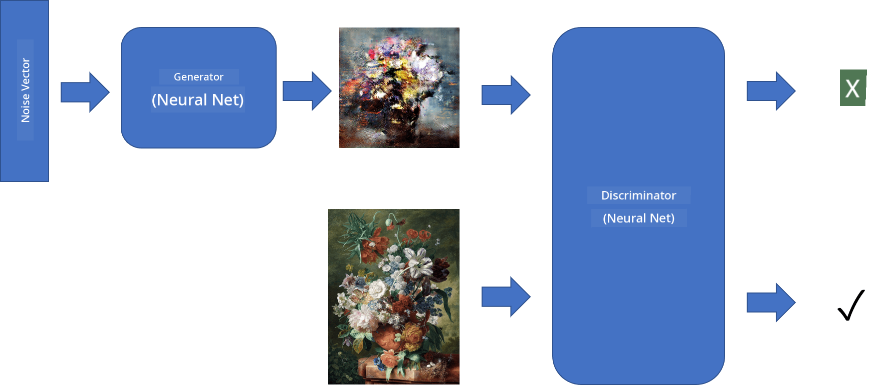

<!--
CO_OP_TRANSLATOR_METADATA:
{
  "original_hash": "0ff65b4da07b23697235de2beb2a3c25",
  "translation_date": "2025-11-18T18:15:28+00:00",
  "source_file": "lessons/4-ComputerVision/10-GANs/README.md",
  "language_code": "pcm"
}
-->
# Generative Adversarial Networks

For di last section, we learn about **generative models**: models wey fit create new images wey resemble di ones wey dey di training dataset. VAE na one good example of generative model.

## [Pre-lecture quiz](https://ff-quizzes.netlify.app/en/ai/quiz/19)

But, if we wan generate something wey really make sense, like painting wey get beta resolution, wit VAE, we go see say di training no go gree balance well. For dis kain case, we suppose learn about another architecture wey dem design specially for generative models - **Generative Adversarial Networks**, or GANs.

Di main idea for GAN na to get two neural networks wey go dey train against each other:

> Image by [Dmitry Soshnikov](http://soshnikov.com)

> ✅ Small vocabulary:
> * **Generator** na network wey go take random vector, come produce image as result.
> * **Discriminator** na network wey go take image, and e suppose talk whether na real image (from training dataset), or na generator create am. E be like image classifier.

### Discriminator

Di architecture of discriminator no different from normal image classification network. For di simplest case, e fit be fully-connected classifier, but most times e go be [convolutional network](../07-ConvNets/README.md).

> ✅ GAN wey base on convolutional networks na [DCGAN](https://arxiv.org/pdf/1511.06434.pdf)

CNN discriminator dey use di following layers: some convolutions+poolings (wey go dey reduce di spatial size) and, one-or-more fully-connected layers to get "feature vector", final binary classifier.

> ✅ 'Pooling' for dis context na technique wey dey reduce di size of di image. "Pooling layers dey reduce di dimensions of data by combining di outputs of neuron clusters for one layer into one neuron for di next layer." - [source](https://wikipedia.org/wiki/Convolutional_neural_network#Pooling_layers)

### Generator

Generator small tricky pass. You fit see am as reversed discriminator. E dey start from latent vector (instead of feature vector), e get fully-connected layer to change am into di size/shape wey we need, followed by deconvolutions+upscaling. E dey similar to *decoder* part of [autoencoder](../09-Autoencoders/README.md).

> ✅ Because convolution layer dey work like linear filter wey dey waka through di image, deconvolution dey similar to convolution, and we fit implement am using di same layer logic.

> Image by [Dmitry Soshnikov](http://soshnikov.com)

### How to Train GAN

Dem dey call GANs **adversarial** because di generator and discriminator dey compete against each other. As dem dey compete, both generator and discriminator go dey improve, so di network go dey learn how to create better pictures.

Di training dey happen for two stages:

* **Train di discriminator**. Dis one no too hard: we go generate batch of images wit di generator, label dem 0 (wey mean fake image), and take batch of images from di input dataset (label 1, real image). We go get *discriminator loss*, and do backprop.
* **Train di generator**. Dis one small tricky, because we no sabi di expected output for di generator directly. We go take di whole GAN network wey get generator and discriminator, feed am wit random vectors, and expect di result to be 1 (wey mean real images). We go freeze di discriminator parameters (we no wan train am for dis step), and do backprop.

As we dey do dis process, di generator and discriminator losses no go dey reduce too much. For di best case, dem suppose dey oscillate, wey mean both networks dey improve.

## ✍️ Exercises: GANs

* [GAN Notebook in TensorFlow/Keras](GANTF.ipynb)
* [GAN Notebook in PyTorch](GANPyTorch.ipynb)

### Problems wey dey GAN training

GANs dey hard to train well. Some of di problems na:

* **Mode Collapse**. Dis one mean say di generator go learn how to create only one successful image wey dey trick di discriminator, instead of different images.
* **Sensitivity to hyperparameters**. Sometimes, you go see say GAN no dey balance at all, but if you reduce di learning rate, e go suddenly balance.
* To keep **balance** between generator and discriminator. Many times, discriminator loss fit drop to zero quick, and e go make generator no fit train again. To solve dis, we fit try set different learning rates for generator and discriminator, or skip discriminator training if di loss don too low.
* Training for **high resolution**. Dis problem dey happen because to reconstruct too many layers of convolutional network dey bring artifacts. To solve am, we fit use **progressive growing**, wey mean we go first train few layers on low-res images, then we go dey "unlock" or add layers. Another solution na to add extra connections between layers and train different resolutions at once - check dis [Multi-Scale Gradient GANs paper](https://arxiv.org/abs/1903.06048) for details.

## Style Transfer

GANs dey good to create artistic images. Another interesting technique na **style transfer**, wey go take one **content image**, and redraw am for different style, using filters from **style image**.

How e dey work be like dis:
* We go start wit random noise image (or content image, but to understand am well, random noise better).
* Our goal na to create image wey go dey close to both content image and style image. We go use two loss functions to determine dis:
   - **Content loss** dey calculate based on di features wey CNN extract from current image and content image.
   - **Style loss** dey calculate between current image and style image using Gram matrices (more details dey [example notebook](StyleTransfer.ipynb)).
* To make di image smooth and remove noise, we go add **Variation loss**, wey dey calculate di average distance between neighboring pixels.
* Di main optimization loop go adjust di current image using gradient descent (or another optimization algorithm) to reduce di total loss, wey be weighted sum of di three losses.

## ✍️ Example: [Style Transfer](StyleTransfer.ipynb)

## [Post-lecture quiz](https://ff-quizzes.netlify.app/en/ai/quiz/20)

## Conclusion

For dis lesson, you don learn about GANs and how to train dem. You also learn about di special wahala wey dis kain Neural Network fit face, and some ways to solve dem.

## 🚀 Challenge

Run di [Style Transfer notebook](StyleTransfer.ipynb) using your own images.

## Review & Self Study

To learn more, read about GANs for dis resources:

* Marco Pasini, [10 Lessons I Learned Training GANs for one Year](https://towardsdatascience.com/10-lessons-i-learned-training-generative-adversarial-networks-gans-for-a-year-c9071159628)
* [StyleGAN](https://en.wikipedia.org/wiki/StyleGAN), one *de facto* GAN architecture to check
* [Creating Generative Art using GANs on Azure ML](https://soshnikov.com/scienceart/creating-generative-art-using-gan-on-azureml/)

## Assignment

Go back to one of di two notebooks wey follow dis lesson and retrain di GAN using your own images. Wetin you fit create?

---

<!-- CO-OP TRANSLATOR DISCLAIMER START -->
**Disclaimer**:  
Dis dokyument don use AI translet service [Co-op Translator](https://github.com/Azure/co-op-translator) do di translet. Even as we dey try make am correct, abeg make you sabi say machine translet fit get mistake or no dey accurate well. Di original dokyument for im native language na di one wey you go take as di correct source. For important mata, e good make you use professional human translet. We no go fit take blame for any misunderstanding or wrong interpretation wey fit happen because you use dis translet.
<!-- CO-OP TRANSLATOR DISCLAIMER END -->