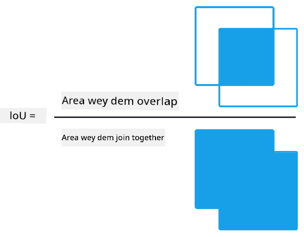

<!--
CO_OP_TRANSLATOR_METADATA:
{
  "original_hash": "d76a7eda28de5210c8b1ba50a6216c69",
  "translation_date": "2025-11-18T18:19:31+00:00",
  "source_file": "lessons/4-ComputerVision/11-ObjectDetection/README.md",
  "language_code": "pcm"
}
-->
# Object Detection

Di image classification models we don deal wit before na to take one image and produce one categorical result, like di class 'number' for MNIST problem. But, for many cases, we no just wan sabi say di picture get objects - we wan fit know di exact place wey dem dey. Na wetin **object detection** dey do be dat.

## [Pre-lecture quiz](https://ff-quizzes.netlify.app/en/ai/quiz/21)

> Image from [YOLO v2 web site](https://pjreddie.com/darknet/yolov2/)

## One Simple Way to Do Object Detection

If we wan find cat for one picture, one simple way to do object detection go be like dis:

1. Cut di picture into plenty small tiles.
2. Run image classification for each tile.
3. Any tile wey get high activation fit mean say di object dey inside.

> *Image from [Exercise Notebook](ObjectDetection-TF.ipynb)*

But dis method no too make sense because e no dey fit locate di object bounding box well. To get di exact location, we go need to run **regression** to predict di bounding box coordinates - and for dat, we go need special datasets.

## Regression for Object Detection

[Dis blog post](https://towardsdatascience.com/object-detection-with-neural-networks-a4e2c46b4491) explain di basics of detecting shapes well well.

## Datasets for Object Detection

You fit see dis datasets for dis kind task:

* [PASCAL VOC](http://host.robots.ox.ac.uk/pascal/VOC/) - 20 classes
* [COCO](http://cocodataset.org/#home) - Common Objects in Context. 80 classes, bounding boxes and segmentation masks

## Object Detection Metrics

### Intersection over Union

For image classification, e dey easy to measure how di algorithm dey perform. But for object detection, we need to measure di class correctness and di bounding box location precision. For di bounding box, we dey use **Intersection over Union** (IoU), wey dey measure how two boxes (or areas) dey overlap.

> *Figure 2 from [dis blog post on IoU](https://pyimagesearch.com/2016/11/07/intersection-over-union-iou-for-object-detection/)*

Di idea simple - we go divide di area wey two figures dey overlap by di area of their union. If di two areas dey exactly di same, IoU go be 1. If dem no touch at all, IoU go be 0. Any other case go dey between 0 and 1. We dey usually consider bounding boxes wey get IoU above one certain value.

### Average Precision

If we wan measure how well one class of objects $C$ dey recognized, we go use **Average Precision** metrics. Di steps be:

1. Look di Precision-Recall curve wey show accuracy based on detection threshold (0 to 1).
2. Di threshold go affect how many objects we detect and di precision/recall values.
3. Di curve go look like dis:

> *Image from [NeuroWorkshop](http://github.com/shwars/NeuroWorkshop)*

Di Average Precision for one class $C$ na di area under di curve. More specifically, Recall axis dey divided into 10 parts, and Precision dey averaged for all di points:

$$
AP = {1\over11}\sum_{i=0}^{10}\mbox{Precision}(\mbox{Recall}={i\over10})
$$

### AP and IoU

We go only consider detections wey get IoU above one certain value. For example, for PASCAL VOC dataset, $\mbox{IoU Threshold} = 0.5$, but for COCO, AP dey measured for different $\mbox{IoU Threshold}$ values.

> *Image from [NeuroWorkshop](http://github.com/shwars/NeuroWorkshop)*

### Mean Average Precision - mAP

Di main metric for Object Detection na **Mean Average Precision** or **mAP**. E dey calculate di Average Precision across all object classes, and sometimes across $\mbox{IoU Threshold}$. You fit read more about how to calculate **mAP** for [dis blog post](https://medium.com/@timothycarlen/understanding-the-map-evaluation-metric-for-object-detection-a07fe6962cf3)) and [dis one with code samples](https://gist.github.com/tarlen5/008809c3decf19313de216b9208f3734).

## Different Object Detection Approaches

We get two main types of object detection algorithms:

* **Region Proposal Networks** (R-CNN, Fast R-CNN, Faster R-CNN). Di idea na to generate **Regions of Interests** (ROI) and run CNN for dem to find maximum activation. E dey similar to di simple method, but di ROIs dey generated in a smarter way. Di problem be say e dey slow because we dey run CNN classifier many times for di image.
* **One-pass** (YOLO, SSD, RetinaNet) methods. For dis ones, di network dey predict both classes and ROIs in one pass.

### R-CNN: Region-Based CNN

[R-CNN](http://islab.ulsan.ac.kr/files/announcement/513/rcnn_pami.pdf) dey use [Selective Search](http://www.huppelen.nl/publications/selectiveSearchDraft.pdf) to generate ROI regions, wey CNN go process to extract features. SVM-classifiers go determine di object class, and linear regression go predict di *bounding box* coordinates. [Official Paper](https://arxiv.org/pdf/1506.01497v1.pdf)

> *Image from van de Sande et al. ICCV’11*

> *Images from [dis blog](https://towardsdatascience.com/r-cnn-fast-r-cnn-faster-r-cnn-yolo-object-detection-algorithms-36d53571365e)

### F-RCNN - Fast R-CNN

Dis method dey similar to R-CNN, but e dey define regions after convolution layers don run.

> Image from [di Official Paper](https://www.cv-foundation.org/openaccess/content_iccv_2015/papers/Girshick_Fast_R-CNN_ICCV_2015_paper.pdf), [arXiv](https://arxiv.org/pdf/1504.08083.pdf), 2015

### Faster R-CNN

Dis method dey use neural network to predict ROIs - di *Region Proposal Network*. [Paper](https://arxiv.org/pdf/1506.01497.pdf), 2016

> Image from [di official paper](https://arxiv.org/pdf/1506.01497.pdf)

### R-FCN: Region-Based Fully Convolutional Network

Dis algorithm dey faster pass Faster R-CNN. Di main idea be:

1. Extract features wit ResNet-101.
2. Process di features wit **Position-Sensitive Score Map**. Each object from $C$ classes dey divide into $k\times k$ regions, and we dey train to predict di object parts.
3. For each part, di network go vote for di object class, and di class wit di highest vote go dey selected.

> Image from [official paper](https://arxiv.org/abs/1605.06409)

### YOLO - You Only Look Once

YOLO na realtime one-pass algorithm. Di main idea be:

 * Divide di image into $S\times S$ regions.
 * For each region, **CNN** go predict $n$ possible objects, *bounding box* coordinates, and *confidence*=*probability* * IoU.

 

> Image from [official paper](https://arxiv.org/abs/1506.02640)

### Other Algorithms

* RetinaNet: [official paper](https://arxiv.org/abs/1708.02002)
   - [PyTorch Implementation in Torchvision](https://pytorch.org/vision/stable/_modules/torchvision/models/detection/retinanet.html)
   - [Keras Implementation](https://github.com/fizyr/keras-retinanet)
   - [Object Detection with RetinaNet](https://keras.io/examples/vision/retinanet/) in Keras Samples
* SSD (Single Shot Detector): [official paper](https://arxiv.org/abs/1512.02325)

## ✍️ Exercises: Object Detection

Continue your learning for dis notebook:

[ObjectDetection.ipynb](ObjectDetection.ipynb)

## Conclusion

For dis lesson, you don see di different ways wey object detection fit work!

## 🚀 Challenge

Read dis articles and notebooks about YOLO and try dem:

* [Good blog post](https://www.analyticsvidhya.com/blog/2018/12/practical-guide-object-detection-yolo-framewor-python/) wey explain YOLO
 * [Official site](https://pjreddie.com/darknet/yolo/)
 * Yolo: [Keras implementation](https://github.com/experiencor/keras-yolo2), [step-by-step notebook](https://github.com/experiencor/basic-yolo-keras/blob/master/Yolo%20Step-by-Step.ipynb)
 * Yolo v2: [Keras implementation](https://github.com/experiencor/keras-yolo2), [step-by-step notebook](https://github.com/experiencor/keras-yolo2/blob/master/Yolo%20Step-by-Step.ipynb)

## [Post-lecture quiz](https://ff-quizzes.netlify.app/en/ai/quiz/22)

## Review & Self Study

* [Object Detection](https://tjmachinelearning.com/lectures/1718/obj/) by Nikhil Sardana
* [Comparison of object detection algorithms](https://lilianweng.github.io/lil-log/2018/12/27/object-detection-part-4.html)
* [Review of Deep Learning Algorithms for Object Detection](https://medium.com/comet-app/review-of-deep-learning-algorithms-for-object-detection-c1f3d437b852)
* [Step-by-Step Intro to Object Detection Algorithms](https://www.analyticsvidhya.com/blog/2018/10/a-step-by-step-introduction-to-the-basic-object-detection-algorithms-part-1/)
* [Faster R-CNN Implementation in Python](https://www.analyticsvidhya.com/blog/2018/11/implementation-faster-r-cnn-python-object-detection/)

## [Assignment: Object Detection](lab/README.md)

---

<!-- CO-OP TRANSLATOR DISCLAIMER START -->
**Disclaimer**:  
Dis docu don use AI translation service [Co-op Translator](https://github.com/Azure/co-op-translator) take translate am. Even though we dey try make e accurate, abeg sabi say automated translations fit get mistake or no dey 100% correct. Di original docu for di language wey dem write am first na di main correct one. For important information, e good make una use professional human translation. We no go fit take blame for any misunderstanding or wrong interpretation wey fit happen because of dis translation.
<!-- CO-OP TRANSLATOR DISCLAIMER END -->