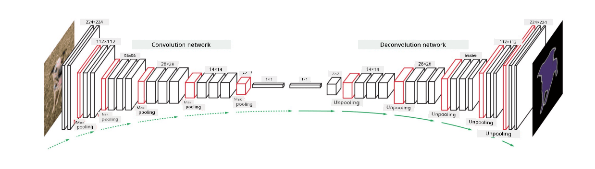

<!--
CO_OP_TRANSLATOR_METADATA:
{
  "original_hash": "6568aaae7e0e4afed4b5d74b5b223700",
  "translation_date": "2025-11-18T18:18:55+00:00",
  "source_file": "lessons/4-ComputerVision/12-Segmentation/README.md",
  "language_code": "pcm"
}
-->
# Segmentation

We don learn before about Object Detection, wey dey help us find objects for image by predicting dia *bounding boxes*. But for some tasks, we no only need bounding boxes, we go need more accurate way to locate objects. Dis task na **segmentation**.

## [Pre-lecture quiz](https://ff-quizzes.netlify.app/en/ai/quiz/23)

Segmentation fit be like **pixel classification**, wey mean say for **each** pixel for image, we go predict im class (*background* na one of di classes). Two main segmentation algorithms dey:

* **Semantic segmentation** dey only tell di pixel class, e no dey separate different objects wey dey di same class.
* **Instance segmentation** dey divide di classes into different instances.

For instance segmentation, di sheep dem na different objects, but for semantic segmentation, all di sheep go dey under one class.

> Image from [this blog post](https://nirmalamurali.medium.com/image-classification-vs-semantic-segmentation-vs-instance-segmentation-625c33a08d50)

Different neural architectures dey for segmentation, but all of dem get di same structure. E be like di autoencoder wey you don learn before, but instead of breaking down di original image, our goal na to break down **mask**. So, segmentation network get di following parts:

* **Encoder** dey extract features from di input image.
* **Decoder** dey change di features into di **mask image**, wey get di same size and number of channels wey match di number of classes.

> Image from [this publication](https://arxiv.org/pdf/2001.05566.pdf)

We go talk about di loss function wey dem dey use for segmentation. For classical autoencoders, we dey measure di similarity between two images, and we fit use mean square error (MSE) for dat. But for segmentation, each pixel for di target mask image dey represent di class number (one-hot-encoded along di third dimension), so we go need loss functions wey dey specific for classification - cross-entropy loss, wey dem dey average over all di pixels. If di mask na binary - **binary cross-entropy loss** (BCE) go dey used.

> ✅ One-hot encoding na way to encode class label into vector wey get length wey match di number of classes. Check [this article](https://datagy.io/sklearn-one-hot-encode/) to learn about dis technique.

## Segmentation for Medical Imaging

For dis lesson, we go see segmentation in action by training di network to recognize human nevi (wey people dey call moles) for medical images. We go use <a href="https://www.fc.up.pt/addi/ph2%20database.html">PH2 Database</a> of dermoscopy images as di image source. Dis dataset get 200 images of three classes: typical nevus, atypical nevus, and melanoma. All di images get corresponding **mask** wey dey outline di nevus.

> ✅ Dis technique dey very good for dis type of medical imaging, but which other real-world applications you fit think of?

> Image from di PH2 Database

We go train model to segment any nevus from di background.

## ✍️ Exercises: Semantic Segmentation

Open di notebooks below to learn more about different semantic segmentation architectures, practice how to work with dem, and see how dem dey work.

* [Semantic Segmentation Pytorch](SemanticSegmentationPytorch.ipynb)
* [Semantic Segmentation TensorFlow](SemanticSegmentationTF.ipynb)

## [Post-lecture quiz](https://ff-quizzes.netlify.app/en/ai/quiz/24)

## Conclusion

Segmentation na strong technique for image classification, e dey go beyond bounding boxes to pixel-level classification. E dey used for medical imaging and other applications.

## 🚀 Challenge

Body segmentation na one of di common tasks wey we fit do with images of people. Another important tasks na **skeleton detection** and **pose detection**. Try [OpenPose](https://github.com/CMU-Perceptual-Computing-Lab/openpose) library to see how pose detection fit work.

## Review & Self Study

Dis [wikipedia article](https://wikipedia.org/wiki/Image_segmentation) dey give good overview of di different applications of dis technique. Learn more on your own about di subdomains of Instance segmentation and Panoptic segmentation for dis field.

## [Assignment](lab/README.md)

For dis lab, try **human body segmentation** using [Segmentation Full Body MADS Dataset](https://www.kaggle.com/datasets/tapakah68/segmentation-full-body-mads-dataset) from Kaggle.

---

<!-- CO-OP TRANSLATOR DISCLAIMER START -->
**Disclaimer**:  
Dis document don use AI translation service [Co-op Translator](https://github.com/Azure/co-op-translator) take translate am. Even though we dey try make sure say e correct, abeg no forget say automatic translation fit get mistake or no dey accurate well. Di original document for di language wey dem write am first na di main correct one. For important information, e go better make professional human translator check am. We no go fit take blame for any misunderstanding or wrong interpretation wey fit happen because of dis translation.
<!-- CO-OP TRANSLATOR DISCLAIMER END -->