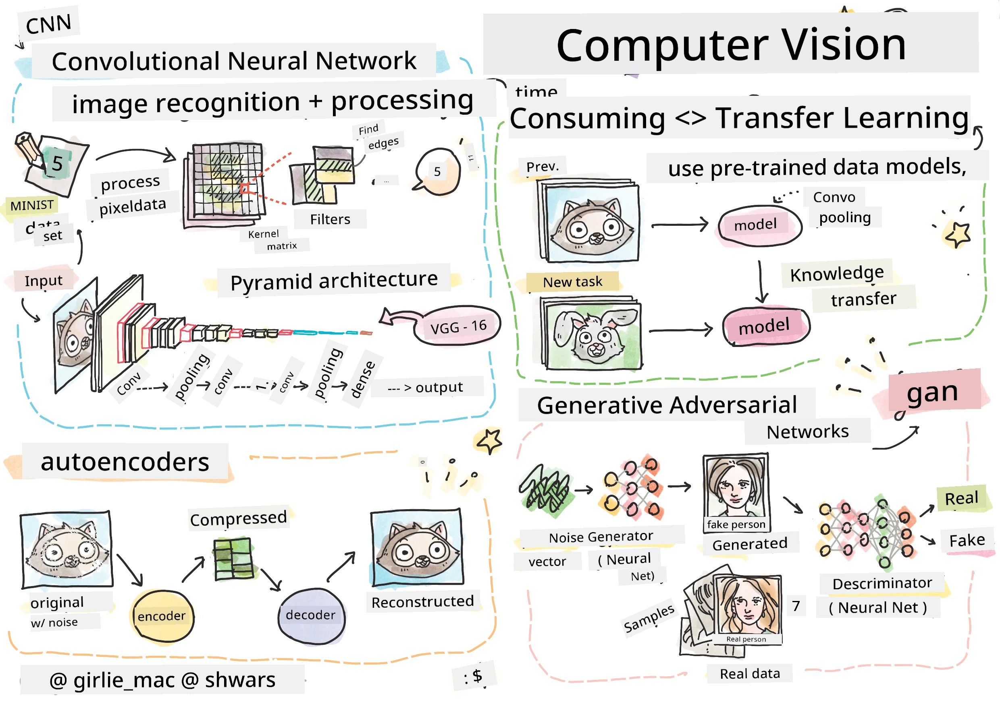

# Computer Vision

For dis section, we go learn about:

* [Intro to Computer Vision and OpenCV](06-IntroCV/README.md)
* [Convolutional Neural Networks](07-ConvNets/README.md)
* [Pre-trained Networks and Transfer Learning](08-TransferLearning/README.md) 
* [Autoencoders](09-Autoencoders/README.md)
* [Generative Adversarial Networks](10-GANs/README.md)
* [Object Detection](11-ObjectDetection/README.md)
* [Semantic Segmentation](12-Segmentation/README.md)

---

<!-- CO-OP TRANSLATOR DISCLAIMER START -->
**Disclaimer**:  
Dis docu wey you dey see na AI translation service [Co-op Translator](https://github.com/Azure/co-op-translator) do am. Even though we dey try make sure say e correct, abeg make you sabi say machine translation fit get mistake or no dey accurate well. Di original docu wey dey di native language na di main correct source. For important mata, e good make you use professional human translation. We no go fit take blame for any misunderstanding or wrong interpretation wey fit happen because you use dis translation.
<!-- CO-OP TRANSLATOR DISCLAIMER END -->