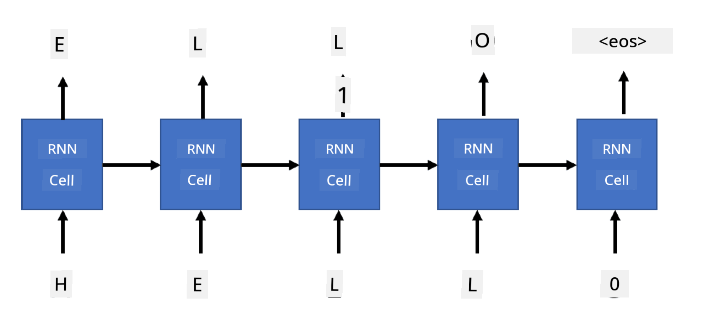

<!--
CO_OP_TRANSLATOR_METADATA:
{
  "original_hash": "51be6057374d01d70e07dd5ec88ebc0d",
  "translation_date": "2025-11-18T18:42:08+00:00",
  "source_file": "lessons/5-NLP/17-GenerativeNetworks/README.md",
  "language_code": "pcm"
}
-->
# Generative networks

## [Pre-lecture quiz](https://ff-quizzes.netlify.app/en/ai/quiz/33)

Recurrent Neural Networks (RNNs) and di gated cell versions like Long Short Term Memory Cells (LSTMs) and Gated Recurrent Units (GRUs) don give us way to model language because dem fit learn how words dey arrange and predict di next word for sequence. Dis one mean say we fit use RNNs for **generative tasks**, like normal text generation, machine translation, and even image captioning.

> ✅ Think about di times wey you don enjoy generative tasks like text completion as you dey type. Try do small research about di apps wey you like to see if dem use RNNs.

For di RNN architecture wey we discuss for di last unit, each RNN unit dey produce di next hidden state as output. But, we fit still add another output to each recurrent unit, wey go allow us output **sequence** (wey go get di same length as di original sequence). Plus, we fit use RNN units wey no dey collect input for each step, but go just take one initial state vector, then produce sequence of outputs.

Dis one dey allow different neural architectures wey dem show for di picture below:


> Image from blog post [Unreasonable Effectiveness of Recurrent Neural Networks](http://karpathy.github.io/2015/05/21/rnn-effectiveness/) by [Andrej Karpaty](http://karpathy.github.io/)

* **One-to-one** na traditional neural network wey get one input and one output
* **One-to-many** na generative architecture wey dey collect one input value, then generate sequence of output values. For example, if we wan train **image captioning** network wey go produce text description of picture, we fit use picture as input, pass am through CNN to get di hidden state, then use recurrent chain generate caption word-by-word.
* **Many-to-one** na di RNN architectures wey we describe for di last unit, like text classification.
* **Many-to-many**, or **sequence-to-sequence** na tasks like **machine translation**, where di first RNN go collect all di information from di input sequence into di hidden state, then another RNN chain go unroll di state into di output sequence.

For dis unit, we go focus on simple generative models wey go help us generate text. To make am simple, we go use character-level tokenization.

We go train dis RNN to generate text step by step. For each step, we go take sequence of characters wey get length `nchars`, then ask di network to generate di next output character for each input character:



When we dey generate text (during inference), we go start with one **prompt**, wey we go pass through RNN cells to generate di intermediate state, then from di state, di generation go start. We go generate one character at a time, then pass di state and di generated character to another RNN cell to generate di next one, until we generate enough characters.


> Image by di author

## ✍️ Exercises: Generative Networks

Continue your learning for di notebooks below:

* [Generative Networks with PyTorch](GenerativePyTorch.ipynb)
* [Generative Networks with TensorFlow](GenerativeTF.ipynb)

## Soft text generation and temperature

Di output of each RNN cell na probability distribution of characters. If we dey always pick di character wey get di highest probability as di next character for di generated text, di text fit dey "cycle" di same character sequences again and again, like for dis example:

```
today of the second the company and a second the company ...
```

But, if we check di probability distribution for di next character, e fit be say di difference between di few highest probabilities no too big, e.g. one character fit get probability 0.2, another one - 0.19, etc. For example, when we dey look for di next character for di sequence '*play*', di next character fit be space, or **e** (like for di word *player*).

Dis one dey show say e no always "fair" to pick di character wey get higher probability, because if we pick di second highest, e fit still give us meaningful text. E make sense to **sample** characters from di probability distribution wey di network output give us. We fit still use one parameter, **temperature**, wey go flatten di probability distribution if we wan add more randomness, or make am steep if we wan stick to di highest-probability characters.

Check how dis soft text generation dey work for di notebooks wey we link above.

## Conclusion

Even though text generation fit dey useful on its own, di main benefit na di ability to generate text using RNNs from some initial feature vector. For example, text generation dey used for machine translation (sequence-to-sequence, for dis case di state vector from *encoder* dey used to generate or *decode* translated message), or to generate text description of image (for dis case di feature vector go come from CNN extractor).

## 🚀 Challenge

Take some lessons for Microsoft Learn on dis topic

* Text Generation with [PyTorch](https://docs.microsoft.com/learn/modules/intro-natural-language-processing-pytorch/6-generative-networks/?WT.mc_id=academic-77998-cacaste)/[TensorFlow](https://docs.microsoft.com/learn/modules/intro-natural-language-processing-tensorflow/5-generative-networks/?WT.mc_id=academic-77998-cacaste)

## [Post-lecture quiz](https://ff-quizzes.netlify.app/en/ai/quiz/34)

## Review & Self Study

Here be some articles to help you learn more

* Different ways to do text generation with Markov Chain, LSTM and GPT-2: [blog post](https://towardsdatascience.com/text-generation-gpt-2-lstm-markov-chain-9ea371820e1e)
* Text generation example for [Keras documentation](https://keras.io/examples/generative/lstm_character_level_text_generation/)

## [Assignment](lab/README.md)

We don see how to generate text character-by-character. For di lab, you go explore word-level text generation.

---

<!-- CO-OP TRANSLATOR DISCLAIMER START -->
**Disclaimer**:  
Dis dokyument don translate wit AI translation service [Co-op Translator](https://github.com/Azure/co-op-translator). Even as we dey try make am accurate, abeg sabi say machine translation fit get mistake or no correct well. Di original dokyument for im native language na di main source wey you go fit trust. For important mata, e better make professional human translator check am. We no go fit take blame for any misunderstanding or wrong interpretation wey fit happen because you use dis translation.
<!-- CO-OP TRANSLATOR DISCLAIMER END -->