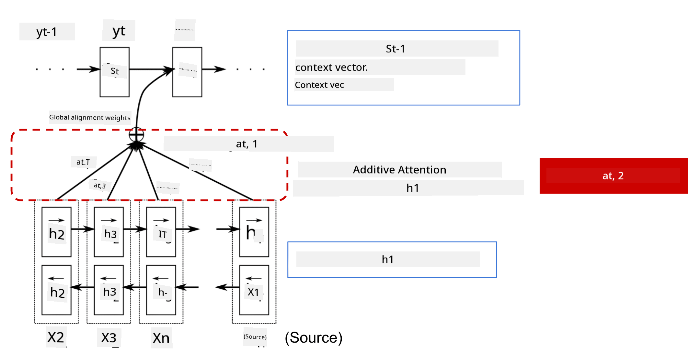
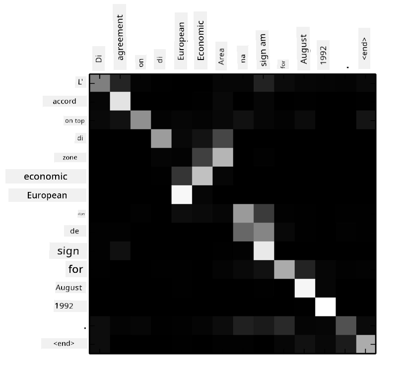

<!--
CO_OP_TRANSLATOR_METADATA:
{
  "original_hash": "f335dfcb4a993920504c387973a36957",
  "translation_date": "2025-11-18T18:36:11+00:00",
  "source_file": "lessons/5-NLP/18-Transformers/README.md",
  "language_code": "pcm"
}
-->
# Attention Mechanisms and Transformers

## [Pre-lecture quiz](https://ff-quizzes.netlify.app/en/ai/quiz/35)

One big problem wey dey for NLP na **machine translation**, wey be important task wey dey power tools like Google Translate. For dis section, we go focus on machine translation, or generally, any *sequence-to-sequence* task (wey dem dey call **sentence transduction** too).

With RNNs, sequence-to-sequence dey work with two recurrent networks. One network, wey be **encoder**, go compress input sequence into hidden state, while another network, wey be **decoder**, go expand dis hidden state into translated result. But dis approach get some wahala:

* The final state of the encoder network dey struggle to remember the beginning of sentence, so e dey make model no dey perform well for long sentences.
* All words for sequence dey get same impact for result. But for real life, some words for input sequence dey get more impact for output pass others.

**Attention Mechanisms** dey help to give weight to how each input vector go affect each output prediction of the RNN. E dey work by creating shortcuts between intermediate states of the input RNN and the output RNN. So, when we dey generate output symbol yt, we go consider all input hidden states hi, with different weight coefficients &alpha;t,i.

> The encoder-decoder model with additive attention mechanism in [Bahdanau et al., 2015](https://arxiv.org/pdf/1409.0473.pdf), cited from [this blog post](https://lilianweng.github.io/lil-log/2018/06/24/attention-attention.html)

The attention matrix {&alpha;i,j} go show how much certain input words dey contribute to the generation of one word for the output sequence. Example of dis matrix dey below:

> Figure from [Bahdanau et al., 2015](https://arxiv.org/pdf/1409.0473.pdf) (Fig.3)

Attention mechanisms na wetin dey make NLP models dey perform well today or near state-of-the-art level. But adding attention dey increase the number of model parameters well well, wey dey cause scaling wahala for RNNs. One big problem for scaling RNNs na say the recurrent nature of the models dey make am hard to batch and parallelize training. For RNN, each element for sequence need to process one by one, wey mean e no fit parallelize easily.

> Figure from [Google's Blog](https://research.googleblog.com/2016/09/a-neural-network-for-machine.html)

Because of attention mechanisms and dis constraint, dem create Transformer Models wey be the State of the Art models we dey use today like BERT and Open-GPT3.

## Transformer models

The main idea behind transformers na to avoid the sequential nature of RNNs and create model wey fit parallelize during training. Dem achieve dis by using two ideas:

* positional encoding
* using self-attention mechanism to capture patterns instead of RNNs (or CNNs) (na why the paper wey introduce transformers dey called *[Attention is all you need](https://arxiv.org/abs/1706.03762)*)

### Positional Encoding/Embedding

The idea of positional encoding be like dis:
1. For RNNs, the relative position of tokens dey represented by the number of steps, so e no need explicit representation.
2. But when we switch to attention, we need to know the relative positions of tokens inside sequence.
3. To get positional encoding, we go add token positions for the sequence (like numbers 0,1, ...).
4. We go mix the token position with token embedding vector. To change the position (integer) into vector, we fit use different methods:

* Trainable embedding, like token embedding. Na dis approach we go use here. We go apply embedding layers for both tokens and their positions, wey go give embedding vectors of the same dimensions, then we go add dem together.
* Fixed position encoding function, as dem propose for the original paper.

> Image by the author

The result wey we go get with positional embedding go combine the original token and its position inside sequence.

### Multi-Head Self-Attention

Next, we need to capture some patterns inside our sequence. To do dis, transformers dey use **self-attention** mechanism, wey be attention wey dem apply to the same sequence as input and output. Self-attention dey help us consider **context** inside sentence, and see how words dey relate. For example, e dey help us see how words dey refer to coreferences like *it*, and also consider the context:

> Image from the [Google Blog](https://research.googleblog.com/2017/08/transformer-novel-neural-network.html)

For transformers, we dey use **Multi-Head Attention** to give the network power to capture different types of dependencies, like long-term vs. short-term word relations, co-reference vs. another thing, etc.

[TensorFlow Notebook](TransformersTF.ipynb) get more details on how transformer layers dey work.

### Encoder-Decoder Attention

For transformers, attention dey used for two places:

* To capture patterns inside the input text using self-attention
* To perform sequence translation - na the attention layer between encoder and decoder.

Encoder-decoder attention dey similar to the attention mechanism wey RNNs dey use, as we describe for the beginning of dis section. Dis animated diagram dey explain the role of encoder-decoder attention.

Because each input position dey map independently to each output position, transformers fit parallelize better than RNNs, wey dey make am possible to create bigger and more expressive language models. Each attention head fit learn different relationships between words wey dey improve Natural Language Processing tasks.

## BERT

**BERT** (Bidirectional Encoder Representations from Transformers) na very big multi-layer transformer network with 12 layers for *BERT-base*, and 24 for *BERT-large*. The model dey first pre-train on large corpus of text data (WikiPedia + books) using unsupervised training (predicting masked words for sentence). During pre-training, the model dey learn plenty language understanding wey fit help am perform well with other datasets when we fine-tune am. Dis process na **transfer learning**.

> Image [source](http://jalammar.github.io/illustrated-bert/)

## ✍️ Exercises: Transformers

Continue your learning for the following notebooks:

* [Transformers in PyTorch](TransformersPyTorch.ipynb)
* [Transformers in TensorFlow](TransformersTF.ipynb)

## Conclusion

For dis lesson, you don learn about Transformers and Attention Mechanisms, wey be important tools for NLP. Plenty Transformer architectures dey like BERT, DistilBERT, BigBird, OpenGPT3 and more wey fit fine-tune. The [HuggingFace package](https://github.com/huggingface/) dey provide repository for training many of dis architectures with PyTorch and TensorFlow.

## 🚀 Challenge

## [Post-lecture quiz](https://ff-quizzes.netlify.app/en/ai/quiz/36)

## Review & Self Study

* [Blog post](https://mchromiak.github.io/articles/2017/Sep/12/Transformer-Attention-is-all-you-need/), wey explain the classical [Attention is all you need](https://arxiv.org/abs/1706.03762) paper on transformers.
* [A series of blog posts](https://towardsdatascience.com/transformers-explained-visually-part-1-overview-of-functionality-95a6dd460452) on transformers, wey explain the architecture well well.

## [Assignment](assignment.md)

---

<!-- CO-OP TRANSLATOR DISCLAIMER START -->
**Disclaimer**:  
Dis dokyument don use AI transle-shun service [Co-op Translator](https://github.com/Azure/co-op-translator) do di transle-shun. Even as we dey try make am correct, abeg sabi say AI transle-shun fit get mistake or no dey accurate well. Di original dokyument wey dey for im native language na di one wey you go take as di correct source. For important mata, e beta make professional human transle-shun dey use. We no go fit take blame for any misunderstanding or wrong interpretation wey fit happen because you use dis transle-shun.
<!-- CO-OP TRANSLATOR DISCLAIMER END -->