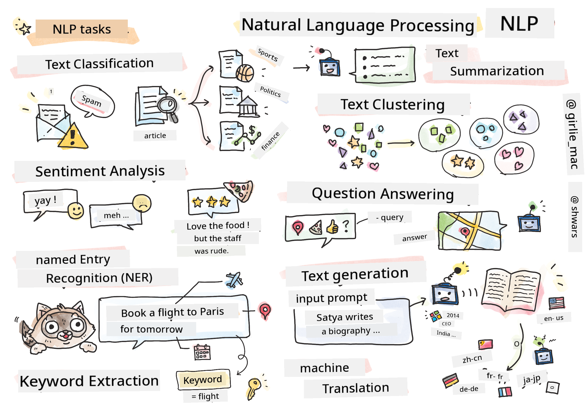

<!--
CO_OP_TRANSLATOR_METADATA:
{
  "original_hash": "8ef02a9318257ea140ed3ed74442096d",
  "translation_date": "2025-11-18T18:35:10+00:00",
  "source_file": "lessons/5-NLP/README.md",
  "language_code": "pcm"
}
-->
# Natural Language Processing



For dis section, we go focus on how Neural Networks fit handle tasks wey relate to **Natural Language Processing (NLP)**. Plenty NLP problems dey wey we wan make computer sabi solve:

* **Text classification** na one kind classification problem wey concern text sequences. Example na to classify e-mail messages as spam or no-spam, or to categorize articles as sport, business, politics, etc. Plus, when we dey develop chat bots, we go need understand wetin user wan talk -- for dis case, we dey deal with **intent classification**. Many times, for intent classification, we go need handle plenty categories.
* **Sentiment analysis** na one kind regression problem, wey we go need give number (sentiment) wey show how positive/negative the meaning of one sentence be. One advanced version of sentiment analysis na **aspect-based sentiment analysis** (ABSA), wey sentiment no dey for the whole sentence, but for different parts of am (aspects), e.g. *For dis restaurant, I like the food, but the atmosphere bad well well*.
* **Named Entity Recognition** (NER) na the problem of extracting certain entities from text. For example, we fit need understand say for the phrase *I need to fly to Paris tomorrow* the word *tomorrow* mean DATE, and *Paris* na LOCATION.  
* **Keyword extraction** dey similar to NER, but we go need extract words wey dey important to the meaning of the sentence automatically, without pre-training for specific entity types.
* **Text clustering** fit help when we wan group similar sentences together, e.g., similar requests for technical support conversations.
* **Question answering** na the ability of one model to answer specific question. The model go receive one text passage and one question as inputs, and e go need provide the place for the text wey the answer to the question dey (or, sometimes, generate the answer text).
* **Text Generation** na the ability of one model to generate new text. E fit be classification task wey dey predict next letter/word based on some *text prompt*. Advanced text generation models, like GPT-3, fit solve other NLP tasks like classification using one technique wey dem dey call [prompt programming](https://towardsdatascience.com/software-3-0-how-prompting-will-change-the-rules-of-the-game-a982fbfe1e0) or [prompt engineering](https://medium.com/swlh/openai-gpt-3-and-prompt-engineering-dcdc2c5fcd29)
* **Text summarization** na technique wey we wan make computer "read" long text and summarize am for few sentences.
* **Machine translation** fit be like combination of text understanding for one language, and text generation for another one.

Before before, most NLP tasks dey solved using traditional methods like grammars. For example, for machine translation, parsers dey transform initial sentence into syntax tree, then higher level semantic structures go dey extracted to represent the meaning of the sentence, and based on dis meaning and grammar of the target language, dem go generate the result. Nowadays, many NLP tasks dey solved better with neural networks.

> Many classical NLP methods dey implemented for [Natural Language Processing Toolkit (NLTK)](https://www.nltk.org) Python library. One better [NLTK Book](https://www.nltk.org/book/) dey online wey dey cover how different NLP tasks fit dey solved using NLTK.

For dis course, we go mostly focus on how to use Neural Networks for NLP, and we go use NLTK where e dey necessary.

We don already learn how to use neural networks to handle tabular data and images. The main difference between those types of data and text be say text na sequence wey get variable length, while the input size for images dey known before. While convolutional networks fit extract patterns from input data, patterns for text dey more complex. E.g., we fit get negation wey dey separate from the subject by plenty words (e.g. *I no like oranges*, vs. *I no like those big colorful tasty oranges*), and we still suppose interpret am as one pattern. So, to handle language, we need introduce new neural network types, like *recurrent networks* and *transformers*.

## Install Libraries

If you dey use local Python installation to run dis course, you fit need install all the libraries wey you need for NLP using dis commands:

**For PyTorch**
```bash
pip install -r requirements-torch.txt
```
**For TensorFlow**
```bash
pip install -r requirements-tf.txt
```

> You fit try NLP with TensorFlow for [Microsoft Learn](https://docs.microsoft.com/learn/modules/intro-natural-language-processing-tensorflow/?WT.mc_id=academic-77998-cacaste)

## GPU Warning

For dis section, for some of the examples, we go dey train big models.
* **Use GPU-Enabled Computer**: E good make you run your notebooks for GPU-enabled computer to reduce waiting time when you dey work with big models.
* **GPU Memory Constraints**: If you dey use GPU, e fit lead to situations wey GPU memory go finish, especially when you dey train big models.
* **GPU Memory Consumption**: The amount of GPU memory wey training dey use depend on different factors, including the minibatch size.
* **Minimize Minibatch Size**: If GPU memory dey give wahala, try reduce the minibatch size for your code as one possible solution.
* **TensorFlow GPU Memory Release**: Old versions of TensorFlow fit no dey release GPU memory well when you dey train multiple models for one Python kernel. To manage GPU memory usage well, you fit configure TensorFlow to allocate GPU memory only when e dey needed.
* **Code Inclusion**: To make TensorFlow grow GPU memory allocation only when e dey needed, add dis code for your notebooks:

```python
physical_devices = tf.config.list_physical_devices('GPU') 
if len(physical_devices)>0:
    tf.config.experimental.set_memory_growth(physical_devices[0], True) 
```

If you wan learn about NLP from classic ML perspective, visit [dis suite of lessons](https://github.com/microsoft/ML-For-Beginners/tree/main/6-NLP)

## For dis Section
For dis section, we go learn about:

* [How to represent text as tensors](13-TextRep/README.md)
* [Word Embeddings](14-Emdeddings/README.md)
* [Language Modeling](15-LanguageModeling/README.md)
* [Recurrent Neural Networks](16-RNN/README.md)
* [Generative Networks](17-GenerativeNetworks/README.md)
* [Transformers](18-Transformers/README.md)

---

<!-- CO-OP TRANSLATOR DISCLAIMER START -->
**Disclaimer**:  
Dis dokyument don translate wit AI translation service [Co-op Translator](https://github.com/Azure/co-op-translator). Even as we dey try make am accurate, abeg sabi say machine translation fit get mistake or no dey correct well. Di original dokyument for im native language na di main source wey you go fit trust. For important information, e better make professional human translator check am. We no go fit take blame for any misunderstanding or wrong interpretation wey fit happen because you use dis translation.
<!-- CO-OP TRANSLATOR DISCLAIMER END -->