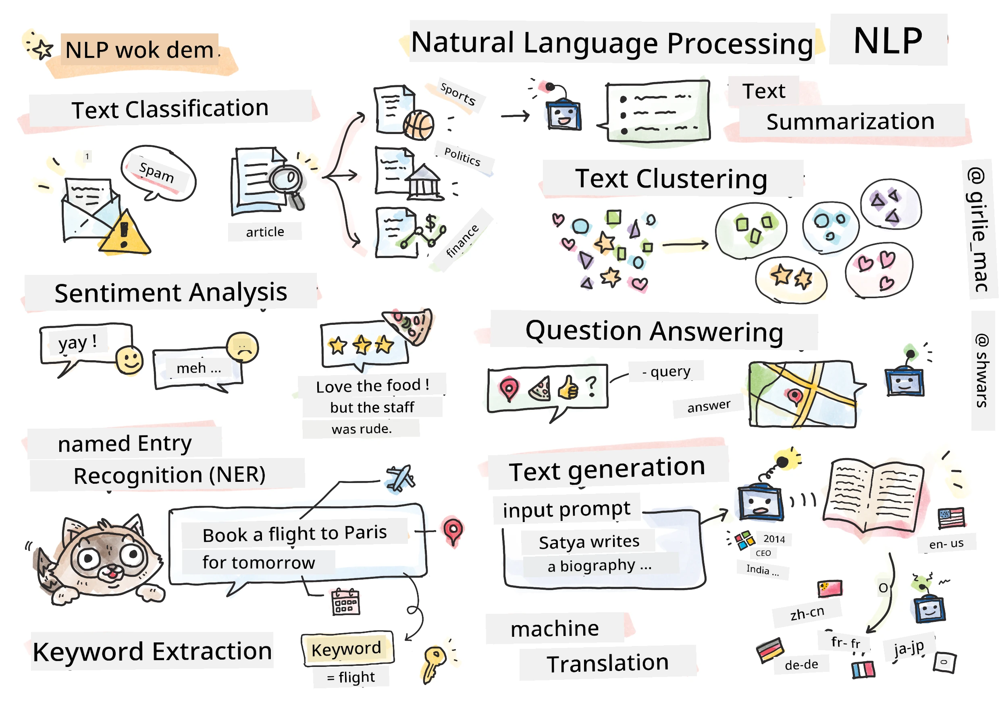

# Natural Language Processing



For dis section, we go focus on how to take use Neural Networks do tasks wey get to do with **Natural Language Processing (NLP)**. Plenty NLP problems dey we want make computer fit solve dem:

* **Text classification** na typical classification wahala wey concern text sequence. Examples na to classify e-mail messages as spam or no-spam, or to categorize articles as sport, business, politics, etc. Also, for making chat bots, we dey need to understand wetin person dey try talk -- for this case, na **intent classification** we dey do. Plenty times, for intent classification, we get plenty categories wey we need handle.
* **Sentiment analysis** na typical regression wahala, where we need put number (sentiment) wey match how positive/negative meaning of sentence be. One advanced kind sentiment analysis na **aspect-based sentiment analysis** (ABSA), where we no dey put sentiment for whole sentence but for different parts (aspects), e.g. *For this restaurant, I like the cuisine, but the atmosphere no too good*.
* **Named Entity Recognition** (NER) mean say you go find some entities for text. For example, we go need understand say for the phrase *I need to fly to Paris tomorrow* the word *tomorrow* na DATE, and *Paris* be LOCATION.  
* **Keyword extraction** similar to NER, but na words wey important to sentence meaning we dey find automatically, without pre-training for particular entity types.
* **Text clustering** fit help when we want group similar sentences together, like similar requests for technical support talk.
* **Question answering** mean say model fit answer specific question. The model go receive text passage plus question, and e need show place for text wey answer dey (or sometimes, generate answer text).
* **Text Generation** mean say model fit generate new text. E fit be classification task wey dey predict next letter/word based on some *text prompt*. Advanced text generation models, like GPT-3, fit solve other NLP tasks like classification using technique wey dem dey call [prompt programming](https://towardsdatascience.com/software-3-0-how-prompting-will-change-the-rules-of-the-game-a982fbfe1e0) or [prompt engineering](https://medium.com/swlh/openai-gpt-3-and-prompt-engineering-dcdc2c5fcd29)
* **Text summarization** na technique wey we want make computer "read" long text and summarize am inside few sentences.
* **Machine translation** fit be combination of understanding text for one language and generating text for another language.

Before before, most NLP tasks dem dey solve am with traditional methods like grammar. For example, for machine translation, dem dey use parsers to turn sentence into syntax tree, then dem dey find better semantic structures to represent meaning of sentence, and based on this meaning and grammar of language, the result dey generated. Nowadays, plenty NLP tasks better to solve with neural networks.

> Plenty classical NLP methods dey inside [Natural Language Processing Toolkit (NLTK)](https://www.nltk.org) Python library. Good [NLTK Book](https://www.nltk.org/book/) dey online wey talk how to solve different NLP tasks with NLTK.

For our course, we go mainly use Neural Networks for NLP, and we go use NLTK where e need.

We don already learn about how to use neural networks to handle tabular data and images. Main difference between those data and text na say text na variable length sequence, but input size for images dey known before. Convolutional networks fit find patterns for input data, but patterns for text more complex. Eg., negation fit dey far from subject for many words (eg. *I do not like oranges*, vs. *I do not like those big colorful tasty oranges*), but we still suppose consider am as one pattern. So, to handle language, we need new neural network types like *recurrent networks* and *transformers*.

## Install Libraries

If you dey use local Python install to run dis course, you fit need install all NLP libraries with these commands:

**For PyTorch**
```bash
pip install -r requirements-pytorch.txt
```
**For TensorFlow**
```bash
pip install -r requirements-tf.txt
```

> You fit try NLP with TensorFlow for [Microsoft Learn](https://docs.microsoft.com/learn/modules/intro-natural-language-processing-tensorflow/?WT.mc_id=academic-77998-cacaste)

## GPU Warning

For this section, for some examples we go train big models.
* **Use GPU Enabled Computer**: E good make you run notebook for GPU enabled computer to reduce waiting time when you dey work with big models.
* **GPU Memory Constraints**: If you run am for GPU, e fit happen say GPU memory go finish, especially if model big.
* **GPU Memory Consumption**: How much GPU memory you go use during training depend on many factors, including minibatch size.
* **Minimize Minibatch Size**: If GPU memory wahala show, try reduce minibatch size for your code.
* **TensorFlow GPU Memory Release**: Some old TensorFlow versions no dey release GPU memory well when you dey train many models inside one Python kernel. To manage GPU memory well, you fit set TensorFlow make e allocate GPU memory only as e need am.
* **Code Inclusion**: If you want TensorFlow to grow GPU memory allocation only as e need am, put this code inside your notebooks:

```python
physical_devices = tf.config.list_physical_devices('GPU') 
if len(physical_devices)>0:
    tf.config.experimental.set_memory_growth(physical_devices[0], True) 
```

If you want learn NLP from classic ML side, check [this suite of lessons](https://github.com/microsoft/ML-For-Beginners/tree/main/6-NLP)

## For this Section
For this section, we go learn about:

* [How to represent text as tensors](13-TextRep/README.md)
* [Word Embeddings](14-Embeddings/README.md)
* [Language Modeling](15-LanguageModeling/README.md)
* [Recurrent Neural Networks](16-RNN/README.md)
* [Generative Networks](17-GenerativeNetworks/README.md)
* [Transformers](18-Transformers/README.md)

---

<!-- CO-OP TRANSLATOR DISCLAIMER START -->
**Disclaimer**:
Dis document don translate wit AI translation service [Co-op Translator](https://github.com/Azure/co-op-translator). Even tho we dey try make am correct, abeg make you know say automated translation fit get errors or mistakes. Di original document for dia own language na im be di correct source. For important info, make person wey sabi human translation do am. We no go responsible for any misunderstanding or wrong understanding wey fit happen because of dis translation.
<!-- CO-OP TRANSLATOR DISCLAIMER END -->