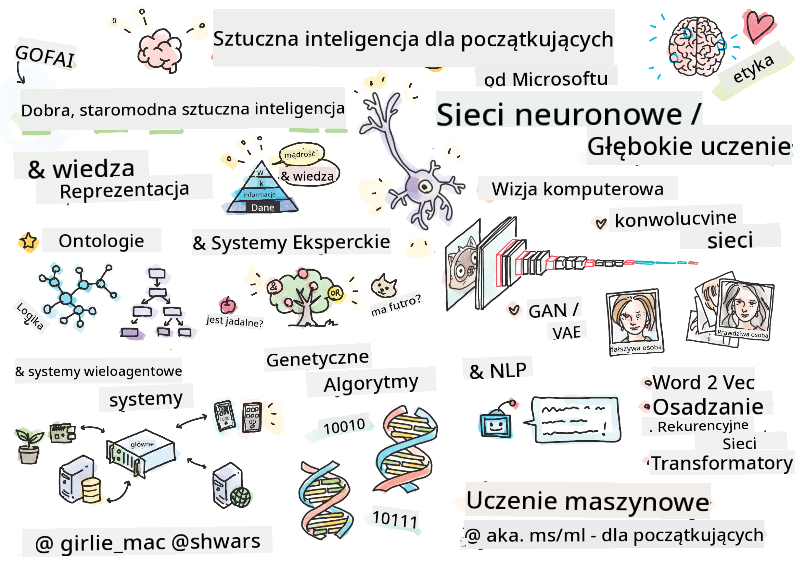

<!--
CO_OP_TRANSLATOR_METADATA:
{
  "original_hash": "4ed9993bca581850c983c95d5a3f57eb",
  "translation_date": "2025-12-24T23:57:26+00:00",
  "source_file": "README.md",
  "language_code": "pl"
}
-->

# Artificial Intelligence for Beginners - A Curriculum

||
|:---:|
| AI dla początkujących - _Sketchnote autorstwa [@girlie_mac](https://twitter.com/girlie_mac)_ |

Explore the world of **Artificial Intelligence** (AI) with our 12-week, 24-lesson curriculum!  It includes practical lessons, quizzes, and labs. The curriculum is beginner-friendly and covers tools like TensorFlow and PyTorch, as well as ethics in AI

### 🌐 Wsparcie wielojęzyczne

#### Obsługiwane przez GitHub Action (Automatyczne i zawsze aktualne)

<!-- CO-OP TRANSLATOR LANGUAGES TABLE START -->
[Arabski](../ar/README.md) | [Bengalski](../bn/README.md) | [Bułgarski](../bg/README.md) | [Birmański (Myanmar)](../my/README.md) | [Chiński (uproszczony)](../zh/README.md) | [Chiński (tradycyjny, Hong Kong)](../hk/README.md) | [Chiński (tradycyjny, Macau)](../mo/README.md) | [Chiński (tradycyjny, Taiwan)](../tw/README.md) | [Chorwacki](../hr/README.md) | [Czeski](../cs/README.md) | [Duński](../da/README.md) | [Holenderski](../nl/README.md) | [Estoński](../et/README.md) | [Fiński](../fi/README.md) | [Francuski](../fr/README.md) | [Niemiecki](../de/README.md) | [Grecki](../el/README.md) | [Hebrajski](../he/README.md) | [Hindi](../hi/README.md) | [Węgierski](../hu/README.md) | [Indonezyjski](../id/README.md) | [Włoski](../it/README.md) | [Japoński](../ja/README.md) | [Kannada](../kn/README.md) | [Koreański](../ko/README.md) | [Litewski](../lt/README.md) | [Malajski](../ms/README.md) | [Malayalam](../ml/README.md) | [Marathi](../mr/README.md) | [Nepalski](../ne/README.md) | [Nigeryjski Pidgin](../pcm/README.md) | [Norweski](../no/README.md) | [Perski (Farsi)](../fa/README.md) | [Polski](./README.md) | [Portugalski (Brazylia)](../br/README.md) | [Portugalski (Portugalia)](../pt/README.md) | [Pendżabski (Gurmukhi)](../pa/README.md) | [Rumuński](../ro/README.md) | [Rosyjski](../ru/README.md) | [Serbski (cyrylica)](../sr/README.md) | [Słowacki](../sk/README.md) | [Słoweński](../sl/README.md) | [Hiszpański](../es/README.md) | [Suahili](../sw/README.md) | [Szwedzki](../sv/README.md) | [Tagalog (Filipiński)](../tl/README.md) | [Tamil](../ta/README.md) | [Telugu](../te/README.md) | [Tajski](../th/README.md) | [Turecki](../tr/README.md) | [Ukraiński](../uk/README.md) | [Urdu](../ur/README.md) | [Wietnamski](../vi/README.md)
<!-- CO-OP TRANSLATOR LANGUAGES TABLE END -->

**Jeśli chcesz, aby dodane były kolejne tłumaczenia, obsługiwane języki są wymienione [tutaj](https://github.com/Azure/co-op-translator/blob/main/getting_started/supported-languages.md)**

## Dołącz do społeczności

## Czego się nauczysz

**[Mapa myśli kursu](http://soshnikov.com/courses/ai-for-beginners/mindmap.html)**

W tym programie nauczysz się:

* Różnych podejść do sztucznej inteligencji, w tym „starego, dobrego” podejścia symbolicznego z **Reprezentacją wiedzy** i wnioskowaniem ([GOFAI](https://en.wikipedia.org/wiki/Symbolic_artificial_intelligence)).
* **Sieci neuronowych** i **Głębokiego uczenia**, które są u podstaw współczesnej sztucznej inteligencji. Pokażemy koncepcje stojące za tymi ważnymi tematami używając kodu w dwóch z najpopularniejszych frameworków - [TensorFlow](http://Tensorflow.org) i [PyTorch](http://pytorch.org).
* **Architektury sieci neuronowych** do pracy z obrazami i tekstem. Omówimy nowsze modele, choć może brakować pełnego przeglądu najnowszych osiągnięć.
* Mniej popularne podejścia do AI, takie jak **algorytmy genetyczne** i **systemy wieloagentowe**.

Czego nie obejmiemy w tym programie:

> [Znajdź wszystkie dodatkowe zasoby dla tego kursu w naszej kolekcji Microsoft Learn](https://learn.microsoft.com/en-us/collections/7w28iy2xrqzdj0?WT.mc_id=academic-77998-bethanycheum)

* Przypadków biznesowych użycia **AI w biznesie**. Rozważ skorzystanie ze ścieżki szkoleniowej [Introduction to AI for business users](https://docs.microsoft.com/learn/paths/introduction-ai-for-business-users/?WT.mc_id=academic-77998-bethanycheum) na Microsoft Learn lub [AI Business School](https://www.microsoft.com/ai/ai-business-school/?WT.mc_id=academic-77998-bethanycheum), opracowanej we współpracy z [INSEAD](https://www.insead.edu/).
* **Klasycznego uczenia maszynowego**, które jest dobrze opisane w naszym [Machine Learning for Beginners Curriculum](http://github.com/Microsoft/ML-for-Beginners).
* Praktycznych zastosowań AI zbudowanych przy użyciu **[Cognitive Services](https://azure.microsoft.com/services/cognitive-services/?WT.mc_id=academic-77998-bethanycheum)**. W tym celu rekomendujemy rozpoczęcie od modułów Microsoft Learn dotyczących [wizji](https://docs.microsoft.com/learn/paths/create-computer-vision-solutions-azure-cognitive-services/?WT.mc_id=academic-77998-bethanycheum), [przetwarzania języka naturalnego](https://docs.microsoft.com/learn/paths/explore-natural-language-processing/?WT.mc_id=academic-77998-bethanycheum), **[Generative AI with Azure OpenAI Service](https://learn.microsoft.com/en-us/training/paths/develop-ai-solutions-azure-openai/?WT.mc_id=academic-77998-bethanycheum)** i innych.
* Konkretne **frameworki chmurowe ML**, takie jak [Azure Machine Learning](https://azure.microsoft.com/services/machine-learning/?WT.mc_id=academic-77998-bethanycheum), [Microsoft Fabric](https://learn.microsoft.com/en-us/training/paths/get-started-fabric/?WT.mc_id=academic-77998-bethanycheum) lub [Azure Databricks](https://docs.microsoft.com/learn/paths/data-engineer-azure-databricks?WT.mc_id=academic-77998-bethanycheum). Rozważ skorzystanie ze ścieżek szkoleniowych [Build and operate machine learning solutions with Azure Machine Learning](https://docs.microsoft.com/learn/paths/build-ai-solutions-with-azure-ml-service/?WT.mc_id=academic-77998-bethanycheum) oraz [Build and Operate Machine Learning Solutions with Azure Databricks](https://docs.microsoft.com/learn/paths/build-operate-machine-learning-solutions-azure-databricks/?WT.mc_id=academic-77998-bethanycheum).
* **Conversational AI** i **Chat Boty**. Istnieje oddzielna ścieżka szkoleniowa [Create conversational AI solutions](https://docs.microsoft.com/learn/paths/create-conversational-ai-solutions/?WT.mc_id=academic-77998-bethanycheum), a także możesz odnieść się do [tego wpisu na blogu](https://soshnikov.com/azure/hello-bot-conversational-ai-on-microsoft-platform/) po więcej szczegółów.
* **Głębokiej matematyki** stojącej za głębokim uczeniem. W tym celu polecilibyśmy książkę [Deep Learning](https://www.amazon.com/Deep-Learning-Adaptive-Computation-Machine/dp/0262035618) autorstwa Iana Goodfellowa, Yoshua Bengio i Aarona Courville'a, która jest również dostępna online pod adresem [https://www.deeplearningbook.org/](https://www.deeplearningbook.org/).

Dla łagodnego wprowadzenia do tematów związanych z _AI w chmurze_ możesz rozważyć skorzystanie ze ścieżki szkoleniowej [Get started with artificial intelligence on Azure](https://docs.microsoft.com/learn/paths/get-started-with-artificial-intelligence-on-azure/?WT.mc_id=academic-77998-bethanycheum).

# Zawartość

|     |                                                                 Link do lekcji                                                                  |                                           PyTorch/Keras/TensorFlow                                          | Laboratorium                                                            |
| :-: | :------------------------------------------------------------------------------------------------------------------------------------------: | :---------------------------------------------------------------------------------------------: | ------------------------------------------------------------------------------ |
| 0  |                                 [Konfiguracja kursu](./lessons/0-course-setup/setup.md)                                 |                      [Konfiguracja środowiska programistycznego](./lessons/0-course-setup/how-to-run.md)                       |   |
| I  |               [**Wprowadzenie do AI**](./lessons/1-Intro/README.md)      | | |
| 01  |       [Wprowadzenie i historia AI](./lessons/1-Intro/README.md)       |           -                            | -  |
| II |              **Symboliczne AI**              |
| 02  |       [Reprezentacja wiedzy i systemy ekspertowe](./lessons/2-Symbolic/README.md)       |            [Systemy ekspertowe](./lessons/2-Symbolic/Animals.ipynb) /  [Ontologia](./lessons/2-Symbolic/FamilyOntology.ipynb) /[Graf pojęć](./lessons/2-Symbolic/MSConceptGraph.ipynb)                             |  |
| III |                        [**Wprowadzenie do sieci neuronowych**](./lessons/3-NeuralNetworks/README.md) |||
| 03  |                [Perceptron](./lessons/3-NeuralNetworks/03-Perceptron/README.md)                 |                       [Notatnik](./lessons/3-NeuralNetworks/03-Perceptron/Perceptron.ipynb)                      | [Laboratorium](./lessons/3-NeuralNetworks/03-Perceptron/lab/README.md) |
| 04  |                   [Wielowarstwowy perceptron i stworzenie własnego frameworku](./lessons/3-NeuralNetworks/04-OwnFramework/README.md)                   |        [Notatnik](./lessons/3-NeuralNetworks/04-OwnFramework/OwnFramework.ipynb)        | [Laboratorium](./lessons/3-NeuralNetworks/04-OwnFramework/lab/README.md) |
| 05  |            [Wprowadzenie do frameworków (PyTorch/TensorFlow) i nadmierne dopasowanie](./lessons/3-NeuralNetworks/05-Frameworks/README.md)             |           [PyTorch](./lessons/3-NeuralNetworks/05-Frameworks/IntroPyTorch.ipynb) / [Keras](./lessons/3-NeuralNetworks/05-Frameworks/IntroKeras.ipynb) / [TensorFlow](./lessons/3-NeuralNetworks/05-Frameworks/IntroKerasTF.ipynb)             | [Laboratorium](./lessons/3-NeuralNetworks/05-Frameworks/lab/README.md) |
| IV  |            [**Wizja komputerowa**](./lessons/4-ComputerVision/README.md)             | [PyTorch](https://docs.microsoft.com/learn/modules/intro-computer-vision-pytorch/?WT.mc_id=academic-77998-cacaste) / [TensorFlow](https://docs.microsoft.com/learn/modules/intro-computer-vision-TensorFlow/?WT.mc_id=academic-77998-cacaste)| [Odkryj wizję komputerową na Microsoft Azure](https://learn.microsoft.com/en-us/collections/7w28iy2xrqzdj0?WT.mc_id=academic-77998-bethanycheum) |
| 06  |            [Wprowadzenie do wizji komputerowej. OpenCV](./lessons/4-ComputerVision/06-IntroCV/README.md)             |           [Notatnik](./lessons/4-ComputerVision/06-IntroCV/OpenCV.ipynb)         | [Laboratorium](./lessons/4-ComputerVision/06-IntroCV/lab/README.md) |
| 07  |            [Konwolucyjne sieci neuronowe](./lessons/4-ComputerVision/07-ConvNets/README.md) &  [Architektury CNN](./lessons/4-ComputerVision/07-ConvNets/CNN_Architectures.md)             |           [PyTorch](./lessons/4-ComputerVision/07-ConvNets/ConvNetsPyTorch.ipynb) /[TensorFlow](./lessons/4-ComputerVision/07-ConvNets/ConvNetsTF.ipynb)             | [Laboratorium](./lessons/4-ComputerVision/07-ConvNets/lab/README.md) |
| 08  |            [Sieci wstępnie wytrenowane i uczenie transferowe](./lessons/4-ComputerVision/08-TransferLearning/README.md) and [Triki treningowe](./lessons/4-ComputerVision/08-TransferLearning/TrainingTricks.md)             |           [PyTorch](./lessons/4-ComputerVision/08-TransferLearning/TransferLearningPyTorch.ipynb) / [TensorFlow](./lessons/3-NeuralNetworks/05-Frameworks/IntroKerasTF.ipynb)             | [Laboratorium](./lessons/4-ComputerVision/08-TransferLearning/lab/README.md) |
| 09  |            [Autoenkodery i VAE](./lessons/4-ComputerVision/09-Autoencoders/README.md)             |           [PyTorch](./lessons/4-ComputerVision/09-Autoencoders/AutoEncodersPyTorch.ipynb) / [TensorFlow](./lessons/4-ComputerVision/09-Autoencoders/AutoencodersTF.ipynb)             |  |
| 10  |            [Generatywne sieci przeciwstawne i transfer stylu artystycznego](./lessons/4-ComputerVision/10-GANs/README.md)             |           [PyTorch](./lessons/4-ComputerVision/10-GANs/GANPyTorch.ipynb) / [TensorFlow](./lessons/4-ComputerVision/10-GANs/GANTF.ipynb)             |  |
| 11  |            [Wykrywanie obiektów](./lessons/4-ComputerVision/11-ObjectDetection/README.md)             |         [TensorFlow](./lessons/4-ComputerVision/11-ObjectDetection/ObjectDetection.ipynb)             | [Laboratorium](./lessons/4-ComputerVision/11-ObjectDetection/lab/README.md) |
| 12  |            [Segmentacja semantyczna. U-Net](./lessons/4-ComputerVision/12-Segmentation/README.md)             |           [PyTorch](./lessons/4-ComputerVision/12-Segmentation/SemanticSegmentationPytorch.ipynb) / [TensorFlow](./lessons/4-ComputerVision/12-Segmentation/SemanticSegmentationTF.ipynb)             |  |
| V  |            [**Przetwarzanie języka naturalnego**](./lessons/5-NLP/README.md)             | [PyTorch](https://docs.microsoft.com/learn/modules/intro-natural-language-processing-pytorch/?WT.mc_id=academic-77998-cacaste) /[TensorFlow](https://docs.microsoft.com/learn/modules/intro-natural-language-processing-TensorFlow/?WT.mc_id=academic-77998-cacaste) | [Odkryj przetwarzanie języka naturalnego na Microsoft Azure](https://learn.microsoft.com/en-us/collections/7w28iy2xrqzdj0?WT.mc_id=academic-77998-bethanycheum)|
| 13  |            [Reprezentacja tekstu. BoW/TF-IDF](./lessons/5-NLP/13-TextRep/README.md)             |           [PyTorch](https://github.com/microsoft/AI-For-Beginners/blob/main/lessons/5-NLP/13-TextRep/TextRepresentationPyTorch.ipynb) / [TensorFlow](https://github.com/microsoft/AI-For-Beginners/blob/main/lessons/5-NLP/13-TextRep/TextRepresentationTF.ipynb)             | |
| 14  |            [Semantyczne osadzenia słów. Word2Vec i GloVe](./lessons/5-NLP/14-Embeddings/README.md)             |           [PyTorch](https://github.com/microsoft/AI-For-Beginners/blob/main/lessons/5-NLP/14-Embeddings/EmbeddingsPyTorch.ipynb) / [TensorFlow](https://github.com/microsoft/AI-For-Beginners/blob/main/lessons/5-NLP/14-Embeddings/EmbeddingsTF.ipynb)             |  |
| 15  |            [Modelowanie języka. Trenowanie własnych osadzeń](./lessons/5-NLP/15-LanguageModeling/README.md)             |           [PyTorch](https://github.com/microsoft/AI-For-Beginners/blob/main/lessons/5-NLP/15-LanguageModeling/CBoW-PyTorch.ipynb) / [TensorFlow](https://github.com/microsoft/AI-For-Beginners/blob/main/lessons/5-NLP/15-LanguageModeling/CBoW-TF.ipynb)             | [Laboratorium](./lessons/5-NLP/15-LanguageModeling/lab/README.md) |
| 16  |            [Rekurencyjne sieci neuronowe](./lessons/5-NLP/16-RNN/README.md)             |           [PyTorch](https://github.com/microsoft/AI-For-Beginners/blob/main/lessons/5-NLP/16-RNN/RNNPyTorch.ipynb) / [TensorFlow](https://github.com/microsoft/AI-For-Beginners/blob/main/lessons/5-NLP/16-RNN/RNNTF.ipynb)             |  |
| 17  |            [Generatywne sieci rekurencyjne](./lessons/5-NLP/17-GenerativeNetworks/README.md)             |           [PyTorch](https://github.com/microsoft/AI-For-Beginners/blob/main/lessons/5-NLP/17-GenerativeNetworks/GenerativePyTorch.ipynb) / [TensorFlow](https://github.com/microsoft/AI-For-Beginners/blob/main/lessons/5-NLP/17-GenerativeNetworks/GenerativeTF.ipynb)             | [Laboratorium](./lessons/5-NLP/17-GenerativeNetworks/lab/README.md) |
| 18  |            [Transformatory. BERT.](./lessons/5-NLP/18-Transformers/README.md)             |           [PyTorch](https://github.com/microsoft/AI-For-Beginners/blob/main/lessons/5-NLP/18-Transformers/TransformersPyTorch.ipynb) /[TensorFlow](https://github.com/microsoft/AI-For-Beginners/blob/main/lessons/5-NLP/18-Transformers/TransformersTF.ipynb)             |  |
| 19  |            [Rozpoznawanie nazwanych encji](./lessons/5-NLP/19-NER/README.md)             |           [TensorFlow](https://microsoft.github.io/AI-For-Beginners/lessons/5-NLP/19-NER/NER-TF.ipynb)             | [Laboratorium](./lessons/5-NLP/19-NER/lab/README.md) |
| 20  |            [Duże modele językowe, programowanie promptów i zadania few-shot](./lessons/5-NLP/20-LangModels/README.md)             |           [PyTorch](https://microsoft.github.io/AI-For-Beginners/lessons/5-NLP/20-LangModels/GPT-PyTorch.ipynb) | |
| VI |            **Inne techniki AI** || |
| 21  |            [Algorytmy genetyczne](./lessons/6-Other/21-GeneticAlgorithms/README.md)             |           [Notatnik](./lessons/6-Other/21-GeneticAlgorithms/Genetic.ipynb) | |
| 22  |            [Głębokie uczenie ze wzmocnieniem](./lessons/6-Other/22-DeepRL/README.md)             |           [PyTorch](./lessons/6-Other/22-DeepRL/CartPole-RL-PyTorch.ipynb) /[TensorFlow](./lessons/6-Other/22-DeepRL/CartPole-RL-TF.ipynb)             | [Laboratorium](./lessons/6-Other/22-DeepRL/lab/README.md) |
| 23  |            [Systemy wieloagentowe](./lessons/6-Other/23-MultiagentSystems/README.md)             |  | |
| VII |            **Etyka AI** | | |
| 24  |            [Etyka AI i odpowiedzialna AI](./lessons/7-Ethics/README.md)             |           [Microsoft Learn: Zasady odpowiedzialnej AI](https://docs.microsoft.com/learn/paths/responsible-ai-business-principles/?WT.mc_id=academic-77998-cacaste) | |
| IX  |            **Dodatki** | | |
| 25  |            [Sieci multimodalne, CLIP i VQGAN](./lessons/X-Extras/X1-MultiModal/README.md)             |           [Notatnik](./lessons/X-Extras/X1-MultiModal/Clip.ipynb)    | |

## Każda lekcja zawiera

* Materiały do wstępnej lektury
* Wykonywalne notatniki Jupyter, które często są specyficzne dla frameworku (**PyTorch** lub **TensorFlow**). Wykonywalny notatnik zawiera również dużo materiału teoretycznego, więc aby zrozumieć temat musisz przejść przez przynajmniej jedną wersję notatnika (albo PyTorch, albo TensorFlow).
* **Laboratoria** dostępne dla niektórych tematów, które dają możliwość wypróbowania zastosowania materiału, którego się nauczyłeś, do konkretnego problemu.
* Niektóre sekcje zawierają linki do [**MS Learn**](https://learn.microsoft.com/en-us/collections/7w28iy2xrqzdj0?WT.mc_id=academic-77998-bethanycheum) modułów, które omawiają powiązane tematy.

## Pierwsze kroki

### 🎯 Nowy w AI? Zacznij tutaj!

Jeśli jesteś zupełnie nowy w AI i chcesz szybkie, praktyczne przykłady, sprawdź nasze [**Przykłady dla początkujących**](./examples/README.md)! Te obejmują:

- 🌟 **Hello AI World** - Twój pierwszy program AI (rozpoznawanie wzorców)
- 🧠 **Prosta sieć neuronowa** - Zbuduj sieć neuronową od podstaw  
- 🖼️ **Klasyfikator obrazów** - Klasyfikuj obrazy z szczegółowymi komentarzami
- 💬 **Analiza sentymentu tekstu** - Analizuj tekst pozytywny/negatywny

These examples are designed to help you understand AI concepts before diving into the full curriculum.

### 📚 Konfiguracja pełnego programu

- Utworzyliśmy a [lekcję konfiguracji](./lessons/0-course-setup/setup.md) to help you with setting up your development environment. - Dla nauczycieli przygotowaliśmy również a [lekcję konfiguracji programu nauczania](./lessons/0-course-setup/for-teachers.md) for you too!
- Jak to [Run the code in a VSCode or a Codepace](./lessons/0-course-setup/how-to-run.md)

Follow these steps:

Fork the Repository: Click on the "Fork" button at the top-right corner of this page.

Clone the Repository: `git clone https://github.com/microsoft/AI-For-Beginners.git`

Don't forget to star (🌟) this repo to find it easier later.

## Poznaj innych uczestników

Join our [oficjalnego serwera AI na Discordzie](https://aka.ms/genai-discord?WT.mc_id=academic-105485-bethanycheum) to meet and network with other learners taking this course and get support.

If you have product feedback or questions whilst building visit our [Azure AI Foundry Developer Forum](https://aka.ms/foundry/forum)

## Quizy 

> **Notatka o quizach**: Wszystkie quizy są contained in the Quiz-app folder in etc\quiz-app, or [Dostępne online tutaj](https://ff-quizzes.netlify.app/) They are linked from within the lessons the quiz app can be run locally or deployed to Azure; follow the instruction in the `quiz-app` folder. They are gradually being localized.

## Potrzebna pomoc

Do you have suggestions or found spelling or code errors? Raise an issue or create a pull request.

## Specjalne podziękowania

* **✍️ Główny autor:** [Dmitry Soshnikov](http://soshnikov.com), PhD
* **🔥 Redaktor:** [Jen Looper](https://twitter.com/jenlooper), PhD
* **🎨 Ilustrator sketchnotów:** [Tomomi Imura](https://twitter.com/girlie_mac)
* **✅ Twórca quizów:** [Lateefah Bello](https://github.com/CinnamonXI), [MLSA](https://studentambassadors.microsoft.com/)
* **🙏 Główni współtwórcy:** [Evgenii Pishchik](https://github.com/Pe4enIks)

## Inne kursy

Our team produces other curricula! Check out:

<!-- CO-OP TRANSLATOR OTHER COURSES START -->
### LangChain

---

### Azure / Edge / MCP / Agenci

---
 
### Seria Generative AI

[-9333EA?style=for-the-badge&labelColor=E5E7EB&color=9333EA)](https://github.com/microsoft/Generative-AI-for-beginners-dotnet?WT.mc_id=academic-105485-koreyst)
[-C084FC?style=for-the-badge&labelColor=E5E7EB&color=C084FC)](https://github.com/microsoft/generative-ai-for-beginners-java?WT.mc_id=academic-105485-koreyst)
[-E879F9?style=for-the-badge&labelColor=E5E7EB&color=E879F9)](https://github.com/microsoft/generative-ai-with-javascript?WT.mc_id=academic-105485-koreyst)

---
 
### Podstawowe materiały

---
 
### Seria Copilot

<!-- CO-OP TRANSLATOR OTHER COURSES END -->

## Uzyskaj pomoc

Jeśli utkniesz lub masz pytania dotyczące tworzenia aplikacji AI, dołącz do innych uczestników kursu i doświadczonych programistów w dyskusjach o MCP. To wspierająca społeczność, w której pytania są mile widziane i wiedza jest swobodnie udostępniana.

If you have product feedback or errors while building visit:

---

<!-- CO-OP TRANSLATOR DISCLAIMER START -->
Zastrzeżenie:
Ten dokument został przetłumaczony przy użyciu usługi tłumaczeń opartych na sztucznej inteligencji [Co-op Translator](https://github.com/Azure/co-op-translator). Chociaż dokładamy starań, aby tłumaczenie było jak najdokładniejsze, prosimy pamiętać, że tłumaczenia automatyczne mogą zawierać błędy lub nieścisłości. Oryginalny dokument w jego języku źródłowym powinien być uznany za źródło autorytatywne. W przypadku informacji krytycznych zalecane jest skorzystanie z profesjonalnego tłumaczenia wykonanego przez człowieka. Nie ponosimy odpowiedzialności za żadne nieporozumienia lub błędne interpretacje wynikające z korzystania z tego tłumaczenia.
<!-- CO-OP TRANSLATOR DISCLAIMER END -->