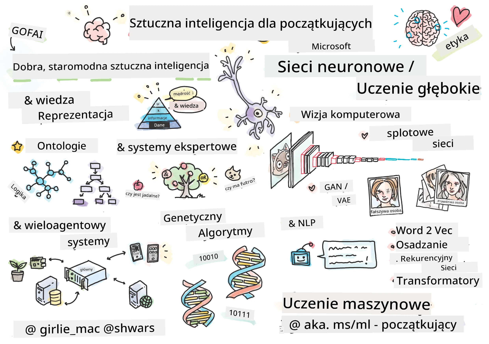

[](https://github.com/microsoft/AI-For-Beginners/blob/main/LICENSE)
[](https://GitHub.com/microsoft/AI-For-Beginners/graphs/contributors/)
[](https://GitHub.com/microsoft/AI-For-Beginners/issues/)
[](https://GitHub.com/microsoft/AI-For-Beginners/pulls/)
[](http://makeapullrequest.com)

[](https://GitHub.com/microsoft/AI-For-Beginners/watchers/)
[](https://GitHub.com/microsoft/AI-For-Beginners/network/)
[](https://GitHub.com/microsoft/AI-For-Beginners/stargazers/)
[](https://mybinder.org/v2/gh/microsoft/ai-for-beginners/HEAD)
[](https://gitter.im/Microsoft/ai-for-beginners?utm_source=badge&utm_medium=badge&utm_campaign=pr-badge)

[](https://discord.gg/nTYy5BXMWG)

# Sztuczna inteligencja dla początkujących - Program nauczania

||
|:---:|
| AI For Beginners - _Sketchnote autorstwa [@girlie_mac](https://twitter.com/girlie_mac)_ |

Odkryj świat **Sztucznej Inteligencji** (AI) dzięki naszemu 12-tygodniowemu programowi nauczania składającemu się z 24 lekcji! Zawiera praktyczne lekcje, quizy i laboratoria. Program jest przyjazny dla początkujących i omawia narzędzia takie jak TensorFlow i PyTorch, a także etykę w AI.


### 🌐 Wsparcie wielojęzyczne

#### Obsługiwane za pomocą GitHub Action (Automatyczne i zawsze aktualne)

<!-- CO-OP TRANSLATOR LANGUAGES TABLE START -->
[Arabic](../ar/README.md) | [Bengali](../bn/README.md) | [Bulgarian](../bg/README.md) | [Burmese (Myanmar)](../my/README.md) | [Chinese (Simplified)](../zh-CN/README.md) | [Chinese (Traditional, Hong Kong)](../zh-HK/README.md) | [Chinese (Traditional, Macau)](../zh-MO/README.md) | [Chinese (Traditional, Taiwan)](../zh-TW/README.md) | [Croatian](../hr/README.md) | [Czech](../cs/README.md) | [Danish](../da/README.md) | [Dutch](../nl/README.md) | [Estonian](../et/README.md) | [Finnish](../fi/README.md) | [French](../fr/README.md) | [German](../de/README.md) | [Greek](../el/README.md) | [Hebrew](../he/README.md) | [Hindi](../hi/README.md) | [Hungarian](../hu/README.md) | [Indonesian](../id/README.md) | [Italian](../it/README.md) | [Japanese](../ja/README.md) | [Kannada](../kn/README.md) | [Korean](../ko/README.md) | [Lithuanian](../lt/README.md) | [Malay](../ms/README.md) | [Malayalam](../ml/README.md) | [Marathi](../mr/README.md) | [Nepali](../ne/README.md) | [Nigerian Pidgin](../pcm/README.md) | [Norwegian](../no/README.md) | [Persian (Farsi)](../fa/README.md) | [Polish](./README.md) | [Portuguese (Brazil)](../pt-BR/README.md) | [Portuguese (Portugal)](../pt-PT/README.md) | [Punjabi (Gurmukhi)](../pa/README.md) | [Romanian](../ro/README.md) | [Russian](../ru/README.md) | [Serbian (Cyrillic)](../sr/README.md) | [Slovak](../sk/README.md) | [Slovenian](../sl/README.md) | [Spanish](../es/README.md) | [Swahili](../sw/README.md) | [Swedish](../sv/README.md) | [Tagalog (Filipino)](../tl/README.md) | [Tamil](../ta/README.md) | [Telugu](../te/README.md) | [Thai](../th/README.md) | [Turkish](../tr/README.md) | [Ukrainian](../uk/README.md) | [Urdu](../ur/README.md) | [Vietnamese](../vi/README.md)

> **Wolisz sklonować lokalnie?**

> To repozytorium zawiera ponad 50 tłumaczeń językowych, co znacznie zwiększa rozmiar pobierania. Aby sklonować bez tłumaczeń, użyj sparse checkout:
> ```bash
> git clone --filter=blob:none --sparse https://github.com/microsoft/AI-For-Beginners.git
> cd AI-For-Beginners
> git sparse-checkout set --no-cone '/*' '!translations' '!translated_images'
> ```
> Dzięki temu otrzymasz wszystko, czego potrzebujesz do ukończenia kursu z dużo szybszym pobieraniem.
<!-- CO-OP TRANSLATOR LANGUAGES TABLE END -->

**Jeśli chcesz, aby obsługiwane były dodatkowe języki tłumaczeń, znajdują się one [tutaj](https://github.com/Azure/co-op-translator/blob/main/getting_started/supported-languages.md)**

## Dołącz do społeczności
[](https://discord.gg/nTYy5BXMWG)

## Czego się nauczysz

**[Mapa myśli kursu](http://soshnikov.com/courses/ai-for-beginners/mindmap.html)**

W tym programie nauczania nauczysz się:

* Różnych podejść do Sztucznej Inteligencji, w tym "dawnego dobrego" podejścia symbolicznego z **Reprezentacją Wiedzy** i rozumowaniem ([GOFAI](https://en.wikipedia.org/wiki/Symbolic_artificial_intelligence)).
* **Sieci neuronowych** i **Głębokiego uczenia**, które są sednem nowoczesnej AI. Pokażemy koncepcje stojące za tymi ważnymi tematami, używając kodu w dwóch najpopularniejszych frameworkach - [TensorFlow](http://Tensorflow.org) i [PyTorch](http://pytorch.org).
* **Architektury neuronowe** do pracy z obrazami i tekstem. Omówimy najnowsze modele, choć mogą być nieco odbiegające od stanu wiedzy najbardziej zaawansowanej.
* Mniej popularne podejścia do AI, takie jak **Algorytmy genetyczne** i **Systemy wieloagentowe**.

Czego nie będziemy omawiać w tym programie nauczania:

> [Znajdź wszystkie dodatkowe zasoby do tego kursu w naszej kolekcji Microsoft Learn](https://learn.microsoft.com/en-us/collections/7w28iy2xrqzdj0?WT.mc_id=academic-77998-bethanycheum)

* Przypadków biznesowych użycia **AI w biznesie**. Rozważ skorzystanie ze ścieżki nauczania [Wprowadzenie do AI dla użytkowników biznesowych](https://docs.microsoft.com/learn/paths/introduction-ai-for-business-users/?WT.mc_id=academic-77998-bethanycheum) na Microsoft Learn lub [AI Business School](https://www.microsoft.com/ai/ai-business-school/?WT.mc_id=academic-77998-bethanycheum), opracowanej we współpracy z [INSEAD](https://www.insead.edu/).
* **Klasycznego uczenia maszynowego**, które jest dobrze opisane w naszym [Programie nauczania Uczenie maszynowe dla początkujących](http://github.com/Microsoft/ML-for-Beginners).
* Praktycznych zastosowań AI zbudowanych przy pomocy **[Cognitive Services](https://azure.microsoft.com/services/cognitive-services/?WT.mc_id=academic-77998-bethanycheum)**. W tym celu polecamy rozpoczęcie od modułów Microsoft Learn dotyczących [wizji komputerowej](https://docs.microsoft.com/learn/paths/create-computer-vision-solutions-azure-cognitive-services/?WT.mc_id=academic-77998-bethanycheum), [przetwarzania języka naturalnego](https://docs.microsoft.com/learn/paths/explore-natural-language-processing/?WT.mc_id=academic-77998-bethanycheum), **[Generatywnej AI z Azure OpenAI Service](https://learn.microsoft.com/en-us/training/paths/develop-ai-solutions-azure-openai/?WT.mc_id=academic-77998-bethanycheum)** i innych.
* Specyficznych **Chmurowych Frameworków ML**, takich jak [Azure Machine Learning](https://azure.microsoft.com/services/machine-learning/?WT.mc_id=academic-77998-bethanycheum), [Microsoft Fabric](https://learn.microsoft.com/en-us/training/paths/get-started-fabric/?WT.mc_id=academic-77998-bethanycheum) lub [Azure Databricks](https://docs.microsoft.com/learn/paths/data-engineer-azure-databricks?WT.mc_id=academic-77998-bethanycheum). Rozważ skorzystanie ze ścieżek nauczania [Buduj i obsługuj rozwiązania uczenia maszynowego z Azure Machine Learning](https://docs.microsoft.com/learn/paths/build-ai-solutions-with-azure-ml-service/?WT.mc_id=academic-77998-bethanycheum) oraz [Buduj i obsługuj rozwiązania uczenia maszynowego z Azure Databricks](https://docs.microsoft.com/learn/paths/build-operate-machine-learning-solutions-azure-databricks/?WT.mc_id=academic-77998-bethanycheum).
* **Rozmownych AI** i **Chat Botów**. Istnieje oddzielna ścieżka nauczania [Tworzenie rozwiązań conversational AI](https://docs.microsoft.com/learn/paths/create-conversational-ai-solutions/?WT.mc_id=academic-77998-bethanycheum), a także możesz zapoznać się z [tym wpisem na blogu](https://soshnikov.com/azure/hello-bot-conversational-ai-on-microsoft-platform/) dla bardziej szczegółowych informacji.
* **Głębokiej matematyki** stojącej za głębokim uczeniem. W tym celu polecamy książkę [Deep Learning](https://www.amazon.com/Deep-Learning-Adaptive-Computation-Machine/dp/0262035618) autorstwa Iana Goodfellowa, Yoshua Bengio i Aarona Courville, która jest również dostępna online pod adresem [https://www.deeplearningbook.org/](https://www.deeplearningbook.org/).

Dla łagodnego wprowadzenia do tematów _AI w chmurze_ możesz rozważyć [Rozpoczęcie pracy ze sztuczną inteligencją na Azure](https://docs.microsoft.com/learn/paths/get-started-with-artificial-intelligence-on-azure/?WT.mc_id=academic-77998-bethanycheum) ścieżkę nauczania.

# Zawartość

|     |                                                                 Link do lekcji                                                                  |                                           PyTorch/Keras/TensorFlow                                          | Laboratorium                                                            |
| :-: | :------------------------------------------------------------------------------------------------------------------------------------------: | :---------------------------------------------------------------------------------------------: | ------------------------------------------------------------------------------ |
| 0  |                                 [Ustawienia kursu](./lessons/0-course-setup/setup.md)                                 |                      [Konfiguracja środowiska programistycznego](./lessons/0-course-setup/how-to-run.md)                       |   |
| I  |               [**Wprowadzenie do AI**](./lessons/1-Intro/README.md)      | | |
| 01  |       [Wprowadzenie i historia AI](./lessons/1-Intro/README.md)       |           -                            | -  |
| II |              **Symboliczna AI**              |
| 02  |       [Reprezentacja wiedzy i systemy ekspertowe](./lessons/2-Symbolic/README.md)       |            [Systemy ekspertowe](./lessons/2-Symbolic/Animals.ipynb) /  [Ontologia](./lessons/2-Symbolic/FamilyOntology.ipynb) /[Graf koncepcji](./lessons/2-Symbolic/MSConceptGraph.ipynb)                             |  |
| III |                        [**Wprowadzenie do sieci neuronowych**](./lessons/3-NeuralNetworks/README.md) |||
| 03  |                [Perceptron](./lessons/3-NeuralNetworks/03-Perceptron/README.md)                 |                       [Notatnik](./lessons/3-NeuralNetworks/03-Perceptron/Perceptron.ipynb)                      | [Laboratorium](./lessons/3-NeuralNetworks/03-Perceptron/lab/README.md) |
| 04  |                   [Wielowarstwowy perceptron i tworzenie własnego frameworku](./lessons/3-NeuralNetworks/04-OwnFramework/README.md)                   |        [Notatnik](./lessons/3-NeuralNetworks/04-OwnFramework/OwnFramework.ipynb)        | [Laboratorium](./lessons/3-NeuralNetworks/04-OwnFramework/lab/README.md) |
| 05  |            [Wprowadzenie do frameworków (PyTorch/TensorFlow) i overfitting](./lessons/3-NeuralNetworks/05-Frameworks/README.md)             |           [PyTorch](./lessons/3-NeuralNetworks/05-Frameworks/IntroPyTorch.ipynb) / [Keras](./lessons/3-NeuralNetworks/05-Frameworks/IntroKeras.ipynb) / [TensorFlow](./lessons/3-NeuralNetworks/05-Frameworks/IntroKerasTF.ipynb)             | [Laboratorium](./lessons/3-NeuralNetworks/05-Frameworks/lab/README.md) |
| IV  |            [**Wizja komputerowa**](./lessons/4-ComputerVision/README.md)             | [PyTorch](https://docs.microsoft.com/learn/modules/intro-computer-vision-pytorch/?WT.mc_id=academic-77998-cacaste) / [TensorFlow](https://docs.microsoft.com/learn/modules/intro-computer-vision-TensorFlow/?WT.mc_id=academic-77998-cacaste)| [Poznaj wizję komputerową na Microsoft Azure](https://learn.microsoft.com/en-us/collections/7w28iy2xrqzdj0?WT.mc_id=academic-77998-bethanycheum) |
| 06  |            [Wprowadzenie do wizji komputerowej. OpenCV](./lessons/4-ComputerVision/06-IntroCV/README.md)             |           [Notatnik](./lessons/4-ComputerVision/06-IntroCV/OpenCV.ipynb)         | [Laboratorium](./lessons/4-ComputerVision/06-IntroCV/lab/README.md) |
| 07  |            [Splotowe sieci neuronowe](./lessons/4-ComputerVision/07-ConvNets/README.md) &  [Architektury CNN](./lessons/4-ComputerVision/07-ConvNets/CNN_Architectures.md)             |           [PyTorch](./lessons/4-ComputerVision/07-ConvNets/ConvNetsPyTorch.ipynb) /[TensorFlow](./lessons/4-ComputerVision/07-ConvNets/ConvNetsTF.ipynb)             | [Laboratorium](./lessons/4-ComputerVision/07-ConvNets/lab/README.md) |
| 08  |            [Sieci wytrenowane wstępnie i transfer learning](./lessons/4-ComputerVision/08-TransferLearning/README.md) i [tricki szkoleniowe](./lessons/4-ComputerVision/08-TransferLearning/TrainingTricks.md)             |           [PyTorch](./lessons/4-ComputerVision/08-TransferLearning/TransferLearningPyTorch.ipynb) / [TensorFlow](./lessons/3-NeuralNetworks/05-Frameworks/IntroKerasTF.ipynb)             | [Laboratorium](./lessons/4-ComputerVision/08-TransferLearning/lab/README.md) |
| 09  |            [Autoenkodery i VAE](./lessons/4-ComputerVision/09-Autoencoders/README.md)             |           [PyTorch](./lessons/4-ComputerVision/09-Autoencoders/AutoEncodersPyTorch.ipynb) / [TensorFlow](./lessons/4-ComputerVision/09-Autoencoders/AutoencodersTF.ipynb)             |  |
| 10  |            [Generatywne sieci przeciwstawne i transfer stylu artystycznego](./lessons/4-ComputerVision/10-GANs/README.md)             |           [PyTorch](./lessons/4-ComputerVision/10-GANs/GANPyTorch.ipynb) / [TensorFlow](./lessons/4-ComputerVision/10-GANs/GANTF.ipynb)             |  |
| 11  |            [Detekcja obiektów](./lessons/4-ComputerVision/11-ObjectDetection/README.md)             |         [TensorFlow](./lessons/4-ComputerVision/11-ObjectDetection/ObjectDetection.ipynb)             | [Laboratorium](./lessons/4-ComputerVision/11-ObjectDetection/lab/README.md) |
| 12  |            [Segmentacja semantyczna. U-Net](./lessons/4-ComputerVision/12-Segmentation/README.md)             |           [PyTorch](./lessons/4-ComputerVision/12-Segmentation/SemanticSegmentationPytorch.ipynb) / [TensorFlow](./lessons/4-ComputerVision/12-Segmentation/SemanticSegmentationTF.ipynb)             |  |
| V  |            [**Przetwarzanie języka naturalnego**](./lessons/5-NLP/README.md)             | [PyTorch](https://docs.microsoft.com/learn/modules/intro-natural-language-processing-pytorch/?WT.mc_id=academic-77998-cacaste) /[TensorFlow](https://docs.microsoft.com/learn/modules/intro-natural-language-processing-TensorFlow/?WT.mc_id=academic-77998-cacaste) | [Poznaj przetwarzanie języka naturalnego na Microsoft Azure](https://learn.microsoft.com/en-us/collections/7w28iy2xrqzdj0?WT.mc_id=academic-77998-bethanycheum)|
| 13  |            [Reprezentacja tekstu. Bow/TF-IDF](./lessons/5-NLP/13-TextRep/README.md)             |           [PyTorch](https://github.com/microsoft/AI-For-Beginners/blob/main/lessons/5-NLP/13-TextRep/TextRepresentationPyTorch.ipynb) / [TensorFlow](https://github.com/microsoft/AI-For-Beginners/blob/main/lessons/5-NLP/13-TextRep/TextRepresentationTF.ipynb)             | |
| 14  |            [Semantyczne osadzenia słów. Word2Vec i GloVe](./lessons/5-NLP/14-Embeddings/README.md)             |           [PyTorch](https://github.com/microsoft/AI-For-Beginners/blob/main/lessons/5-NLP/14-Embeddings/EmbeddingsPyTorch.ipynb) / [TensorFlow](https://github.com/microsoft/AI-For-Beginners/blob/main/lessons/5-NLP/14-Embeddings/EmbeddingsTF.ipynb)             |  |
| 15  |            [Modelowanie języka. Trenowanie własnych osadzeń](./lessons/5-NLP/15-LanguageModeling/README.md)             |           [PyTorch](https://github.com/microsoft/AI-For-Beginners/blob/main/lessons/5-NLP/15-LanguageModeling/CBoW-PyTorch.ipynb) / [TensorFlow](https://github.com/microsoft/AI-For-Beginners/blob/main/lessons/5-NLP/15-LanguageModeling/CBoW-TF.ipynb)             | [Laboratorium](./lessons/5-NLP/15-LanguageModeling/lab/README.md) |
| 16  |            [Rekurencyjne sieci neuronowe](./lessons/5-NLP/16-RNN/README.md)             |           [PyTorch](https://github.com/microsoft/AI-For-Beginners/blob/main/lessons/5-NLP/16-RNN/RNNPyTorch.ipynb) / [TensorFlow](https://github.com/microsoft/AI-For-Beginners/blob/main/lessons/5-NLP/16-RNN/RNNTF.ipynb)             |  |
| 17  |            [Generatywne sieci rekurencyjne](./lessons/5-NLP/17-GenerativeNetworks/README.md)             |           [PyTorch](https://github.com/microsoft/AI-For-Beginners/blob/main/lessons/5-NLP/17-GenerativeNetworks/GenerativePyTorch.ipynb) / [TensorFlow](https://github.com/microsoft/AI-For-Beginners/blob/main/lessons/5-NLP/17-GenerativeNetworks/GenerativeTF.ipynb)             | [Laboratorium](./lessons/5-NLP/17-GenerativeNetworks/lab/README.md) |
| 18  |            [Transformatory. BERT.](./lessons/5-NLP/18-Transformers/README.md)             |           [PyTorch](https://github.com/microsoft/AI-For-Beginners/blob/main/lessons/5-NLP/18-Transformers/TransformersPyTorch.ipynb) /[TensorFlow](https://github.com/microsoft/AI-For-Beginners/blob/main/lessons/5-NLP/18-Transformers/TransformersTF.ipynb)             |  |
| 19  |            [Rozpoznawanie nazwanych bytów](./lessons/5-NLP/19-NER/README.md)             |           [TensorFlow](https://microsoft.github.io/AI-For-Beginners/lessons/5-NLP/19-NER/NER-TF.ipynb)             | [Laboratorium](./lessons/5-NLP/19-NER/lab/README.md) |
| 20  |            [Duże modele językowe, programowanie promptami i zadania few-shot](./lessons/5-NLP/20-LangModels/README.md)             |           [PyTorch](https://microsoft.github.io/AI-For-Beginners/lessons/5-NLP/20-LangModels/GPT-PyTorch.ipynb) | |
| VI |            **Inne techniki AI** || |
| 21  |            [Algorytmy genetyczne](./lessons/6-Other/21-GeneticAlgorithms/README.md)             |           [Notatnik](./lessons/6-Other/21-GeneticAlgorithms/Genetic.ipynb) | |
| 22  |            [Głębokie uczenie ze wzmocnieniem](./lessons/6-Other/22-DeepRL/README.md)             |           [PyTorch](./lessons/6-Other/22-DeepRL/CartPole-RL-PyTorch.ipynb) /[TensorFlow](./lessons/6-Other/22-DeepRL/CartPole-RL-TF.ipynb)             | [Laboratorium](./lessons/6-Other/22-DeepRL/lab/README.md) |
| 23  |            [Systemy wieloagentowe](./lessons/6-Other/23-MultiagentSystems/README.md)             |  | |
| VII |            **Etyka AI** | | |
| 24  |            [Etyka AI i odpowiedzialna AI](./lessons/7-Ethics/README.md)             |           [Microsoft Learn: Zasady odpowiedzialnej AI](https://docs.microsoft.com/learn/paths/responsible-ai-business-principles/?WT.mc_id=academic-77998-cacaste) | |
| IX  |            **Dodatki** | | |
| 25  |            [Sieci multimodalne, CLIP i VQGAN](./lessons/X-Extras/X1-MultiModal/README.md)             |           [Notatnik](./lessons/X-Extras/X1-MultiModal/Clip.ipynb)    | |

## Każda lekcja zawiera

* Materiały do przeczytania przed zajęciami
* Wykonalne notatniki Jupyter, które często są specyficzne dla frameworku (**PyTorch** lub **TensorFlow**). Notatnik zawiera również dużo materiału teoretycznego, więc aby zrozumieć temat, trzeba przejść przynajmniej jedną wersję notatnika (PyTorch lub TensorFlow).
* **Laboratoria** dostępne dla niektórych tematów, dające możliwość wypróbowania zastosowania przyswojonego materiału do konkretnego problemu.
* Niektóre sekcje zawierają linki do modułów [**MS Learn**](https://learn.microsoft.com/en-us/collections/7w28iy2xrqzdj0?WT.mc_id=academic-77998-bethanycheum), które omawiają tematy pokrewne.

## Rozpoczęcie

### 🎯 Nowy w AI? Zacznij tutaj!

Jeśli jesteś całkowicie nowy w AI i chcesz szybkie, praktyczne przykłady, sprawdź nasze [**Przyjazne dla początkujących przykłady**](./examples/README.md)! Obejmują one:

- 🌟 **Hello AI World** - Twój pierwszy program AI (rozpoznawanie wzorców)
- 🧠 **Prosta sieć neuronowa** - Zbuduj sieć neuronową od zera  

- 🖼️ **Klasyfikator obrazów** - Klasyfikuj obrazy z szczegółowymi komentarzami  
- 💬 **Analiza sentymentu tekstu** - Analizuj tekst pod kątem pozytywnych/negatywnych emocji  

Te przykłady mają pomóc Ci zrozumieć koncepcje sztucznej inteligencji zanim zagłębisz się w pełny program nauczania.

### 📚 Pełna konfiguracja programu nauczania

- Stworzyliśmy [lekcję wprowadzającą](./lessons/0-course-setup/setup.md), która pomoże Ci skonfigurować środowisko programistyczne.  
- Dla nauczycieli przygotowaliśmy również [lekcję konfiguracji programu nauczania](./lessons/0-course-setup/for-teachers.md)!  
- Jak [uruchomić kod w VSCode lub Codespace](./lessons/0-course-setup/how-to-run.md)  

Postępuj według tych kroków:

Sforkuj repozytorium: Kliknij przycisk "Fork" w prawym górnym rogu strony.

Sklonuj repozytorium: `git clone https://github.com/microsoft/AI-For-Beginners.git`

Nie zapomnij dać gwiazdki (🌟) temu repozytorium, aby łatwiej je odnaleźć później.

## Poznaj innych uczących się

Dołącz do naszego [oficjalnego serwera Discord AI](https://aka.ms/genai-discord?WT.mc_id=academic-105485-bethanycheum), aby spotkać i nawiązać kontakty z innymi uczącymi się biorącymi udział w kursie oraz uzyskać wsparcie.

Jeśli masz uwagi dotyczące produktu lub pytania podczas tworzenia aplikacji, odwiedź nasz [Forum deweloperów Azure AI Foundry](https://aka.ms/foundry/forum)

## Quizy 

> **Informacja o quizach:** Wszystkie quizy znajdują się w folderze quiz-app w etc\quiz-app, lub [online tutaj](https://ff-quizzes.netlify.app/). Są one powiązane z lekcjami, aplikację quizową można uruchomić lokalnie lub wdrożyć na Azure; postępuj zgodnie z instrukcjami w folderze `quiz-app`. Quizy są stopniowo lokalizowane.

## Szukamy pomocy

Masz sugestie lub znalazłeś błędy ortograficzne albo w kodzie? Zgłoś problem lub utwórz pull request.

## Specjalne podziękowania

* **✍️ Główny autor:** [Dmitry Soshnikov](http://soshnikov.com), PhD  
* **🔥 Redaktor:** [Jen Looper](https://twitter.com/jenlooper), PhD  
* **🎨 Ilustrator sketchnotek:** [Tomomi Imura](https://twitter.com/girlie_mac)  
* **✅ Twórca quizów:** [Lateefah Bello](https://github.com/CinnamonXI), [MLSA](https://studentambassadors.microsoft.com/)  
* **🙏 Główni współtwórcy:** [Evgenii Pishchik](https://github.com/Pe4enIks)  

## Inne programy nauczania

Nasz zespół tworzy również inne programy nauczania! Sprawdź:

<!-- CO-OP TRANSLATOR OTHER COURSES START -->
### LangChain
[](https://aka.ms/langchain4j-for-beginners)
[](https://aka.ms/langchainjs-for-beginners?WT.mc_id=m365-94501-dwahlin)
[](https://github.com/microsoft/langchain-for-beginners?WT.mc_id=m365-94501-dwahlin)
---

### Azure / Edge / MCP / Agenci
[](https://github.com/microsoft/AZD-for-beginners?WT.mc_id=academic-105485-koreyst)
[](https://github.com/microsoft/edgeai-for-beginners?WT.mc_id=academic-105485-koreyst)
[](https://github.com/microsoft/mcp-for-beginners?WT.mc_id=academic-105485-koreyst)
[](https://github.com/microsoft/ai-agents-for-beginners?WT.mc_id=academic-105485-koreyst)

---

### Seria Generatywnej AI
[](https://github.com/microsoft/generative-ai-for-beginners?WT.mc_id=academic-105485-koreyst)
[-9333EA?style=for-the-badge&labelColor=E5E7EB&color=9333EA)](https://github.com/microsoft/Generative-AI-for-beginners-dotnet?WT.mc_id=academic-105485-koreyst)
[-C084FC?style=for-the-badge&labelColor=E5E7EB&color=C084FC)](https://github.com/microsoft/generative-ai-for-beginners-java?WT.mc_id=academic-105485-koreyst)
[-E879F9?style=for-the-badge&labelColor=E5E7EB&color=E879F9)](https://github.com/microsoft/generative-ai-with-javascript?WT.mc_id=academic-105485-koreyst)

---

### Podstawowe programy nauczania
[](https://aka.ms/ml-beginners?WT.mc_id=academic-105485-koreyst)
[](https://aka.ms/datascience-beginners?WT.mc_id=academic-105485-koreyst)
[](https://aka.ms/ai-beginners?WT.mc_id=academic-105485-koreyst)
[](https://github.com/microsoft/Security-101?WT.mc_id=academic-96948-sayoung)
[](https://aka.ms/webdev-beginners?WT.mc_id=academic-105485-koreyst)
[](https://aka.ms/iot-beginners?WT.mc_id=academic-105485-koreyst)
[](https://github.com/microsoft/xr-development-for-beginners?WT.mc_id=academic-105485-koreyst)

---

### Seria Copilot
[](https://aka.ms/GitHubCopilotAI?WT.mc_id=academic-105485-koreyst)
[](https://github.com/microsoft/mastering-github-copilot-for-dotnet-csharp-developers?WT.mc_id=academic-105485-koreyst)
[](https://github.com/microsoft/CopilotAdventures?WT.mc_id=academic-105485-koreyst)
<!-- CO-OP TRANSLATOR OTHER COURSES END -->

## Uzyskaj pomoc

Jeśli utkniesz lub masz pytania dotyczące tworzenia aplikacji AI, dołącz do innych uczących się oraz doświadczonych programistów w dyskusjach o MCP. To wspierająca społeczność, w której pytania są mile widziane, a wiedza jest dzielona swobodnie.

[](https://discord.gg/nTYy5BXMWG)

Jeśli masz uwagi dotyczące produktu lub błędy podczas tworzenia odwiedź:

[](https://aka.ms/foundry/forum)

---

<!-- CO-OP TRANSLATOR DISCLAIMER START -->
**Zastrzeżenie**:
Niniejszy dokument został przetłumaczony za pomocą usługi tłumaczenia AI [Co-op Translator](https://github.com/Azure/co-op-translator). Mimo że dokładamy starań, aby tłumaczenie było poprawne, prosimy pamiętać, że automatyczne tłumaczenia mogą zawierać błędy lub nieścisłości. Oryginalny dokument w języku źródłowym należy uważać za wiarygodne źródło. W przypadku informacji krytycznych zalecane jest skorzystanie z profesjonalnego tłumaczenia wykonanego przez człowieka. Nie ponosimy odpowiedzialności za jakiekolwiek nieporozumienia lub błędne interpretacje wynikające z korzystania z tego tłumaczenia.
<!-- CO-OP TRANSLATOR DISCLAIMER END -->