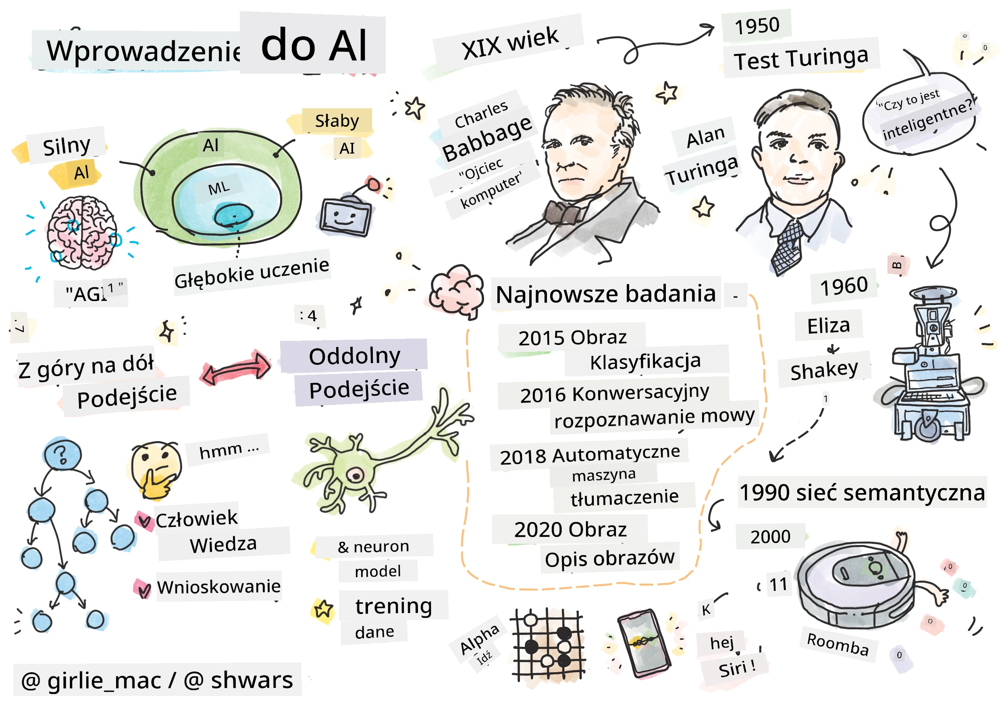
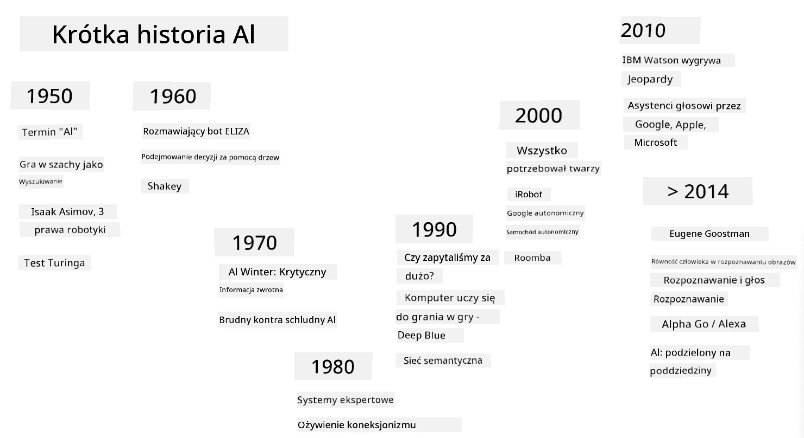
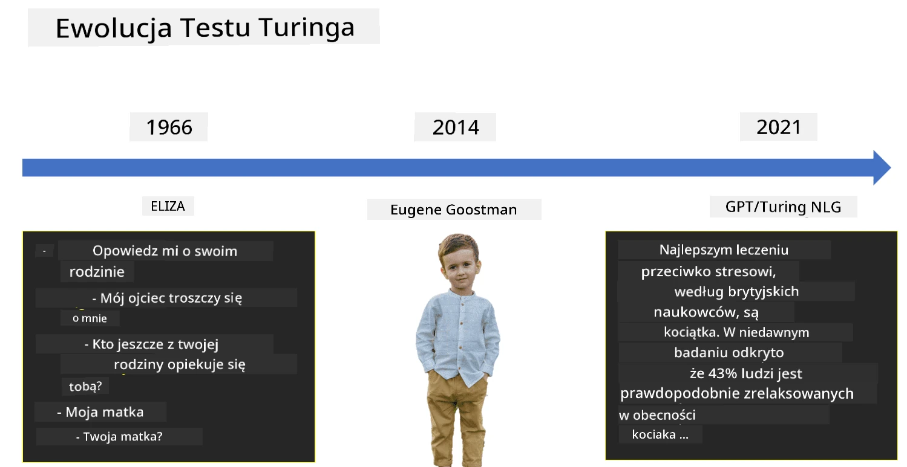

# Wprowadzenie do AI

> Rysunek odręczny autorstwa [Tomomi Imura](https://twitter.com/girlie_mac)

## [Quiz przed wykładem](https://ff-quizzes.netlify.app/en/ai/quiz/1)

**Sztuczna inteligencja** to ekscytująca dziedzina nauki, która bada, jak sprawić, by komputery wykazywały inteligentne zachowanie, np. wykonywały czynności, w których ludzie są dobrzy.

Pierwotnie komputery zostały wynalezione przez [Charlesa Babbage'a](https://en.wikipedia.org/wiki/Charles_Babbage), aby operować na liczbach zgodnie z dobrze zdefiniowaną procedurą – algorytmem. Współczesne komputery, choć znacznie bardziej zaawansowane niż pierwotny model zaproponowany w XIX wieku, nadal opierają się na tej samej idei kontrolowanych obliczeń. Dlatego możliwe jest zaprogramowanie komputera do wykonania czegoś, jeśli znamy dokładną sekwencję kroków potrzebnych do osiągnięcia celu.

> Zdjęcie autorstwa [Vickie Soshnikova](http://twitter.com/vickievalerie)

> ✅ Określenie wieku osoby na podstawie jej zdjęcia to zadanie, którego nie można zaprogramować wprost, ponieważ nie wiemy, jak w naszej głowie pojawia się liczba, gdy to robimy.

---

Są jednak zadania, których rozwiązania nie znamy wprost. Rozważmy określenie wieku osoby na podstawie jej zdjęcia. W jakiś sposób uczymy się to robić, ponieważ widzieliśmy wiele przykładów ludzi w różnym wieku, ale nie potrafimy dokładnie wyjaśnić, jak to robimy, ani zaprogramować komputera, aby to zrobił. To właśnie tego rodzaju zadania interesują **Sztuczną Inteligencję** (w skrócie AI).

✅ Pomyśl o zadaniach, które można by przekazać komputerowi, aby skorzystać z AI. Rozważ dziedziny takie jak finanse, medycyna i sztuka – jak te dziedziny korzystają dziś z AI?

## Słaba AI vs. Silna AI

Słaba AI | Silna AI
---------------------------------------|-------------------------------------
Słaba AI odnosi się do systemów AI zaprojektowanych i trenowanych do wykonywania określonego zadania lub wąskiego zestawu zadań.|Silna AI, czyli Ogólna Sztuczna Inteligencja (AGI), odnosi się do systemów AI o inteligencji i zrozumieniu na poziomie ludzkim.
Te systemy AI nie są ogólnie inteligentne; doskonale radzą sobie z wykonywaniem zdefiniowanego zadania, ale brakuje im prawdziwego zrozumienia lub świadomości.|Te systemy AI mają zdolność wykonywania dowolnych intelektualnych zadań, które może wykonać człowiek, adaptowania się do różnych dziedzin oraz posiadania formy świadomości lub samoświadomości.
Przykłady słabej AI to wirtualni asystenci, tacy jak Siri czy Alexa, algorytmy rekomendacji używane przez serwisy streamingowe oraz chatboty zaprojektowane do określonych zadań obsługi klienta.|Osiągnięcie Silnej AI jest długoterminowym celem badań nad AI i wymagałoby opracowania systemów AI, które potrafią rozumować, uczyć się, rozumieć i adaptować w szerokim zakresie zadań i kontekstów.
Słaba AI jest wysoce wyspecjalizowana i nie posiada zdolności poznawczych podobnych do ludzkich ani ogólnych zdolności rozwiązywania problemów poza swoją wąską dziedziną.|Silna AI jest obecnie koncepcją teoretyczną i żaden system AI nie osiągnął tego poziomu ogólnej inteligencji.

Więcej informacji znajdziesz w **[Ogólnej Sztucznej Inteligencji](https://en.wikipedia.org/wiki/Artificial_general_intelligence)** (AGI).

## Definicja inteligencji i test Turinga

Jednym z problemów związanych z terminem **[Inteligencja](https://en.wikipedia.org/wiki/Intelligence)** jest brak jasnej definicji tego pojęcia. Można argumentować, że inteligencja jest związana z **myśleniem abstrakcyjnym** lub **samoświadomością**, ale nie potrafimy jej właściwie zdefiniować.

> [Zdjęcie](https://unsplash.com/photos/75715CVEJhI) autorstwa [Amber Kipp](https://unsplash.com/@sadmax) z Unsplash

Aby zobaczyć niejednoznaczność terminu *inteligencja*, spróbuj odpowiedzieć na pytanie: "Czy kot jest inteligentny?". Różni ludzie mają tendencję do udzielania różnych odpowiedzi na to pytanie, ponieważ nie ma uniwersalnie akceptowanego testu, który mógłby udowodnić, że twierdzenie jest prawdziwe lub nie. A jeśli uważasz, że taki test istnieje – spróbuj przeprowadzić swojego kota przez test IQ...

✅ Zastanów się przez chwilę, jak definiujesz inteligencję. Czy wrona, która potrafi rozwiązać labirynt, aby dostać się do jedzenia, jest inteligentna? Czy dziecko jest inteligentne?

---

Mówiąc o AGI, musimy mieć jakiś sposób, aby stwierdzić, czy stworzyliśmy naprawdę inteligentny system. [Alan Turing](https://en.wikipedia.org/wiki/Alan_Turing) zaproponował sposób zwany **[Testem Turinga](https://en.wikipedia.org/wiki/Turing_test)**, który działa również jako definicja inteligencji. Test porównuje dany system z czymś z natury inteligentnym – prawdziwym człowiekiem, a ponieważ każde automatyczne porównanie może zostać obejście przez program komputerowy, używamy ludzkiego przesłuchującego. Jeśli człowiek nie jest w stanie odróżnić prawdziwej osoby od systemu komputerowego w dialogu tekstowym – system uznaje się za inteligentny.

> Chatbot o nazwie [Eugene Goostman](https://en.wikipedia.org/wiki/Eugene_Goostman), opracowany w Petersburgu, w 2014 roku prawie przeszedł test Turinga, stosując sprytny trik osobowości. Z góry ogłosił, że jest 13-letnim ukraińskim chłopcem, co tłumaczyłoby brak wiedzy i pewne rozbieżności w tekście. Bot przekonał 30% sędziów, że jest człowiekiem po 5-minutowym dialogu, co według Turinga maszyna powinna być w stanie osiągnąć do 2000 roku. Jednak należy zrozumieć, że nie oznacza to, że stworzyliśmy inteligentny system ani że system komputerowy oszukał ludzkiego przesłuchującego – system nie oszukał ludzi, ale raczej twórcy bota to zrobili!

✅ Czy kiedykolwiek chatbot oszukał Cię, że rozmawiasz z człowiekiem? Jak Cię przekonał?

## Różne podejścia do AI

Jeśli chcemy, aby komputer zachowywał się jak człowiek, musimy w jakiś sposób odwzorować w komputerze nasz sposób myślenia. W konsekwencji musimy spróbować zrozumieć, co sprawia, że człowiek jest inteligentny.

> Aby zaprogramować inteligencję w maszynie, musimy zrozumieć, jak działają nasze własne procesy podejmowania decyzji. Jeśli trochę się zastanowisz, zauważysz, że niektóre procesy zachodzą podświadomie – np. potrafimy odróżnić kota od psa bez zastanawiania się nad tym – podczas gdy inne wymagają rozumowania.

Istnieją dwa możliwe podejścia do tego problemu:

Podejście odgórne (symboliczne rozumowanie) | Podejście oddolne (sieci neuronowe)
---------------------------------------|-------------------------------------
Podejście odgórne modeluje sposób, w jaki człowiek rozumuje, aby rozwiązać problem. Polega na wydobywaniu **wiedzy** od człowieka i reprezentowaniu jej w formie czytelnej dla komputera. Musimy również opracować sposób modelowania **rozumowania** w komputerze. | Podejście oddolne modeluje strukturę ludzkiego mózgu, składającego się z ogromnej liczby prostych jednostek zwanych **neuronami**. Każdy neuron działa jak średnia ważona swoich wejść, a sieć neuronów można nauczyć rozwiązywania użytecznych problemów, dostarczając **dane treningowe**.

Istnieją również inne możliwe podejścia do inteligencji:

* **Emergentne**, **synergetyczne** lub **wieloczynnikowe podejście** opiera się na fakcie, że złożone inteligentne zachowanie może wynikać z interakcji dużej liczby prostych agentów. Według [cybernetyki ewolucyjnej](https://en.wikipedia.org/wiki/Global_brain#Evolutionary_cybernetics), inteligencja może *wyłaniać się* z prostszego, reaktywnego zachowania w procesie *przejścia do metasystemu*.

* **Podejście ewolucyjne**, czyli **algorytm genetyczny**, to proces optymalizacji oparty na zasadach ewolucji.

Rozważymy te podejścia później w kursie, ale teraz skupimy się na dwóch głównych kierunkach: odgórnym i oddolnym.

### Podejście odgórne

W **podejściu odgórnym** próbujemy modelować nasze rozumowanie. Ponieważ możemy śledzić nasze myśli podczas rozumowania, możemy spróbować sformalizować ten proces i zaprogramować go w komputerze. Nazywa się to **symbolicznym rozumowaniem**.

Ludzie mają tendencję do posiadania pewnych reguł w głowie, które kierują ich procesami podejmowania decyzji. Na przykład, gdy lekarz diagnozuje pacjenta, może zauważyć, że osoba ma gorączkę, a zatem może występować stan zapalny w organizmie. Stosując duży zestaw reguł do konkretnego problemu, lekarz może być w stanie postawić ostateczną diagnozę.

To podejście opiera się w dużej mierze na **reprezentacji wiedzy** i **rozumowaniu**. Wydobycie wiedzy od ludzkiego eksperta może być najtrudniejszą częścią, ponieważ lekarz w wielu przypadkach nie wie dokładnie, dlaczego dochodzi do konkretnej diagnozy. Czasami rozwiązanie po prostu pojawia się w jego głowie bez wyraźnego myślenia. Niektóre zadania, takie jak określenie wieku osoby na podstawie zdjęcia, w ogóle nie mogą być sprowadzone do manipulowania wiedzą.

### Podejście oddolne

Alternatywnie, możemy spróbować modelować najprostsze elementy w naszym mózgu – neuron. Możemy skonstruować tzw. **sztuczną sieć neuronową** w komputerze, a następnie próbować nauczyć ją rozwiązywania problemów, dostarczając jej przykłady. Ten proces jest podobny do tego, jak noworodek uczy się o swoim otoczeniu, dokonując obserwacji.

✅ Zrób małe badania na temat tego, jak uczą się niemowlęta. Jakie są podstawowe elementy mózgu dziecka?

> | A co z ML?         |      |
> |--------------|-----------|
> | Część Sztucznej Inteligencji, która opiera się na uczeniu komputera rozwiązywania problemu na podstawie danych, nazywa się **Uczeniem Maszynowym**. Nie będziemy rozważać klasycznego uczenia maszynowego w tym kursie – odsyłamy Cię do osobnego programu [Uczenie Maszynowe dla Początkujących](http://aka.ms/ml-beginners). |       |

## Krótka historia AI

Sztuczna Inteligencja jako dziedzina rozpoczęła się w połowie XX wieku. Początkowo podejście symboliczne było dominujące i doprowadziło do wielu ważnych sukcesów, takich jak systemy ekspertowe – programy komputerowe, które były w stanie działać jako ekspert w ograniczonych dziedzinach problemowych. Jednak szybko stało się jasne, że takie podejście nie jest skalowalne. Wydobycie wiedzy od eksperta, reprezentowanie jej w komputerze i utrzymanie tej bazy wiedzy w aktualności okazuje się bardzo złożonym zadaniem i zbyt kosztownym, aby było praktyczne w wielu przypadkach. Doprowadziło to do tzw. [Zimy AI](https://en.wikipedia.org/wiki/AI_winter) w latach 70.

> Obraz autorstwa [Dmitry Soshnikov](http://soshnikov.com)

Z czasem zasoby obliczeniowe stały się tańsze, a więcej danych stało się dostępnych, więc podejścia oparte na sieciach neuronowych zaczęły wykazywać świetne wyniki w rywalizacji z ludźmi w wielu dziedzinach, takich jak wizja komputerowa czy rozumienie mowy. W ostatniej dekadzie termin Sztuczna Inteligencja był najczęściej używany jako synonim sieci neuronowych, ponieważ większość sukcesów AI, o których słyszymy, opiera się na nich.

Możemy zaobserwować, jak zmieniały się podejścia, na przykład w tworzeniu programu komputerowego grającego w szachy:

* Wczesne programy szachowe opierały się na wyszukiwaniu – program explicite próbował oszacować możliwe ruchy przeciwnika dla określonej liczby kolejnych ruchów i wybierał optymalny ruch na podstawie optymalnej pozycji, którą można osiągnąć w kilku ruchach. Doprowadziło to do opracowania tzw. algorytmu wyszukiwania [alpha-beta pruning](https://en.wikipedia.org/wiki/Alpha%E2%80%93beta_pruning).
* Strategie wyszukiwania dobrze sprawdzają się pod koniec gry, gdzie przestrzeń wyszukiwania jest ograniczona przez niewielką liczbę możliwych ruchów. Jednak na początku gry przestrzeń wyszukiwania jest ogromna, a algorytm można poprawić, ucząc się na podstawie istniejących meczów między ludzkimi graczami. Kolejne eksperymenty wykorzystywały tzw. [rozumowanie oparte na przypadkach](https://en.wikipedia.org/wiki/Case-based_reasoning), gdzie program szukał przypadków w bazie wiedzy bardzo podobnych do obecnej pozycji w grze.
* Współczesne programy, które wygrywają z ludzkimi graczami, opierają się na sieciach neuronowych i [uczeniu przez wzmacnianie](https://en.wikipedia.org/wiki/Reinforcement_learning), gdzie programy uczą się grać wyłącznie poprzez długotrwałe granie przeciwko sobie i uczenie się na własnych błędach – podobnie jak ludzie uczą się grać w szachy. Jednak program komputerowy może rozegrać znacznie więcej gier w znacznie krótszym czasie, a zatem może uczyć się znacznie szybciej.

✅ Zrób małe badania na temat innych gier, w które grała AI.

Podobnie możemy zobaczyć, jak zmieniało się podejście do tworzenia „programów mówiących” (które mogłyby przejść test Turinga):

* Wczesne programy tego rodzaju, takie jak [Eliza](https://en.wikipedia.org/wiki/ELIZA), opierały się na bardzo prostych regułach gramatycznych i przekształcaniu zdania wejściowego w pytanie.
* Współczesne asystenty, takie jak Cortana, Siri czy Google Assistant, to hybrydowe systemy, które wykorzystują sieci neuronowe do konwersji mowy na tekst i rozpoznawania naszych intencji, a następnie stosują pewne rozumowanie lub explicite algorytmy do wykonywania wymaganych działań.
* W przyszłości możemy oczekiwać pełnego modelu opartego na sieciach neuronowych, który samodzielnie obsłuży dialog. Ostatnie sieci neuronowe GPT i [Turing-NLG](https://www.microsoft.com/research/blog/turing-nlg-a-17-billion-parameter-language-model-by-microsoft) wykazują wielkie sukcesy w tym zakresie.

> Obraz autorstwa Dmitry Soshnikov, [zdjęcie](https://unsplash.com/photos/r8LmVbUKgns) autorstwa [Mariny Abrosimovej](https://unsplash.com/@abrosimova_marina_foto), Unsplash

## Ostatnie badania nad sztuczną inteligencją

Ogromny wzrost badań nad sieciami neuronowymi rozpoczął się około 2010 roku, kiedy zaczęły być dostępne duże publiczne zbiory danych. Ogromna kolekcja obrazów o nazwie [ImageNet](https://en.wikipedia.org/wiki/ImageNet), zawierająca około 14 milionów oznaczonych obrazów, dała początek [ImageNet Large Scale Visual Recognition Challenge](https://image-net.org/challenges/LSVRC/).

> Obraz autorstwa [Dmitry Soshnikov](http://soshnikov.com)

W 2012 roku [konwolucyjne sieci neuronowe](../4-ComputerVision/07-ConvNets/README.md) zostały po raz pierwszy zastosowane w klasyfikacji obrazów, co doprowadziło do znacznego spadku błędów klasyfikacji (z prawie 30% do 16,4%). W 2015 roku architektura ResNet opracowana przez Microsoft Research [osiągnęła dokładność na poziomie ludzkim](https://doi.org/10.1109/ICCV.2015.123).

Od tego czasu sieci neuronowe wykazały bardzo skuteczne działanie w wielu zadaniach:

---

Rok | Osiągnięcie parytetu z człowiekiem
-----|--------
2015 | [Klasyfikacja obrazów](https://doi.org/10.1109/ICCV.2015.123)
2016 | [Rozpoznawanie mowy konwersacyjnej](https://arxiv.org/abs/1610.05256)
2018 | [Automatyczne tłumaczenie maszynowe](https://arxiv.org/abs/1803.05567) (z chińskiego na angielski)
2020 | [Opisywanie obrazów](https://arxiv.org/abs/2009.13682)

W ostatnich latach byliśmy świadkami ogromnych sukcesów dużych modeli językowych, takich jak BERT i GPT-3. Stało się to głównie dzięki temu, że dostępnych jest wiele ogólnych danych tekstowych, które pozwalają trenować modele w celu uchwycenia struktury i znaczenia tekstów, wstępnie trenować je na ogólnych zbiorach tekstów, a następnie specjalizować te modele do bardziej specyficznych zadań. Więcej o [przetwarzaniu języka naturalnego](../5-NLP/README.md) dowiemy się później w tym kursie.

## 🚀 Wyzwanie

Przeprowadź badanie w internecie, aby określić, gdzie Twoim zdaniem sztuczna inteligencja jest najskuteczniej wykorzystywana. Czy jest to aplikacja mapowa, usługa zamiany mowy na tekst, czy może gra wideo? Zbadaj, jak został zbudowany ten system.

## [Quiz po wykładzie](https://ff-quizzes.netlify.app/en/ai/quiz/2)

## Przegląd i samodzielna nauka

Przejrzyj historię AI i ML, czytając [tę lekcję](https://github.com/microsoft/ML-For-Beginners/tree/main/1-Introduction/2-history-of-ML). Wybierz element z notatki wizualnej na początku tej lekcji lub tej i zbadaj go bardziej szczegółowo, aby zrozumieć kontekst kulturowy, który wpłynął na jego rozwój.

**Zadanie**: [Game Jam](assignment.md)

---

<!-- CO-OP TRANSLATOR DISCLAIMER START -->
**Zastrzeżenie**:  
Ten dokument został przetłumaczony za pomocą usługi tłumaczenia AI [Co-op Translator](https://github.com/Azure/co-op-translator). Chociaż staramy się zapewnić dokładność, prosimy pamiętać, że automatyczne tłumaczenia mogą zawierać błędy lub nieścisłości. Oryginalny dokument w jego rodzimym języku powinien być uznawany za autorytatywne źródło. W przypadku informacji krytycznych zaleca się skorzystanie z profesjonalnego tłumaczenia przez człowieka. Nie ponosimy odpowiedzialności za jakiekolwiek nieporozumienia lub błędne interpretacje wynikające z użycia tego tłumaczenia.
<!-- CO-OP TRANSLATOR DISCLAIMER END -->