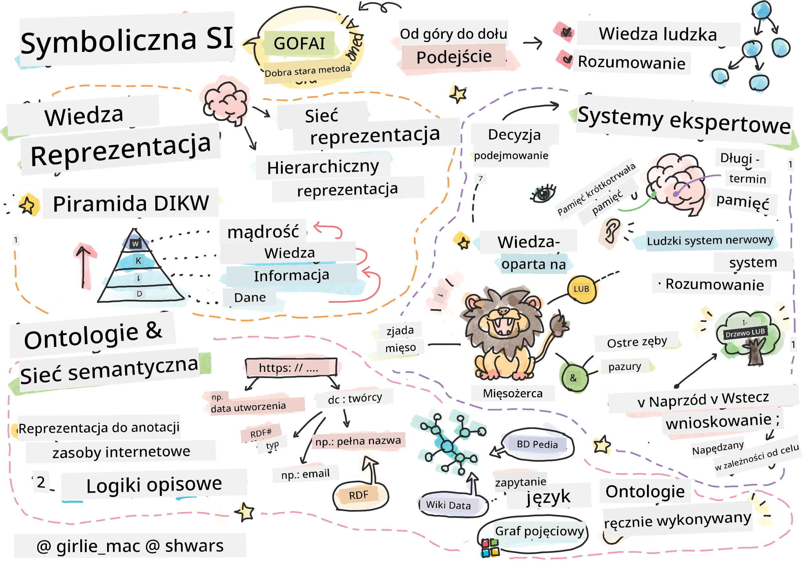
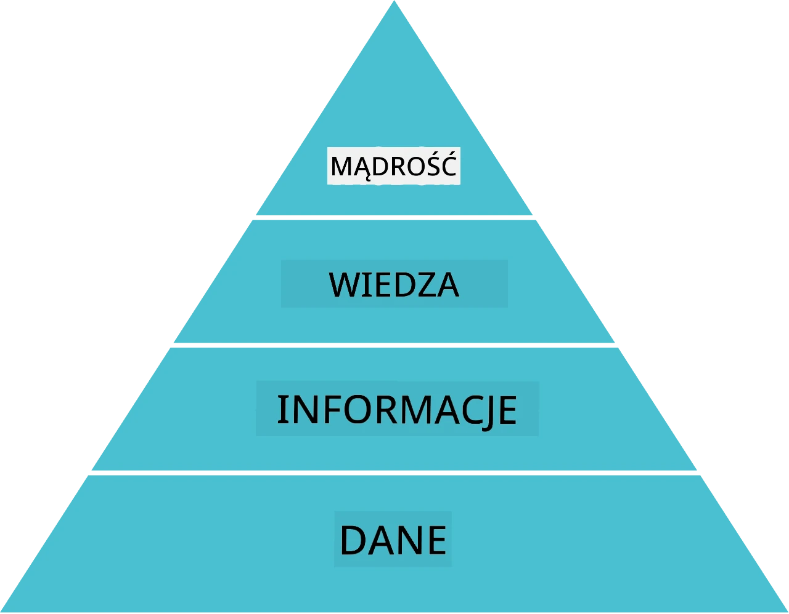
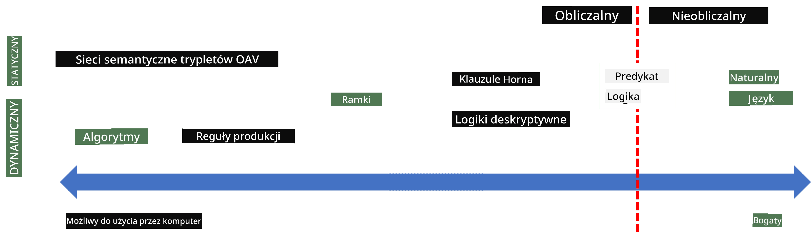
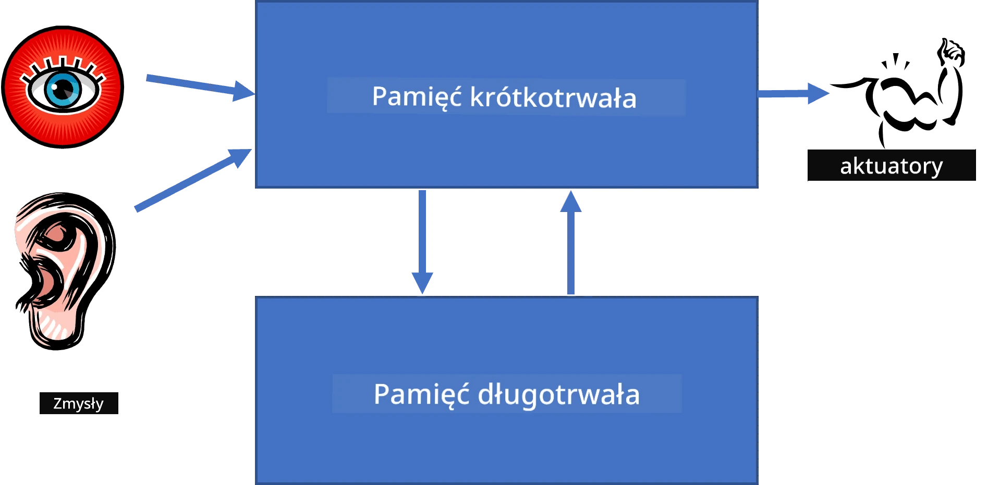
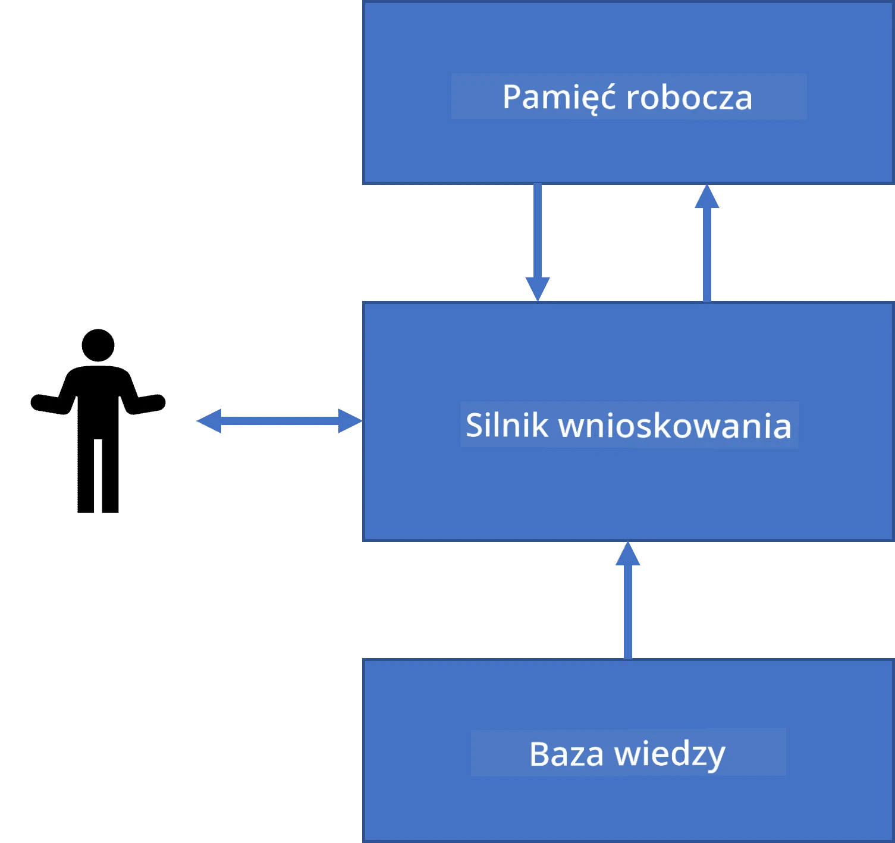
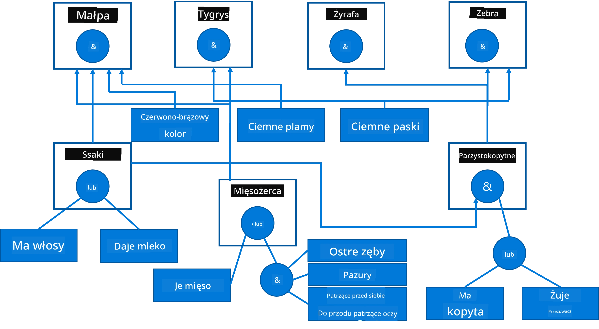
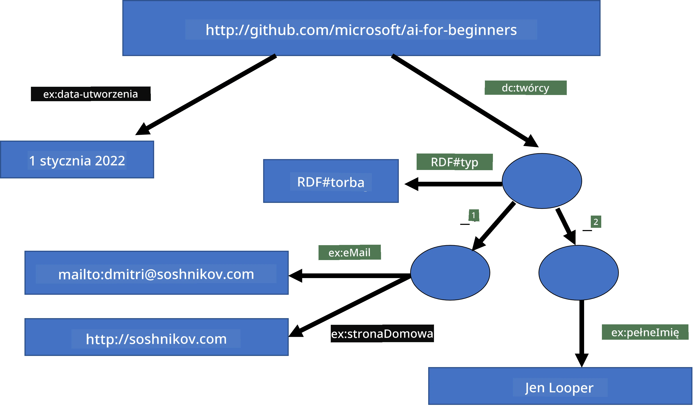
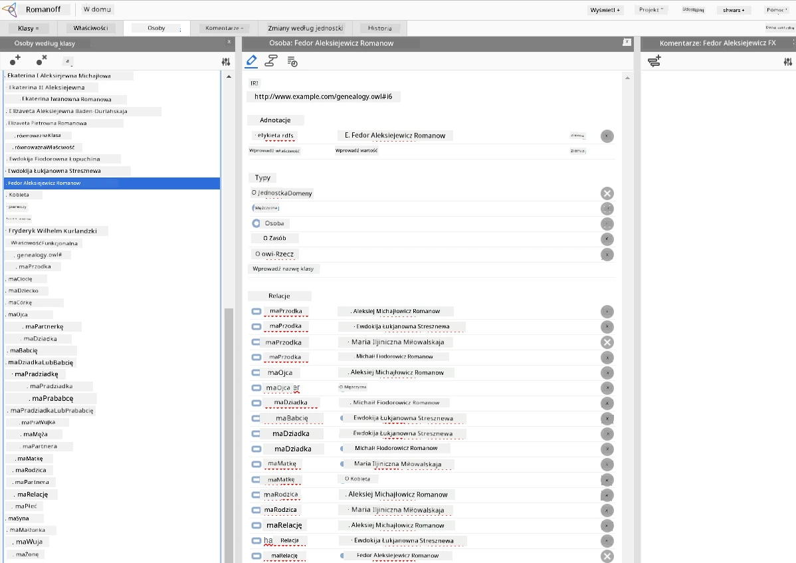

# Reprezentacja Wiedzy i Systemy Eksperckie



> Sketchnote autorstwa [Tomomi Imura](https://twitter.com/girlie_mac)

Poszukiwanie sztucznej inteligencji opiera się na dążeniu do wiedzy, aby rozumieć świat podobnie jak ludzie. Ale jak można to osiągnąć?

## [Quiz przed wykładem](https://ff-quizzes.netlify.app/en/ai/quiz/3)

Na początku rozwoju AI popularne było podejście odgórne do tworzenia inteligentnych systemów (omówione w poprzedniej lekcji). Chodziło o wydobycie wiedzy od ludzi do formy czytelnej dla maszyn, a następnie użycie jej do automatycznego rozwiązywania problemów. To podejście opierało się na dwóch głównych ideach:

* Reprezentacja wiedzy
* Wnioskowanie

## Reprezentacja wiedzy

Jednym z ważnych pojęć w Symbolicznej AI jest **wiedza**. Ważne jest, aby odróżnić wiedzę od *informacji* lub *danych*. Na przykład można powiedzieć, że książki zawierają wiedzę, ponieważ można studiować książki i stać się ekspertem. Jednak to, co książki zawierają, to w rzeczywistości *dane*, a przez czytanie książek i integrację tych danych z naszym modelem świata przekształcamy dane w wiedzę.

> ✅ **Wiedza** to coś, co jest zawarte w naszej głowie i reprezentuje nasze rozumienie świata. Otrzymujemy ją poprzez aktywny proces **uczenia się**, który integruje kawałki informacji, które otrzymujemy, z naszym aktywnym modelem świata.

Najczęściej nie definiujemy wiedzy ściśle, ale wyrównujemy ją z innymi pokrewnymi pojęciami za pomocą [piramidy DIKW](https://en.wikipedia.org/wiki/DIKW_pyramid). Zawiera ona następujące pojęcia:

* **Dane** to coś reprezentowanego w nośnikach fizycznych, takich jak tekst pisany lub słowa mówione. Dane istnieją niezależnie od ludzi i mogą być przekazywane między ludźmi.
* **Informacja** to sposób, w jaki interpretujemy dane w naszej głowie. Na przykład, kiedy słyszymy słowo *komputer*, mamy pewne pojęcie, czym on jest.
* **Wiedza** to informacja zintegrowana z naszym modelem świata. Na przykład, gdy nauczymy się, co to jest komputer, zaczynamy mieć pewne wyobrażenia o tym, jak działa, ile kosztuje i do czego można go używać. Ta sieć powiązanych pojęć tworzy naszą wiedzę.
* **Mądrość** to jeszcze jeden poziom naszego rozumienia świata i reprezentuje *meta-wiedzę*, np. pewne pojęcia o tym, jak i kiedy wiedza powinna być używana.



*Obraz [z Wikipedii](https://commons.wikimedia.org/w/index.php?curid=37705247), autor Longlivetheux - własna praca, na licencji CC BY-SA 4.0*

Problematyka **reprezentacji wiedzy** polega zatem na znalezieniu skutecznego sposobu przedstawienia wiedzy w komputerze w formie danych, aby mogła być automatycznie wykorzystywana. Można to zobaczyć jako spektrum:



> Obraz autorstwa [Dmitry Soshnikov](http://soshnikov.com)

* Po lewej stronie znajdują się bardzo proste typy reprezentacji wiedzy, które mogą być efektywnie używane przez komputery. Najprostszy to algorytmiczny, gdy wiedza jest reprezentowana przez program komputerowy. Nie jest to jednak najlepszy sposób reprezentacji wiedzy, ponieważ nie jest elastyczny. Wiedza w naszej głowie często nie jest algorytmiczna.
* Po prawej stronie są reprezentacje takie jak tekst naturalny. Jest on najsilniejszy, ale nie może być używany do automatycznego wnioskowania.

> ✅ Pomyśl przez moment o tym, jak reprezentujesz wiedzę w swojej głowie i przekształcasz ją w notatki. Czy istnieje jakiś konkretny format, który dobrze Ci służy, pomagając w zapamiętywaniu?

## Klasyfikacja reprezentacji wiedzy w komputerach

Możemy klasyfikować różne metody komputerowej reprezentacji wiedzy w następujące kategorie:

* **Reprezentacje sieciowe** opierają się na fakcie, że mamy sieć powiązanych ze sobą pojęć w naszej głowie. Możemy spróbować odtworzyć takie same sieci jako graf w komputerze - tzw. **sieć semantyczną**.

1. **Trójki obiekt-atrybut-wartość** lub **pary atrybut-wartość**. Ponieważ graf może być reprezentowany w komputerze jako lista węzłów i krawędzi, możemy przedstawić sieć semantyczną jako listę trójek, zawierających obiekty, atrybuty i wartości. Na przykład budujemy następujące trójki dotyczące języków programowania:

Obiekt | Atrybut | Wartość
-------|---------|--------
Python | jest | językiem nie typowanym
Python | wynalazł | Guido van Rossum
Python | składnia bloku | wcięcia
język nie typowany | nie ma | definicji typów

> ✅ Pomyśl, jak trójki mogą być użyte do reprezentacji innych typów wiedzy.

2. **Reprezentacje hierarchiczne** podkreślają fakt, że często tworzymy w hierarchię obiektów w naszej głowie. Na przykład wiemy, że kanarek to ptak, a wszystkie ptaki mają skrzydła. Mamy także pewne pojęcie o kolorze kanarka i prędkości jego lotu.

   - **Reprezentacja ramowa** opiera się na reprezentowaniu każdego obiektu lub klasy obiektów jako **ramki**, która zawiera **sloty**. Sloty mają możliwe domyślne wartości, ograniczenia wartości lub przechowywane procedury, które można wywołać, by uzyskać wartość slotu. Wszystkie ramki tworzą hierarchię podobną do hierarchii obiektów w programowaniu obiektowym.
   - **Scenariusze** to specjalny rodzaj ramek, które reprezentują złożone sytuacje rozwijające się w czasie.

**Python**

Slot | Wartość | Wartość domyślna | Przedział |
-----|---------|------------------|-----------|
Nazwa | Python | | |
Jest | Język nie typowany | | |
Styl zapisu zmiennych | | CamelCase | |
Długość programu | | | 5-5000 linii |
Składnia bloku | Wcięcie | | |

3. **Reprezentacje proceduralne** opierają się na reprezentowaniu wiedzy jako listy działań, które mogą zostać wykonane, gdy zajdzie określony warunek.
   - Reguły produkcji to instrukcje typu jeśli-to, które pozwalają nam wyciągać wnioski. Na przykład lekarz może mieć regułę mówiącą, że **JEŚLI** pacjent ma wysoką gorączkę **LUB** wysoki poziom białka C-reaktywnego w badaniu krwi, **TO** ma zapalenie. Po spełnieniu jednego z warunków możemy wyciągnąć wniosek o zapaleniu i wykorzystać go w dalszym wnioskowaniu.
   - Algorytmy można również uznać za formę reprezentacji proceduralnej, chociaż prawie nigdy nie są one używane bezpośrednio w systemach opartych na wiedzy.

4. **Logika** została pierwotnie zaproponowana przez Arystotelesa jako sposób reprezentacji uniwersalnej wiedzy ludzkiej.
   - Logika predykatów jako teoria matematyczna jest zbyt bogata, by była obliczalna, dlatego zwykle używa się jej podzbioru, jak np. klauzule Horna używane w Prologu.
   - Logika opisowa (Descriptive Logic) to rodzina systemów logicznych używanych do reprezentacji i wnioskowania o hierarchiach obiektów oraz rozproszonych reprezentacjach wiedzy, takich jak *semantyczny web*.

## Systemy eksperckie

Jednym z wczesnych sukcesów symbolicznej AI były tzw. **systemy eksperckie** - systemy komputerowe zaprojektowane do działania jako ekspert w ograniczonym obszarze problemowym. Opierały się na **bazie wiedzy** wydobytej od jednego lub więcej ekspertów oraz zawierały **silnik wnioskowania**, który wykonywał pewne rozumowania na jej podstawie.

 | 
---------------------------------------------|------------------------------------------------
Uproszczona struktura ludzkiego systemu nerwowego | Architektura systemu opartego na wiedzy

Systemy eksperckie są budowane na wzór ludzkiego systemu rozumowania, który zawiera **pamięć krótkotrwałą** oraz **pamięć długotrwałą**. Podobnie w systemach opartych na wiedzy wyróżniamy następujące komponenty:

* **Pamięć problemu**: zawiera wiedzę o problemie aktualnie rozwiązywanym, np. temperaturę lub ciśnienie krwi pacjenta, czy ma zapalenie czy nie itd. Ta wiedza jest również nazywana **wiedzą statyczną**, ponieważ zawiera migawkę tego, co aktualnie wiemy o problemie – tzw. *stan problemu*.
* **Baza wiedzy**: reprezentuje wiedzę długotrwałą o dziedzinie problemu. Jest ręcznie wydobywana od ekspertów i nie zmienia się podczas kolejnych konsultacji. Ponieważ umożliwia przejście z jednego stanu problemu do drugiego, nazywana jest także **wiedzą dynamiczną**.
* **Silnik wnioskowania**: koordynuje cały proces przeszukiwania przestrzeni stanów problemu, zadaje pytania użytkownikowi w razie potrzeby. Odpowiada również za wybór odpowiednich reguł, które zostaną zastosowane w każdym stanie.

Na przykład rozważmy system ekspercki do identyfikacji zwierzęcia na podstawie jego cech fizycznych:



> Obraz autorstwa [Dmitry Soshnikov](http://soshnikov.com)

Ten diagram nazywa się **drzewem AND-OR** i jest graficzna reprezentacją zestawu reguł produkcji. Rysowanie drzewa jest przydatne na początku wydobywania wiedzy od eksperta. Do reprezentacji wiedzy wewnątrz komputera wygodniej jest używać reguł:

```
IF the animal eats meat
OR (animal has sharp teeth
    AND animal has claws
    AND animal has forward-looking eyes
) 
THEN the animal is a carnivore
```

Możesz zauważyć, że każdy warunek po lewej stronie reguły oraz akcja to właściwie trójki obiekt-atrybut-wartość (OAV). **Pamięć robocza** zawiera zestaw trójek OAV odpowiadających aktualnie rozwiązywanemu problemowi. **Silnik reguł** szuka reguł, których warunek jest spełniony i je stosuje, dodając kolejną trójkę do pamięci roboczej.

> ✅ Napisz swoje własne drzewo AND-OR na dowolny temat, który lubisz!

### Wnioskowanie w przód vs. wnioskowanie w tył

Opisany powyżej proces nazywa się **wnioskowaniem w przód**. Zaczyna się od pewnych danych początkowych o problemie dostępnych w pamięci roboczej, a następnie wykonuje następującą pętlę rozumowania:

1. Jeśli atrybut docelowy jest obecny w pamięci roboczej – zatrzymaj się i podaj wynik
2. Szukaj wszystkich reguł, których warunek jest obecnie spełniony – otrzymaj **zbiór konfliktu** reguł
3. Wykonaj **rozstrzyganie konfliktów** – wybierz jedną regułę, która zostanie wykonana na tym kroku. Mogą być różne strategie rozstrzygania konfliktów:
   - Wybierz pierwszą pasującą regułę w bazie wiedzy
   - Wybierz losową regułę
   - Wybierz *bardziej specyficzną* regułę, czyli tę, która spełnia najwięcej warunków po lewej stronie (LHS)
4. Zastosuj wybraną regułę i wstaw nowy element wiedzy do stanu problemu
5. Powtarzaj od kroku 1.

W niektórych przypadkach możemy chcieć zacząć z pustą wiedzą o problemie i zadawać pytania, które pomogą nam dojść do wniosku. Na przykład podczas diagnozy medycznej zwykle nie wykonujemy wszystkich badań przed rozpoczęciem diagnozy pacjenta. Raczej chcemy wykonać badania, gdy decyzja musi zostać podjęta.

Proces ten można modelować za pomocą **wnioskowania w tył**. Jest on napędzany przez **cel** – wartość atrybutu, której szukamy:

1. Wybierz wszystkie reguły, które mogą nam dać wartość celu (czyli z celem po prawej stronie ("right-hand-side")) – zbiór konfliktu
1. Jeśli nie ma reguł dla tego atrybutu albo jest reguła mówiąca, że powinniśmy zapytać użytkownika o tę wartość – zapytaj, w przeciwnym razie:
1. Użyj strategii rozstrzygania konfliktów, aby wybrać jedną regułę, której użyjemy jako *hipotezy* – spróbujemy ją udowodnić
1. Rekurencyjnie powtarzaj proces dla wszystkich atrybutów po lewej stronie reguły, próbując udowodnić je jako cele
1. Jeśli w dowolnym momencie proces zawiedzie – użyj innej reguły w kroku 3.

> ✅ W jakich sytuacjach wnioskowanie w przód jest bardziej odpowiednie? A kiedy wnioskowanie w tył?

### Implementacja systemów eksperckich

Systemy eksperckie można implementować przy użyciu różnych narzędzi:

* Programowanie ich bezpośrednio w wysokopoziomowym języku programowania. Nie jest to najlepszy pomysł, ponieważ główną zaletą systemu opartego na wiedzy jest oddzielenie wiedzy od wnioskowania, i potencjalnie ekspert z danej dziedziny powinien móc pisać reguły bez rozumienia szczegółów procesu wnioskowania.
* Używanie **powłoki systemu eksperckiego**, czyli systemu specjalnie zaprojektowanego do wypełniania wiedzą przy użyciu jakiegoś języka reprezentacji wiedzy.

## ✍️ Ćwiczenie: wnioskowanie o zwierzętach

Zobacz [Animals.ipynb](https://github.com/microsoft/AI-For-Beginners/blob/main/lessons/2-Symbolic/Animals.ipynb) jako przykład implementacji systemu ekspertowego wnioskowania w przód i w tył.

> **Uwaga**: Ten przykład jest dość prosty i jedynie pokazuje, jak wygląda system ekspercki. Gdy zaczniesz tworzyć taki system, zauważysz *inteligentne* zachowanie dopiero po osiągnięciu pewnej liczby reguł, około 200+. W pewnym momencie reguły stają się zbyt skomplikowane, by pamiętać je wszystkie, i wtedy możesz zacząć się zastanawiać, dlaczego system podejmuje określone decyzje. Jednak ważną cechą systemów opartych na wiedzy jest to, że zawsze możesz *wyjaśnić* dokładnie, jak podjęto jakąkolwiek decyzję.

## Ontologie i Semantyczny Web

Pod koniec XX wieku zainicjowano inicjatywę wykorzystania reprezentacji wiedzy do oznaczania zasobów internetowych, tak aby można było łatwo znaleźć zasoby odpowiadające bardzo specyficznym zapytaniom. Ruch ten nazwano **Semantycznym Webem** i opierał się na kilku koncepcjach:

- Specjalna reprezentacja wiedzy bazująca na **[logikach opisowych](https://en.wikipedia.org/wiki/Description_logic)** (DL). Jest podobna do reprezentacji ramowej, ponieważ buduje hierarchię obiektów z właściwościami, ale ma formalną semantykę logiczną i wnioskowanie. Istnieje cała rodzina DL, które wyważają ekspresywność i algorytmiczną złożoność wnioskowania.
- Rozproszona reprezentacja wiedzy, gdzie wszystkie pojęcia są reprezentowane przez globalne identyfikatory URI, co umożliwia tworzenie hierarchii wiedzy obejmującej cały internet.
- Rodzina języków opartych na XML do opisu wiedzy: RDF (Resource Description Framework), RDFS (RDF Schema), OWL (Ontology Web Language).

Kluczowym pojęciem w Semantic Web jest pojęcie **Ontologii**. Odnosi się ono do jednoznacznej specyfikacji dziedziny problemowej z użyciem formalnej reprezentacji wiedzy. Najprostsza ontologia może być tylko hierarchią obiektów w dziedzinie problemu, ale bardziej złożone ontologie będą zawierać reguły, które mogą być używane do wnioskowania.

W semantic web wszystkie reprezentacje oparte są na trójkach. Każdy obiekt i każda relacja są jednoznacznie identyfikowane przez URI. Na przykład, jeśli chcemy stwierdzić fakt, że ten AI Curriculum został opracowany przez Dmitry'ego Soshnikova 1 stycznia 2022 - oto trójki, które możemy użyć:


```
http://github.com/microsoft/ai-for-beginners http://www.example.com/terms/creation-date “Jan 1, 2022”
http://github.com/microsoft/ai-for-beginners http://purl.org/dc/elements/1.1/creator http://soshnikov.com
```

> ✅ Tutaj `http://www.example.com/terms/creation-date` i `http://purl.org/dc/elements/1.1/creator` to dobrze znane i powszechnie akceptowane URI do wyrażenia pojęć *twórca* i *data utworzenia*.

W bardziej skomplikowanym przypadku, jeśli chcemy zdefiniować listę twórców, możemy użyć struktur danych zdefiniowanych w RDF.



> Diagramy powyżej autorstwa [Dmitry Soshnikov](http://soshnikov.com)

Postęp w budowie Semantic Web został częściowo spowolniony przez sukces wyszukiwarek i technik przetwarzania języka naturalnego, które pozwalają wydobywać ustrukturyzowane dane z tekstu. Jednak w niektórych obszarach nadal podejmuje się znaczne wysiłki w utrzymaniu ontologii i baz wiedzy. Kilka projektów wartych uwagi:

* [WikiData](https://wikidata.org/) to zbiór maszynowo odczytywalnych baz wiedzy powiązanych z Wikipedią. Większość danych pozyskiwana jest z Wikipedia *InfoBoxes*, fragmentów ustrukturyzowanej zawartości na stronach Wikipedii. Można [zapytaniać](https://query.wikidata.org/) wikidatę w SPARQL, specjalnym języku zapytań dla Semantic Web. Oto przykładowe zapytanie wyświetlające najpopularniejsze kolory oczu wśród ludzi:

```sparql
#defaultView:BubbleChart
SELECT ?eyeColorLabel (COUNT(?human) AS ?count)
WHERE
{
  ?human wdt:P31 wd:Q5.       # human instance-of homo sapiens
  ?human wdt:P1340 ?eyeColor. # human eye-color ?eyeColor
  SERVICE wikibase:label { bd:serviceParam wikibase:language "en". }
}
GROUP BY ?eyeColorLabel
```

* [DBpedia](https://www.dbpedia.org/) to kolejny podobny projekt do WikiData.

> ✅ Jeśli chcesz eksperymentować z tworzeniem własnych ontologii lub otwieraniem istniejących, jest świetny wizualny edytor ontologii o nazwie [Protégé](https://protege.stanford.edu/). Pobierz go lub użyj online.



*Edytor Web Protégé otwarty na ontologii Rodziny Romanowów. Zrzut ekranu Dmitry Soshnikov*

## ✍️ Ćwiczenie: Ontologia Rodziny

Zobacz [FamilyOntology.ipynb](https://github.com/Ezana135/AI-For-Beginners/blob/main/lessons/2-Symbolic/FamilyOntology.ipynb) jako przykład wykorzystania technik Semantic Web do rozumowania o relacjach rodzinnych. Weźmiemy drzewo genealogiczne reprezentowane w popularnym formacie GEDCOM oraz ontologię relacji rodzinnych i zbudujemy graf wszystkich relacji rodzinnych dla wskazanego zestawu osób.

## Microsoft Concept Graph

W większości przypadków ontologie są starannie tworzone ręcznie. Możliwe jest jednak także **wydobywanie** ontologii z danych nieustrukturyzowanych, na przykład z tekstów w języku naturalnym.

Jednym z takich przedsięwzięć było Microsoft Research, które zaowocowało [Microsoft Concept Graph](https://blogs.microsoft.com/ai/microsoft-researchers-release-graph-that-helps-machines-conceptualize/?WT.mc_id=academic-77998-cacaste).

Jest to duży zbiór bytów pogrupowanych za pomocą relacji dziedziczenia `is-a`. Pozwala na odpowiadanie na pytania takie jak „Czym jest Microsoft?” – odpowiedzią może być coś w stylu „firma z prawdopodobieństwem 0.87 oraz marka z prawdopodobieństwem 0.75”.

Graf jest dostępny albo jako REST API, albo jako duży plik tekstowy do pobrania, który wymienia wszystkie pary bytów.

## ✍️ Ćwiczenie: Graf Pojęć

Wypróbuj notatnik [MSConceptGraph.ipynb](https://github.com/microsoft/AI-For-Beginners/blob/main/lessons/2-Symbolic/MSConceptGraph.ipynb), aby zobaczyć, jak możemy wykorzystać Microsoft Concept Graph do grupowania artykułów informacyjnych na kilka kategorii.

## Podsumowanie

W dzisiejszych czasach AI często jest uważana za synonim *uczenia maszynowego* lub *sieci neuronowych*. Jednak człowiek wykazuje także jawne rozumowanie, czego obecnie sieci neuronowe nie potrafią obsłużyć. W projektach rzeczywistych jawne rozumowanie jest nadal używane do wykonywania zadań wymagających wyjaśnień lub do możliwość kontrolowanego modyfikowania zachowania systemu.

## 🚀 Wyzwanie

W notatniku Ontologii Rodziny powiązanym z tą lekcją jest możliwość eksperymentowania z innymi relacjami rodzinnymi. Spróbuj odkryć nowe powiązania między osobami w drzewie genealogicznym.

## [Quiz po wykładzie](https://ff-quizzes.netlify.app/en/ai/quiz/4)

## Przegląd i samodzielna nauka

Zrób trochę badań w internecie, aby odkryć obszary, w których ludzie próbowali kwantyfikować i kodyfikować wiedzę. Spójrz na taksonomię Blooma oraz cofnij się w historii, aby poznać, jak ludzie próbowali zrozumieć świat. Zbadaj pracę Linneusza tworzącego taksonomię organizmów i obserwuj, jak Dmitrij Mendelejew stworzył system opisu i grupowania pierwiastków chemicznych. Jakie inne ciekawe przykłady możesz znaleźć?

**Zadanie**: [Zbuduj Ontologię](assignment.md)

---

<!-- CO-OP TRANSLATOR DISCLAIMER START -->
**Zastrzeżenie**:
Niniejszy dokument został przetłumaczony przy użyciu usługi tłumaczenia AI [Co-op Translator](https://github.com/Azure/co-op-translator). Chociaż dążymy do dokładności, prosimy pamiętać, że automatyczne tłumaczenia mogą zawierać błędy lub niedokładności. Oryginalny dokument w języku źródłowym należy traktować jako źródło wiążące. W przypadku informacji krytycznych zaleca się skorzystanie z profesjonalnego tłumaczenia wykonanego przez człowieka. Nie ponosimy odpowiedzialności za jakiekolwiek nieporozumienia lub błędne interpretacje wynikające z korzystania z tego tłumaczenia.
<!-- CO-OP TRANSLATOR DISCLAIMER END -->