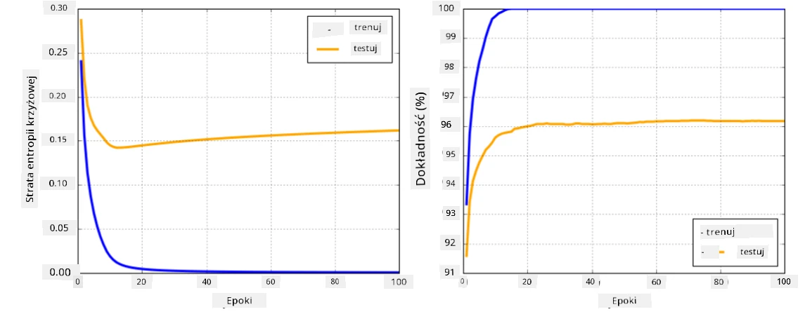

# Frameworky Sieci Neuronowych

Jak już się nauczyliśmy, aby efektywnie trenować sieci neuronowe, musimy zrobić dwie rzeczy:

* Operować na tensorach, np. mnożyć, dodawać i obliczać funkcje takie jak sigmoid czy softmax
* Obliczać gradienty wszystkich wyrażeń, aby przeprowadzać optymalizację metodą gradientu prostego

## [Quiz przed wykładem](https://ff-quizzes.netlify.app/en/ai/quiz/9)

Biblioteka `numpy` może zrealizować pierwszy punkt, ale potrzebujemy mechanizmu do obliczania gradientów. W [naszym frameworku](../04-OwnFramework/OwnFramework.ipynb), który opracowaliśmy w poprzedniej sekcji, musieliśmy ręcznie programować wszystkie funkcje pochodne w metodzie `backward`, która wykonuje propagację wsteczną. Idealnie byłoby, gdyby framework umożliwiał obliczanie gradientów *dowolnego wyrażenia*, które możemy zdefiniować.

Kolejną ważną rzeczą jest możliwość wykonywania obliczeń na GPU lub innych wyspecjalizowanych jednostkach obliczeniowych, takich jak [TPU](https://en.wikipedia.org/wiki/Tensor_Processing_Unit). Trenowanie głębokich sieci neuronowych wymaga *bardzo dużej* ilości obliczeń, a możliwość ich równoległego wykonywania na GPU jest niezwykle istotna.

> ✅ Termin 'równoległość' oznacza rozdzielenie obliczeń na wiele urządzeń.

Obecnie dwa najpopularniejsze frameworki sieci neuronowych to: [TensorFlow](http://TensorFlow.org) i [PyTorch](https://pytorch.org/). Oba oferują niskopoziomowe API do operowania na tensorach zarówno na CPU, jak i GPU. Na bazie niskopoziomowego API istnieje również wyższy poziom API, zwany odpowiednio [Keras](https://keras.io/) i [PyTorch Lightning](https://pytorchlightning.ai/).

Niskopoziomowe API | [TensorFlow](http://TensorFlow.org) | [PyTorch](https://pytorch.org/)
-------------------|-------------------------------------|--------------------------------
Wysokopoziomowe API| [Keras](https://keras.io/) | [PyTorch Lightning](https://pytorchlightning.ai/)

**Niskopoziomowe API** w obu frameworkach pozwala na budowanie tzw. **grafów obliczeniowych**. Graf ten definiuje, jak obliczyć wynik (zazwyczaj funkcję straty) dla danych wejściowych i może być przesłany do obliczeń na GPU, jeśli jest dostępne. Istnieją funkcje do różniczkowania tego grafu obliczeniowego i obliczania gradientów, które mogą być następnie użyte do optymalizacji parametrów modelu.

**Wysokopoziomowe API** traktuje sieci neuronowe jako **sekwencję warstw**, co znacznie ułatwia konstruowanie większości sieci neuronowych. Trenowanie modelu zazwyczaj wymaga przygotowania danych, a następnie wywołania funkcji `fit`, która wykonuje całą pracę.

Wysokopoziomowe API pozwala na szybkie konstruowanie typowych sieci neuronowych bez konieczności martwienia się o wiele szczegółów. Z kolei niskopoziomowe API daje dużo większą kontrolę nad procesem trenowania, dlatego jest często używane w badaniach, gdy pracujemy z nowymi architekturami sieci neuronowych.

Warto również zrozumieć, że oba API można używać razem, np. można opracować własną architekturę warstwy sieci za pomocą niskopoziomowego API, a następnie użyć jej w większej sieci skonstruowanej i trenowanej za pomocą wysokopoziomowego API. Można też zdefiniować sieć za pomocą wysokopoziomowego API jako sekwencję warstw, a następnie użyć własnej pętli trenowania na niskim poziomie do optymalizacji. Oba API opierają się na tych samych podstawowych koncepcjach i są zaprojektowane tak, aby dobrze ze sobą współpracować.

## Nauka

W tym kursie oferujemy większość treści zarówno dla PyTorch, jak i TensorFlow. Możesz wybrać preferowany framework i przejść tylko przez odpowiednie notatniki. Jeśli nie jesteś pewien, który framework wybrać, przeczytaj dyskusje w internecie na temat **PyTorch vs. TensorFlow**. Możesz również zapoznać się z oboma frameworkami, aby lepiej je zrozumieć.

Tam, gdzie to możliwe, będziemy używać wysokopoziomowych API dla uproszczenia. Jednak uważamy, że ważne jest zrozumienie, jak działają sieci neuronowe od podstaw, dlatego na początku pracujemy z niskopoziomowym API i tensorami. Jeśli jednak chcesz szybko zacząć i nie chcesz poświęcać dużo czasu na naukę tych szczegółów, możesz je pominąć i przejść od razu do notatników z wysokopoziomowym API.

## ✍️ Ćwiczenia: Frameworki

Kontynuuj naukę w następujących notatnikach:

Niskopoziomowe API | [TensorFlow+Keras Notebook](IntroKerasTF.ipynb) | [PyTorch](IntroPyTorch.ipynb)
-------------------|-------------------------------------|--------------------------------
Wysokopoziomowe API| [Keras](IntroKeras.ipynb) | *PyTorch Lightning*

Po opanowaniu frameworków, przypomnijmy sobie pojęcie nadmiernego dopasowania.

# Nadmierne dopasowanie (Overfitting)

Nadmierne dopasowanie to niezwykle ważne pojęcie w uczeniu maszynowym i bardzo ważne jest, aby je dobrze zrozumieć!

Rozważmy następujący problem aproksymacji 5 punktów (reprezentowanych przez `x` na poniższych wykresach):

 | 
-------------------------|--------------------------
**Model liniowy, 2 parametry** | **Model nieliniowy, 7 parametrów**
Błąd treningowy = 5.3 | Błąd treningowy = 0
Błąd walidacyjny = 5.1 | Błąd walidacyjny = 20

* Po lewej widzimy dobrą aproksymację prostą linią. Ponieważ liczba parametrów jest odpowiednia, model dobrze oddaje rozkład punktów.
* Po prawej model jest zbyt potężny. Ponieważ mamy tylko 5 punktów, a model ma 7 parametrów, może dostosować się tak, aby przechodzić przez wszystkie punkty, co sprawia, że błąd treningowy wynosi 0. Jednak uniemożliwia to modelowi zrozumienie właściwego wzorca w danych, przez co błąd walidacyjny jest bardzo wysoki.

Bardzo ważne jest znalezienie odpowiedniej równowagi między złożonością modelu (liczbą parametrów) a liczbą próbek treningowych.

## Dlaczego występuje nadmierne dopasowanie

  * Zbyt mało danych treningowych
  * Zbyt potężny model
  * Zbyt dużo szumu w danych wejściowych

## Jak wykryć nadmierne dopasowanie

Jak widać na powyższym wykresie, nadmierne dopasowanie można wykryć po bardzo niskim błędzie treningowym i wysokim błędzie walidacyjnym. Zazwyczaj podczas treningu widzimy, że zarówno błędy treningowe, jak i walidacyjne zaczynają się zmniejszać, a następnie w pewnym momencie błąd walidacyjny może przestać się zmniejszać i zacząć rosnąć. To będzie oznaka nadmiernego dopasowania i wskazówka, że powinniśmy prawdopodobnie zatrzymać trening w tym momencie (lub przynajmniej zrobić migawkę modelu).

## Jak zapobiegać nadmiernemu dopasowaniu

Jeśli zauważysz, że występuje nadmierne dopasowanie, możesz zrobić jedno z poniższych:

 * Zwiększyć ilość danych treningowych
 * Zmniejszyć złożoność modelu
 * Zastosować technikę [regularizacji](../../4-ComputerVision/08-TransferLearning/TrainingTricks.md), taką jak [Dropout](../../4-ComputerVision/08-TransferLearning/TrainingTricks.md#Dropout), którą omówimy później.

## Nadmierne dopasowanie a kompromis między błędem uprzedzenia a błędem wariancji

Nadmierne dopasowanie jest w rzeczywistości przypadkiem bardziej ogólnego problemu w statystyce, zwanego [kompromisem między błędem uprzedzenia a błędem wariancji](https://en.wikipedia.org/wiki/Bias%E2%80%93variance_tradeoff). Jeśli rozważymy możliwe źródła błędu w naszym modelu, możemy wyróżnić dwa typy błędów:

* **Błędy uprzedzenia** wynikają z tego, że nasz algorytm nie jest w stanie poprawnie uchwycić relacji między danymi treningowymi. Może to wynikać z faktu, że nasz model nie jest wystarczająco potężny (**niedopasowanie**).
* **Błędy wariancji**, które wynikają z tego, że model aproksymuje szum w danych wejściowych zamiast znaczącej relacji (**nadmierne dopasowanie**).

Podczas treningu błąd uprzedzenia maleje (gdy nasz model uczy się aproksymować dane), a błąd wariancji rośnie. Ważne jest, aby zatrzymać trening - albo ręcznie (gdy wykryjemy nadmierne dopasowanie), albo automatycznie (poprzez wprowadzenie regularizacji) - aby zapobiec nadmiernemu dopasowaniu.

## Podsumowanie

W tej lekcji dowiedziałeś się o różnicach między różnymi API dla dwóch najpopularniejszych frameworków AI, TensorFlow i PyTorch. Ponadto dowiedziałeś się o bardzo ważnym temacie, jakim jest nadmierne dopasowanie.

## 🚀 Wyzwanie

W dołączonych notatnikach znajdziesz 'zadania' na końcu; przejdź przez notatniki i wykonaj zadania.

## [Quiz po wykładzie](https://ff-quizzes.netlify.app/en/ai/quiz/10)

## Przegląd i samodzielna nauka

Zrób badania na następujące tematy:

- TensorFlow
- PyTorch
- Nadmierne dopasowanie

Zadaj sobie następujące pytania:

- Jaka jest różnica między TensorFlow a PyTorch?
- Jaka jest różnica między nadmiernym dopasowaniem a niedopasowaniem?

## [Zadanie](lab/README.md)

W tym laboratorium masz za zadanie rozwiązać dwa problemy klasyfikacyjne za pomocą jedno- i wielowarstwowych sieci w pełni połączonych, używając PyTorch lub TensorFlow.

* [Instrukcje](lab/README.md)
* [Notatnik](lab/LabFrameworks.ipynb)

---

