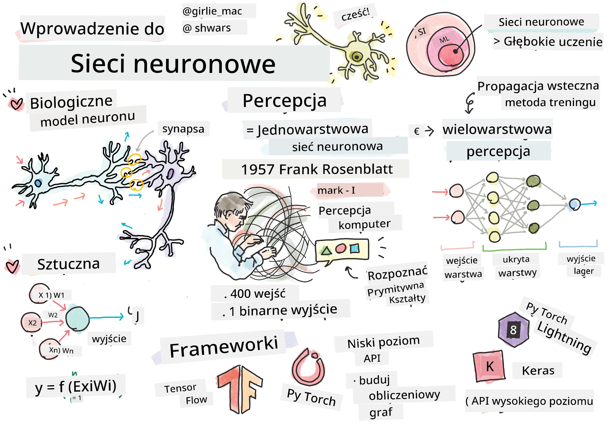
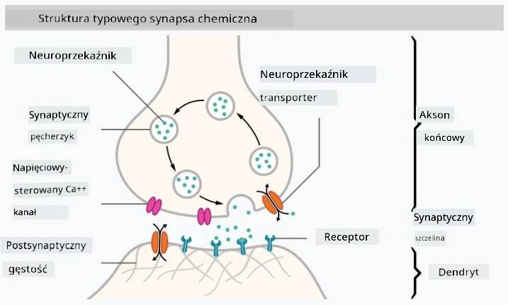

# Wprowadzenie do sieci neuronowych

Jak omówiliśmy we wstępie, jednym ze sposobów osiągnięcia inteligencji jest trenowanie **modelu komputerowego** lub **sztucznego mózgu**. Od połowy XX wieku badacze próbowali różnych modeli matematycznych, aż w ostatnich latach ten kierunek okazał się niezwykle skuteczny. Takie matematyczne modele mózgu nazywane są **sieciami neuronowymi**.

> Czasami sieci neuronowe nazywane są *Sztucznymi Sieciami Neuronowymi*, ANNs, aby podkreślić, że mówimy o modelach, a nie o rzeczywistych sieciach neuronów.

## Uczenie maszynowe

Sieci neuronowe są częścią większej dziedziny zwanej **Uczeniem Maszynowym**, której celem jest wykorzystanie danych do trenowania modeli komputerowych zdolnych do rozwiązywania problemów. Uczenie maszynowe stanowi dużą część sztucznej inteligencji, jednak w tym programie nauczania nie omawiamy klasycznego uczenia maszynowego.

> Odwiedź nasz osobny program nauczania **[Uczenie Maszynowe dla Początkujących](http://github.com/microsoft/ml-for-beginners)**, aby dowiedzieć się więcej o klasycznym uczeniu maszynowym.

W uczeniu maszynowym zakładamy, że mamy jakiś zbiór danych przykładów **X** oraz odpowiadające im wartości wyjściowe **Y**. Przykłady często są N-wymiarowymi wektorami składającymi się z **cech**, a wartości wyjściowe nazywane są **etykietami**.

Rozważymy dwa najczęstsze problemy uczenia maszynowego:

* **Klasyfikacja**, gdzie musimy sklasyfikować obiekt wejściowy do jednej z dwóch lub więcej klas.
* **Regresja**, gdzie musimy przewidzieć wartość liczbową dla każdego z przykładów wejściowych.

> Reprezentując dane wejściowe i wyjściowe jako tensory, zbiór danych wejściowych jest macierzą o rozmiarze M&times;N, gdzie M to liczba przykładów, a N to liczba cech. Etykiety wyjściowe Y są wektorem o rozmiarze M.

W tym programie nauczania skupimy się wyłącznie na modelach sieci neuronowych.

## Model neuronu

Z biologii wiemy, że nasz mózg składa się z komórek nerwowych (neuronów), z których każda ma wiele "wejść" (dendrytów) i jedno "wyjście" (akson). Zarówno dendryty, jak i aksony mogą przewodzić sygnały elektryczne, a połączenia między nimi — znane jako synapsy — mogą wykazywać różne stopnie przewodnictwa, które są regulowane przez neuroprzekaźniki.

 | 
----|----
Prawdziwy neuron *([Obraz](https://en.wikipedia.org/wiki/Synapse#/media/File:SynapseSchematic_lines.svg) z Wikipedii)* | Sztuczny neuron *(Obraz autora)*

Najprostszy matematyczny model neuronu zawiera kilka wejść X1, ..., XN oraz jedno wyjście Y, a także serię wag W1, ..., WN. Wyjście obliczane jest jako:

gdzie f jest pewną nieliniową **funkcją aktywacji**.

> Wczesne modele neuronu zostały opisane w klasycznym artykule [A logical calculus of the ideas immanent in nervous activity](https://www.cs.cmu.edu/~./epxing/Class/10715/reading/McCulloch.and.Pitts.pdf) autorstwa Warrena McCullocka i Waltera Pittsa w 1943 roku. Donald Hebb w swojej książce "[The Organization of Behavior: A Neuropsychological Theory](https://books.google.com/books?id=VNetYrB8EBoC)" zaproponował sposób, w jaki te sieci mogą być trenowane.

## W tej sekcji

W tej sekcji dowiemy się o:
* [Perceptronie](03-Perceptron/README.md), jednym z najwcześniejszych modeli sieci neuronowych do klasyfikacji dwuklasowej
* [Sieciach wielowarstwowych](04-OwnFramework/README.md) wraz z powiązanym notatnikiem [jak zbudować własny framework](04-OwnFramework/OwnFramework.ipynb)
* [Frameworkach sieci neuronowych](05-Frameworks/README.md), z tymi notatnikami: [PyTorch](05-Frameworks/IntroPyTorch.ipynb) i [Keras/Tensorflow](05-Frameworks/IntroKerasTF.ipynb)
* [Przeuczeniu](../../../../lessons/3-NeuralNetworks/05-Frameworks)

---

**Zastrzeżenie**:  
Ten dokument został przetłumaczony za pomocą usługi tłumaczenia AI [Co-op Translator](https://github.com/Azure/co-op-translator). Chociaż dokładamy wszelkich starań, aby tłumaczenie było precyzyjne, prosimy pamiętać, że automatyczne tłumaczenia mogą zawierać błędy lub nieścisłości. Oryginalny dokument w jego języku źródłowym powinien być uznawany za autorytatywne źródło. W przypadku informacji o kluczowym znaczeniu zaleca się skorzystanie z profesjonalnego tłumaczenia przez człowieka. Nie ponosimy odpowiedzialności za jakiekolwiek nieporozumienia lub błędne interpretacje wynikające z użycia tego tłumaczenia.