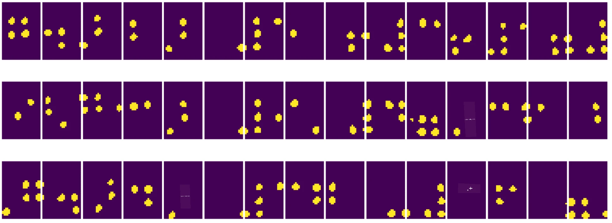
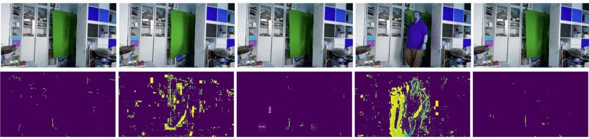

# Wprowadzenie do wizji komputerowej

[Wizja komputerowa](https://wikipedia.org/wiki/Computer_vision) to dziedzina, której celem jest umożliwienie komputerom uzyskania wysokopoziomowego zrozumienia obrazów cyfrowych. Jest to dość szeroka definicja, ponieważ *zrozumienie* może oznaczać wiele różnych rzeczy, takich jak znalezienie obiektu na zdjęciu (**detekcja obiektów**), zrozumienie, co się dzieje (**detekcja zdarzeń**), opisanie obrazu w formie tekstu czy rekonstrukcja sceny w 3D. Istnieją również specjalne zadania związane z obrazami ludzi: szacowanie wieku i emocji, detekcja i identyfikacja twarzy oraz estymacja pozycji 3D, by wymienić tylko kilka.

## [Quiz przed wykładem](https://ff-quizzes.netlify.app/en/ai/quiz/11)

Jednym z najprostszych zadań wizji komputerowej jest **klasyfikacja obrazów**.

Wizja komputerowa często jest uważana za gałąź sztucznej inteligencji. Obecnie większość zadań związanych z wizją komputerową jest rozwiązywana za pomocą sieci neuronowych. W tej sekcji dowiemy się więcej o specjalnym typie sieci neuronowych stosowanych w wizji komputerowej, [konwolucyjnych sieciach neuronowych](../07-ConvNets/README.md).

Jednak zanim przekażesz obraz do sieci neuronowej, w wielu przypadkach warto zastosować pewne techniki algorytmiczne, aby poprawić jakość obrazu.

Istnieje kilka bibliotek Python dostępnych do przetwarzania obrazów:

* **[imageio](https://imageio.readthedocs.io/en/stable/)** może być używane do odczytu/zapisu różnych formatów obrazów. Obsługuje również ffmpeg, przydatne narzędzie do konwersji klatek wideo na obrazy.
* **[Pillow](https://pillow.readthedocs.io/en/stable/index.html)** (znane również jako PIL) jest nieco bardziej zaawansowane i obsługuje manipulacje obrazami, takie jak morfowanie, dostosowanie palety i inne.
* **[OpenCV](https://opencv.org/)** to potężna biblioteka do przetwarzania obrazów napisana w C++, która stała się standardem w tej dziedzinie. Posiada wygodny interfejs w Pythonie.
* **[dlib](http://dlib.net/)** to biblioteka C++, która implementuje wiele algorytmów uczenia maszynowego, w tym niektóre algorytmy wizji komputerowej. Posiada również interfejs w Pythonie i może być używana do trudnych zadań, takich jak detekcja twarzy i punktów charakterystycznych twarzy.

## OpenCV

[OpenCV](https://opencv.org/) jest uważane za standard w przetwarzaniu obrazów. Zawiera wiele przydatnych algorytmów zaimplementowanych w C++. Możesz również korzystać z OpenCV w Pythonie.

Dobrym miejscem do nauki OpenCV jest [kurs Learn OpenCV](https://learnopencv.com/getting-started-with-opencv/). W naszym programie nauczania celem nie jest nauka OpenCV, ale pokazanie kilku przykładów, kiedy można go użyć i jak.

### Ładowanie obrazów

Obrazy w Pythonie można wygodnie reprezentować za pomocą tablic NumPy. Na przykład obrazy w skali szarości o rozmiarze 320x200 pikseli byłyby przechowywane w tablicy 200x320, a obrazy kolorowe o tych samych wymiarach miałyby kształt 200x320x3 (dla 3 kanałów kolorów). Aby załadować obraz, możesz użyć następującego kodu:

```python
import cv2
import matplotlib.pyplot as plt

im = cv2.imread('image.jpeg')
plt.imshow(im)
```

Tradycyjnie OpenCV używa kodowania BGR (Blue-Green-Red) dla obrazów kolorowych, podczas gdy reszta narzędzi Pythona używa bardziej tradycyjnego RGB (Red-Green-Blue). Aby obraz wyglądał poprawnie, musisz przekonwertować go na przestrzeń kolorów RGB, albo przez zamianę wymiarów w tablicy NumPy, albo przez wywołanie funkcji OpenCV:

```python
im = cv2.cvtColor(im,cv2.COLOR_BGR2RGB)
```

Ta sama funkcja `cvtColor` może być używana do wykonywania innych transformacji przestrzeni kolorów, takich jak konwersja obrazu na skalę szarości lub na przestrzeń HSV (Hue-Saturation-Value).

Możesz również użyć OpenCV do ładowania klatek wideo jedna po drugiej - przykład znajduje się w ćwiczeniu [OpenCV Notebook](OpenCV.ipynb).

### Przetwarzanie obrazów

Przed przekazaniem obrazu do sieci neuronowej możesz chcieć zastosować kilka kroków wstępnego przetwarzania. OpenCV umożliwia wiele operacji, w tym:

* **Zmiana rozmiaru** obrazu za pomocą `im = cv2.resize(im, (320,200),interpolation=cv2.INTER_LANCZOS)`
* **Rozmycie** obrazu za pomocą `im = cv2.medianBlur(im,3)` lub `im = cv2.GaussianBlur(im, (3,3), 0)`
* Zmiana **jasności i kontrastu** obrazu może być wykonana za pomocą manipulacji tablicami NumPy, jak opisano [w tej notatce na Stackoverflow](https://stackoverflow.com/questions/39308030/how-do-i-increase-the-contrast-of-an-image-in-python-opencv).
* Użycie [progowania](https://docs.opencv.org/4.x/d7/d4d/tutorial_py_thresholding.html) przez wywołanie funkcji `cv2.threshold`/`cv2.adaptiveThreshold`, co często jest preferowane w stosunku do regulacji jasności lub kontrastu.
* Zastosowanie różnych [transformacji](https://docs.opencv.org/4.5.5/da/d6e/tutorial_py_geometric_transformations.html) do obrazu:
    - **[Transformacje afiniczne](https://docs.opencv.org/4.5.5/d4/d61/tutorial_warp_affine.html)** mogą być przydatne, jeśli potrzebujesz połączyć obrót, zmianę rozmiaru i pochylanie obrazu, a znasz lokalizację źródłową i docelową trzech punktów na obrazie. Transformacje afiniczne zachowują równoległość linii.
    - **[Transformacje perspektywiczne](https://medium.com/analytics-vidhya/opencv-perspective-transformation-9edffefb2143)** mogą być przydatne, gdy znasz pozycje źródłowe i docelowe 4 punktów na obrazie. Na przykład, jeśli robisz zdjęcie prostokątnego dokumentu za pomocą kamery smartfona pod pewnym kątem i chcesz uzyskać prostokątny obraz samego dokumentu.
* Zrozumienie ruchu wewnątrz obrazu za pomocą **[optycznego przepływu](https://docs.opencv.org/4.5.5/d4/dee/tutorial_optical_flow.html)**.

## Przykłady zastosowania wizji komputerowej

W naszym [OpenCV Notebook](OpenCV.ipynb) przedstawiamy kilka przykładów, kiedy wizja komputerowa może być użyta do wykonania konkretnych zadań:

* **Wstępne przetwarzanie fotografii książki Braille'a**. Skupiamy się na tym, jak można użyć progowania, detekcji cech, transformacji perspektywicznej i manipulacji NumPy, aby oddzielić pojedyncze symbole Braille'a do dalszej klasyfikacji przez sieć neuronową.

 |  | 
----|-----|-----

> Obraz z [OpenCV.ipynb](OpenCV.ipynb)

* **Detekcja ruchu w wideo za pomocą różnicy klatek**. Jeśli kamera jest nieruchoma, klatki z jej strumienia powinny być dość podobne do siebie. Ponieważ klatki są reprezentowane jako tablice, wystarczy odjąć te tablice dla dwóch kolejnych klatek, aby uzyskać różnicę pikseli, która powinna być niska dla statycznych klatek, a wyższa, gdy w obrazie występuje znaczący ruch.



> Obraz z [OpenCV.ipynb](OpenCV.ipynb)

* **Detekcja ruchu za pomocą optycznego przepływu**. [Optyczny przepływ](https://docs.opencv.org/3.4/d4/dee/tutorial_optical_flow.html) pozwala zrozumieć, jak poszczególne piksele na klatkach wideo się poruszają. Istnieją dwa rodzaje optycznego przepływu:

   - **Gęsty optyczny przepływ** oblicza pole wektorowe, które pokazuje, gdzie każdy piksel się porusza.
   - **Rzadki optyczny przepływ** opiera się na wybraniu charakterystycznych cech obrazu (np. krawędzi) i budowaniu ich trajektorii od klatki do klatki.


> Obraz z [OpenCV.ipynb](OpenCV.ipynb)

## ✍️ Przykładowe Notatniki: OpenCV [wypróbuj OpenCV w działaniu](OpenCV.ipynb)

Zróbmy kilka eksperymentów z OpenCV, eksplorując [OpenCV Notebook](OpenCV.ipynb)

## Podsumowanie

Czasami stosunkowo złożone zadania, takie jak detekcja ruchu czy detekcja końców palców, mogą być rozwiązane wyłącznie za pomocą wizji komputerowej. Dlatego warto znać podstawowe techniki wizji komputerowej oraz możliwości bibliotek takich jak OpenCV.

## 🚀 Wyzwanie

Obejrzyj [ten film](https://docs.microsoft.com/shows/ai-show/ai-show--2021-opencv-ai-competition--grand-prize-winners--cortic-tigers--episode-32?WT.mc_id=academic-77998-cacaste) z programu AI Show, aby dowiedzieć się o projekcie Cortic Tigers i jak stworzyli rozwiązanie oparte na blokach, aby demokratyzować zadania wizji komputerowej za pomocą robota. Poszukaj innych podobnych projektów, które pomagają nowym uczniom wejść w tę dziedzinę.

## [Quiz po wykładzie](https://ff-quizzes.netlify.app/en/ai/quiz/12)

## Przegląd i samodzielna nauka

Przeczytaj więcej o optycznym przepływie [w tym świetnym tutorialu](https://learnopencv.com/optical-flow-in-opencv/).

## [Zadanie](lab/README.md)

W tym laboratorium nagrasz wideo z prostymi gestami, a Twoim celem będzie wyodrębnienie ruchów góra/dół/lewo/prawo za pomocą optycznego przepływu.


---

