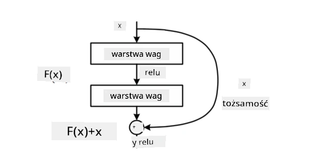
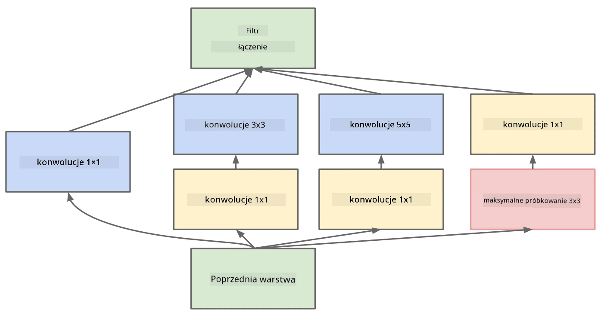

# Znane Architektury CNN

### VGG-16

VGG-16 to sieć, która osiągnęła 92,7% dokładności w klasyfikacji top-5 ImageNet w 2014 roku. Ma następującą strukturę warstw:

Jak widać, VGG stosuje tradycyjną architekturę piramidy, czyli sekwencję warstw konwolucyjnych i poolingowych.

> Obraz z [Researchgate](https://www.researchgate.net/figure/Vgg16-model-structure-To-get-the-VGG-NIN-model-we-replace-the-2-nd-4-th-6-th-7-th_fig2_335194493)

### ResNet

ResNet to rodzina modeli zaproponowana przez Microsoft Research w 2015 roku. Główną ideą ResNet jest wykorzystanie **bloków resztkowych**:

> Obraz z [tego artykułu](https://arxiv.org/pdf/1512.03385.pdf)

Powodem zastosowania ścieżki tożsamości jest umożliwienie warstwie przewidywania **różnicy** między wynikiem poprzedniej warstwy a wyjściem bloku resztkowego - stąd nazwa *resztkowy*. Te bloki są znacznie łatwiejsze do trenowania, a sieć można skonstruować z kilkuset takich bloków (najczęściej spotykane warianty to ResNet-52, ResNet-101 i ResNet-152).

Można również pomyśleć o tej sieci jako o zdolnej do dostosowania swojej złożoności do zbioru danych. Na początku, gdy rozpoczynamy trenowanie sieci, wartości wag są małe, a większość sygnału przechodzi przez warstwy tożsamości. W miarę postępu treningu i wzrostu wartości wag, znaczenie parametrów sieci rośnie, a sieć dostosowuje się, aby zapewnić wymaganą moc wyrazu do poprawnej klasyfikacji obrazów treningowych.

### Google Inception

Architektura Google Inception idzie o krok dalej i buduje każdą warstwę sieci jako kombinację kilku różnych ścieżek:

> Obraz z [Researchgate](https://www.researchgate.net/figure/Inception-module-with-dimension-reductions-left-and-schema-for-Inception-ResNet-v1_fig2_355547454)

Tutaj należy podkreślić rolę konwolucji 1x1, ponieważ na pierwszy rzut oka mogą wydawać się bez sensu. Dlaczego mielibyśmy przetwarzać obraz za pomocą filtra 1x1? Jednak należy pamiętać, że filtry konwolucyjne działają również na kilku kanałach głębokości (początkowo - kolory RGB, w kolejnych warstwach - kanały dla różnych filtrów), a konwolucja 1x1 jest używana do mieszania tych kanałów wejściowych za pomocą różnych trenowalnych wag. Można ją również traktować jako próbkowanie w dół (pooling) w wymiarze kanałów.

Oto [dobry wpis na blogu](https://medium.com/analytics-vidhya/talented-mr-1x1-comprehensive-look-at-1x1-convolution-in-deep-learning-f6b355825578) na ten temat oraz [oryginalny artykuł](https://arxiv.org/pdf/1312.4400.pdf).

### MobileNet

MobileNet to rodzina modeli o zmniejszonym rozmiarze, odpowiednia dla urządzeń mobilnych. Używaj ich, jeśli masz ograniczone zasoby i możesz poświęcić trochę dokładności. Główną ideą stojącą za nimi jest tak zwana **konwolucja separowalna głębokościowo**, która pozwala reprezentować filtry konwolucyjne jako kompozycję konwolucji przestrzennych i konwolucji 1x1 w kanałach głębokości. Znacząco zmniejsza to liczbę parametrów, czyniąc sieć mniejszą i łatwiejszą do trenowania przy mniejszej ilości danych.

Oto [dobry wpis na blogu o MobileNet](https://medium.com/analytics-vidhya/image-classification-with-mobilenet-cc6fbb2cd470).

## Podsumowanie

W tej jednostce nauczyłeś się głównej koncepcji stojącej za sieciami neuronowymi do wizji komputerowej - sieci konwolucyjnych. Architektury stosowane w rzeczywistości, które napędzają klasyfikację obrazów, wykrywanie obiektów, a nawet generowanie obrazów, są oparte na CNN, tylko z większą liczbą warstw i dodatkowymi trikami treningowymi.

## 🚀 Wyzwanie

W dołączonych notatnikach znajdują się uwagi na dole dotyczące sposobów osiągnięcia większej dokładności. Przeprowadź eksperymenty, aby sprawdzić, czy możesz osiągnąć wyższą dokładność.

## [Quiz po wykładzie](https://ff-quizzes.netlify.app/en/ai/quiz/14)

## Przegląd i Samodzielna Nauka

Chociaż CNN są najczęściej używane do zadań związanych z wizją komputerową, są ogólnie dobre w wykrywaniu wzorców o stałym rozmiarze. Na przykład, jeśli mamy do czynienia z dźwiękami, możemy również chcieć użyć CNN do wyszukiwania określonych wzorców w sygnale audio - w takim przypadku filtry byłyby jednowymiarowe (a taka CNN nazywałaby się 1D-CNN). Czasami używa się również 3D-CNN do ekstrakcji cech w przestrzeni wielowymiarowej, takich jak określone zdarzenia występujące na wideo - CNN może uchwycić pewne wzorce zmiany cech w czasie. Przeprowadź przegląd i samodzielną naukę na temat innych zadań, które można wykonać za pomocą CNN.

## [Zadanie](lab/README.md)

W tym laboratorium Twoim zadaniem jest klasyfikacja różnych ras kotów i psów. Te obrazy są bardziej złożone niż zbiór danych MNIST, mają wyższe wymiary i jest więcej niż 10 klas.

---

