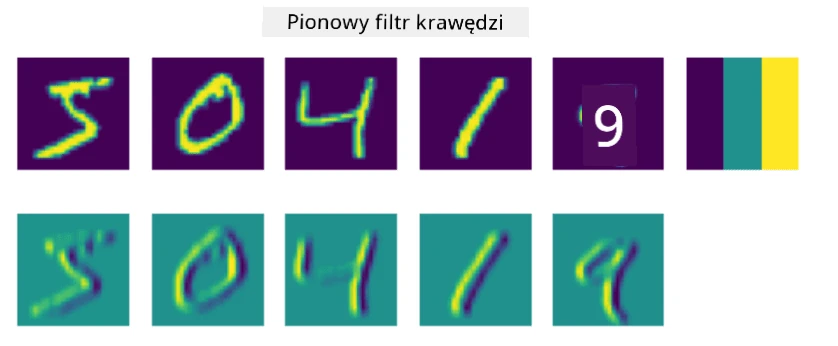
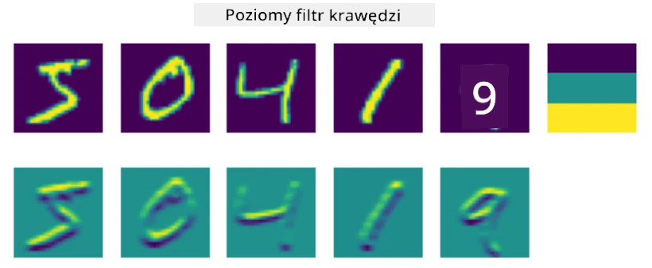
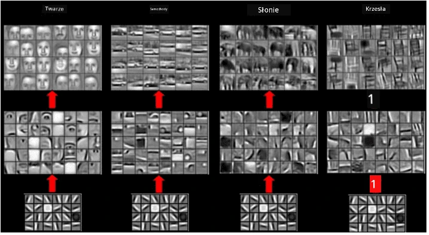
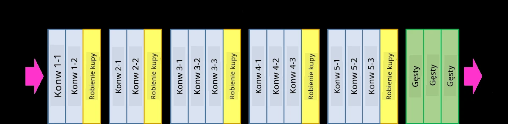
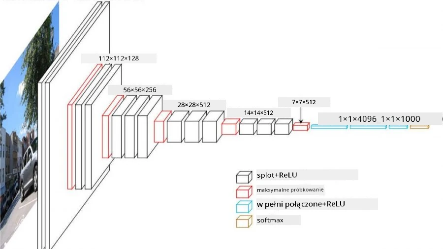

# Konwolucyjne Sieci Neuronowe

Wcześniej widzieliśmy, że sieci neuronowe całkiem dobrze radzą sobie z obrazami, a nawet perceptron jednopoziomowy potrafi rozpoznawać odręczne cyfry z zestawu danych MNIST z zadowalającą dokładnością. Jednak zestaw danych MNIST jest wyjątkowy, ponieważ wszystkie cyfry są wyśrodkowane na obrazie, co upraszcza zadanie.

## [Quiz przed wykładem](https://ff-quizzes.netlify.app/en/ai/quiz/13)

W rzeczywistości chcemy być w stanie rozpoznawać obiekty na zdjęciu niezależnie od ich dokładnej lokalizacji na obrazie. Wizja komputerowa różni się od ogólnej klasyfikacji, ponieważ gdy próbujemy znaleźć określony obiekt na zdjęciu, skanujemy obraz w poszukiwaniu specyficznych **wzorów** i ich kombinacji. Na przykład, szukając kota, najpierw możemy poszukiwać poziomych linii, które mogą tworzyć wąsy, a następnie określona kombinacja wąsów może wskazać, że to faktycznie zdjęcie kota. Ważna jest względna pozycja i obecność określonych wzorów, a nie ich dokładne położenie na obrazie.

Aby wyodrębnić wzory, użyjemy pojęcia **filtrów konwolucyjnych**. Jak wiadomo, obraz jest reprezentowany jako macierz 2D lub tensor 3D z głębią kolorów. Zastosowanie filtra oznacza, że bierzemy stosunkowo małą macierz **jądra filtra** i dla każdego piksela w oryginalnym obrazie obliczamy średnią ważoną z sąsiednich punktów. Możemy to sobie wyobrazić jako małe okno przesuwające się po całym obrazie, uśredniające wszystkie piksele zgodnie z wagami w macierzy jądra filtra.

 | 
----|----

> Obraz autorstwa Dmitry Soshnikov

Na przykład, jeśli zastosujemy filtry krawędzi pionowych i poziomych o rozmiarze 3x3 do cyfr z MNIST, możemy uzyskać wyróżnienia (np. wysokie wartości) tam, gdzie w oryginalnym obrazie występują krawędzie pionowe i poziome. Te dwa filtry mogą być używane do "wyszukiwania" krawędzi. Podobnie, możemy zaprojektować różne filtry, aby wyszukiwać inne wzory niskiego poziomu:

> Obraz [Leung-Malik Filter Bank](https://www.robots.ox.ac.uk/~vgg/research/texclass/filters.html)

Jednak, podczas gdy możemy ręcznie projektować filtry do wyodrębniania wzorów, możemy również zaprojektować sieć w taki sposób, aby sama uczyła się wzorów automatycznie. To jedna z głównych idei stojących za CNN.

## Główne idee stojące za CNN

Działanie CNN opiera się na następujących ważnych założeniach:

* Filtry konwolucyjne mogą wyodrębniać wzory
* Możemy zaprojektować sieć w taki sposób, aby filtry były trenowane automatycznie
* Możemy użyć tego samego podejścia do znajdowania wzorów w cechach wysokiego poziomu, a nie tylko w oryginalnym obrazie. W ten sposób ekstrakcja cech w CNN działa na hierarchii cech, zaczynając od kombinacji pikseli niskiego poziomu, aż do kombinacji części obrazu na wyższym poziomie.

> Obraz z [artykułu Hislop-Lynch](https://www.semanticscholar.org/paper/Computer-vision-based-pedestrian-trajectory-Hislop-Lynch/26e6f74853fc9bbb7487b06dc2cf095d36c9021d), opartego na [ich badaniach](https://dl.acm.org/doi/abs/10.1145/1553374.1553453)

## ✍️ Ćwiczenia: Konwolucyjne Sieci Neuronowe

Kontynuujmy eksplorację działania konwolucyjnych sieci neuronowych i tego, jak możemy osiągnąć trenowalne filtry, pracując z odpowiednimi notatnikami:

* [Konwolucyjne Sieci Neuronowe - PyTorch](ConvNetsPyTorch.ipynb)
* [Konwolucyjne Sieci Neuronowe - TensorFlow](ConvNetsTF.ipynb)

## Architektura Piramidy

Większość CNN używanych do przetwarzania obrazów stosuje tzw. architekturę piramidy. Pierwsza warstwa konwolucyjna zastosowana do oryginalnych obrazów zazwyczaj ma stosunkowo niewielką liczbę filtrów (8-16), które odpowiadają różnym kombinacjom pikseli, takim jak poziome/pionowe linie czy kreski. Na następnym poziomie zmniejszamy wymiar przestrzenny sieci i zwiększamy liczbę filtrów, co odpowiada większej liczbie możliwych kombinacji prostych cech. Z każdą warstwą, w miarę zbliżania się do końcowego klasyfikatora, wymiary przestrzenne obrazu maleją, a liczba filtrów rośnie.

Na przykład, spójrzmy na architekturę VGG-16, sieci, która osiągnęła 92,7% dokładności w klasyfikacji top-5 ImageNet w 2014 roku:

> Obraz z [Researchgate](https://www.researchgate.net/figure/Vgg16-model-structure-To-get-the-VGG-NIN-model-we-replace-the-2-nd-4-th-6-th-7-th_fig2_335194493)

## Najbardziej Znane Architektury CNN

[Kontynuuj naukę o najbardziej znanych architekturach CNN](CNN_Architectures.md)

---

