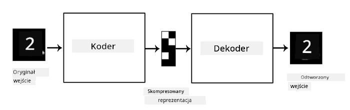
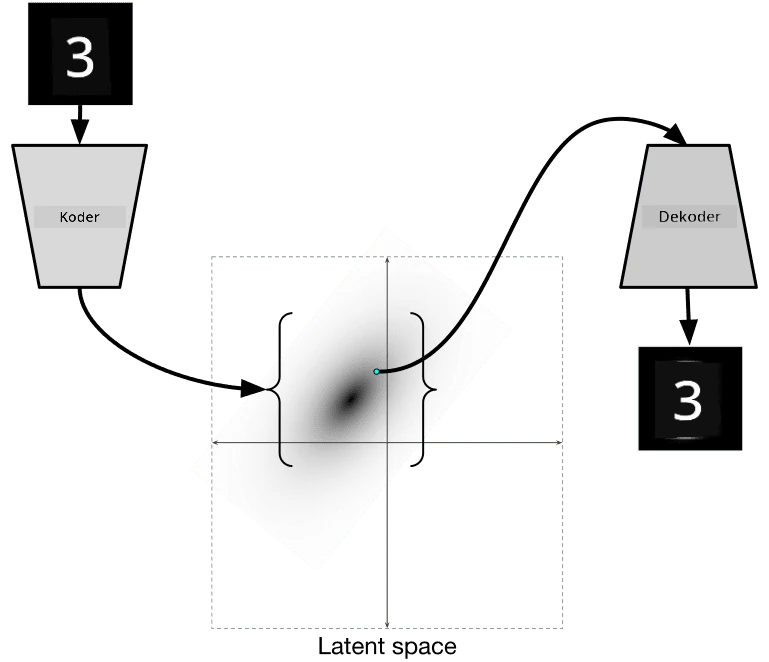

# Autoenkodery

Podczas trenowania CNN jednym z problemów jest potrzeba dużej ilości danych oznaczonych. W przypadku klasyfikacji obrazów musimy podzielić obrazy na różne klasy, co wymaga ręcznego wysiłku.

## [Quiz przed wykładem](https://ff-quizzes.netlify.app/en/ai/quiz/17)

Możemy jednak chcieć wykorzystać surowe (nieoznaczone) dane do trenowania ekstraktorów cech CNN, co nazywa się **uczeniem samonadzorowanym**. Zamiast etykiet, użyjemy obrazów treningowych zarówno jako wejścia, jak i wyjścia sieci. Główna idea **autoenkodera** polega na tym, że będziemy mieć **sieć enkodera**, która przekształca obraz wejściowy w pewną **przestrzeń latentną** (zwykle jest to wektor o mniejszym rozmiarze), a następnie **sieć dekodera**, której celem będzie odtworzenie oryginalnego obrazu.

> ✅ [Autoenkoder](https://wikipedia.org/wiki/Autoencoder) to "rodzaj sztucznej sieci neuronowej używanej do nauki efektywnego kodowania nieoznaczonych danych."

Ponieważ trenujemy autoenkoder, aby uchwycić jak najwięcej informacji z oryginalnego obrazu w celu dokładnej rekonstrukcji, sieć stara się znaleźć najlepsze **osadzenie** obrazów wejściowych, aby uchwycić ich znaczenie.

> Obraz z [blogu Keras](https://blog.keras.io/building-autoencoders-in-keras.html)

## Scenariusze użycia Autoenkoderów

Chociaż samo odtwarzanie oryginalnych obrazów może wydawać się mało użyteczne, istnieje kilka scenariuszy, w których autoenkodery są szczególnie przydatne:

* **Obniżanie wymiaru obrazów do wizualizacji** lub **trenowanie osadzeń obrazów**. Zwykle autoenkodery dają lepsze wyniki niż PCA, ponieważ uwzględniają przestrzenną naturę obrazów i hierarchiczne cechy.
* **Usuwanie szumów**, czyli eliminowanie zakłóceń z obrazu. Ponieważ szum zawiera wiele niepotrzebnych informacji, autoenkoder nie jest w stanie zmieścić ich wszystkich w stosunkowo małej przestrzeni latentnej, dzięki czemu uchwyca tylko istotne części obrazu. Podczas trenowania usuwania szumów zaczynamy od oryginalnych obrazów i używamy obrazów z sztucznie dodanym szumem jako wejścia dla autoenkodera.
* **Super-rozdzielczość**, czyli zwiększanie rozdzielczości obrazu. Zaczynamy od obrazów o wysokiej rozdzielczości i używamy obrazu o niższej rozdzielczości jako wejścia dla autoenkodera.
* **Modele generatywne**. Po przeszkoleniu autoenkodera, część dekodera może być używana do tworzenia nowych obiektów, zaczynając od losowych wektorów latentnych.

## Wariacyjne Autoenkodery (VAE)

Tradycyjne autoenkodery redukują wymiar danych wejściowych, identyfikując ważne cechy obrazów wejściowych. Jednak wektory latentne często nie mają większego sensu. Innymi słowy, biorąc za przykład zbiór danych MNIST, ustalenie, które cyfry odpowiadają różnym wektorom latentnym, nie jest łatwym zadaniem, ponieważ bliskie wektory latentne niekoniecznie odpowiadają tym samym cyfrom.

Z drugiej strony, aby trenować modele *generatywne*, lepiej mieć pewne zrozumienie przestrzeni latentnej. Ta idea prowadzi nas do **wariacyjnego autoenkodera** (VAE).

VAE to autoenkoder, który uczy się przewidywać *rozkład statystyczny* parametrów latentnych, tzw. **rozkład latentny**. Na przykład możemy chcieć, aby wektory latentne były rozłożone normalnie z pewną średnią zmean i odchyleniem standardowym zsigma (zarówno średnia, jak i odchylenie standardowe są wektorami o pewnej wymiarowości d). Enkoder w VAE uczy się przewidywać te parametry, a następnie dekoder bierze losowy wektor z tego rozkładu, aby odtworzyć obiekt.

Podsumowując:

 * Z wektora wejściowego przewidujemy `z_mean` i `z_log_sigma` (zamiast przewidywać samo odchylenie standardowe, przewidujemy jego logarytm)
 * Pobieramy próbkę wektora `sample` z rozkładu N(zmean,exp(zlog\_sigma))
 * Dekoder próbuje odtworzyć oryginalny obraz, używając `sample` jako wektora wejściowego

 

> Obraz z [tego wpisu na blogu](https://ijdykeman.github.io/ml/2016/12/21/cvae.html) autorstwa Isaaka Dykemana

Wariacyjne autoenkodery używają złożonej funkcji strat, która składa się z dwóch części:

* **Strata rekonstrukcji** to funkcja strat, która pokazuje, jak blisko odtworzony obraz jest do celu (może to być Mean Squared Error, czyli MSE). Jest to ta sama funkcja strat, co w zwykłych autoenkoderach.
* **Strata KL**, która zapewnia, że rozkłady zmiennych latentnych pozostają bliskie rozkładowi normalnemu. Opiera się na pojęciu [dywergencji Kullbacka-Leiblera](https://www.countbayesie.com/blog/2017/5/9/kullback-leibler-divergence-explained) - metryki do oszacowania, jak podobne są dwa rozkłady statystyczne.

Jedną z ważnych zalet VAE jest to, że pozwalają na stosunkowo łatwe generowanie nowych obrazów, ponieważ wiemy, z jakiego rozkładu pobierać wektory latentne. Na przykład, jeśli przeszkolimy VAE z 2-wymiarowym wektorem latentnym na MNIST, możemy następnie zmieniać komponenty wektora latentnego, aby uzyskać różne cyfry:

> Obraz autorstwa [Dmitrija Soshnikova](http://soshnikov.com)

Zauważ, jak obrazy płynnie przechodzą jeden w drugi, gdy zaczynamy pobierać wektory latentne z różnych części przestrzeni parametrów latentnych. Możemy również zwizualizować tę przestrzeń w 2D:

 

> Obraz autorstwa [Dmitrija Soshnikova](http://soshnikov.com)

## ✍️ Ćwiczenia: Autoenkodery

Dowiedz się więcej o autoenkoderach w tych odpowiednich notatnikach:

* [Autoenkodery w TensorFlow](AutoencodersTF.ipynb)
* [Autoenkodery w PyTorch](AutoEncodersPyTorch.ipynb)

## Właściwości Autoenkoderów

* **Specyficzne dla danych** - działają dobrze tylko na typie obrazów, na których zostały przeszkolone. Na przykład, jeśli przeszkolimy sieć super-rozdzielczości na kwiatach, nie będzie dobrze działać na portretach. Dzieje się tak, ponieważ sieć może tworzyć obrazy o wyższej rozdzielczości, wykorzystując szczegóły z cech wyuczonych na zbiorze danych treningowych.
* **Stratne** - odtworzony obraz nie jest identyczny z oryginalnym obrazem. Charakter strat jest definiowany przez *funkcję strat* używaną podczas treningu.
* Działa na **danych nieoznaczonych**

## [Quiz po wykładzie](https://ff-quizzes.netlify.app/en/ai/quiz/18)

## Podsumowanie

W tej lekcji dowiedziałeś się o różnych typach autoenkoderów dostępnych dla naukowca AI. Nauczyłeś się, jak je budować i jak używać ich do odtwarzania obrazów. Dowiedziałeś się również o VAE i jak używać go do generowania nowych obrazów.

## 🚀 Wyzwanie

W tej lekcji dowiedziałeś się o używaniu autoenkoderów do obrazów. Ale mogą być również używane do muzyki! Sprawdź projekt Magenta [MusicVAE](https://magenta.tensorflow.org/music-vae), który wykorzystuje autoenkodery do nauki odtwarzania muzyki. Przeprowadź kilka [eksperymentów](https://colab.research.google.com/github/magenta/magenta-demos/blob/master/colab-notebooks/Multitrack_MusicVAE.ipynb) z tą biblioteką, aby zobaczyć, co możesz stworzyć.

## [Quiz po wykładzie](https://ff-quizzes.netlify.app/en/ai/quiz/16)

## Przegląd i samodzielna nauka

Dla odniesienia, przeczytaj więcej o autoenkoderach w tych zasobach:

* [Budowanie Autoenkoderów w Keras](https://blog.keras.io/building-autoencoders-in-keras.html)
* [Wpis na blogu NeuroHive](https://neurohive.io/ru/osnovy-data-science/variacionnyj-avtojenkoder-vae/)
* [Wariacyjne Autoenkodery Wyjaśnione](https://kvfrans.com/variational-autoencoders-explained/)
* [Wariacyjne Autoenkodery Warunkowe](https://ijdykeman.github.io/ml/2016/12/21/cvae.html)

## Zadanie

Na końcu [tego notatnika używającego TensorFlow](AutoencodersTF.ipynb) znajdziesz 'zadanie' - użyj tego jako swojego zadania.

---

