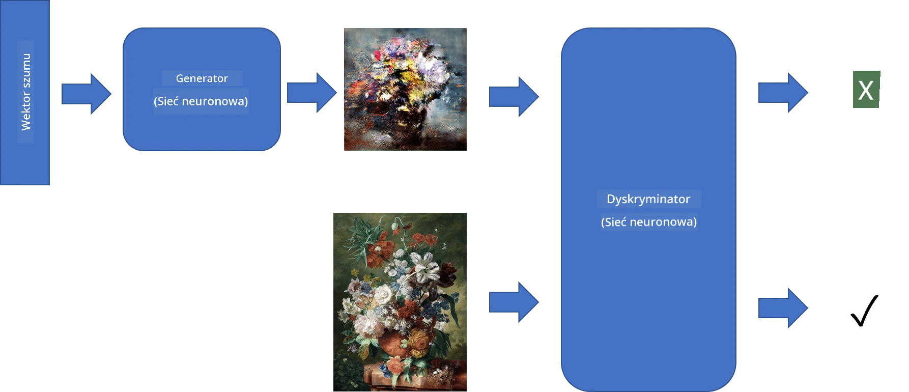
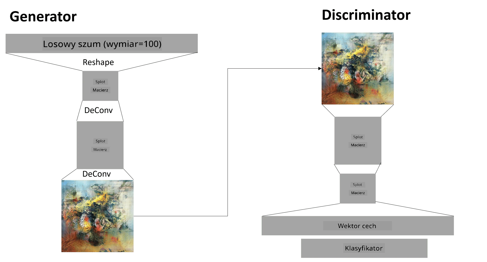

# Generative Adversarial Networks

W poprzedniej sekcji poznaliśmy **modele generatywne**: modele, które potrafią generować nowe obrazy podobne do tych z zestawu treningowego. VAE był dobrym przykładem modelu generatywnego.

## [Pre-lecture quiz](https://ff-quizzes.netlify.app/en/ai/quiz/19)

Jednakże, jeśli spróbujemy wygenerować coś naprawdę znaczącego, na przykład obraz w rozsądnej rozdzielczości, za pomocą VAE, zauważymy, że trening nie przebiega dobrze. W takim przypadku warto poznać inną architekturę, specjalnie zaprojektowaną dla modeli generatywnych - **Generative Adversarial Networks**, czyli GAN.

Główna idea GAN polega na wykorzystaniu dwóch sieci neuronowych, które będą trenowane przeciwko sobie:

> Obraz autorstwa [Dmitry Soshnikov](http://soshnikov.com)

> ✅ Mały słowniczek:
> * **Generator** to sieć, która przyjmuje losowy wektor i generuje obraz jako wynik.
> * **Dyskryminator** to sieć, która przyjmuje obraz i ma za zadanie określić, czy jest to prawdziwy obraz (z zestawu treningowego), czy został wygenerowany przez generator. W zasadzie jest to klasyfikator obrazów.

### Dyskryminator

Architektura dyskryminatora nie różni się od zwykłej sieci klasyfikacji obrazów. W najprostszej wersji może to być klasyfikator w pełni połączony, ale najprawdopodobniej będzie to [sieć konwolucyjna](../07-ConvNets/README.md).

> ✅ GAN oparty na sieciach konwolucyjnych nazywany jest [DCGAN](https://arxiv.org/pdf/1511.06434.pdf)

Dyskryminator CNN składa się z następujących warstw: kilku konwolucji+poolingów (z malejącym rozmiarem przestrzennym) oraz jednej lub więcej warstw w pełni połączonych, aby uzyskać "wektor cech", a na końcu klasyfikator binarny.

> ✅ 'Pooling' w tym kontekście to technika zmniejszania rozmiaru obrazu. "Warstwy pooling zmniejszają wymiary danych, łącząc wyniki klastrów neuronów na jednej warstwie w pojedynczy neuron na następnej warstwie." - [źródło](https://wikipedia.org/wiki/Convolutional_neural_network#Pooling_layers)

### Generator

Generator jest nieco bardziej skomplikowany. Można go traktować jako odwrócony dyskryminator. Zaczynając od wektora latentnego (zamiast wektora cech), ma warstwę w pełni połączoną, która przekształca go w wymagany rozmiar/kształt, a następnie dekonwolucje+skalowanie w górę. Jest to podobne do części *dekodera* w [autoenkoderze](../09-Autoencoders/README.md).

> ✅ Ponieważ warstwa konwolucyjna jest implementowana jako filtr liniowy przesuwający się po obrazie, dekonwolucja jest zasadniczo podobna do konwolucji i może być zaimplementowana przy użyciu tej samej logiki warstwy.

> Obraz autorstwa [Dmitry Soshnikov](http://soshnikov.com)

### Trenowanie GAN

GAN nazywane są **adwersarialnymi**, ponieważ istnieje ciągła rywalizacja między generatorem a dyskryminatorem. W trakcie tej rywalizacji zarówno generator, jak i dyskryminator poprawiają się, dzięki czemu sieć uczy się generować coraz lepsze obrazy.

Trening odbywa się w dwóch etapach:

* **Trenowanie dyskryminatora**. To zadanie jest dość proste: generujemy partię obrazów za pomocą generatora, oznaczając je jako 0, co oznacza fałszywy obraz, oraz bierzemy partię obrazów z zestawu wejściowego (z etykietą 1, prawdziwy obraz). Obliczamy *stratę dyskryminatora* i wykonujemy backprop.
* **Trenowanie generatora**. To jest nieco bardziej skomplikowane, ponieważ nie znamy oczekiwanego wyniku dla generatora bezpośrednio. Bierzemy całą sieć GAN składającą się z generatora i dyskryminatora, podajemy jej losowe wektory i oczekujemy, że wynik będzie 1 (odpowiadający prawdziwym obrazom). Następnie zamrażamy parametry dyskryminatora (nie chcemy, aby był trenowany na tym etapie) i wykonujemy backprop.

Podczas tego procesu zarówno straty generatora, jak i dyskryminatora nie zmniejszają się znacząco. W idealnej sytuacji powinny oscylować, co odpowiada poprawie wydajności obu sieci.

## ✍️ Ćwiczenia: GAN

* [Notebook GAN w TensorFlow/Keras](GANTF.ipynb)
* [Notebook GAN w PyTorch](GANPyTorch.ipynb)

### Problemy z trenowaniem GAN

GAN są znane z tego, że są szczególnie trudne do trenowania. Oto kilka problemów:

* **Mode Collapse**. Termin ten oznacza, że generator uczy się generować jeden udany obraz, który oszukuje dyskryminator, zamiast różnorodnych obrazów.
* **Wrażliwość na hiperparametry**. Często można zauważyć, że GAN w ogóle się nie zbiega, a potem nagle zmniejszenie współczynnika uczenia prowadzi do zbieżności.
* Utrzymanie **równowagi** między generatorem a dyskryminatorem. W wielu przypadkach strata dyskryminatora może szybko spaść do zera, co powoduje, że generator nie jest w stanie dalej się uczyć. Aby temu zaradzić, można spróbować ustawić różne współczynniki uczenia dla generatora i dyskryminatora lub pominąć trening dyskryminatora, jeśli strata jest już zbyt niska.
* Trenowanie dla **wysokiej rozdzielczości**. Odzwierciedlając ten sam problem co w autoenkoderach, problem ten pojawia się, ponieważ odtworzenie zbyt wielu warstw sieci konwolucyjnej prowadzi do artefaktów. Problem ten jest zazwyczaj rozwiązywany za pomocą tzw. **progresywnego wzrostu**, gdzie najpierw kilka warstw jest trenowanych na obrazach o niskiej rozdzielczości, a następnie warstwy są "odblokowywane" lub dodawane. Innym rozwiązaniem byłoby dodanie dodatkowych połączeń między warstwami i trenowanie kilku rozdzielczości jednocześnie - szczegóły można znaleźć w artykule [Multi-Scale Gradient GANs](https://arxiv.org/abs/1903.06048).

## Transfer stylu

GAN to świetny sposób na generowanie artystycznych obrazów. Inną interesującą techniką jest tzw. **transfer stylu**, który bierze jeden **obraz treści** i przekształca go w inny styl, stosując filtry z **obrazu stylu**.

Jak to działa:
* Zaczynamy od losowego obrazu szumu (lub od obrazu treści, ale dla lepszego zrozumienia łatwiej zacząć od losowego szumu).
* Naszym celem jest stworzenie takiego obrazu, który będzie bliski zarówno obrazowi treści, jak i obrazowi stylu. To będzie określone przez dwie funkcje strat:
   - **Strata treści** jest obliczana na podstawie cech wyodrębnionych przez CNN na niektórych warstwach z bieżącego obrazu i obrazu treści.
   - **Strata stylu** jest obliczana między bieżącym obrazem a obrazem stylu w sprytny sposób za pomocą macierzy Grama (więcej szczegółów w [przykładowym notebooku](StyleTransfer.ipynb)).
* Aby wygładzić obraz i usunąć szum, wprowadzamy również **Stratę wariacji**, która oblicza średnią odległość między sąsiednimi pikselami.
* Główna pętla optymalizacyjna dostosowuje bieżący obraz za pomocą gradientu (lub innego algorytmu optymalizacji), aby zminimalizować całkowitą stratę, która jest ważoną sumą wszystkich trzech strat.

## ✍️ Przykład: [Transfer stylu](StyleTransfer.ipynb)

## [Post-lecture quiz](https://ff-quizzes.netlify.app/en/ai/quiz/20)

## Podsumowanie

W tej lekcji dowiedziałeś się o GAN i jak je trenować. Poznałeś również szczególne wyzwania, z którymi może się zmierzyć ten typ sieci neuronowej, oraz strategie, jak je pokonać.

## 🚀 Wyzwanie

Przejdź przez [notebook Transfer stylu](StyleTransfer.ipynb), używając własnych obrazów.

## Przegląd i samodzielna nauka

Dla odniesienia, przeczytaj więcej o GAN w tych zasobach:

* Marco Pasini, [10 Lessons I Learned Training GANs for one Year](https://towardsdatascience.com/10-lessons-i-learned-training-generative-adversarial-networks-gans-for-a-year-c9071159628)
* [StyleGAN](https://en.wikipedia.org/wiki/StyleGAN), architektura GAN, którą warto rozważyć
* [Creating Generative Art using GANs on Azure ML](https://soshnikov.com/scienceart/creating-generative-art-using-gan-on-azureml/)

## Zadanie

Przejrzyj jeden z dwóch notebooków związanych z tą lekcją i ponownie wytrenuj GAN na własnych obrazach. Co możesz stworzyć?

---

